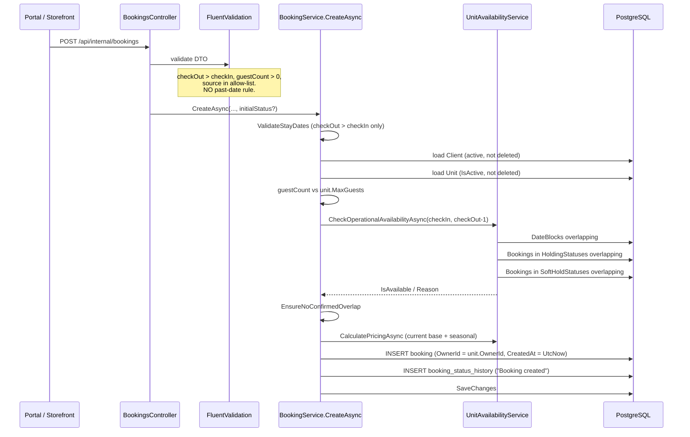
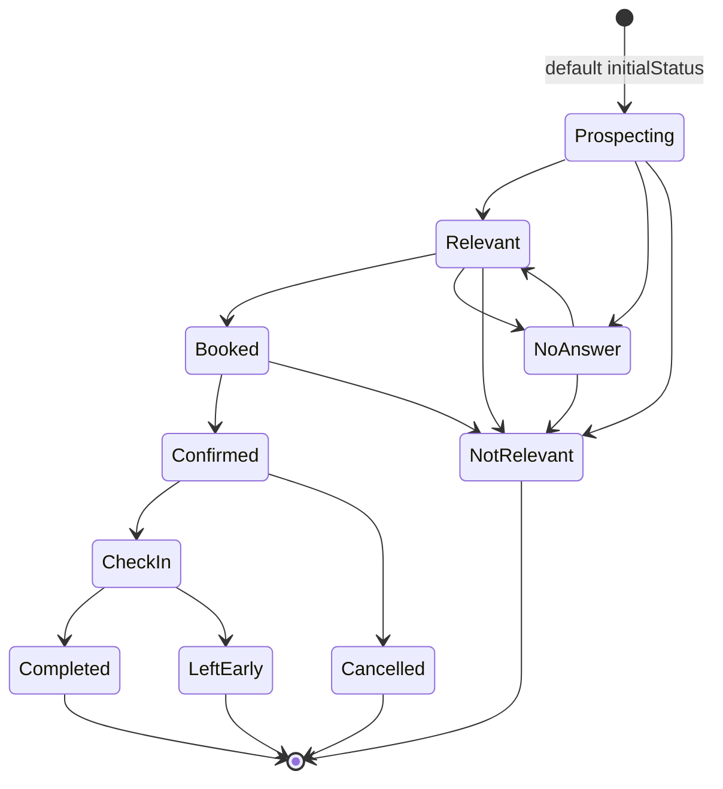
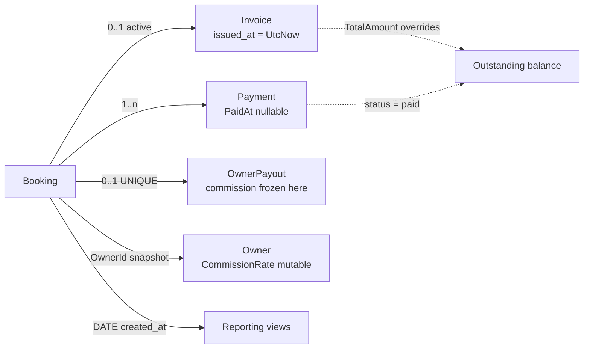
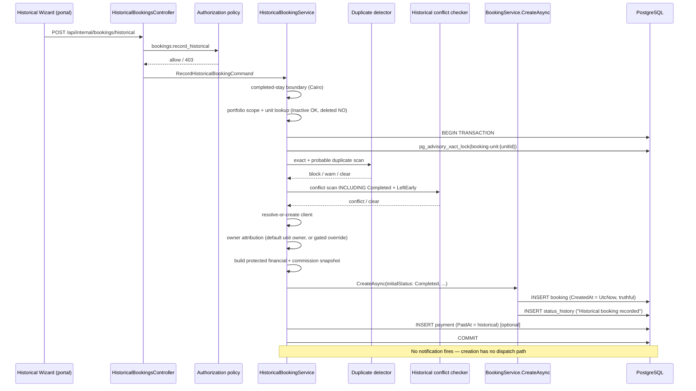
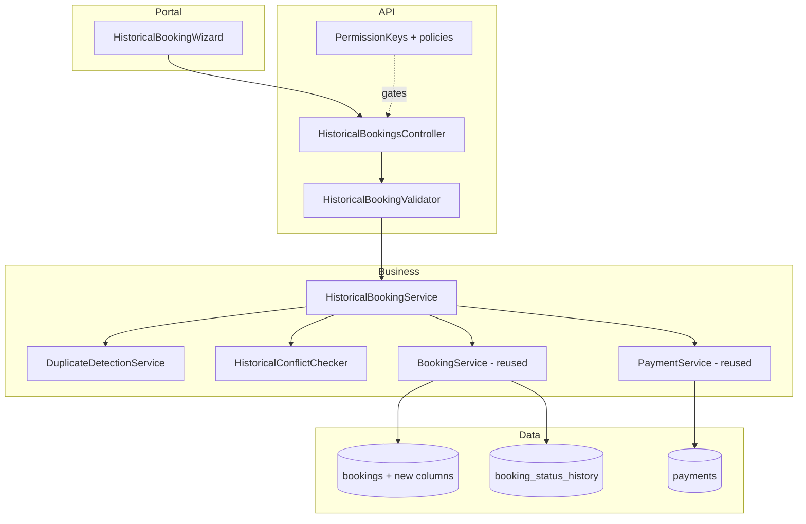
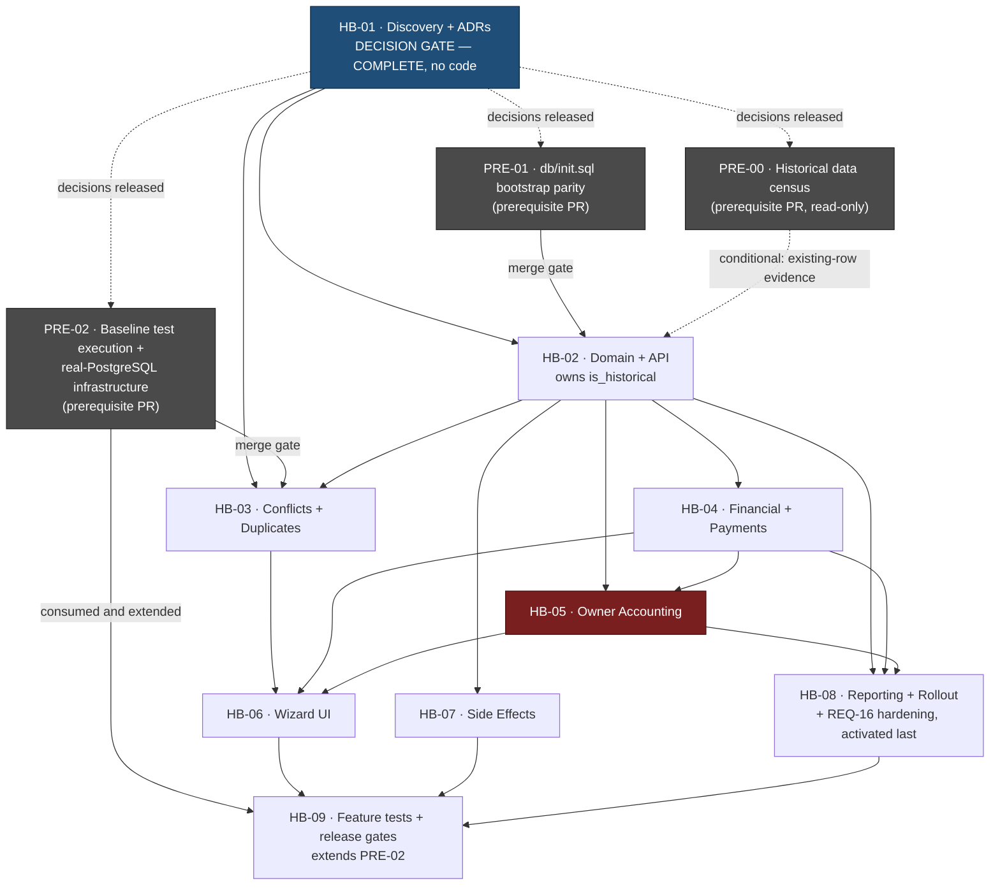

# Master Plan — Record Historical Booking (`تسجيل حجز سابق`)

> Navigation: [README](README.md) · [HB-01](01_TICKET_DISCOVERY_AND_ARCHITECTURE_DECISIONS.md) ·
> [HB-02](02_TICKET_HISTORICAL_BOOKING_DOMAIN_AND_API.md) · [HB-03](03_TICKET_AVAILABILITY_CONFLICTS_AND_DUPLICATE_PROTECTION.md) ·
> [HB-04](04_TICKET_FINANCIAL_SNAPSHOT_AND_HISTORICAL_PAYMENTS.md) · [HB-05](05_TICKET_OWNER_ACCOUNTING_AND_SETTLEMENT_ADJUSTMENTS.md) ·
> [HB-06](06_TICKET_HISTORICAL_BOOKING_WIZARD_UI.md) · [HB-07](07_TICKET_NOTIFICATIONS_AUTOMATIONS_AND_INTEGRATIONS.md) ·
> [HB-08](08_TICKET_REPORTING_AUDIT_OBSERVABILITY_AND_ROLLOUT.md) · [HB-09](09_TICKET_TEST_AUTOMATION_AND_RELEASE_GATES.md) ·
> [99 Scenarios](99_RELIABILITY_TEST_SCENARIOS.md)

---

## 1. Document metadata

| Field | Value |
|---|---|
| Title | Record Historical Booking — Master Architecture and Delivery Plan |
| Status | **DECIDED — ready for implementation.** No implementation started |
| Author | Planning agent (Claude Opus 5), read-only repository audit |
| Generated | 2026-07-28 |
| Governance decisions recorded | 2026-07-29 |
| Repository branch | `plan/historical-booking-feature` |
| Base commit SHA | `8dafb5a` — *Merge pull request #38 from HozaifaAlmelli/chore/sync-main-into-dev* |
| Planning-only notice | **This document changes no application behaviour.** No source file, migration, workflow, or database record was modified. No production system was accessed. |
| **Sole Project Owner and Decision Authority** | **Hozaifa Almelli** |
| Review lenses | Product · Engineering · Finance · Security · Operations — perspectives applied by the sole owner, not separate approvers |
| Open approval items | **None.** Every decision has a final status in the [decision record](DECISION_RATIFICATION_PACKET.md) |
| Active blockers | Three independent technical prerequisites only — [`PRE-00`](#211-prerequisites-before-any-historical-migration-lands), [`PRE-01`](#211-prerequisites-before-any-historical-migration-lands) and [`PRE-02`](#211-prerequisites-before-any-historical-migration-lands). None is delivered inside a feature ticket |
| Document revision | r2 |

### 1.1 Governance model

This project is designed, owned, reviewed and implemented by **one person**. There is no separate Product,
Engineering, Finance, Security or Operations team, and this plan does not pretend otherwise.

- **Decision authority:** the Sole Project Owner. One decision, one authority, recorded once.
- **Review lenses:** Product, Engineering, Finance, Security and Operations are *perspectives applied* when
  reaching a decision. Naming them records what was considered, not who considered it. They never require a
  separate name or signature, and the owner's name is not repeated per lens.
- **Decision statuses:** `OWNER APPROVED`, `DEFERRED`, or `BLOCKED BY TECHNICAL PREREQUISITE`.
- **No approval blockers exist.** Nothing in this pack waits on an unassigned role.

The honest limitation: single-owner governance provides no independent review. Where that matters most —
money, privilege boundaries, irreversible schema — the compensating controls are explicit risk acceptance,
explicit revisit triggers, and reliability scenarios written to fail loudly. See
[the governance model](DECISION_RATIFICATION_PACKET.md#governance-model).

---

## 2. Executive summary

**Current limitation.** KAZA Booking has no sanctioned way to record a booking that happened outside the
system. Operators who try are forced to either not record it (losing revenue, occupancy and owner
accounting truth) or to create it through the normal flow — which, as the audit discovered, silently
*permits* past dates but attaches no reason, no permission gate, no audit distinction, and no protection for
the agreed price.

**Business need.** Offline bookings are real: agreed by phone or in person, deposit taken in cash, stay
completed, then recorded days later. These records drive revenue reports, payment balances, customer and
KAZA accounting, owner entitlements and settlements, occupancy history, and financial reconciliation.

**Target outcome.** A separate, permission-gated, server-validated *Record Historical Booking* flow that
writes a truthful record: real system timestamps, an explicit historical agreement date, an explicit
late-entry reason, the actual agreed money, the actual payment date, correct owner attribution, full audit —
and **no** time-sensitive customer or operational automation.

**Why this is not a simple date-picker change.** Four reasons, each proven in
[§7](#7-confirmed-repository-findings):

1. The normal flow's past-date "rule" does not exist server-side. Simply adding a historical flow leaves the
   unguarded path open, making the new permission meaningless. Hardening is therefore in scope.
2. `Completed` bookings are invisible to the availability conflict query, so a naive implementation would
   silently permit duplicate historical stays on the same unit and dates.
3. Booking amounts are recomputed from *current* pricing on every create **and every edit**, so a historical
   agreed price cannot survive without schema change and a repricing guard.
4. All reporting buckets on `bookings.created_at`, so a stay from last month recorded today lands in
   *today's* revenue unless reporting is given a stay-date dimension.

**Highest-risk domains,** in order: owner attribution and commission truth (no ownership history exists);
financial snapshot integrity (recompute-on-update destroys it); historical overlap detection (currently
absent); reporting period attribution; and duplicate late entry.

**Recommended strategy.** Nine dependency-ordered tickets. HB-01 is a gating discovery/ADR ticket that also
carries the normal-flow hardening scope. The historical command reuses `BookingService.CreateAsync`'s
existing `initialStatus` parameter to write directly into `Completed` — no fabricated lifecycle transitions
— inside one transaction under the existing advisory lock, with a single truthful audit event. Side-effect
suppression is achieved *by construction* rather than by a flag, because booking creation triggers no
notifications and the only background job filters on a status the historical record will never hold.

---

## 3. Problem statement

The concrete case this feature exists to serve:

| Day | Event | System state today |
|---|---|---|
| Day 1 | Guest agrees a booking by phone. Deposit paid in cash to a KAZA representative. | Nothing recorded. |
| Day 2–5 | The stay happens. Guest checks in and out. | Nothing recorded. Unit shows as available for those dates. |
| Day 10 | Operations realises the booking was never entered and needs to record it. | No sanctioned flow. The unit's occupancy history, the revenue for those nights, the cash already collected, and the owner's entitlement are all missing. |

Recording it must answer, separately and truthfully:

- **When was it entered?** Day 10 (real system time — must not be falsified).
- **When was it agreed?** Day 1 (historical fact — needs a home).
- **When was money received?** Day 1 (historical fact — `Payment.PaidAt` can hold this).
- **When did the stay occur?** Day 2–5 (`check_in_date` / `check_out_date`).
- **Who recorded it, and why so late?** Authenticated actor + a required reason.

`DECISION REQUIRED` [OQ-03](#32-open-questions): whether a deposit taken on Day 1 should also appear in
Day-1 cash-position reporting, or only from the recorded date. Recommended default: `PaidAt` drives
payment reporting; recorded date drives entry audit.

---

## 4. Goals

| ID | Goal |
|---|---|
| REQ-01 | Record a completed historical stay through a dedicated, separate operational flow |
| REQ-02 | Never backdate `CreatedAt` or any system audit timestamp |
| REQ-03 | Capture the historical agreement date distinctly from the recorded date |
| REQ-04 | Capture a mandatory late-entry reason and the original booking source |
| REQ-05 | Preserve the **actual agreed** financial values, immune to later repricing |
| REQ-06 | Record historical payments with their real effective date and manual method |
| REQ-07 | Attribute revenue to the correct owner, with mandatory review and controlled override |
| REQ-08 | Snapshot the commercial split so later `Owner.CommissionRate` edits cannot rewrite history |
| REQ-09 | Prevent overlapping bookings, including historical-vs-historical |
| REQ-10 | Prevent duplicate late entry of the same offline booking |
| REQ-11 | Require a dedicated permission; enforce it server-side |
| REQ-12 | Produce a truthful audit event without fabricating lifecycle transitions |
| REQ-13 | Suppress time-sensitive customer and operational automation |
| REQ-14 | Keep financial, accounting and reporting updates enabled |
| REQ-15 | Preserve availability integrity for all existing flows |
| REQ-16 | Harden the normal booking flow so it genuinely rejects invalid past stays |
| REQ-17 | Support units that are inactive but not deleted |
| REQ-18 | Make reporting reconcilable by both stay period and recorded period |
| REQ-19 | Guarantee atomic creation — no partial financial or accounting state |
| REQ-20 | Introduce no hold policy of any kind |

---

## 5. Non-goals

| Non-goal | Rationale |
|---|---|
| Unlocking past dates globally in the normal flow | Opposite of REQ-16; the normal flow must *gain* a restriction |
| Allowing overlapping bookings | REQ-09; conflict reconciliation is a separate high-privilege feature |
| Temporary holds, hold expiry, provisional blocks, hold jobs/tables/statuses | REQ-20 — KAZA Booking has no hold policy and must not gain one |
| Falsifying `CreatedAt` / `UpdatedAt` / `ChangedAt` | REQ-02 |
| Changing production data during implementation | Safety rule |
| Bulk or CSV historical import | v1 is single-record operator entry; bulk multiplies every risk |
| Ongoing stays that began in the past and have not ended | v1 scope limit; see [OQ-04](#32-open-questions) |
| Silently mutating a finalized owner settlement | REQ-07/REQ-08 |
| Replaying past notifications | REQ-13 |
| Payment-gateway simulation or fabricated transaction identifiers | REQ-06 |
| Date-ranged ownership history model | Deferred epic — [HB-05 §35](05_TICKET_OWNER_ACCOUNTING_AND_SETTLEMENT_ADJUSTMENTS.md#35-future-architecture-epic-date-ranged-unit-ownership) |
| Broad refactor of booking, pricing, or reporting subsystems | Risk containment |

---

## 6. Current-state architecture

### 6.1 Repository map (relevant subset)

| Path | Role |
|---|---|
| `RentalPlatform.API/Controllers/BookingsController.cs` | Booking endpoints; `[Authorize(Policy = PermissionKeys.BookingsWrite)]` on writes |
| `RentalPlatform.API/Validators/BookingValidators.cs` | FluentValidation DTO rules |
| `RentalPlatform.API/Authorization/PermissionKeys.cs` | Permission constants (`area:action`) |
| `RentalPlatform.API/Services/AutoCompleteBookingsJob.cs` | The **only** hosted background service |
| `RentalPlatform.Business/Services/BookingService.cs` | Booking creation, update, overlap guards |
| `RentalPlatform.Business/Services/BookingLifecycleService.cs` | Status transitions, invoice auto-create, client notification |
| `RentalPlatform.Business/Services/UnitAvailabilityService.cs` | Availability + pricing calculation |
| `RentalPlatform.Business/Services/OwnerPayoutService.cs` | Owner payout rows |
| `RentalPlatform.Business/Services/InvoiceService.cs` | Invoice lifecycle and numbering |
| `RentalPlatform.Business/Services/PaymentService.cs` | Payments |
| `RentalPlatform.Shared/Constants/BookingStatusTransitions.cs` | Status graph + status sets |
| `RentalPlatform.Shared/Constants/BookingHistoryEvents.cs` | Audit note constants |
| `RentalPlatform.Data/Entities/` | EF entities |
| `db/migrations/` | Raw SQL migrations (`NNNN_name.sql` + `_verify` + `_rollback`) |
| `rental-platform/` | Next.js operator portal |
| `demo/` | Next.js public storefront |

### 6.2 Booking creation data flow (current)



### 6.3 Status lifecycle (current)



Status **sets** that govern behaviour (`BookingStatusTransitions.cs`):

| Set | Members | Line |
|---|---|---|
| `HoldingStatuses` | Booked, Confirmed, CheckIn | `:39` |
| `SoftHoldStatuses` | Prospecting, Relevant | `:44` |
| `ActiveAvailabilityHoldStatuses` | Prospecting, Relevant, Booked, Confirmed, CheckIn | `:46-53` |
| `FinanceEligibleStatuses` | Booked, Confirmed, CheckIn, **Completed**, **LeftEarly** | `:61-70` |

### 6.4 Payment, owner and reporting flows (current)



---

## 7. Confirmed repository findings

Full detail, with quotes, lives in
[HB-01 §5](01_TICKET_DISCOVERY_AND_ARCHITECTURE_DECISIONS.md#5-current-repository-behavior). Summary:

| ID | Finding | Label | Evidence | Impact on this feature |
|---|---|---|---|---|
| F-01 | No server-side past-date rule exists anywhere | `CONFIRMED` | `BookingService.cs:463-467`; `BookingValidators.cs` (whole file); `db/migrations/0016_create_bookings.sql`; only guard is `demo/src/components/ui/UnitBookingWidget.tsx:324` | Hardening is in scope (REQ-16); the historical permission is meaningless without it |
| F-02 | `Completed`/`LeftEarly` excluded from all availability conflict sets | `CONFIRMED` | `BookingStatusTransitions.cs:39,44,46-53`; `UnitAvailabilityService.cs:48-74` | Historical-vs-historical overlap is invisible; needs a dedicated conflict set (REQ-09) |
| F-03 | Owner payouts are one row per booking; no period/statement tables | `CONFIRMED` | `owner_payouts` DDL with `ux_owner_payouts_booking_id` UNIQUE; `OwnerPayoutService.cs:107-123` | No paid statement can be silently mutated; the closed-period risk largely dissolves |
| F-04 | No outbox, MediatR, domain events; exactly one hosted service | `CONFIRMED` | `Program.cs:311`; greps for `Outbox`/`DomainEvent`/`MediatR` return nothing | Suppression achievable by construction, no flag needed (REQ-13) |
| F-05 | `AutoCompleteBookingsJob` defines the completed-stay boundary in `Africa/Cairo` | `CONFIRMED` | `AutoCompleteBookingsJob.cs:18,70,86-87,133-143` | Gives an authoritative date boundary; and the job excludes `Completed`, so historical records are untouched |
| F-06 | `CreateAsync` already accepts `initialStatus`; `Completed` is terminal | `CONFIRMED` | `BookingService.cs:140,217`; `BookingStatusTransitions.cs:18` | Direct-to-`Completed` creation is possible without faking transitions (REQ-12) |
| F-07 | Amounts recomputed from current pricing at create **and every update** | `CONFIRMED` | `BookingService.cs:213,231-232` and `:428,439-440` | A historical agreed price would be destroyed; migration + repricing guard required (REQ-05) |
| F-08 | `ck_bookings_source` restricts source to 5 values | `CONFIRMED` | `db/migrations/0016_create_bookings.sql:24` | "walk-in"/"offline"/"external platform" need a migration or a separate column (REQ-04) |
| F-09 | All reporting buckets on `DATE(bookings.created_at)` | `CONFIRMED` | `0041_...:49`, `0042_...:65,87`, `ReportingFinanceAnalyticsService.cs:75-81` | Historical revenue lands in today's bucket (REQ-18) |
| F-10 | One invoice auto-create site (Booked→Confirmed); number encodes record date | `CONFIRMED` | `BookingLifecycleService.cs:194-199`; `InvoiceService.cs:500-518,502` | Direct-to-`Completed` creates no invoice; must be explicit |
| F-11 | Retired units blocked: `IsActive` required; availability throws on inactive | `CONFIRMED` | `BookingService.cs:156-165`; `UnitAvailabilityService.cs:33-34` | Needs a historical lookup path (REQ-17) |
| F-12 | `Payment.PaidAt` is a real effective date; methods allow `cash`/`bank_transfer`/`wallet`; amount must be `> 0`; **no recorded-by actor column** | `CONFIRMED` | `Payment.cs:14-15`; `db/migrations/0022_create_payments.sql:18-19` | Historical payment date needs no migration; actor audit does; refunds not representable |
| F-13 | `Booking.OwnerId` is snapshotted from `unit.OwnerId`, explicitly not caller input | `CONFIRMED` | `BookingService.cs:225` | Owner attribution already immutable-by-default; override must be deliberate and gated |
| F-14 | Permission convention is `area:action`, `VARCHAR(50)`, policy-based | `CONFIRMED` | `PermissionKeys.cs:13-33`; `BookingsController.cs:98,119,140`; `db/migrations/0053_create_dynamic_rbac.sql:22,68-70` | Dictates exact new permission naming and seeding |

---

## 8. Target-state architecture



### Component view



---

## 9. Domain invariants

Non-negotiable. Each maps to at least one negative acceptance criterion and one reliability scenario.

| ID | Invariant |
|---|---|
| INV-01 | `CreatedAt`, `UpdatedAt`, `ChangedAt` are always real system time. Never operator-supplied. |
| INV-02 | Historical effective dates (`ActualBookedAt`, `Payment.PaidAt`) are explicit, separate columns. |
| INV-03 | The normal booking flow retains its rules and *gains* past-date rejection (REQ-16). |
| INV-04 | No overlapping booking may be created — including historical-vs-historical. |
| INV-05 | Historical creation is atomic: booking + history + payment commit together or not at all. |
| INV-06 | No partial financial or accounting state is ever persisted. |
| INV-07 | No customer-facing or time-sensitive automation fires for a historical record. |
| INV-08 | An exact duplicate is blocked or idempotently absorbed — never silently duplicated. |
| INV-09 | No finalized owner payout is silently mutated. |
| INV-10 | The permission is enforced server-side; the client cannot assert it. |
| INV-11 | The audit actor is the authenticated admin user, never a client-supplied identifier. |
| INV-12 | Unit and owner attribution are authorization-scoped; cross-portfolio injection is rejected. |
| INV-13 | Reporting remains reconcilable: stay-period and recorded-period totals both derivable. |
| INV-14 | `Booking.OwnerId` and the commission snapshot are immutable after creation except via the dedicated correction workflow. |
| INV-15 | The protected agreed amount is never overwritten by automatic repricing. |
| INV-16 | No hold semantics of any kind are introduced. |
| INV-17 | Ownership that cannot be confidently determined **blocks** creation; it never defaults silently. |

---

## 10. Date and timezone model

| Aspect | Finding | Label |
|---|---|---|
| Business timezone | `Africa/Cairo`, with fallback `Egypt Standard Time` (`AutoCompleteBookingsJob.cs:18,133-143`) | `CONFIRMED` |
| Stay dates | `DateOnly` in C# / `DATE` in Postgres (`Booking.cs:15-16`; `0016_create_bookings.sql`) — **timezone-free**, no conversion hazard | `CONFIRMED` |
| Audit timestamps | `DateTime` / `TIMESTAMP` (without time zone), written as `DateTime.UtcNow` | `CONFIRMED` |
| Payment effective date | `Payment.PaidAt`, `TIMESTAMP NULL` (`Payment.cs:14`) | `CONFIRMED` |
| Completed-stay boundary | Repository's own definition: `CheckOutDate <= DateOnly.FromDateTime(cairoNow).AddDays(-1)` (`AutoCompleteBookingsJob.cs:70`) | `CONFIRMED` |
| DST | Egypt observes DST (reintroduced 2023). `TimeZoneInfo` handles it; because stay dates are `DateOnly`, DST affects only the *derivation of "today"*, never a stored stay date | `INFERRED` |

**Recommended boundary** (`PROPOSED`, ADR-03): a stay is *completed historical* when

```
checkOutDate <= DateOnly.FromDateTime(TimeZoneInfo.ConvertTimeFromUtc(DateTime.UtcNow, CairoTimeZone)).AddDays(-1)
```

This is deliberately identical to `AutoCompleteBookingsJob`'s cutoff so the two definitions cannot drift.
Consequence: **checkout on the current Cairo business date is NOT yet complete** and is rejected by the
historical flow — matching how the platform already treats such a stay (the job leaves it in `CheckIn`).

### Validation matrix — date inputs

| # | Case | Normal flow (after REQ-16 hardening) | Historical flow | Scenario |
|---|---|---|---|---|
| D-1 | checkOut ≤ checkIn | 400 | 400 | `SC-DATE-05` |
| D-2 | checkIn and checkOut both in the future | Allowed | 400 — use the normal flow | `SC-DATE-03` |
| D-3 | checkIn past, checkOut future (ongoing) | 400 | 400 — out of v1 scope | `SC-DATE-02` |
| D-4 | checkOut = today (Cairo) | 400 | 400 — not yet complete | `SC-DATE-04` |
| D-5 | checkOut = yesterday (Cairo) | 400 | **Allowed** | `SC-DATE-01` |
| D-6 | checkIn = today, checkOut = tomorrow | Allowed | 400 | `SC-DATE-06` |
| D-7 | Both far in the past | 400 | Allowed | `SC-DATE-01` |
| D-8 | Boundary crossing at Cairo midnight during the request | Deterministic: evaluated once, server-side | Same | `SC-DATE-07` |
| D-9 | DST transition inside the stay | No effect (`DateOnly`) | No effect | `SC-DATE-08` |
| D-10 | Client sends a timezone-qualified datetime | Coerced to `DateOnly`, server-authoritative | Same | `SC-DATE-09` |

---

## 11. Proposed data model

`PROPOSED` — final column names to be ratified in HB-01 (ADR-05) against
`db/migrations` conventions.

| Concept | Existing home? | Verdict | Proposed shape | Index | Migration risk |
|---|---|---|---|---|---|
| Is-historical marker | none | **NEEDS NEW** | `bookings.is_historical BOOLEAN NOT NULL DEFAULT false` | partial index where true | Low — defaulted |
| Original agreement date | none | **NEEDS NEW** | `bookings.actual_booked_at DATE NULL` | none | Low |
| Late-entry reason | `internal_notes` only | **NEEDS NEW** (overloading rejected) | `bookings.historical_entry_reason VARCHAR(50) NULL` + CHECK | none | Low |
| Reason free-text | `internal_notes` | **EXISTS** (append) | reuse `internal_notes` | — | None |
| Original booking source | `source` blocked by `ck_bookings_source` (F-08) | **NEEDS NEW** | `bookings.original_source VARCHAR(50) NULL` + own CHECK | none | Low — leaves `source` untouched |
| External reference | none | **NEEDS NEW** | `bookings.external_reference VARCHAR(100) NULL` | unique partial where not null | Medium — uniqueness semantics |
| Protected agreed amount | `final_amount` recomputed (F-07) | **NEEDS NEW** | `bookings.agreed_amount DECIMAL(12,2) NULL` + repricing guard | none | **Medium-high** — changes `UpdateAsync` |
| Commission snapshot | frozen only on payout (F-03) | **NEEDS NEW** | `bookings.snapshot_commission_rate DECIMAL(5,2) NULL`, `snapshot_owner_amount DECIMAL(12,2) NULL`, `snapshot_kaza_amount DECIMAL(12,2) NULL` | none | Medium |
| Owner snapshot | `bookings.owner_id` (F-13) | **EXISTS** | reuse; add immutability guard | existing | None |
| Owner override audit | none | **NEEDS NEW** | `bookings.owner_override_reason VARCHAR(50) NULL`, `owner_override_note TEXT NULL` | none | Low |
| Payment effective date | `payments.paid_at` (F-12) | **EXISTS** | reuse | existing `ix_payments_paid_at` | None |
| Payment recorded-by actor | none (F-12) | **NEEDS NEW** | `payments.created_by_admin_user_id UUID NULL` FK | FK index | Low |
| Notification suppression marker | not needed (F-04) | **NOT REQUIRED** | suppression is by construction | — | None |
| Adjustment link | no adjustment model (F-03) | **NOT REQUIRED in v1** | per-booking payouts make it unnecessary | — | None |
| Currency | no column anywhere | **BLOCKED** → [OQ-05](#32-open-questions) | single-currency assumed | — | — |

**Migration verdict:** `CONFIRMED REQUIRED`. Contrary to the original brief's hope, the protected agreed
amount (F-07), commission snapshot (F-03), historical dates, reason, and source (F-08) have no valid home.
Overloading `internal_notes` is explicitly rejected — see ADR-06.

### 11.1 Migration ownership matrix

**This table is the single authority on who creates what.** Every proposed column, constraint, index and
table appears exactly once, owned by exactly one ticket. A ticket that *reads* an object it does not own has
a **dependency**, never shared ownership. No object is created by "a coordinated migration"; that phrasing
is retired from this pack, because coordinated ownership is what produced the duplicate claims this matrix
removes.

**Domain split** — `PROPOSED`, ratified as
[D-MIG-01](DECISION_RATIFICATION_PACKET.md#d-mig-01--migration-ownership):

| Ticket | Owns |
|---|---|
| **HB-02** | Historical-booking identity, audit metadata, reason, creation mode, and booking-level lifecycle fields |
| **HB-04** | The agreed financial snapshot and historical payment fields |
| **HB-05** | Owner commission, payout snapshot, attribution, override and adjustment-related fields |
| **HB-08** | Reporting views only — no table or column |

**Object-level assignment.** Migration numbers are illustrative of *order*, not reserved; the latest
observed number is `0057` (`db/migrations/0057_add_owner_contact_fields.sql`, `CONFIRMED`) and each
implementer takes the next free number at branch time.

| # | Object | Kind | **Owner** | Depends on (read, not created) |
|---|---|---|---|---|
| 1 | `bookings.is_historical` | column `BOOLEAN NOT NULL DEFAULT false` | **HB-02** | — |
| 2 | `bookings.actual_booked_at` | column `DATE NULL` | **HB-02** | — |
| 3 | `bookings.historical_entry_reason` | column `VARCHAR(50) NULL` | **HB-02** | — |
| 4 | `bookings.original_source` | column `VARCHAR(50) NULL` | **HB-02** | #10 |
| 5 | `bookings.external_reference` | column `VARCHAR(100) NULL` | **HB-02** | — |
| 6 | `ix_bookings_is_historical` | partial index `WHERE is_historical` | **HB-02** | #1 |
| 7 | `ux_bookings_external_reference` | unique partial index `WHERE external_reference IS NOT NULL`, created `CONCURRENTLY` | **HB-02** | #5 |
| 8 | `ck_bookings_actual_booked_at_requires_historical` | CHECK | **HB-02** | #1, #2 |
| 9 | `ck_bookings_historical_entry_reason` | CHECK, allow-list | **HB-02** | #3 |
| 10 | `booking_original_sources` **+** `fk_bookings_original_source` | table `(code PK, label, is_active, created_at, updated_at)`, seeded with four codes, plus the FK from #4 `ON DELETE RESTRICT` | **HB-02** | — |
| 11 | `ck_bookings_historical_fields_coherent` | CHECK | **HB-02** | #1–#4 |
| 12 | `idempotency_keys` | table, PK `(actor_admin_user_id, endpoint, key)` | **HB-02** | — (the idempotency contract belongs to HB-02's endpoint; **not** optional, deferred, or HB-03's) |
| 13 | `bookings:record_historical` permission seed | data seed | **HB-02** | RBAC tables from `0053` |
| 14 | `bookings.agreed_amount` | column `DECIMAL(12,2) NULL` | **HB-04** | — |
| 15 | `ck_bookings_agreed_amount_non_negative` | CHECK | **HB-04** | #14 |
| 16 | `payments.created_by_admin_user_id` | column `UUID NULL` + FK `→ admin_users(id) ON DELETE SET NULL` | **HB-04** | — |
| 17 | `ix_payments_created_by_admin_user_id` | index | **HB-04** | #16 |
| 18 | `bookings.snapshot_commission_rate` | column `DECIMAL(5,2) NULL` | **HB-05** | — |
| 19 | `bookings.snapshot_owner_amount` | column `DECIMAL(12,2) NULL` | **HB-05** | — |
| 20 | `bookings.snapshot_kaza_amount` | column `DECIMAL(12,2) NULL` | **HB-05** | — |
| 21 | `bookings.owner_override_reason` | column `VARCHAR(50) NULL` | **HB-05** | — |
| 22 | `bookings.owner_override_note` | column `TEXT NULL` | **HB-05** | — |
| 23 | `ck_bookings_snapshot_commission_rate_range` | CHECK | **HB-05** | #18 |
| 24 | `ck_bookings_snapshot_amounts_non_negative` | CHECK | **HB-05** | #19, #20 |
| 25 | `ck_bookings_snapshot_split_reconciles` | CHECK `owner + kaza = agreed` when all three present | **HB-05** | #14 (HB-04), #19, #20 |
| 26 | `ck_bookings_historical_snapshot_complete` | CHECK | **HB-05** | #1 (HB-02), #14 (HB-04), #18–#20 |
| 27 | `ck_bookings_owner_override_reason` | CHECK, allow-list | **HB-05** | #21 |
| 28 | `ck_bookings_owner_override_note_required` | CHECK | **HB-05** | #21, #22 |
| 28b | `bookings:override_owner` permission seed | data seed | **HB-05** | RBAC tables from `0053` |
| 29 | `reporting_booking_stay_daily_summary` | view, NEW | **HB-08** | #1, #14 |
| 30 | `reporting_finance_stay_daily_summary` | view, NEW | **HB-08** | #1, #14 |
| 31 | `reporting_historical_entry_reconciliation` | view, NEW | **HB-08** | #1, #2, #4, #14 |
| 32 | `reporting_booking_daily_summary` | view, `CREATE OR REPLACE`, **append-only** | **HB-08** | #1 |
| 33 | `reporting_finance_daily_summary` | view, `CREATE OR REPLACE`, **append-only** | **HB-08** | #1, #14 |

**Ownership resolutions applied.** Earlier drafts assigned some of these twice; each is now settled:

| Object | Previously claimed by | Resolved to | Why |
|---|---|---|---|
| The three `snapshot_*` columns | HB-04 **and** HB-05 | **HB-05** | They are owner-commission fields; HB-05 owns the commission domain. HB-04 reads them for the reconciliation assertion |
| `ux_bookings_external_reference` | HB-02 declared it; HB-03 assigned it to "HB-04's migration" | **HB-02** | It indexes `external_reference`, an HB-02 column. HB-03 depends on it for duplicate detection |
| `idempotency_keys` | HB-03 assigned it to "HB-04's migration" and called the header advisory | **HB-02** | Idempotency is a property of the HB-02 endpoint. Ratified in full by [D-HB02-IDEM](DECISION_RATIFICATION_PACKET.md#d-hb02-idem--idempotency-ownership-and-contract): the header is **required**, storage is **not** optional or deferred, and HB-03 keeps booking-level duplicate protection |
| `bookings:override_owner` permission seed | HB-02 §15.4 | **HB-05** | The permission gates the owner override, and HB-02 no longer has an override to gate ([D-HB02-OWN](DECISION_RATIFICATION_PACKET.md#d-hb02-own--owner-attribution-boundary)). Seeding a permission whose behaviour does not yet exist would grant a claim with nothing behind it |
| The `original_source` vocabulary | HB-02 §15.3 as a `CHECK` allow-list | **HB-02**, as a **table** | Unchanged owner, changed mechanism. [D-HB02-06](DECISION_RATIFICATION_PACKET.md#d-hb02-06--original_source-vocabulary) requires a stable code, a human-readable label and active/inactive behaviour; a `CHECK` constraint can carry none of them |
| `ck_bookings_snapshot_split_reconciles` | HB-04 §15 (unnamed composite CHECK) **and** HB-05 | **HB-05** | One constraint, one owner. It spans `agreed_amount`, so HB-05's migration is ordered after HB-04's |
| `bookings.is_historical` | described as "HB-02/HB-04" in HB-05 §15 | **HB-02** | Single owner; HB-04, HB-05 and HB-08 all read it |
| `db/init.sql` missing `0057` | HB-09 §15 | **Prerequisite PR `PRE-01`** | A pre-existing bootstrap defect, unrelated to this feature — see [§21.1](#211-prerequisites-before-any-historical-migration-lands) |

**Migration order, derived from the dependency column** — three additive, independently deployable
migrations, each with its own `_verify.sql` and `_rollback.sql`, plus HB-08's view migration last:

```
HB-02 (#1–#13)  →  HB-04 (#14–#17)  →  HB-05 (#18–#28)  →  HB-08 (#29–#33)
```

Each `_verify.sql` must assert the presence of the upstream columns it depends on **before** asserting its
own objects, and fail loudly rather than silently if they are absent.

---

## 12. API and command design

### 12.1 The canonical historical contract

This subsection is **normative**. Every other document and every reliability scenario in this pack
restates it and must not diverge. Where an older draft said `POST /api/bookings/historical` or `201
Created`, that text has been corrected; both forms are retired and neither may be reintroduced.

| Property | Canonical value | Basis |
|---|---|---|
| Method | `POST` | — |
| Route | `/api/internal/bookings/historical` | `CONFIRMED` — every internal booking route lives under `[Route("api/internal/bookings")]`, `RentalPlatform.API/Controllers/BookingsController.cs:21`; sibling lifecycle routes at `BookingLifecycleController.cs:16` |
| Success status | **`200 OK`** | `CONFIRMED` — the repository returns `Ok(ApiResponse<T>.CreateSuccess(...))` from every booking `POST`, `BookingsController.cs:114` (create) and `:135` (quick create). `201 Created` is **not** used anywhere in this API |
| Success body | `ApiResponse<HistoricalBookingResponse>` | Same envelope as the existing create endpoints |
| Policy | `bookings:record_historical` (new) | `[Authorize(Policy = ...)]`, matching `BookingsController.cs:98` |
| Content type | `application/json`, camelCase | Existing serializer configuration |

Error statuses are in the error contract below; they are unaffected by this canonicalization.

### 12.2 Normal create versus historical create

| Aspect | Normal create | Historical create |
|---|---|---|
| Route | `POST /api/internal/bookings` | `POST /api/internal/bookings/historical` |
| Success status | `200 OK` | `200 OK` |
| Policy | `PermissionKeys.BookingsWrite` (`bookings:write`) | `bookings:record_historical` (new) |
| Past dates | Accepted today; **rejected** once REQ-16 hardening is activated in the HB-08 rollout | Required to be fully past |
| Initial status | `Prospecting` (or caller-supplied) | Always `Completed` |
| Reason | n/a | Mandatory |
| Amount | Computed from current pricing | **Operator-entered `agreedAmount`, required, persisted verbatim, never defaulted from current pricing** ([D-HB02-AMT](DECISION_RATIFICATION_PACKET.md#d-hb02-amt--financial-truth-boundary)) |
| Owner | `unit.OwnerId`, never caller input | **Server-resolved current unit owner, never caller input.** Uncertain ownership is refused with `409 OWNER_ATTRIBUTION_REQUIRES_REVIEW`; override arrives with HB-05 ([D-HB02-OWN](DECISION_RATIFICATION_PACKET.md#d-hb02-own--owner-attribution-boundary)) |
| Payment | Separate call | **None on this route.** [D-PAY-01](DECISION_RATIFICATION_PACKET.md#d-pay-01--historical-payment-policy) is `OWNER APPROVED` for a separate privileged command |
| Invoice | Auto-created on `Booked → Confirmed` | **None in v1.** [D-INV-01](DECISION_RATIFICATION_PACKET.md#d-inv-01--invoice-policy) is `OWNER APPROVED` |
| Notifications | On transitions | None |
| Idempotency | 30-second `RecentDuplicateWindow` (`BookingService.cs:19`) | **`Idempotency-Key` header, required**, scoped to actor + endpoint + key, plus HB-03's business duplicate rules ([D-HB02-IDEM](DECISION_RATIFICATION_PACKET.md#d-hb02-idem--idempotency-ownership-and-contract)) |

### 12.3 Error contract — transport and codes

**Transport** is ratified by [D-HB02-03](DECISION_RATIFICATION_PACKET.md#d-hb02-03--machine-readable-error-transport):
an **optional `Code` property on the shared `ApiResponse` contract**, populated from coded business
exceptions. Every existing envelope field is preserved, human-readable messages are unaffected, the code is
**never** placed inside `errors[0]`, and unrelated endpoints are not required to migrate.

**Codes are `UPPER_SNAKE_CASE`** and their statuses follow the repository's existing exception mapping
(`BusinessValidationException` → 400, `NotFoundException` → 404, `ConflictException` → 409). The lowercase
forms used in earlier drafts were prose labels, never a shipped contract — the envelope has no code field
today — and are retired.

| Condition | Status | Code | Owner |
|---|---|---|---|
| Validation failure | 400 | `VALIDATION_ERROR` | HB-02 |
| Missing permission | 403 | *(none — empty policy response)* | HB-02 |
| Client reference not exactly one of `clientId` / `newClient` | 400 | `CLIENT_REFERENCE_INVALID` | HB-02 |
| `clientId` not found | 404 | `CLIENT_NOT_FOUND` | HB-02 |
| `newClient` phone already held | 409 | `CLIENT_PHONE_ALREADY_EXISTS` | HB-02 |
| `newClient` phone held by an inactive or soft-deleted non-selectable client | 409 | `CLIENT_PHONE_REQUIRES_REVIEW` | HB-02 |
| Unit not found | 404 | `UNIT_NOT_FOUND` | HB-02 |
| Assigned admin not found | 404 | `ADMIN_USER_NOT_FOUND` | HB-02 |
| Stay not yet complete | 400 | `HISTORICAL_CHECKOUT_NOT_COMPLETED` | HB-02 |
| `original_source` unknown or inactive | 400 | `ORIGINAL_SOURCE_INVALID` | HB-02 |
| `Idempotency-Key` absent or malformed | 400 | `IDEMPOTENCY_KEY_REQUIRED` | HB-02 |
| Key replayed with a different request | 409 | `IDEMPOTENCY_KEY_REUSED` | HB-02 |
| Key claimed but never completed | 409 | `IDEMPOTENCY_REQUEST_IN_PROGRESS` | HB-02 |
| Current unit ownership absent, multiple or ambiguous | 409 | `OWNER_ATTRIBUTION_REQUIRES_REVIEW` | HB-02 |
| `externalReference` already used | 409 | `EXTERNAL_REFERENCE_ALREADY_EXISTS` | HB-02 |
| Overlap incl. historical | 409 | `HISTORICAL_OVERLAP_CONFLICT` | HB-02 |
| Exact duplicate | 409 | `HISTORICAL_DUPLICATE_BOOKING` | HB-03 |
| Soft-deleted unit | 400 | `UNIT_DELETED_UNSUPPORTED` | HB-02 |
| Explicit owner confirmation absent (HB-05's added field) | 400 | `OWNER_ATTRIBUTION_REQUIRED` | HB-05 |
| Owner override without permission | 403 | `OWNER_OVERRIDE_FORBIDDEN` | HB-05 |
| Owner correction attempted against a settled payout | 409 | `OWNER_CORRECTION_SETTLEMENT_LOCKED` | HB-05 |
| Past stay dates on the **normal** endpoint | 400 | `STAY_DATES_IN_PAST` | HB-08 |

HB-02 owns the initial `HISTORICAL_OVERLAP_CONFLICT` transport. HB-03 owns the later expansion of
overlap and duplicate-detection behaviour, including the full historical conflict set.

`OWNER_ATTRIBUTION_REQUIRED` (HB-05, `400`, *the operator did not confirm*) and
`OWNER_ATTRIBUTION_REQUIRES_REVIEW` (HB-02, `409`, *the system cannot determine the owner*) are **two
different conditions** and must not be collapsed into one code.

The full HB-02 set, with the exception type behind each code, is
[HB-02 §14.4](02_TICKET_HISTORICAL_BOOKING_DOMAIN_AND_API.md#144-error-contract--machine-readable-codes-d-hb02-03).

**A client-supplied `allowPastDates` flag is explicitly rejected as a design.** A frontend boolean is not an
authorization decision; it would be forgeable, unauditable, and would leave one endpoint with two
contradictory validation modes. Separation of command is the control.

---

## 13. Validation matrix

| # | Rule | Layer | Failure | Scenario |
|---|---|---|---|---|
| V-01 | Stay fully completed per Cairo boundary | Service | 400 | `SC-DATE-01/02/04` |
| V-02 | `checkOut > checkIn` | Validator + service + DB CHECK | 400 | `SC-DATE-05` |
| V-03 | Unit exists, not soft-deleted | Service | 404/400 | `SC-AVAIL-09` |
| V-04 | Unit may be inactive (historical only) | Service | allowed | `SC-AVAIL-08` |
| V-05 | `guestCount > 0` and `<= unit.MaxGuests` | Validator + service | 400 | `SC-AVAIL-10` |
| V-06 | No overlap incl. `Completed`/`LeftEarly` | Service | 409 | `SC-AVAIL-02..06` |
| V-07 | No date-block conflict | Service | 409 | `SC-AVAIL-07` |
| V-08 | Not an exact duplicate | Service | 409 | `SC-DUP-01` |
| V-09 | Probable duplicate acknowledged | Service + UI | 409 until confirmed | `SC-DUP-05` |
| V-10 | Owner exists and is in portfolio scope | Service | 400/403 | `SC-OWN-05/06` |
| V-11 | Owner override permitted and reasoned | Service | 403/400 | `SC-OWN-04/07` |
| V-12 | Owner attribution explicitly confirmed | Service | 400 | `SC-OWN-08` |
| V-13 | `PaidAt` not in the future | Validator | 400 | `SC-PAY-06` |
| V-14 | Payment ≤ agreed amount unless overpayment allowed | Service | 400 | `SC-FIN-11` |
| V-15 | Amounts non-negative; payment `> 0` | Validator + DB CHECK | 400 | `SC-FIN-09/10` |
| V-16 | Reason supplied and in allow-list | Validator | 400 | `SC-SEC-09` |
| V-17 | Original source supplied and in allow-list | Validator | 400 | `SC-SEC-09` |
| V-18 | External reference unique when present | Service + partial unique index | 409 | `SC-DUP-02` |
| V-19 | Currency valid | `BLOCKED` — [OQ-05](#32-open-questions) | — | `SC-FIN-12` |
| V-20 | Client valid or creatable | Service | 400 | `SC-SEC-10` |
| V-21 | Caller holds `bookings:record_historical` | Policy | 403 | `SC-SEC-02` |

---

## 14. Financial model

| Value | Today | Historical flow | Invariant |
|---|---|---|---|
| Nightly rate | Live `unit.BasePricePerNight` + seasonal rows | Displayed as a *reference only* | Never authoritative for historical |
| `BaseAmount` | Computed sum | Computed sum, retained for comparison | — |
| `FinalAmount` | = `BaseAmount` | Set from the agreed amount | INV-15 |
| Agreed amount | **absent** | Operator-entered, protected | INV-15 |
| Discounts / fees / taxes | **no columns exist** | `BLOCKED` → [OQ-06](#32-open-questions); v1 folds them into the agreed total | — |
| Currency | **no column exists** | `BLOCKED` → [OQ-05](#32-open-questions) | — |
| Commission rate | Live `Owner.CommissionRate`, frozen only at payout | Snapshotted at creation | INV-14 |
| Owner amount | Derived at payout | Snapshotted | INV-14 |
| KAZA amount | Derived at payout | Snapshotted | INV-14 |
| Outstanding balance | `(invoice.TotalAmount ?? booking.FinalAmount) − Σ paid` | Same formula, over protected values | INV-13 |
| Rounding | `DECIMAL(12,2)`; commission `DECIMAL(5,2)` | Same; half-away-from-zero to 2dp | `SC-FIN-08` |

**Reconciliation invariant:** `snapshot_owner_amount + snapshot_kaza_amount = agreed_amount` (subject to the
fee/tax decision in OQ-06), enforced server-side, never trusted from the client.

---

## 15. Owner accounting and settlement model

Per the ratified hybrid decision (ADR-08), fully specified in
[HB-05](05_TICKET_OWNER_ACCOUNTING_AND_SETTLEMENT_ADJUSTMENTS.md):

| Aspect | v1 behaviour |
|---|---|
| Owner-at-stay determination | Not automatically derivable — no ownership history exists (F-03/F-13) |
| Default | `OwnerId = unit.OwnerId` |
| Review | **Mandatory** Owner & Accounting wizard step; explicit confirmation required |
| Override | Allowed only via the historical command, only with `bookings:override_owner`, with mandatory reason + note |
| Unknown ownership | **Blocks** final creation (INV-17). No silent default, no draft invention |
| Commission | Snapshotted at creation; later `Owner.CommissionRate` edits must not alter history |
| Immutability | `OwnerId` and snapshot never resynchronized from `Unit` on later edits (INV-14) |
| Correction | Dedicated high-privilege workflow with before/after audit |
| Open period | Payout created normally — payouts are per booking (F-03) |
| Closed/paid payout | Cannot be silently mutated; a *new* payout for a *new* booking is unaffected. Correcting an *existing* paid payout is `BLOCKED` → [OQ-07](#32-open-questions) |
| Ownership history | Deferred epic; must not block v1 |

---

## 16. Notification and automation policy

Derived from F-04 and F-05. Full matrix in
[HB-07](07_TICKET_NOTIFICATIONS_AUTOMATIONS_AND_INTEGRATIONS.md).

| Side effect | Trigger | Verdict for historical | Enforcement |
|---|---|---|---|
| Client status-change notification | `BookingLifecycleService.cs:69` → `:311` via `TransitionAsync` | **MUST NOT RUN** | By construction — historical never calls `TransitionAsync` |
| Booking-confirmed notification | Same, on `Confirmed` | **MUST NOT RUN** | Same |
| Invoice auto-create + issue | `BookingLifecycleService.cs:194-199` on Booked→Confirmed | **MUST NOT RUN implicitly** | Same; explicit creation only |
| `AutoCompleteBookingsJob` sweep | `Program.cs:311`; filters `BookingStatus == CheckIn` | **MUST NOT RUN** | Historical lands in `Completed`, outside the filter |
| Outstanding-balance admin alert | `AutoCompleteBookingsJob.cs:145-221` | **MUST NOT RUN** | Consequence of the above |
| Payment notification | none found | n/a | — |
| Payment gateway call | **none exists** | n/a | No integration in codebase |
| Outbox / domain events / webhooks | **none exist** | n/a | — |
| Housekeeping / cleaning / calendar tasks | **none exist** | n/a | — |
| External delivery (email/WhatsApp/Telegram) | `NotificationDispatchService` is a state machine only; no SMTP/HTTP | n/a | No delivery mechanism exists |
| Audit logging | Status history row | **MUST RUN** | Explicit |
| Financial / accounting update | Payout eligibility | **MUST RUN** | Explicit |
| Reporting update | Views over `bookings` | **MUST RUN** | Automatic |

**Conclusion:** no suppression flag is needed. Suppression is structural. This is stronger than a flag,
because it cannot be bypassed by a caller.

---

## 17. UI/UX flow

Full specification in [HB-06](06_TICKET_HISTORICAL_BOOKING_WIZARD_UI.md).

| Step | Content | Dynamic? |
|---|---|---|
| 1 | Origin & historical context — original source, agreement date, late-entry reason, external reference | Always |
| 2 | Stay & unit — dates (must be fully past), unit picker incl. inactive units, guest count | Always |
| 3 | Client — match existing or create new | Always |
| 4 | Financial — agreed amount, payment(s) with real `PaidAt`, method, reference | Always |
| 5 | **Owner & accounting** (`المالك والحسابات`) — current unit owner, credited owner, override, commission, owner/KAZA split, mandatory confirmation | Always (override controls shown only with permission) |
| 6 | Review & create — full summary plus mandatory warnings | Always |

**Mandatory review-step warnings:** a completed historical booking is being recorded; reports will be
affected; owner accounting may be affected; notifications will **not** be sent; system audit timestamps
remain current.

**Portal language:** `CONFIRMED` — the operator portal is English and has no i18n system. The Arabic step
name is documented for product parity; introducing Arabic UI copy into `/admin` is out of scope and would
require i18n scaffolding — [OQ-08](#32-open-questions).

---

## 18. Security and compliance review

| Concern | Control |
|---|---|
| RBAC | New policy `bookings:record_historical`; override gated by `bookings:override_owner` |
| Server-side enforcement | Policy attribute on the controller; no client flag is trusted (INV-10) |
| IDOR | Unit, client and owner resolved under portfolio scope; GUIDs never accepted on trust (INV-12) |
| Mass assignment | Dedicated DTO with no `OwnerId`/`CreatedAt`/`Status` fields on the normal request |
| Financial tampering | Owner/KAZA split recomputed and validated server-side |
| Actor spoofing | Audit actor from the authenticated principal only (INV-11) |
| Audit integrity | Append-only status history; no update path |
| PII | No customer PII in logs, metrics, or planning artefacts |
| Payment data | No card data; manual methods only; no gateway |
| Permission escalation | Override permission separate from record permission |
| CSRF / API protection | Unchanged from existing controller conventions |

---

## 19. Reporting impact matrix

| Report / surface | Source | Buckets by | Historical behaviour | Required change | Regression |
|---|---|---|---|---|---|
| Booking daily summary view | `0041_create_reporting_booking_daily_summary_view.sql:49` | `DATE(b.created_at)` | Lands on the recorded date | Add stay-date dimension or documented caveat | `SC-REP-01` |
| Finance daily summary view | `0042_...:65,87` | `DATE(b.created_at)` | Revenue in today's bucket | Same | `SC-REP-02` |
| Finance analytics service | `ReportingFinanceAnalyticsService.cs:75-81` | `b.CreatedAt` filters | Historical revenue appears "new" | Add stay-period filter | `SC-REP-03` |
| Owner portal finance overview | `owner_portal_finance_overview` read model | payments via `invoice_id` | Under the recommended `PI-1` the historical payment **is** unlinked and therefore excluded — an expected, measured gap, not a defect | Publish `payments_unlinked_amount`; reconcile daily during the pilot | `SC-REP-06` |
| Occupancy | derived from stay dates | stay dates | **Correct automatically** | none | `SC-REP-05` |
| Source/channel reporting | `bookings.source` | source value | Historical shows generic source | Use `original_source` | `SC-REP-07` |
| Outstanding balances | invoice/payment formula | — | Correct if amounts protected | none | `SC-REP-04` |
| Exports | `BLOCKED` — no export path found | — | — | Confirm in HB-08 | `SC-REP-08` |

**Recommended reporting rule** (ADR-11): financial reports gain an explicit **stay period** dimension
alongside the existing recorded-date dimension, and historical bookings are filterable/excludable. Without
this, REQ-18 cannot be met.

---

## 20. Backward compatibility

| Surface | Impact |
|---|---|
| Existing bookings | Unchanged. New columns nullable / defaulted; no backfill. |
| Existing APIs | Unchanged. New endpoint is additive. |
| Response contracts | Additive fields only; `is_historical` defaults false. |
| Old frontend + new backend | Safe — new fields ignored, new endpoint unused. |
| New frontend + old backend | Wizard must degrade: feature hidden if the endpoint 404s. |
| Reports | Unchanged until the stay-period dimension ships. |
| Owner payouts | Unchanged; historical bookings simply become eligible. |
| **Normal-flow hardening** | **Behaviour change** — previously-accepted past-dated requests will start returning 400. Requires the rollout sequencing in [HB-01 §24](01_TICKET_DISCOVERY_AND_ARCHITECTURE_DECISIONS.md#24-migration-and-rollout-plan). |

---

## 21. Migration strategy

`CONFIRMED REQUIRED` — see [§11](#11-proposed-data-model). **Ownership of every object is fixed by
[§11.1](#111-migration-ownership-matrix)**; this section covers only mechanics and ordering.

**Conventions to follow** (`CONFIRMED` from `db/migrations`): sequential `NNNN_name.sql`, each with a
matching `_verify.sql` and, where practical, `_rollback.sql`; raw SQL is the source of truth (no EF Core
migrations directory); applied via `scripts/apply-migrations.sh`. Next free number to be confirmed at
implementation time (latest observed: `0057`).

### 21.1 Prerequisites before any historical migration lands

Two repository facts must be fixed or accepted before this feature's migrations are trustworthy. Neither is
caused by this feature; both would otherwise be discovered during it.

Three prerequisites, each an **independent implementation PR**. Their repository footprints do not
overlap — `PRE-00` touches no files at all, `PRE-01` touches `db/`, `PRE-02` touches CI and the test
project — so they may proceed in parallel. **None is delivered inside a feature ticket.**

| # | Prerequisite | Required outcome | Owner | Blocks |
|---|---|---|---|---|
| **PRE-00** | **Historical data census.** How many past-dated bookings already exist, in what state, and whether any would break the proposed constraints or migration defaults | Sanitized aggregate findings, or an honest record that no authorized dataset was available | An independent prerequisite PR. **Not HB-01** — that ticket is complete and decision-only | **Pilot and migration rollout approval.** Blocks HB-02 **only when** the migration or backfill strategy materially depends on existing-row evidence |
| **PRE-01** | **Database bootstrap parity for migration `0057`.** `db/init.sql` applies `0001` … `0056` and stops — `CONFIRMED`, the final `\i` is `0056_add_unit_portfolio_visibility.sql` at `db/init.sql:172`, while `db/migrations/0057_add_owner_contact_fields.sql` exists on disk. Any database bootstrapped from `init.sql` is one migration behind one built by replaying `db/migrations` in order | Bootstrap parity restored and machine-checkable thereafter | **A separate prerequisite implementation PR.** Not HB-02, HB-04, HB-05, HB-08 or HB-09 — this is a pre-existing bootstrap defect and must not be smuggled into a feature migration | Migration ordering assumptions; the CI schema-parity gate |
| **PRE-02** | **Baseline test execution and reusable real-PostgreSQL integration infrastructure.** CI executes no tests at all — `CONFIRMED`, `.github/workflows/pr-checks.yml` contains `backend` (restore + `dotnet build`), `api-container`, `frontend-demo`, `frontend-portal` and `compose-validate`, with **no `dotnet test` step and no `services:` block** | A CI test step that can fail the build; reusable real-PostgreSQL provisioning; a reusable integration-test fixture; transaction-capable setup; clear failure when PostgreSQL is absent; **no silent fallback** to mocked or in-memory persistence; baseline documentation for later feature tests | **An independent prerequisite PR, delivered before HB-03. Not HB-09**, and not any feature ticket — see [§21.1a](#211a-pre-02-is-not-delivered-by-hb-09) | **HB-03 must not merge** until PRE-02 is complete |

#### PRE-01 — the rollback question is deliberately left open

`0057` ships `_verify.sql` but **no** `_rollback.sql`, unlike every migration from `0050` to `0056`. This
plan does **not** instruct anyone to write one. Adding an unexamined rollback script for a column that may
already hold production data would be worse than having none at all.

The implementing agent must first perform repository and data-safety analysis — what `0057` actually adds,
whether those columns are populated in any live environment, and whether dropping them is recoverable — and
then choose and justify **one** of:

| Option | When it is correct |
|---|---|
| A safe rollback script | The change is genuinely reversible with no data loss in every environment |
| A guarded rollback | Reversal is safe only under a checkable precondition, which the script asserts and refuses to proceed without |
| A forward-repair migration | Reversal is not the right shape; the correct remedy is a subsequent corrective migration |
| Explicit documentation that rollback is unsafe after data exists | No safe automated reversal is possible; the limitation is recorded in the release checklist instead of pretended away |

The analysis and the chosen option must be attached to the PR. Choosing an option without the analysis is a
stop condition.

**Note on scope.** Every planning pass here is documentation-only. `.github/workflows/`, `db/init.sql` and
`db/migrations/` were **read** to establish the facts above and were **not modified**. Both prerequisites
are implementation work for later, separate PRs.

### 21.1a `PRE-02` is not delivered by HB-09

An earlier revision recorded `PRE-02` as being *delivered through* [HB-09](09_TICKET_TEST_AUTOMATION_AND_RELEASE_GATES.md).
That was contradictory: `PRE-02` gates HB-03's merge, while HB-09 runs after every feature wave including
HB-03. A prerequisite cannot be delivered by a ticket that depends on the thing it gates.

`PRE-02` is an **independent prerequisite PR delivered before HB-03**. HB-09 **consumes and extends** it.

| Concern | **PRE-02** (before HB-03) | **HB-09** (after HB-06…HB-08) |
|---|---|---|
| CI test step that can fail the build | **Owns** | Extends with feature suites and required-check configuration |
| Real-PostgreSQL provisioning (CI service container + local path) | **Owns** | **Consumes** |
| Reusable PostgreSQL integration-test fixture | **Owns** | **Consumes** |
| Transaction-capable test setup (transactions, advisory locks, commit/rollback) | **Owns** | Consumes |
| Clear failure when PostgreSQL is unavailable | **Owns** | Asserts it still holds |
| **No silent fallback** to mocked or in-memory persistence | **Owns** | Asserts it still holds |
| Baseline documentation for writing later feature tests | **Owns** | Extends with feature-specific guidance |
| Historical Bookings regression suites | Out of scope | **Owns** |
| Reliability-scenario release coverage | Out of scope | **Owns** |
| Feature release gates | Out of scope | **Owns** |
| Rollout verification | Out of scope | **Owns** |
| Final traceability and sign-off evidence | Out of scope | **Owns** |

**HB-09 must not own, delay, or reimplement the baseline PostgreSQL infrastructure.** If the `PRE-02`
fixture proves inadequate, extend it in place and record why — do not rebuild it, and do not defer any
`PRE-02` guarantee into HB-09's timeline. `PRE-02` contains **no** Historical Bookings feature tests; a
trivial relational test proving the harness works is the extent of its test content.

#### Why `PRE-02` blocks HB-03 specifically

HB-03 is the ticket whose correctness rests entirely on database-level behaviour that the current test
substrate cannot execute:

| HB-03 guarantee | Why EF Core InMemory cannot prove it |
|---|---|
| The historical conflict check runs inside a transaction | InMemory raises `TransactionIgnoredWarning`; transactions are no-ops |
| `pg_advisory_xact_lock(booking-unit:{unitId})` serialises concurrent recordings | Advisory locks are issued via `ExecuteSqlInterpolatedAsync`, which is relational-only |
| `ux_bookings_external_reference` rejects a duplicate reference | Unique indexes are not enforced by the InMemory provider |
| `CHECK` constraints reject incoherent historical rows | `CHECK` constraints do not exist in InMemory |
| Two concurrent identical requests produce exactly one booking and one `409` | Requires real concurrency against a real engine |

Until a real PostgreSQL suite exists, **no document in this pack may claim these are covered.** The correct
statement in a PR is "asserted by design, not yet verified by an automated test", and `SC-CONC-01` …
`SC-CONC-05`, `SC-TXN-01` … `SC-TXN-06` and `SC-DUP-01` … `SC-DUP-08` must be recorded as manually executed
until then.

### 21.2 Safe rollout order

1. **`PRE-01`** merged: `db/init.sql` and `db/migrations` are in parity, and the parity is machine-checked.
   **`PRE-00`** run, or explicitly recorded as an outstanding deployment-readiness gate.
2. Additive columns, all nullable or defaulted, in the [§11.1](#111-migration-ownership-matrix) order
   HB-02 → HB-04 → HB-05. No constraint that can fail on existing rows.
3. New CHECK constraints added `NOT VALID`, then validated separately.
4. Partial indexes created `CONCURRENTLY` where the tooling allows — such a file must not open a
   transaction.
5. Backend deploy reading and writing the new columns.
6. Permission seed rows.
7. Portal deploy.
8. HB-08's reporting views.
9. Pilot, then broaden the permission.
10. **REQ-16 normal-flow hardening implemented and activated last** — [HB-08 §26.1](08_TICKET_REPORTING_AUDIT_OBSERVABILITY_AND_ROLLOUT.md#261-req-16-hardening-tasks--the-last-commits-on-this-branch)
    and §24.1 step 9 — after operators demonstrably have the historical path.

**Rollback limitations:** dropping `agreed_amount` after historical bookings exist would **destroy the only
record of the agreed price**. Rollback is therefore safe only before the first historical booking is
recorded. This must be stated in the release checklist.

No SQL is written in this pack — schema authoring belongs to the owning ticket's implementation.

---

## 22. Rollout strategy

| Stage | Gate |
|---|---|
| Permission-based rollout | No feature flag needed — the permission *is* the flag. Grant to a single finance/ops role initially. |
| Dev | Full E2E on local Postgres |
| Staging | Migration forward + verify scripts; reconciliation check |
| Sanitized UAT | Reliability pack P0 + P1 executed by ops |
| Limited production | 2–3 named users, one week, daily reconciliation |
| Monitoring | Creation success/failure, overlap rejections, duplicate blocks, override usage |
| Rollback trigger | Any owner misattribution, any duplicate reaching the DB, any notification observed |
| Support checklist | How to identify, correct, and explain a historical booking |

**Hardening sequencing is critical:** enabling REQ-16 before operators can record historical bookings would
remove a capability they are currently (accidentally) relying on. Ship the historical flow first, verify,
then harden. REQ-16 is therefore **specified** by
[HB-01 §11.2](01_TICKET_DISCOVERY_AND_ARCHITECTURE_DECISIONS.md#112-normal-flow-hardening--specification)
and **implemented and activated** by
[HB-08 §26.1](08_TICKET_REPORTING_AUDIT_OBSERVABILITY_AND_ROLLOUT.md#261-req-16-hardening-tasks--the-last-commits-on-this-branch)
as the last commit on the last ticket that touches production behaviour.

The control is a **deployment-order release gate**, not a runtime feature flag: HB-08 cannot close its
Definition of Done until the pilot exit criteria are met, and the hardening commit is separable so it can be
reverted alone if `RISK-16` materialises.

---

## 23. Observability

| Signal | Shape |
|---|---|
| Audit event | `booking.historical.recorded` — booking id, unit id, actor, recorded-at, stay dates, agreement date, reason, source, owner id, override used, commission snapshot |
| Owner override event | `booking.historical.owner_override` — before/after owner, reason, actor |
| Metric | `historical_booking_created_total` |
| Metric | `historical_booking_rejected_total{reason=overlap\|duplicate\|not_complete\|forbidden}` |
| Metric | `historical_owner_override_total` |
| Log | Structured, correlation id, **no PII** — no guest name, phone, or email |
| Reconciliation | Daily: count and value of historical bookings by stay month vs recorded month |

---

## 24. Risk register

The **Lens** column names the perspective under which each risk is tracked. Every risk is owned by the Sole
Project Owner; the column is not a list of people.

| ID | Risk | Category | Prob | Impact | Sev | Mitigation | Detection | Lens | Ticket |
|---|---|---|---|---|---|---|---|---|---|
| RISK-01 | Duplicate historical stay on same unit/dates | Data integrity | High | High | **Critical** | Historical conflict set incl. `Completed`/`LeftEarly` (F-02) | Overlap rejection metric; reconciliation | Eng | HB-03 |
| RISK-02 | Wrong owner credited | Financial | Med | High | **Critical** | Mandatory review; gated override; block-on-unknown | Override audit; owner reconciliation | Finance | HB-05 |
| RISK-03 | Commission rewritten by later `Owner` edit | Financial | High | High | **Critical** | Commission snapshot at creation | Snapshot vs live comparison | Finance | HB-05 |
| RISK-04 | Agreed price destroyed by repricing on edit (F-07) | Financial | High | High | **Critical** | Protected amount + `UpdateAsync` guard | Amount-change audit | Eng | HB-04 |
| RISK-05 | Duplicate late entry of the same offline booking | Data integrity | High | Med | High | Exact block + probable warn + external ref uniqueness | Duplicate metric | Ops | HB-03 |
| RISK-06 | Notification replay to a past guest | Reputational | Low | High | Med | Suppression by construction (F-04) | Notification table assertion | Eng | HB-07 |
| RISK-07 | Reporting mismatch stay vs recorded period | Financial | High | Med | High | Stay-period dimension (F-09) | Monthly reconciliation | Finance | HB-08 |
| RISK-08 | Timezone boundary error at Cairo midnight | Correctness | Med | Low | Med | Reuse the job's exact cutoff expression | Boundary tests | Eng | HB-02 |
| RISK-09 | Partial transaction leaves booking without payment | Data integrity | Low | High | Med | Single transaction (INV-05) | Orphan scan | Eng | HB-02 |
| RISK-10 | Unauthorized access / permission bypass via normal endpoint | Security | **High until REQ-16** | High | **Critical** | Normal-flow hardening — specified in HB-01 §11.2, implemented and activated in HB-08 §26.1 | Endpoint audit | Security | HB-01 (spec) → **HB-08** (impl) |
| RISK-11 | Cross-portfolio owner or unit injection | Security | Med | High | High | Portfolio scoping (INV-12) | Security tests | Security | HB-05 |
| RISK-12 | Client duplication on match-or-create | Data quality | Med | Low | Low | Reuse existing matching | Client dupe report | Eng | HB-02 |
| RISK-13 | Migration rollback destroys agreed amounts | Operational | Low | High | Med | Rollback only before first record | Release checklist | Eng | HB-04 |
| RISK-14 | Invoice number implies wrong date (F-10) | Accounting | Med | Med | Med | **Does not arise under the recommended `PI-1`** — no invoice is created. Arises only if [D-INV-01](DECISION_RATIFICATION_PACKET.md#d-inv-01--invoice-policy) ratifies `PI-2`/`PI-3`, in which case the number encodes the record date and only `IssuedAt` carries the economic date | Invoice audit | Finance | HB-04 |
| RISK-15 | Payment actor unknown (F-12) | Audit | Med | Med | Med | Add `created_by_admin_user_id` | Audit review | Eng | HB-04 |
| RISK-16 | Hardening breaks a legitimate existing workflow | Operational | Med | Med | Med | Ship historical first; size the exposure with the `PRE-00` census; measure rejections; the hardening commit is independently revertible (HB-08 §34.1a) | 400-rate monitoring | Operations | PRE-00 (census) → **HB-08** (impl) |
| RISK-17 | Database-level guarantees claimed but never executed, because CI runs no tests | Quality | **High until PRE-02 closes** | High | High | [D-TEST-01](DECISION_RATIFICATION_PACKET.md#d-test-01--postgresql-test-requirement): the baseline suite is a merge gate for HB-03; until then every such claim is labelled unverified | PR review; [§21.1](#211-prerequisites-before-any-historical-migration-lands) | Engineering | **PRE-02** |
| RISK-18 | A CI or local schema built from `db/init.sql` diverges from production because `0057` is omitted | Operational | **Certain today** | Med | Med | `PRE-01` prerequisite PR before HB-02 and any feature migration | Schema diff against production | Engineering | PRE-01 |

---

## 25. Decision log

### Architecture decisions — `OWNER APPROVED`

Decided by the Sole Project Owner on 2026-07-29. Per-ADR review lenses and the one prerequisite-gated entry
are in the [decision record](DECISION_RATIFICATION_PACKET.md#adr-01--adr-12). All twelve have a final
status; eleven are `OWNER APPROVED` outright and **ADR-10** is approved in design with its *merge* gated by
`PRE-02`, which is a technical prerequisite rather than an approval gap.

| ID | Decision |
|---|---|
| ADR-01 | Separate flow, separate endpoint, separate permission. No client-supplied bypass flag. |
| ADR-02 | v1 supports **completed** stays only. |
| ADR-03 | Completed-stay boundary = `AutoCompleteBookingsJob`'s Cairo cutoff. Checkout today is *not* complete. |
| ADR-04 | Create directly in `Completed` via the existing `initialStatus`; one truthful history event; no fake transitions. |
| ADR-05 | A migration is required and accepted. |
| ADR-06 | Overloading `internal_notes` for structured historical data is **rejected**. |
| ADR-07 | Operator-entered agreed amount, protected from automatic repricing. |
| ADR-08 | Hybrid owner model: default unit owner + mandatory review + gated override + snapshot + block-on-unknown. |
| ADR-09 | **Both** normal-flow hardening and the historical flow are in scope. |
| ADR-10 | Historical conflict detection must include `Completed` and `LeftEarly`. |
| ADR-11 | Reporting gains a stay-period dimension. |
| ADR-12 | Inactive units allowed; soft-deleted units unsupported in v1. |

### HB-02 decisions — all decided

HB-02 is **implementation-ready**. Its eight cross-cutting decisions are recorded in the
[decision record](DECISION_RATIFICATION_PACKET.md#hb-02-decisions); the six local to the ticket are in
[HB-02 §10](02_TICKET_HISTORICAL_BOOKING_DOMAIN_AND_API.md#101-ratified-decisions). All fourteen are
`OWNER APPROVED`.

| ID | Outcome |
|---|---|
| D-HB02-03 | Optional `Code` on the shared `ApiResponse` contract; never inside `errors[0]`; other endpoints need not migrate |
| D-HB02-04 | Dissolved for HB-02 — there is no override to refuse. `ForbiddenBusinessException` and the `403` branch are HB-05's |
| D-HB02-05 | Exactly one of `clientId` / `newClient`; a known phone is refused with `409` and the existing id, never merged |
| D-HB02-06 | `original_source` is a database-backed table seeded with `legacy_system`, `external_platform`, `offline_record`, `other` |
| D-HB02-IDEM | HB-02 owns `idempotency_keys`; `Idempotency-Key` is required; no expiry in v1 |
| D-HB02-AMT | HB-02 captures the raw `agreedAmount`; HB-04 owns the immutable snapshot and payments |
| D-HB02-OWN | Current owner resolved server-side; no owner input; refuse when uncertain; override is HB-05's |
| D-HB02-CAL | HB-02 creates the narrowest Cairo business-date abstraction; no longer a readiness blocker |

### Cross-ticket decisions — all decided

Nine decisions span more than one ticket and cannot be settled inside any of them. Each is recorded in the
[decision record](DECISION_RATIFICATION_PACKET.md) with its options, consequences, review lenses, accepted
risk and revisit trigger. Decision authority for all nine is the Sole Project Owner, 2026-07-29.

| ID | Decision | Outcome | Review lenses | Status |
|---|---|---|---|---|
| [D-CAL-01](DECISION_RATIFICATION_PACKET.md#d-cal-01--historical-completion-boundary) | Historical completion boundary | `check_out_date <= Cairo business date − 1` | Product · Engineering · Operations | **`OWNER APPROVED`** |
| [D-INV-01](DECISION_RATIFICATION_PACKET.md#d-inv-01--invoice-policy) | Invoice policy | No invoice created or issued in v1; limitation visible via HB-08 | Product · Finance · Security | **`OWNER APPROVED`** |
| [D-PAY-01](DECISION_RATIFICATION_PACKET.md#d-pay-01--historical-payment-policy) | Historical payment policy | Separate privileged command; never inline | Finance · Security · Engineering | **`OWNER APPROVED`** |
| [D-OWN-01](DECISION_RATIFICATION_PACKET.md#d-own-01--owner-attribution) | Owner attribution | Default unit owner; explicit review; block on uncertainty | Product · Finance · Operations | **`OWNER APPROVED`** |
| [D-OWN-02](DECISION_RATIFICATION_PACKET.md#d-own-02--owner-override) | Owner override | Distinct permission; mandatory reason; full audit | Finance · Security · Engineering | **`OWNER APPROVED`** |
| [D-MIG-01](DECISION_RATIFICATION_PACKET.md#d-mig-01--migration-ownership) | Migration ownership | One owner per object, per [§11.1](#111-migration-ownership-matrix); cross-ticket use is a dependency | Engineering · Operations | **`OWNER APPROVED`** |
| [D-ROLL-01](DECISION_RATIFICATION_PACKET.md#d-roll-01--rollout-sequence) | Rollout sequence | Implement → test → pilot → harden | Product · Engineering · Operations | **`OWNER APPROVED`** |
| [D-HARD-01](DECISION_RATIFICATION_PACKET.md#d-hard-01--normal-flow-hardening) | Normal-flow hardening | HB-01 specifies; HB-08 implements and activates last | Product · Security · Engineering | **`OWNER APPROVED`** |
| [D-TEST-01](DECISION_RATIFICATION_PACKET.md#d-test-01--postgresql-test-requirement) | PostgreSQL test requirement | Real PostgreSQL testing mandatory before HB-03 merges | Engineering · Operations | **`OWNER APPROVED`**; execution **`BLOCKED BY TECHNICAL PREREQUISITE PRE-02`** |

### Settled at implementation time

Not decisions, just values fixed when the branch is cut:

- The migration **numbers**. Object names and ownership are fixed in
  [§11.1](#111-migration-ownership-matrix); the numbers are taken from the next free slot at branch time.
- The exact reason and original-source allow-list strings, within the vocabularies already specified.
- Probable-duplicate scoring thresholds, tuned against real data during the pilot.

### Deliberately deferred out of v1

Each is an owner decision with an accepted risk and a revisit trigger — see the
[decision record](DECISION_RATIFICATION_PACKET.md#deferred-v1-decisions). None is an unresolved approval.

| ID | Decision | Accepted risk | Revisit trigger |
|---|---|---|---|
| OQ-05 | Single currency; no currency model in v1 | Historical bookings cannot represent multi-currency financial snapshots | The platform introduces more than one supported transaction currency |
| OQ-06 | No fee/tax/discount engine; the agreed total is the snapshot | Component-level financial breakdown may be unavailable | Legal, tax, invoicing or reporting requirements demand component-level values |
| OQ-07 | Paid-payout correction is a manual, owner-reviewed process | Corrections require manual handling until an adjustment ledger exists | A formal payout-adjustment or settlement-period model is introduced |

### Active blockers

**Two, both technical. Neither is an approval gap, and no decision is waiting on a person.**

| Blocker | Effect | Blocks |
|---|---|---|
| [`PRE-00`](#211-prerequisites-before-any-historical-migration-lands) — no census of existing past-dated bookings | Migration safety on real rows is unproven, and the size of current normal-flow backdating is unknown | Pilot and migration rollout approval; HB-02 only on existing-row evidence |
| [`PRE-01`](#211-prerequisites-before-any-historical-migration-lands) — `db/init.sql` omits `0057` | Any schema bootstrapped from it diverges from production | **HB-02 must not merge**; the CI schema-parity gate |
| [`PRE-02`](#211-prerequisites-before-any-historical-migration-lands) — CI runs no tests and has no PostgreSQL integration infrastructure | Transaction, lock, uniqueness, concurrency and `CHECK` guarantees are unverifiable | **HB-03 must not merge.** Delivered independently, **not** by HB-09 |

---

## 26. Ticket dependency graph

**The graph is acyclic.** Two cycles have been removed from earlier drafts:

1. HB-01 gated HB-02 while also requiring HB-02's `is_historical` column and requiring its own change to
   ship last. Fixed by making HB-01 a pure decision gate and moving REQ-16 implementation into HB-08 — see
   [HB-01 §1.1](01_TICKET_DISCOVERY_AND_ARCHITECTURE_DECISIONS.md#11-why-this-ticket-ships-no-code--the-dependency-cycle-it-removes).
2. `PRE-02` gated HB-03's merge while being described as delivered through HB-09, which runs after HB-03.
   Fixed by making `PRE-02` an independent prerequisite PR that HB-09 consumes — see
   [§21.1a](#211a-pre-02-is-not-delivered-by-hb-09).

**HB-01 is already complete** and appears here only as the decision gate the rest of the graph descends
from. It does not execute after the prerequisites; it executed before them and is closed.



Three edges are load-bearing and easy to lose in a refactor:

| Edge | Why it exists |
|---|---|
| `PRE-02 → HB-03` | HB-03's entire value is transaction, advisory-lock, uniqueness and concurrency behaviour, none of which the current test substrate can execute |
| `PRE-02 → HB-09` | HB-09 **consumes** the fixture rather than building one. Reversing this edge recreates the cycle |
| `HB-02 → HB-08` | HB-08's hardening component reads `bookings.is_historical` to exempt historical rows. A **dependency**, not shared ownership of the column — see [§11.1](#111-migration-ownership-matrix) |

The `PRE-00 → HB-02` edge is dotted because it is **conditional**: it binds only when the census finds a
constraint conflict or concludes that backfill is required.

---

## 27. Ticket summary table

Every ticket is implemented by the **Sole Project Owner**. The "Review lenses" column names the perspectives
that ticket demands most, not additional people.

| ID | Title | Priority | Depends on | Scope | Output | Risk | Size | Review lenses | Gate |
|---|---|---|---|---|---|---|---|---|---|
| PRE-00 | Historical data census | P1 | — | Read-only, non-production count of existing past-dated bookings by status, their related records, constraint conflicts and backfill need. Sanitized aggregates only | Prerequisite PR — no code, no schema, no data change | Low | S | Operations · Engineering · Finance | Gates pilot and migration rollout approval; gates HB-02 only on existing-row evidence |
| PRE-01 | Database bootstrap parity for `0057` | P1 | — | Restore `db/init.sql` ↔ `db/migrations` parity; decide the rollback question by analysis, per [§21.1](#pre-01--the-rollback-question-is-deliberately-left-open) | Prerequisite PR — no feature code | Low | S | Engineering · Operations | **HB-02 must not merge before it** |
| PRE-02 | Baseline test execution and real-PostgreSQL infrastructure | P0 | — | CI test step that can fail the build; reusable provisioning and fixture; transaction-capable; no silent fallback; baseline docs. **No feature tests** | Prerequisite PR — infrastructure only | Med | M | Engineering · Operations | **HB-03 must not merge before it** |
| HB-01 | Discovery, ADRs & the hardening specification | P0 | — | Verify current state, decide ADRs and cross-ticket decisions, specify REQ-16 hardening. **No code** | Documentation PR | Med | M | All five | **COMPLETE** — gate satisfied |
| HB-02 | Historical booking domain & API — **IMPLEMENTATION-READY, no outstanding gate** | P0 | PRE-01 and PRE-02 merged; PRE-00 only on existing-row evidence | Command, endpoint, permission, audit, direct-`Completed`, the `Idempotency-Key` contract and `idempotency_keys`, the `booking_original_sources` vocabulary, truthful `agreedAmount` capture, server-resolved owner, and the Cairo business-date abstraction; owns the identity/audit migration | Backend + migration PR | High | L | Engineering · Security · Product | All fourteen decisions `OWNER APPROVED` |
| HB-03 | Conflicts & duplicate protection | P0 | HB-02; **PRE-02** | Historical conflict set, concurrency, duplicates. **Authors no migration** | Backend PR | **Critical** | M | Engineering · Operations | **Cannot merge until `PRE-02` is complete** ([D-TEST-01](DECISION_RATIFICATION_PACKET.md#d-test-01--postgresql-test-requirement)) |
| HB-04 | Financial snapshot & historical payments | P0 | HB-02 | Agreed amount, repricing guard, payments; owns the financial migration | Backend + migration PR | **Critical** | L | Finance · Engineering · Security | — |
| HB-05 | Owner accounting & settlement | P0 | HB-02, HB-04 | Review, override, commission snapshot, correction; owns the owner migration | Backend + migration PR | **Critical** | L | Finance · Security · Operations | — |
| HB-06 | Historical booking wizard UI | P1 | HB-03, HB-04, HB-05 | Permission-gated wizard, 6 steps | Frontend PR | Med | L | Product · Operations · Security | — |
| HB-07 | Notifications, automations, integrations | P1 | HB-02 | Side-effect matrix, assertions | Backend + tests PR | Med | S | Engineering · Product | — |
| HB-08 | Reporting, audit, observability, rollout **and REQ-16 hardening** | P1 (hardening P0 within it) | HB-02, HB-04, HB-05, HB-01 §11.2 | Stay-period dimension, audit, metrics, rollout; implements and activates past-date hardening last | Backend + SQL PR | High | L | Finance · Security · Operations · Engineering | Gates production |
| HB-09 | Feature test automation & release gates | P1 | HB-06..08; **consumes PRE-02** | Historical Bookings regression suites, reliability-scenario release coverage, feature release gates, rollout verification, final traceability and sign-off evidence. **Extends the `PRE-02` infrastructure; does not own or rebuild it** | Test PR | Med | M | Engineering · Operations | Gates release |

Sizes are T-shirt (XS/S/M/L) — no fabricated delivery dates.

---

## 28. Overall QA strategy

| Layer | Coverage |
|---|---|
| Unit | Boundary expression, duplicate scoring, commission maths, rounding, reason/source validation |
| Service | Historical command happy path and every rejection branch |
| Integration (real Postgres) | Transactions, advisory locks, CHECK constraints, partial unique index — **required**, because EF InMemory cannot exercise these |
| API | Contract, status codes, error bodies, permission enforcement |
| Frontend | Wizard step logic, permission gating, conflict and duplicate surfaces |
| E2E | Full record-a-historical-booking journey, desktop and mobile |
| Concurrency | Two operators recording the same unit/dates simultaneously |
| Security | Permission bypass, IDOR, cross-portfolio, mass assignment, actor spoofing, financial tampering |
| Accounting reconciliation | Owner amount, KAZA amount, balance, payout eligibility |
| Regression | Normal booking flow, CRM conversion, storefront, availability, notifications, existing reports |
| Manual UAT | The full reliability pack in [99](99_RELIABILITY_TEST_SCENARIOS.md) |
| Production smoke | Read-only verification post-deploy |

`BLOCKED` — the test harness's relational capability is unconfirmed (`SQLitePCLRaw` is present in
`RentalPlatform.Tests`, but whether a real relational provider is wired is not established). HB-09 must
resolve this before integration coverage is promised. See [OQ-09](#32-open-questions), now closed by the
delivery of `PRE-02`.

---

## 29. Master owner checklist

Single-owner governance, so this is a self-check against each lens rather than a sign-off circuit.

| Item | Lens | State |
|---|---|---|
| ADR-01 … ADR-12 decided (§25) | Product · Engineering | **Done** |
| Financial model settled (§14) | Finance | **Done** |
| Owner-settlement model and override policy settled (§15) | Finance · Security | **Done** |
| Six-step wizard flow settled (§17) | Product | **Done** |
| Security review of the privilege boundary (§18) | Security | **Done** |
| Data model and column ownership settled (§11, §11.1) | Engineering | **Done** |
| API contract canonicalised (§12.1) | Engineering | **Done** |
| QA strategy settled (§28) | Engineering · Operations | **Done** |
| Migration approach and rollback limitation understood (§21) | Engineering | **Done** |
| Rollout and hardening sequencing settled (§22) | Operations · Product | **Done** |
| Support runbook and operator documentation written | Operations | Pending implementation |
| `PRE-00` run, or recorded as a deployment-readiness gate | Operations · Finance | **Outstanding** |
| `PRE-01` closed | Engineering | **Outstanding** |
| `PRE-02` closed | Engineering | **Outstanding** |
| Final go/no-go | All five | Pending — after the pilot week |

---

## 30. Definition of Ready

Before any implementation ticket starts:

1. HB-01 complete, with every ADR carrying a final status. **Satisfied.**
2. Column names and ownership fixed ([§11.1](#111-migration-ownership-matrix)); reason and source
   allow-lists specified. **Satisfied.**
3. Currency (OQ-05) and fee/tax (OQ-06) explicitly deferred with a documented v1 assumption, an accepted
   risk and a revisit trigger. **Satisfied.**
4. Owner attribution and override policy decided
   ([D-OWN-01](DECISION_RATIFICATION_PACKET.md#d-own-01--owner-attribution),
   [D-OWN-02](DECISION_RATIFICATION_PACKET.md#d-own-02--owner-override)). **Satisfied.**
5. Permission names agreed and initial role assignment decided (`D-05`). **Satisfied.**
6. **`PRE-02`** — baseline test execution and real-PostgreSQL infrastructure, delivered as its own PR.
   **Outstanding.** Blocks HB-03's merge specifically; other tickets may proceed. It is **not** delivered by
   HB-09.
7. Stay-period reporting dimension decided (ADR-11). **Satisfied.**
8. Rollout sequencing settled — historical first, hardening last
   ([D-ROLL-01](DECISION_RATIFICATION_PACKET.md#d-roll-01--rollout-sequence)). **Satisfied.**
9. **`PRE-01`** — database bootstrap parity restored. **Outstanding.** Must merge before HB-02 and before
   any other feature migration.
10. **`PRE-00`** — historical data census run against an authorized non-production dataset, or explicitly
    recorded as an outstanding deployment-readiness gate. **Outstanding.**

Items 6, 9 and 10 are the only outstanding entries, and all three are technical prerequisites. No item
waits on a person, and none is an unfinished task inside a ticket.

---

## 31. Definition of Done

The feature is production-ready when:

1. All 20 requirements trace to a shipped acceptance criterion and a passing scenario.
2. All 17 invariants have an automated assertion.
3. Normal flow rejects past stays; historical flow accepts only completed stays.
4. Historical-vs-historical overlap is impossible — proven under concurrency.
5. Exact duplicates blocked; probable duplicates warn.
6. Agreed amount and commission snapshot survive an unrelated edit.
7. Owner attribution reviewed, overridable only with permission, fully audited, immutable thereafter.
8. Zero notifications and zero background-job actions for historical bookings — asserted, not assumed.
9. Reports reconcile by both stay period and recorded period.
10. Migration applied forward with verify script passing; rollback limitation documented.
11. Security suite passes including IDOR and tampering.
12. Reliability pack P0 + P1 green, and the accounting reconciliation suite green with its output reviewed
    through the Finance lens by the owner. The evidence is the reconciliation numbers, not a counter-signature.
13. Operator documentation and support runbook published, including the "a stay ending today cannot be
    recorded until tomorrow" rule.
14. Observability signals live and alerting configured.
15. `PRE-00`, `PRE-01` and `PRE-02` all closed — or, for `PRE-00`, its findings recorded from an authorized
    dataset. A census that was never run cannot be signed off as clean.

---

## 32. Open questions

**All ten are resolved.** Decision authority for every row is the Sole Project Owner, 2026-07-29. `OQ-01`
and `OQ-02` asked who owns the feature and who signs off accounting; both are answered by the governance
model in [§1.1](#11-governance-model) rather than by assigning people, and they are closed accordingly.

| ID | Question | Affects | Outcome | Review lenses | Status |
|---|---|---|---|---|---|
| OQ-01 | Who owns this feature? | All | **Closed by the governance model.** One person owns design, review and implementation; Product and Engineering are lenses, not vacancies | Product · Engineering | **`OWNER APPROVED`** |
| OQ-02 | Who signs off accounting correctness? | HB-04, HB-05, HB-08 | **Closed by the governance model.** The owner applies the Finance lens. Correctness is enforced by the reconciliation queries and accounting scenarios, not by a counter-signature | Finance | **`OWNER APPROVED`** |
| OQ-03 | Does a historical deposit report in the payment period or the recorded period? | HB-04, HB-08 | `PaidAt` drives payment reporting; the recorded date drives entry audit. HB-04 stores both truthfully so either can be reported | Finance · Engineering | **`OWNER APPROVED`** |
| OQ-04 | Should ongoing past-started stays be supported? | HB-02 | No. v1 covers completed stays only (ADR-02) | Product · Operations | **`DEFERRED`** to a later version |
| OQ-05 | Is KAZA single-currency? | HB-04 | Yes for v1. No currency model is introduced | Finance · Engineering | **`DEFERRED`** — [risk and revisit trigger](DECISION_RATIFICATION_PACKET.md#oq-05--currency-model) |
| OQ-06 | Are fees, taxes and discounts required? | HB-04 | No engine in v1; the agreed total is the snapshot | Finance · Product | **`DEFERRED`** — [risk and revisit trigger](DECISION_RATIFICATION_PACKET.md#oq-06--fee-tax-and-discount-model) |
| OQ-07 | How is an already-**paid** owner payout corrected? | HB-05 | Manual, owner-reviewed finance process. Historical creation must not mutate a paid payout | Finance · Engineering · Operations | **`DEFERRED`** — [risk and revisit trigger](DECISION_RATIFICATION_PACKET.md#oq-07--paid-payout-correction) |
| OQ-08 | Arabic/i18n for the operator wizard? | HB-06 | English UI in v1, consistent with the rest of the operator portal; Arabic terminology documented for operators | Product · Operations | **`DEFERRED`** to a portal-wide i18n effort |
| OQ-09 | Can integration tests run against real PostgreSQL in CI? | **PRE-02**, then HB-09 | Yes, and they are mandatory. **`PRE-02` is delivered** — CI provisions `postgres:16-alpine` and executes tests, and a reusable real-PostgreSQL fixture exists. HB-09 extends it with feature suites. Superseded by [D-TEST-01](DECISION_RATIFICATION_PACKET.md#d-test-01--postgresql-test-requirement) | Engineering · Operations | **`OWNER APPROVED`** — the prerequisite that blocked it is complete |
| OQ-10 | Are historical bookings visible in storefront occupancy? | HB-08 | Include in occupancy history; exclude from future availability | Product · Engineering | **`OWNER APPROVED`** |
