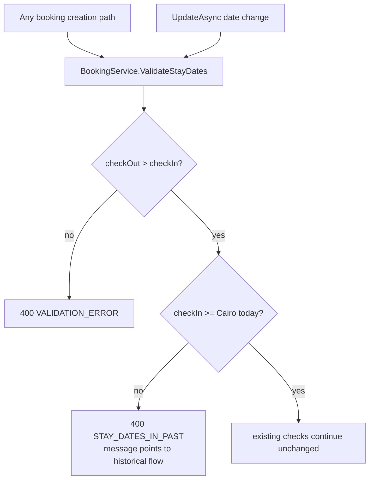

# HB-01 — Discovery and Architecture Decisions (the decision gate)

> [README](README.md) · [Master Plan](00_MASTER_PLAN.md) ·
> [Decision record](DECISION_RATIFICATION_PACKET.md) ·
> Next: [HB-02](02_TICKET_HISTORICAL_BOOKING_DOMAIN_AND_API.md)

---

## 1. Ticket metadata

| Field | Value |
|---|---|
| Ticket ID | **HB-01** |
| Title | Discovery, Architecture Decisions, and the Normal-Flow Hardening **Specification** |
| Priority | **P0 — gating** |
| Type | Discovery + architecture decision gate. **No application code ships in this ticket** |
| Status | **COMPLETE — gate satisfied, no execution items remain.** All decisions are `OWNER APPROVED`, `DEFERRED`, or tied to a named technical prerequisite. Decision-only: no application code, no migration, no database access |
| Decision authority | Sole Project Owner, **Hozaifa Almelli**, 2026-07-29 |
| Review lenses applied | Product · Engineering · Finance · Security · Operations |
| Dependencies | None |
| Dependents | HB-02, HB-03 (and transitively all others) |
| Risk level | Medium — the risk is a wrong decision, not a runtime behaviour change |
| Estimated complexity | **M** |
| Target branch | `docs/hb01-historical-discovery-and-adrs` |

> **This ticket gates every other ticket, and the gate is now open.** Its purpose was to stop implementation
> agents building on unsettled assumptions. Every decision it owns has a final status in the
> [decision record](DECISION_RATIFICATION_PACKET.md), and **no execution task remains inside it**.
> Downstream tickets may proceed, subject only to the three independent technical prerequisites
> [`PRE-00`](DECISION_RATIFICATION_PACKET.md#pre-00--historical-data-census),
> [`PRE-01`](DECISION_RATIFICATION_PACKET.md#pre-01--database-bootstrap-parity-for-migration-0057) and
> [`PRE-02`](DECISION_RATIFICATION_PACKET.md#pre-02--baseline-test-execution-and-postgresql-integration-infrastructure).

### 1.0 Governance

This project is designed, owned, reviewed and implemented by **one person**. Product, Engineering, Finance,
Security and Operations are **review lenses the sole owner applies**, not separate approvers. No decision in
this pack is waiting on a role holder, and none ever will be — there are no vacant roles to fill.

What single-owner governance does **not** provide is independent review. Where that absence matters most —
money, privilege boundaries, irreversible schema — the compensating controls are written into the decisions
themselves: explicit risk acceptance, explicit revisit triggers, and reliability scenarios that fail loudly.
See [the governance model](DECISION_RATIFICATION_PACKET.md#governance-model).

### 1.1 Why this ticket ships no code — the dependency cycle it removes

An earlier draft of this ticket both **gated** every other ticket and **shipped** the normal-flow past-date
hardening. That was circular and unbuildable:

- HB-01 blocked HB-02, yet HB-01 §11.2.4 required exempting `is_historical` bookings from the update-path
  rule — and `is_historical` is a column **HB-02** creates.
- HB-01 was wave 0, yet its own §11.2.7 required hardening to be *enabled last*, after HB-02 … HB-08.

Both statements cannot hold. The cycle is broken by splitting specification from implementation:

| Concern | Owner | Wave |
|---|---|---|
| Ratify the past-date rule, its boundary, its error contract, its path coverage (§11.2) | **HB-01** | 0 |
| Implement the shared Cairo business-date resolver, extend `ValidateStayDates`, apply the update-path guard, add the metric and regression tests | **[HB-08](08_TICKET_REPORTING_AUDIT_OBSERVABILITY_AND_ROLLOUT.md)** | 3 |
| Activate hardening in production as rollout step 9 | **HB-08** | 3, after pilot |

REQ-16 is unchanged, its reliability coverage (`SC-REG-02`, `SC-REG-03`, `SC-DATE-*`) is unchanged, and the
sequencing guarantee is unchanged. Only the ticket that carries the diff has moved, and it has moved to the
ticket that already owns rollout ordering. No runtime feature flag is introduced; the control remains
**deployment order**.

---

## 2. Business context

KAZA Booking must record bookings agreed and completed outside the system so that revenue, payment
balances, owner accounting, occupancy and audit history are true. Before any of that is built, the team
needs a verified picture of how booking creation, validation, availability, money and ownership actually
behave today — because the original feature brief was written against an assumption that turned out to be
false.

---

## 3. Problem being solved

Two problems, deliberately paired in one ticket because they are the same defect seen from two sides:

1. **There is no recorded, evidence-backed model of current behaviour.** Several "obvious" assumptions
   (past dates are blocked; availability catches all overlaps; owner statements have closable periods) are
   wrong.
2. **The normal booking flow silently accepts past-dated bookings.** Any permission gate placed on a new
   historical endpoint is bypassable by simply calling the existing endpoint, which makes every audit,
   reason, notification and financial guarantee in this feature defeatable.

---

## 4. User value

- **Operations** gain a trustworthy statement of how the system behaves, and stop accidentally creating
  unaudited backdated bookings.
- **Finance** gains certainty that a past-dated booking is deliberate, attributed and reasoned.
- **Engineering** gains settled decisions, so downstream tickets can be executed without re-litigation.
- **Security** gains closure of an unguarded write path.

---

## 5. Current repository behavior

All claims verified by direct read at commit `8dafb5a`.

### F-01 — There is no server-side past-date rule

`CONFIRMED`. The complete set of stay-date validation in the backend is:

`RentalPlatform.Business/Services/BookingService.cs:463-467`
```csharp
private static void ValidateStayDates(DateOnly checkInDate, DateOnly checkOutDate)
{
    if (checkOutDate <= checkInDate)
        throw new BusinessValidationException("Check-out date must be after check-in date");
}
```

`RentalPlatform.API/Validators/BookingValidators.cs` — all four validators
(`CreateBookingRequestValidator`, `CreateClientBookingRequestValidator`,
`CreateGuestBookingRequestValidator`, `UpdatePendingBookingRequestValidator`) contain only
`.NotEmpty()` and `.GreaterThan(x => x.CheckInDate)`. No comparison to any notion of "today" exists in the
entire validators directory.

`db/migrations/0016_create_bookings.sql:26` — `CONSTRAINT ck_bookings_valid_stay_range CHECK (check_out_date > check_in_date)`. No past-date CHECK.

`RentalPlatform.Business/Services/UnitAvailabilityService.cs` — no filtering on current date; the service
works correctly for entirely-past ranges.

The **only** guard in the product is a client-side calendar in the public storefront:
`demo/src/components/ui/UnitBookingWidget.tsx:324` — `disabled={[{ before: today }, { after: windowEnd }, ...unavailableDays]}`.
The operator portal has no `min` on the check-in input
(`rental-platform/components/admin/crm/booking-wizard/CrmBookingWizardSteps.tsx` sets `min` only on
check-out, bounded by check-in).

**Impact:** REQ-16 hardening is mandatory, not optional. `RISK-10`.

### F-02 — `Completed` and `LeftEarly` are invisible to availability

`CONFIRMED`. `RentalPlatform.Shared/Constants/BookingStatusTransitions.cs`:

- `:39` `HoldingStatuses = { Booked, Confirmed, CheckIn }`
- `:44` `SoftHoldStatuses = { Prospecting, Relevant }`
- `:46-53` `ActiveAvailabilityHoldStatuses = { Prospecting, Relevant, Booked, Confirmed, CheckIn }`

`UnitAvailabilityService.cs:48-74` queries only `HoldingStatuses` and `SoftHoldStatuses`. Therefore two
bookings in `Completed` on the same unit and dates produce **no** conflict.

**Impact:** the existing availability guard is **not reusable as-is** for historical records. `RISK-01`.

### F-03 — Owner payouts are one row per booking, with no period model

`CONFIRMED`. `owner_payouts` DDL: `booking_id`, `owner_id`, `payout_status`, `gross_booking_amount`,
`commission_rate`, `commission_amount`, `payout_amount`, `scheduled_at`, `paid_at`, `proof_of_payment_url`,
`notes`, timestamps. Constraints include
`ck_owner_payouts_status CHECK (payout_status IN ('pending','scheduled','paid','cancelled'))` and
`ck_owner_payouts_payout_formula CHECK (payout_amount = gross_booking_amount - commission_amount)`, plus
`CREATE UNIQUE INDEX ux_owner_payouts_booking_id ON owner_payouts(booking_id)`.

There is **no** `period_start`/`period_end`, no statement table, no adjustment/credit-note entity.
Payout rows are created explicitly in `OwnerPayoutService.cs:107-123`, not automatically on booking events.

**Impact:** a historical booking creates its own payout and **cannot** mutate a previously-paid statement.
The brief's highest-anticipated risk is substantially smaller than expected.

### F-04 — Minimal side-effect surface

`CONFIRMED`. `RentalPlatform.API/Program.cs:311` registers exactly one hosted service:
`builder.Services.AddHostedService<AutoCompleteBookingsJob>();`. Greps for `Outbox`, `DomainEvent`,
`MediatR`, `INotificationHandler`, `IPublisher` across `RentalPlatform.API`, `.Business`, `.Data` return
**no matches**. `BookingService.CreateAsync` triggers no notification. The only lifecycle notification is
`BookingLifecycleService.cs:69` → `NotifyClientOfStatusChangeAsync` (`:311`), reachable only through
`TransitionAsync`. `NotificationDispatchService` is a state machine over notification rows — there is no
SMTP or HTTP delivery implementation.

### F-05 — `AutoCompleteBookingsJob` defines the completed-stay boundary

`CONFIRMED`. `RentalPlatform.API/Services/AutoCompleteBookingsJob.cs`:

- `:18` `private static readonly TimeZoneInfo CairoTimeZone = ResolveCairoTimeZone();`
- `:133-143` resolves `Africa/Cairo`, falling back to `Egypt Standard Time`
- `:70` `var completedAfterCheckoutCutoff = DateOnly.FromDateTime(cairoNow).AddDays(-1);`
- `:86-87` `.Where(b => b.BookingStatus == BookingStatus.CheckIn).Where(b => b.CheckOutDate <= completedAfterCheckoutCutoff)`
- `:145-221` notifies finance admins when an auto-completed booking has an outstanding balance

Two consequences: the business timezone is **Cairo**, and a stay is treated as finished only once its
checkout day has *fully passed* — checkout **today** is not yet complete. Because the filter requires
`CheckIn`, a booking created directly in `Completed` is never touched by this job.

### F-06 — Direct-to-`Completed` creation is already possible

`CONFIRMED`. `BookingService.cs:140` — `BookingStatus? initialStatus = null` is an existing parameter;
`:217` — `var startingStatus = initialStatus ?? BookingStatus.Prospecting;`.
`BookingStatusTransitions.cs:18` — `{ BookingStatus.Completed, Array.Empty<BookingStatus>() }` (terminal).
Reaching `Completed` through transitions requires Prospecting→Relevant→Booked→Confirmed→CheckIn→Completed,
i.e. five fabricated transitions — which the brief forbids.
`BookingStatusTransitions.cs:61-70` — `FinanceEligibleStatuses` **includes** `Completed` and `LeftEarly`, so
invoices and payments are already legal against a completed booking.

### F-07 — Financial values are recomputed, not preserved

`CONFIRMED`. On create, `BookingService.cs:213` calls `CalculatePricingAsync`, then `:231-232`
`BaseAmount = pricing.TotalPrice; FinalAmount = pricing.TotalPrice;`.
On update, `:428` recomputes and `:439-440` reassigns both fields.
`UnitAvailabilityService.CalculatePricingAsync:125-169` uses live `unit.BasePricePerNight` and current
`SeasonalPricings` rows. There is **no** operator override of the amount at creation.

**Impact:** a historical agreed price cannot survive an unrelated edit. `RISK-04`.

### F-08 — `ck_bookings_source` restricts source values

`CONFIRMED`. `db/migrations/0016_create_bookings.sql:24` —
`CONSTRAINT ck_bookings_source CHECK (source IN ('direct', 'admin', 'phone', 'whatsapp', 'website'))`.
Mirrored in code by `BookingValidators.cs:10` and `BookingService.ValidateAndNormalizeSource`.

### F-09 — Reporting buckets on `created_at`

`CONFIRMED`. `db/migrations/0041_create_reporting_booking_daily_summary_view.sql:49` and `:59`,
`0042_create_reporting_finance_daily_summary_view.sql:65,87,94` all group by `DATE(b.created_at)`.
`ReportingFinanceAnalyticsService.cs:75-81` filters on `b.CreatedAt`.

### F-10 — Invoice behaviour

`CONFIRMED`. Single auto-creation site: `BookingLifecycleService.cs:194-199` creates a draft and issues it
on the Booked→Confirmed transition. Numbering: `InvoiceService.cs:500-518`, with `:502`
`var prefix = $"INV-{DateTime.UtcNow:yyyyMMdd}";` then a count-and-probe for the sequence — so the number
encodes the *record* date in UTC and resets daily. `issued_at` is always `UtcNow`.

### F-11 — Retired units are blocked

`CONFIRMED`. `BookingService.cs:156-165` requires `u.IsActive && u.DeletedAt == null`.
`UnitAvailabilityService.cs:33-34` throws `BusinessValidationException` when `!unit.IsActive`.

### F-12 — Payment model

`CONFIRMED`. `RentalPlatform.Data/Entities/Payment.cs:14` — `public DateTime? PaidAt { get; set; }`,
distinct from `CreatedAt` at `:15`. `db/migrations/0022_create_payments.sql:17-19`:
`ck_payments_status CHECK (payment_status IN ('pending','paid','failed','cancelled'))`,
`ck_payments_method CHECK (payment_method IN ('cash','bank_transfer','card','wallet'))`,
`ck_payments_amount_positive CHECK (amount > 0)`.
The entity has **no** `CreatedByAdminUserId`. No payment-gateway integration exists anywhere in the
solution.

### F-13 — Owner is already snapshotted

`CONFIRMED`. `BookingService.cs:225` — `OwnerId = unit.OwnerId, // snapshot from unit, not caller input`.
`Owner.cs:13` — `public decimal CommissionRate { get; set; }` (mutable).
`OwnerPayoutService.cs:114` — `CommissionRate = commissionRate` freezes it onto the payout row.
No ownership-history, contract, or effective-date model exists.

### F-14 — Permission model

`CONFIRMED`. `RentalPlatform.API/Authorization/PermissionKeys.cs:13-33` — constants in `area:action` form
(`bookings:read`, `bookings:write`, `finance:manage`, `clients:reset_password`, …).
`BookingsController.cs:98,119,140` — `[Authorize(Policy = PermissionKeys.BookingsWrite)]`.
`db/migrations/0053_create_dynamic_rbac.sql:22` — `permission_key VARCHAR(50) NOT NULL`; `:68-70` seeds
role-template permissions by INSERT…SELECT.

### 5.1 Booking creation paths (complete enumeration)

| Path | Entry | Service | Initial status | Past dates today |
|---|---|---|---|---|
| Admin create | `POST /api/internal/bookings` | `BookingService.CreateAsync` | caller or `Prospecting` | **Accepted** |
| Admin quick create | portal QuickBookingModal | `BookingService.CreateQuickAsync` | `Booked` (verify in HB-01) | **Accepted** |
| Client booking | client-authenticated endpoint | `BookingService.CreateAsync` | `Prospecting` | **Accepted** |
| Guest booking | storefront | `GuestBookingService` | `Prospecting` | **Accepted** (UI-blocked only) |
| Owner portal | owner endpoints | `OwnerPortalBookingService` | — | `INFERRED` — confirm |
| CRM conversion | `CrmLeadService.ConvertToBookingAsync` | → `BookingService.CreateAsync` | `Booked` | **Accepted** |
| Update path | `UpdatePendingBookingRequest` | `BookingService.UpdateAsync` | n/a | **Accepted — can move an existing booking into the past** |

### 5.2 Known gaps in this audit

Recorded honestly; each must be closed by this ticket before downstream work begins.

| Gap | Label | Assigned |
|---|---|---|
| `CreateQuickAsync` initial status and full validation set | `INFERRED` | HB-01 |
| `OwnerPortalBookingService` creation semantics | `BLOCKED` | HB-01 |
| Client match-or-create algorithm and phone normalisation | `BLOCKED` | HB-02 |
| RBAC policy handler wiring in `Program.cs` | `INFERRED` | HB-01 |
| Portfolio/tenant scoping rules for units and owners | `BLOCKED` | HB-05 |
| Portal wizard component inventory beyond `CrmBookingWizardSteps.tsx`, `QuickBookingModal.tsx` | `BLOCKED` | HB-06 |
| Whether CI can run integration tests against real Postgres | `BLOCKED` | HB-09 |
| Existence of any CSV/PDF export path | `BLOCKED` | HB-08 |
| Git-history rationale for the *believed* past-date block | `BLOCKED` | HB-01 |

---

## 6. Target behavior

1. A written, reviewed ADR set covering date policy, status policy, data model, financial policy, payment
   policy, owner policy, settlement policy, notification policy and ticket boundaries.
2. The normal booking flow rejects stays that begin in the past, server-side, on **every** creation path and
   on the update path.
3. The historical flow is the only sanctioned way to record a past stay.

---

## 7. In scope

- Verification of F-01 … F-14 and closure of the §5.2 gaps.
- Owner decisions on ADR-01 … ADR-12 and on the nine cross-ticket decisions.
- The **normal-flow hardening specification** (§11.2) — binding on HB-08, which implements it.
- The test plan that HB-08 executes for the hardened behaviour.
- The **specification** of the historical data census — what it must measure and under what safety rules.
  Executing it belongs to [PRE-00](DECISION_RATIFICATION_PACKET.md#pre-00--historical-data-census).

## 8. Out of scope

- The historical endpoint, command, wizard, migration, or any historical semantics (HB-02 … HB-08).
- Changing availability, pricing, payout, or notification behaviour.
- Any change to the storefront beyond confirming its existing calendar guard.

---

## 9. Assumptions

| # | Assumption | If false |
|---|---|---|
| A-1 | `DateOnly` stay dates need no timezone conversion | Revisit the boundary expression |
| A-2 | Cairo is the sole business timezone | Boundary becomes per-project |
| A-3 | Historical recording will be available before hardening is enabled | Reorder rollout, or operators lose a capability |
| A-4 | No external consumer relies on creating past-dated bookings via the API | Hardening breaks an integration — see RISK-16 |

---

## 10. Decisions

**All decided.** Nothing in this section is outstanding. Decision authority for every row is the Sole
Project Owner, 2026-07-29; the authority is stated once rather than repeated per row.

### 10.1 HB-01's own decisions

| ID | Decision | Outcome | Review lenses | Status |
|---|---|---|---|---|
| D-01 | The Cairo completed-stay boundary | `checkOut <= cairoToday − 1`, identical to `AutoCompleteBookingsJob.cs:70` | Product · Engineering · Operations | **`OWNER APPROVED`** — see [D-CAL-01](DECISION_RATIFICATION_PACKET.md#d-cal-01--historical-completion-boundary) |
| D-02 | The hardening rule | Reject `checkIn < cairoToday` on create; same-day check-in remains legal | Product · Security · Engineering | **`OWNER APPROVED`** |
| D-03 | Does hardening apply to updates moving dates into the past? | Yes. Otherwise the bypass persists | Security · Engineering | **`OWNER APPROVED`** |
| D-04 | Grandfathering existing past-dated bookings | No backfill. Report only, via the [PRE-00](DECISION_RATIFICATION_PACKET.md#pre-00--historical-data-census) census | Operations · Engineering | **`OWNER APPROVED`** |
| D-05 | Which role templates receive `bookings:record_historical` | Historical creation and later owner correction use separate least-privilege permissions; grants are administered independently | Security · Operations | **`OWNER APPROVED`** |
| D-06 | Column names for the new historical fields | As tabulated in [Master §11.1](00_MASTER_PLAN.md#111-migration-ownership-matrix) | Engineering | **`OWNER APPROVED`** — see [D-MIG-01](DECISION_RATIFICATION_PACKET.md#d-mig-01--migration-ownership) |

### 10.2 Cross-ticket decisions this gate releases

All nine are recorded in the [decision record](DECISION_RATIFICATION_PACKET.md) with review lenses, risk
acceptance and revisit triggers.

| ID | Outcome | Status |
|---|---|---|
| [D-CAL-01](DECISION_RATIFICATION_PACKET.md#d-cal-01--historical-completion-boundary) | `check_out_date <= Cairo business date − 1` | `OWNER APPROVED` |
| [D-INV-01](DECISION_RATIFICATION_PACKET.md#d-inv-01--invoice-policy) | No automatic invoice from historical commands; manual draft and normal issuance remain allowed; historical evidence remains unlinked | `OWNER APPROVED` |
| [D-PAY-01](DECISION_RATIFICATION_PACKET.md#d-pay-01--historical-payment-policy) | Separate privileged historical-payment command; never inline | `OWNER APPROVED` |
| [D-OWN-01](DECISION_RATIFICATION_PACKET.md#d-own-01--owner-attribution) | Default unit owner; explicit review; block on uncertainty | `OWNER APPROVED` |
| [D-OWN-02](DECISION_RATIFICATION_PACKET.md#d-own-02--owner-correction) | Separate correction endpoint and permission; mandatory reason; idempotency; immutable audit; any payout blocks | `OWNER APPROVED` |
| [D-MIG-01](DECISION_RATIFICATION_PACKET.md#d-mig-01--migration-ownership) | One owner per schema object; cross-ticket use is a dependency | `OWNER APPROVED` |
| [D-ROLL-01](DECISION_RATIFICATION_PACKET.md#d-roll-01--rollout-sequence) | Implement → test → pilot → harden | `OWNER APPROVED` |
| [D-HARD-01](DECISION_RATIFICATION_PACKET.md#d-hard-01--normal-flow-hardening) | HB-01 specifies; HB-08 implements and activates last | `OWNER APPROVED` |
| [D-TEST-01](DECISION_RATIFICATION_PACKET.md#d-test-01--postgresql-test-requirement) | Real PostgreSQL testing mandatory; HB-09 consumes the merged PRE-02 foundation | `OWNER APPROVED`; `PRE-02 COMPLETE` |

### 10.3 Owner-approved scope outside v1

`OQ-05` currency model, `OQ-06` fee/tax/discount model, `OQ-07` paid-payout correction. Each is
`OWNER APPROVED — OUT OF V1` with an accepted risk and a revisit trigger — see the
[decision record](DECISION_RATIFICATION_PACKET.md#owner-approved-out-of-v1-decisions). These are scope choices, not
unresolved approvals.

---

## 11. Architecture and technical design

### 11.1 Discovery deliverable

A reviewed `docs/plans/historical-bookings/` addendum (or ADR file) recording, for each of F-01 … F-14,
the verification outcome and the recorded decision. Each §5.2 gap is either closed with evidence or
re-labelled `BLOCKED` with an owner.

### 11.2 Normal-flow hardening — specification

This is **not** advisory, and it is **not** a paragraph. It is a complete, executable specification of a
code change — every rule below is binding on the implementer. What has moved is only *who writes the diff*:
HB-01 ratifies this specification; **[HB-08](08_TICKET_REPORTING_AUDIT_OBSERVABILITY_AND_ROLLOUT.md)
implements it and activates it as rollout step 9**, for the reasons in §1.1.

REQ-16 remains a v1 requirement. Nothing here is deferred, softened, or made optional.

**11.2.1 Single source of truth for "today".** Introduce one shared helper that resolves the current Cairo
business date, reusing the existing timezone resolution rather than duplicating it. `AutoCompleteBookingsJob`
should consume the same helper so the two definitions cannot drift.

**11.2.2 Server-side validation.** Extend `BookingService.ValidateStayDates` — the single function every
creation path already funnels through (`:146`) — to reject a check-in earlier than the current Cairo
business date, subject to D-02. Placing the rule here rather than in validators guarantees coverage of all
paths in §5.1 in one change.

**11.2.3 Creation-path coverage.** Verify by test that each path in §5.1 now rejects past stays:
`CreateAsync`, `CreateQuickAsync`, client booking, guest booking, owner-portal creation, CRM conversion.

**11.2.4 Update-path bypass.** `UpdatePendingAsync` recomputes and reassigns dates (`:432-433`) with no
past-date rule. Apply the same guard, exempting bookings where `is_historical` is true. Scope note, so the
implementer does not overstate the current defect: the path already rejects any booking outside
`Prospecting`/`Relevant` with a `409` (`CONFIRMED` `BookingService.cs:385-387`), so the bypass exists today
only for those two statuses. The `is_historical` exemption is nonetheless required, because
[HB-04](04_TICKET_FINANCIAL_SNAPSHOT_AND_HISTORICAL_PAYMENTS.md) `D-HB04-01` may widen what is editable.

**Dependency, not shared ownership:** the exemption reads `bookings.is_historical`, a column owned and
created by **[HB-02](02_TICKET_HISTORICAL_BOOKING_DOMAIN_AND_API.md)** (see the
[migration-ownership matrix](00_MASTER_PLAN.md#111-migration-ownership-matrix)). Because HB-08 implements
this rule and HB-08 runs in wave 3, the column already exists by then. This is precisely the cycle §1.1
removes.

**11.2.5 Command separation.** The historical flow must **not** be implemented as a bypass parameter on
`CreateAsync`. `initialStatus` already exists and is legitimate; a `bypassPastDateValidation` boolean is
not. The historical service composes `CreateAsync` and performs its own pre-validation.

**11.2.6 API error contract.** Past-date rejection returns `400` with code `STAY_DATES_IN_PAST` and an
operator-actionable message naming the historical flow as the correct route.

**11.2.7 Rollout sequencing.** Hardening is implemented inside HB-08 and activated **last**, as step 9 of
[HB-08 §24.1](08_TICKET_REPORTING_AUDIT_OBSERVABILITY_AND_ROLLOUT.md#241-ordering) — after the historical
flow is deployed, permissioned and verified with pilot users. Enabling it earlier would remove a capability
operators currently rely on with nothing in its place. See §24.

**11.2.8 Storefront.** No change. The calendar guard remains; it is now backed by a server rule.

---

## 12. Expected data flow



---

## 13. Expected files/components likely to change

**Changed by HB-01 itself:**

| Path | Change |
|---|---|
| `docs/plans/historical-bookings/` | ADR addendum; the [decision record](DECISION_RATIFICATION_PACKET.md) |

No application source file is edited by this ticket.

**Specified here, implemented only by the later independent
[HB-08B](08_TICKET_REPORTING_AUDIT_OBSERVABILITY_AND_ROLLOUT.md#261-req-16-hardening-tasks--a-later-independent-pr)**
after pilot approval — `OWNER APPROVED`:

| Path | Change |
|---|---|
| `RentalPlatform.Business/Services/BookingService.cs` | Extend `ValidateStayDates`; apply the same rule in `UpdatePendingAsync` |
| `RentalPlatform.Shared/` (new helper) | Cairo business-date resolver |
| `RentalPlatform.API/Services/AutoCompleteBookingsJob.cs` | Consume the shared resolver |
| `RentalPlatform.Business/Exceptions/` | Possibly a typed exception for the new rule |
| `RentalPlatform.Tests/` | Regression tests per creation path |

---

## 14. API changes

**None in this ticket.** HB-01 introduces no endpoint and changes no response.

The behavioural change it *specifies* — previously-accepted past-dated create/update requests returning
`400 STAY_DATES_IN_PAST` — is shipped by HB-08. It **is** a breaking change for any caller relying on the
current permissiveness; see §23 and
[HB-08 §24.1](08_TICKET_REPORTING_AUDIT_OBSERVABILITY_AND_ROLLOUT.md#241-ordering).

---

## 15. Data/schema changes

**None in this ticket.** No migration is created here.

---

## 16. Authorization and security

No permission changes in this ticket. The security value is the closure of an unauthenticated-by-intent
capability: today any holder of `bookings:write` can silently backdate. After hardening, backdating requires
the dedicated permission introduced in HB-02. Addresses `RISK-10`.

---

## 17. Validation rules

Specified by HB-01, enforced by HB-08.

| Rule | Layer | Failure | Implemented by |
|---|---|---|---|
| `checkOut > checkIn` | unchanged (`BookingService.cs:463-467`) | 400 | already present |
| `checkIn >= Cairo business today` (D-02) | `ValidateStayDates` | 400 `STAY_DATES_IN_PAST` | HB-08 |
| Same rule on date-changing updates (D-03) | `UpdatePendingAsync` | 400 `STAY_DATES_IN_PAST` | HB-08 |
| `is_historical` bookings exempt from both | `UpdatePendingAsync` | n/a | HB-08, reading the column HB-02 creates |

---

## 18. Transaction and failure behavior

Validation is pre-transaction and side-effect free. A rejection leaves no partial state. No change to
existing transaction boundaries.

---

## 19. Idempotency and concurrency

Unchanged. The existing 30-second duplicate window (`BookingService.cs:19`
`RecentDuplicateWindow = TimeSpan.FromSeconds(30)`) and advisory-lock usage are untouched. One boundary
consideration: a request submitted just before Cairo midnight must be evaluated once, server-side, so it
cannot flip mid-request.

---

## 20. Audit and observability

Specified by HB-01, **executed by [PRE-00](DECISION_RATIFICATION_PACKET.md#pre-00--historical-data-census)**:

- A read-only census of existing past-dated bookings — aggregate counts only, no PII, `SELECT` only — to
  size `D-04` and to test assumption A-4 before anything is enforced. HB-01 fixes what it must measure and
  the data-access safety rules it must obey; `PRE-00` runs it against an authorized non-production dataset.

Specified by HB-01, **emitted by HB-08**:

- Metric `booking_create_rejected_total{reason="STAY_DATES_IN_PAST"}` — **essential**, because it measures
  how often operators were relying on the open door, and validates or refutes assumption A-4 after
  activation.
- Structured log on rejection: path, actor, requested dates. No PII.

---

## 21. Notification/side-effect behavior

None. This ticket triggers no notification and changes no side effect.

---

## 22. Reporting/accounting impact

None directly. Indirectly, hardening stops new unaudited past-dated bookings polluting revenue reports.

---

## 23. Backward compatibility

| Consumer | Impact |
|---|---|
| Operator portal | Users must switch to the historical flow for past stays |
| Storefront | None — already guarded client-side |
| Direct API consumers | **Breaking** if any relies on past-dated creation. A-4 must be validated by the metric in §20 before enabling |
| Existing bookings | Untouched; no backfill |

---

## 24. Migration and rollout plan

**No schema migration and no deployable artefact.** HB-01's output is a reviewed, signed decision record.

The hardening sequencing it ratifies, and which HB-08 executes, is:

1. Build and merge HB-02 … HB-08 with hardening **not yet implemented**.
2. Deploy the historical flow; grant `bookings:record_historical` to pilot users.
3. Verify pilot users can record historical bookings.
4. **Then** implement and activate hardening —
   [HB-08 §24.1](08_TICKET_REPORTING_AUDIT_OBSERVABILITY_AND_ROLLOUT.md#241-ordering) step 9.
5. Monitor `booking_create_rejected_total` for one week.

Reversing steps 2 and 4 would strand operators with no way to record a past stay. This ordering is a
**release gate**, not a runtime flag, and it is enforced by HB-08's Definition of Done.

---

## 25. Feature flag strategy

`OWNER APPROVED`: **no runtime flag anywhere in this feature.** Control the hardening change by **deployment
order** — it is the last thing implemented and the last thing activated. A flag would add a bypass surface,
which is exactly what REQ-16 removes, and a second source of truth that can disagree with RBAC.

The release-gate mechanism is concrete, not aspirational: HB-08 cannot mark its Definition of Done complete
until the pilot exit criteria in
[HB-08 §24.3](08_TICKET_REPORTING_AUDIT_OBSERVABILITY_AND_ROLLOUT.md#243-pilot-definition) are met, and the
hardening is delivered in a separate HB-08B PR after HB-08A pilot approval.

If Ops requires an emergency stop for the *historical* flow, the mechanism already exists and is not a flag:
revoke the `bookings:record_historical` grant. That is instant, audited and server-side.

---

## 26. Detailed implementation tasks

HB-01 produces documents and read-only evidence. Nothing here compiles.

1. Confirm `CreateQuickAsync`'s initial status and validation set; record it (closes a §5.2 gap).
2. Confirm `OwnerPortalBookingService` creation semantics (closes a §5.2 gap).
3. Confirm RBAC policy-handler wiring in `Program.cs` (closes a §5.2 gap).
4. Run `git log -S` / `git blame` on the stay-date validation to document the historical rationale.
5. Specify the historical data census — what it measures and its data-access safety rules — and hand it to
   [PRE-00](DECISION_RATIFICATION_PACKET.md#pre-00--historical-data-census). **Done.** HB-01 does not run it.
6. Write the ADR addendum covering ADR-01 … ADR-12 and D-01 … D-06. **Done** — statuses are recorded in the
   [decision record](DECISION_RATIFICATION_PACKET.md#adr-01--adr-12).
7. Record every cross-ticket decision in the [decision record](DECISION_RATIFICATION_PACKET.md) with its
   review lenses, accepted risk and revisit trigger. **Done** — all nine carry a final status, including
   [D-INV-01](DECISION_RATIFICATION_PACKET.md#d-inv-01--invoice-policy) and
   [D-PAY-01](DECISION_RATIFICATION_PACKET.md#d-pay-01--historical-payment-policy).
8. Record the three technical prerequisites — `PRE-00`, `PRE-01`, `PRE-02` — as **independent** PRs, none
   delivered inside a feature ticket, and confirm `PRE-01` is scheduled before HB-02 merges and `PRE-02`
   before HB-03 merges
   ([D-TEST-01](DECISION_RATIFICATION_PACKET.md#d-test-01--postgresql-test-requirement)). **Done.**
9. Hand the §11.2 specification to HB-08, noting that D-02 and D-03 are decided. **Done.**

The corresponding **code** tasks — shared Cairo resolver, `ValidateStayDates` extension, update-path guard,
typed error, per-path regression tests, boundary and DST tests, rejection metric, operator documentation —
are enumerated in [HB-08 §26](08_TICKET_REPORTING_AUDIT_OBSERVABILITY_AND_ROLLOUT.md#26-detailed-implementation-tasks).

---

## 27. Acceptance criteria

Every criterion below is satisfiable by a document or a read-only query. Runtime assertions about the
hardened behaviour live in HB-08 (`AC-HB08-23` … `AC-HB08-26`) and are cross-referenced here so REQ-16
coverage remains traceable.

| ID | Criterion |
|---|---|
| AC-HB01-01 | The §11.2 hardening specification is complete and decided: the rule, the Cairo boundary, the path coverage list, the update-path scope, the error contract and the sequencing each have a recorded outcome. Runtime proof that a past-dated create is rejected on every path is `AC-HB08-23`. |
| AC-HB01-02 | The specification states explicitly that today's and future check-ins are unaffected, so the implementer has a written non-regression boundary. Runtime proof is `AC-HB08-24`. |
| AC-HB01-03 | D-03 is decided, and §11.2.4 records both the rule and the `is_historical` exemption together with the evidence that the current bypass is limited to `Prospecting`/`Relevant`. Runtime proof is `AC-HB08-25`. |
| AC-HB01-04 | The specification requires exactly one Cairo business-date helper, consumed by both the validator and `AutoCompleteBookingsJob`, and names `AutoCompleteBookingsJob.cs:70` as the expression to extract rather than reinvent. |
| AC-HB01-05 | The specification requires a behaviour-equivalence test proving `AutoCompleteBookingsJob` selects an identical booking set before and after the refactor. Runtime proof is `AC-HB08-26`. |
| AC-HB01-06 | The ADR addendum exists, covers ADR-01…ADR-12 and D-01…D-06, and every entry carries a final status in the [decision record](DECISION_RATIFICATION_PACKET.md#adr-01--adr-12). |
| AC-HB01-07 | Every §5.2 gap is either closed with evidence or re-labelled `BLOCKED` against a **named technical prerequisite**, never against an unassigned person. |
| AC-HB01-08 | The observability contract for hardening — `booking_create_rejected_total{reason="STAY_DATES_IN_PAST"}` plus a PII-free structured log — is specified, reviewed through the Operations lens, and handed to HB-08. |
| AC-HB01-09 | The specified rejection message names the historical flow as the correct route, and the exact wording is fixed so HB-08 and the operator documentation cannot diverge. |
| AC-HB01-10 | The historical data census is fully specified — required findings, aggregate-only output, and binding non-production read-only rules — and assigned to [PRE-00](DECISION_RATIFICATION_PACKET.md#pre-00--historical-data-census). Its **execution** is PRE-00's, not HB-01's. |

## 28. Negative acceptance criteria

| ID | Must NOT happen |
|---|---|
| NAC-HB01-01 | The specification must not permit any client-supplied flag to bypass the rule, and no such flag is introduced downstream. |
| NAC-HB01-02 | No existing booking is modified, deleted, or backfilled by anything this ticket specifies. The census it hands to `PRE-00` is `SELECT` only, and must never run against production without explicit authorization. |
| NAC-HB01-03 | No migration is created in this ticket. |
| NAC-HB01-04 | **No application source file is changed by this ticket.** The diff contains documentation only. |
| NAC-HB01-05 | Hardening is **not** enabled in production before the historical flow is available and verified. |
| NAC-HB01-06 | The past-date rule is not specified in multiple layers that could drift — one choke point, `ValidateStayDates`. |
| NAC-HB01-07 | No PII appears in the specified census output, logs or metrics — no guest name, phone, email, address, national id, payment reference or free-text note. |
| NAC-HB01-08 | The specification must forbid `DateTime.Now` / `DateTime.Today` (machine-local) in the new code. |

---

## 29. QA plan

HB-01's own QA is review-based, because it ships no code.

| Layer | Activity |
|---|---|
| Document review | Two reviewers independently re-verify a sample of `CONFIRMED` citations against `8dafb5a` |
| Decision review | Every entry in the [decision record](DECISION_RATIFICATION_PACKET.md) has a final status, review lenses, and — where it applies — an accepted risk and a revisit trigger |
| Read-only query review | The census SQL specification is reviewed to confirm it is `SELECT` only and non-production before `PRE-00` runs it |
| Gap review | Each §5.2 gap has an owner and a closing ticket |

The **test plan for the specified behaviour** is written here and executed by HB-08:

| Layer | Tests | Executed in |
|---|---|---|
| Unit | Boundary resolver: before/at/after Cairo midnight; DST transition; UTC-vs-Cairo divergence window | HB-08 |
| Unit | `ValidateStayDates`: past, today, future, inverted, equal dates | HB-08 |
| Service | Each creation path in §5.1 rejects past stays | HB-08 |
| Service | `UpdatePendingAsync` rejects moving dates into the past, and exempts `is_historical` | HB-08 |
| Integration | `AutoCompleteBookingsJob` still completes exactly the same set after the refactor | HB-08 |
| API | `400` body shape and error code | HB-08 |
| Frontend | Portal and storefront render the new error acceptably | HB-08 |
| Regression | CRM conversion, quick booking, guest booking, owner portal all still work for valid dates | HB-08 |
| Security | No parameter can disable the rule | HB-08 |
| Manual | `SC-REG-02`, `SC-REG-03`, `SC-DATE-01` … `SC-DATE-10` | HB-08 |

---

## 30. Owner checklist

Single-owner governance, so this is a self-check, not a sign-off circuit. Each item names the lens applied.

- [x] Scope settled — *Product lens*
- [x] D-01 … D-06 decided (§10.1) — *Product · Engineering · Security · Operations*
- [x] All nine cross-ticket decisions carry a final status (§10.2) — *all five lenses*
- [x] OQ-05, OQ-06 and OQ-07 deferred with an accepted risk and a revisit trigger — *Finance · Product*
- [x] Dependencies ready (none)
- [x] No UI in this ticket, so no design review applies
- [x] Observability contract for hardening defined (§20) — *Operations lens*
- [x] Support impact considered: operators must be told that a stay ending today cannot be recorded until
      tomorrow — *Operations lens*
- [x] Rollout and rollback settled (§24, §34) — *Operations · Engineering*
- [x] §11.2 specification handed to HB-08 with D-02 and D-03 decided
- [x] Historical data census specified and assigned to
      [PRE-00](DECISION_RATIFICATION_PACKET.md#pre-00--historical-data-census) — *specification only; HB-01
      executes nothing*

---

## 31. Definition of Ready

1. Sole Project Owner identified as the decision authority. **Satisfied** — see §1.0.
2. D-02 and D-03 decided. **Satisfied** — §10.1.
3. Sequencing settled: hardening is implemented and activated by HB-08, **after** the historical flow.
   **Satisfied** — [D-ROLL-01](DECISION_RATIFICATION_PACKET.md#d-roll-01--rollout-sequence).
4. No data access required. HB-01 reads the repository only; the census that needs a database is
   [PRE-00](DECISION_RATIFICATION_PACKET.md#pre-00--historical-data-census).

## 32. Definition of Done

Reflects single-owner governance: completion means *decided and recorded*, not *counter-signed*.

1. `AC-HB01-01` … `AC-HB01-10` pass.
2. `NAC-HB01-01` … `NAC-HB01-08` verified, including `NAC-HB01-04` — the diff contains no application
   source change.
3. The ADR addendum exists and every ADR carries a final status of `OWNER APPROVED`, `DEFERRED`, or
   `BLOCKED BY TECHNICAL PREREQUISITE`.
4. Every decision in the [decision record](DECISION_RATIFICATION_PACKET.md) has a final status. **No item
   may be left open on the grounds that a separate approver does not exist** — there are no separate
   approvers in this project.
5. Any remaining blocker is a **named technical prerequisite** (`PRE-00`, `PRE-01`, `PRE-02`), never a
   missing person and never an unfinished task inside this ticket.
6. All §5.2 gaps closed or reassigned to a ticket.
7. The dependency graph is acyclic and HB-01 has no upstream dependency.
8. The §11.2 specification is complete enough for HB-08 to build from without re-deciding anything.
9. Operator-documentation *content* is drafted; HB-08 publishes it at activation.

**Gate status: satisfied. No execution item remains in this ticket.** A completed decision gate must not
carry unfinished work, so the historical data census — previously the last open task here — is now
[PRE-00](DECISION_RATIFICATION_PACKET.md#pre-00--historical-data-census), an independent prerequisite PR.
HB-01 specified it; PRE-00 runs it.

---

## 33. Risks and mitigations

| Risk | Mitigation |
|---|---|
| `RISK-10` bypass persists if hardening slips | Treat REQ-16 as P0 and make it a named HB-08 release gate; do not declare the feature set released without it |
| `RISK-16` hardening breaks a legitimate workflow | Historical flow ships first; the [PRE-00](DECISION_RATIFICATION_PACKET.md#pre-00--historical-data-census) census sizes the exposure before activation; HB-08 monitors the rejection metric; A-4 validated by data |
| `RISK-08` timezone boundary error | Specification mandates a single shared resolver and explicit boundary tests |
| Refactoring the job introduces a regression | Specification mandates a behaviour-equivalence test before/after |
| **No independent review exists** — the owner approves their own design, so a wrong ADR has no second pair of eyes to catch it | Accepted consequence of single-owner governance, stated plainly rather than disguised. Compensating controls: every decision records the option set and the reason it lost, so a future reader can re-open it; every deferral carries an explicit revisit trigger; and the reliability pack is written to fail loudly, which is the substitute for a reviewer |
| The specification is diluted once it moves to HB-08 | §11.2 is binding; HB-08's `AC-HB08-23` … `AC-HB08-26` restate it as runtime assertions, and `SC-REG-02`/`SC-REG-03` remain P0 release gates |

---

## 34. Rollback strategy

**HB-01 has no runtime rollback surface**, because it changes no code and no schema. Rolling it back means
withdrawing the decision record, which is a review action, not a deploy.

The rollback plan for the behaviour HB-01 specifies belongs to HB-08B and is stated here so the two cannot
drift: the hardening change is a pure code change with no schema component, ships in a **separate later
HB-08B PR**, and can therefore be reverted on its own without disturbing the historical flow, the
migrations, or any recorded historical booking. No data migration means no data-loss exposure. See
[HB-08 §34](08_TICKET_REPORTING_AUDIT_OBSERVABILITY_AND_ROLLOUT.md#34-rollback-strategy).

---

## 35. Evidence required in the PR

- The census **specification** — required findings, aggregate-only output format, and the data-access
  safety rules — handed to `PRE-00`. The census *results* are evidence in PRE-00's PR, not this one.
- The ADR addendum, or a link to it, with every ADR carrying a final status.
- The [decision record](DECISION_RATIFICATION_PACKET.md), showing the outcome, review lenses, accepted risk
  and revisit trigger for each decision.
- `git log -S` / `git blame` output for the stay-date validation, documenting the historical rationale.
- Confirmation that the §11.2 specification is complete enough for HB-08 to build from.
- Confirmation that the diff contains **no** application source change, **no** migration and **no** data
  change.

---

## 36. Agent stop conditions

Stop and report rather than proceeding if:

- Repository behaviour differs materially from F-01 … F-14 as documented here.
- Any decision in §10 or in the [decision record](DECISION_RATIFICATION_PACKET.md) turns out to conflict
  with repository evidence. Repository evidence wins; return the decision to the owner rather than
  reinterpreting it.
- Anyone proposes activating hardening before the historical flow is live and verified.
- Anyone proposes implementing hardening inside HB-01, which would reintroduce the §1.1 cycle.
- A creation path exists that is not listed in §5.1.
- This ticket appears to require a migration or an application source change.
- An external API consumer is discovered to depend on past-dated creation.
- Unrelated files would need to change to make tests pass.
- A blocker is described as "waiting for approval". In this project that state does not exist: either the
  owner decides it, or it is a named technical prerequisite.

---

## 37. Handoff notes

The pivotal insight for whoever picks this up: **`ValidateStayDates` is the single choke point** every
creation path already flows through (`BookingService.cs:146`). One well-placed change covers all of §5.1,
which is why the rule belongs there and not in the FluentValidation validators — those are per-DTO and would
need four separate edits that could drift apart.

The second insight: `AutoCompleteBookingsJob.cs:70` already contains the exact date expression this feature
needs. Do not invent a new one. Extract it and share it, so the platform has one definition of "the business
day ended".

Both insights are for **HB-08's implementer**, not for this ticket's. HB-01's job was to make sure they are
written down and unambiguous before anyone opens an editor. That job is done.

Downstream, HB-02 depends on the ratified boundary (D-01), HB-03 depends on F-02 being accepted as a real
defect rather than an implementation detail, and HB-08 depends on §11.2 being ratified verbatim.

**The one thing not to get wrong:** if a later reviewer asks "why doesn't the gating ticket ship the
security fix?", the answer is §1.1 — the fix must read `is_historical`, and the fix must be activated after
the flow it protects. A wave-0 ticket can do neither. Moving it is what makes the graph acyclic; it is not a
downgrade of REQ-16.
