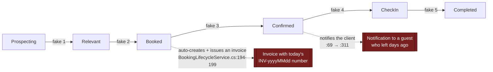
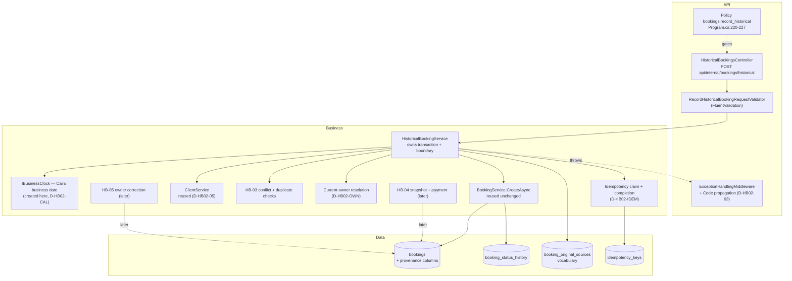
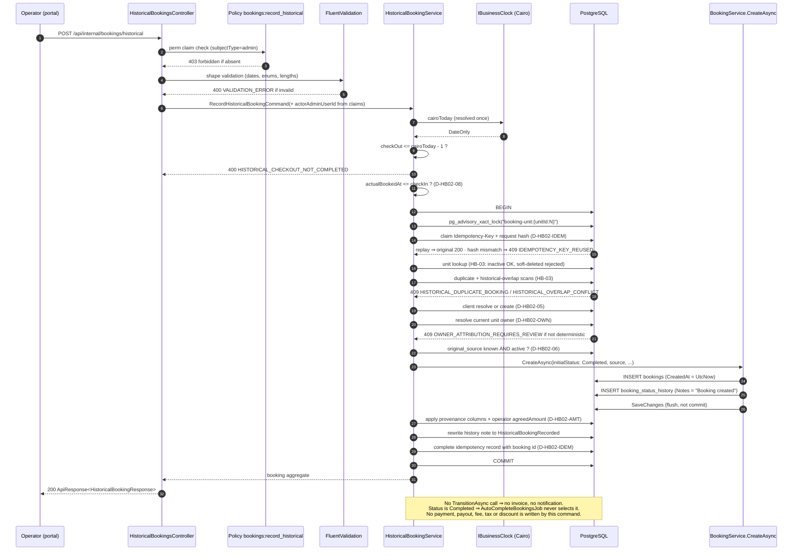

# HB-02 — Historical Booking Domain and API

> [README](README.md) · [Master Plan](00_MASTER_PLAN.md) · Prev: [HB-01](01_TICKET_DISCOVERY_AND_ARCHITECTURE_DECISIONS.md) ·
> Next: [HB-03](03_TICKET_AVAILABILITY_CONFLICTS_AND_DUPLICATE_PROTECTION.md) ·
> Consumers: [HB-04](04_TICKET_FINANCIAL_SNAPSHOT_AND_HISTORICAL_PAYMENTS.md) ·
> [HB-05](05_TICKET_OWNER_ACCOUNTING_AND_SETTLEMENT_ADJUSTMENTS.md) ·
> [HB-07](07_TICKET_NOTIFICATIONS_AUTOMATIONS_AND_INTEGRATIONS.md)

---

## 1. Ticket metadata

| Field | Value |
|---|---|
| Ticket ID | **HB-02** |
| Title | Historical Booking Domain and API |
| Priority | **P0** |
| Type | Backend — domain model, application command, HTTP contract, authorization |
| Status | **IMPLEMENTATION-READY.** Every HB-02 decision gate is `OWNER APPROVED`; no `DECISION REQUIRED`, `TBD` or unresolved alternative remains. **No merge gate is outstanding** — [`PRE-01`](DECISION_RATIFICATION_PACKET.md#pre-01--database-bootstrap-parity-for-migration-0057) and [`PRE-02`](DECISION_RATIFICATION_PACKET.md#pre-02--baseline-test-execution-and-postgresql-integration-infrastructure) are both merged |
| Dependencies | [HB-01](01_TICKET_DISCOVERY_AND_ARCHITECTURE_DECISIONS.md) — complete; ADR-01 … ADR-12 decided. [`PRE-01`](DECISION_RATIFICATION_PACKET.md#pre-01--database-bootstrap-parity-for-migration-0057) — **satisfied, merged**. [`PRE-02`](DECISION_RATIFICATION_PACKET.md#pre-02--baseline-test-execution-and-postgresql-integration-infrastructure) — **satisfied, merged**; its real-PostgreSQL fixture is what HB-02's integration tests run on. [`PRE-00`](DECISION_RATIFICATION_PACKET.md#pre-00--historical-data-census) blocks only if the migration or backfill strategy turns out to depend on existing-row evidence, and blocks pilot approval regardless |
| Dependents | HB-04, HB-05, HB-07 (and transitively HB-06, HB-08, HB-09) |
| Risk level | **High** — introduces a new privileged write path into the booking aggregate |
| Estimated complexity | **L** |
| Implemented by | Sole Project Owner. Review lenses: Engineering · Security · Product |
| Target branch | `feat/hb02-historical-booking-domain-api` |
| Migration in this ticket? | **Yes** — the provenance columns (`is_historical`, `actual_booked_at`, `historical_entry_reason`, `original_source`, `external_reference`), the `booking_original_sources` vocabulary table and its seed, the `idempotency_keys` table, and the `bookings:record_historical` permission seed. Financial objects belong to HB-04; owner-correction audit, idempotency and permission objects belong to HB-05 |

**Scope sentence.** HB-02 delivers the *skeleton of truth*: a dedicated command, a dedicated endpoint, a
dedicated permission, the historical provenance columns, direct-to-`Completed` creation, one truthful audit
row, the idempotency contract for its own endpoint, and one transaction that everything else later hangs
off. It deliberately does **not** own conflict detection (HB-03), the extended financial snapshot or
payments (HB-04), or later owner correction (HB-05) — but it defines the contract slots those tickets fill.

**Two boundaries are easy to misread, so they are stated once here and enforced throughout.** HB-02 captures
the operator's raw `agreedAmount` because a booking cannot be created without an amount — it does **not**
own the immutable financial snapshot, which is HB-04's
([D-HB02-AMT](DECISION_RATIFICATION_PACKET.md#d-hb02-amt--financial-truth-boundary)). HB-02 resolves the *current* unit owner
deterministically and refuses when ownership is uncertain — it accepts **no** owner field from the caller,
and later correction is HB-05's ([D-HB02-OWN](DECISION_RATIFICATION_PACKET.md#d-hb02-own--owner-attribution-boundary)).

---

## 2. Business context

Offline bookings are a normal part of KAZA's operation: agreed by phone or in person, a deposit taken in
cash, the stay happens, and only afterwards does anyone enter it into the platform. The worked example from
[Master Plan §3](00_MASTER_PLAN.md#3-problem-statement) — agreed day 1, deposit day 1, stay days 2–5,
recorded day 10 — is the canonical case.

Today an operator has two bad options: leave it unrecorded (losing revenue, occupancy, owner entitlement and
audit truth), or push it through the normal create endpoint, which — as [F-01](01_TICKET_DISCOVERY_AND_ARCHITECTURE_DECISIONS.md#f-01--there-is-no-server-side-past-date-rule)
proved — silently accepts it while attaching no reason, no permission gate, no provenance and no protection
for the agreed price. Both outcomes corrupt the financial record; the second corrupts it *invisibly*.

HB-02 creates the sanctioned third option. `CONFIRMED` that no such path exists today: the only booking
creation entry points are `BookingsController.cs:97-136` (`POST` and `POST /quick`) and the client, guest,
owner-portal and CRM paths enumerated in
[HB-01 §5.1](01_TICKET_DISCOVERY_AND_ARCHITECTURE_DECISIONS.md#51-booking-creation-paths-complete-enumeration).

---

## 3. Problem being solved

| # | Problem | Consequence today |
|---|---|---|
| P-1 | No command expresses "this stay already happened" | Historical records are indistinguishable from live ones (`is_historical` does not exist — `Booking.cs` has no such field, `CONFIRMED`) |
| P-2 | No permission distinguishes recording history from normal booking | Any `bookings:write` holder can backdate silently (`BookingsController.cs:98`, `CONFIRMED`) — `RISK-10` |
| P-3 | No place to record *why* an entry is late or *where* the booking originally came from | `ck_bookings_source` allows only five channel values (`db/migrations/0016_create_bookings.sql:24`, `CONFIRMED`); free-text notes are unqueryable and rejected by ADR-06 |
| P-4 | No place to record *when* it was agreed, separately from when it was entered | `created_at` is the only date-of-record; falsifying it violates REQ-02/INV-01 |
| P-5 | Reaching `Completed` honestly requires five fabricated transitions | Each fabricated transition writes a false audit row, and Booked→Confirmed additionally auto-creates and issues an invoice (`BookingLifecycleService.cs:194-199`, `CONFIRMED`) and notifies the client (`:69` → `:311`, `CONFIRMED`) |
| P-6 | `CreateAsync` opens no transaction | Booking + history + payment cannot commit atomically today (`BeginTransactionAsync` appears at `BookingService.cs:290`, inside `CreateQuickAsync` only — `CONFIRMED`); violates REQ-19/INV-05 |
| P-7 | The API envelope carries no machine-readable error code | The error contract in [Master §12](00_MASTER_PLAN.md#12-api-and-command-design) has nowhere to live (`ApiResponse` exposes only `Success`, `Data`, `Message`, `Errors`, `Pagination` — `RentalPlatform.API/Models/ApiResponse.cs`, `CONFIRMED`) |

---

## 4. User value

| Audience | Value |
|---|---|
| Operations | A sanctioned, guided, single-submission way to enter a completed offline booking, with an error that explains exactly why an entry was refused |
| Finance | Every historical record carries a reason, an original channel, an agreement date and a named actor — reconciliation stops being forensic guesswork |
| Owners | Past stays on their units become visible and attributable instead of silently absent |
| Security | Backdating becomes a distinct, grantable, revocable, auditable capability rather than a side effect of `bookings:write` |
| Engineering | One command, one transaction, one audit row — a shape that HB-04, HB-05 and HB-07 can extend without re-litigating the boundary |

---

## 5. Current repository behavior

All claims re-verified by direct read at commit `8dafb5a`. Findings already established in
[HB-01 §5](01_TICKET_DISCOVERY_AND_ARCHITECTURE_DECISIONS.md#5-current-repository-behavior) are referenced,
not repeated. This section records the **additional** evidence HB-02 needed and states which
[HB-01 §5.2 gaps](01_TICKET_DISCOVERY_AND_ARCHITECTURE_DECISIONS.md#52-known-gaps-in-this-audit) it closes.

### 5.1 Findings inherited from HB-01

| Finding | Relevance to HB-02 |
|---|---|
| [F-01](01_TICKET_DISCOVERY_AND_ARCHITECTURE_DECISIONS.md#f-01--there-is-no-server-side-past-date-rule) | The historical permission is advisory until REQ-16 hardening ships. HB-02 may merge and deploy first — that ordering is deliberate (`D-ROLL-01`) — but the programme must not be declared released until HB-08 activates hardening |
| [F-04](01_TICKET_DISCOVERY_AND_ARCHITECTURE_DECISIONS.md#f-04--minimal-side-effect-surface) | Creation triggers no notification and there is no outbox/MediatR — suppression is structural, not flagged |
| [F-05](01_TICKET_DISCOVERY_AND_ARCHITECTURE_DECISIONS.md#f-05--autocompletebookingsjob-defines-the-completed-stay-boundary) | Supplies the Cairo completed-stay boundary and guarantees the sweep never touches a `Completed` row |
| [F-06](01_TICKET_DISCOVERY_AND_ARCHITECTURE_DECISIONS.md#f-06--direct-to-completed-creation-is-already-possible) | `initialStatus` already exists — the mechanism for ADR-04 |
| [F-08](01_TICKET_DISCOVERY_AND_ARCHITECTURE_DECISIONS.md#f-08--ck_bookings_source-restricts-source-values) | Forces `original_source` to be a separate column |
| [F-14](01_TICKET_DISCOVERY_AND_ARCHITECTURE_DECISIONS.md#f-14--permission-model) | Dictates permission naming, seeding and policy shape |

### 5.2 Additional evidence verified for HB-02

| # | Claim | Label | Evidence |
|---|---|---|---|
| E-1 | The internal booking route prefix is `api/internal/bookings`, **not** `/api/bookings` | `CONFIRMED` | `RentalPlatform.API/Controllers/BookingsController.cs:21` — `[Route("api/internal/bookings")]`; corroborated by the existing `POST /api/internal/invoices/drafts` cited in F-10 |
| E-2 | Routes are lowercased globally | `CONFIRMED` | `RentalPlatform.API/Program.cs:255-258` — `options.LowercaseUrls = true` |
| E-3 | Successful `POST`s return **200 OK** with the `ApiResponse<T>` envelope, not 201 | `CONFIRMED` | `BookingsController.cs:114,135` — `return Ok(ApiResponse<BookingDetailsResponse>.CreateSuccess(...))` |
| E-4 | The response envelope has **no** error-code field | `CONFIRMED` | `RentalPlatform.API/Models/ApiResponse.cs` — properties are `Success`, `Data`, `Message`, `Errors`, `Pagination` only |
| E-5 | Exception→status mapping is a single switch with four typed branches; **there is no 403 branch** | `CONFIRMED` | `RentalPlatform.API/Middleware/ExceptionHandlingMiddleware.cs:45-72` — `BusinessValidationException`→400, `ConflictException`→409, `NotFoundException`→404, `UnauthorizedBusinessException`→401, default→500 |
| E-6 | Authorization policies are generated by iterating `PermissionKeys.All`; each requires `subjectType=admin` **and** a `perm` claim equal to the key | `CONFIRMED` | `Program.cs:220-227`. Closes the HB-01 §5.2 gap *"RBAC policy handler wiring in `Program.cs`"* |
| E-7 | `PermissionKeys.All` is derived from `Descriptors`, so a new permission must be added to **both** the constant list and the descriptor list or it will never get a policy | `CONFIRMED` | `RentalPlatform.API/Authorization/PermissionKeys.cs:35-62` |
| E-8 | `perm` claims are minted into the JWT from `subject.AdminPermissions` at token issue time | `CONFIRMED` | `RentalPlatform.API/Services/JwtTokenService.cs:141-142` |
| E-9 | Granting a permission by migration is an established pattern, and the precedent also bumps `admin_users.updated_at` to force session re-issue | `CONFIRMED` | `db/migrations/0055_date_block_approvals.sql:32-38`; the session-revocation check it feeds is `Program.cs:203-214` |
| E-10 | `CreateQuickAsync` creates with `BookingStatus.Prospecting`, **not** `Booked` | `CONFIRMED` | `BookingService.cs:364`. Closes the HB-01 §5.2 gap *"`CreateQuickAsync` initial status"* and corrects HB-01 §5.1 |
| E-11 | The advisory lock is acquired **inside** the transaction opened by `CreateQuickAsync`; `CreateAsync` acquires no lock and opens no transaction | `CONFIRMED` | `BookingService.cs:290` (transaction), `:331-333` (`AcquireTransactionAdvisoryLockAsync($"booking-unit:{unitId:N}")`), versus `CreateAsync` at `:130-257` which contains neither |
| E-12 | `CreateAsync` ends with its own `SaveChangesAsync` | `CONFIRMED` | `BookingService.cs:254` — safe to compose inside an ambient transaction, but it *is* a flush, so post-conditions must be applied before commit, not after |
| E-13 | The update path is `UpdatePendingAsync` and it refuses any booking not in `Prospecting`/`Relevant` | `CONFIRMED` | `BookingService.cs:370-387`. A booking created directly in `Completed` therefore cannot be repriced through this path at all |
| E-14 | There is **no** shared client match-or-create helper anywhere in the solution | `CONFIRMED` | Greps for `MatchOrCreate`/`ResolveClient`/`EnsureClient`/`FindOrCreate` across the solution return nothing |
| E-15 | The nearest behaviour is guest checkout, which **rejects** rather than matches when the phone already exists | `CONFIRMED` | `GuestBookingService.cs:42-52` — `ConflictException("An account already exists for this phone…")`; phone normalisation is a private helper at `:100-109` |
| E-16 | `ClientService.CreateAsync` requires a plaintext password, rejects a duplicate normalised phone with 409, and calls `SaveChangesAsync` internally | `CONFIRMED` | `ClientService.cs:60,68,72-76,97` |
| E-17 | `booking_status_history.new_status` accepts `'completed'` and `notes` is unbounded `TEXT` | `CONFIRMED` | `db/migrations/0017_create_booking_status_history.sql:7,14` |
| E-18 | The status-history actor resolver special-cases `BookingHistoryEvents.BookingCreated` by exact string match to label a row as a *creation* entry | `CONFIRMED` | `BookingsController.cs:265-288`. A new note constant will not be recognised as a creation entry unless a branch is added |
| E-19 | `Booking` uses PostgreSQL `xmin` as an optimistic-concurrency row version | `CONFIRMED` | `RentalPlatform.Data/Configurations/BookingConfiguration.cs:82-83` |
| E-20 | `Unit`, `Client` and `Owner` all carry a global soft-delete query filter | `CONFIRMED` | `UnitConfiguration.cs:81`, `ClientConfiguration.cs:13`, `OwnerConfiguration.cs:13`. Distinguishing "not found" from "soft-deleted" requires `IgnoreQueryFilters()` |
| E-21 | Services are registered scoped in `Program.cs` alongside the existing booking services | `CONFIRMED` | `Program.cs:283-285` |
| E-22 | The `bookings` table has no historical, provenance, currency, fee, tax or commission column of any kind | `CONFIRMED` | `db/migrations/0016_create_bookings.sql:1-16`; `RentalPlatform.Data/Entities/Booking.cs` |
| E-23 | A booking-source vocabulary **already exists**, but it is a *contact-channel* taxonomy fixed by a CHECK constraint with no label and no active/inactive concept | `CONFIRMED` | `db/migrations/0016_create_bookings.sql:24` — `ck_bookings_source CHECK (source IN ('direct','admin','phone','whatsapp','website'))`; duplicated at `db/migrations/0018_create_crm_leads.sql:23` and hard-coded at `BookingService.cs:23` and `CrmLeadService.cs:22`. There is **no** lookup table for it anywhere |
| E-24 | Client phone identity is normalised by stripping a leading `+`, validated against `^\+?\d{10,15}$`, and a duplicate raises `ConflictException` | `CONFIRMED` | `ClientService.cs:23` (regex), `:198` (`NormalizePhoneIdentity(phone) => phone.TrimStart('+')`), `:72-76` (duplicate probe and throw). The database also enforces `ux_clients_phone` UNIQUE on the raw column (`db/migrations/0005_create_clients.sql:61`) |
| E-25 | Booking money is `DECIMAL(12,2)` and already constrained non-negative | `CONFIRMED` | `db/migrations/0016_create_bookings.sql:11-12,28-29` — `base_amount`/`final_amount DECIMAL(12,2) NOT NULL` with `ck_bookings_base_amount_non_negative` and `ck_bookings_final_amount_non_negative` (`>= 0`); EF mirrors it at `BookingConfiguration.cs:56,61` (`decimal(12,2)`) |
| E-26 | **No** idempotency infrastructure exists anywhere in the solution — no table, no header handling, no request-hash store | `CONFIRMED` | A repository-wide grep for `idempotenc` across `*.cs` and `*.sql` returns only a comment in `db/migrations/0001_init_postgres_conventions_rollback.sql:31`. `idempotency_keys` is therefore new in every sense |
| E-27 | The Cairo business-date expression exists in exactly **one** place and is private to a hosted service — there is no shared, injectable resolver | `CONFIRMED` | `RentalPlatform.API/Services/AutoCompleteBookingsJob.cs:70`, `:137`, `:141`. Nothing in `RentalPlatform.Business` or `RentalPlatform.Shared` exposes it |

### 5.3 Gaps this ticket inherits

| Gap | Label | Disposition in HB-02 |
|---|---|---|
| Client match-or-create algorithm and phone normalisation | Was `BLOCKED` in HB-01 §5.2 | **Closed.** E-14/E-15/E-16/E-24 establish that no match-or-create exists and that the platform's existing answer to a known phone is a refusal. [`D-HB02-05`](DECISION_RATIFICATION_PACKET.md#d-hb02-05--client-reference-contract) is `OWNER APPROVED`: exactly-one-of `clientId` / `newClient`, and a known phone is refused with the existing id returned |
| Portfolio/tenant scoping rules for units and owners | `BLOCKED` | Owned by [HB-05](05_TICKET_OWNER_ACCOUNTING_AND_SETTLEMENT_ADJUSTMENTS.md); HB-02 leaves the scoping call site as an explicit seam |
| `OwnerPortalBookingService` creation semantics | `BLOCKED` | HB-01. Irrelevant to HB-02 — the historical command is admin-only |

---

## 6. Target behavior

1. A new application command, `RecordHistoricalBookingCommand`, handled by a new
   `HistoricalBookingService`, is the only way to create a booking whose stay has already completed.
2. A new endpoint, `POST /api/internal/bookings/historical`, gated by the new policy
   `bookings:record_historical`, is its only HTTP surface.
3. The command rejects anything that is not a fully completed stay under the Cairo boundary (ADR-03),
   returning `400 HISTORICAL_CHECKOUT_NOT_COMPLETED`.
4. It creates the booking **directly** in `Completed` via the existing `initialStatus` parameter (ADR-04,
   F-06) — never by walking the transition chain.
5. It writes exactly **one** status-history row: `OldStatus = null`, `NewStatus = "completed"`,
   `ChangedByAdminUserId = <authenticated actor>`, `ChangedAt = UtcNow`,
   `Notes = BookingHistoryEvents.HistoricalBookingRecorded`.
6. It persists provenance: `is_historical = true`, `actual_booked_at`, `historical_entry_reason`,
   `original_source`, optional `external_reference`.
7. It wraps booking + history in **one** transaction under the existing `booking-unit:{unitId:N}` advisory
   lock (REQ-19, INV-05). Payment does **not** join that transaction:
   [D-PAY-01](DECISION_RATIFICATION_PACKET.md#d-pay-01--historical-payment-policy) is `OWNER APPROVED` for a
   **separate privileged command**, so this transaction covers booking + history only.
8. It emits no notification, creates **no invoice**, and is never selected by `AutoCompleteBookingsJob`. The
   no-invoice behaviour is [D-INV-01](DECISION_RATIFICATION_PACKET.md#d-inv-01--invoice-policy),
   `OWNER APPROVED`, and it is also what the code does naturally — the sole auto-create site is the
   `Booked → Confirmed` transition, which this flow never executes.
9. `CreatedAt`, `UpdatedAt` and `ChangedAt` remain real system time (REQ-02, INV-01).

---

## 7. In scope

- `RecordHistoricalBookingCommand` + `HistoricalBookingService` + `IHistoricalBookingService`.
- `HistoricalBookingsController` (or a new action on `BookingsController` — see `D-HB02-02`) exposing
  `POST /api/internal/bookings/historical`.
- `PermissionKeys.BookingsRecordHistorical = "bookings:record_historical"`, with its descriptor, policy and
  seed. The separate HB-05 permission `bookings:correct_owner_attribution` is not introduced here
  ([D-HB02-OWN](DECISION_RATIFICATION_PACKET.md#d-hb02-own--owner-attribution-boundary)).
- **The narrowest Cairo business-date abstraction** the validation needs, created here and consumed by
  everything downstream ([D-HB02-CAL](DECISION_RATIFICATION_PACKET.md#d-hb02-cal--cairo-business-date-ownership)).
- Provenance columns and their constraints; the `historical_entry_reason` allow-list; the
  `booking_original_sources` vocabulary table, its seed and its foreign key.
- **The idempotency contract for this endpoint** and the `idempotency_keys` table that backs it
  ([D-HB02-IDEM](DECISION_RATIFICATION_PACKET.md#d-hb02-idem--idempotency-ownership-and-contract)).
- **Deterministic resolution of the current unit owner**, and refusal when ownership is uncertain.
- **Truthful capture of the operator-supplied `agreedAmount`** into the booking's existing amount columns,
  never defaulted from current pricing.
- `BookingHistoryEvents.HistoricalBookingRecorded` and the actor-resolution branch (E-18).
- The transaction and advisory-lock boundary that HB-03/HB-04/HB-05 plug into.
- Client resolution for the historical flow (per [`D-HB02-05`](DECISION_RATIFICATION_PACKET.md#d-hb02-05--client-reference-contract)).
- Request/response DTOs, FluentValidation validator, and the machine-readable error-code transport
  (per [`D-HB02-03`](DECISION_RATIFICATION_PACKET.md#d-hb02-03--machine-readable-error-transport)).
- Structured audit event `booking.historical.recorded` and the creation/rejection metrics.
- Backward-compatibility guarantees for all existing booking responses.

## 8. Out of scope

| Excluded | Owner |
|---|---|
| Historical conflict detection including `Completed`/`LeftEarly`, duplicate detection, inactive-unit lookup | [HB-03](03_TICKET_AVAILABILITY_CONFLICTS_AND_DUPLICATE_PROTECTION.md) |
| The immutable extended financial snapshot (`bookings.agreed_amount` and its constraint), the repricing guard, payment semantics, payment evidence, fees, taxes, discounts, invoice consequences | [HB-04](04_TICKET_FINANCIAL_SNAPSHOT_AND_HISTORICAL_PAYMENTS.md) |
| Read-only owner review, separate privileged correction, mandatory reason, immutable previous/selected-owner chain, dedicated idempotency and payout-safety checks | [HB-05](05_TICKET_OWNER_ACCOUNTING_AND_SETTLEMENT_ADJUSTMENTS.md) |
| The portal wizard | [HB-06](06_TICKET_HISTORICAL_BOOKING_WIZARD_UI.md) |
| The exhaustive side-effect assertion matrix | [HB-07](07_TICKET_NOTIFICATIONS_AUTOMATIONS_AND_INTEGRATIONS.md) |
| Reporting stay-period dimension | [HB-08](08_TICKET_REPORTING_AUDIT_OBSERVABILITY_AND_ROLLOUT.md) |
| Normal-flow past-date hardening | [HB-01](01_TICKET_DISCOVERY_AND_ARCHITECTURE_DECISIONS.md) |
| Ongoing stays, bulk import, holds of any kind, backdating `CreatedAt` | Non-goals, [Master §5](00_MASTER_PLAN.md#5-non-goals) |

---

## 9. Assumptions

| # | Assumption | Label | If false |
|---|---|---|---|
| A-HB02-1 | ~~HB-01's shared Cairo business-date resolver exists and is injectable~~ **Withdrawn.** E-27 proves no shared resolver exists. **HB-02 creates it** — see [D-HB02-CAL](DECISION_RATIFICATION_PACKET.md#d-hb02-cal--cairo-business-date-ownership) | `CONFIRMED` — E-27 | n/a; the assumption has been replaced by an owned deliverable |
| A-HB02-2 | `Completed` remains terminal, so nothing can later transition a historical booking | `CONFIRMED` — `BookingStatusTransitions.cs:18` | Re-open the audit-truthfulness design |
| A-HB02-3 | Composing `CreateAsync` inside an outer transaction is safe | `CONFIRMED` by precedent — `GuestBookingService.cs:39-76` does exactly this via `CreateQuickAsync` | Inline the insert instead of composing |
| A-HB02-4 | Single currency; fees and taxes fold into the agreed total | `OWNER APPROVED — OUT OF V1` — [OQ-05](DECISION_RATIFICATION_PACKET.md#oq-05--currency-model) and [OQ-06](DECISION_RATIFICATION_PACKET.md#oq-06--fee-tax-and-discount-model) record the accepted risks and revisit triggers | The request contract gains a currency field and HB-04 grows only if that out-of-v1 scope is later ratified |
| A-HB02-5 | The historical flow is admin-only; no client, owner-portal or storefront surface | `PROPOSED` | New authorization analysis required |
| A-HB02-6 | Adding a nullable field to `ApiResponse` is backward-compatible for both portals | `INFERRED` — additive JSON property; every existing field is preserved and every existing factory overload keeps its signature | Nothing in HB-02 changes: [`D-HB02-03`](DECISION_RATIFICATION_PACKET.md#d-hb02-03--machine-readable-error-transport) explicitly **forbids** the `errors[0]` carrier, so there is no fallback to fall back to. A genuine incompatibility would be a defect to fix, not a contract to renegotiate |

---

## 10. Decisions

**Every decision in this ticket is settled.** There is no `DECISION REQUIRED` item, no `TBD`, and no
unresolved alternative anywhere in HB-02. Decision authority for every row is the **Sole Project Owner**
(`Hozaifa Almelli`, 2026-07-29). The **Review lens** column names the perspectives applied — it is not a
list of separate approvers.

Eight decisions were escalated to the [decision record](DECISION_RATIFICATION_PACKET.md) because they change
a shared contract or a cross-ticket boundary; those carry a link. The remaining six are local to HB-02 and
are recorded here in full.

### 10.1 Ratified decisions

| ID | Subject | **Ratified decision** | Review lens | Status |
|---|---|---|---|---|
| [D-HB02-01](#d-hb02-01) | Concrete route | **`POST /api/internal/bookings/historical`.** The verified controller prefix is `api/internal/bookings` (E-1) and routes are lowercased globally (E-2). The Master Plan string is the same route, and [Master §12.1](00_MASTER_PLAN.md#121-the-canonical-historical-contract) is the normative statement of it | Engineering | **`OWNER APPROVED`** |
| [D-HB02-02](#d-hb02-02) | Controller placement | **New `HistoricalBookingsController` with `[Route("api/internal/bookings")]` and `[HttpPost("historical")]`.** Keeps the privileged path visually separate and gives HB-07 one file to assert against | Engineering | **`OWNER APPROVED`** |
| [D-HB02-03](DECISION_RATIFICATION_PACKET.md#d-hb02-03--machine-readable-error-transport) | Machine-readable error transport | **Add an optional `Code` to the shared `ApiResponse` contract**, populated from coded business exceptions by `ExceptionHandlingMiddleware`. Every existing field is preserved; human-readable `message` remains; the code is **never** encoded inside `errors[0]`; unrelated endpoints are not required to migrate. Full contract in §14.4 | Engineering · Product | **`OWNER APPROVED`** |
| [D-HB02-04](DECISION_RATIFICATION_PACKET.md#d-hb02-04--owner-correction-authorization-transport) | Owner-correction authorization transport | **Not applicable to HB-02.** HB-02 accepts no owner field. HB-05's separate correction endpoint uses the existing policy authorization 403 for a missing `bookings:correct_owner_attribution` grant; it adds no business-exception 403 branch. HB-02 uncertainty remains `409 OWNER_ATTRIBUTION_REQUIRES_REVIEW`. See §10.2 | Engineering · Security | **`OWNER APPROVED`** |
| [D-HB02-05](DECISION_RATIFICATION_PACKET.md#d-hb02-05--client-reference-contract) | Client reference contract | **Exactly one of `clientId` or `newClient`.** Both or neither ⇒ `400 CLIENT_REFERENCE_INVALID`. Unknown `clientId` ⇒ `404 CLIENT_NOT_FOUND`. A duplicate normalised phone returns only `existingClientId`: `409 CLIENT_PHONE_ALREADY_EXISTS` for an active, non-deleted client that may be selected on retry; `409 CLIENT_PHONE_REQUIRES_REVIEW` for an inactive or soft-deleted client that requires administrative review/reactivation and must not be reused directly. **No duplicate is created, and no silent reuse, merge, reactivation, restoration, or mutation occurs.** Full rules in §14.2 | Product · Engineering | **`OWNER APPROVED`** |
| [D-HB02-06](DECISION_RATIFICATION_PACKET.md#d-hb02-06--original_source-vocabulary) | `original_source` vocabulary | **Database-backed lookup table `booking_original_sources(code, label, is_active)`, seeded with exactly `legacy_system`, `external_platform`, `offline_record`, `other`**, with `bookings.original_source` a foreign key to it. Free text is unrepresentable. An unknown *or inactive* code ⇒ `400 ORIGINAL_SOURCE_INVALID`. The existing `ck_bookings_source` channel vocabulary was inspected and is **not** reused — see §15.3 | Product · Finance · Engineering | **`OWNER APPROVED`** |
| [D-HB02-07](#d-hb02-07) | `actual_booked_at` type | **`DATE`.** It is a business fact about a day, and `DATE` inherits the timezone-free property of the stay dates | Engineering | **`OWNER APPROVED`** |
| [D-HB02-08](#d-hb02-08) | `actual_booked_at <= check_in_date`? | **Yes, enforced as `400 VALIDATION_ERROR`** with a message naming both dates. Revisited only if Operations produces a real counter-example | Product | **`OWNER APPROVED`** |
| [D-HB02-09](#d-hb02-09) | Initial grant of `bookings:record_historical` | **SuperAdmin at migration time only**; further grants performed through the RBAC admin UI during the pilot | Security · Operations | **`OWNER APPROVED`** |
| [D-HB02-10](#d-hb02-10) | Does it imply `bookings:write`? | **No implication.** Grant `bookings:read` alongside it and document the pairing in the rollout checklist | Security | **`OWNER APPROVED`** |
| [D-HB02-IDEM](DECISION_RATIFICATION_PACKET.md#d-hb02-idem--idempotency-ownership-and-contract) | Idempotency ownership and contract | **HB-02 owns `idempotency_keys` and the command's idempotency contract.** The `Idempotency-Key` header is **required**. Full contract in §19 | Engineering · Operations | **`OWNER APPROVED`** |
| [D-HB02-AMT](DECISION_RATIFICATION_PACKET.md#d-hb02-amt--financial-truth-boundary) | Financial truth boundary | **HB-02 requires `agreedAmount` and persists it verbatim** into the booking's existing amount columns; it is never defaulted from current pricing. HB-02 creates no invoice, payment, payout, fee, tax, discount or extended snapshot. HB-04 owns all of those | Finance · Engineering | **`OWNER APPROVED`** |
| [D-HB02-OWN](DECISION_RATIFICATION_PACKET.md#d-hb02-own--owner-attribution-boundary) | Owner attribution boundary | **HB-02 resolves the current unit owner from trusted repository state and accepts no owner field from the caller.** Deterministic single owner ⇒ use and persist it. Absent, multiple, ambiguous, or needing historical correction ⇒ `409 OWNER_ATTRIBUTION_REQUIRES_REVIEW`. Later correction is HB-05's separate command | Finance · Security · Product | **`OWNER APPROVED`** |
| [D-HB02-CAL](DECISION_RATIFICATION_PACKET.md#d-hb02-cal--cairo-business-date-ownership) | Cairo business-date ownership | **HB-02 creates the narrowest repository-consistent Cairo business-date abstraction** required for deterministic validation of `check_out_date <= Cairo business date − 1`. This is no longer a readiness blocker, and it is explicitly **not** an application-wide time redesign | Engineering · Operations | **`OWNER APPROVED`** |

### 10.2 D-HB02-04 in full — the subject, and why it dissolves

The original question was narrow and specific:

> **How is authorization refusal for a later owner correction produced?**

It was a transport question, not a policy question about ownership. Contract closure supersedes the earlier
exception proposal: policy authorization already owns 403 responses.

That answer is now wrong for HB-02, for a reason that has nothing to do with transport:
[D-HB02-OWN](DECISION_RATIFICATION_PACKET.md#d-hb02-own--owner-attribution-boundary) removes the owner override from the HB-02 request
contract entirely. There is no `ownerAttribution` object and no `ownerId` field. **An override cannot be
requested on this endpoint, so an override refusal cannot occur on this endpoint**, and building the
mechanism that reports one would be building HB-05 behavior inside HB-02 — precisely what the ticket
boundaries exist to prevent.

The smallest repository-consistent resolution is therefore to build nothing:

| Question | Resolution |
|---|---|
| Does HB-02 introduce a new forbidden-business exception? | **No.** |
| Does HB-02 add a `403` branch to `ExceptionHandlingMiddleware`? | **No.** The middleware's four typed branches (E-5) are sufficient for every HB-02 error, because every HB-02 error is a `400`, `404` or `409` |
| How does HB-02 report uncertain ownership, then? | `409 OWNER_ATTRIBUTION_REQUIRES_REVIEW`, thrown as `ConflictException`, which already maps to `409` at `ExceptionHandlingMiddleware.cs:53-56`. **No new exception type and no new middleware branch** |
| How is an unauthorized HB-05 correction refused? | The existing authorization policy returns 403 when `bookings:correct_owner_attribution` is absent. HB-05 introduces no new middleware branch |
| Is the `403` from a *missing* `bookings:record_historical` affected? | **No.** That `403` is produced by the authorization policy before the action body runs; it carries an empty body and needs no exception type and no code (E-6) |

**Consequence for the middleware diff.** HB-02 touches `ExceptionHandlingMiddleware` for exactly one reason
— propagating the new `Code` (D-HB02-03). The status-mapping switch is unchanged.

### 10.3 Decision detail for the locally-owned rows

<a id="d-hb02-01"></a>**D-HB02-01 — route.** [Master §12.1](00_MASTER_PLAN.md#121-the-canonical-historical-contract)
is normative and already carries this route and `200 OK`. Nothing in HB-02 diverges from it.

<a id="d-hb02-02"></a>**D-HB02-02 — controller placement.** A separate controller costs one file and buys a
single, greppable location for the privileged path. HB-07 asserts against that file; a security reviewer
reads one attribute list rather than scanning `BookingsController`.

<a id="d-hb02-07"></a>**D-HB02-07 — `actual_booked_at` is `DATE`.** Consistent with `check_in_date` and
`check_out_date`, both `DATE` (`db/migrations/0016_create_bookings.sql`), and with
[Master §11](00_MASTER_PLAN.md#11-ratified-data-model). A timestamp would reintroduce the timezone question
that ADR-03 exists to settle.

<a id="d-hb02-08"></a>**D-HB02-08 — `actual_booked_at <= check_in_date`.** Agreeing a booking after the stay
began is operationally possible but overwhelmingly a typo. Rejecting it costs an operator one correction;
accepting it silently corrupts the agreement-date dimension that Finance will reconcile against.

<a id="d-hb02-09"></a>**D-HB02-09 — initial grant.** Seeding only SuperAdmin means the endpoint is live but
unusable by anyone else until a deliberate grant. That is the pilot control described in §24.

<a id="d-hb02-10"></a>**D-HB02-10 — no implied `bookings:write`.** Policies are independent claims (E-6). A
role that can record history but cannot read bookings back is a usability trap, so `bookings:read` is
granted alongside — but as a *documented pairing*, not as an implication in code.

---

## 11. Architecture and technical design

### 11.1 Why a dedicated command, not a flag (ADR-01)

The tempting design is `POST /api/internal/bookings` with `allowPastDates: true`. It must be rejected, for
five separate reasons — worth spelling out because the shortcut will be proposed again during review:

| # | Argument | Evidence |
|---|---|---|
| 1 | **A request field is not an authorization decision.** Authorization in this codebase is a policy over a `perm` claim evaluated before the action runs (`Program.cs:220-227`, E-6). A body field is evaluated *after* the caller has already been authorised as `bookings:write`. Making the field meaningful would require re-checking permissions inside the service — the exact anti-pattern where privilege checks drift from routes | E-6 |
| 2 | **It is forgeable in the only place that matters.** The flag would travel from a client that also renders the "normal" form. Any caller holding `bookings:write` could set it. The permission boundary would exist only in the UI | `BookingsController.cs:98` |
| 3 | **It creates one endpoint with two contradictory validation modes.** After HB-01, the normal endpoint must *reject* past dates; the historical path must *require* them. A single handler would branch on a boolean into two mutually exclusive rule sets, and every future validator would need to ask "which mode am I in?" | HB-01 §11.2 |
| 4 | **It is unauditable at the HTTP layer.** Access logs, rate limits, metrics and security review all operate on route + policy. A flag buried in a JSON body is invisible to all of them. A distinct route makes "who recorded history" answerable from access logs alone | §20 |
| 5 | **It cannot carry the mandatory payload.** Reason, original source, agreement date and owner confirmation are *required* for historical entries and *meaningless* for normal ones. A shared DTO would make them all optional, which is exactly how a required field stops being required | REQ-04, REQ-07 |

HB-01 §11.2.5 already forbids a `bypassPastDateValidation` parameter on `CreateAsync`. HB-02 honours that:
the historical service **composes** `CreateAsync` and performs its own pre-validation. The one parameter it
does use — `initialStatus` — is pre-existing, legitimate, and not a bypass: it selects a starting state, it
does not disable a rule.

### 11.2 Direct-to-`Completed` creation (ADR-04)

`CONFIRMED` (F-06): `BookingService.cs:140` declares `BookingStatus? initialStatus = null` and `:217`
resolves `var startingStatus = initialStatus ?? BookingStatus.Prospecting`. Passing
`BookingStatus.Completed` is therefore a supported, already-exercised code path requiring no change to
`BookingService`.

The alternative — creating in `Prospecting` and transitioning up — is disqualified:



| Cost of the transition-walk | Requirement violated |
|---|---|
| Five status-history rows describing events that never happened | REQ-12, INV-01 |
| An invoice auto-created and issued on Booked→Confirmed (`BookingLifecycleService.cs:194-199`) | REQ-13, and F-10's numbering encodes the wrong date |
| A client status-change notification on transition (`BookingLifecycleService.cs:69` → `:311`) | REQ-13, INV-07, `RISK-06` |
| Five `UpdatedAt` writes and five transaction round-trips | REQ-19 |

Direct creation costs none of these. The historical command never calls `TransitionAsync`, so the
notification and invoice code paths are unreachable **by construction** rather than by suppression — which
is stronger, because no caller can re-enable them.

### 11.3 The single truthful history row

`PROPOSED` — extend the existing constants file, mirroring its established two-constant pattern
(`RentalPlatform.Shared/Constants/BookingHistoryEvents.cs:5,7-8`, `CONFIRMED`):

```csharp
// RentalPlatform.Shared/Constants/BookingHistoryEvents.cs  (PROPOSED addition)
public const string HistoricalBookingRecorded =
    "Historical booking recorded after the stay had already completed.";
```

The row written by the command:

| Column | Value | Rationale |
|---|---|---|
| `old_status` | `null` | Nothing preceded it. A non-null value would assert a transition that never occurred |
| `new_status` | `"completed"` | Accepted by `ck_booking_status_history_new_status` (E-17) |
| `changed_by_admin_user_id` | The authenticated admin GUID from `ClaimTypes.NameIdentifier` | INV-11; never client-supplied. Existing precedent: `BookingsController.cs:244-251` |
| `notes` | `BookingHistoryEvents.HistoricalBookingRecorded` | Distinguishable by exact match, exactly as `AutomaticCompletion` is |
| `changed_at` | `DateTime.UtcNow` | INV-01 — real system time, never the agreement date |

Because `CreateAsync` already writes a row with `Notes = BookingHistoryEvents.BookingCreated`
(`BookingService.cs:242-253`, `CONFIRMED`), the command must produce the *historical* note instead of, not
in addition to, that row. Two options:

| Option | Assessment |
|---|---|
| **(a) Overwrite before commit** — call `CreateAsync`, then update the single history row it created (it is in the same `DbContext` and the same transaction) to carry the historical note | `PROPOSED — recommended`. No signature change to `BookingService`; the row is located deterministically by `BookingId`; nothing is ever committed with the wrong note because the enclosing transaction has not committed. Requires E-12 awareness: `CreateAsync` flushes, so re-read from the tracked context, not the database |
| (b) Add an optional `historyNote` parameter to `CreateAsync` | Cleaner to read, but widens a shared, heavily-used signature for one caller and drags every other call site into the diff |

Whichever is chosen, the **post-condition is identical and testable**: exactly one row for the booking, with
the values in the table above. Assert the post-condition, not the mechanism.

`PROPOSED` — also add a branch to `ResolveHistoryActor` (`BookingsController.cs:265-288`, E-18) so a
historical row is recognised as a creation entry; otherwise a row whose admin user was later deactivated
would render as *"Actor unavailable"* instead of *"Creator unavailable"*, which is a small but real audit
regression.

### 11.4 The completed-stay boundary (ADR-03)

`CONFIRMED` (F-05) — `AutoCompleteBookingsJob.cs:68-70`:

```csharp
var cairoNow = TimeZoneInfo.ConvertTimeFromUtc(now, CairoTimeZone);
var completedAfterCheckoutCutoff = DateOnly.FromDateTime(cairoNow).AddDays(-1);
```

`PROPOSED` placement and rules:

| Rule | Where | Why there |
|---|---|---|
| Resolve the Cairo business date **once** per request | `HistoricalBookingService`, first statement of the handler | A single evaluation makes the midnight-boundary case deterministic (`RISK-08`, `SC-DATE-07`) |
| `checkOutDate <= cairoToday.AddDays(-1)` else `400 HISTORICAL_CHECKOUT_NOT_COMPLETED` | `HistoricalBookingService`, before any I/O | Free of side effects; fails fast; keeps the rule out of per-DTO validators where it would drift |
| `checkOutDate > checkInDate` | FluentValidation **and** `BookingService.ValidateStayDates` (`:463-467`) | Already enforced twice, plus `ck_bookings_valid_stay_range` |
| Never use `DateTime.Now` / `DateTime.Today` | Everywhere | Container local time is not Cairo (NAC-HB01-08) |

**HB-02 creates the resolver** ([D-HB02-CAL](DECISION_RATIFICATION_PACKET.md#d-hb02-cal--cairo-business-date-ownership)). E-27 proves
none exists: the expression lives once, privately, inside a hosted service. The narrowest thing that makes
the validation deterministic and testable is a single injectable abstraction in `RentalPlatform.Business`
exposing the current Cairo business date:

```csharp
// PROPOSED — the whole abstraction. Nothing else changes.
public interface IBusinessClock
{
    DateOnly CairoToday();      // DateOnly.FromDateTime(TimeZoneInfo.ConvertTimeFromUtc(DateTime.UtcNow, Cairo))
}
```

| Constraint on the abstraction | Why |
|---|---|
| It exposes the **business date only** — no general clock, no `Now`, no `UtcNow` wrapper | The decision authorises the narrowest thing that makes validation deterministic, explicitly **not** an application-wide time redesign |
| It reuses the identical timezone lookup already proven at `AutoCompleteBookingsJob.cs:137,141` (`Africa/Cairo`, falling back to `Egypt Standard Time`) | One definition of the Cairo day, not two |
| `AutoCompleteBookingsJob` is **not** refactored to consume it in HB-02 | That job is on the explicitly-unchanged list in §13. Converging the job onto the shared abstraction is HB-08's, alongside the rest of the observability work |
| It is injected, never `static` | The boundary tests in §29 set the business date directly rather than waiting for midnight |

Two copies of this expression is the single most likely way this feature develops a silent off-by-one, which
is why the abstraction is a deliverable rather than a convenience.

### 11.5 Transaction ownership (REQ-19 / INV-05)

`CONFIRMED` (E-11, P-6): `CreateAsync` neither opens a transaction nor takes the advisory lock. Both live in
`CreateQuickAsync` (`BookingService.cs:290`, `:331-333`). Therefore **the historical service must own the
transaction**. Proposed ordering, following the `GuestBookingService.cs:39-76` precedent:

```
cairoToday = clock.CairoToday()                       -- once, BEFORE the transaction (D-HB02-CAL)
boundary + shape checks                               -- side-effect free, fail fast

BEGIN TRANSACTION                                     (IUnitOfWork.BeginTransactionAsync)
  AcquireTransactionAdvisoryLockAsync("booking-unit:{unitId:N}")   -- same key as the normal flow
  claim the idempotency key                           (D-HB02-IDEM; in-transaction INSERT)
  resolve unit            (HB-03 owns inactive/soft-deleted rules)
  duplicate scan          (HB-03)
  historical conflict scan incl. Completed + LeftEarly (HB-03)
  resolve client          (D-HB02-05)
  resolve current unit owner, or refuse               (D-HB02-OWN)
  validate original_source is known AND active        (D-HB02-06)
  BookingService.CreateAsync(initialStatus: Completed, ...)        -- flushes (E-12)
  apply provenance columns + the operator's agreedAmount (D-HB02-AMT)
  rewrite the history row's note                                   (§11.3 option a)
  complete the idempotency record with the booking id (D-HB02-IDEM)
  SaveChangesAsync
COMMIT
```

Two orderings inside that block are load-bearing rather than stylistic. The **idempotency key is claimed
first**, immediately after the lock, so that a replay is detected before any scan runs and before any row is
written; and the **idempotency record is completed in the same transaction as the booking insert**, so a
rolled-back attempt leaves no key behind and the retry is clean (D-HB02-IDEM). Neither may be reordered for
convenience.

The advisory-lock key **must** be the identical string used by the normal flow
(`$"booking-unit:{unitId:N}"`, `BookingService.cs:332`) and by `BookingLifecycleService`. A different key
would leave concurrent normal and historical creation mutually invisible — the precise race HB-03 exists to
close.

### 11.6 Component placement



---

## 12. Expected data flow



---

## 13. Expected files/components likely to change

`PROPOSED` — indicative, not prescriptive. The implementer confirms against the tree at branch time.

| Path | Likely change | New? |
|---|---|---|
| `RentalPlatform.API/Controllers/HistoricalBookingsController.cs` | The endpoint, actor extraction, response mapping | **New** |
| `RentalPlatform.API/DTOs/Requests/Bookings/RecordHistoricalBookingRequest.cs` | Request record | **New** |
| `RentalPlatform.API/DTOs/Responses/Bookings/HistoricalBookingResponse.cs` | Response record | **New** |
| `RentalPlatform.API/Validators/HistoricalBookingValidators.cs` | Shape validation, enum allow-lists | **New** |
| `RentalPlatform.API/Authorization/PermissionKeys.cs` | Two constants **and** two descriptors (E-7) | Edit |
| `RentalPlatform.API/Models/ApiResponse.cs` | Nullable `Code` (D-HB02-03) | Edit |
| `RentalPlatform.API/Middleware/ExceptionHandlingMiddleware.cs` | `Code` propagation only (D-HB02-03). **The status-mapping switch is unchanged** — no `403` branch is added here (D-HB02-04, §10.2) | Edit |
| `RentalPlatform.API/Controllers/BookingsController.cs` | `ResolveHistoryActor` branch (E-18); optionally surface `isHistorical` in existing responses | Edit |
| `RentalPlatform.API/Program.cs` | DI registration next to `:283-285` | Edit |
| `RentalPlatform.Business/Services/HistoricalBookingService.cs` | The command handler and transaction owner | **New** |
| `RentalPlatform.Business/Interfaces/IHistoricalBookingService.cs` | Interface | **New** |
| `RentalPlatform.Business/Models/RecordHistoricalBookingCommand.cs` | Command + result records | **New** |
| New forbidden-business exception | **Not created.** Policy authorization handles HB-05 permission failures (D-HB02-04, §10.2) | — |
| `RentalPlatform.Business/Exceptions/IBusinessErrorCode.cs` | The one-member interface carrying `Code` | **New** |
| `RentalPlatform.Business/Exceptions/` (the four existing types) | Implement `IBusinessErrorCode` via an additive optional `code` argument; **every existing constructor keeps its signature** (D-HB02-03) | Edit |
| `RentalPlatform.Business/Time/IBusinessClock.cs` + implementation | The Cairo business-date abstraction (D-HB02-CAL) | **New** |
| `RentalPlatform.Business/Services/HistoricalIdempotencyStore.cs` | Claim/complete/replay against `idempotency_keys` (D-HB02-IDEM) | **New** |
| `RentalPlatform.Data/Entities/IdempotencyKey.cs` + configuration | Entity for the new table | **New** |
| `RentalPlatform.Data/Entities/BookingOriginalSource.cs` + configuration | Entity for the vocabulary table (D-HB02-06) | **New** |
| `RentalPlatform.Shared/Constants/BookingHistoryEvents.cs` | `HistoricalBookingRecorded` | Edit |
| `RentalPlatform.Shared/Constants/HistoricalEntryReasons.cs` | The reason allow-list (§15.2) | **New** |
| `RentalPlatform.Shared/Constants/HistoricalErrorCodes.cs` | The `UPPER_SNAKE_CASE` code constants in §14.4 | **New** |
| `RentalPlatform.Data/Entities/Booking.cs` | Five provenance properties | Edit |
| `RentalPlatform.Data/Configurations/BookingConfiguration.cs` | Column mappings + max lengths | Edit |
| `db/migrations/00NN_add_historical_booking_columns.sql` (+ `_verify`, `_rollback`) | Provenance columns, CHECKs, `booking_original_sources` + seed + FK, `idempotency_keys`, the `bookings:record_historical` seed | **New** |
| `RentalPlatform.Tests/` | Unit + service tests per §29 | Edit |

**Explicitly unchanged:** `ck_bookings_source` and the `bookings.source` channel vocabulary (NAC-HB02-08),
`BookingService.CreateAsync` body, `UnitAvailabilityService`,
`BookingLifecycleService`, `AutoCompleteBookingsJob`, `NotificationDispatchService`, `InvoiceService`,
`OwnerPayoutService`, and every existing validator. If a diff touches any of these, treat it as a stop
condition (§36).

---

## 14. API changes

### 14.1 Endpoint

| Property | Value |
|---|---|
| Method / route | `POST /api/internal/bookings/historical` (D-HB02-01; lowercase per E-2) |
| Policy | `bookings:record_historical` |
| Auth subject | `subjectType=admin` only (E-6) |
| Success | `200 OK`, `ApiResponse<HistoricalBookingResponse>` (E-3) |
| Idempotency | **`Idempotency-Key` request header — REQUIRED.** A client-generated UUID. See §19 ([D-HB02-IDEM](DECISION_RATIFICATION_PACKET.md#d-hb02-idem--idempotency-ownership-and-contract)) |
| Content type | `application/json`, camelCase (per middleware serializer options) |

### 14.2 Request contract — `RecordHistoricalBookingRequest`

**This table is the canonical HB-02 request.** Every example, scenario, acceptance criterion and wizard
mapping in this pack must agree with it.

| Field | Type | Req. | Constraint | Owner |
|---|---|---|---|---|
| `unitId` | `Guid` | Yes | Non-empty; must resolve (inactive permitted, soft-deleted rejected) | HB-02 / HB-03 |
| `clientId` | `Guid?` | **Exactly one of** | Mutually exclusive with `newClient` — see the client rules below | HB-02 |
| `newClient` | `object?` | **`clientId` / `newClient`** | `{ name, phone, email? }`; phone validated and normalised by the existing repository behaviour (E-24) | HB-02 |
| `checkInDate` | `DateOnly` | Yes | `< checkOutDate` | HB-02 |
| `checkOutDate` | `DateOnly` | Yes | `<= cairoToday − 1` (D-CAL-01) | HB-02 |
| `guestCount` | `int` | Yes | `> 0`, `<= unit.MaxGuests` (`BookingService.cs:184-186` → 400) | HB-02 |
| `actualBookedAt` | `DateOnly` | Yes | Not in the future; `<= checkInDate` (D-HB02-08) | HB-02 |
| `historicalEntryReason` | `string` | Yes | Allow-list §15.2 | HB-02 |
| `historicalEntryNote` | `string?` | Cond. | Required and >= 10 chars when reason is `other`; max 1000 | HB-02 |
| `originalSource` | `string` | Yes | Must be a **known and active** code in `booking_original_sources` (§15.3) | HB-02 |
| `externalReference` | `string?` | No | Max 100; trimmed; unique among historical bookings when present | HB-02 / HB-03 |
| `agreedAmount` | `decimal` | **Yes** | The **exact operator-supplied historical agreed amount**. `>= 0` (zero is valid), `decimal(12,2)` per E-25. **Never defaulted from current unit pricing.** See the financial boundary below | **HB-02** |
| `assignedAdminUserId` | `Guid?` | No | Must be an active admin (`BookingService.cs:167-173`) | HB-02 |
| `internalNotes` | `string?` | No | Free text; **never** a carrier for structured data (ADR-06) | HB-02 |

Plus one required header:

| Header | Req. | Constraint |
|---|---|---|
| `Idempotency-Key` | **Yes** | Client-generated UUID. Absent or malformed ⇒ `400 IDEMPOTENCY_KEY_REQUIRED` (§19) |

#### Client rules (D-HB02-05) — normative

| Situation | Status | Code | Behaviour |
|---|---|---|---|
| Both `clientId` **and** `newClient` supplied | `400` | `CLIENT_REFERENCE_INVALID` | Nothing is created |
| **Neither** supplied | `400` | `CLIENT_REFERENCE_INVALID` | Nothing is created |
| `clientId` supplied and unknown | `404` | `CLIENT_NOT_FOUND` | Nothing is created |
| `clientId` supplied and valid | `200` | — | The existing client is reused; **no** client row is created |
| `newClient` with a phone not already held | `200` | — | One client is created inside the command's transaction |
| `newClient` whose **normalised phone belongs to an active, non-deleted client** | `409` | `CLIENT_PHONE_ALREADY_EXISTS` | **No duplicate is created. The client is not silently reused and not merged.** Only `existingClientId` is returned in safe internal error metadata, and the caller may retry with that `clientId` |
| `newClient` whose **normalised phone belongs only to an inactive or soft-deleted client** | `409` | `CLIENT_PHONE_REQUIRES_REVIEW` | Only `existingClientId` is returned. Administrative review/reactivation is required; the caller is not instructed to retry directly, and the unavailable client is not reused, merged, reactivated, restored, or modified |

Phone normalisation and validation are **the existing repository behaviour, reused rather than reimplemented**
(E-24): validate against `^\+?\d{10,15}$`, compare identity with the leading `+` stripped. HB-02 introduces
no second phone rule.

Returning `existingClientId` is deliberate and is the reason the refusal is usable rather than a dead end.
It is safe to return: it is an internal identifier already visible to any operator holding `clients:read`,
and it carries **no** name, phone or email. The refusal path never discloses guest PII.

#### Fields deliberately absent from the request

Mass-assignment control, INV-01 / INV-11 / INV-12:

| Absent field | Why | Where it lives instead |
|---|---|---|
| `createdAt`, `updatedAt` | Real system time only | — |
| `bookingStatus` | Always `Completed` on this route | — |
| `isHistorical` | Always `true` on this route | — |
| `createdByAdminUserId` | The actor always comes from `ClaimTypes.NameIdentifier` (`BookingsController.cs:244-251` precedent) | — |
| `ownerId`, `ownerAttribution` | **HB-02 accepts no owner input of any kind** ([D-HB02-OWN](DECISION_RATIFICATION_PACKET.md#d-hb02-own--owner-attribution-boundary)). The owner is resolved server-side from the unit | Read-only review and a separate correction endpoint arrive with [HB-05](05_TICKET_OWNER_ACCOUNTING_AND_SETTLEMENT_ADJUSTMENTS.md) |
| `payment`, `paymentEvidence` | [D-PAY-01](DECISION_RATIFICATION_PACKET.md#d-pay-01--historical-payment-policy) is `OWNER APPROVED` for a **separate privileged command** | [HB-04 §11.4](04_TICKET_FINANCIAL_SNAPSHOT_AND_HISTORICAL_PAYMENTS.md#114-historical-payment-recording--hb-04b-only) |
| `fees`, `taxes`, `discounts`, `currency` | [OQ-05](DECISION_RATIFICATION_PACKET.md#oq-05--currency-model) and [OQ-06](DECISION_RATIFICATION_PACKET.md#oq-06--fee-tax-and-discount-model) are **`OWNER APPROVED — OUT OF V1`**; the total is the truth in v1 | A future owner-ratified ticket if that scope is revisited |
| `baseAmount`, `finalAmount`, `snapshot*`, any commission or split value | Protected or nonexistent downstream values | HB-04A owns agreed/base/final coherence; no historical commission/split request exists |

An unknown field is rejected rather than ignored.

#### The financial truth boundary (D-HB02-AMT) — normative

`agreedAmount` is in the HB-02 request for one reason only: **a booking cannot be created without an
amount.** `BookingService.CreateAsync` computes `BaseAmount` and `FinalAmount` from current pricing
(`BookingService.cs:213,231-232`), which for a historical stay is the *wrong* number — today's price, not the
price that was agreed. HB-02 must therefore supply the truth explicitly.

| HB-02 **does** | HB-02 **does not** |
|---|---|
| Require `agreedAmount` on the request | Create or issue an **invoice** |
| Persist it **verbatim**, with no recomputation, into the booking's existing required amount columns (`base_amount`, `final_amount` — `DECIMAL(12,2)`, `>= 0`, E-25) | Create a **payment** or accept payment evidence |
| Accept zero as a legitimate value | Record **fees, taxes or discounts** |
| Use the repository's existing decimal precision and currency convention unchanged | Create a **payout** |
| — | Write an **immutable extended financial snapshot** |
| — | Introduce a currency column, a currency field, or any currency redesign |

**Ownership, stated once.** HB-02 owns *truthful capture of the raw `agreedAmount` needed to create the
booking*. [HB-04](04_TICKET_FINANCIAL_SNAPSHOT_AND_HISTORICAL_PAYMENTS.md) owns *the extended immutable
historical financial snapshot* — the dedicated `bookings.agreed_amount` column (matrix #14), its constraint,
the repricing guard, and all payment behaviour. These are two different things and the matrix keeps them in
two different migrations.

The exposure this leaves open in HB-02 is bounded and known: until HB-04's guard ships, a repricing write
path could in principle overwrite the captured amount. E-13 shows the *main* path cannot —
`UpdatePendingAsync` refuses anything outside `Prospecting`/`Relevant`, and a historical booking is created
`Completed`. HB-04 enumerates the remainder rather than treating the risk as closed.

#### The owner attribution boundary (D-HB02-OWN) — normative

| Situation | HB-02 behaviour |
|---|---|
| Exactly one valid current owner is deterministically available from trusted repository state | **Use and persist that attribution.** `BookingService.cs:225` already snapshots `OwnerId = unit.OwnerId` and never accepts an owner from caller input — HB-02 keeps that property |
| Ownership is **absent** | `409 OWNER_ATTRIBUTION_REQUIRES_REVIEW` |
| Ownership is **multiple or ambiguous** | `409 OWNER_ATTRIBUTION_REQUIRES_REVIEW` |
| The unit changed hands and the stay needs **historical correction** | `409 OWNER_ATTRIBUTION_REQUIRES_REVIEW` |
| The caller supplies an owner id | Impossible — there is no such field, and an unknown field is rejected |

**Never silently guess. Never use an arbitrary request owner.** Refusing is visible and correctable;
guessing credits money to the wrong person invisibly (D-OWN-01).

HB-05 later adds read-only review and a separate correction command with a distinct permission, mandatory
reason, dedicated idempotency, immutable previous/selected-owner audit and payout-safety checks. The HB-02
creation request remains unchanged after HB-05 ships.

### 14.3 Response contract — `HistoricalBookingResponse`

Superset of the existing `BookingDetailsResponse` shape (`BookingsController.cs:184-210`) plus:

| Field | Type | Notes |
|---|---|---|
| `isHistorical` | `bool` | Always `true` on this route |
| `actualBookedAt` | `DateOnly?` | The agreement date |
| `historicalEntryReason` | `string?` | Allow-list value |
| `historicalEntryNote` | `string?` | Echo of the supplied note |
| `originalSource` | `string?` | The vocabulary **code** |
| `originalSourceLabel` | `string?` | The human-readable label from `booking_original_sources` (§15.3), so the wizard need not carry its own copy |
| `externalReference` | `string?` | Echo |
| `agreedAmount` | `decimal` | The operator-supplied amount as persisted — HB-02 |
| `recordedAt` | `DateTime` | Equals `createdAt`; named explicitly so the wizard never implies it is the stay date |
| `recordedByAdminUserId` | `Guid` | The audit actor |
| `ownerId` | `Guid` | The **server-resolved** current unit owner. Echoed so the operator can see what was attributed, never to be sent back |
| `idempotencyKey` | `string` | Echo of the accepted header, so a replay is recognisable in the response itself |
| `statusHistoryEventId` | `Guid` | The single truthful audit row, so the PR and the wizard can both point at it |

Fields **not** present on this response include owner-correction details (HB-05) and historical-payment
evidence (HB-04B). Those commands have their own stable persisted response contracts.

### 14.4 Error contract — machine-readable codes (D-HB02-03)

#### Transport

| Aspect | Ratified design |
|---|---|
| Carrier | An **optional `Code` property on the shared `ApiResponse` / `ApiResponse<T>` contract** (`RentalPlatform.API/Models/ApiResponse.cs`). Nullable string, serialised camelCase as `code`, omitted or null on success |
| Population | `ExceptionHandlingMiddleware` reads it from the thrown exception and passes it to `ApiResponse.CreateFailure`. The existing status-mapping switch is **unchanged** (§10.2) |
| Source of the code | Coded business exceptions: a one-member interface `IBusinessErrorCode { string? Code { get; } }` implemented by the four existing exception types (`BusinessValidationException`, `ConflictException`, `NotFoundException`, `UnauthorizedBusinessException`) through an **additive optional constructor argument**. This is the narrowest repository-consistent equivalent of a coded exception base — the four types share no base class today, and reparenting them would be a wider change than the contract needs |
| Backward compatibility | **All existing response fields are preserved** (`success`, `data`, `message`, `errors`, `pagination`). Every existing `CreateSuccess`/`CreateFailure` overload keeps its signature, so every existing throw site and every existing endpoint compiles and serialises unchanged, with `code` simply absent |
| Human-readable messages | **Unaffected.** `message` and `errors` continue to carry human-readable text exactly as they do now. The code is machine-readable *in addition to*, never *instead of*, the message |
| **Prohibited** | **The code must not be encoded inside `errors[0]`.** That carrier was considered and is explicitly rejected: it overloads a human-readable array with machine semantics, and any consumer that renders `errors` would render the code to an operator |
| Migration obligation for other endpoints | **None.** Unrelated endpoints are not required to migrate. They keep returning a null `code` until their owning ticket chooses otherwise |
| HB-02's obligation | **HB-02 errors must expose stable, documented codes** — the complete set below |

#### The HB-02 code set

Format is `UPPER_SNAKE_CASE`. Statuses follow the repository's existing exception mapping (E-5) exactly:
`BusinessValidationException` → `400`, `NotFoundException` → `404`, `ConflictException` → `409`. **HB-02
needs no `403` with a body and adds no middleware branch.**

| Code | Status | Thrown as | Condition |
|---|---|---|---|
| `VALIDATION_ERROR` | `400` | `BusinessValidationException` | DTO shape, length, range or reason-allow-list failure; `actualBookedAt` in the future or after `checkInDate` (D-HB02-08) |
| `CLIENT_REFERENCE_INVALID` | `400` | `BusinessValidationException` | Both or neither of `clientId` / `newClient` |
| `CLIENT_NOT_FOUND` | `404` | `NotFoundException` | `clientId` does not resolve |
| `CLIENT_PHONE_ALREADY_EXISTS` | `409` | `ConflictException` | `newClient` phone belongs to an active, non-deleted client; carries only `existingClientId` and permits explicit retry with that id |
| `CLIENT_PHONE_REQUIRES_REVIEW` | `409` | `ConflictException` | `newClient` phone belongs to an inactive or soft-deleted client; carries only `existingClientId` and requires administrative review/reactivation |
| `UNIT_NOT_FOUND` | `404` | `NotFoundException` | `unitId` does not resolve |
| `UNIT_DELETED_UNSUPPORTED` | `400` | `BusinessValidationException` | `unitId` resolves only to a soft-deleted unit; inactive non-deleted units remain permitted on this historical path |
| `ADMIN_USER_NOT_FOUND` | `404` | `NotFoundException` | `assignedAdminUserId` supplied but not an active admin |
| `HISTORICAL_CHECKOUT_NOT_COMPLETED` | `400` | `BusinessValidationException` | `checkOutDate > cairoToday − 1` (D-CAL-01) — includes a stay ending today, a future stay, and an in-progress stay |
| `ORIGINAL_SOURCE_INVALID` | `400` | `BusinessValidationException` | `originalSource` is unknown **or** is a known code whose row is `is_active = false` (D-HB02-06) |
| `IDEMPOTENCY_KEY_REQUIRED` | `400` | `BusinessValidationException` | `Idempotency-Key` header absent or malformed |
| `IDEMPOTENCY_KEY_REUSED` | `409` | `ConflictException` | Same key, different canonical request hash |
| `IDEMPOTENCY_REQUEST_IN_PROGRESS` | `409` | `ConflictException` | A claim for this key exists but never completed; deterministic refusal, never a second booking (§19) |
| `OWNER_ATTRIBUTION_REQUIRES_REVIEW` | `409` | `ConflictException` | Current unit ownership is absent, multiple, ambiguous, or requires historical correction (D-HB02-OWN) |
| `EXTERNAL_REFERENCE_ALREADY_EXISTS` | `409` | `ConflictException` | `externalReference` collides with the partial unique index; translated, never surfaced as a 500 |
| `HISTORICAL_OVERLAP_CONFLICT` | `409` | `ConflictException` | Existing date-block or existing holding-status overlap is reached through the shared booking service; HB-03 still owns expansion to the complete historical conflict set |

Two `403`s exist on this route and neither carries a code, because neither is produced by an exception:

| Situation | Status | Body |
|---|---|---|
| Caller lacks `bookings:record_historical` | `403` | Empty — produced by the authorization policy before the action body runs (E-6) |
| Caller is not an admin subject | `403` | Empty — same mechanism (`subjectType=admin`) |

#### Codes owned by later tickets

These are **not** produced by HB-02 as specified here. They are listed so the wizard's error map is complete
and so no ticket invents a second name for the same condition.

| Code | Status | Owner | Condition |
|---|---|---|---|
| `HISTORICAL_DUPLICATE_BOOKING` | `409` | HB-03 | Exact or acknowledged-probable duplicate |
| HB-05 policy denial | `403` | [HB-05](05_TICKET_OWNER_ACCOUNTING_AND_SETTLEMENT_ADJUSTMENTS.md) | Existing authorization response when `bookings:correct_owner_attribution` is absent; not a coded business error |
| `STAY_DATES_IN_PAST` | `400` | [HB-08](08_TICKET_REPORTING_AUDIT_OBSERVABILITY_AND_ROLLOUT.md) | Past stay dates on the **normal** endpoint, once REQ-16 hardening is activated |

#### Relationship to the earlier lowercase names

Earlier drafts of this pack wrote these codes in lowercase (`VALIDATION_ERROR`,
`HISTORICAL_CHECKOUT_NOT_COMPLETED`, `CLIENT_PHONE_ALREADY_EXISTS`). Those were prose
labels in planning documents, never a shipped contract — **no deployed consumer reads them, because the
envelope has no code field at all today (E-4)**. Renaming them now costs nothing and is the last moment at
which it costs nothing. The `UPPER_SNAKE_CASE` set above is canonical; the lowercase forms are retired and
must not be reintroduced.

---

## 15. Data/schema changes

### 15.1 Columns owned by HB-02

`PROPOSED`, consistent with [Master §11](00_MASTER_PLAN.md#11-ratified-data-model) and fixed by the
[migration-ownership matrix](00_MASTER_PLAN.md#111-migration-ownership-matrix). **HB-02 owns objects
#1 … #13** and authors the **first** of three additive migrations. Financial columns belong to HB-04 (#14–#17)
and owner-correction audit/idempotency objects to HB-05 (#18–#22); each ticket writes its own migration and they are applied in that
order. There is no "coordinated" migration.

Object **#13** is the `bookings:record_historical` seed only. HB-05 separately owns
`bookings:correct_owner_attribution` ([D-HB02-OWN](DECISION_RATIFICATION_PACKET.md#d-hb02-own--owner-attribution-boundary)).

| Column / object | Type | Null | Default | Constraint / index | Matrix # |
|---|---|---|---|---|---|
| `bookings.is_historical` | `BOOLEAN` | NOT NULL | `false` | `CREATE INDEX ix_bookings_is_historical ON bookings(is_historical) WHERE is_historical` | #1, #6 |
| `bookings.actual_booked_at` | `DATE` | NULL | — | `ck_bookings_actual_booked_at_requires_historical`: `actual_booked_at IS NULL OR is_historical` | #2, #8 |
| `bookings.historical_entry_reason` | `VARCHAR(50)` | NULL | — | `ck_bookings_historical_entry_reason` — allow-list §15.2 | #3, #9 |
| `bookings.original_source` | `VARCHAR(50)` | NULL | — | **FK** `fk_bookings_original_source` → `booking_original_sources(code)` `ON DELETE RESTRICT` — §15.3 | #4, #10 |
| `booking_original_sources` | table | — | — | `code VARCHAR(50) PK, label VARCHAR(100) NOT NULL, is_active BOOLEAN NOT NULL DEFAULT true, created_at TIMESTAMP NOT NULL, updated_at TIMESTAMP NOT NULL`, seeded with the four codes in §15.3 | #10 |
| `bookings.external_reference` | `VARCHAR(100)` | NULL | — | `CREATE UNIQUE INDEX CONCURRENTLY ux_bookings_external_reference ON bookings(external_reference) WHERE external_reference IS NOT NULL` — consumed by HB-03's duplicate detection | #5, #7 |
| `idempotency_keys` | table | — | — | `key TEXT, endpoint TEXT, actor_admin_user_id UUID, request_hash TEXT, response_status INT NULL, booking_id UUID NULL, created_at TIMESTAMP, completed_at TIMESTAMP NULL`, primary key `(actor_admin_user_id, endpoint, key)` — the scope in §19. **Owned by HB-02** because idempotency is a property of this endpoint; HB-03 depends on it, and it is **not** deferred, optional, or HB-03's to create | #12 |

Because `ux_bookings_external_reference` is created `CONCURRENTLY`, it must live in a migration file that
does **not** open a transaction. Split it from the transactional DDL rather than dropping `CONCURRENTLY`.

Coherence constraint: `ck_bookings_historical_fields_coherent` —
`(is_historical AND actual_booked_at IS NOT NULL AND historical_entry_reason IS NOT NULL AND original_source IS NOT NULL) OR (NOT is_historical)`.
This makes a half-populated historical row unrepresentable at the storage layer, not merely discouraged.

Migration mechanics follow the confirmed repository convention: sequential `db/migrations/NNNN_name.sql`
with paired `_verify.sql` and `_rollback.sql`, applied by `scripts/apply-migrations.sh`; raw SQL is the
source of truth and there is no EF Core migrations directory. Latest observed number is `0057`
(`db/migrations/0057_add_owner_contact_fields.sql`, `CONFIRMED`) — the implementer takes the next free
number at branch time. New CHECKs are added `NOT VALID` then validated, per
[Master §21](00_MASTER_PLAN.md#21-migration-strategy).

### 15.2 `historical_entry_reason` allow-list

Ratified in the brief; `PROPOSED` as a `VARCHAR(50)` CHECK and a `HistoricalEntryReasons` constants class.

| Value | Meaning | Note required? |
|---|---|---|
| `offline_booking_recorded_after_stay` | Agreed offline; entered after the stay finished — the canonical case | No |
| `external_platform_import` | Originated on a third-party channel and never mirrored into KAZA | No |
| `late_operational_entry` | Should have been entered live; operational miss | No |
| `accounting_reconciliation` | Discovered during a finance reconciliation | No |
| `other` | Anything else | **Yes** — `historicalEntryNote`, ≥ 10 characters |

### 15.3 `original_source` vocabulary (D-HB02-06)

**`OWNER APPROVED`: database-backed, never free text.**

#### Why the existing vocabulary is not reused

The repository was inspected first, as the decision requires. A booking-source vocabulary **does** exist
(E-23): `ck_bookings_source CHECK (source IN ('direct','admin','phone','whatsapp','website'))` at
`db/migrations/0016_create_bookings.sql:24`, duplicated for CRM leads at
`db/migrations/0018_create_crm_leads.sql:23` and hard-coded at `BookingService.cs:23` and
`CrmLeadService.cs:22`. It is the only source-like vocabulary in the schema; there is no channel, origin or
platform lookup table anywhere.

It is **not semantically suitable**, for three independent reasons:

| Reason | Detail |
|---|---|
| Different dimension | `bookings.source` answers *"through which contact channel did this booking reach us?"* — it is a **channel** taxonomy. `original_source` answers *"where did this record originate before it was entered here?"* — a **provenance** taxonomy. `admin` is a truthful channel for every historical row and a useless provenance value for all of them |
| Structurally incapable of the required contract | The decision requires a stable code, a **human-readable label**, and **active/inactive behaviour**. A `CHECK` constraint carries a list of strings: no label column, no `is_active` column, nowhere to put either |
| Widening it is destructive | Adding provenance values to `ck_bookings_source` would make them legal on *every* booking, including live ones, and would touch every existing consumer and every reporting view. NAC-HB02-08 forbids it |

So no suitable canonical vocabulary exists, and HB-02 ratifies and seeds a new one.

#### The vocabulary

Backed by the table `booking_original_sources`, with `bookings.original_source` a foreign key to its `code`
column. Arbitrary free text is therefore **unrepresentable at the storage layer**, not merely validated
against. Seeded with exactly these four rows and no others:

| `code` (stable) | `label` (human-readable) | `is_active` at seed | Meaning |
|---|---|---|---|
| `legacy_system` | Legacy system | `true` | Carried over from a system KAZA used before this platform |
| `external_platform` | External platform | `true` | Originated on a third-party booking channel and never mirrored into KAZA |
| `offline_record` | Offline record | `true` | Agreed offline — in person, by phone, over a messaging app — and never entered live. The canonical case |
| `other` | Other | `true` | Anything else. Reuses `historicalEntryNote` for detail |

**No individual commercial platform name is added.** Naming specific third-party brands would create a
vocabulary that needs a migration every time a commercial relationship changes, and the repository has no
canonical source vocabulary that requires them. `external_platform` plus `externalReference` carries the
same information without the churn.

#### Active / inactive behaviour

| Rule | Behaviour |
|---|---|
| A code with `is_active = true` | Accepted on new historical bookings; offered by the HB-06 wizard |
| A code with `is_active = false` | **Rejected on new bookings** with `400 ORIGINAL_SOURCE_INVALID`; **not** offered by the wizard; **existing rows that already reference it remain valid and readable** |
| A code absent from the table | `400 ORIGINAL_SOURCE_INVALID` — indistinguishable from inactive to the caller, deliberately |
| Deleting a row | Prevented by `ON DELETE RESTRICT` once any booking references it. Retirement is `is_active = false`, never deletion — historical provenance must stay readable forever |

Retiring a code is therefore a data change, not a migration, and it never invalidates history. That is the
property a `CHECK` constraint cannot provide and the reason the table exists.

The service validates *known **and** active* in one lookup inside the transaction (§11.5); the foreign key
is the backstop that makes free text impossible even for a direct database write.

`bookings.source` on a historical record remains `"admin"` (a permitted value, `CONFIRMED` at
`db/migrations/0016_create_bookings.sql:24`), because the record genuinely entered the system through an
admin action. `original_source` carries the business truth. Reporting reads `original_source` when
`is_historical` — see [Master §19](00_MASTER_PLAN.md#19-reporting-impact-matrix) and HB-08.

### 15.4 Permission seed

`PROPOSED`, following the verified precedent at `db/migrations/0055_date_block_approvals.sql:32-38` (E-9):

```sql
-- PSEUDOCODE — final SQL is written during implementation, not here.
INSERT INTO rbac_role_template_permissions (role_template_id, permission_key, created_at)
VALUES ('<SuperAdmin template id>', 'bookings:record_historical', CURRENT_TIMESTAMP)
ON CONFLICT (role_template_id, permission_key) DO NOTHING;
-- HB-05's separate owner-correction permission is not seeded here.

UPDATE admin_users SET updated_at = CURRENT_TIMESTAMP
WHERE role_template_id = '<SuperAdmin template id>';
```

The key fits `permission_key VARCHAR(50)` (`db/migrations/0053_create_dynamic_rbac.sql:22`) at 26
characters. The `UPDATE admin_users` is not cosmetic: `Program.cs:203-214` fails authentication when the
token's recorded `updated_at` ticks diverge from the row, which is precisely the mechanism that forces
affected admins to obtain a token carrying the new `perm` claim (E-8).

---

## 16. Authorization and security

| Control | Design | Evidence / invariant |
|---|---|---|
| Route gate | `[Authorize(Policy = PermissionKeys.BookingsRecordHistorical)]` on the action | E-6; INV-10 |
| Permission registration | Constant **and** descriptor added to `PermissionKeys` — `All` derives from `Descriptors` (E-7), and a missing descriptor silently yields no policy, which ASP.NET surfaces as a 500 on first request | E-7 |
| Owner resolution | The current unit owner is resolved **server-side** from trusted repository state; there is no owner field on the request. Uncertain ownership is refused with `409 OWNER_ATTRIBUTION_REQUIRES_REVIEW`, never guessed ([D-HB02-OWN](DECISION_RATIFICATION_PACKET.md#d-hb02-own--owner-attribution-boundary)) | INV-12, INV-17; D-OWN-01 |
| Correction gate | **Not present in HB-02.** HB-05 exposes a separate endpoint gated by `bookings:correct_owner_attribution`; missing permission uses existing policy authorization (§10.2) | REQ-07; HB-05 |
| Idempotency-key scoping | Keys are scoped to **actor + endpoint + key** (§19), so one operator's key can never replay or collide with another's, and the key namespace cannot be squatted across endpoints | INV-08 |
| Actor identity | Read from `ClaimTypes.NameIdentifier`; never accepted from the body | INV-11; `BookingsController.cs:244-251` |
| Mass assignment | Dedicated DTO; §14.2 exclusion list; no `AutoMapper`-style projection onto the entity | INV-01, INV-12 |
| IDOR | `unitId` and `clientId` are resolved server-side; the owner is **never** accepted from input at all, which removes the class of attack rather than validating against it. Portfolio scoping remains the seam HB-05 fills | INV-12; `RISK-11` |
| Soft-delete leakage | Global filters (E-20) mean a soft-deleted unit is invisible by default; the `UNIT_DELETED_UNSUPPORTED` distinction requires a deliberate `IgnoreQueryFilters()` probe — it must **not** widen the general lookup | ADR-12; HB-03 |
| Financial tampering | The caller supplies `agreedAmount` only — a single scalar, persisted verbatim and constrained `>= 0` by the existing `ck_bookings_*_non_negative` constraints (E-25). No fee, tax, discount, split, payment or payout value is accepted on this route ([D-HB02-AMT](DECISION_RATIFICATION_PACKET.md#d-hb02-amt--financial-truth-boundary)) | HB-04/HB-05 |
| Audit immutability | Status history is append-only; nothing in this ticket adds an update or delete path to it | REQ-12 |
| Logging | Structured, correlation-id bearing, **no PII** — no guest name, phone or email in logs or metric labels | [Master §18](00_MASTER_PLAN.md#18-security-and-compliance-review) |
| Residual risk while REQ-16 hardening is unshipped | `bookings:write` still permits silent backdating on the normal endpoint. HB-02 **reduces** but does not close `RISK-10`; only the hardening — specified in HB-01 §11.2, shipped by [HB-08 §26.1](08_TICKET_REPORTING_AUDIT_OBSERVABILITY_AND_ROLLOUT.md#261-req-16-hardening-tasks--a-later-independent-pr) — closes it. Security accepts this window explicitly under [D-HARD-01](DECISION_RATIFICATION_PACKET.md#d-hard-01--normal-flow-hardening) | §23, §34 |

---

## 17. Validation rules

Ordered as the service evaluates them. Cheap, side-effect-free checks precede any I/O; everything from
V-H-08 onward runs inside the transaction and under the advisory lock.

| ID | Rule | Layer | Failure | Master ref |
|---|---|---|---|---|
| V-H-00 | `Idempotency-Key` header present and well-formed | Controller, before anything else | 400 `IDEMPOTENCY_KEY_REQUIRED` | V-16 |
| V-H-01 | Required fields present; enums in allow-list; lengths within bounds; `agreedAmount >= 0` | FluentValidation | 400 `VALIDATION_ERROR` | V-16, V-17 |
| V-H-02 | Exactly one of `clientId` / `newClient` | FluentValidation | 400 `CLIENT_REFERENCE_INVALID` | V-20 |
| V-H-03 | `historicalEntryNote` present (>=10 chars) when reason is `other` | FluentValidation | 400 `VALIDATION_ERROR` | V-16 |
| V-H-04 | `checkOutDate > checkInDate` | Validator + `BookingService.ValidateStayDates:463-467` + `ck_bookings_valid_stay_range` | 400 | V-02 |
| V-H-05 | `checkOutDate <= cairoToday − 1`, with `cairoToday` from `IBusinessClock` | `HistoricalBookingService` | 400 `HISTORICAL_CHECKOUT_NOT_COMPLETED` | V-01 |
| V-H-06 | `actualBookedAt` not in the future and `<= checkInDate` | `HistoricalBookingService` (D-HB02-08) | 400 `VALIDATION_ERROR` | — |
| V-H-07 | Idempotency key claimed; replay returns the original, hash mismatch refused | Service, first statement inside the lock | 200 replay / 409 `IDEMPOTENCY_KEY_REUSED` / 409 `IDEMPOTENCY_REQUEST_IN_PROGRESS` | V-13 |
| V-H-08 | Unit resolves; soft-deleted rejected; inactive permitted | Historical service + explicit shared-booking option (HB-02); HB-03 preserves the rule while expanding conflict checks | 404 `UNIT_NOT_FOUND` / 400 `UNIT_DELETED_UNSUPPORTED` | V-03, V-04 |
| V-H-09 | `guestCount > 0` and `<= unit.MaxGuests` | Validator + `BookingService.cs:184-186` | 400 | V-05 |
| V-H-10 | No overlap against the currently shared holding-status set; HB-03 expands this to the full historical conflict set | Shared booking service (HB-02 transport; HB-03 rule expansion) | 409 `HISTORICAL_OVERLAP_CONFLICT` | V-06 |
| V-H-11 | No date-block conflict | Shared booking service (HB-02) | 409 `HISTORICAL_OVERLAP_CONFLICT` | V-07 |
| V-H-12 | Not an exact duplicate; probable duplicate acknowledged | Service (HB-03) | 409 `HISTORICAL_DUPLICATE_BOOKING` | V-08, V-09 |
| V-H-13 | `externalReference` unique when present | Service + partial unique index | 409 `EXTERNAL_REFERENCE_ALREADY_EXISTS` | V-18 |
| V-H-14 | Client resolves, or `newClient` is creatable | Service (D-HB02-05) | 404 `CLIENT_NOT_FOUND` / 409 `CLIENT_PHONE_ALREADY_EXISTS` / 409 `CLIENT_PHONE_REQUIRES_REVIEW` | V-20 |
| V-H-15 | `assignedAdminUserId`, if supplied, is an active admin | `BookingService.cs:167-173` | 404 `ADMIN_USER_NOT_FOUND` | — |
| V-H-16 | `originalSource` is a **known and active** code in `booking_original_sources` | Service + FK (D-HB02-06) | 400 `ORIGINAL_SOURCE_INVALID` | V-17 |
| V-H-17 | Current unit owner resolves to exactly one valid owner | Service (D-HB02-OWN) | 409 `OWNER_ATTRIBUTION_REQUIRES_REVIEW` | V-10, V-11, V-12 |
| V-H-19 | `agreedAmount >= 0` and persisted verbatim, never recomputed | Validator + `ck_bookings_base_amount_non_negative` (E-25) | 400 `VALIDATION_ERROR` | V-15 |
| V-H-18 | Caller holds `bookings:record_historical` | Policy, before the action body | 403, empty body, no code | V-21 |

Master's V-19 (currency) is **not** blocked and **not** open: [OQ-05](DECISION_RATIFICATION_PACKET.md#oq-05--currency-model)
is `DEFERRED` with a recorded risk and revisit trigger. v1 proceeds single-currency, the request contract
carries no currency field, and adding one later is additive rather than breaking. Payment validation
(Master V-13/V-14) is not evaluated on this route at all, because no payment is accepted here.

---

## 18. Transaction and failure behavior

| Aspect | Behaviour | Rationale |
|---|---|---|
| Boundary owner | `HistoricalBookingService` — **not** `BookingService` | E-11: `CreateAsync` opens none |
| Scope | Booking row, status-history row, provenance columns, optional client insert, optional payment | REQ-19, INV-05 |
| Isolation | PostgreSQL default `READ COMMITTED`, serialised per unit by `pg_advisory_xact_lock` | Matches the normal flow (`BookingService.cs:331-333`) |
| Lock key | `booking-unit:{unitId:N}` — byte-identical to the normal flow | Prevents the cross-flow race |
| Lock acquisition | After `BEGIN`, before any read that a concurrent writer could invalidate | An advisory *xact* lock is only meaningful inside a transaction |
| Failure anywhere | `RollbackAsync`, rethrow; middleware maps to the code in §14.4 | INV-06 |
| Partial states forbidden | Booking without its history row; booking with a provenance column unset; payment without a booking | `ck_bookings_historical_fields_coherent` makes the second unrepresentable |
| Nested-transaction safety | If an ambient transaction already exists, join it rather than opening a second | `CreateQuickAsync` precedent at `BookingService.cs:273-288` |
| `SaveChangesAsync` inside `CreateAsync` (E-12) | Treated as a flush. All post-`CreateAsync` mutations occur on tracked entities and are flushed again before `COMMIT` | Avoids a second round-trip reading uncommitted rows |
| `ClientService.CreateAsync` internal save (E-16) | Same treatment — it participates in the ambient transaction | `GuestBookingService.cs:39-76` precedent |
| Optimistic concurrency | `xmin` row version (E-19) applies to updates; creation is insert-only, so the advisory lock is the real serialisation mechanism | `RISK-09` |
| Post-commit work | **None.** No queue, no dispatch, no callback | F-04; INV-07 |

Rollback proof obligation: an integration test must inject a failure after the booking insert and assert
that zero rows exist in `bookings` and `booking_status_history`, **and that no idempotency key survives**,
for that request (`SC-TXN-01`). This is **no longer blocked**: EF Core InMemory still raises
`TransactionIgnoredWarning` and cannot execute `ExecuteSqlInterpolatedAsync`, but
[`PRE-02`](DECISION_RATIFICATION_PACKET.md#pre-02--baseline-test-execution-and-postgresql-integration-infrastructure) has delivered the reusable real-PostgreSQL
fixture, and HB-02 writes this test on that tier. Because the idempotency claim is written inside the same
transaction (§19.1), the rollback assertion doubles as the proof that a crashed attempt leaves a clean key
for retry.

---

## 19. Idempotency and concurrency

### 19.1 The idempotency contract (D-HB02-IDEM) — normative

**HB-02 owns `idempotency_keys` and this endpoint's idempotency contract.** This resolves a conflict in
earlier drafts, where the [migration-ownership matrix](00_MASTER_PLAN.md#111-migration-ownership-matrix)
assigned the table to HB-02 (#12) while HB-03's text described it as deferred into "HB-04's migration" and
treated the header as advisory. **The matrix wins.** Every statement that HB-02 idempotency storage is
optional, deferred, or owned by HB-03 is withdrawn.

| Property | Ratified value |
|---|---|
| Canonical header | **`Idempotency-Key`** |
| Requirement | **Required** on the historical creation endpoint. Absent or malformed ⇒ `400 IDEMPOTENCY_KEY_REQUIRED` |
| Scope of a key | **actor + command/endpoint + idempotency key.** Primary key `(actor_admin_user_id, endpoint, key)` — one operator's key can never collide with, or replay, another's |
| Request fingerprint | A **canonical request hash** is persisted with the claim: a stable serialisation of the request body (property order normalised, whitespace collapsed, decimals in fixed scale), hashed with SHA-256 |
| Atomicity | **Booking creation and idempotency completion occur atomically** — the claim, the booking insert, the history row and the completion all happen inside the single transaction of §11.5 |
| Retention | **No automatic expiration in v1.** Keys are kept indefinitely; there is no sweeper, no TTL, and no pruning job. A retention policy is a later operational decision, and adding one is additive |
| Relationship to HB-03 | **HB-03 still owns booking-level duplicate and availability-conflict protection.** Idempotency answers *"is this the same request?"*; HB-03 answers *"is this the same booking?"* They are different questions and both run |

### 19.2 Replay behaviour

| Situation | Status | Code | Result |
|---|---|---|---|
| First use of a key | `200` | — | The booking is created; the key is recorded complete with the booking id |
| **Same key, same request** (hash matches a completed claim) | `200` | — | **The original successful response and the original booking identity are returned.** Nothing new is created |
| **Same key, different request** (hash differs) | `409` | `IDEMPOTENCY_KEY_REUSED` | Nothing is created. The key is never silently re-pointed at a different booking |
| **Same key, claim exists but never completed** | `409` | `IDEMPOTENCY_REQUEST_IN_PROGRESS` | **Fails deterministically. A second booking is never created.** See below |

**The incomplete-claim case is the one that matters.** A claim row can exist without a completion only if a
concurrent request holds the row's lock, or if a process died between claim and commit.

| Cause | What happens | Why no second booking can appear |
|---|---|---|
| A concurrent request is still in flight | The second caller blocks on the same `booking-unit:{unitId:N}` advisory lock, then finds a **completed** claim and replays the original `200` | The lock serialises them; the claim is completed before the lock is released |
| A process died before commit | The transaction rolled back, so **the claim row rolled back with it** — the key was never persisted, and a retry is clean | The claim is written inside the same transaction as the booking (§11.5). A partial state is not representable |
| A claim survives visibly incomplete | `409 IDEMPOTENCY_REQUEST_IN_PROGRESS`, deterministically, on every retry until an operator resolves it | Refusing is the safe direction: the only alternative is guessing whether the original committed |

The failure mode is therefore *deterministic refusal*, never a duplicate and never a silent success. That
ordering — claim first, complete in the same transaction — is why §11.5 forbids reordering those steps.

### 19.3 Concurrency

| Concern | Design | Label |
|---|---|---|
| Existing 30-second window | `RecentDuplicateWindow` (`BookingService.cs:19`) filters on `BookingStatus == Prospecting` (`:344`) and therefore **never matches** a historical `Completed` booking. It is a double-click guard for the quick-create path, not a business duplicate rule, and it is not reused here | `CONFIRMED` |
| Two operators, same unit and dates | Serialised by `pg_advisory_xact_lock` on the shared key; the loser sees `409 HISTORICAL_OVERLAP_CONFLICT` from HB-03's scan, which runs inside the lock | `PROPOSED` |
| Historical vs normal creation racing | Same key ⇒ same lock ⇒ mutually exclusive. This is the reason the key must not be "improved" | `PROPOSED` |
| Cairo midnight during the request | `cairoToday` is resolved **once**, from `IBusinessClock`, before `BEGIN`; a request cannot see two different business dates | `PROPOSED`, `RISK-08` |
| Client creation race | Two concurrent `newClient` submissions with the same phone: the second fails on `ClientService`'s duplicate check (`ClientService.cs:72-76`) inside the ambient transaction and rolls the whole command back, surfacing as `409 CLIENT_PHONE_ALREADY_EXISTS` | `CONFIRMED` |
| `externalReference` race | Serialised by the partial unique index; a concurrent insert raises a unique violation that must be translated to `409 EXTERNAL_REFERENCE_ALREADY_EXISTS`, not surfaced as a 500 | `PROPOSED` |
| Owner resolution race | The owner is read inside the transaction under the lock, so a concurrent unit-ownership change cannot be interleaved between the read and the insert | `PROPOSED` |

---

## 20. Audit and observability

| Signal | Shape | Notes |
|---|---|---|
| Status-history row | The single row in §11.3 | The legally meaningful audit artefact |
| Structured event | `booking.historical.recorded` — `bookingId`, `unitId`, `actorAdminUserId`, `recordedAt`, `checkInDate`, `checkOutDate`, `actualBookedAt`, `historicalEntryReason`, `originalSource`, `ownerId`, `correlationId` | **No PII.** No guest name, phone or email |
| Metric | `historical_booking_created_total` | Counter |
| Metric | `historical_booking_rejected_total{reason="not_complete"\|"overlap"\|"duplicate"\|"forbidden"\|"owner_attribution"\|"validation"}` | Label set closed; cardinality bounded by the code list in §14.4 |
| Metric | `historical_booking_command_duration_seconds` | Histogram — the command holds a per-unit lock, so latency regressions matter |
| Log (rejection) | Level `Information`, with `reason`, `unitId`, `actorAdminUserId`, requested dates | Dates are not PII; names and phones are |
| Log (success) | Level `Information`, mirroring the structured event | — |
| Correlation | Reuse the existing request correlation id if one is present; otherwise the trace id | `INFERRED` — the middleware currently logs via `ILogger` only (`ExceptionHandlingMiddleware.cs:32`) |

Full observability treatment, dashboards and the daily reconciliation job belong to
[HB-08](08_TICKET_REPORTING_AUDIT_OBSERVABILITY_AND_ROLLOUT.md). HB-02 must emit the signals; HB-08 consumes
them.

---

## 21. Notification/side-effect behavior

`CONFIRMED` (F-04, F-05) — the historical command fires nothing, and this is structural rather than
suppressed:

| Side effect | Why it cannot fire |
|---|---|
| Client status-change notification | Reachable only from `BookingLifecycleService.cs:69` → `:311`, itself reachable only from `TransitionAsync`. The command never calls it |
| Booking-confirmed notification | Same path |
| Invoice auto-create + issue | Single site, `BookingLifecycleService.cs:194-199`, on Booked→Confirmed. Never traversed |
| `AutoCompleteBookingsJob` sweep | Filters `BookingStatus == CheckIn` (`AutoCompleteBookingsJob.cs:86`). A row created in `Completed` is outside the filter forever, since `Completed` is terminal |
| Outstanding-balance admin alert | Consequence of the above (`AutoCompleteBookingsJob.cs:145-221`) |
| Outbox / domain events / webhooks / payment gateway | None exist in the solution |

No `suppressNotifications` flag is introduced, and none may be. A flag would be a bypass surface with a
default that someone will eventually flip. HB-07 converts each row above into an executable assertion.

One consequence to state explicitly: a historical booking has **no invoice**. `FinanceEligibleStatuses`
includes `Completed` (`BookingStatusTransitions.cs:61-70`, `CONFIRMED`) and the manual draft endpoint
already permits `Completed` bookings (F-10), so an invoice can still be created deliberately at any time.
Whether the command should create one *itself* is
[D-INV-01](DECISION_RATIFICATION_PACKET.md#d-inv-01--invoice-policy), and the answer is **no** —
`OWNER APPROVED`. HB-02 is written against that decision and is revisited only if the decision's revisit
trigger fires.

---

## 22. Reporting/accounting impact

HB-02 changes no report. It creates the **dimension** later reports need:

| Effect | Detail |
|---|---|
| Row appears in existing views | `0041`/`0042` bucket on `DATE(b.created_at)` (F-09), so a historical booking lands in *today's* bucket. Expected and documented, not fixed here |
| `is_historical` becomes filterable | The partial index makes "exclude historical" and "historical only" both cheap |
| `original_source` becomes the channel truth | Channel reports keyed on `bookings.source` will show `admin` for every historical row; HB-08 switches them to `COALESCE(original_source, source)` |
| Occupancy | Correct automatically — occupancy derives from stay dates ([Master §19](00_MASTER_PLAN.md#19-reporting-impact-matrix)) |
| Owner payouts | Unaffected structurally: one row per booking, created explicitly (F-03). A historical booking simply becomes eligible |
| Stay-period dimension | ADR-11, owned by HB-08 |
| Repricing exposure | Lower than feared for historical rows specifically: `UpdatePendingAsync` refuses anything outside `Prospecting`/`Relevant` (E-13), so a `Completed` historical booking cannot be repriced through it. `INFERRED` that this narrows `RISK-04` to *other* write paths — HB-04 must still enumerate them rather than treat the risk as closed |

---

## 23. Backward compatibility

| Surface | Impact | Label |
|---|---|---|
| Existing bookings | Untouched. All new columns nullable or defaulted; no backfill | `PROPOSED` |
| `POST /api/internal/bookings` and `/quick` | Unchanged by this ticket. (HB-01 changes them; that is a separate release gate) | `CONFIRMED` |
| `BookingService.CreateAsync` signature | Unchanged under §11.3 option (a) | `PROPOSED` |
| Existing responses | Additive only. `isHistorical` may be surfaced on `BookingListItemResponse`/`BookingDetailsResponse`; older clients ignore unknown properties | `INFERRED` |
| `ApiResponse` gaining `Code` | Additive nullable property; existing deserialisers ignore it | `INFERRED`, A-HB02-6 |
| Old portal + new backend | Safe — the new endpoint is simply never called | `PROPOSED` |
| New portal + old backend | The wizard must feature-detect and hide itself on `404`/`403` | Owned by HB-06 |
| Reports | Unchanged until HB-08 | `CONFIRMED` |
| RBAC token lifetime | Admins whose role gains the permission need a re-issued token; the `UPDATE admin_users` in §15.4 forces it | `CONFIRMED` (E-9, `Program.cs:203-214`) |
| Rollback after first use | Dropping the provenance columns destroys the only record of *why* a booking was recorded late. Safe only before the first historical booking exists | `CONFIRMED` by construction; see §34 |

---

## 24. Migration and rollout plan

1. Merge the migration adding the five provenance columns, their CHECKs (`NOT VALID` then validated), the
   partial indexes, and the permission seed. Run `_verify.sql`.
2. Deploy the backend. The endpoint exists but no non-SuperAdmin holds the permission.
3. Smoke-test in staging: one historical booking end to end; assert the single history row, zero
   notifications, zero invoices, and that the sweep job ignores it.
4. Grant `bookings:record_historical` to the pilot role (D-HB02-09). Confirm affected admins receive a token
   carrying the claim.
5. Pilot: 2–3 named operators, daily reconciliation of created rows against the stated reasons.
6. Only then is REQ-16 hardening implemented and activated, as [HB-08 §24.1](08_TICKET_REPORTING_AUDIT_OBSERVABILITY_AND_ROLLOUT.md#241-ordering) step 9 ([Master §22](00_MASTER_PLAN.md#22-rollout-strategy)).
   Reversing steps 5 and 6 would leave operators with no way to record a past stay at all.

`OWNER APPROVED` — pilot exit uses the complete HB-08A evidence contract: all pilot rows reconcile across
the recorded/stay axes, with no unexplained attribution, duplicate, evidence or side-effect discrepancy.

---

## 25. Feature flag strategy

`OWNER APPROVED` — **no runtime feature flag.** The permission *is* the flag, and it is a better one: it is
server-enforced, per-user, auditable, revocable without a deploy, and already has admin tooling
(`rbac_admin_user_permission_overrides` supports `grant`/`deny` per user, `CONFIRMED` at
`db/migrations/0053_create_dynamic_rbac.sql:32-46`).

A configuration flag would add a second, weaker gate that could disagree with the permission, and a
client-visible flag would recreate exactly the bypass surface ADR-01 exists to prevent. If Ops requires an
emergency kill switch, the correct action is `deny` overrides on the affected admins, or revoking the
permission from the role template — both take effect on the next token issue.

---

## 26. Detailed implementation tasks

Ordered so that each step is independently reviewable and leaves the build green.

| # | Task | Done when |
|---|---|---|
| 1 | Re-confirm `db/init.sql` ↔ `db/migrations` parity still holds at branch time (`PRE-01` restored it) | `db/init.sql` includes migration `0057` exactly once, and the new HB-02 migration is added to **both** `db/init.sql` and `infra/db/init.prod.sql` |
| 1b | Add `IBusinessClock` and its Cairo implementation, reusing the timezone lookup proven at `AutoCompleteBookingsJob.cs:137,141` ([D-HB02-CAL](DECISION_RATIFICATION_PACKET.md#d-hb02-cal--cairo-business-date-ownership)) | Injectable; unit-testable without waiting for midnight; `AutoCompleteBookingsJob` untouched |
| 2 | ~~Resolve D-HB02-01 … D-HB02-06 in writing~~ **Already done.** Read §10 and the [decision record](DECISION_RATIFICATION_PACKET.md) before writing code | No decision work remains; every gate is `OWNER APPROVED` |
| 3 | Add `HistoricalEntryReasons` and `HistoricalErrorCodes` constants to `RentalPlatform.Shared/Constants/` | Reason values match §15.2 exactly and a unit test asserts the C# list matches the SQL CHECK list. **No `HistoricalOriginalSources` constants class** — that vocabulary is database-backed and read from `booking_original_sources`, never mirrored in code ([D-HB02-06](DECISION_RATIFICATION_PACKET.md#d-hb02-06--original_source-vocabulary)) |
| 4 | Add `BookingHistoryEvents.HistoricalBookingRecorded` | Constant present; existing two constants untouched |
| 5 | Write the migration + `_verify` + `_rollback`: five provenance columns, CHECKs `NOT VALID` then validated, partial indexes, `booking_original_sources` + its four seed rows + the FK, `idempotency_keys`, the `bookings:record_historical` seed, `UPDATE admin_users` | `_verify.sql` passes against a fresh and a populated database, and asserts exactly four seeded source codes |
| 6 | Extend `Booking` entity and `BookingConfiguration` with the five properties | Column names and max lengths match the migration; existing mappings unchanged |
| 7 | Add `PermissionKeys.BookingsRecordHistorical` and its `PermissionDescriptor` entry. HB-05's separate correction permission is not part of this ticket | `PermissionKeys.All.Count` increases by exactly 1; a test asserts every constant appears in `Descriptors` (guards E-7) |
| 8 | Add `IBusinessErrorCode`, implement it on the four existing exception types via additive optional constructor arguments, add the optional `Code` to `ApiResponse`/`ApiResponse<T>`, and propagate it in `ExceptionHandlingMiddleware` (D-HB02-03) | Existing error responses serialise identically apart from the new nullable property; **every existing constructor and factory overload keeps its signature**; the middleware's status switch is unchanged |
| 9 | Add no new 403 business-exception branch (D-HB02-04, §10.2) | Nothing to do; later correction uses policy authorization |
| 9b | Add `idempotency_keys` entity + `HistoricalIdempotencyStore` with claim / complete / replay (D-HB02-IDEM) | Replay returns the original booking; hash mismatch returns `409 IDEMPOTENCY_KEY_REUSED`; an incomplete claim returns `409 IDEMPOTENCY_REQUEST_IN_PROGRESS` |
| 10 | Define `RecordHistoricalBookingCommand` and its result record | No `CreatedAt`, `BookingStatus` or bare `OwnerId` field |
| 11 | Implement `HistoricalBookingService`: boundary check, transaction, advisory lock, idempotency claim, current-owner resolution, active-source lookup, `CreateAsync(initialStatus: Completed)`, provenance + `agreedAmount` application, history-note rewrite, idempotency completion | The §11.5 ordering executes end to end with the HB-03/04/05 seams stubbed |
| 11b | Persist `agreedAmount` verbatim into the booking's amount columns, overriding the pricing computation ([D-HB02-AMT](DECISION_RATIFICATION_PACKET.md#d-hb02-amt--financial-truth-boundary)) | A unit priced at 500 with `agreedAmount = 300` persists **300**; `agreedAmount = 0` persists **0** |
| 11c | Resolve the current unit owner, or refuse with `409 OWNER_ATTRIBUTION_REQUIRES_REVIEW` ([D-HB02-OWN](DECISION_RATIFICATION_PACKET.md#d-hb02-own--owner-attribution-boundary)) | No owner field exists on the DTO; an ambiguous owner is refused, never guessed |
| 12 | Implement client resolution per D-HB02-05, reusing `ClientService` and its existing phone normalisation (E-24) rather than copying it | Both/neither → `400 CLIENT_REFERENCE_INVALID`; unknown id → `404 CLIENT_NOT_FOUND`; duplicate phone → `409 CLIENT_PHONE_ALREADY_EXISTS` carrying `existingClientId`, with nothing created |
| 13 | Add the request DTO and FluentValidation validator (V-H-01 … V-H-04, V-H-07, V-H-17) | Validator is registered and exercised by an API test |
| 14 | Add `HistoricalBookingsController` with the policy attribute and actor extraction | `403` when the claim is absent; `200` when present |
| 15 | Add the response DTO and its mapper | Every field in §14.3 is populated |
| 16 | Add the `ResolveHistoryActor` branch for the new note (E-18) | A historical row renders as a creation entry |
| 17 | Register the service in `Program.cs` beside `:283-285` | Resolves at startup; a smoke test hits the route |
| 18 | Emit the audit event and the three metrics (§20) | Signals visible locally; no PII in any label |
| 19 | Write the tests in §29 that do not depend on a relational provider | Green |
| 20 | Write the transaction, advisory-lock, constraint and idempotency tests on the [`PRE-02`](DECISION_RATIFICATION_PACKET.md#pre-02--baseline-test-execution-and-postgresql-integration-infrastructure) real-PostgreSQL tier | Passing tests. **No deferral is available** — the fixture exists, so `BLOCKED` is no longer an acceptable answer here |
| 21 | Hand the seam signatures to HB-03, HB-04 and HB-05 | Downstream tickets can start without re-reading the code. §10 needs no update — it is already ratified |

---

## 27. Acceptance criteria

| ID | Criterion |
|---|---|
| AC-HB02-01 | **Given** an admin holding `bookings:record_historical`, **when** they `POST /api/internal/bookings/historical` with a stay whose checkout is before the current Cairo business date, **then** the API returns `200` and a booking exists with `booking_status = 'completed'` and `is_historical = true`. |
| AC-HB02-02 | **Given** the same request, **when** it succeeds, **then** `bookings.created_at` and `updated_at` are within seconds of real system time and are **not** equal to `actual_booked_at` or to any stay date. |
| AC-HB02-03 | **Given** a successful historical creation, **when** the status history is read, **then** it contains **exactly one** row, with `old_status = null`, `new_status = 'completed'`, `changed_by_admin_user_id` = the authenticated admin, `changed_at` ≈ now, and `notes = BookingHistoryEvents.HistoricalBookingRecorded`. |
| AC-HB02-04 | **Given** a stay whose checkout is the current Cairo business date, **when** submitted, **then** `400 HISTORICAL_CHECKOUT_NOT_COMPLETED` is returned and nothing is persisted. |
| AC-HB02-05 | **Given** a stay entirely in the future, **when** submitted to the historical endpoint, **then** `400 HISTORICAL_CHECKOUT_NOT_COMPLETED` is returned with a message directing the operator to the normal flow. |
| AC-HB02-06 | **Given** a stay that started in the past and has not ended, **when** submitted, **then** `400 HISTORICAL_CHECKOUT_NOT_COMPLETED` is returned (ADR-02). |
| AC-HB02-07 | **Given** an admin **without** `bookings:record_historical`, **when** they call the endpoint, **then** `403` is returned and no row is created. |
| AC-HB02-08 | **Given** a request omitting `historicalEntryReason` or `originalSource`, **when** submitted, **then** `400 VALIDATION_ERROR` is returned. |
| AC-HB02-09 | **Given** `historicalEntryReason = "other"` with no note (or a note under 10 characters), **when** submitted, **then** `400 VALIDATION_ERROR` is returned. |
| AC-HB02-10 | **Given** a value outside the **reason** allow-list, **when** submitted, **then** `400 VALIDATION_ERROR` is returned, and an equivalent direct database insert is rejected by `ck_bookings_historical_entry_reason`. (The **source** vocabulary is covered by AC-HB02-32 … AC-HB02-34, which assert the foreign key rather than a CHECK.) |
| AC-HB02-11 | **Given** a successful creation, **then** `bookings.source = 'admin'` (unchanged) and `bookings.original_source` holds the operator-selected code from `booking_original_sources`. |
| AC-HB02-12 | **Given** `actualBookedAt` after `checkInDate`, **when** submitted, **then** `400 VALIDATION_ERROR` naming both dates is returned (D-HB02-08). |
| AC-HB02-13 | **Given** a successful creation, **then** the `bookings`, `booking_status_history` and `idempotency_keys` rows all become visible in the same commit; no intermediate state is observable from another session. |
| AC-HB02-14 | **Given** a forced failure after the booking insert, **when** the command aborts, **then** zero rows exist in `bookings`, `booking_status_history` **and `idempotency_keys`** for that request, leaving the key free for a clean retry. |
| AC-HB02-15 | **Given** a successful creation, **then** the `notifications` table gains no row attributable to it and no invoice row is created ([D-INV-01](DECISION_RATIFICATION_PACKET.md#d-inv-01--invoice-policy)). |
| AC-HB02-16 | **Given** a historical booking exists, **when** `AutoCompleteBookingsJob` runs, **then** the booking is not selected and no additional history row appears. |
| AC-HB02-17 | **Given** `newClient` whose normalised phone belongs to an active, non-deleted client, **when** submitted, **then** `409 CLIENT_PHONE_ALREADY_EXISTS` is returned carrying only `existingClientId`, no new client is created, **and the existing client is neither reused nor merged** — an explicit retry with that `clientId` may proceed. Given an inactive or soft-deleted holder, `409 CLIENT_PHONE_REQUIRES_REVIEW` carries only `existingClientId`, creates no booking or client, performs no mutation, and requires administrative review/reactivation rather than direct retry. |
| AC-HB02-18 | **Given** a valid `clientId`, **when** submitted, **then** the existing client is reused and no client row is created. |
| AC-HB02-19 | **Given** two concurrent requests for the same unit and overlapping dates, **when** both run, **then** exactly one succeeds and the other receives a `409`. |
| AC-HB02-20 | **Given** a request carrying an `externalReference` already used by another historical booking, **when** submitted, **then** `409` is returned rather than a 500. |
| AC-HB02-21 | **Given** any exception-produced failure path, **then** the response body carries the machine-readable `code` from §14.4 in the `code` property — **not** inside `errors[0]` — alongside a human-readable `message`, and no stack trace. |
| AC-HB02-22 | **Given** the deployed migration, **then** `PermissionKeys.All` contains `bookings:record_historical`, a policy exists for it, a SuperAdmin token issued after the migration carries the `perm` claim, and HB-05's separate correction permission is absent. |
| AC-HB02-23 | **Given** an existing non-historical booking, **when** any existing booking endpoint is called, **then** its response is byte-identical to pre-change output except for additive properties. |
| AC-HB02-24 | **Given** a historical booking whose recording admin is later deactivated, **when** its status history is rendered, **then** the row is still identified as a creation entry (E-18). |
| AC-HB02-25 | **Given** a request supplying both `clientId` and `newClient`, or neither, **when** submitted, **then** `400 CLIENT_REFERENCE_INVALID` is returned and nothing is persisted. |
| AC-HB02-26 | **Given** a `clientId` that does not resolve, **when** submitted, **then** `404 CLIENT_NOT_FOUND` is returned and nothing is persisted. |
| AC-HB02-27 | **Given** a request with no `Idempotency-Key` header, or a malformed one, **when** submitted, **then** `400 IDEMPOTENCY_KEY_REQUIRED` is returned and nothing is persisted. |
| AC-HB02-28 | **Given** a successful creation, **when** the identical request is replayed with the same `Idempotency-Key`, **then** `200` is returned carrying **the original booking id**, and the `bookings` row count is unchanged. |
| AC-HB02-29 | **Given** a used `Idempotency-Key`, **when** a request with a **different** body is sent under it, **then** `409 IDEMPOTENCY_KEY_REUSED` is returned and no second booking is created. |
| AC-HB02-30 | **Given** an idempotency claim that exists without a completion, **when** the key is retried, **then** `409 IDEMPOTENCY_REQUEST_IN_PROGRESS` is returned deterministically on every attempt and no second booking is ever created. |
| AC-HB02-31 | **Given** two different admins using the **same** key string on the same endpoint, **when** both submit different valid requests, **then** both succeed — keys are scoped to actor + endpoint + key. |
| AC-HB02-32 | **Given** an `originalSource` code absent from `booking_original_sources`, **when** submitted, **then** `400 ORIGINAL_SOURCE_INVALID` is returned. |
| AC-HB02-33 | **Given** a code present in `booking_original_sources` with `is_active = false`, **when** submitted, **then** `400 ORIGINAL_SOURCE_INVALID` is returned; **and** an existing booking already referencing that code remains readable and valid. |
| AC-HB02-34 | **Given** the seeded vocabulary, **then** `booking_original_sources` contains exactly `legacy_system`, `external_platform`, `offline_record` and `other`, each with a non-empty label, and a direct insert of any other value into `bookings.original_source` is rejected by the foreign key. |
| AC-HB02-35 | **Given** a unit whose current price differs from the submitted `agreedAmount`, **when** the booking is created, **then** the persisted amount equals the submitted `agreedAmount` exactly — **not** the computed price. |
| AC-HB02-36 | **Given** `agreedAmount = 0`, **when** submitted, **then** the request succeeds and zero is persisted; **given** a negative amount, **then** `400 VALIDATION_ERROR` is returned. |
| AC-HB02-37 | **Given** any successful historical creation, **then** no row is created in `invoices`, `invoice_items`, `payments` or `owner_payouts`, and no fee, tax or discount value is written anywhere. |
| AC-HB02-38 | **Given** a unit with exactly one current owner, **when** a historical booking is created, **then** `bookings.owner_id` equals `unit.owner_id` and the response echoes it. |
| AC-HB02-39 | **Given** a unit whose current ownership is absent, multiple or ambiguous, **when** submitted, **then** `409 OWNER_ATTRIBUTION_REQUIRES_REVIEW` is returned and nothing is persisted. |
| AC-HB02-40 | **Given** a request body carrying `ownerId` or `ownerAttribution`, **when** submitted, **then** the field is rejected as unknown and can under no circumstances influence the persisted owner. |
| AC-HB02-41 | **Given** a checkout equal to `cairoToday − 1`, **then** the request succeeds; **given** `cairoToday`, **then** `400 HISTORICAL_CHECKOUT_NOT_COMPLETED`. The business date comes from `IBusinessClock` and is resolved once per request. |

## 28. Negative acceptance criteria

| ID | Must NOT happen |
|---|---|
| NAC-HB02-01 | `CreatedAt`, `UpdatedAt` or `ChangedAt` is ever set from operator input. |
| NAC-HB02-02 | More than one status-history row is written for a historical creation. |
| NAC-HB02-03 | Any row is written with `old_status` non-null for a historical creation. |
| NAC-HB02-04 | `TransitionAsync` is called anywhere in the historical path. |
| NAC-HB02-05 | An invoice is created, issued or numbered as a side effect of the command. |
| NAC-HB02-06 | A notification row is created, or any delivery attempt is made, for a historical booking. |
| NAC-HB02-07 | A boolean, header, query parameter or body field on the **normal** create endpoint can produce a historical booking. |
| NAC-HB02-08 | `bookings.source` is widened, or `ck_bookings_source` is altered. |
| NAC-HB02-09 | Structured historical data is stored in `internal_notes` (ADR-06). |
| NAC-HB02-10 | The advisory-lock key diverges from `booking-unit:{unitId:N}`. |
| NAC-HB02-11 | The Cairo boundary expression is duplicated anywhere rather than taken from the single `IBusinessClock` abstraction HB-02 owns ([D-HB02-CAL](DECISION_RATIFICATION_PACKET.md#d-hb02-cal--cairo-business-date-ownership)). |
| NAC-HB02-12 | `DateTime.Now` or `DateTime.Today` appears in new code. |
| NAC-HB02-13 | The audit actor is read from the request body rather than the authenticated principal. |
| NAC-HB02-14 | `OwnerId`, `BookingStatus`, `CreatedAt` or `IsHistorical` is bindable from the request DTO. |
| NAC-HB02-15 | Guest name, phone or email appears in a log line, metric label or audit event. |
| NAC-HB02-16 | A partially populated historical row (e.g. `is_historical = true` with a null reason) can be committed. |
| NAC-HB02-17 | Existing bookings are modified, backfilled or re-flagged by the migration. |
| NAC-HB02-18 | `BookingService.CreateAsync`'s existing behaviour changes for any current caller. |
| NAC-HB02-19 | A permission constant is added without its descriptor (silently yielding no policy). |
| NAC-HB02-20 | The endpoint is exposed to client, owner-portal or storefront principals. |
| NAC-HB02-21 | The machine-readable code is emitted inside `errors[0]`, or any existing `ApiResponse` field is renamed, removed or changed in type. |
| NAC-HB02-22 | An unrelated endpoint is forced to migrate to the coded-error contract as part of this ticket. |
| NAC-HB02-23 | A new `403` business-exception branch is added to `ExceptionHandlingMiddleware` by HB-02. |
| NAC-HB02-24 | `bookings:correct_owner_attribution` is defined, seeded or referenced as an HB-02 deliverable. |
| NAC-HB02-25 | An owner id, owner-attribution object or override flag is accepted from the request body. |
| NAC-HB02-26 | An owner is guessed, defaulted arbitrarily, or silently selected when ownership is absent, multiple or ambiguous. |
| NAC-HB02-27 | `agreedAmount` is defaulted, recomputed, or overwritten from current unit pricing on this path. |
| NAC-HB02-28 | HB-02 creates an invoice, payment, payment evidence, fee, tax, discount, payout, or an extended immutable financial snapshot. |
| NAC-HB02-29 | A currency column, currency field or currency conversion is introduced. |
| NAC-HB02-30 | A duplicate client is created, or an existing client is silently reused or merged, when a `newClient` phone already exists. |
| NAC-HB02-31 | Guest name, phone, email, status or deletion details are returned in a client-phone conflict payload; both client-phone codes may expose only `existingClientId`. |
| NAC-HB02-32 | The historical endpoint accepts a request without a valid `Idempotency-Key`. |
| NAC-HB02-33 | A replayed key creates a second booking, or is silently re-pointed at a different booking. |
| NAC-HB02-34 | Idempotency storage is described or implemented as optional, deferred, advisory, or owned by HB-03. |
| NAC-HB02-35 | An automatic expiry, TTL or pruning job for `idempotency_keys` is introduced in v1. |
| NAC-HB02-36 | `original_source` accepts free text, or its vocabulary is mirrored as a hard-coded C# allow-list instead of being read from the database. |
| NAC-HB02-37 | A row is deleted from `booking_original_sources`, or an individual commercial platform name is added to it. |
| NAC-HB02-38 | A second Cairo business-date expression is written, or `IBusinessClock` grows beyond the business date into a general clock abstraction. |

---

## 29. QA plan

| Layer | Tests |
|---|---|
| **Unit** | Boundary: checkout at `cairoToday−2`, `−1`, `today`, `+1`; a request straddling Cairo midnight resolves one date only; DST transition inside the stay changes nothing (`DateOnly`) |
| **Unit** | Reason allow-list: every valid value accepted; unknown rejected; `other` without a note rejected; C# constants and the SQL CHECK list agree |
| **Unit** | `IBusinessClock` is injected and stubbed: the boundary is asserted at `−2`, `−1`, `today` and `+1` without waiting for real time |
| **Unit** | Canonical request hashing is stable under property reordering and whitespace, and differs when any value differs |
| **Unit** | `actualBookedAt` rules: future rejected, after check-in rejected, equal to check-in accepted |
| **Unit** | Command construction ignores any attempt to set `CreatedAt`, `BookingStatus`, `OwnerId` |
| **Service** | Happy path writes booking + one history row with the exact field values in §11.3 |
| **Service** | Every rejection branch in §14.4 returns the right exception type |
| **Service** | Client resolution: both/neither → `400 CLIENT_REFERENCE_INVALID`; unknown id → `404 CLIENT_NOT_FOUND`; valid id reused with no insert; selectable duplicate phone → `409 CLIENT_PHONE_ALREADY_EXISTS`; inactive/deleted duplicate phone → `409 CLIENT_PHONE_REQUIRES_REVIEW`; both carry only the existing id and create nothing |
| **Service** | Owner resolution: single owner attributed; absent/ambiguous → `409 OWNER_ATTRIBUTION_REQUIRES_REVIEW` |
| **Service** | `agreedAmount` persisted verbatim against a differently-priced unit; zero accepted; negative rejected |
| **Service** | `original_source`: active accepted, inactive rejected, unknown rejected, existing rows referencing an inactive code still readable |
| **Service** | Idempotency: first use, identical replay, hash-mismatch replay, incomplete claim, and cross-actor key reuse |
| **Integration (real Postgres)** | Transaction rollback (`SC-TXN-01`), advisory-lock serialisation, CHECK-constraint enforcement, the `booking_original_sources` foreign key, the `idempotency_keys` primary key, and the partial unique index on `external_reference`. **Unblocked** — [`PRE-02`](DECISION_RATIFICATION_PACKET.md#pre-02--baseline-test-execution-and-postgresql-integration-infrastructure) delivers the real-PostgreSQL fixture, and HB-02 writes its tests on that tier |
| **Integration** | `AutoCompleteBookingsJob` run before and after a historical booking selects an identical set |
| **API** | Route, 200 envelope shape, all §14.4 status/code pairs, camelCase serialisation, `403` with no body from the policy |
| **API** | Contract test asserting no request field can set an excluded property |
| **Frontend** | None in this ticket — HB-06 owns the wizard. A thin `curl`/REST-client script is sufficient evidence here |
| **E2E** | Deferred to HB-06/HB-09 |
| **Concurrency** | Two simultaneous identical historical submissions: exactly one `200`, one `409`; two simultaneous submissions for overlapping dates on one unit: same outcome; a historical and a normal create racing on one unit |
| **Security** | Missing permission → `403` with an empty body; body-supplied `ownerId`, `ownerAttribution`, `createdByAdminUserId`, `bookingStatus` and `isHistorical` all rejected as unknown fields; another actor's idempotency key cannot be replayed; the `CLIENT_PHONE_ALREADY_EXISTS` payload contains no PII |
| **Accounting** | The extended snapshot and payments are HB-04/HB-05. HB-02 asserts that `agreedAmount` reaches persistence **unmodified**, and that zero rows appear in `invoices`, `invoice_items`, `payments` and `owner_payouts` |
| **Regression** | `POST /api/internal/bookings`, `/quick`, CRM conversion, guest checkout, owner portal, status transitions, availability, existing reports — all unchanged. Full existing suite (33 tests, `CONFIRMED`) green |
| **Manual** | `SC-DATE-01` … `SC-DATE-09`, `SC-SEC-02`, `SC-SEC-09`, `SC-SEC-10`, `SC-AUDIT-01` … `SC-AUDIT-04`, `SC-TXN-01` … `SC-TXN-03`, `SC-REG-01` … `SC-REG-04` |

---

## 30. PM checklist

- [ ] Scope confirmed against [Master §27](00_MASTER_PLAN.md#27-ticket-summary-table)
- [x] Every HB-02 decision ratified — §10 and the [decision record](DECISION_RATIFICATION_PACKET.md)
- [x] Reason allow-list (§15.2) settled — *Operations lens*
- [x] `original_source` vocabulary (§15.3) settled as a database-backed table — *Product · Finance lenses*
- [x] Permission name and initial grant settled (D-HB02-09, D-HB02-10) — *Security lens*
- [x] HB-01 complete; its ADRs decided
- [x] *Finance lens:* HB-02 persists the operator-entered `agreedAmount` verbatim; HB-04 owns the immutable
      snapshot and the repricing guard ([D-HB02-AMT](DECISION_RATIFICATION_PACKET.md#d-hb02-amt--financial-truth-boundary))
- [x] [`PRE-01`](DECISION_RATIFICATION_PACKET.md#pre-01--database-bootstrap-parity-for-migration-0057) merged — bootstrap parity restored
- [x] [`PRE-02`](DECISION_RATIFICATION_PACKET.md#pre-02--baseline-test-execution-and-postgresql-integration-infrastructure) merged — real-PostgreSQL test tier available
- [ ] *Operations lens:* [`PRE-00`](DECISION_RATIFICATION_PACKET.md#pre-00--historical-data-census) census run, or explicitly carried as an outstanding deployment-readiness gate before the pilot
- [ ] Support informed that historical bookings appear in today's revenue bucket until HB-08 ships
- [ ] Rollback limitation understood: safe only before the first historical booking (§34)
- [ ] Observability signals (§20) accepted by whoever owns the dashboards

---

## 31. Definition of Ready

1. **Satisfied.** HB-01 complete; ADR-01 … ADR-12 decided; `D-01` (boundary) and `D-06` (column names)
   answered.
2. **Satisfied.** The Cairo business-date abstraction is no longer a prerequisite — HB-02 owns and creates
   it ([D-HB02-CAL](DECISION_RATIFICATION_PACKET.md#d-hb02-cal--cairo-business-date-ownership)). Its absence is explicitly **not** a readiness blocker.
3. **Satisfied.** Every D-HB02 decision is `OWNER APPROVED` (§10). None is blocking, because none is open.
4. **Satisfied.** A real PostgreSQL test environment exists — [`PRE-02`](DECISION_RATIFICATION_PACKET.md#pre-02--baseline-test-execution-and-postgresql-integration-infrastructure) is merged.
5. **Satisfied.** [`PRE-01`](DECISION_RATIFICATION_PACKET.md#pre-01--database-bootstrap-parity-for-migration-0057) is merged, so a fresh bootstrap and the migration history agree
   before HB-02 adds a migration on top.
6. At branch time: confirm the next free migration number against `db/migrations`, and add the new
   migration to **both** bootstrap files so the parity `PRE-01` restored is not immediately broken again.

**Every Definition-of-Ready item is satisfied. HB-02 may start.**

The seam signatures in §11.5 are fixed, so HB-03, HB-04 and HB-05 can start immediately afterwards.

## 32. Definition of Done

1. AC-HB02-01 … AC-HB02-41 pass, or are explicitly deferred with a named owner and a linked ticket.
2. NAC-HB02-01 … NAC-HB02-38 are verified, each by an assertion rather than by inspection.
3. Migration applied forward with `_verify.sql` passing; `_rollback.sql` exercised on a scratch database.
4. `bookings:record_historical` appears in `PermissionKeys.All`, has a policy, and is seeded.
   `bookings:correct_owner_attribution` is absent — it is HB-05's.
5. The full existing test suite is green with no modification to unrelated tests.
6. The single-history-row property is asserted, not assumed.
7. Zero notifications and zero invoices are asserted for a historical creation.
8. `AutoCompleteBookingsJob` provably ignores historical bookings.
9. Structured audit event and all three metrics are emitted and observed locally.
10. The idempotency contract is proven end to end on real PostgreSQL: replay, hash mismatch, incomplete
    claim, cross-actor isolation, and rollback leaving no key.
11. `booking_original_sources` holds exactly the four seeded codes, the foreign key rejects anything else,
    and an inactive code is refused for new bookings while remaining readable on existing ones.
12. `agreedAmount` is proven to persist verbatim against a differently-priced unit, and zero rows exist in
    `invoices`, `payments` and `owner_payouts`.
13. The owner is proven to come from the unit and never from the request, with ambiguity refused.
14. Seam documentation handed to HB-03, HB-04 and HB-05.

---

## 33. Risks and mitigations

| Risk | HB-02 exposure | Mitigation |
|---|---|---|
| `RISK-10` bypass via the normal endpoint | **High until REQ-16 hardening is activated in HB-08.** The new permission is advisory while `bookings:write` still permits backdating | Accepted for the duration of the programme under [D-HARD-01](DECISION_RATIFICATION_PACKET.md#d-hard-01--normal-flow-hardening). Size the exposure with HB-01's read-only census before the pilot; detect ongoing normal-flow backdating through HB-08's off-diagonal reconciliation rows; monitor `booking_create_rejected_total` once activated |
| `RISK-08` Cairo boundary off-by-one | Direct | The single `IBusinessClock` abstraction HB-02 owns; resolved once per request; explicit `−2/−1/0/+1` boundary tests with the clock stubbed |
| `RISK-09` partial transaction | Direct | Service owns the transaction; forced-failure rollback test; coherence CHECK constraint |
| `RISK-12` client duplication | Direct | D-HB02-05: no silent create, no silent match; `409` carrying the existing id |
| `RISK-06` notification replay | Low | Structural impossibility (§21), asserted by HB-07 |
| `RISK-01` duplicate historical stay | Deferred to HB-03, but HB-02 owns the lock and transaction the check runs inside | Identical lock key; conflict scan inside the lock |
| New: error code undeliverable (E-4) | Direct | D-HB02-03 resolved before implementation starts |
| New: 403 surfaces as 500 (E-5) | Direct | D-HB02-04 resolved before implementation starts |
| New: permission constant without descriptor (E-7) | Direct | A unit test asserts constant/descriptor parity |
| New: history-note rewrite lands after commit | Direct | Apply before `COMMIT`; assert the post-condition by reading back inside the test's transaction |
| Scope creep into HB-04/HB-05 | Medium | §8 and §36 stop conditions; seams are interfaces, not implementations |

---

## 34. Rollback strategy

| Stage | Rollback |
|---|---|
| Code only, before the migration | Revert the PR. Nothing else is affected |
| After the migration, **before** the first historical booking | Run `_rollback.sql`: drop the indexes, the CHECKs and the five columns; delete the two seeded permission rows. Zero data loss |
| After the first historical booking | **Do not drop the columns.** `historical_entry_reason`, `original_source` and `actual_booked_at` are the only record of why and when the booking was agreed; dropping them silently converts audited records into indistinguishable ordinary bookings. Roll back the *code* only, leaving the columns in place, and revoke `bookings:record_historical` to stop new entries |
| Emergency disable without a deploy | Revoke the permission from the role template, or add per-user `deny` overrides (`rbac_admin_user_permission_overrides`). Effective on the next token issue |
| Data remediation | None available in v1 — there is no historical-booking deletion or correction workflow. HB-05 owns owner correction; deletion is out of scope |

This limitation must appear verbatim in the release checklist, matching
[Master §21](00_MASTER_PLAN.md#21-migration-strategy).

---

## 35. Evidence required in the PR

1. Test output for AC-HB02-01 … AC-HB02-24, with any deferral named and linked.
2. A raw dump of the `booking_status_history` row produced by a historical creation, showing all six columns
   (`SELECT` output pasted, no screenshot).
3. `SELECT count(*) FROM notifications WHERE ...` and the invoice table equivalent, both zero, for the
   created booking.
4. Before/after evidence that `AutoCompleteBookingsJob` selects an identical booking set.
5. `_verify.sql` output against a populated database, plus `_rollback.sql` output against a scratch one.
6. The decoded `perm` claims of a SuperAdmin token issued after the migration.
7. `curl` transcripts for the happy path and for at least five distinct error codes, showing status, code and
   body shape.
8. A diff summary confirming that `BookingService.CreateAsync`, `UnitAvailabilityService`,
   `BookingLifecycleService`, `AutoCompleteBookingsJob` and `InvoiceService` bodies are unchanged.
9. The concurrency test output showing one `200` and one `409`.
10. Confirmation that no PII appears in any new log line or metric label.

---

## 36. Agent stop conditions

Stop and report rather than proceeding if:

- HB-01 is not merged, or its ADRs are not ratified in writing.
- A diff adds a business-exception `403` branch to `ExceptionHandlingMiddleware` or defines
  `bookings:correct_owner_attribution` — neither belongs to HB-02 ([D-HB02-04](#102-d-hb02-04-in-full--the-subject-and-why-it-dissolves)).
- A diff adds an owner field to the request DTO, or an invoice, payment, payout, fee, tax or discount write
  to the historical path.
- A diff mirrors the `original_source` vocabulary as a hard-coded C# list instead of reading the table.
- The new migration is added to `db/init.sql` but not to `infra/db/init.prod.sql`, or vice versa — that
  re-creates the exact defect [`PRE-01`](DECISION_RATIFICATION_PACKET.md#pre-01--database-bootstrap-parity-for-migration-0057) was raised to fix.
- The repository has diverged from §5.2 — in particular if the route prefix, `initialStatus`, the advisory
  lock key, or the exception→status switch differs from what is cited here.
- Making the tests pass would require changing `BookingService.CreateAsync`'s behaviour for existing callers.
- Direct-to-`Completed` creation turns out to trigger a side effect not listed in §21.
- The implementation appears to need a `suppressNotifications`, `allowPastDates` or equivalent bypass flag.
- The work starts requiring the agreed-amount protection, the conflict set, or the owner-correction command — those
  are HB-04, HB-03 and HB-05, and pulling them in destroys the review boundary.
- A second copy of the Cairo boundary expression seems necessary.
- Any change to production data, or to a file outside the §13 list, would be needed.

---

## 37. Handoff notes

**The three things that matter most.**

1. **`initialStatus` is the whole trick.** `BookingService.cs:140` and `:217` already let a caller choose the
   starting status, and `BookingStatusTransitions.cs:18` makes `Completed` terminal. Passing
   `BookingStatus.Completed` gets a truthful record in one insert. Every alternative — walking transitions,
   patching the status afterwards, adding a bypass flag — produces either a false audit trail or a
   notification to a guest who left last week. Resist all three.

2. **`CreateAsync` does not open a transaction; `CreateQuickAsync` does.** This is the single most
   consequential detail for correctness. `BeginTransactionAsync` and `AcquireTransactionAdvisoryLockAsync`
   live at `BookingService.cs:290` and `:331-333`, inside the quick path only. Composing `CreateAsync`
   without an outer transaction gives you a booking, then a separate flush for the provenance columns, then a
   separate insert for the payment — three commit points and three ways to leave the database half-right.
   The historical service must own the transaction, and the lock key must be the *same string* the normal
   flow uses. `GuestBookingService.cs:39-76` is the pattern to copy.

3. **The client-resolution "reuse the existing behaviour" instruction does not survive contact with the
   code.** There is no match-or-create anywhere (E-14). The closest analogue, guest checkout, *rejects* a
   known phone with a 409 (`GuestBookingService.cs:42-52`), and `ClientService.CreateAsync` does the same
   (`ClientService.cs:73-76`) while also demanding a password. So there is nothing to reuse verbatim; there
   is a decision to make (D-HB02-05). The recommended two-field contract keeps the platform's existing
   "never silently merge identities" stance while giving the wizard a recoverable error.

**Three smaller traps.**

- `PermissionKeys.All` derives from `Descriptors` (`PermissionKeys.cs:35-62`). A constant added without a
  descriptor compiles, gets no policy, and fails at runtime on first request. Add both, and add the parity
  test.
- The permission seed must bump `admin_users.updated_at` (`0055_date_block_approvals.sql:36-38`). Without it,
  existing sessions keep tokens lacking the new `perm` claim and the feature appears broken for exactly the
  people you granted it to.
- `ResolveHistoryActor` (`BookingsController.cs:265-288`) identifies a creation entry by exact string match
  on `BookingHistoryEvents.BookingCreated`. A new note constant needs a branch there, or historical rows lose
  their "Creator unavailable" fallback.

**One piece of good news to pass on.** `UpdatePendingAsync` refuses any booking outside
`Prospecting`/`Relevant` (`BookingService.cs:385-387`). A booking created directly in `Completed` therefore
cannot be repriced through the update path at all — which narrows `RISK-04` considerably for historical
records specifically. Tell HB-04: the repricing guard is still required (other write paths may exist and were
not exhaustively enumerated), but the most obvious destruction vector is already closed by the status gate.
