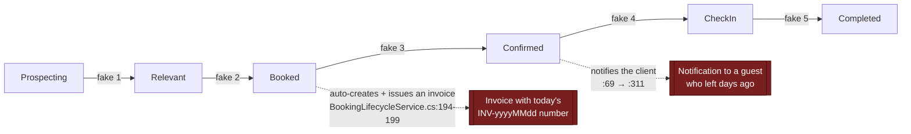
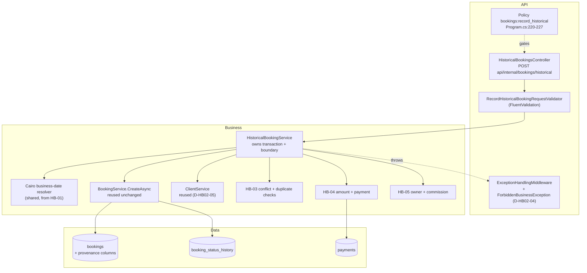
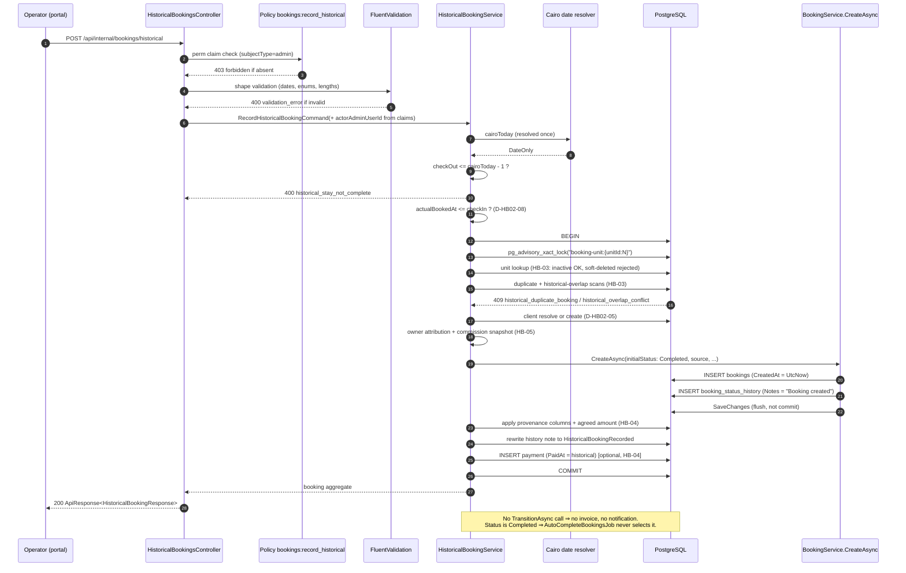

# HB-02 — Historical Booking Domain and API

> [README](README.md) · [Master Plan](00_MASTER_PLAN.md) · Prev: [HB-01](01_TICKET_DISCOVERY_AND_ARCHITECTURE_DECISIONS.md) ·
> Next: [HB-03](03_TICKET_AVAILABILITY_CONFLICTS_AND_DUPLICATE_PROTECTION.md) ·
> Consumers: [HB-04](04_TICKET_FINANCIAL_SNAPSHOT_AND_HISTORICAL_PAYMENTS.md) ·
> [HB-05](05_TICKET_OWNER_ACCOUNTING_AND_SETTLEMENT_ADJUSTMENTS.md) ·
> [HB-07](07_TICKET_NOTIFICATIONS_AUTOMATIONS_AND_INTEGRATIONS.md)

---

## 1. Ticket metadata

| Field | Value |
|---|---|
| Ticket ID | **HB-02** |
| Title | Historical Booking Domain and API |
| Priority | **P0** |
| Type | Backend — domain model, application command, HTTP contract, authorization |
| Status | Ready for review — blocked on [HB-01](01_TICKET_DISCOVERY_AND_ARCHITECTURE_DECISIONS.md) approval |
| Dependencies | HB-01 (ADR-01 … ADR-12 ratified; D-01, D-06 answered) |
| Dependents | HB-04, HB-05, HB-07 (and transitively HB-06, HB-08, HB-09) |
| Risk level | **High** — introduces a new privileged write path into the booking aggregate |
| Estimated complexity | **L** |
| Implemented by | Sole Project Owner. Review lenses: Engineering · Security · Product |
| Target branch | `feat/hb02-historical-booking-domain-api` |
| Migration in this ticket? | **Yes** — the columns owned here (`is_historical`, `actual_booked_at`, `historical_entry_reason`, `original_source`, `external_reference`) plus the permission seed. Financial and owner columns belong to HB-04/HB-05 |

**Scope sentence.** HB-02 delivers the *skeleton of truth*: a dedicated command, a dedicated endpoint, a
dedicated permission, the historical provenance columns, direct-to-`Completed` creation, one truthful audit
row, and one transaction that everything else later hangs off. It deliberately does **not** own conflict
detection (HB-03), money (HB-04), or owner attribution semantics (HB-05) — but it defines the contract slots
those tickets fill.

---

## 2. Business context

Offline bookings are a normal part of KAZA's operation: agreed by phone or in person, a deposit taken in
cash, the stay happens, and only afterwards does anyone enter it into the platform. The worked example from
[Master Plan §3](00_MASTER_PLAN.md#3-problem-statement) — agreed day 1, deposit day 1, stay days 2–5,
recorded day 10 — is the canonical case.

Today an operator has two bad options: leave it unrecorded (losing revenue, occupancy, owner entitlement and
audit truth), or push it through the normal create endpoint, which — as [F-01](01_TICKET_DISCOVERY_AND_ARCHITECTURE_DECISIONS.md#f-01--there-is-no-server-side-past-date-rule)
proved — silently accepts it while attaching no reason, no permission gate, no provenance and no protection
for the agreed price. Both outcomes corrupt the financial record; the second corrupts it *invisibly*.

HB-02 creates the sanctioned third option. `CONFIRMED` that no such path exists today: the only booking
creation entry points are `BookingsController.cs:97-136` (`POST` and `POST /quick`) and the client, guest,
owner-portal and CRM paths enumerated in
[HB-01 §5.1](01_TICKET_DISCOVERY_AND_ARCHITECTURE_DECISIONS.md#51-booking-creation-paths-complete-enumeration).

---

## 3. Problem being solved

| # | Problem | Consequence today |
|---|---|---|
| P-1 | No command expresses "this stay already happened" | Historical records are indistinguishable from live ones (`is_historical` does not exist — `Booking.cs` has no such field, `CONFIRMED`) |
| P-2 | No permission distinguishes recording history from normal booking | Any `bookings:write` holder can backdate silently (`BookingsController.cs:98`, `CONFIRMED`) — `RISK-10` |
| P-3 | No place to record *why* an entry is late or *where* the booking originally came from | `ck_bookings_source` allows only five channel values (`db/migrations/0016_create_bookings.sql:24`, `CONFIRMED`); free-text notes are unqueryable and rejected by ADR-06 |
| P-4 | No place to record *when* it was agreed, separately from when it was entered | `created_at` is the only date-of-record; falsifying it violates REQ-02/INV-01 |
| P-5 | Reaching `Completed` honestly requires five fabricated transitions | Each fabricated transition writes a false audit row, and Booked→Confirmed additionally auto-creates and issues an invoice (`BookingLifecycleService.cs:194-199`, `CONFIRMED`) and notifies the client (`:69` → `:311`, `CONFIRMED`) |
| P-6 | `CreateAsync` opens no transaction | Booking + history + payment cannot commit atomically today (`BeginTransactionAsync` appears at `BookingService.cs:290`, inside `CreateQuickAsync` only — `CONFIRMED`); violates REQ-19/INV-05 |
| P-7 | The API envelope carries no machine-readable error code | The error contract in [Master §12](00_MASTER_PLAN.md#12-api-and-command-design) has nowhere to live (`ApiResponse` exposes only `Success`, `Data`, `Message`, `Errors`, `Pagination` — `RentalPlatform.API/Models/ApiResponse.cs`, `CONFIRMED`) |

---

## 4. User value

| Audience | Value |
|---|---|
| Operations | A sanctioned, guided, single-submission way to enter a completed offline booking, with an error that explains exactly why an entry was refused |
| Finance | Every historical record carries a reason, an original channel, an agreement date and a named actor — reconciliation stops being forensic guesswork |
| Owners | Past stays on their units become visible and attributable instead of silently absent |
| Security | Backdating becomes a distinct, grantable, revocable, auditable capability rather than a side effect of `bookings:write` |
| Engineering | One command, one transaction, one audit row — a shape that HB-04, HB-05 and HB-07 can extend without re-litigating the boundary |

---

## 5. Current repository behavior

All claims re-verified by direct read at commit `8dafb5a`. Findings already established in
[HB-01 §5](01_TICKET_DISCOVERY_AND_ARCHITECTURE_DECISIONS.md#5-current-repository-behavior) are referenced,
not repeated. This section records the **additional** evidence HB-02 needed and states which
[HB-01 §5.2 gaps](01_TICKET_DISCOVERY_AND_ARCHITECTURE_DECISIONS.md#52-known-gaps-in-this-audit) it closes.

### 5.1 Findings inherited from HB-01

| Finding | Relevance to HB-02 |
|---|---|
| [F-01](01_TICKET_DISCOVERY_AND_ARCHITECTURE_DECISIONS.md#f-01--there-is-no-server-side-past-date-rule) | The historical permission is advisory until REQ-16 hardening ships. HB-02 may merge and deploy first — that ordering is deliberate (`D-ROLL-01`) — but the programme must not be declared released until HB-08 activates hardening |
| [F-04](01_TICKET_DISCOVERY_AND_ARCHITECTURE_DECISIONS.md#f-04--minimal-side-effect-surface) | Creation triggers no notification and there is no outbox/MediatR — suppression is structural, not flagged |
| [F-05](01_TICKET_DISCOVERY_AND_ARCHITECTURE_DECISIONS.md#f-05--autocompletebookingsjob-defines-the-completed-stay-boundary) | Supplies the Cairo completed-stay boundary and guarantees the sweep never touches a `Completed` row |
| [F-06](01_TICKET_DISCOVERY_AND_ARCHITECTURE_DECISIONS.md#f-06--direct-to-completed-creation-is-already-possible) | `initialStatus` already exists — the mechanism for ADR-04 |
| [F-08](01_TICKET_DISCOVERY_AND_ARCHITECTURE_DECISIONS.md#f-08--ck_bookings_source-restricts-source-values) | Forces `original_source` to be a separate column |
| [F-14](01_TICKET_DISCOVERY_AND_ARCHITECTURE_DECISIONS.md#f-14--permission-model) | Dictates permission naming, seeding and policy shape |

### 5.2 Additional evidence verified for HB-02

| # | Claim | Label | Evidence |
|---|---|---|---|
| E-1 | The internal booking route prefix is `api/internal/bookings`, **not** `/api/bookings` | `CONFIRMED` | `RentalPlatform.API/Controllers/BookingsController.cs:21` — `[Route("api/internal/bookings")]`; corroborated by the existing `POST /api/internal/invoices/drafts` cited in F-10 |
| E-2 | Routes are lowercased globally | `CONFIRMED` | `RentalPlatform.API/Program.cs:255-258` — `options.LowercaseUrls = true` |
| E-3 | Successful `POST`s return **200 OK** with the `ApiResponse<T>` envelope, not 201 | `CONFIRMED` | `BookingsController.cs:114,135` — `return Ok(ApiResponse<BookingDetailsResponse>.CreateSuccess(...))` |
| E-4 | The response envelope has **no** error-code field | `CONFIRMED` | `RentalPlatform.API/Models/ApiResponse.cs` — properties are `Success`, `Data`, `Message`, `Errors`, `Pagination` only |
| E-5 | Exception→status mapping is a single switch with four typed branches; **there is no 403 branch** | `CONFIRMED` | `RentalPlatform.API/Middleware/ExceptionHandlingMiddleware.cs:45-72` — `BusinessValidationException`→400, `ConflictException`→409, `NotFoundException`→404, `UnauthorizedBusinessException`→401, default→500 |
| E-6 | Authorization policies are generated by iterating `PermissionKeys.All`; each requires `subjectType=admin` **and** a `perm` claim equal to the key | `CONFIRMED` | `Program.cs:220-227`. Closes the HB-01 §5.2 gap *"RBAC policy handler wiring in `Program.cs`"* |
| E-7 | `PermissionKeys.All` is derived from `Descriptors`, so a new permission must be added to **both** the constant list and the descriptor list or it will never get a policy | `CONFIRMED` | `RentalPlatform.API/Authorization/PermissionKeys.cs:35-62` |
| E-8 | `perm` claims are minted into the JWT from `subject.AdminPermissions` at token issue time | `CONFIRMED` | `RentalPlatform.API/Services/JwtTokenService.cs:141-142` |
| E-9 | Granting a permission by migration is an established pattern, and the precedent also bumps `admin_users.updated_at` to force session re-issue | `CONFIRMED` | `db/migrations/0055_date_block_approvals.sql:32-38`; the session-revocation check it feeds is `Program.cs:203-214` |
| E-10 | `CreateQuickAsync` creates with `BookingStatus.Prospecting`, **not** `Booked` | `CONFIRMED` | `BookingService.cs:364`. Closes the HB-01 §5.2 gap *"`CreateQuickAsync` initial status"* and corrects HB-01 §5.1 |
| E-11 | The advisory lock is acquired **inside** the transaction opened by `CreateQuickAsync`; `CreateAsync` acquires no lock and opens no transaction | `CONFIRMED` | `BookingService.cs:290` (transaction), `:331-333` (`AcquireTransactionAdvisoryLockAsync($"booking-unit:{unitId:N}")`), versus `CreateAsync` at `:130-257` which contains neither |
| E-12 | `CreateAsync` ends with its own `SaveChangesAsync` | `CONFIRMED` | `BookingService.cs:254` — safe to compose inside an ambient transaction, but it *is* a flush, so post-conditions must be applied before commit, not after |
| E-13 | The update path is `UpdatePendingAsync` and it refuses any booking not in `Prospecting`/`Relevant` | `CONFIRMED` | `BookingService.cs:370-387`. A booking created directly in `Completed` therefore cannot be repriced through this path at all |
| E-14 | There is **no** shared client match-or-create helper anywhere in the solution | `CONFIRMED` | Greps for `MatchOrCreate`/`ResolveClient`/`EnsureClient`/`FindOrCreate` across the solution return nothing |
| E-15 | The nearest behaviour is guest checkout, which **rejects** rather than matches when the phone already exists | `CONFIRMED` | `GuestBookingService.cs:42-52` — `ConflictException("An account already exists for this phone…")`; phone normalisation is a private helper at `:100-109` |
| E-16 | `ClientService.CreateAsync` requires a plaintext password, rejects a duplicate normalised phone with 409, and calls `SaveChangesAsync` internally | `CONFIRMED` | `ClientService.cs:60,68,72-76,97` |
| E-17 | `booking_status_history.new_status` accepts `'completed'` and `notes` is unbounded `TEXT` | `CONFIRMED` | `db/migrations/0017_create_booking_status_history.sql:7,14` |
| E-18 | The status-history actor resolver special-cases `BookingHistoryEvents.BookingCreated` by exact string match to label a row as a *creation* entry | `CONFIRMED` | `BookingsController.cs:265-288`. A new note constant will not be recognised as a creation entry unless a branch is added |
| E-19 | `Booking` uses PostgreSQL `xmin` as an optimistic-concurrency row version | `CONFIRMED` | `RentalPlatform.Data/Configurations/BookingConfiguration.cs:82-83` |
| E-20 | `Unit`, `Client` and `Owner` all carry a global soft-delete query filter | `CONFIRMED` | `UnitConfiguration.cs:81`, `ClientConfiguration.cs:13`, `OwnerConfiguration.cs:13`. Distinguishing "not found" from "soft-deleted" requires `IgnoreQueryFilters()` |
| E-21 | Services are registered scoped in `Program.cs` alongside the existing booking services | `CONFIRMED` | `Program.cs:283-285` |
| E-22 | The `bookings` table has no historical, provenance, currency, fee, tax or commission column of any kind | `CONFIRMED` | `db/migrations/0016_create_bookings.sql:1-16`; `RentalPlatform.Data/Entities/Booking.cs` |

### 5.3 Gaps this ticket inherits

| Gap | Label | Disposition in HB-02 |
|---|---|---|
| Client match-or-create algorithm and phone normalisation | Was `BLOCKED` in HB-01 §5.2 | **Partially closed** by E-14/E-15/E-16: the algorithm does not exist. The residual product decision is escalated as `D-HB02-05` |
| Portfolio/tenant scoping rules for units and owners | `BLOCKED` | Owned by [HB-05](05_TICKET_OWNER_ACCOUNTING_AND_SETTLEMENT_ADJUSTMENTS.md); HB-02 leaves the scoping call site as an explicit seam |
| `OwnerPortalBookingService` creation semantics | `BLOCKED` | HB-01. Irrelevant to HB-02 — the historical command is admin-only |

---

## 6. Target behavior

1. A new application command, `RecordHistoricalBookingCommand`, handled by a new
   `HistoricalBookingService`, is the only way to create a booking whose stay has already completed.
2. A new endpoint, `POST /api/internal/bookings/historical`, gated by the new policy
   `bookings:record_historical`, is its only HTTP surface.
3. The command rejects anything that is not a fully completed stay under the Cairo boundary (ADR-03),
   returning `400 historical_stay_not_complete`.
4. It creates the booking **directly** in `Completed` via the existing `initialStatus` parameter (ADR-04,
   F-06) — never by walking the transition chain.
5. It writes exactly **one** status-history row: `OldStatus = null`, `NewStatus = "completed"`,
   `ChangedByAdminUserId = <authenticated actor>`, `ChangedAt = UtcNow`,
   `Notes = BookingHistoryEvents.HistoricalBookingRecorded`.
6. It persists provenance: `is_historical = true`, `actual_booked_at`, `historical_entry_reason`,
   `original_source`, optional `external_reference`.
7. It wraps booking + history in **one** transaction under the existing `booking-unit:{unitId:N}` advisory
   lock (REQ-19, INV-05). Payment does **not** join that transaction:
   [D-PAY-01](DECISION_RATIFICATION_PACKET.md#d-pay-01--historical-payment-policy) is `OWNER APPROVED` for a
   **separate privileged command**, so this transaction covers booking + history only.
8. It emits no notification, creates **no invoice**, and is never selected by `AutoCompleteBookingsJob`. The
   no-invoice behaviour is [D-INV-01](DECISION_RATIFICATION_PACKET.md#d-inv-01--invoice-policy),
   `OWNER APPROVED`, and it is also what the code does naturally — the sole auto-create site is the
   `Booked → Confirmed` transition, which this flow never executes.
9. `CreatedAt`, `UpdatedAt` and `ChangedAt` remain real system time (REQ-02, INV-01).

---

## 7. In scope

- `RecordHistoricalBookingCommand` + `HistoricalBookingService` + `IHistoricalBookingService`.
- `HistoricalBookingsController` (or a new action on `BookingsController` — see `D-HB02-02`) exposing
  `POST /api/internal/bookings/historical`.
- `PermissionKeys.BookingsRecordHistorical = "bookings:record_historical"` and
  `PermissionKeys.BookingsOverrideOwner = "bookings:override_owner"`, with descriptors, policies and seed.
- The Cairo completed-stay boundary evaluation, consuming HB-01's shared resolver.
- Provenance columns and their CHECK constraints; the reason and original-source allow-lists.
- `BookingHistoryEvents.HistoricalBookingRecorded` and the actor-resolution branch (E-18).
- The transaction and advisory-lock boundary that HB-03/HB-04/HB-05 plug into.
- Client resolution for the historical flow (per `D-HB02-05`).
- Request/response DTOs, FluentValidation validator, error-code plumbing (per `D-HB02-03`).
- Structured audit event `booking.historical.recorded` and the creation/rejection metrics.
- Backward-compatibility guarantees for all existing booking responses.

## 8. Out of scope

| Excluded | Owner |
|---|---|
| Historical conflict detection including `Completed`/`LeftEarly`, duplicate detection, inactive-unit lookup | [HB-03](03_TICKET_AVAILABILITY_CONFLICTS_AND_DUPLICATE_PROTECTION.md) |
| `agreed_amount`, the repricing guard, payment semantics, invoice consequences | [HB-04](04_TICKET_FINANCIAL_SNAPSHOT_AND_HISTORICAL_PAYMENTS.md) |
| Owner review, override policy, commission snapshot columns, correction workflow | [HB-05](05_TICKET_OWNER_ACCOUNTING_AND_SETTLEMENT_ADJUSTMENTS.md) |
| The portal wizard | [HB-06](06_TICKET_HISTORICAL_BOOKING_WIZARD_UI.md) |
| The exhaustive side-effect assertion matrix | [HB-07](07_TICKET_NOTIFICATIONS_AUTOMATIONS_AND_INTEGRATIONS.md) |
| Reporting stay-period dimension | [HB-08](08_TICKET_REPORTING_AUDIT_OBSERVABILITY_AND_ROLLOUT.md) |
| Normal-flow past-date hardening | [HB-01](01_TICKET_DISCOVERY_AND_ARCHITECTURE_DECISIONS.md) |
| Ongoing stays, bulk import, holds of any kind, backdating `CreatedAt` | Non-goals, [Master §5](00_MASTER_PLAN.md#5-non-goals) |

---

## 9. Assumptions

| # | Assumption | Label | If false |
|---|---|---|---|
| A-HB02-1 | HB-01's shared Cairo business-date resolver exists and is injectable | `INFERRED` | HB-02 must create it, and HB-01 must consume it — do not write a second copy (`RISK-08`) |
| A-HB02-2 | `Completed` remains terminal, so nothing can later transition a historical booking | `CONFIRMED` — `BookingStatusTransitions.cs:18` | Re-open the audit-truthfulness design |
| A-HB02-3 | Composing `CreateAsync` inside an outer transaction is safe | `CONFIRMED` by precedent — `GuestBookingService.cs:39-76` does exactly this via `CreateQuickAsync` | Inline the insert instead of composing |
| A-HB02-4 | Single currency; fees and taxes fold into the agreed total | `PROPOSED` — [OQ-05](00_MASTER_PLAN.md#32-open-questions), [OQ-06](00_MASTER_PLAN.md#32-open-questions) | The request contract gains a currency field and HB-04 grows |
| A-HB02-5 | The historical flow is admin-only; no client, owner-portal or storefront surface | `PROPOSED` | New authorization analysis required |
| A-HB02-6 | Adding a nullable field to `ApiResponse` is backward-compatible for both portals | `INFERRED` — additive JSON property | Use the `errors[0]` carrier fallback in `D-HB02-03` |

---

## 10. Decision-required items

Structured per the pack convention: none of these may be left implicit.

Decision authority for every row is the **Sole Project Owner** (2026-07-29). The **Review lens** column
names the perspectives applied — it is not a list of separate approvers.

| ID | Decision | Reason it is open | Impact if unresolved | Recommended default | Review lens | Blocking? |
|---|---|---|---|---|---|---|
| D-HB02-01 | Confirm the concrete route as `POST /api/internal/bookings/historical` | [Master §12](00_MASTER_PLAN.md#12-api-and-command-design) writes `/api/internal/bookings/historical`, but the verified controller prefix is `api/internal/bookings` (E-1) | Portal client calls a 404 route | **Adopt `POST /api/internal/bookings/historical`**; treat the Master Plan string as shorthand and correct it there | Engineering | **Yes** |
| D-HB02-02 | New `HistoricalBookingsController`, or a new action on `BookingsController`? | Both satisfy the routing; they differ in reviewability | Cosmetic drift, muddled ownership | **New `HistoricalBookingsController` with `[Route("api/internal/bookings")]` and `[HttpPost("historical")]`** — keeps the privileged path visually separate and gives HB-07 one file to assert against | Engineering | No |
| D-HB02-03 | How does a machine-readable error code reach the client, given E-4? | The envelope has no code field | The whole [Master §12](00_MASTER_PLAN.md#12-api-and-command-design) error contract is undeliverable; the wizard cannot branch on failure type | **Add a nullable `Code` property to `ApiResponse`/`ApiResponse<T>` and a `Code` property on the business exception base**, populated by `ExceptionHandlingMiddleware`. Purely additive; existing consumers ignore it. Fallback if rejected: emit the code as `errors[0]` | Engineering | **Yes** |
| D-HB02-04 | How is `403 owner_override_forbidden` produced, given there is no 403 branch (E-5)? | Policy-based 403s carry no body; the override check is a service-layer decision | Override refusals surface as 500 or as a misleading 400 | **Introduce `ForbiddenBusinessException` and map it to 403 in the middleware**; the service throws it when override is requested without `bookings:override_owner` | Engineering · Security | **Yes** |
| D-HB02-05 | Client resolution: match-and-reuse an existing client by normalised phone, create a new one, or require an explicit `clientId`? | E-14/E-15/E-16 prove no match-or-create exists and that the closest behaviour *rejects* on duplicate phone | Either duplicate client records (`RISK-12`) or an operator dead-end when the guest already exists | **Two-field contract: the caller supplies either `clientId` (already resolved by the wizard's client search) or a `newClient` block. If `newClient`'s normalised phone already exists, return `409 client_already_exists` carrying the existing `clientId` so the wizard can re-submit with it.** No silent match, no silent duplicate | Product · Engineering | **Yes** |
| D-HB02-06 | Ratify the `original_source` allow-list (§15.3) | Master §25 lists the allow-lists as *Proposed* | CHECK constraint churn after data exists | Adopt §15.3 as written | Product · Finance | **Yes** |
| D-HB02-07 | Is `actual_booked_at` a `DATE` or a `TIMESTAMP`? | [Master §11](00_MASTER_PLAN.md#11-proposed-data-model) specifies `DATE` | Timezone ambiguity if it becomes a timestamp later | **Keep `DATE`** — it is a business fact about a day, and `DATE` inherits the timezone-free property of the stay dates | Engineering | No |
| D-HB02-08 | Must `actual_booked_at` be `<= check_in_date`? | Agreeing a booking after the stay began is operationally possible but usually a typo | Silent data-quality erosion | **Enforce `actual_booked_at <= check_in_date` as a 400**, with the message naming the two dates. Revisit only if Ops produces a real counter-example | Product | No |
| D-HB02-09 | Which role templates receive `bookings:record_historical`? | Inherited from HB-01 `D-05` | Either nobody can use the feature or everybody can | **SuperAdmin at migration time only**; further grants performed through the RBAC admin UI during pilot | Security · Operations | No |
| D-HB02-10 | Does `bookings:record_historical` imply `bookings:write`? | The policies are independent claims (E-6) | A role may be able to record history but not read it back | **No implication. Grant `bookings:read` alongside it**; document the pairing in the rollout checklist | Security | No |

---

## 11. Architecture and technical design

### 11.1 Why a dedicated command, not a flag (ADR-01)

The tempting design is `POST /api/internal/bookings` with `allowPastDates: true`. It must be rejected, for
five separate reasons — worth spelling out because the shortcut will be proposed again during review:

| # | Argument | Evidence |
|---|---|---|
| 1 | **A request field is not an authorization decision.** Authorization in this codebase is a policy over a `perm` claim evaluated before the action runs (`Program.cs:220-227`, E-6). A body field is evaluated *after* the caller has already been authorised as `bookings:write`. Making the field meaningful would require re-checking permissions inside the service — the exact anti-pattern where privilege checks drift from routes | E-6 |
| 2 | **It is forgeable in the only place that matters.** The flag would travel from a client that also renders the "normal" form. Any caller holding `bookings:write` could set it. The permission boundary would exist only in the UI | `BookingsController.cs:98` |
| 3 | **It creates one endpoint with two contradictory validation modes.** After HB-01, the normal endpoint must *reject* past dates; the historical path must *require* them. A single handler would branch on a boolean into two mutually exclusive rule sets, and every future validator would need to ask "which mode am I in?" | HB-01 §11.2 |
| 4 | **It is unauditable at the HTTP layer.** Access logs, rate limits, metrics and security review all operate on route + policy. A flag buried in a JSON body is invisible to all of them. A distinct route makes "who recorded history" answerable from access logs alone | §20 |
| 5 | **It cannot carry the mandatory payload.** Reason, original source, agreement date and owner confirmation are *required* for historical entries and *meaningless* for normal ones. A shared DTO would make them all optional, which is exactly how a required field stops being required | REQ-04, REQ-07 |

HB-01 §11.2.5 already forbids a `bypassPastDateValidation` parameter on `CreateAsync`. HB-02 honours that:
the historical service **composes** `CreateAsync` and performs its own pre-validation. The one parameter it
does use — `initialStatus` — is pre-existing, legitimate, and not a bypass: it selects a starting state, it
does not disable a rule.

### 11.2 Direct-to-`Completed` creation (ADR-04)

`CONFIRMED` (F-06): `BookingService.cs:140` declares `BookingStatus? initialStatus = null` and `:217`
resolves `var startingStatus = initialStatus ?? BookingStatus.Prospecting`. Passing
`BookingStatus.Completed` is therefore a supported, already-exercised code path requiring no change to
`BookingService`.

The alternative — creating in `Prospecting` and transitioning up — is disqualified:



| Cost of the transition-walk | Requirement violated |
|---|---|
| Five status-history rows describing events that never happened | REQ-12, INV-01 |
| An invoice auto-created and issued on Booked→Confirmed (`BookingLifecycleService.cs:194-199`) | REQ-13, and F-10's numbering encodes the wrong date |
| A client status-change notification on transition (`BookingLifecycleService.cs:69` → `:311`) | REQ-13, INV-07, `RISK-06` |
| Five `UpdatedAt` writes and five transaction round-trips | REQ-19 |

Direct creation costs none of these. The historical command never calls `TransitionAsync`, so the
notification and invoice code paths are unreachable **by construction** rather than by suppression — which
is stronger, because no caller can re-enable them.

### 11.3 The single truthful history row

`PROPOSED` — extend the existing constants file, mirroring its established two-constant pattern
(`RentalPlatform.Shared/Constants/BookingHistoryEvents.cs:5,7-8`, `CONFIRMED`):

```csharp
// RentalPlatform.Shared/Constants/BookingHistoryEvents.cs  (PROPOSED addition)
public const string HistoricalBookingRecorded =
    "Historical booking recorded after the stay had already completed.";
```

The row written by the command:

| Column | Value | Rationale |
|---|---|---|
| `old_status` | `null` | Nothing preceded it. A non-null value would assert a transition that never occurred |
| `new_status` | `"completed"` | Accepted by `ck_booking_status_history_new_status` (E-17) |
| `changed_by_admin_user_id` | The authenticated admin GUID from `ClaimTypes.NameIdentifier` | INV-11; never client-supplied. Existing precedent: `BookingsController.cs:244-251` |
| `notes` | `BookingHistoryEvents.HistoricalBookingRecorded` | Distinguishable by exact match, exactly as `AutomaticCompletion` is |
| `changed_at` | `DateTime.UtcNow` | INV-01 — real system time, never the agreement date |

Because `CreateAsync` already writes a row with `Notes = BookingHistoryEvents.BookingCreated`
(`BookingService.cs:242-253`, `CONFIRMED`), the command must produce the *historical* note instead of, not
in addition to, that row. Two options:

| Option | Assessment |
|---|---|
| **(a) Overwrite before commit** — call `CreateAsync`, then update the single history row it created (it is in the same `DbContext` and the same transaction) to carry the historical note | `PROPOSED — recommended`. No signature change to `BookingService`; the row is located deterministically by `BookingId`; nothing is ever committed with the wrong note because the enclosing transaction has not committed. Requires E-12 awareness: `CreateAsync` flushes, so re-read from the tracked context, not the database |
| (b) Add an optional `historyNote` parameter to `CreateAsync` | Cleaner to read, but widens a shared, heavily-used signature for one caller and drags every other call site into the diff |

Whichever is chosen, the **post-condition is identical and testable**: exactly one row for the booking, with
the values in the table above. Assert the post-condition, not the mechanism.

`PROPOSED` — also add a branch to `ResolveHistoryActor` (`BookingsController.cs:265-288`, E-18) so a
historical row is recognised as a creation entry; otherwise a row whose admin user was later deactivated
would render as *"Actor unavailable"* instead of *"Creator unavailable"*, which is a small but real audit
regression.

### 11.4 The completed-stay boundary (ADR-03)

`CONFIRMED` (F-05) — `AutoCompleteBookingsJob.cs:68-70`:

```csharp
var cairoNow = TimeZoneInfo.ConvertTimeFromUtc(now, CairoTimeZone);
var completedAfterCheckoutCutoff = DateOnly.FromDateTime(cairoNow).AddDays(-1);
```

`PROPOSED` placement and rules:

| Rule | Where | Why there |
|---|---|---|
| Resolve the Cairo business date **once** per request | `HistoricalBookingService`, first statement of the handler | A single evaluation makes the midnight-boundary case deterministic (`RISK-08`, `SC-DATE-07`) |
| `checkOutDate <= cairoToday.AddDays(-1)` else `400 historical_stay_not_complete` | `HistoricalBookingService`, before any I/O | Free of side effects; fails fast; keeps the rule out of per-DTO validators where it would drift |
| `checkOutDate > checkInDate` | FluentValidation **and** `BookingService.ValidateStayDates` (`:463-467`) | Already enforced twice, plus `ck_bookings_valid_stay_range` |
| Never use `DateTime.Now` / `DateTime.Today` | Everywhere | Container local time is not Cairo (NAC-HB01-08) |

The boundary must come from HB-01's shared resolver (A-HB02-1). Two copies of this expression is the single
most likely way this feature develops a silent off-by-one.

### 11.5 Transaction ownership (REQ-19 / INV-05)

`CONFIRMED` (E-11, P-6): `CreateAsync` neither opens a transaction nor takes the advisory lock. Both live in
`CreateQuickAsync` (`BookingService.cs:290`, `:331-333`). Therefore **the historical service must own the
transaction**. Proposed ordering, following the `GuestBookingService.cs:39-76` precedent:

```
BEGIN TRANSACTION                                     (IUnitOfWork.BeginTransactionAsync)
  AcquireTransactionAdvisoryLockAsync("booking-unit:{unitId:N}")   -- same key as the normal flow
  resolve unit            (HB-03 owns inactive/soft-deleted rules)
  duplicate scan          (HB-03)
  historical conflict scan incl. Completed + LeftEarly (HB-03)
  resolve client          (D-HB02-05)
  resolve owner + snapshot (HB-05)
  BookingService.CreateAsync(initialStatus: Completed, ...)        -- flushes (E-12)
  apply historical columns + protected amount (HB-04)
  rewrite the history row's note                                   (§11.3 option a)
  insert payment if supplied (HB-04)
  SaveChangesAsync
COMMIT
```

The advisory-lock key **must** be the identical string used by the normal flow
(`$"booking-unit:{unitId:N}"`, `BookingService.cs:332`) and by `BookingLifecycleService`. A different key
would leave concurrent normal and historical creation mutually invisible — the precise race HB-03 exists to
close.

### 11.6 Component placement



---

## 12. Expected data flow



---

## 13. Expected files/components likely to change

`PROPOSED` — indicative, not prescriptive. The implementer confirms against the tree at branch time.

| Path | Likely change | New? |
|---|---|---|
| `RentalPlatform.API/Controllers/HistoricalBookingsController.cs` | The endpoint, actor extraction, response mapping | **New** |
| `RentalPlatform.API/DTOs/Requests/Bookings/RecordHistoricalBookingRequest.cs` | Request record | **New** |
| `RentalPlatform.API/DTOs/Responses/Bookings/HistoricalBookingResponse.cs` | Response record | **New** |
| `RentalPlatform.API/Validators/HistoricalBookingValidators.cs` | Shape validation, enum allow-lists | **New** |
| `RentalPlatform.API/Authorization/PermissionKeys.cs` | Two constants **and** two descriptors (E-7) | Edit |
| `RentalPlatform.API/Models/ApiResponse.cs` | Nullable `Code` (D-HB02-03) | Edit |
| `RentalPlatform.API/Middleware/ExceptionHandlingMiddleware.cs` | Code propagation; `ForbiddenBusinessException` → 403 (D-HB02-04) | Edit |
| `RentalPlatform.API/Controllers/BookingsController.cs` | `ResolveHistoryActor` branch (E-18); optionally surface `isHistorical` in existing responses | Edit |
| `RentalPlatform.API/Program.cs` | DI registration next to `:283-285` | Edit |
| `RentalPlatform.Business/Services/HistoricalBookingService.cs` | The command handler and transaction owner | **New** |
| `RentalPlatform.Business/Interfaces/IHistoricalBookingService.cs` | Interface | **New** |
| `RentalPlatform.Business/Models/RecordHistoricalBookingCommand.cs` | Command + result records | **New** |
| `RentalPlatform.Business/Exceptions/ForbiddenBusinessException.cs` | Typed 403 | **New** |
| `RentalPlatform.Business/Exceptions/` (existing types) | Add a `Code` property to the base | Edit |
| `RentalPlatform.Shared/Constants/BookingHistoryEvents.cs` | `HistoricalBookingRecorded` | Edit |
| `RentalPlatform.Shared/Constants/` (new) | `HistoricalEntryReasons`, `HistoricalOriginalSources` allow-lists | **New** |
| `RentalPlatform.Data/Entities/Booking.cs` | Five provenance properties | Edit |
| `RentalPlatform.Data/Configurations/BookingConfiguration.cs` | Column mappings + max lengths | Edit |
| `db/migrations/00NN_add_historical_booking_columns.sql` (+ `_verify`, `_rollback`) | Provenance columns, CHECKs, partial indexes, permission seed | **New** |
| `RentalPlatform.Tests/` | Unit + service tests per §29 | Edit |

**Explicitly unchanged:** `BookingService.CreateAsync` body, `UnitAvailabilityService`,
`BookingLifecycleService`, `AutoCompleteBookingsJob`, `NotificationDispatchService`, `InvoiceService`,
`OwnerPayoutService`, and every existing validator. If a diff touches any of these, treat it as a stop
condition (§36).

---

## 14. API changes

### 14.1 Endpoint

| Property | Value |
|---|---|
| Method / route | `POST /api/internal/bookings/historical` (D-HB02-01; lowercase per E-2) |
| Policy | `bookings:record_historical` |
| Auth subject | `subjectType=admin` only (E-6) |
| Success | `200 OK`, `ApiResponse<HistoricalBookingResponse>` (E-3) |
| Idempotency | Optional `Idempotency-Key` request header — see §19 |
| Content type | `application/json`, camelCase (per middleware serializer options) |

### 14.2 Request contract — `RecordHistoricalBookingRequest`

| Field | Type | Req. | Constraint | Owner |
|---|---|---|---|---|
| `unitId` | `Guid` | Yes | Non-empty; must resolve (inactive permitted, soft-deleted rejected) | HB-02 / HB-03 |
| `clientId` | `Guid?` | Cond. | Exactly one of `clientId` / `newClient` | HB-02 |
| `newClient` | `object?` | Cond. | `{ name, phone, email? }`; phone 10–15 digits, optional leading `+` (mirrors `BookingValidators.cs` guest rule) | HB-02 |
| `checkInDate` | `DateOnly` | Yes | `< checkOutDate` | HB-02 |
| `checkOutDate` | `DateOnly` | Yes | `<= cairoToday − 1` | HB-02 |
| `guestCount` | `int` | Yes | `> 0`, `<= unit.MaxGuests` (`BookingService.cs:184-186` → 400) | HB-02 |
| `actualBookedAt` | `DateOnly` | Yes | Not in the future; `<= checkInDate` (D-HB02-08) | HB-02 |
| `historicalEntryReason` | `string` | Yes | Allow-list §15.2 | HB-02 |
| `historicalEntryNote` | `string?` | Cond. | Required and ≥ 10 chars when reason is `other`; max 1000 | HB-02 |
| `originalSource` | `string` | Yes | Allow-list §15.3 | HB-02 |
| `externalReference` | `string?` | No | Max 100; trimmed; unique among historical bookings when present | HB-02 / HB-03 |
| `agreedAmount` | `decimal` | Yes | `>= 0`, 2dp | **HB-04** |
| ~~`payment`~~ | — | **Absent** | **Not part of this contract.** [D-PAY-01](DECISION_RATIFICATION_PACKET.md#d-pay-01--historical-payment-policy) is `OWNER APPROVED` for a separate privileged command, so no payment object is accepted here. Sending one is an unknown field and is rejected. The shape it would have had is specified in [HB-04 §11.4](04_TICKET_FINANCIAL_SNAPSHOT_AND_HISTORICAL_PAYMENTS.md#114-historical-payment-recording) | **HB-04** |
| `ownerAttribution` | `object` | Yes | `{ confirmedOwnerId, overrideReason?, overrideNote? }`; explicit confirmation is mandatory (INV-17) | **HB-05** |
| `assignedAdminUserId` | `Guid?` | No | Must be an active admin (`BookingService.cs:167-173`) | HB-02 |
| `internalNotes` | `string?` | No | Free text; **never** a carrier for structured data (ADR-06) | HB-02 |

**Fields deliberately absent from the request** (mass-assignment control, INV-01/INV-11/INV-12):
`createdAt`, `updatedAt`, `bookingStatus`, `ownerId` as a bare field, `createdByAdminUserId`, `isHistorical`,
`baseAmount`, and any commission or split value. Status is always `Completed`; the actor always comes from
`ClaimTypes.NameIdentifier` (`BookingsController.cs:244-251` precedent); `is_historical` is always `true` on
this route; the owner arrives only inside `ownerAttribution`, where HB-05's rules apply.

### 14.3 Response contract — `HistoricalBookingResponse`

Superset of the existing `BookingDetailsResponse` shape (`BookingsController.cs:184-210`) plus:

| Field | Type | Notes |
|---|---|---|
| `isHistorical` | `bool` | Always `true` on this route |
| `actualBookedAt` | `DateOnly?` | The agreement date |
| `historicalEntryReason` | `string?` | Allow-list value |
| `historicalEntryNote` | `string?` | Echo of the supplied note |
| `originalSource` | `string?` | Allow-list value |
| `externalReference` | `string?` | Echo |
| `recordedAt` | `DateTime` | Equals `createdAt`; named explicitly so the wizard never implies it is the stay date |
| `recordedByAdminUserId` | `Guid` | The audit actor |
| `agreedAmount` | `decimal?` | HB-04 |
| `snapshotCommissionRate` / `snapshotOwnerAmount` / `snapshotKazaAmount` | `decimal?` | HB-05 |
| `ownerOverrideApplied` | `bool` | HB-05 |
| `recordedPayment` | `object?` | `{ paymentId, amount, method, paidAt }` when a payment was created — HB-04 |
| `statusHistoryEventId` | `Guid` | The single truthful audit row, so the PR and the wizard can both point at it |

### 14.4 Error contract

Codes are fixed by [Master §12](00_MASTER_PLAN.md#12-api-and-command-design); the delivery mechanism is
D-HB02-03.

| Condition | Status | Code | Thrown by | Owner |
|---|---|---|---|---|
| DTO shape / allow-list / length failure | 400 | `validation_error` | FluentValidation | HB-02 |
| Missing `bookings:record_historical` | 403 | `forbidden` | Policy (empty body) | HB-02 |
| Unit, client or admin not found | 404 | `not_found` | `NotFoundException` | HB-02 |
| Checkout not yet past the Cairo boundary | 400 | `historical_stay_not_complete` | `BusinessValidationException` | HB-02 |
| Overlap incl. `Completed`/`LeftEarly` | 409 | `historical_overlap_conflict` | `ConflictException` | HB-03 |
| Exact or acknowledged-probable duplicate | 409 | `historical_duplicate_booking` | `ConflictException` | HB-03 |
| Owner not confirmed / unresolvable | 400 | `owner_attribution_required` | `BusinessValidationException` | HB-05 |
| Override requested without `bookings:override_owner` | 403 | `owner_override_forbidden` | `ForbiddenBusinessException` (D-HB02-04) | HB-05 |
| Unit is soft-deleted | 400 | `unit_deleted_unsupported` | `BusinessValidationException` | HB-03 |
| `newClient` phone already belongs to a client | 409 | `client_already_exists` | `ConflictException` | HB-02 (D-HB02-05) |
| Stay dates in the past on the **normal** endpoint | 400 | `stay_dates_in_past` | HB-01 | HB-01 |

`client_already_exists` is the only code HB-02 adds beyond the ratified set; it exists solely because
E-15/E-16 prove the platform's current answer to a known phone is a 409, and the wizard needs the existing
`clientId` back in order to recover.

---

## 15. Data/schema changes

### 15.1 Columns owned by HB-02

`PROPOSED`, consistent with [Master §11](00_MASTER_PLAN.md#11-proposed-data-model) and fixed by the
[migration-ownership matrix](00_MASTER_PLAN.md#111-migration-ownership-matrix). **HB-02 owns objects
#1 … #13** and authors the **first** of three additive migrations. Financial columns belong to HB-04 (#14–#17)
and owner columns to HB-05 (#18–#28); each ticket writes its own migration and they are applied in that
order. There is no "coordinated" migration.

| Column / object | Type | Null | Default | Constraint / index | Matrix # |
|---|---|---|---|---|---|
| `bookings.is_historical` | `BOOLEAN` | NOT NULL | `false` | `CREATE INDEX ix_bookings_is_historical ON bookings(is_historical) WHERE is_historical` | #1, #6 |
| `bookings.actual_booked_at` | `DATE` | NULL | — | `ck_bookings_actual_booked_at_requires_historical`: `actual_booked_at IS NULL OR is_historical` | #2, #8 |
| `bookings.historical_entry_reason` | `VARCHAR(50)` | NULL | — | `ck_bookings_historical_entry_reason` — allow-list §15.2 | #3, #9 |
| `bookings.original_source` | `VARCHAR(50)` | NULL | — | `ck_bookings_original_source` — allow-list §15.3 | #4, #10 |
| `bookings.external_reference` | `VARCHAR(100)` | NULL | — | `CREATE UNIQUE INDEX CONCURRENTLY ux_bookings_external_reference ON bookings(external_reference) WHERE external_reference IS NOT NULL` — consumed by HB-03's duplicate detection | #5, #7 |
| `idempotency_keys` | table | — | — | `key TEXT PK, endpoint TEXT, request_hash TEXT, response_status INT, booking_id UUID NULL, created_at TIMESTAMP`. Owned here because idempotency is a property of this endpoint (§19); HB-03 depends on it | #12 |

Because `ux_bookings_external_reference` is created `CONCURRENTLY`, it must live in a migration file that
does **not** open a transaction. Split it from the transactional DDL rather than dropping `CONCURRENTLY`.

Coherence constraint (`PROPOSED`): `ck_bookings_historical_fields_coherent` —
`(is_historical AND actual_booked_at IS NOT NULL AND historical_entry_reason IS NOT NULL AND original_source IS NOT NULL) OR (NOT is_historical)`.
This makes a half-populated historical row unrepresentable at the storage layer, not merely discouraged.

Migration mechanics follow the confirmed repository convention: sequential `db/migrations/NNNN_name.sql`
with paired `_verify.sql` and `_rollback.sql`, applied by `scripts/apply-migrations.sh`; raw SQL is the
source of truth and there is no EF Core migrations directory. Latest observed number is `0057`
(`db/migrations/0057_add_owner_contact_fields.sql`, `CONFIRMED`) — the implementer takes the next free
number at branch time. New CHECKs are added `NOT VALID` then validated, per
[Master §21](00_MASTER_PLAN.md#21-migration-strategy).

### 15.2 `historical_entry_reason` allow-list

Ratified in the brief; `PROPOSED` as a `VARCHAR(50)` CHECK and a `HistoricalEntryReasons` constants class.

| Value | Meaning | Note required? |
|---|---|---|
| `offline_booking_recorded_after_stay` | Agreed offline; entered after the stay finished — the canonical case | No |
| `external_platform_import` | Originated on a third-party channel and never mirrored into KAZA | No |
| `late_operational_entry` | Should have been entered live; operational miss | No |
| `accounting_reconciliation` | Discovered during a finance reconciliation | No |
| `other` | Anything else | **Yes** — `historicalEntryNote`, ≥ 10 characters |

### 15.3 `original_source` allow-list (D-HB02-06)

`PROPOSED`. Deliberately a *separate* vocabulary from `bookings.source`: F-08 fixes that column to
`direct`/`admin`/`phone`/`whatsapp`/`website`, a **system channel** dimension, and widening it would touch
every existing consumer and every reporting view. `original_source` is a **provenance** dimension.

| Value | Meaning |
|---|---|
| `walk_in` | Guest arrived in person |
| `phone_offline` | Agreed by phone, never entered live |
| `whatsapp_offline` | Agreed over WhatsApp, never entered live |
| `referral` | Referred by another guest, owner or partner |
| `external_platform` | Third-party booking channel |
| `owner_direct` | The unit owner arranged it directly |
| `repeat_guest_direct` | Returning guest contacting KAZA directly |
| `other` | Anything else — reuses `historicalEntryNote` for detail |

`bookings.source` on a historical record is set to `"admin"` (a permitted value, `CONFIRMED` at
`db/migrations/0016_create_bookings.sql:24`), because the record genuinely entered the system through an
admin action. `original_source` carries the business truth. Reporting reads `original_source` when
`is_historical` — see [Master §19](00_MASTER_PLAN.md#19-reporting-impact-matrix) and HB-08.

### 15.4 Permission seed

`PROPOSED`, following the verified precedent at `db/migrations/0055_date_block_approvals.sql:32-38` (E-9):

```sql
-- PSEUDOCODE — final SQL is written during implementation, not here.
INSERT INTO rbac_role_template_permissions (role_template_id, permission_key, created_at)
VALUES ('<SuperAdmin template id>', 'bookings:record_historical', CURRENT_TIMESTAMP),
       ('<SuperAdmin template id>', 'bookings:override_owner',    CURRENT_TIMESTAMP)
ON CONFLICT (role_template_id, permission_key) DO NOTHING;

UPDATE admin_users SET updated_at = CURRENT_TIMESTAMP
WHERE role_template_id = '<SuperAdmin template id>';
```

Both keys fit `permission_key VARCHAR(50)` (`db/migrations/0053_create_dynamic_rbac.sql:22`) at 26 and 23
characters. The `UPDATE admin_users` is not cosmetic: `Program.cs:203-214` fails authentication when the
token's recorded `updated_at` ticks diverge from the row, which is precisely the mechanism that forces
affected admins to obtain a token carrying the new `perm` claim (E-8).

---

## 16. Authorization and security

| Control | Design | Evidence / invariant |
|---|---|---|
| Route gate | `[Authorize(Policy = PermissionKeys.BookingsRecordHistorical)]` on the action | E-6; INV-10 |
| Permission registration | Constant **and** descriptor added to `PermissionKeys` — `All` derives from `Descriptors` (E-7), and a missing descriptor silently yields no policy, which ASP.NET surfaces as a 500 on first request | E-7 |
| Override gate | `bookings:override_owner` checked in the service, throwing `ForbiddenBusinessException` → 403 `owner_override_forbidden` (D-HB02-04). Separate permission so recording history does not imply re-assigning revenue | REQ-07; HB-05 |
| Actor identity | Read from `ClaimTypes.NameIdentifier`; never accepted from the body | INV-11; `BookingsController.cs:244-251` |
| Mass assignment | Dedicated DTO; §14.2 exclusion list; no `AutoMapper`-style projection onto the entity | INV-01, INV-12 |
| IDOR | `unitId`, `clientId`, `confirmedOwnerId` resolved server-side. Portfolio scoping is the seam HB-05 fills; until then the service must not accept an owner id that does not match either `unit.OwnerId` or an override-permitted value | INV-12; `RISK-11` |
| Soft-delete leakage | Global filters (E-20) mean a soft-deleted unit is invisible by default; the `unit_deleted_unsupported` distinction requires a deliberate `IgnoreQueryFilters()` probe — it must **not** widen the general lookup | ADR-12; HB-03 |
| Financial tampering | The client supplies `agreedAmount` only; owner/KAZA split is computed and validated server-side | HB-04/HB-05 |
| Audit immutability | Status history is append-only; nothing in this ticket adds an update or delete path to it | REQ-12 |
| Logging | Structured, correlation-id bearing, **no PII** — no guest name, phone or email in logs or metric labels | [Master §18](00_MASTER_PLAN.md#18-security-and-compliance-review) |
| Residual risk while REQ-16 hardening is unshipped | `bookings:write` still permits silent backdating on the normal endpoint. HB-02 **reduces** but does not close `RISK-10`; only the hardening — specified in HB-01 §11.2, shipped by [HB-08 §26.1](08_TICKET_REPORTING_AUDIT_OBSERVABILITY_AND_ROLLOUT.md#261-req-16-hardening-tasks--the-last-commits-on-this-branch) — closes it. Security accepts this window explicitly under [D-HARD-01](DECISION_RATIFICATION_PACKET.md#d-hard-01--normal-flow-hardening) | §23, §34 |

---

## 17. Validation rules

Ordered as the service evaluates them. Cheap, side-effect-free checks precede any I/O; everything from
V-H-08 onward runs inside the transaction and under the advisory lock.

| ID | Rule | Layer | Failure | Master ref |
|---|---|---|---|---|
| V-H-01 | Required fields present; enums in allow-list; lengths within bounds | FluentValidation | 400 `validation_error` | V-16, V-17 |
| V-H-02 | Exactly one of `clientId` / `newClient` | FluentValidation | 400 `validation_error` | V-20 |
| V-H-03 | `historicalEntryNote` present (≥10 chars) when reason is `other` | FluentValidation | 400 `validation_error` | V-16 |
| V-H-04 | `checkOutDate > checkInDate` | Validator + `BookingService.ValidateStayDates:463-467` + `ck_bookings_valid_stay_range` | 400 | V-02 |
| V-H-05 | `checkOutDate <= cairoToday − 1` | `HistoricalBookingService` | 400 `historical_stay_not_complete` | V-01 |
| V-H-06 | `actualBookedAt` not in the future and `<= checkInDate` | `HistoricalBookingService` (D-HB02-08) | 400 `validation_error` | — |
| V-H-07 | `paidAt` (if supplied) not in the future | Validator | 400 | V-13 |
| V-H-08 | Unit resolves; soft-deleted rejected; inactive permitted | Service (HB-03) | 404 / 400 `unit_deleted_unsupported` | V-03, V-04 |
| V-H-09 | `guestCount > 0` and `<= unit.MaxGuests` | Validator + `BookingService.cs:184-186` | 400 | V-05 |
| V-H-10 | No overlap against the historical conflict set | Service (HB-03) | 409 `historical_overlap_conflict` | V-06 |
| V-H-11 | No date-block conflict | Service (HB-03) | 409 | V-07 |
| V-H-12 | Not an exact duplicate; probable duplicate acknowledged | Service (HB-03) | 409 `historical_duplicate_booking` | V-08, V-09 |
| V-H-13 | `externalReference` unique when present | Service + partial unique index | 409 | V-18 |
| V-H-14 | Client resolves, or `newClient` is creatable | Service (D-HB02-05) | 400 / 409 `client_already_exists` | V-20 |
| V-H-15 | `assignedAdminUserId`, if supplied, is an active admin | `BookingService.cs:167-173` | 404 | — |
| V-H-16 | Owner confirmed, in scope, override permitted and reasoned | Service (HB-05) | 400 / 403 | V-10, V-11, V-12 |
| V-H-17 | Amounts non-negative; payment `> 0` | Validator + `ck_payments_amount_positive` | 400 | V-15 |
| V-H-18 | Caller holds `bookings:record_historical` | Policy, before the action body | 403 | V-21 |

`BLOCKED` — V-19 (currency) cannot be specified while no currency column exists anywhere
([OQ-05](00_MASTER_PLAN.md#32-open-questions)). v1 proceeds single-currency; the request contract carries no
currency field, so adding one later is additive rather than breaking.

---

## 18. Transaction and failure behavior

| Aspect | Behaviour | Rationale |
|---|---|---|
| Boundary owner | `HistoricalBookingService` — **not** `BookingService` | E-11: `CreateAsync` opens none |
| Scope | Booking row, status-history row, provenance columns, optional client insert, optional payment | REQ-19, INV-05 |
| Isolation | PostgreSQL default `READ COMMITTED`, serialised per unit by `pg_advisory_xact_lock` | Matches the normal flow (`BookingService.cs:331-333`) |
| Lock key | `booking-unit:{unitId:N}` — byte-identical to the normal flow | Prevents the cross-flow race |
| Lock acquisition | After `BEGIN`, before any read that a concurrent writer could invalidate | An advisory *xact* lock is only meaningful inside a transaction |
| Failure anywhere | `RollbackAsync`, rethrow; middleware maps to the code in §14.4 | INV-06 |
| Partial states forbidden | Booking without its history row; booking with a provenance column unset; payment without a booking | `ck_bookings_historical_fields_coherent` makes the second unrepresentable |
| Nested-transaction safety | If an ambient transaction already exists, join it rather than opening a second | `CreateQuickAsync` precedent at `BookingService.cs:273-288` |
| `SaveChangesAsync` inside `CreateAsync` (E-12) | Treated as a flush. All post-`CreateAsync` mutations occur on tracked entities and are flushed again before `COMMIT` | Avoids a second round-trip reading uncommitted rows |
| `ClientService.CreateAsync` internal save (E-16) | Same treatment — it participates in the ambient transaction | `GuestBookingService.cs:39-76` precedent |
| Optimistic concurrency | `xmin` row version (E-19) applies to updates; creation is insert-only, so the advisory lock is the real serialisation mechanism | `RISK-09` |
| Post-commit work | **None.** No queue, no dispatch, no callback | F-04; INV-07 |

Rollback proof obligation: an integration test must inject a failure at the payment insert and assert that
zero rows exist in `bookings`, `booking_status_history` and `payments` for that request (`SC-TXN-01`).
`BLOCKED` on [OQ-09](00_MASTER_PLAN.md#32-open-questions) — EF Core InMemory raises
`TransactionIgnoredWarning` and cannot execute `ExecuteSqlInterpolatedAsync`, so this test requires a real
relational provider. HB-09 owns provisioning it; HB-02 must not claim the coverage until it exists.

---

## 19. Idempotency and concurrency

| Concern | Design | Label |
|---|---|---|
| Double-click / retry | Optional `Idempotency-Key` request header. When present, a repeat within the retention window returns the original `200` and the original booking id, creating nothing | `PROPOSED` |
| Storage for the key | `DECISION REQUIRED` folded into HB-03: either a dedicated table or a deterministic derivation from `(unitId, clientId, checkIn, checkOut, agreedAmount, externalReference)`. Recommended default: rely on HB-03's exact-duplicate rule and treat the header as advisory in v1 | `DECISION REQUIRED` |
| Existing 30-second window | `RecentDuplicateWindow` (`BookingService.cs:19`) filters on `BookingStatus == Prospecting` (`:344`) and therefore **never matches** a historical `Completed` booking. It is a double-click guard for the quick-create path, not a business duplicate rule | `CONFIRMED` |
| Two operators, same unit and dates | Serialised by `pg_advisory_xact_lock` on the shared key; the loser sees `409 historical_overlap_conflict` from HB-03's scan, which now runs inside the lock | `PROPOSED` |
| Historical vs normal creation racing | Same key ⇒ same lock ⇒ mutually exclusive. This is the reason the key must not be "improved" | `PROPOSED` |
| Cairo midnight during the request | `cairoToday` resolved once, before `BEGIN`; a request cannot see two different business dates | `PROPOSED`, `RISK-08` |
| Client creation race | Two concurrent `newClient` submissions with the same phone: the second fails on `ClientService`'s duplicate check (`ClientService.cs:73-76`) inside its own transaction and rolls the whole command back | `CONFIRMED` |
| `externalReference` race | Serialised by the partial unique index; a concurrent insert raises a unique violation that must be translated to `409`, not surfaced as a 500 | `PROPOSED` |

---

## 20. Audit and observability

| Signal | Shape | Notes |
|---|---|---|
| Status-history row | The single row in §11.3 | The legally meaningful audit artefact |
| Structured event | `booking.historical.recorded` — `bookingId`, `unitId`, `actorAdminUserId`, `recordedAt`, `checkInDate`, `checkOutDate`, `actualBookedAt`, `historicalEntryReason`, `originalSource`, `ownerId`, `overrideApplied`, `correlationId` | **No PII.** No guest name, phone or email |
| Metric | `historical_booking_created_total` | Counter |
| Metric | `historical_booking_rejected_total{reason="not_complete"\|"overlap"\|"duplicate"\|"forbidden"\|"owner_attribution"\|"validation"}` | Label set closed; cardinality bounded by the code list in §14.4 |
| Metric | `historical_booking_command_duration_seconds` | Histogram — the command holds a per-unit lock, so latency regressions matter |
| Log (rejection) | Level `Information`, with `reason`, `unitId`, `actorAdminUserId`, requested dates | Dates are not PII; names and phones are |
| Log (success) | Level `Information`, mirroring the structured event | — |
| Correlation | Reuse the existing request correlation id if one is present; otherwise the trace id | `INFERRED` — the middleware currently logs via `ILogger` only (`ExceptionHandlingMiddleware.cs:32`) |

Full observability treatment, dashboards and the daily reconciliation job belong to
[HB-08](08_TICKET_REPORTING_AUDIT_OBSERVABILITY_AND_ROLLOUT.md). HB-02 must emit the signals; HB-08 consumes
them.

---

## 21. Notification/side-effect behavior

`CONFIRMED` (F-04, F-05) — the historical command fires nothing, and this is structural rather than
suppressed:

| Side effect | Why it cannot fire |
|---|---|
| Client status-change notification | Reachable only from `BookingLifecycleService.cs:69` → `:311`, itself reachable only from `TransitionAsync`. The command never calls it |
| Booking-confirmed notification | Same path |
| Invoice auto-create + issue | Single site, `BookingLifecycleService.cs:194-199`, on Booked→Confirmed. Never traversed |
| `AutoCompleteBookingsJob` sweep | Filters `BookingStatus == CheckIn` (`AutoCompleteBookingsJob.cs:86`). A row created in `Completed` is outside the filter forever, since `Completed` is terminal |
| Outstanding-balance admin alert | Consequence of the above (`AutoCompleteBookingsJob.cs:145-221`) |
| Outbox / domain events / webhooks / payment gateway | None exist in the solution |

No `suppressNotifications` flag is introduced, and none may be. A flag would be a bypass surface with a
default that someone will eventually flip. HB-07 converts each row above into an executable assertion.

One consequence to state explicitly: a historical booking has **no invoice**. `FinanceEligibleStatuses`
includes `Completed` (`BookingStatusTransitions.cs:61-70`, `CONFIRMED`) and the manual draft endpoint
already permits `Completed` bookings (F-10), so an invoice can still be created deliberately at any time.
Whether the command should create one *itself* is
[D-INV-01](DECISION_RATIFICATION_PACKET.md#d-inv-01--invoice-policy), and the answer is **no** —
`OWNER APPROVED`. HB-02 is written against that decision and is revisited only if the decision's revisit
trigger fires.

---

## 22. Reporting/accounting impact

HB-02 changes no report. It creates the **dimension** later reports need:

| Effect | Detail |
|---|---|
| Row appears in existing views | `0041`/`0042` bucket on `DATE(b.created_at)` (F-09), so a historical booking lands in *today's* bucket. Expected and documented, not fixed here |
| `is_historical` becomes filterable | The partial index makes "exclude historical" and "historical only" both cheap |
| `original_source` becomes the channel truth | Channel reports keyed on `bookings.source` will show `admin` for every historical row; HB-08 switches them to `COALESCE(original_source, source)` |
| Occupancy | Correct automatically — occupancy derives from stay dates ([Master §19](00_MASTER_PLAN.md#19-reporting-impact-matrix)) |
| Owner payouts | Unaffected structurally: one row per booking, created explicitly (F-03). A historical booking simply becomes eligible |
| Stay-period dimension | ADR-11, owned by HB-08 |
| Repricing exposure | Lower than feared for historical rows specifically: `UpdatePendingAsync` refuses anything outside `Prospecting`/`Relevant` (E-13), so a `Completed` historical booking cannot be repriced through it. `INFERRED` that this narrows `RISK-04` to *other* write paths — HB-04 must still enumerate them rather than treat the risk as closed |

---

## 23. Backward compatibility

| Surface | Impact | Label |
|---|---|---|
| Existing bookings | Untouched. All new columns nullable or defaulted; no backfill | `PROPOSED` |
| `POST /api/internal/bookings` and `/quick` | Unchanged by this ticket. (HB-01 changes them; that is a separate release gate) | `CONFIRMED` |
| `BookingService.CreateAsync` signature | Unchanged under §11.3 option (a) | `PROPOSED` |
| Existing responses | Additive only. `isHistorical` may be surfaced on `BookingListItemResponse`/`BookingDetailsResponse`; older clients ignore unknown properties | `INFERRED` |
| `ApiResponse` gaining `Code` | Additive nullable property; existing deserialisers ignore it | `INFERRED`, A-HB02-6 |
| Old portal + new backend | Safe — the new endpoint is simply never called | `PROPOSED` |
| New portal + old backend | The wizard must feature-detect and hide itself on `404`/`403` | Owned by HB-06 |
| Reports | Unchanged until HB-08 | `CONFIRMED` |
| RBAC token lifetime | Admins whose role gains the permission need a re-issued token; the `UPDATE admin_users` in §15.4 forces it | `CONFIRMED` (E-9, `Program.cs:203-214`) |
| Rollback after first use | Dropping the provenance columns destroys the only record of *why* a booking was recorded late. Safe only before the first historical booking exists | `CONFIRMED` by construction; see §34 |

---

## 24. Migration and rollout plan

1. Merge the migration adding the five provenance columns, their CHECKs (`NOT VALID` then validated), the
   partial indexes, and the permission seed. Run `_verify.sql`.
2. Deploy the backend. The endpoint exists but no non-SuperAdmin holds the permission.
3. Smoke-test in staging: one historical booking end to end; assert the single history row, zero
   notifications, zero invoices, and that the sweep job ignores it.
4. Grant `bookings:record_historical` to the pilot role (D-HB02-09). Confirm affected admins receive a token
   carrying the claim.
5. Pilot: 2–3 named operators, daily reconciliation of created rows against the stated reasons.
6. Only then is REQ-16 hardening implemented and activated, as [HB-08 §24.1](08_TICKET_REPORTING_AUDIT_OBSERVABILITY_AND_ROLLOUT.md#241-ordering) step 9 ([Master §22](00_MASTER_PLAN.md#22-rollout-strategy)).
   Reversing steps 5 and 6 would leave operators with no way to record a past stay at all.

`PROPOSED` — the pilot exit criterion is: ten historical bookings recorded, all reconciled, no
misattribution, no duplicate, no notification observed.

---

## 25. Feature flag strategy

`PROPOSED` — **no runtime feature flag.** The permission *is* the flag, and it is a better one: it is
server-enforced, per-user, auditable, revocable without a deploy, and already has admin tooling
(`rbac_admin_user_permission_overrides` supports `grant`/`deny` per user, `CONFIRMED` at
`db/migrations/0053_create_dynamic_rbac.sql:32-46`).

A configuration flag would add a second, weaker gate that could disagree with the permission, and a
client-visible flag would recreate exactly the bypass surface ADR-01 exists to prevent. If Ops requires an
emergency kill switch, the correct action is `deny` overrides on the affected admins, or revoking the
permission from the role template — both take effect on the next token issue.

---

## 26. Detailed implementation tasks

Ordered so that each step is independently reviewable and leaves the build green.

| # | Task | Done when |
|---|---|---|
| 1 | Confirm HB-01 is merged and the shared Cairo resolver is injectable | The resolver type is referenced from `RentalPlatform.Business` without duplication |
| 2 | Resolve D-HB02-01 … D-HB02-06 in writing; record the outcomes in this file | Six decisions have named deciders and dates |
| 3 | Add `HistoricalEntryReasons` and `HistoricalOriginalSources` constants to `RentalPlatform.Shared/Constants/` | Values match §15.2 / §15.3 exactly, and a unit test asserts the C# lists match the SQL CHECK lists |
| 4 | Add `BookingHistoryEvents.HistoricalBookingRecorded` | Constant present; existing two constants untouched |
| 5 | Write the migration + `_verify` + `_rollback`: five columns, CHECKs `NOT VALID` then validated, partial indexes, permission seed, `UPDATE admin_users` | `_verify.sql` passes against a fresh and a populated database |
| 6 | Extend `Booking` entity and `BookingConfiguration` with the five properties | Column names and max lengths match the migration; existing mappings unchanged |
| 7 | Add `PermissionKeys.BookingsRecordHistorical` / `BookingsOverrideOwner` **and** their `PermissionDescriptor` entries | `PermissionKeys.All.Count` increases by 2; a test asserts every constant appears in `Descriptors` (guards E-7) |
| 8 | Add `Code` to the business exception base and to `ApiResponse`; propagate in `ExceptionHandlingMiddleware` (D-HB02-03) | Existing error responses still serialise identically apart from the new nullable property |
| 9 | Add `ForbiddenBusinessException` and its 403 branch (D-HB02-04) | A service-thrown forbidden maps to 403 with a body, not 500 |
| 10 | Define `RecordHistoricalBookingCommand` and its result record | No `CreatedAt`, `BookingStatus` or bare `OwnerId` field |
| 11 | Implement `HistoricalBookingService`: boundary check, transaction, advisory lock, seams for HB-03/04/05, `CreateAsync(initialStatus: Completed)`, provenance application, history-note rewrite | The §12 sequence executes end to end with the HB-03/04/05 seams stubbed |
| 12 | Implement client resolution per D-HB02-05, reusing `ClientService` and its phone normalisation rather than copying it | A duplicate phone returns `409 client_already_exists` carrying the existing id |
| 13 | Add the request DTO and FluentValidation validator (V-H-01 … V-H-04, V-H-07, V-H-17) | Validator is registered and exercised by an API test |
| 14 | Add `HistoricalBookingsController` with the policy attribute and actor extraction | `403` when the claim is absent; `200` when present |
| 15 | Add the response DTO and its mapper | Every field in §14.3 is populated |
| 16 | Add the `ResolveHistoryActor` branch for the new note (E-18) | A historical row renders as a creation entry |
| 17 | Register the service in `Program.cs` beside `:283-285` | Resolves at startup; a smoke test hits the route |
| 18 | Emit the audit event and the three metrics (§20) | Signals visible locally; no PII in any label |
| 19 | Write the tests in §29 that do not depend on a relational provider | Green |
| 20 | Write the transaction/lock tests, or record them as `BLOCKED` on [OQ-09](00_MASTER_PLAN.md#32-open-questions) with HB-09 named | Either passing tests or an explicit, owned deferral |
| 21 | Update this file's decision table with the ratified answers and open a follow-up note for HB-03/04/05 on the seams | Downstream tickets can start without re-reading the code |

---

## 27. Acceptance criteria

| ID | Criterion |
|---|---|
| AC-HB02-01 | **Given** an admin holding `bookings:record_historical`, **when** they `POST /api/internal/bookings/historical` with a stay whose checkout is before the current Cairo business date, **then** the API returns `200` and a booking exists with `booking_status = 'completed'` and `is_historical = true`. |
| AC-HB02-02 | **Given** the same request, **when** it succeeds, **then** `bookings.created_at` and `updated_at` are within seconds of real system time and are **not** equal to `actual_booked_at` or to any stay date. |
| AC-HB02-03 | **Given** a successful historical creation, **when** the status history is read, **then** it contains **exactly one** row, with `old_status = null`, `new_status = 'completed'`, `changed_by_admin_user_id` = the authenticated admin, `changed_at` ≈ now, and `notes = BookingHistoryEvents.HistoricalBookingRecorded`. |
| AC-HB02-04 | **Given** a stay whose checkout is the current Cairo business date, **when** submitted, **then** `400 historical_stay_not_complete` is returned and nothing is persisted. |
| AC-HB02-05 | **Given** a stay entirely in the future, **when** submitted to the historical endpoint, **then** `400 historical_stay_not_complete` is returned with a message directing the operator to the normal flow. |
| AC-HB02-06 | **Given** a stay that started in the past and has not ended, **when** submitted, **then** `400 historical_stay_not_complete` is returned (ADR-02; [OQ-04](00_MASTER_PLAN.md#32-open-questions)). |
| AC-HB02-07 | **Given** an admin **without** `bookings:record_historical`, **when** they call the endpoint, **then** `403` is returned and no row is created. |
| AC-HB02-08 | **Given** a request omitting `historicalEntryReason` or `originalSource`, **when** submitted, **then** `400 validation_error` is returned. |
| AC-HB02-09 | **Given** `historicalEntryReason = "other"` with no note (or a note under 10 characters), **when** submitted, **then** `400 validation_error` is returned. |
| AC-HB02-10 | **Given** a value outside the reason or source allow-list, **when** submitted, **then** `400 validation_error` is returned, and an equivalent direct database insert is rejected by the CHECK constraint. |
| AC-HB02-11 | **Given** a successful creation, **then** `bookings.source = 'admin'` and `bookings.original_source` holds the operator-selected provenance value. |
| AC-HB02-12 | **Given** `actualBookedAt` after `checkInDate`, **when** submitted, **then** `400 validation_error` naming both dates is returned (D-HB02-08). |
| AC-HB02-13 | **Given** a successful creation, **then** the `bookings`, `booking_status_history` and (when supplied) `payments` rows all become visible in the same commit; no intermediate state is observable from another session. |
| AC-HB02-14 | **Given** a forced failure after the booking insert, **when** the command aborts, **then** zero rows exist in all three tables for that request. |
| AC-HB02-15 | **Given** a successful creation, **then** the `notifications` table gains no row attributable to it and no invoice row is created ([D-INV-01](DECISION_RATIFICATION_PACKET.md#d-inv-01--invoice-policy)). |
| AC-HB02-16 | **Given** a historical booking exists, **when** `AutoCompleteBookingsJob` runs, **then** the booking is not selected and no additional history row appears. |
| AC-HB02-17 | **Given** `newClient` whose normalised phone already belongs to a client, **when** submitted, **then** `409 client_already_exists` is returned including the existing `clientId`, and no new client is created. |
| AC-HB02-18 | **Given** a valid `clientId`, **when** submitted, **then** the existing client is reused and no client row is created. |
| AC-HB02-19 | **Given** two concurrent requests for the same unit and overlapping dates, **when** both run, **then** exactly one succeeds and the other receives a `409`. |
| AC-HB02-20 | **Given** a request carrying an `externalReference` already used by another historical booking, **when** submitted, **then** `409` is returned rather than a 500. |
| AC-HB02-21 | **Given** any failure path, **then** the response body carries the machine-readable code from §14.4 (D-HB02-03) and no stack trace. |
| AC-HB02-22 | **Given** the deployed migration, **then** `PermissionKeys.All` contains both new keys, a policy exists for each, and a SuperAdmin token issued after the migration carries both `perm` claims. |
| AC-HB02-23 | **Given** an existing non-historical booking, **when** any existing booking endpoint is called, **then** its response is byte-identical to pre-change output except for additive properties. |
| AC-HB02-24 | **Given** a historical booking whose recording admin is later deactivated, **when** its status history is rendered, **then** the row is still identified as a creation entry (E-18). |

## 28. Negative acceptance criteria

| ID | Must NOT happen |
|---|---|
| NAC-HB02-01 | `CreatedAt`, `UpdatedAt` or `ChangedAt` is ever set from operator input. |
| NAC-HB02-02 | More than one status-history row is written for a historical creation. |
| NAC-HB02-03 | Any row is written with `old_status` non-null for a historical creation. |
| NAC-HB02-04 | `TransitionAsync` is called anywhere in the historical path. |
| NAC-HB02-05 | An invoice is created, issued or numbered as a side effect of the command. |
| NAC-HB02-06 | A notification row is created, or any delivery attempt is made, for a historical booking. |
| NAC-HB02-07 | A boolean, header, query parameter or body field on the **normal** create endpoint can produce a historical booking. |
| NAC-HB02-08 | `bookings.source` is widened, or `ck_bookings_source` is altered. |
| NAC-HB02-09 | Structured historical data is stored in `internal_notes` (ADR-06). |
| NAC-HB02-10 | The advisory-lock key diverges from `booking-unit:{unitId:N}`. |
| NAC-HB02-11 | The Cairo boundary expression is duplicated rather than taken from HB-01's shared resolver. |
| NAC-HB02-12 | `DateTime.Now` or `DateTime.Today` appears in new code. |
| NAC-HB02-13 | The audit actor is read from the request body rather than the authenticated principal. |
| NAC-HB02-14 | `OwnerId`, `BookingStatus`, `CreatedAt` or `IsHistorical` is bindable from the request DTO. |
| NAC-HB02-15 | Guest name, phone or email appears in a log line, metric label or audit event. |
| NAC-HB02-16 | A partially populated historical row (e.g. `is_historical = true` with a null reason) can be committed. |
| NAC-HB02-17 | Existing bookings are modified, backfilled or re-flagged by the migration. |
| NAC-HB02-18 | `BookingService.CreateAsync`'s existing behaviour changes for any current caller. |
| NAC-HB02-19 | A permission constant is added without its descriptor (silently yielding no policy). |
| NAC-HB02-20 | The endpoint is exposed to client, owner-portal or storefront principals. |

---

## 29. QA plan

| Layer | Tests |
|---|---|
| **Unit** | Boundary: checkout at `cairoToday−2`, `−1`, `today`, `+1`; a request straddling Cairo midnight resolves one date only; DST transition inside the stay changes nothing (`DateOnly`) |
| **Unit** | Reason/source allow-lists: every valid value accepted; unknown rejected; `other` without a note rejected; C# constants and SQL CHECK lists agree |
| **Unit** | `actualBookedAt` rules: future rejected, after check-in rejected, equal to check-in accepted |
| **Unit** | Command construction ignores any attempt to set `CreatedAt`, `BookingStatus`, `OwnerId` |
| **Service** | Happy path writes booking + one history row with the exact field values in §11.3 |
| **Service** | Every rejection branch in §14.4 returns the right exception type |
| **Service** | Client resolution: existing `clientId` reused; new client created; duplicate phone → `409` with the existing id |
| **Integration (real Postgres)** | Transaction rollback (`SC-TXN-01`), advisory-lock serialisation, CHECK-constraint enforcement, partial unique index on `external_reference`. `BLOCKED` on [OQ-09](00_MASTER_PLAN.md#32-open-questions) — EF InMemory raises `TransactionIgnoredWarning` and cannot run `ExecuteSqlInterpolatedAsync` |
| **Integration** | `AutoCompleteBookingsJob` run before and after a historical booking selects an identical set |
| **API** | Route, 200 envelope shape, all §14.4 status/code pairs, camelCase serialisation, `403` with no body from the policy |
| **API** | Contract test asserting no request field can set an excluded property |
| **Frontend** | None in this ticket — HB-06 owns the wizard. A thin `curl`/REST-client script is sufficient evidence here |
| **E2E** | Deferred to HB-06/HB-09 |
| **Concurrency** | Two simultaneous identical historical submissions: exactly one `200`, one `409`; two simultaneous submissions for overlapping dates on one unit: same outcome; a historical and a normal create racing on one unit |
| **Security** | Missing permission → 403; permission present but `bookings:override_owner` absent and override requested → 403; cross-portfolio unit/owner ids rejected; body-supplied `createdByAdminUserId` ignored; body-supplied `bookingStatus` ignored |
| **Accounting** | Deferred to HB-04/HB-05. HB-02 asserts only that `agreedAmount` reaches persistence unmodified and that no payout row is created implicitly |
| **Regression** | `POST /api/internal/bookings`, `/quick`, CRM conversion, guest checkout, owner portal, status transitions, availability, existing reports — all unchanged. Full existing suite (33 tests, `CONFIRMED`) green |
| **Manual** | `SC-DATE-01` … `SC-DATE-09`, `SC-SEC-02`, `SC-SEC-09`, `SC-SEC-10`, `SC-AUDIT-01` … `SC-AUDIT-04`, `SC-TXN-01` … `SC-TXN-03`, `SC-REG-01` … `SC-REG-04` |

---

## 30. PM checklist

- [ ] Scope confirmed against [Master §27](00_MASTER_PLAN.md#27-ticket-summary-table)
- [ ] D-HB02-01 … D-HB02-06 answered in writing (the four blocking ones especially)
- [ ] Reason allow-list (§15.2) approved by Operations
- [ ] Original-source allow-list (§15.3) approved by Product and Finance
- [ ] Permission names and initial grants approved by Security (D-HB02-09, D-HB02-10)
- [ ] HB-01 merged and its ADRs ratified
- [ ] *Finance lens:* confirm HB-02 persists an operator-entered amount that HB-04 will protect
- [ ] Support informed that historical bookings appear in today's revenue bucket until HB-08 ships
- [ ] Rollback limitation understood: safe only before the first historical booking (§34)
- [ ] Observability signals (§20) accepted by whoever owns the dashboards

---

## 31. Definition of Ready

1. HB-01 merged; ADR-01 … ADR-12 ratified; `D-01` (boundary) and `D-06` (column names) answered.
2. The shared Cairo business-date resolver exists and is injectable (A-HB02-1).
3. D-HB02-01, D-HB02-03, D-HB02-04, D-HB02-05 and D-HB02-06 are answered — the blocking five.
4. The next free migration number is confirmed against `db/migrations` at branch time.
5. A test environment with a real PostgreSQL instance, or an explicit, owned deferral of the integration
   tests to HB-09 ([OQ-09](00_MASTER_PLAN.md#32-open-questions)).
6. The seam signatures in §11.5 are fixed, so HB-03, HB-04 and HB-05 can start
   immediately afterwards.

## 32. Definition of Done

1. AC-HB02-01 … AC-HB02-24 pass, or are explicitly deferred with a named owner and a linked ticket.
2. NAC-HB02-01 … NAC-HB02-20 are verified, each by an assertion rather than by inspection.
3. Migration applied forward with `_verify.sql` passing; `_rollback.sql` exercised on a scratch database.
4. Both permissions appear in `PermissionKeys.All`, have policies, and are seeded.
5. The full existing test suite is green with no modification to unrelated tests.
6. The single-history-row property is asserted, not assumed.
7. Zero notifications and zero invoices are asserted for a historical creation.
8. `AutoCompleteBookingsJob` provably ignores historical bookings.
9. Structured audit event and all three metrics are emitted and observed locally.
10. §10 is updated in place with the ratified decisions and their deciders.
11. Seam documentation handed to HB-03, HB-04 and HB-05.

---

## 33. Risks and mitigations

| Risk | HB-02 exposure | Mitigation |
|---|---|---|
| `RISK-10` bypass via the normal endpoint | **High until REQ-16 hardening is activated in HB-08.** The new permission is advisory while `bookings:write` still permits backdating | Accepted for the duration of the programme under [D-HARD-01](DECISION_RATIFICATION_PACKET.md#d-hard-01--normal-flow-hardening). Size the exposure with HB-01's read-only census before the pilot; detect ongoing normal-flow backdating through HB-08's off-diagonal reconciliation rows; monitor `booking_create_rejected_total` once activated |
| `RISK-08` Cairo boundary off-by-one | Direct | Single shared resolver; resolve once per request; explicit `−2/−1/0/+1` boundary tests |
| `RISK-09` partial transaction | Direct | Service owns the transaction; forced-failure rollback test; coherence CHECK constraint |
| `RISK-12` client duplication | Direct | D-HB02-05: no silent create, no silent match; `409` carrying the existing id |
| `RISK-06` notification replay | Low | Structural impossibility (§21), asserted by HB-07 |
| `RISK-01` duplicate historical stay | Deferred to HB-03, but HB-02 owns the lock and transaction the check runs inside | Identical lock key; conflict scan inside the lock |
| New: error code undeliverable (E-4) | Direct | D-HB02-03 resolved before implementation starts |
| New: 403 surfaces as 500 (E-5) | Direct | D-HB02-04 resolved before implementation starts |
| New: permission constant without descriptor (E-7) | Direct | A unit test asserts constant/descriptor parity |
| New: history-note rewrite lands after commit | Direct | Apply before `COMMIT`; assert the post-condition by reading back inside the test's transaction |
| Scope creep into HB-04/HB-05 | Medium | §8 and §36 stop conditions; seams are interfaces, not implementations |

---

## 34. Rollback strategy

| Stage | Rollback |
|---|---|
| Code only, before the migration | Revert the PR. Nothing else is affected |
| After the migration, **before** the first historical booking | Run `_rollback.sql`: drop the indexes, the CHECKs and the five columns; delete the two seeded permission rows. Zero data loss |
| After the first historical booking | **Do not drop the columns.** `historical_entry_reason`, `original_source` and `actual_booked_at` are the only record of why and when the booking was agreed; dropping them silently converts audited records into indistinguishable ordinary bookings. Roll back the *code* only, leaving the columns in place, and revoke `bookings:record_historical` to stop new entries |
| Emergency disable without a deploy | Revoke the permission from the role template, or add per-user `deny` overrides (`rbac_admin_user_permission_overrides`). Effective on the next token issue |
| Data remediation | None available in v1 — there is no historical-booking deletion or correction workflow. HB-05 owns owner correction; deletion is out of scope |

This limitation must appear verbatim in the release checklist, matching
[Master §21](00_MASTER_PLAN.md#21-migration-strategy).

---

## 35. Evidence required in the PR

1. Test output for AC-HB02-01 … AC-HB02-24, with any deferral named and linked.
2. A raw dump of the `booking_status_history` row produced by a historical creation, showing all six columns
   (`SELECT` output pasted, no screenshot).
3. `SELECT count(*) FROM notifications WHERE ...` and the invoice table equivalent, both zero, for the
   created booking.
4. Before/after evidence that `AutoCompleteBookingsJob` selects an identical booking set.
5. `_verify.sql` output against a populated database, plus `_rollback.sql` output against a scratch one.
6. The decoded `perm` claims of a SuperAdmin token issued after the migration.
7. `curl` transcripts for the happy path and for at least five distinct error codes, showing status, code and
   body shape.
8. A diff summary confirming that `BookingService.CreateAsync`, `UnitAvailabilityService`,
   `BookingLifecycleService`, `AutoCompleteBookingsJob` and `InvoiceService` bodies are unchanged.
9. The concurrency test output showing one `200` and one `409`.
10. Confirmation that no PII appears in any new log line or metric label.

---

## 36. Agent stop conditions

Stop and report rather than proceeding if:

- HB-01 is not merged, or its ADRs are not ratified in writing.
- Any of the four blocking decisions (D-HB02-01, D-HB02-03, D-HB02-04, D-HB02-05) is unanswered.
- The repository has diverged from §5.2 — in particular if the route prefix, `initialStatus`, the advisory
  lock key, or the exception→status switch differs from what is cited here.
- Making the tests pass would require changing `BookingService.CreateAsync`'s behaviour for existing callers.
- Direct-to-`Completed` creation turns out to trigger a side effect not listed in §21.
- The implementation appears to need a `suppressNotifications`, `allowPastDates` or equivalent bypass flag.
- The work starts requiring the agreed-amount protection, the conflict set, or the owner override — those
  are HB-04, HB-03 and HB-05, and pulling them in destroys the review boundary.
- A second copy of the Cairo boundary expression seems necessary.
- Any change to production data, or to a file outside the §13 list, would be needed.

---

## 37. Handoff notes

**The three things that matter most.**

1. **`initialStatus` is the whole trick.** `BookingService.cs:140` and `:217` already let a caller choose the
   starting status, and `BookingStatusTransitions.cs:18` makes `Completed` terminal. Passing
   `BookingStatus.Completed` gets a truthful record in one insert. Every alternative — walking transitions,
   patching the status afterwards, adding a bypass flag — produces either a false audit trail or a
   notification to a guest who left last week. Resist all three.

2. **`CreateAsync` does not open a transaction; `CreateQuickAsync` does.** This is the single most
   consequential detail for correctness. `BeginTransactionAsync` and `AcquireTransactionAdvisoryLockAsync`
   live at `BookingService.cs:290` and `:331-333`, inside the quick path only. Composing `CreateAsync`
   without an outer transaction gives you a booking, then a separate flush for the provenance columns, then a
   separate insert for the payment — three commit points and three ways to leave the database half-right.
   The historical service must own the transaction, and the lock key must be the *same string* the normal
   flow uses. `GuestBookingService.cs:39-76` is the pattern to copy.

3. **The client-resolution "reuse the existing behaviour" instruction does not survive contact with the
   code.** There is no match-or-create anywhere (E-14). The closest analogue, guest checkout, *rejects* a
   known phone with a 409 (`GuestBookingService.cs:42-52`), and `ClientService.CreateAsync` does the same
   (`ClientService.cs:73-76`) while also demanding a password. So there is nothing to reuse verbatim; there
   is a decision to make (D-HB02-05). The recommended two-field contract keeps the platform's existing
   "never silently merge identities" stance while giving the wizard a recoverable error.

**Three smaller traps.**

- `PermissionKeys.All` derives from `Descriptors` (`PermissionKeys.cs:35-62`). A constant added without a
  descriptor compiles, gets no policy, and fails at runtime on first request. Add both, and add the parity
  test.
- The permission seed must bump `admin_users.updated_at` (`0055_date_block_approvals.sql:36-38`). Without it,
  existing sessions keep tokens lacking the new `perm` claim and the feature appears broken for exactly the
  people you granted it to.
- `ResolveHistoryActor` (`BookingsController.cs:265-288`) identifies a creation entry by exact string match
  on `BookingHistoryEvents.BookingCreated`. A new note constant needs a branch there, or historical rows lose
  their "Creator unavailable" fallback.

**One piece of good news to pass on.** `UpdatePendingAsync` refuses any booking outside
`Prospecting`/`Relevant` (`BookingService.cs:385-387`). A booking created directly in `Completed` therefore
cannot be repriced through the update path at all — which narrows `RISK-04` considerably for historical
records specifically. Tell HB-04: the repricing guard is still required (other write paths may exist and were
not exhaustively enumerated), but the most obvious destruction vector is already closed by the status gate.
