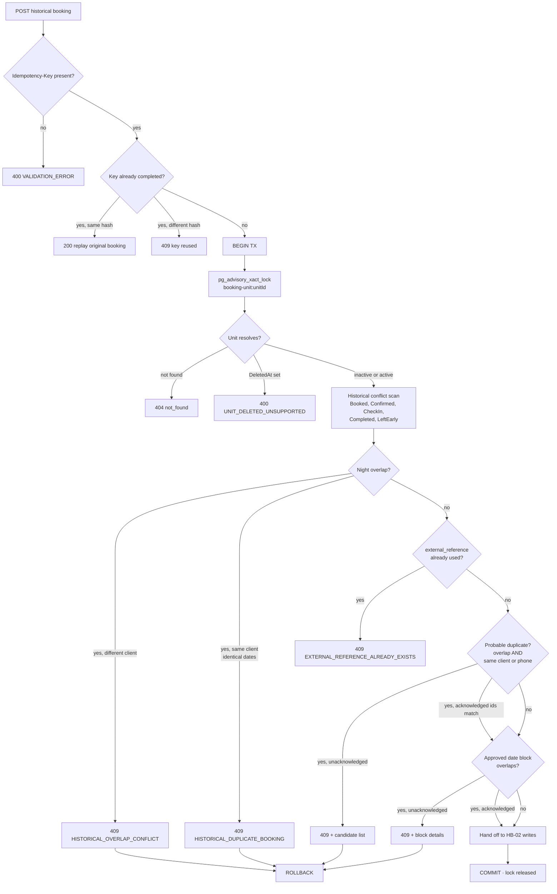
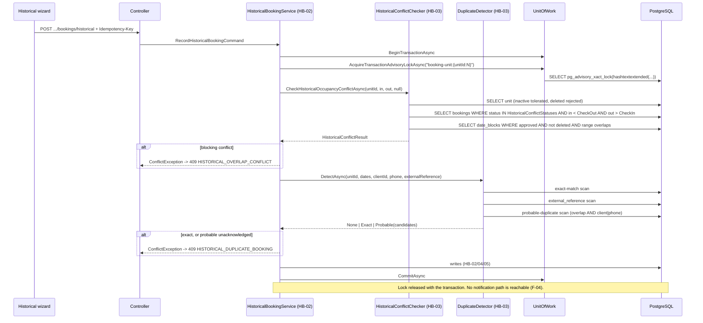

# HB-03 — Availability Conflicts & Duplicate Protection

> [README](README.md) · [Master Plan](00_MASTER_PLAN.md) · Depends on: [HB-01](01_TICKET_DISCOVERY_AND_ARCHITECTURE_DECISIONS.md) ·
> Sibling: [HB-02](02_TICKET_HISTORICAL_BOOKING_DOMAIN_AND_API.md) · Feeds: [HB-06](06_TICKET_HISTORICAL_BOOKING_WIZARD_UI.md)

---

## 1. Ticket metadata

| Field | Value |
|---|---|
| Ticket ID | **HB-03** |
| Title | Historical Availability Conflict Detection & Duplicate Protection |
| Priority | **P0** |
| Type | Backend — domain correctness, concurrency, data integrity |
| Status | Ready for implementation. **Merge blocked on [`PRE-02`](DECISION_RATIFICATION_PACKET.md#pre-02--baseline-test-execution-and-postgresql-integration-infrastructure)** |
| Dependencies | [HB-01](01_TICKET_DISCOVERY_AND_ARCHITECTURE_DECISIONS.md) — complete; ADR-09, ADR-10, ADR-12 decided. [HB-02](02_TICKET_HISTORICAL_BOOKING_DOMAIN_AND_API.md) for `bookings.external_reference` and `idempotency_keys`. **[`PRE-02`](DECISION_RATIFICATION_PACKET.md#pre-02--baseline-test-execution-and-postgresql-integration-infrastructure) is a hard merge gate** — delivered as its own PR before this ticket, **not** by [HB-09](09_TICKET_TEST_AUTOMATION_AND_RELEASE_GATES.md) |
| Dependents | [HB-06](06_TICKET_HISTORICAL_BOOKING_WIZARD_UI.md) (conflict/duplicate surfaces); consumed by [HB-02](02_TICKET_HISTORICAL_BOOKING_DOMAIN_AND_API.md) at the command boundary |
| Risk level | **CRITICAL** — `RISK-01`, `RISK-05` |
| Estimated complexity | **M** |
| Implemented by | Sole Project Owner. Review lenses: Engineering · Operations |
| Target branch | `feat/hb03-historical-conflicts-duplicates` |

> This ticket owns exactly one question: **may this historical stay be written at all?** It does not create
> bookings, money, payments, or owner records. It supplies the gate that [HB-02](02_TICKET_HISTORICAL_BOOKING_DOMAIN_AND_API.md)
> calls before it writes.

---

## 2. Business context

Occupancy is the ledger of physical truth: a unit was occupied by exactly one party on any given night. Every
downstream number — revenue per night, owner entitlement, utilisation, channel performance — is derived from
that assumption. When a stay is recorded ten days after it ended, the system has no live signal (no check-in
event, no calendar hold) to tell it that the nights were already taken. It must reason purely from stored
records, and today it reasons from the wrong subset of them.

Two failure modes matter commercially. Recording a historical stay over nights that another booking already
occupied silently doubles the revenue and the owner entitlement for those nights. Recording the *same*
offline booking twice — easy when two operators are chasing the same paperwork backlog — does the same thing
with none of the signals a genuine overlap would produce.

---

## 3. Problem being solved

### 3.1 The central defect

`CONFIRMED`. `RentalPlatform.Business/Services/UnitAvailabilityService.cs:48-74` builds its conflict set from
exactly two status collections:

```csharp
var holdingStatuses = BookingStatusTransitions.HoldingStatuses;   // :48
...
var softHoldStatuses = BookingStatusTransitions.SoftHoldStatuses; // :62
```

`RentalPlatform.Shared/Constants/BookingStatusTransitions.cs:39` — `HoldingStatuses = { Booked, Confirmed, CheckIn }`.
`:44` — `SoftHoldStatuses = { Prospecting, Relevant }`.

Neither set contains `Completed` or `LeftEarly`. The second conflict guard,
`BookingService.EnsureNoConfirmedOverlap` (`RentalPlatform.Business/Services/BookingService.cs:488-511`),
uses `HoldingStatuses` alone (`:495`). Therefore:

> **Two bookings in `Completed` on the same unit and the same nights both succeed. No exception, no warning,
> no record of the collision.** `CONFIRMED` — this is F-02, and it is the single reason this ticket exists.

Today the defect is dormant, because `Completed` is only reachable through the lifecycle and a live booking
that reached `Completed` was conflict-checked while it was still `Booked`/`Confirmed`. The historical flow
writes *directly* into `Completed` (ADR-04, F-06), which removes that accidental protection entirely.

### 3.2 The naive fix is wrong

Adding `Completed` and `LeftEarly` to `ActiveAvailabilityHoldStatuses`
(`BookingStatusTransitions.cs:46-53`) would appear to close the gap in one line. It must not be done:

| Consequence | Why it is unacceptable |
|---|---|
| Every past booking would occupy availability **forever** | `CheckOperationalAvailabilityAsync` has no date-relative filter (`CONFIRMED` — the method takes only `unitId`, `startDate`, `endDate`, `excludeBookingId`, `UnitAvailabilityService.cs:24`). A `Completed` stay from 2024 would conflict with a 2024 re-enquiry indefinitely. |
| Storefront and portal availability would change for **all** flows | The same service backs the storefront calendar, the CRM `AvailableUnitPicker`, quick booking and CRM conversion. Violates REQ-15 and INV-16's spirit. |
| `EnsureNoActiveAvailabilityHoldOverlap` (`BookingService.cs:513-537`) would begin rejecting normal bookings | It is called whenever `rejectSoftHoldOverlaps` is true (`:199-207`); the message it throws — *"Those dates were just requested or booked"* (`:534-535`) — would become factually false. |
| Legitimate re-bookings of the same unit by the same guest would break | A repeat customer returning to the same unit is normal business. |

The correct design is a **separate conflict query, with its own status set, reachable only from the historical
command**. Existing callers keep the exact behaviour they have today.

### 3.3 Duplicate late entry

There is no business duplicate guard anywhere in the booking domain. The only thing resembling one is
`BookingService.cs:19` `RecentDuplicateWindow = TimeSpan.FromSeconds(30)`, applied at `:335-347` inside
`CreateQuickInCurrentTransactionAsync`. That scan additionally filters
`b.BookingStatus == BookingStatus.Prospecting` (`:344`) and `b.CreatedAt >= duplicateCutoff` (`:345`).
`CONFIRMED` — it is a **double-click guard for the quick-booking modal**, scoped to a 30-second window and to
`Prospecting` records. It is structurally incapable of catching an offline booking entered twice on
consecutive days, and must not be confused with, extended into, or reused as the business duplicate rule.

---

## 4. User value

| Audience | Value |
|---|---|
| Operations | A late entry that collides with a stay already on file is refused with a specific, actionable message naming the conflicting booking, instead of quietly creating a second truth. |
| Finance | Occupancy-derived revenue and owner entitlement cannot be double-counted for the same night. |
| Owners | Cannot be credited twice, or credited for a night that belongs to a different booking. |
| Data/reporting | Occupancy remains a function that returns at most one booking per unit-night. |
| Engineering | One shared overlap predicate instead of three divergent copies; a documented boundary semantic. |

---

## 5. Current repository behavior

All claims verified by direct read at commit `8dafb5a`.

### 5.1 There are three overlap guards, not one

| # | Guard | Location | Status set | Predicate | Called from |
|---|---|---|---|---|---|
| G1 | `CheckOperationalAvailabilityAsync` — firm bookings | `UnitAvailabilityService.cs:48-60` | `HoldingStatuses` (`:48`) | `startDate < b.CheckOutDate && endDate >= b.CheckInDate` (`:52`) | `BookingService.cs:193-194`, `:418-419`, storefront/portal availability |
| G2 | `CheckOperationalAvailabilityAsync` — soft holds | `UnitAvailabilityService.cs:62-74` | `SoftHoldStatuses` (`:62`) | identical (`:66`) | same |
| G3 | `EnsureNoConfirmedOverlap` | `BookingService.cs:488-511` | `HoldingStatuses` (`:495`) | `checkInDate < b.CheckOutDate && checkOutDate > b.CheckInDate` (`:499`) | `CreateAsync:210`, `UpdatePendingAsync:425` |
| G4 | `EnsureNoActiveAvailabilityHoldOverlap` | `BookingService.cs:513-537` | `ActiveAvailabilityHoldStatuses` (`:520`) | `checkInDate < b.CheckOutDate && checkOutDate > b.CheckInDate` (`:524`) | `CreateAsync:199-207`, only when `rejectSoftHoldOverlaps == true` (`:142`) |

`CONFIRMED`. **None** of the four includes `Completed` or `LeftEarly`.

`INFERRED` — G1's and G3's predicates are algebraically identical. G1 receives `endDate = checkOutDate.AddDays(-1)`
(`BookingService.cs:188-190`), so `endDate >= b.CheckInDate` ⇔ `checkOutDate - 1 >= b.CheckInDate` ⇔
`checkOutDate > b.CheckInDate` over `DateOnly`. The duplication is a drift hazard, not a behavioural difference.

### 5.2 Boundary semantics are already correct and already documented in code

`CONFIRMED`. `UnitAvailabilityService.cs:45-47` carries the authoritative comment:

```
// Find firm holding bookings that overlap the requested range. endDate is the last
// night (inclusive), so a booking that checks in on endDate still conflicts ->
// endDate >= CheckInDate. CheckOutDate stays exclusive because the check-out day is free.
```

Per-day marking at `:84` confirms it: `date >= b.CheckInDate && date < b.CheckOutDate`. A booking occupies the
nights `[CheckInDate, CheckOutDate)`. **Same-day turnover is legal**: a stay ending on day D does not conflict
with a stay starting on day D. This semantic must be preserved verbatim by the historical query — see §11.4.

### 5.3 Date blocks

`CONFIRMED`. `UnitAvailabilityService.cs:39-43` queries `DateBlocks` filtered on `UnitId`, `DeletedAt == null`,
and the **inclusive** range `startDate <= db.EndDate && endDate >= db.StartDate`. `db/migrations/0014_create_date_blocks.sql:47-62`
defines `start_date`/`end_date` as inclusive `DATE` columns with `ck_date_blocks_valid_date_range CHECK (start_date <= end_date)`.

`CONFIRMED` — the query does **not** filter on `DateBlock.Status`, although the column exists:
`db/migrations/0055_date_block_approvals.sql:10` adds `status VARCHAR(20) NOT NULL DEFAULT 'approved'` with
`CHECK (status IN ('approved','pending_approval','rejected'))` (`:18-20`), and
`RentalPlatform.Data/Entities/DateBlock.cs` exposes `DateBlockStatus Status`. Consequence: a `rejected` or
`pending_approval` block currently blocks availability exactly as an `approved` one does. This is pre-existing
behaviour outside HB-03's remit, but the historical path must decide deliberately rather than inherit it — see
`D-02`.

`CONFIRMED` — reason precedence at `:107`: when both a block and a booking are present, `Reason` is reported as
`"date_blocked"`, otherwise `"date_booked"`. The historical conflict response must be more specific than this
(§14).

### 5.4 Inactive and soft-deleted units

`CONFIRMED`. Two independent hard stops sit between the historical command and an inactive unit:

| # | Location | Behaviour |
|---|---|---|
| 1 | `BookingService.cs:156-165` | Unit lookup requires `u.IsActive && u.DeletedAt == null` (plus optional `IsVisibleInPortfolio`); otherwise `NotFoundException` → **404** |
| 2 | `UnitAvailabilityService.cs:33-34` | `if (!unit.IsActive) throw new BusinessValidationException(...)` → **400** |

This is F-11. **ADR-12 (inactive units allowed) is not implementable by composing the existing path.** The
historical conflict checker needs its own unit resolution that tolerates `IsActive == false` and rejects only
`DeletedAt != null`. See §11.6 and the coordination note in §37.

### 5.5 Soft-deleted clients suppress conflicts

`CONFIRMED`. Every conflict query filters `b.Client.DeletedAt == null && b.Unit.DeletedAt == null`
(`UnitAvailabilityService.cs:53`, `:67`; `BookingService.cs:500`, `:525`). A completed stay whose client was
later soft-deleted therefore becomes invisible to conflict detection — yet the unit was still physically
occupied. See `D-08`.

### 5.6 Concurrency primitives already exist

`CONFIRMED`. `RentalPlatform.Data/UnitOfWork.cs:121-129`:

```csharp
await _context.Database.ExecuteSqlInterpolatedAsync(
    $"SELECT pg_advisory_xact_lock(hashtextextended({resourceKey}, 0))", cancellationToken);
```

`:148-153` `EnsureActiveTransaction()` throws `InvalidOperationException` when no transaction is open, so the
lock cannot be acquired outside one. `TryAcquireTransactionAdvisoryLockAsync` (`:131-140`) is the non-blocking
variant used by `AutoCompleteBookingsJob`.

Key format in the booking domain is `booking-unit:{unitId:N}` — `BookingService.cs:331-333`, mirrored by
`BookingLifecycleService`. `CONFIRMED`.

`CONFIRMED` — `CreateAsync` itself opens **no** transaction and takes **no** lock. Only `CreateQuickAsync`
does (`BookingService.cs:290`). A plain `POST` create is therefore currently unserialised; two simultaneous
requests can both pass `EnsureNoConfirmedOverlap` and both insert.

### 5.7 There is no database-level overlap protection

`CONFIRMED`. `db/migrations/0016_create_bookings.sql` declares four CHECK constraints (`:23`, `:24`, `:26-29`)
and seven plain B-tree indexes (`:32-38`). None is an exclusion constraint. A repository-wide search of
`db/migrations` for `EXCLUDE`, `daterange`, `btree_gist` and `gist` returns **no constraint or index usage** —
only the English word "excluded" inside view comments. Adopting an exclusion constraint would be a first for
this codebase. Evaluated in §11.11.

### 5.8 The error envelope has no machine-readable code

`CONFIRMED`. `RentalPlatform.API/Models/ApiResponse.cs:7-11` exposes `Success`, `Data`, `Message`, `Errors[]`,
`Pagination` — there is no `code` field. `RentalPlatform.API/Middleware/ExceptionHandlingMiddleware.cs:47-61`
maps `BusinessValidationException → 400`, `ConflictException → 409`, `NotFoundException → 404`, emitting
`ApiResponse.CreateFailure(message, errors)`. The error codes specified in
[Master Plan §12](00_MASTER_PLAN.md#12-api-and-command-design) have **no transport today**. See `D-06`.

### 5.9 Route prefix

`CONFIRMED`. `RentalPlatform.API/Controllers/BookingsController.cs:21` — `[Route("api/internal/bookings")]`;
`:97-98` `POST` with `PermissionKeys.BookingsWrite`; `:118-119` `POST /quick`; `:139-140` `PUT /{id}`.
The route is `POST /api/internal/bookings/historical`, matching the live controller prefix
(`BookingsController.cs:21`). This was previously inconsistent across the pack and is now fixed by
[Master §12.1](00_MASTER_PLAN.md#121-the-canonical-historical-contract). See `D-07`, now resolved.

### 5.10 Test harness

`CONFIRMED`. `RentalPlatform.Tests/RentalPlatform.Tests.csproj` references only `Microsoft.NET.Test.Sdk`,
`xunit`, `xunit.runner.visualstudio` and the three project references — no Testcontainers, no Respawn, no
fixture infrastructure. All three existing fixtures call `UseInMemoryDatabase`
(`BookingHistoryCreatorTests.cs:226`, `CrmRecommendationLeadTests.cs:301`, `PublicUnitCatalogTests.cs:134`).
`Microsoft.EntityFrameworkCore.Sqlite` **is** available transitively (`RentalPlatform.Data/RentalPlatform.Data.csproj:14`),
alongside `Microsoft.EntityFrameworkCore.InMemory` (`:12`).

Consequence: `pg_advisory_xact_lock`, real transactions and partial unique indexes cannot be exercised by the
current harness. SQLite would cover the partial index but not the advisory lock. Real PostgreSQL is required —
[OQ-09](00_MASTER_PLAN.md#32-open-questions).

---

## 6. Target behavior

1. A dedicated historical conflict check rejects any historical stay whose nights intersect the nights of an
   existing booking in a status that represents **real occupancy** — including `Completed` and `LeftEarly`.
2. The check tolerates inactive units and refuses soft-deleted units.
3. Half-open night semantics `[checkIn, checkOut)` are preserved exactly; same-day turnover stays legal.
4. All existing availability behaviour is byte-for-byte unchanged (REQ-15).
5. Exact duplicates are blocked (or idempotently absorbed under an explicit idempotency key); probable
   duplicates are surfaced and require an explicit operator acknowledgement; legitimate repeat business passes.
6. The whole decision happens inside one transaction under the existing per-unit advisory lock, so two
   concurrent operators cannot both win.
7. Conflicts and duplicates return distinguishable, actionable API responses that HB-06 can render.

---

## 7. In scope

- A historical conflict status set and a historical conflict query.
- Extraction of the overlap predicate into one shared, tested expression.
- A historical-tolerant unit resolution path (inactive allowed, soft-deleted refused).
- Date-block participation policy for the historical path.
- Advisory-lock scoping and transaction placement for the historical command's pre-write checks.
- Exact-duplicate blocking, probable-duplicate detection and acknowledgement, idempotency key handling.
- `external_reference` uniqueness enforcement (index authoring is in HB-04's migration; the rule and the
  service-side behaviour are here).
- Conflict/duplicate response contracts consumed by HB-06.
- A read-only reconciliation query that detects pre-existing overlaps.

## 8. Out of scope

- Creating the booking, payment, invoice, owner snapshot or audit event — [HB-02](02_TICKET_HISTORICAL_BOOKING_DOMAIN_AND_API.md), [HB-04](04_TICKET_FINANCIAL_SNAPSHOT_AND_HISTORICAL_PAYMENTS.md), [HB-05](05_TICKET_OWNER_ACCOUNTING_AND_SETTLEMENT_ADJUSTMENTS.md).
- Changing `HoldingStatuses`, `SoftHoldStatuses`, `ActiveAvailabilityHoldStatuses` or `FinanceEligibleStatuses`.
- Any change to storefront or portal availability display — [OQ-10](00_MASTER_PLAN.md#32-open-questions).
- Past-date validation — [HB-01 §11.2](01_TICKET_DISCOVERY_AND_ARCHITECTURE_DECISIONS.md#112-normal-flow-hardening--specification).
- An overlap **override** capability of any kind. Explicitly excluded by [Master §5](00_MASTER_PLAN.md#5-non-goals).
- Any hold, provisional block or expiry semantics (REQ-20, INV-16).
- Remediating existing overlapping rows. The reconciliation query reports; it does not repair.
- Client match-or-create and phone normalisation (HB-02) — HB-03 *consumes* the normalised phone.

---

## 9. Assumptions

| # | Assumption | Label | If false |
|---|---|---|---|
| A-1 | Nights are `[checkIn, checkOut)`; same-day turnover is legal | `CONFIRMED` (`UnitAvailabilityService.cs:45-47,84`) | Every predicate and the whole of §11.4 must be re-derived |
| A-2 | A unit is the atomic inventory item; no room/bed sub-inventory exists | `INFERRED` (no such entity found) | Conflict granularity changes |
| A-3 | `Cancelled` and `NotRelevant` never represent real occupancy | `INFERRED` (both terminal, `BookingStatusTransitions.cs:17,19`) | They must join the historical conflict set |
| A-4 | The historical command runs inside one transaction that HB-02 owns | `PROPOSED` | HB-03 must open its own, risking nested-transaction behaviour |
| A-5 | Client phone is available and normalised for duplicate matching (`Client.cs:9` `Phone`) | `CONFIRMED` for the column; `BLOCKED` for normalisation (HB-02 gap) | Probable-duplicate recall degrades; exact-duplicate rule is unaffected |
| A-6 | CI can be given a real PostgreSQL for integration tests | `BLOCKED` — [OQ-09](00_MASTER_PLAN.md#32-open-questions) | Concurrency and index guarantees stay unproven; see §36 |

---

## 10. Decision-required items

HB-03-local IDs. Each must be resolved before implementation, per the label.

Decision authority for every row is the **Sole Project Owner** (2026-07-29). The **Review lens** column
names the perspectives applied — it is not a list of separate approvers.

| ID | Decision | Reason it is open | Impact if wrong | Recommended default | Review lens | Blocks? |
|---|---|---|---|---|---|---|
| D-01 | Do soft holds (`Prospecting`, `Relevant`) participate in **historical** conflict detection? | A stale lead for the same offline deal is the most likely artefact an operator will meet; blocking on it prevents recording the truth | Too strict → operators cannot record real stays; too loose → nothing (soft holds occupy no real nights) | **Exclude from the hard conflict set; include only as a probable-duplicate signal when D-04's overlap and identity threshold is met. Never mutate the soft hold.** | Product · Operations | **`OWNER APPROVED`** |
| D-02 | Does an overlapping `date_block` block a historical stay? | A block is a statement about intended future unavailability; a completed stay is a statement of fact. `Status` is also unfiltered today (§5.3) | Hard-block → maintenance entries veto real history; ignore → genuine data conflicts go unnoticed | **Approved, non-deleted overlapping blocks require acknowledgement by the complete exact ID set. Missing, stale, duplicate, non-overlapping, wrong-unit, pending, rejected or deleted IDs are rejected; no block is mutated.** | Operations | **`OWNER APPROVED`** |
| D-03 | Exact duplicate → hard `409`, or idempotent absorb returning the existing booking? | Both are defensible; absorbing hides operator error, blocking breaks safe retries | Wrong choice produces either duplicate records or confusing 409s on network retry | **`409 HISTORICAL_DUPLICATE_BOOKING` by default; absorb (`200` + the original booking) only on an exact `Idempotency-Key` replay, which is HB-02's mechanism.** The two checks answer different questions: idempotency asks *"is this the same request?"*, HB-03 asks *"is this the same booking?"* | Product · Engineering | **`OWNER APPROVED`** |
| D-04 | Probable-duplicate thresholds | Scoring is a product judgement, not a technical one | Too sensitive → acknowledgement fatigue, operators click through; too lax → duplicates land | **Same unit AND at least one overlapping occupied night AND (same trusted `client_id` OR same server-normalised phone).** Adjacency, names, fuzzy matches, amount, notes, source and assignee never trigger it | Product | **`OWNER APPROVED`** |
| D-05 | Adopt a PostgreSQL `EXCLUDE` constraint as a hard backstop? | Never used in this codebase (§5.7); operational cost is real (§11.11) | Skipping it leaves the guarantee application-level only | **No in v1.** Ship the app-level guard + reconciliation query; raise a deferred hardening ticket once the census proves the table is clean | Engineering | No |
| D-06 | How is the error **code** transported, given `ApiResponse` has none (§5.8)? | [Master §12](00_MASTER_PLAN.md#12-api-and-command-design) specifies codes the envelope cannot carry | HB-06 cannot distinguish `HISTORICAL_OVERLAP_CONFLICT` from `HISTORICAL_DUPLICATE_BOOKING` and will string-match messages | Add an optional `code` (and `details`) to `ApiResponse` — purely additive, existing clients ignore it | Engineering | **Yes** |
| D-07 | Final route and success status for the historical endpoint | An earlier draft carried both `/api/bookings/historical` and `/api/internal/bookings/historical`, and both `200` and `201` | A published contract that does not exist, and scenarios asserting the wrong status | **RESOLVED.** `POST /api/internal/bookings/historical` returning **`200 OK`**, matching the live prefix (`BookingsController.cs:21`) and the repository's universal `Ok(ApiResponse<T>...)` pattern (`:114`, `:135`). Recorded normatively at [Master §12.1](00_MASTER_PLAN.md#121-the-canonical-historical-contract); every document and scenario now restates it | Engineering | No — resolved |
| D-08 | Should the historical conflict query keep the `b.Client.DeletedAt == null` filter (§5.5)? | A soft-deleted client's completed stay still occupied the unit | Keeping it → real occupancy invisible → double-booked nights | **Drop the client filter only for HB-03 conflict/duplicate reads. Compare stored client identity read-only, expose no PII, and never restore, reuse or mutate the deleted client.** | Engineering | **`OWNER APPROVED`** |

---

## 11. Architecture and technical design

### 11.1 Reuse versus extension

| Option | Description | Verdict |
|---|---|---|
| **R1** Extend `ActiveAvailabilityHoldStatuses` | Add `Completed`/`LeftEarly` to the shared set | **Rejected** — §3.2. Breaks REQ-15 and every existing caller |
| **R2** Add a bypass parameter to `CheckOperationalAvailabilityAsync` | e.g. `includeCompleted`, `allowInactiveUnit` | **Rejected** — boolean bypass parameters on a shared service are exactly the anti-pattern ADR-01 and [HB-01 §11.2.5](01_TICKET_DISCOVERY_AND_ARCHITECTURE_DECISIONS.md#112-normal-flow-hardening--specification) reject; a third caller will eventually pass the wrong value |
| **R3** New method on `IUnitAvailabilityService`, new status set, shared predicate | `CheckHistoricalOccupancyConflictAsync(...)` alongside the untouched `CheckOperationalAvailabilityAsync` | **Recommended** |
| **R4** Duplicate the queries inside `HistoricalBookingService` | Self-contained, zero blast radius | **Rejected** — guarantees predicate drift; the repository already carries four near-copies (§5.1) |

**R3 is the design.** The overlap predicate is extracted once and consumed by both the existing and the new
query, so the two can never disagree about boundary semantics.

### 11.2 The historical conflict status set

`PROPOSED`. A new set in `RentalPlatform.Shared/Constants/BookingStatusTransitions.cs`, additive, referenced by
nothing that exists today:

```csharp
// Statuses that assert a real stay physically occupied the unit.
// Used ONLY by the historical recording command (HB-03). Deliberately NOT
// merged into ActiveAvailabilityHoldStatuses: past occupancy must never
// suppress future availability.
public static readonly BookingStatus[] HistoricalConflictStatuses =
{
    BookingStatus.Booked,
    BookingStatus.Confirmed,
    BookingStatus.CheckIn,
    BookingStatus.Completed,
    BookingStatus.LeftEarly,
};
```

| Status | In set? | Rationale | Label |
|---|---|---|---|
| `Booked` | **Yes** | A firm commitment for those nights already exists | `PROPOSED` |
| `Confirmed` | **Yes** | Same | `PROPOSED` |
| `CheckIn` | **Yes** | Physically in the unit | `PROPOSED` |
| `Completed` | **Yes** | The stay happened — the whole point of ADR-10 | `PROPOSED` |
| `LeftEarly` | **Yes** | The stay happened and was paid for; the unit was held. Truncating occupancy to the actual departure is unrepresentable — no early-departure date column exists (`Booking.cs`) | `PROPOSED` |
| `Cancelled` | No | Terminal, holds nothing (`BookingStatusTransitions.cs:19`) | `PROPOSED` |
| `NotRelevant` | No | Terminal dead lead (`:17`) | `PROPOSED` |
| `NoAnswer` | No | Never in any hold set today; represents no commitment | `PROPOSED` |
| `Prospecting` | No — see D-01 | Soft hold; feeds the duplicate detector only when D-04 matches | `OWNER APPROVED` |
| `Relevant` | No — see D-01 | Same | `OWNER APPROVED` |

Note the set is deliberately **not** `FinanceEligibleStatuses` (`:61-68`), even though the membership happens to
coincide today. They answer different questions — "may money be attached?" versus "were these nights
occupied?" — and coupling them would make a future finance-policy change silently alter occupancy semantics.

### 11.3 Interface shape

`PROPOSED`:

```csharp
Task<HistoricalConflictResult> CheckHistoricalOccupancyConflictAsync(
    Guid unitId,
    DateOnly checkInDate,      // caller passes the booking dates, NOT checkOut-1
    DateOnly checkOutDate,     // exclusive; the service derives the last night itself
    Guid? excludeBookingId,
    CancellationToken cancellationToken);
```

```csharp
sealed record HistoricalConflictResult(
    bool HasBlockingConflict,
    IReadOnlyList<ConflictingBookingSummary> ConflictingBookings, // id, status, checkIn, checkOut, clientId
    IReadOnlyList<ConflictingDateBlockSummary> AdvisoryDateBlocks, // id, range, reason, status
    IReadOnlyList<ConflictingBookingSummary> AdvisorySoftHolds);
```

Passing booking dates rather than `checkOut - 1` removes the single most likely implementation error: the
existing service is called with a pre-decremented `endDate` (`BookingService.cs:188-190`) and getting that
wrong by one day produces silent false negatives at exactly the turnover boundary.

### 11.4 Boundary semantics — worked overlap cases

Existing booking **E**: check-in **10 Jun**, check-out **15 Jun**. Nights occupied: 10, 11, 12, 13, 14.
Predicate under test: `new.CheckIn < E.CheckOut && new.CheckOut > E.CheckIn`.

| # | New stay | Nights requested | Relationship | Conflict? | Why |
|---|---|---|---|---|---|
| B-01 | 05 → 10 Jun | 5–9 | ends on E's check-in day | **No** | Same-day turnover; `10 > 10` is false |
| B-02 | 05 → 11 Jun | 5–10 | tail takes night 10 | **Yes** | `11 > 10` and `5 < 15` |
| B-03 | 10 → 15 Jun | 10–14 | identical interval | **Yes** | Exact overlap |
| B-04 | 11 → 14 Jun | 11–13 | strictly contained | **Yes** | |
| B-05 | 08 → 20 Jun | 8–19 | envelops E | **Yes** | |
| B-06 | 14 → 20 Jun | 14–19 | starts on E's last night | **Yes** | Night 14 is shared |
| B-07 | 15 → 20 Jun | 15–19 | starts on E's check-out day | **No** | Same-day turnover; `15 < 15` is false |
| B-08 | 16 → 20 Jun | 16–19 | strictly after | **No** | |
| B-09 | 01 → 05 Jun | 1–4 | strictly before | **No** | |
| B-10 | 09 → 10 Jun | 9 only | single night abutting the start | **No** | |
| B-11 | 14 → 15 Jun | 14 only | single night = E's last night | **Yes** | |
| B-12 | 15 → 16 Jun | 15 only | single night = E's check-out day | **No** | |

Every row is a required unit test (`SC-AVAIL-01`). B-01, B-06, B-07, B-11 and B-12 are the boundary rows that a
naive `<=`/`>=` implementation gets wrong; they are mandatory.

### 11.5 Date blocks in the historical path

`OWNER APPROVED` by D-02. The historical query returns only overlapping `status = 'approved'`,
`deleted_at IS NULL` date blocks as acknowledgement requirements. The request must acknowledge the complete
current set by exact ID; a blanket boolean and missing, stale, duplicate, non-overlapping or wrong-unit IDs are
invalid. `pending_approval`, `rejected` and deleted blocks require no acknowledgement. No block is mutated.

### 11.6 Inactive and soft-deleted units

`PROPOSED`. `CheckHistoricalOccupancyConflictAsync` performs its own unit resolution:

| Unit state | Behaviour | Error |
|---|---|---|
| Active, not deleted | Proceed | — |
| `IsActive == false`, `DeletedAt == null` | **Proceed** (ADR-12, REQ-17); attach an informational marker to the result | — |
| `DeletedAt != null` | Reject | `400 UNIT_DELETED_UNSUPPORTED` (Master §12) |
| Not found | Reject | `404 not_found` |
| `IsVisibleInPortfolio == false` | Proceed — portfolio visibility is a storefront concern (`BookingService.cs:159` applies it only when `requirePortfolioVisibility`) | — |

It must **not** call `CheckOperationalAvailabilityAsync`, which throws on `!unit.IsActive`
(`UnitAvailabilityService.cs:33-34`).

### 11.7 Concurrency

`PROPOSED`. The historical command wraps *conflict check → duplicate check → writes → commit* in one
transaction, taking `pg_advisory_xact_lock` on the existing key `booking-unit:{unitId:N}` as its **first**
statement:

```
BEGIN
  AcquireTransactionAdvisoryLockAsync($"booking-unit:{unitId:N}")   // UnitOfWork.cs:121-129
  resolve unit (inactive tolerated, deleted rejected)
  historical conflict scan
  date-block advisory scan
  exact-duplicate scan
  probable-duplicate scan
  → HB-02 performs the writes
COMMIT   // lock released automatically by pg_advisory_xact_lock semantics
```

Three properties follow. The lock is transaction-scoped, so no explicit release and no leak on exception. The
same key is already used by `BookingService.CreateQuickAsync` (`:331-333`) and `BookingLifecycleService`, so a
historical record and a concurrent quick booking on the same unit serialise against each other. And
`EnsureActiveTransaction` (`UnitOfWork.cs:148-153`) turns "forgot the transaction" into a loud
`InvalidOperationException` rather than a silent unlocked path.

`CONFIRMED` limitation: `hashtextextended` maps the key into a 64-bit space, so a hash collision between two
different units is theoretically possible. The consequence is only unnecessary serialisation, never a missed
conflict. Acceptable, and already the status quo.

**Deadlock ordering.** Only one lock is taken, and always the same one, so lock-ordering deadlock is not
reachable from this path. If HB-02 later adds a second advisory lock (for example an owner-scoped one), the
acquisition order must be documented and fixed.

### 11.8 Duplicate protection model

Three distinct populations, three distinct outcomes. **Customer name must never be a duplicate key** — names
are non-unique, transliterated inconsistently between Arabic and Latin script, and frequently entered
differently by different operators. Name may contribute to a *display* hint; it must never gate a decision.

| Class | Definition | Outcome | Error / signal |
|---|---|---|---|
| **Exact duplicate** | Same `unit_id` **AND** same `check_in_date` **AND** same `check_out_date` **AND** same `client_id`, in any status within `HistoricalConflictStatuses` | Block, or absorb under a replayed idempotency key (`D-03`) | `409 HISTORICAL_DUPLICATE_BOOKING` |
| **External-reference duplicate** | Same non-null `external_reference` | Block unconditionally — the operator has asserted a unique external identity | `409 EXTERNAL_REFERENCE_ALREADY_EXISTS` (HB-02 transport) |
| **Probable duplicate** | Night overlap on the same unit **AND** (same `client_id` **OR** same normalised phone). Amount proximity is displayed, never decisive (`D-04`) | Block **until** the request carries an explicit acknowledgement token, then allow | `409` + machine-readable candidate list; retry with `acknowledgedDuplicateOf: [ids]` |
| **Soft-hold echo** | An overlapping `Prospecting`/`Relevant` booking for the same client — the half-entered lead for this same deal | Advisory only; feeds the probable-duplicate list (D-01) | Warning payload |
| **Legitimate repeat** | Same client, same unit, **non-overlapping** nights | Allow with no friction | — |

Notes:

- The exact-duplicate scan intentionally overlaps the conflict scan for the same-client case. Both fire; the
  duplicate result takes precedence in the response because it is the more actionable diagnosis.
- A different client on the same unit and dates is **not** a duplicate. It is an overlap, and it returns
  `HISTORICAL_OVERLAP_CONFLICT`. Conflating them would tell operators the wrong story.
- The acknowledgement token must name the specific candidate booking ids it acknowledges. A bare boolean
  `force: true` is rejected for the same reason ADR-01 rejects `allowPastDates` — it is unauditable and
  becomes a habitual click-through.
- The acknowledgement, when used, is audit-relevant: HB-02 records which candidate ids were dismissed.

### 11.9 `external_reference` uniqueness

`PROPOSED`. Column defined in [Master §11](00_MASTER_PLAN.md#11-ratified-data-model) as
`bookings.external_reference VARCHAR(100) NULL`, migration authored under HB-04. HB-03 owns the rule:

```
CREATE UNIQUE INDEX CONCURRENTLY ux_bookings_external_reference
    ON bookings (external_reference)
    WHERE external_reference IS NOT NULL;
```

Two implementation constraints, both verifiable:

- `CREATE INDEX CONCURRENTLY` cannot run inside a transaction block. `CONFIRMED` — `scripts/apply-migrations.sh`
  pipes each file with `psql -v ON_ERROR_STOP=1 ... < "$path"` and does **not** wrap it in `BEGIN`/`COMMIT`, so
  the concurrent form is available provided the migration file itself opens no transaction.
- The unique index produces `23505` at the database level, which
  `ExceptionHandlingMiddleware.cs:68-71` currently maps to **500**. The service must therefore perform an
  explicit pre-check inside the transaction *and* catch `DbUpdateException` on the unique index, translating
  both to `409 HISTORICAL_DUPLICATE_BOOKING`. Relying on the pre-check alone loses the race; relying on the
  constraint alone returns a 500.

**Settled — global.** The [migration-ownership matrix](00_MASTER_PLAN.md#111-migration-ownership-matrix)
defines object #7 as `ux_bookings_external_reference`, a unique partial index over the whole table
`WHERE external_reference IS NOT NULL`, owned by HB-02. Global uniqueness is what that index expresses, and
HB-03 depends on it rather than redefining it. The original question was whether uniqueness is global or
scoped per
`original_source`. Recommended default: **global**, because operators paste opaque identifiers whose namespace
they cannot be relied upon to know.

### 11.10 Idempotency

`PROPOSED`. Retry safety must not depend on the 30-second window (§3.3), which is scoped to `Prospecting`.

| Aspect | Design |
|---|---|
| Transport | `Idempotency-Key` request header, client-generated UUID, **required** by the historical endpoint. **Owned and implemented by [HB-02](02_TICKET_HISTORICAL_BOOKING_DOMAIN_AND_API.md#191-the-idempotency-contract-d-hb02-idem--normative)** ([D-HB02-IDEM](DECISION_RATIFICATION_PACKET.md#d-hb02-idem--idempotency-ownership-and-contract)); HB-03 consumes it |
| Scope | Per key, globally — not per user, so a retried request from a different session still resolves |
| Storage | **Settled — `idempotency_keys`, created by HB-02's migration.** No idempotency table existed in the repository (`CONFIRMED`), so HB-02 creates one; reusing `external_reference` was rejected because it conflates a business identifier with a transport concern. This is **not** `BLOCKED`, **not** optional, **not** deferred, and **not** HB-03's to create |
| Scope and key | `(actor_admin_user_id, endpoint, key)`, with a persisted canonical request hash. Defined in full by HB-02; HB-03 must not restate it differently |
| Replay of a **completed** key with a matching request hash | Return the original outcome — `200` + the original booking |
| Replay with a **different** request hash | `409` with a distinct message: the key was reused for a different payload |
| Replay while the original is **in flight** | The advisory lock serialises it; the second attempt then sees the committed key and replays the response |
| Missing header | `400 VALIDATION_ERROR`. The endpoint is low-volume and operator-driven; requiring the key costs nothing |

### 11.11 Database-level guard — honest evaluation

`CONFIRMED` (§5.7): no `EXCLUDE`, `daterange`, or `btree_gist` usage exists anywhere in `db/migrations`.
Adopting one would be new to this codebase.

Candidate shape (illustrative only — **not** a migration):

```
CREATE EXTENSION IF NOT EXISTS btree_gist;

ALTER TABLE bookings ADD CONSTRAINT ex_bookings_no_overlap
  EXCLUDE USING gist (
      unit_id WITH =,
      daterange(check_in_date, check_out_date, '[)') WITH &&
  ) WHERE (booking_status IN ('booked','confirmed','checkin','completed','leftearly'));
```

| | Argument |
|---|---|
| **For** | An absolute guarantee independent of application code — it also covers manual SQL, data fixes and any future write path. `daterange(..., '[)')` encodes the half-open night semantic in the schema itself, where it cannot drift. It is the only mechanism that makes INV-04 provable rather than tested. |
| **Against** | `CREATE EXTENSION btree_gist` requires elevated privileges — on the shared production host this is an operational request, not a code change. Exclusion constraints **cannot** be added `NOT VALID`, so the table must already be clean; §5.7 and F-02 make pre-existing overlaps plausible and the census in §26 may well find some. The constraint build takes an `ACCESS EXCLUSIVE` lock, and the `CREATE INDEX CONCURRENTLY` + `ADD CONSTRAINT ... USING INDEX` escape hatch does not exist for exclusion constraints. Violations raise SQLSTATE `23P01`, which the current middleware maps to **500** (`ExceptionHandlingMiddleware.cs:68-71`). The predicate hard-codes status strings, so any future status change becomes a migration. It would also start rejecting writes from paths that legitimately expect today's behaviour. |

**Recommendation (`D-05`): do not adopt in v1.** Ship instead:

1. The application-level guard under the advisory lock (§11.7) — closes the race for every code path that exists.
2. A read-only reconciliation query (§26 task 2) that detects any overlap, run pre-release and then scheduled.
3. A deferred hardening ticket to reconsider the exclusion constraint once the census demonstrates a clean
   table and the extension has been provisioned. Record the pending `23P01 → 409` mapping there.

### 11.12 Decision flow



---

## 12. Expected data flow



---

## 13. Expected files/components likely to change

`PROPOSED` — the implementer confirms; none of these is asserted as mandatory.

| Path | Likely change | Risk to existing behaviour |
|---|---|---|
| `RentalPlatform.Shared/Constants/BookingStatusTransitions.cs` | Add `HistoricalConflictStatuses`; **do not touch** existing sets | None — additive |
| `RentalPlatform.Shared/Constants/` (new) | Shared overlap predicate helper / expression | None |
| `RentalPlatform.Business/Interfaces/IUnitAvailabilityService.cs` | Add `CheckHistoricalOccupancyConflictAsync` | Interface addition; any other implementer/mock must be updated |
| `RentalPlatform.Business/Services/UnitAvailabilityService.cs` | New method; refactor the existing predicate to the shared expression **without changing it** | Medium — the refactor must be behaviour-preserving |
| `RentalPlatform.Business/Models/` | `HistoricalConflictResult`, `ConflictingBookingSummary`, `DuplicateDetectionResult` | None |
| `RentalPlatform.Business/Services/` (new) | `HistoricalDuplicateDetectionService` | None |
| `RentalPlatform.Business/Exceptions/` | Coded conflict exception carrying a code + structured details | Low |
| `RentalPlatform.API/Models/ApiResponse.cs` | Optional `code`/`details` (D-06) | Low — additive, serialised only when set |
| `RentalPlatform.API/Middleware/ExceptionHandlingMiddleware.cs` | Propagate the code; map unique-violation `DbUpdateException` to 409 | Medium — shared by every endpoint; regression-test it |
| `RentalPlatform.Business/Services/BookingService.cs` | **No behavioural change.** Only the predicate refactor, if the shared expression is adopted here too | High if botched — guard with characterisation tests first |
| `db/migrations/00NN_*` | **Nothing.** `ux_bookings_external_reference` and `idempotency_keys` are both authored by **HB-02's** migration (matrix #7 and #12); HB-03 depends on them and creates neither | — |
| `RentalPlatform.Tests/` | Boundary, conflict, duplicate and (real-Postgres) concurrency suites | None |

---

## 14. API changes

No change to any existing endpoint's behaviour. HB-03 defines the failure surface of the endpoint HB-02
introduces.

| Condition | Status | Code | Payload additions |
|---|---|---|---|
| Night overlap with a `HistoricalConflictStatuses` booking | 409 | `HISTORICAL_OVERLAP_CONFLICT` | `conflicts[]`: `{ bookingId, status, checkInDate, checkOutDate }` — no client PII |
| Exact duplicate (unit + dates + client) | 409 | `HISTORICAL_DUPLICATE_BOOKING` | `duplicateOf: bookingId`, `matchReason: "exact"` |
| `external_reference` already used | 409 | `EXTERNAL_REFERENCE_ALREADY_EXISTS` | `duplicateOf: bookingId`, `matchReason: "external_reference"`; HB-02 owns this transport |
| Probable duplicate, unacknowledged | 409 | `HISTORICAL_DUPLICATE_BOOKING` | `candidates[]` + `requiresAcknowledgement: true`, `matchReason: "probable"` |
| Approved date block overlaps, unacknowledged (D-02) | 409 | `HISTORICAL_OVERLAP_CONFLICT` | `dateBlocks[]` + `requiresAcknowledgement: true` |
| Unit soft-deleted | 400 | `UNIT_DELETED_UNSUPPORTED` | — |
| Unit not found / out of scope | 404 | `not_found` | — |
| Missing or malformed `Idempotency-Key` | 400 | `IDEMPOTENCY_KEY_REQUIRED` | HB-02 owns this response |
| Idempotency key replayed with a different payload | 409 | `IDEMPOTENCY_KEY_REUSED` | HB-02 owns this response |
| Idempotency key replayed identically | 200 | — | The original booking; HB-02 owns this response |

Request additions owned by HB-03: `acknowledgedDuplicateOf: Guid[]`;
`acknowledgedDateBlockIds: Guid[]`. Both acknowledgement arrays are **id lists, never booleans**.

Conflict payloads carry booking ids and dates only. Guest names, phones and emails must not appear — an
operator recording a booking for unit X should not learn who else stayed there (INV-12 in spirit; §16).

---

## 15. Data/schema changes

HB-03 authors **no migration.** It **depends on** two objects that
[HB-02](02_TICKET_HISTORICAL_BOOKING_DOMAIN_AND_API.md) creates, and defers a third. Ownership is fixed by
the [migration-ownership matrix](00_MASTER_PLAN.md#111-migration-ownership-matrix); an earlier draft
assigned the first two to "HB-04's migration", which was wrong on both counts.

| Object | Shape | **Owner** | HB-03's relationship |
|---|---|---|---|
| `ux_bookings_external_reference` | `UNIQUE INDEX ... (external_reference) WHERE external_reference IS NOT NULL` | **HB-02** (#7) | **Dependency.** It indexes `bookings.external_reference`, an HB-02 column. Must be created `CONCURRENTLY`, so that file must not open a transaction (§11.9). HB-03 relies on it for exact-duplicate rejection |
| `idempotency_keys` | PK `(actor_admin_user_id, endpoint, key)` plus `request_hash`, `response_status`, `booking_id`, `created_at`, `completed_at` | **HB-02** (#12) | **Dependency, not ownership.** Idempotency is a property of HB-02's endpoint and is fully specified by [D-HB02-IDEM](DECISION_RATIFICATION_PACKET.md#d-hb02-idem--idempotency-ownership-and-contract). **There is no automatic expiration in v1** — no retention decision is outstanding |
| `ex_bookings_no_overlap` | `EXCLUDE USING gist` | Deferred ticket | Not in v1 — `D-05`, §11.11 |

**Merge gate — `PRE-02`.** Every guarantee in this ticket — transaction scope, advisory-lock serialisation,
unique-index enforcement, `CHECK` rejection, concurrent-request behaviour — is unverifiable on the current
test substrate. **HB-03 must not merge until [`PRE-02`](DECISION_RATIFICATION_PACKET.md#pre-02--baseline-test-execution-and-postgresql-integration-infrastructure) is
complete.**

`PRE-02` is an **independent prerequisite PR delivered before this ticket**. It provides the CI test step,
the real-PostgreSQL provisioning, the reusable fixture and the transaction-capable setup that HB-03's tests
require. It is explicitly **not** delivered by [HB-09](09_TICKET_TEST_AUTOMATION_AND_RELEASE_GATES.md),
which runs after this ticket — an earlier revision said it was, which was circular. See
[Master §21.1a](00_MASTER_PLAN.md#211a-pre-02-is-complete-and-is-not-delivered-by-hb-09) and
[D-TEST-01](DECISION_RATIFICATION_PACKET.md#d-test-01--postgresql-test-requirement).

Supporting index review (`PROPOSED`): `ix_bookings_unit_id` (`0016_create_bookings.sql:33`),
`ix_bookings_check_in_date` (`:37`) and `ix_bookings_check_out_date` (`:38`) exist as separate single-column
indexes. The historical conflict query filters `unit_id` + status + a date range, so a composite
`(unit_id, check_in_date, check_out_date)` may be worth adding — mirroring the pattern already used for date
blocks at `0014_create_date_blocks.sql:66`. Measure with `EXPLAIN` on production-scale data before adding;
do not add speculatively.

---

## 16. Authorization and security

| Concern | Control |
|---|---|
| Endpoint gate | `bookings:record_historical`, enforced by policy on the controller (F-14 convention, `PermissionKeys.cs:16-17` for the existing pattern). HB-03 adds no permission of its own |
| Conflict-check as an oracle | The conflict payload leaks *that* a unit was occupied on given dates. Restrict it to unit ids inside the caller's scope and return **no client identity** in conflict entries |
| Duplicate-check as a lookup oracle | Probable-duplicate matching consumes a phone number the caller already supplied; it must never return a phone, name or email in the response — only booking ids and dates |
| Bypass by flag | No boolean bypass exists. Acknowledgements are id lists validated against the candidates the server itself computed; an id the server did not offer is rejected as `VALIDATION_ERROR` |
| Bypass by endpoint | The normal `POST` path retains its own guards and, once [HB-08](08_TICKET_REPORTING_AUDIT_OBSERVABILITY_AND_ROLLOUT.md) activates the REQ-16 rule specified in [HB-01 §11.2](01_TICKET_DISCOVERY_AND_ARCHITECTURE_DECISIONS.md#112-normal-flow-hardening--specification), rejects past dates. Until then `RISK-10` remains open and HB-03's guarantees are only as strong as the historical endpoint's exclusivity |
| Cross-portfolio injection | Unit resolution is scope-checked before any conflict query runs (INV-12) |
| Idempotency-key squatting | Keys are scoped to **actor + endpoint + key** and validated against a canonical request hash; a mismatched replay is refused, never silently absorbed, and one actor can never replay another's key |
| Enumeration via timing | Not mitigated; conflict checks are not a credential surface. Noted, not actioned |

---

## 17. Validation rules

Extends [Master §13](00_MASTER_PLAN.md#13-validation-matrix); V-06, V-07, V-08, V-09 and V-18 are owned here.

| # | Rule | Layer | Failure | Scenario |
|---|---|---|---|---|
| H-01 | `checkOut > checkIn` (pre-existing, `BookingService.cs:465-466`; `ck_bookings_valid_stay_range`, `0016:26`) | Validator + service + DB | 400 | `SC-AVAIL-01` |
| H-02 | Unit exists and `DeletedAt == null` | Historical checker | 404 / 400 | `SC-AVAIL-09` |
| H-03 | Unit may be inactive | Historical checker | allowed | `SC-AVAIL-08` |
| H-04 | No night overlap with `HistoricalConflictStatuses` | Historical checker | 409 | `SC-AVAIL-02..06` |
| H-05 | `Cancelled`/`NotRelevant`/`NoAnswer` never block | Historical checker | allowed | `SC-AVAIL-11` |
| H-06 | Soft holds do not block (D-01) but are reported | Historical checker | allowed + warning | `SC-AVAIL-12` |
| H-07 | Approved, non-deleted date-block overlap requires acknowledgement (D-02) | Historical checker | 409 until acknowledged | `SC-AVAIL-07` |
| H-08 | No exact duplicate | Duplicate detector | 409 | `SC-DUP-01` |
| H-09 | `external_reference` unique when present | Detector + partial unique index | 409 | `SC-DUP-02` |
| H-10 | Probable duplicate acknowledged by id | Detector | 409 until acknowledged | `SC-DUP-05` |
| H-11 | Acknowledged ids must appear in the server-computed candidate set | Detector | 400 | `SC-DUP-06` |
| H-12 | Name similarity alone never blocks | Detector | allowed | `SC-DUP-07` |
| H-13 | Repeat customer, non-overlapping dates, passes with no friction | Detector | allowed | `SC-DUP-03` |
| H-14 | `Idempotency-Key` present and well-formed | Controller — **HB-02's rule**, listed here only so the HB-03 matrix is complete | 400 `IDEMPOTENCY_KEY_REQUIRED` | `SC-CONC-04` |
| H-15 | Conflict evaluation happens inside the transaction, after the lock | Service | `InvalidOperationException` if no transaction (`UnitOfWork.cs:148-153`) | `SC-CONC-01` |

---

## 18. Transaction and failure behavior

| Aspect | Behaviour |
|---|---|
| Boundary | One transaction, opened by HB-02's command, spanning lock → checks → writes → commit (INV-05) |
| Nesting | `UnitOfWork.HasActiveTransaction` (`UnitOfWork.cs:119`) already guards re-entry; follow the `CreateQuickAsync` pattern (`BookingService.cs:273-288`) of joining an existing transaction rather than opening a second |
| Lock acquisition failure | `AcquireTransactionAdvisoryLockAsync` blocks rather than failing; a pathological wait surfaces as a request timeout. `PROPOSED`: use the blocking variant, not `TryAcquire...` — a historical entry is operator-driven and low-volume, so waiting is preferable to a spurious failure |
| Rejection | Any conflict or duplicate rejection rolls back. No partial state (INV-06) |
| Post-write failure | Rollback discards the booking, its history row and any payment together |
| Unique-index violation at commit | `DbUpdateException` caught and translated to `409 HISTORICAL_DUPLICATE_BOOKING`; never allowed to reach the 500 branch (`ExceptionHandlingMiddleware.cs:68-71`) |
| Read consistency | Default `READ COMMITTED` is sufficient **because** the advisory lock serialises writers on the same unit. Without the lock it would not be — this is the load-bearing reason the lock is mandatory, not merely defensive |
| Idempotency-key write | Claimed immediately after the advisory lock and completed inside the **same** transaction as the booking insert (HB-02 §11.5), so a rolled-back attempt leaves no key and the retry is clean |

---

## 19. Idempotency and concurrency

| Scenario | Expected outcome |
|---|---|
| Two operators, same unit, same dates, different clients, simultaneous | One commits; the other blocks on the advisory lock, then sees the committed row and returns `409 HISTORICAL_OVERLAP_CONFLICT` |
| Two operators, same unit, same dates, **same** client, simultaneous | One commits; the other returns `409 HISTORICAL_DUPLICATE_BOOKING` |
| Same operator, double-submit, same `Idempotency-Key` | One booking; the second call replays `200` with the original booking |
| Same operator, double-submit, **different** keys, identical payload | Second returns `409 HISTORICAL_DUPLICATE_BOOKING` (exact-duplicate rule) — the idempotency layer is not the duplicate guard, and neither substitutes for the other |
| Historical entry concurrent with a normal quick booking on the same unit | Serialised on the shared key `booking-unit:{unitId:N}` (`BookingService.cs:331-333`); whichever commits second is rejected |
| Historical entry concurrent with a lifecycle transition on the same unit | Serialised on the same key (`BookingLifecycleService` uses the identical format) |
| Historical entry concurrent with a date-block creation | `BLOCKED` — whether date-block writes take the same advisory lock is unverified. Must be confirmed before release; if they do not, a block could be created between the check and the commit. Worst case is an advisory warning missed, not a double booking |
| Network retry after a committed-but-unacknowledged response | Idempotency key replays the original result |
| Clock skew between application instances | Irrelevant — no conflict rule in HB-03 depends on wall-clock time. Stay dates are `DateOnly` |

`CONFIRMED` constraint: none of the above is testable on `UseInMemoryDatabase` (§5.10). Transactions raise
`TransactionIgnoredWarning` and `ExecuteSqlInterpolatedAsync` is relational-only. Real PostgreSQL integration
tests are a **release gate**, tracked in [HB-09](09_TICKET_TEST_AUTOMATION_AND_RELEASE_GATES.md) and
[OQ-09](00_MASTER_PLAN.md#32-open-questions).

---

## 20. Audit and observability

| Signal | Shape | Purpose |
|---|---|---|
| Metric | `historical_booking_rejected_total{reason="overlap"}` | Sizes RISK-01; a spike means either bad data or a boundary bug |
| Metric | `historical_booking_rejected_total{reason="duplicate", match="exact\|external_reference\|probable"}` | Sizes RISK-05 and validates the D-04 thresholds |
| Metric | `historical_duplicate_acknowledged_total` | If this approaches the probable-duplicate rate, the thresholds are too sensitive and operators are clicking through |
| Metric | `historical_conflict_check_duration_seconds` | Detects a missing index before it becomes a lock-hold problem |
| Metric | `historical_idempotency_replay_total` | Confirms retry safety is exercised |
| Log | Structured, correlation id, `unitId`, requested dates, conflicting booking ids, decision. **No PII** — no guest name, phone or email | Diagnosis without exposure |
| Audit | Acknowledged candidate ids and acknowledged date-block ids recorded on the booking's audit event by HB-02 | Answers "who decided this was not a duplicate?" |
| Reconciliation | Scheduled read-only query: any two bookings in `HistoricalConflictStatuses`, same unit, intersecting `[checkIn, checkOut)` | The only way to prove INV-04 holds in production absent the exclusion constraint |

---

## 21. Notification/side-effect behavior

None. HB-03 performs reads and raises exceptions; it writes nothing and dispatches nothing.

This is structural, not policy: `CONFIRMED` per F-04 that `BookingService.CreateAsync` triggers no
notification, that the only lifecycle notification is reachable via `TransitionAsync`
(`BookingLifecycleService.cs:69` → `:311`), and that `Program.cs:311` registers a single hosted service whose
filter is `BookingStatus == CheckIn` (`AutoCompleteBookingsJob.cs:86-87`). A rejected historical attempt leaves
no row for anything to observe. A **successful** one lands in `Completed`, outside that filter.

`NAC-HB03-06` asserts this rather than assuming it.

---

## 22. Reporting/accounting impact

None directly — HB-03 creates no financial record. Two indirect effects:

1. **Prevented double-counting.** Every overlap this ticket blocks would otherwise have produced duplicate
   revenue, a duplicate owner entitlement, and inflated occupancy. This is the accounting value of the ticket.
2. **The pre-existing census may embarrass a report.** If the reconciliation query (§26 task 2) finds existing
   overlapping rows, Finance must be told before release: some historical utilisation figures may already
   exceed 100% for affected units. HB-03 reports; it does not repair. Remediation, if any, is a Finance-owned
   follow-up — related to [OQ-07](00_MASTER_PLAN.md#32-open-questions) in spirit though not in mechanism.

---

## 23. Backward compatibility

| Surface | Impact |
|---|---|
| `CheckOperationalAvailabilityAsync` callers | **None.** The method's signature, status sets, predicate and result shape are unchanged |
| `EnsureNoConfirmedOverlap` / `EnsureNoActiveAvailabilityHoldOverlap` | **None.** Behaviour preserved; only the predicate's *expression* may be relocated |
| Storefront availability | **None.** Past bookings still do not suppress future dates — this is the explicit point of §3.2 |
| CRM `AvailableUnitPicker`, quick booking, CRM conversion | **None** |
| Existing bookings | Not read for mutation, not modified, not backfilled |
| `ApiResponse` consumers | Additive `code`/`details` only; absent fields serialise as null or are omitted |
| `IUnitAvailabilityService` implementers | **Breaking at compile time** for any other implementation or hand-written mock. Search before adding the method |
| Existing overlapping rows | Tolerated. The new rule is enforced on *write*, never retroactively |

---

## 24. Migration and rollout plan

1. Merge the shared predicate refactor **alone**, behind characterisation tests proving `CheckOperationalAvailabilityAsync`
   returns identical results before and after. Ship and observe.
2. Merge `HistoricalConflictStatuses` and `CheckHistoricalOccupancyConflictAsync` — dead code until HB-02 calls
   it, therefore zero production risk.
3. Merge the duplicate detector, likewise uncalled.
4. HB-04's migration adds `ux_bookings_external_reference` (`CONCURRENTLY`) and `idempotency_keys`, with the
   paired `_verify.sql` the convention requires.
5. HB-02 wires the checks into the command. From this point the guarantees are live.
6. Run the reconciliation census on staging, then on production (read-only), before granting the permission
   to any operator.
7. Grant `bookings:record_historical` to the pilot role. Monitor the §20 metrics daily for one week.

Sequencing rationale: steps 1–4 are individually revertible and observable. Only step 5 changes behaviour a
user can see.

---

## 25. Feature flag strategy

`PROPOSED` — **no runtime flag**, consistent with [HB-01 §25](01_TICKET_DISCOVERY_AND_ARCHITECTURE_DECISIONS.md#25-feature-flag-strategy)
and [Master §22](00_MASTER_PLAN.md#22-rollout-strategy). The permission is the flag: until
`bookings:record_historical` is granted, the endpoint is unreachable and the new code is inert.

A flag is actively harmful here. A toggle that disables conflict detection is a switch for creating overlapping
bookings, which is precisely the outcome `RISK-01` exists to prevent. If Ops requires a kill switch, the
supported mechanism is **revoking the permission**, which is auditable through the existing RBAC override
tables (`rbac_admin_user_permission_overrides`, F-14).

`OWNER APPROVED` by D-04: v1 uses the fixed, explicit threshold in §11.8. It is not runtime-configurable;
changing booking identity policy requires a reviewed code change rather than an operational toggle.

---

## 26. Detailed implementation tasks

Ordered; each independently checkable.

1. Write characterisation tests pinning the current behaviour of `CheckOperationalAvailabilityAsync`,
   `EnsureNoConfirmedOverlap` and `EnsureNoActiveAvailabilityHoldOverlap` across all twelve boundary cases in
   §11.4. These must pass **before** any refactor.
2. Author the read-only reconciliation query (self-join on `bookings`, same `unit_id`, intersecting
   `[check_in_date, check_out_date)`, both sides in the historical conflict statuses). Run it against staging.
   Attach aggregate counts — **no PII** — to the PR.
3. Extract the overlap predicate into one shared expression; repoint all existing callers; re-run task 1's
   tests unchanged.
4. Add `HistoricalConflictStatuses` to `BookingStatusTransitions.cs` with the explanatory comment from §11.2.
   Add a test asserting the existing four sets are untouched.
5. Define `HistoricalConflictResult` and its summary records.
6. Implement `CheckHistoricalOccupancyConflictAsync`: own unit resolution (inactive tolerated, deleted
   rejected), booking scan over the new set, approved-date-block advisory scan, soft-hold advisory scan.
   Apply `D-08` to the client filter.
7. Unit-test the new method against all twelve boundary cases plus every status in the enum, asserting
   membership and non-membership explicitly.
8. Implement `HistoricalDuplicateDetectionService`: exact match, `external_reference` match, probable match
   per `D-04`. Assert by test that name is not an input to any decision path.
9. Implement acknowledgement validation — ids must be a subset of the server-computed candidate set.
10. Define the coded conflict exception; extend `ApiResponse` with `code`/`details` per `D-06`; propagate
    through `ExceptionHandlingMiddleware`; add the `DbUpdateException` unique-violation → 409 mapping.
11. Add a middleware regression test proving existing endpoints' error bodies are unchanged when no code is set.
12. Implement idempotency-key handling per §11.10 (table shape specified to HB-04).
13. Specify `ux_bookings_external_reference` to HB-04, including the `CONCURRENTLY` and no-transaction
    constraints, and the paired `_verify.sql`.
14. Wire the advisory lock ordering contract and document it for HB-02 (§11.7).
15. Add real-PostgreSQL integration tests: two concurrent identical requests, lock serialisation, unique-index
    race, transaction rollback leaving no rows. Gated on [OQ-09](00_MASTER_PLAN.md#32-open-questions) — if
    unresolved, stop and report (§36).
16. Add the §20 metrics and structured logs.
17. Publish the conflict/duplicate response contract to HB-06, with example payloads.
18. Run `EXPLAIN` on the conflict query at production scale; add the composite index only if it demonstrably
    helps (§15).

---

## 27. Acceptance criteria

| ID | Criterion |
|---|---|
| AC-HB03-01 | **Given** a `Completed` booking on unit U for 10–15 Jun, **when** a historical booking is recorded on U for 12–14 Jun, **then** the API returns `409 HISTORICAL_OVERLAP_CONFLICT` naming the conflicting booking id. |
| AC-HB03-02 | **Given** a `LeftEarly` booking on unit U for 10–15 Jun, **when** an overlapping historical booking is recorded, **then** it is rejected identically. |
| AC-HB03-03 | **Given** a `Cancelled` or `NotRelevant` booking on U for 10–15 Jun, **when** an overlapping historical booking is recorded, **then** it succeeds. |
| AC-HB03-04 | **Given** a booking on U checking out 15 Jun, **when** a historical booking checks in 15 Jun, **then** it succeeds (same-day turnover, B-07). |
| AC-HB03-05 | **Given** a booking on U checking in 10 Jun, **when** a historical booking checks out 10 Jun, **then** it succeeds (B-01). |
| AC-HB03-06 | All twelve boundary cases in §11.4 produce the tabulated verdict. |
| AC-HB03-07 | **Given** a unit with `IsActive == false` and `DeletedAt == null`, **when** a historical booking is recorded, **then** it succeeds (ADR-12, REQ-17). |
| AC-HB03-08 | **Given** a unit with `DeletedAt != null`, **when** a historical booking is recorded, **then** `400 UNIT_DELETED_UNSUPPORTED`. |
| AC-HB03-09 | **Given** an identical historical booking (same unit, dates, client) already exists, **when** recorded again without an idempotency replay, **then** `409 HISTORICAL_DUPLICATE_BOOKING` with `matchReason: "exact"`. |
| AC-HB03-10 | **Given** a booking with `external_reference = "X"`, **when** another historical booking supplies `"X"`, **then** `409 EXTERNAL_REFERENCE_ALREADY_EXISTS` with `matchReason: "external_reference"`. |
| AC-HB03-11 | **Given** an overlapping booking for the same client with different dates, **when** recorded, **then** `409` with `requiresAcknowledgement: true` and a candidate list; **when** retried with those ids acknowledged, **then** it succeeds. |
| AC-HB03-12 | **Given** the same client and unit with **non-overlapping** dates, **when** recorded, **then** it succeeds with no acknowledgement required. |
| AC-HB03-13 | **Given** two different clients with the same name, **when** the second books non-overlapping dates, **then** no duplicate signal is raised. |
| AC-HB03-14 | **Given** two concurrent identical requests, **when** both execute against real PostgreSQL, **then** exactly one booking exists and the other receives a `409`. |
| AC-HB03-15 | **Given** a request replayed with the same `Idempotency-Key` and payload, **then** `200` and the original booking id — no second row. |
| AC-HB03-16 | **Given** a rejected historical attempt, **then** no `bookings`, `booking_status_history`, `payments` or `idempotency_keys` row is left behind. |
| AC-HB03-17 | Storefront and portal availability results are byte-identical before and after this ticket for all statuses (REQ-15). |
| AC-HB03-18 | An approved, non-deleted date block overlapping the stay produces `409` until acknowledged; a `rejected` or soft-deleted block produces no friction (D-02). |
| AC-HB03-19 | The reconciliation query is attached to the PR with aggregate results for staging. |
| AC-HB03-20 | `historical_booking_rejected_total` is emitted with the correct `reason` and `match` labels for every rejection branch. |

## 28. Negative acceptance criteria

| ID | Must NOT happen |
|---|---|
| NAC-HB03-01 | `HoldingStatuses`, `SoftHoldStatuses`, `ActiveAvailabilityHoldStatuses` and `FinanceEligibleStatuses` must not be modified. |
| NAC-HB03-02 | A `Completed` or `LeftEarly` booking must not suppress future availability in the storefront, the portal, or any existing caller. |
| NAC-HB03-03 | No boolean bypass (`force`, `skipConflictCheck`, `allowOverlap`) may exist on any request, service method, or configuration key. |
| NAC-HB03-04 | Two different-identity bookings in `HistoricalConflictStatuses` must never exist on the same unit with intersecting nights, including under concurrency. The only exception is D-04's explicit acknowledgement of a server-identified same-client or same-normalized-phone probable duplicate; exact duplicates remain blocked. |
| NAC-HB03-05 | Customer name must not be an input to any duplicate-blocking decision. |
| NAC-HB03-06 | No notification, no invoice, no payout and no background-job action may result from a conflict check, a duplicate check, or a rejection. |
| NAC-HB03-07 | The 30-second `RecentDuplicateWindow` (`BookingService.cs:19`) must not be widened, reused, or presented as the business duplicate guard. |
| NAC-HB03-08 | A rejected attempt must not leave a partial row anywhere. |
| NAC-HB03-09 | Conflict and duplicate payloads must not contain guest names, phones or emails. |
| NAC-HB03-10 | An acknowledgement must not be accepted for a booking id the server did not itself offer as a candidate. |
| NAC-HB03-11 | The conflict check must not run outside the advisory lock or outside the transaction. |
| NAC-HB03-12 | A unique-index violation must not surface as `500`. |
| NAC-HB03-13 | No hold, provisional block, expiry job, or reservation-window semantic may be introduced (REQ-20, INV-16). |
| NAC-HB03-14 | Existing overlapping rows must not be deleted, merged or mutated by this ticket. |

---

## 29. QA plan

| Layer | Coverage |
|---|---|
| **Unit** | All twelve §11.4 boundary cases against the shared predicate; every `BookingStatus` value asserted in or out of `HistoricalConflictStatuses`; single-night stays; a stay whose check-out equals another's check-in in both directions |
| **Unit** | Duplicate classification: exact, external-reference, probable, soft-hold echo, legitimate repeat, same-name-different-client, same-phone-different-client |
| **Unit** | Acknowledgement validation: subset, superset, empty, unrelated id, replayed stale id |
| **Service** | Inactive unit accepted; soft-deleted unit rejected; unit not found; out-of-scope unit |
| **Service** | Approved / `pending_approval` / `rejected` / soft-deleted date-block matrix |
| **Service** | Soft-deleted client's completed stay still blocks (D-08) |
| **Integration (real PostgreSQL — required)** | Advisory-lock serialisation; two concurrent identical commands; unique-index race on `external_reference`; rollback leaves no rows; idempotency replay across connections |
| **API** | Status codes, error codes, payload shapes for all ten rows of §14; `ApiResponse` regression for endpoints that set no code |
| **Frontend (HB-06 contract)** | Conflict panel, duplicate-candidate list, acknowledgement flow, unreachable-endpoint degradation |
| **E2E (Playwright)** | Record a historical booking that collides → see the conflict → change dates → succeed. Record a probable duplicate → acknowledge → succeed. Uses the existing `playwright.crm.config.ts` harness |
| **Concurrency** | Two operators, same unit, same dates: different clients (overlap) and same client (duplicate). Historical vs quick booking on the same unit |
| **Security** | Permission absent → 403; cross-portfolio unit → 404; forged acknowledgement id → 400; conflict payload asserted PII-free |
| **Accounting** | Post-suite reconciliation query returns zero overlaps |
| **Regression** | Storefront availability; CRM `AvailableUnitPicker`; `QuickBookingModal`; CRM conversion; `UpdatePendingAsync` overlap re-check; the three existing xUnit fixtures |
| **Manual** | `SC-AVAIL-01..12`, `SC-DUP-01..08`, `SC-CONC-01..05` from [99](99_RELIABILITY_TEST_SCENARIOS.md) |

---

## 30. PM checklist

- [ ] `D-01` … `D-08` answered; the five blocking ones in writing
- [ ] Product has approved the duplicate taxonomy in §11.8 and the `D-04` thresholds
- [ ] Ops has approved date-block treatment (`D-02`) and understands the acknowledgement flow
- [ ] *Engineering lens:* error-code transport (`D-06`) settled; route and status (`D-07`) settled
- [ ] Finance has been briefed on the possibility of pre-existing overlaps (§22)
- [ ] Real-PostgreSQL CI resolved or explicitly deferred with a named owner ([OQ-09](00_MASTER_PLAN.md#32-open-questions))
- [ ] HB-02 has accepted the interface contract in §11.3 and the lock contract in §11.7
- [ ] HB-06 has accepted the response contract in §14
- [ ] Observability (§20) reviewed and dashboards planned
- [ ] Support runbook covers "why was my historical booking rejected?"

---

## 31. Definition of Ready

1. [HB-01](01_TICKET_DISCOVERY_AND_ARCHITECTURE_DECISIONS.md) complete; ADR-09, ADR-10 and ADR-12 approved in writing.
2. `D-01`, `D-02`, `D-03`, `D-06`, `D-07`, `D-08` answered.
3. HB-02's command shape and transaction ownership agreed (A-4).
4. Client phone normalisation defined by HB-02, or `D-04` reduced to `client_id` matching only (A-5).
5. A test environment with real PostgreSQL, or an accepted plan to obtain one.
6. The reconciliation census has been run at least once on a production-like dataset.

## 32. Definition of Done

1. AC-HB03-01 … 20 pass.
2. NAC-HB03-01 … 14 verified, each by an assertion rather than by inspection.
3. Characterisation tests prove existing availability behaviour is unchanged (REQ-15).
4. Concurrency tests pass against real PostgreSQL.
5. The reconciliation query returns zero new overlaps after the full test suite has run.
6. INV-04 and INV-08 each have an automated assertion.
7. Metrics are visible in the monitoring stack.
8. Response contracts are published to and acknowledged by HB-06.
9. `D-05` (exclusion constraint) is recorded as a deferred ticket with an owner, not left implicit.
10. Full existing regression suite green.

---

## 33. Risks and mitigations

| ID | Risk | Mitigation |
|---|---|---|
| `RISK-01` | Duplicate historical stay on the same unit and nights | `HistoricalConflictStatuses` + advisory lock + reconciliation query; AC-HB03-01/02/14 |
| `RISK-05` | Same offline booking entered twice | Three-class duplicate model + `external_reference` unique index + idempotency key |
| `RISK-09` | Partial state on failure | Single transaction; AC-HB03-16 |
| `RISK-11` | Cross-portfolio unit injection via the conflict check | Scope-check unit resolution before any query; conflict payload carries no client identity |
| `RISK-16` | The predicate refactor silently changes existing availability | Characterisation tests first (task 1); refactor second; AC-HB03-17 |
| New | Acknowledgement fatigue — operators reflexively acknowledge probable duplicates | `historical_duplicate_acknowledged_total` vs the probable rate; tune `D-04` if the ratio is high; require id-level acknowledgement, never a blanket boolean |
| New | Pre-existing overlaps discovered late, blocking release | Run the census in task 2, before implementation, not after |
| New | `IUnitAvailabilityService` change breaks an unnoticed implementer or mock | Search the solution before adding the method; compile-time failure is loud |
| New | Advisory-lock hash collision serialises unrelated units | Accepted — degrades throughput only, never correctness; already the status quo |
| New | Conflict query slow at scale, lengthening lock hold time | `EXPLAIN` at production scale (task 18); `historical_conflict_check_duration_seconds` |

---

## 34. Rollback strategy

Pure code change in this ticket; no migration is authored here.

| Stage reverted | Effect |
|---|---|
| Steps 5–7 (wiring + permission) | Revoke `bookings:record_historical`. The endpoint becomes unreachable; all new code is inert. Fastest mitigation, no deploy required |
| Steps 2–4 (new set, checker, detector) | Revert the PRs. Nothing called them before HB-02 wired them in |
| Step 1 (predicate refactor) | Revert. Characterisation tests make the revert verifiable in both directions |
| HB-04's `ux_bookings_external_reference` | `DROP INDEX CONCURRENTLY` is safe and lossless — an index carries no data |
| `idempotency_keys` | Droppable; losing it only loses replay protection for in-flight retries |

No data-loss exposure, because HB-03 writes no domain data. Note the contrast with
[HB-04](04_TICKET_FINANCIAL_SNAPSHOT_AND_HISTORICAL_PAYMENTS.md), where rollback after the first historical
booking destroys the agreed amount ([Master §21](00_MASTER_PLAN.md#21-migration-strategy)).

---

## 35. Evidence required in the PR

- Test output covering all twelve §11.4 boundary cases, with the case ids visible in test names.
- Test output enumerating every `BookingStatus` value against `HistoricalConflictStatuses` membership.
- Characterisation-test output proving `CheckOperationalAvailabilityAsync` results are unchanged.
- A diff confirming the four existing status sets are untouched (satisfies NAC-HB03-01 by inspection *and* test).
- Real-PostgreSQL concurrency test output, or an explicit `BLOCKED` statement naming the owner and the
  unblocking condition ([OQ-09](00_MASTER_PLAN.md#32-open-questions)).
- Reconciliation-query output for staging — aggregate counts only, **no PII**.
- `EXPLAIN (ANALYZE)` for the conflict query at representative scale.
- Example `409` payloads for overlap, exact duplicate, external-reference duplicate and probable duplicate.
- Confirmation that no migration file is included in this ticket's diff.
- Confirmation that the storefront and portal availability regression suites are green.

---

## 36. Agent stop conditions

Stop and report rather than proceeding if:

- Any of `D-01`, `D-02`, `D-03`, `D-06`, `D-07`, `D-08` is unanswered.
- The repository differs materially from §5 — in particular if `HoldingStatuses`, `SoftHoldStatuses` or the
  overlap predicates have changed since `8dafb5a`.
- HB-02's command does not open a transaction, or does not let HB-03's checks run inside it (A-4 false).
- Real PostgreSQL cannot be provisioned for integration tests. Do **not** ship concurrency guarantees proven
  only on `UseInMemoryDatabase`; report the gap instead.
- Another `IUnitAvailabilityService` implementation is discovered that cannot be updated within this ticket.
- The reconciliation census finds pre-existing overlaps — pause and escalate to Finance and Product before
  continuing (§22).
- Closing a case appears to require modifying `HoldingStatuses`, `SoftHoldStatuses` or
  `ActiveAvailabilityHoldStatuses`. That is the wrong fix; re-read §3.2.
- The work appears to require a hold, reservation window, or expiry mechanism. It does not (REQ-20).
- Unrelated files must change to make tests pass.

---

## 37. Handoff notes

**The one-sentence version.** `UnitAvailabilityService.cs:48-74` and `BookingService.cs:495` both build their
conflict set from `HoldingStatuses`, which stops at `CheckIn`; the historical flow writes past `CheckIn`
straight into `Completed`, so it needs its own set and its own query — and must not touch theirs.

**The trap to avoid.** Adding `Completed` to `ActiveAvailabilityHoldStatuses` looks like a one-line fix and is
the single most likely wrong turn in this ticket. It would make every past stay block future availability
forever, because `CheckOperationalAvailabilityAsync` has no date-relative filter. §3.2 is the argument; keep it
in front of you.

**The second trap.** `CheckOperationalAvailabilityAsync` is called with `endDate = checkOutDate.AddDays(-1)`
(`BookingService.cs:188-190`) — a pre-decremented last night. The new method deliberately takes the raw
check-out date instead. Do not copy the call site's convention into the new signature; that off-by-one is
invisible except at exactly the turnover boundary, which is where it matters most.

**The blocker HB-02 must be told about.** ADR-12 says inactive units are allowed, but the existing path has two
hard stops: `BookingService.cs:156-165` requires `u.IsActive` (404) and `UnitAvailabilityService.cs:33-34`
throws on `!unit.IsActive` (400). The historical command therefore **cannot** simply compose `CreateAsync` as
it stands. Agree the resolution with HB-02 before either ticket writes code — HB-03's recommendation is a
distinct unit-resolution path inside the historical command rather than any loosening of `CreateAsync`'s
guards.

**The thing that is already right.** The boundary semantic is correct, documented in code at
`UnitAvailabilityService.cs:45-47`, and consistent across all four existing guards. Preserve it exactly;
do not "improve" it.

**What is genuinely new to this codebase.** Partial unique indexes, exclusion constraints and an idempotency
table all have zero precedent in `db/migrations`. The first is low-risk and recommended; the second is
deferred with reasons (§11.11); the third needs a table HB-04 must carry. None should be introduced quietly.
