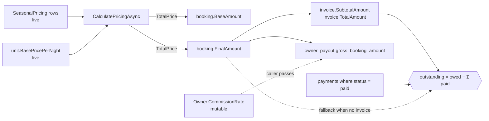
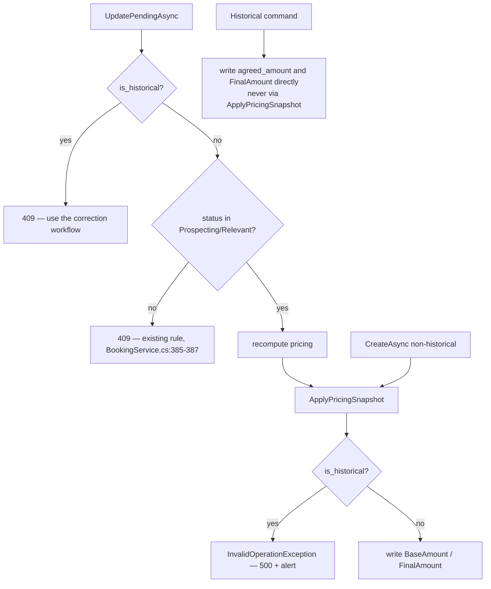
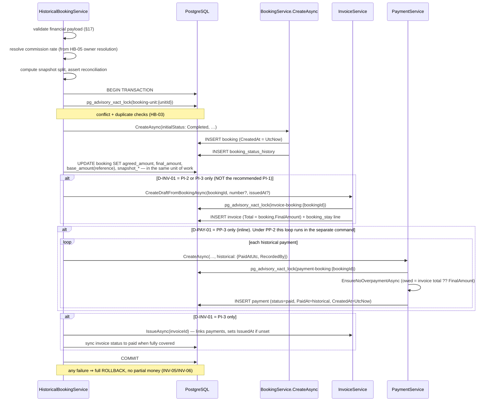

# HB-04 — Financial Snapshot & Historical Payments

> [README](README.md) · [Master Plan](00_MASTER_PLAN.md) · Prev: [HB-03](03_TICKET_AVAILABILITY_CONFLICTS_AND_DUPLICATE_PROTECTION.md) ·
> Depends on: [HB-02](02_TICKET_HISTORICAL_BOOKING_DOMAIN_AND_API.md) · Feeds: [HB-06](06_TICKET_HISTORICAL_BOOKING_WIZARD_UI.md), [HB-08](08_TICKET_REPORTING_AUDIT_OBSERVABILITY_AND_ROLLOUT.md) ·
> Sibling: [HB-05](05_TICKET_OWNER_ACCOUNTING_AND_SETTLEMENT_ADJUSTMENTS.md)

---

## 1. Ticket metadata

| Field | Value |
|---|---|
| Ticket ID | **HB-04** |
| Boundary with HB-02 | **HB-02 owns truthful capture of the raw `agreedAmount` needed to create the booking**, persisted into the booking's existing amount columns. **HB-04 owns the extended immutable historical financial snapshot** — the dedicated `bookings.agreed_amount` column (matrix #14), its constraint, the repricing guard, and all payment behaviour. See [D-HB02-AMT](DECISION_RATIFICATION_PACKET.md#d-hb02-amt--financial-truth-boundary) |
| Title | Financial Snapshot & Historical Payments |
| Priority | **P0** |
| Type | Backend domain + schema migration + finance correctness |
| Status | Ready for review — blocked on HB-02 merge |
| Dependencies | [HB-02](02_TICKET_HISTORICAL_BOOKING_DOMAIN_AND_API.md) (command, endpoint, permission, `is_historical` marker) |
| Dependents | [HB-06](06_TICKET_HISTORICAL_BOOKING_WIZARD_UI.md) (financial wizard step), [HB-08](08_TICKET_REPORTING_AUDIT_OBSERVABILITY_AND_ROLLOUT.md) (stay-period reporting) |
| Sibling coupling | [HB-05](05_TICKET_OWNER_ACCOUNTING_AND_SETTLEMENT_ADJUSTMENTS.md) owns *who* is credited; HB-04 owns *how much* and *when it was paid* |
| Risk level | **CRITICAL** — carries `RISK-04`, `RISK-13`, `RISK-14`, `RISK-15` |
| Estimated complexity | **L** |
| Implemented by | Sole Project Owner. Review lenses: Finance · Engineering · Security |
| Target branch | `feat/hb04-financial-snapshot-historical-payments` |
| Requirements owned | REQ-05, REQ-06, REQ-08 (jointly with HB-05), REQ-14, REQ-19 |
| Invariants owned | INV-05, INV-06, INV-15; contributes to INV-02, INV-13, INV-14 |

---

## 2. Business context

A historical booking exists to make money true. The stay already happened, cash already changed hands, and
the owner is already owed. Everything else in this feature — dates, reasons, permissions, audit — is
scaffolding around one question the business actually cares about: **what was agreed, what was received, and
who gets what?**

The concrete case from [Master Plan §3](00_MASTER_PLAN.md#3-problem-statement): agreed on day 1 at a price
negotiated by phone; a cash deposit taken on day 1; the stay on days 2–5; recorded on day 10. On day 10 the
current nightly rate may be higher, lower, or seasonally different from what was actually agreed on day 1,
and the owner's commission rate may have been edited in the meantime. Recording the booking must capture the
day-1 economics, not the day-10 economics.

---

## 3. Problem being solved

Three distinct defects, each independently sufficient to make a historical booking financially wrong.

| # | Defect | Evidence | Consequence |
|---|---|---|---|
| 1 | **Amounts are computed, never accepted.** There is no way for an operator to state the price that was actually agreed. | `CONFIRMED` `BookingService.cs:213,231-232` | The recorded revenue is a fiction derived from today's price list |
| 2 | **Amounts are recomputed on edit.** Any later edit reassigns `BaseAmount` and `FinalAmount` from live pricing. | `CONFIRMED` `BookingService.cs:428,439-440` | Even a correctly-entered agreed price would be silently destroyed — `RISK-04` |
| 3 | **Payment effective dates cannot be supplied.** `Payment.PaidAt` exists but no code path sets it to anything other than "now". | `CONFIRMED` `PaymentService.cs:137,282` | A day-1 cash deposit is recorded as received on day 10 |

A fourth, quieter defect: `Owner.CommissionRate` is mutable and is frozen only when a payout row is created
(`CONFIRMED` `Owner.cs:13`; `OwnerPayoutService.cs:114`). Between recording a historical booking and paying
its payout, the commercial split can change underneath a completed stay.

---

## 4. User value

| Audience | Value |
|---|---|
| Finance | Recorded revenue equals the amount actually agreed. Balances, invoices and payouts all derive from one protected number. |
| Operations | A deposit taken in cash on the agreement date can be entered with its real date and method, in the same atomic action as the booking. |
| Owners | The commission split applied to a historical stay is the split that was in force, not whatever the rate happens to be on the day someone edits the owner record. |
| Audit | Every recorded payment names the admin user who recorded it — impossible today (`CONFIRMED` `Payment.cs:5-16`, no actor column). |
| Engineering | One protected value with one guard, rather than defensive recomputation scattered across services. |

---

## 5. Current repository behavior

All rows verified by direct read at commit `8dafb5a`. Local reference IDs `HB04-E01 …` are for
cross-referencing inside this ticket only; the pack-wide finding IDs remain `F-01 … F-14`.

### 5.1 Evidence table

| Ref | Claim | Label | Evidence |
|---|---|---|---|
| HB04-E01 | The booking financial model is exactly two columns. No currency, fee, tax, discount, commission or external-amount column exists. | `CONFIRMED` | `Booking.cs:18-19` (`BaseAmount`, `FinalAmount`); `db/migrations/0016_create_bookings.sql:11-12` `DECIMAL(12,2)` |
| HB04-E02 | Both amounts are set from computed pricing at create. | `CONFIRMED` | `BookingService.cs:213` → `:231-232` |
| HB04-E03 | Both amounts are reassigned from *current* pricing on the update path. | `CONFIRMED` | `BookingService.cs:428` → `:439-440` |
| HB04-E04 | The update method is `UpdatePendingAsync`, and it already refuses any booking that is not `Prospecting`/`Relevant`. | `CONFIRMED` | `BookingService.cs:370` (signature); `:385-387` (status guard, throws `ConflictException`) |
| HB04-E05 | Pricing is reconstructed from **live** unit base price and **currently-stored** seasonal rows; there is no rounding step. | `CONFIRMED` | `UnitAvailabilityService.cs:136-139,144-159,166` |
| HB04-E06 | `CalculatePricingAsync` has **no** `IsActive` guard, unlike `CheckOperationalAvailabilityAsync`. Reference pricing therefore still works for an inactive unit. | `CONFIRMED` | `UnitAvailabilityService.cs:125-132` (no guard) vs `:33-34` (throws) |
| HB04-E07 | `PaymentService.CreateAsync` always writes `PaymentStatus = "pending"` and **never** writes `PaidAt`. | `CONFIRMED` | `PaymentService.cs:132-144` |
| HB04-E08 | `MarkPaidAsync` sets `PaidAt = DateTime.UtcNow` unconditionally; there is no override parameter. | `CONFIRMED` | `PaymentService.cs:282` |
| HB04-E09 | Overpayment is already blocked twice: at create and at mark-paid. Owed = active invoice total, else `booking.FinalAmount`. | `CONFIRMED` | `PaymentService.cs:170-198` (`:182`, `:184-187`, `:189`); `:242-279` (`:261-270`, `:272`) |
| HB04-E10 | `PaymentService.CreateAsync` enlists in an ambient transaction rather than opening its own. | `CONFIRMED` | `PaymentService.cs:118-120` (`HasActiveTransaction`); `IUnitOfWork.cs:67-69` |
| HB04-E11 | Payment writes are serialised by advisory lock `payment-booking:{bookingId:N}`. | `CONFIRMED` | `PaymentService.cs:126-128` |
| HB04-E12 | Invoice draft creation copies `booking.FinalAmount` into subtotal, total and the single `booking_stay` line. | `CONFIRMED` | `InvoiceService.cs:118-119,134-135` |
| HB04-E13 | `CreateDraftFromBookingAsync` already accepts a caller-supplied `invoiceNumber`; only the generated fallback encodes the record date. | `CONFIRMED` | `InvoiceService.cs:60-64,79,93-95`; generator `:500-518`, prefix `:502` |
| HB04-E14 | `IssueAsync` uses `IssuedAt ??= DateTime.UtcNow` — a pre-set issue date would survive. No path sets it. | `CONFIRMED` | `InvoiceService.cs:236` |
| HB04-E15 | `IssueAsync` links every unlinked payment of the booking to the invoice. | `CONFIRMED` | `InvoiceService.cs:243-249` |
| HB04-E16 | Invoices are legal for `Completed` bookings; so are payments. | `CONFIRMED` | `InvoiceService.cs:70-73`; `PaymentService.cs:94-97`; `BookingStatusTransitions.cs:61-70` |
| HB04-E17 | Payout gross is `booking.FinalAmount`; commission uses `Math.Round(gross * rate / 100m, 2, MidpointRounding.AwayFromZero)`; payout = gross − commission. | `CONFIRMED` | `OwnerPayoutService.cs:75-77`; DB `ck_owner_payouts_payout_formula` |
| HB04-E18 | The commission rate used for a payout is a **caller parameter**, not read from `Owner`. | `CONFIRMED` | `OwnerPayoutService.cs:57-62,72-73,114` |
| HB04-E19 | Payouts are allowed only for `Confirmed` or `Completed` bookings — a historical record is payout-eligible the moment it is created. | `CONFIRMED` | `OwnerPayoutService.cs:68-70` |
| HB04-E20 | Negative money is unrepresentable anywhere: payment `> 0`, invoice line `>= 0`, booking amounts `>= 0`. | `CONFIRMED` | `0022_create_payments.sql:19`; `0024_create_invoice_items.sql:16-17`; `0016_create_bookings.sql:28-29` |
| HB04-E21 | The finance daily summary counts paid money **only via `payments.invoice_id`**, and buckets by `DATE(b.created_at)`. | `CONFIRMED` | `0042_create_reporting_finance_daily_summary_view.sql:73-81` (`:80`), `:65,:87`; superseded/aligned by `0052_align_reporting_views_with_pipeline.sql:41,50` |
| HB04-E22 | Reporting views sum `final_amount` only — `base_amount` appears in no view. | `CONFIRMED` | `0041_…:56`; `0052_…:24` |
| HB04-E23 | Exception→status mapping: `BusinessValidationException`→400, `ConflictException`→409, `NotFoundException`→404. | `CONFIRMED` | `ExceptionHandlingMiddleware.cs:47-61` |
| HB04-E24 | The API failure envelope has **no machine-readable error-code field** — only `message` and `errors[]`. | `CONFIRMED` | `ApiResponse.cs:5-11,24-33`; `ExceptionHandlingMiddleware.cs:76` |
| HB04-E25 | All payment and invoice endpoints are gated by `finance:manage`, on `api/internal/payments` and `api/internal/invoices`. | `CONFIRMED` | `PaymentsController.cs:17,29,57,69-70,86-87`; `InvoicesController.cs:17,61-62,90-91` |
| HB04-E26 | `PermissionKeys` maintains a `Descriptors` list and an `All` projection alongside the constants. | `CONFIRMED` | `PermissionKeys.cs:13-33,35-62` |
| HB04-E27 | No payment-gateway integration, SDK, webhook receiver or transaction-id field exists in the solution. | `CONFIRMED` | F-12; `Payment.cs` has only `ReferenceNumber` (`:12`) |

### 5.2 What this means for the central defect

`RISK-04` as written in [Master §24](00_MASTER_PLAN.md#24-risk-register) says an unrelated later edit would
destroy the agreed price. HB04-E04 refines that: **today** the repricing path is unreachable for a
`Completed` booking, because `UpdatePendingAsync` rejects any status outside `Prospecting`/`Relevant`
(`BookingService.cs:385-387`). The protection is real but **incidental** — it is a "pending bookings are
editable" rule, not a financial-integrity rule. It would evaporate the moment anyone widens the editable
status set, adds an admin correction endpoint, or writes a bulk price-refresh job. `RISK-04` is therefore
retained at CRITICAL and the guard in §11.3 is mandatory: the invariant must be stated where money lives,
not inferred from an unrelated status check.

### 5.3 Financial values as they exist today



Every downstream financial artefact hangs off `FinalAmount`. That single fact drives the core design
decision in §11.2.

---

## 6. Target behavior

1. The historical command accepts an **agreed amount** entered by the operator and persists it in a
   protected column, `bookings.agreed_amount`.
2. `FinalAmount` is set equal to the agreed amount so that every existing downstream consumer — invoice
   totals, payout gross, overpayment guard, outstanding-balance formula, reporting views — inherits the
   correct number with **zero** changes to those consumers (HB04-E12, E17, E09, E21, E22).
3. `BaseAmount` holds the record-time *reference* reconstruction from current pricing, retained for variance
   inspection only, per [Master §14](00_MASTER_PLAN.md#14-financial-model).
4. A repricing guard makes it structurally impossible for any automatic recomputation to overwrite the
   protected values of a booking where `is_historical = true`.
5. The commercial split is snapshotted at creation into `snapshot_commission_rate`,
   `snapshot_owner_amount`, `snapshot_kaza_amount`, using the *identical* arithmetic the payout service
   already uses (HB04-E17), and validated to reconcile exactly against the agreed amount.
6. Zero or more historical payments are recorded, each with a real `PaidAt`, a manual method, an optional
   external reference, and the recording admin user captured in a new `payments.created_by_admin_user_id`
   column. **Whether they are written inline in the creation transaction, by a separate privileged command,
   or not at all in v1 is `DECISION REQUIRED` —
   [D-PAY-01](DECISION_RATIFICATION_PACKET.md#d-pay-01--historical-payment-policy), recommended
   default `PP-2` (separate privileged command).**
7. **No invoice is created or issued by the historical flow in v1** — `DECISION REQUIRED`,
   [D-INV-01](DECISION_RATIFICATION_PACKET.md#d-inv-01--invoice-policy), recommended
   default `PI-1`. This is the option HB-02 and HB-07 are already written against, so it is also the
   consistent default across the pack.
8. Fees, taxes, discounts and multi-currency are **not** modelled. They are folded into the agreed total, and
   this is stated to the operator in the UI rather than silently assumed.
9. No payment gateway is contacted, because none exists — and a test asserts that this remains true.

---

## 7. In scope

- `bookings.agreed_amount` plus the three snapshot columns, and their migration.
- `payments.created_by_admin_user_id` plus its FK and index.
- The repricing guard on the update path, and the immutability rule for protected fields.
- Financial fields of the historical command DTO, their validation, and server-side recomputation of the
  split (never trusting client-computed money).
- Historical payment creation — `PaidAt`, method, reference, note and actor — in whichever shape
  [D-PAY-01](DECISION_RATIFICATION_PACKET.md#d-pay-01--historical-payment-policy) ratifies.
- Payment-scenario behaviour: none / deposit / partial / full / overpayment.
- Balance-consistency assertions against the existing formula (HB04-E09).
- Presenting the invoice options (§11.6) so
  [D-INV-01](DECISION_RATIFICATION_PACKET.md#d-inv-01--invoice-policy) can be
  ratified. Under the recommended `PI-1` no invoice code changes at all; under `PI-2`/`PI-3` the service
  changes listed in §11.6 enter scope at ratification time.
- Financial acceptance, negative-acceptance and reconciliation tests.

## 8. Out of scope

| Excluded | Why | Where it lives instead |
|---|---|---|
| Which owner is credited, override permission, correction workflow | HB-05 owns owner policy per ADR-08 | [HB-05](05_TICKET_OWNER_ACCOUNTING_AND_SETTLEMENT_ADJUSTMENTS.md) |
| Creating the `owner_payouts` row | Payouts are created explicitly, not by booking creation (`OwnerPayoutService.cs:107-123`) | HB-05 / existing finance flow |
| Stay-period reporting dimension | ADR-11 | [HB-08](08_TICKET_REPORTING_AUDIT_OBSERVABILITY_AND_ROLLOUT.md) |
| The wizard's financial step UI | HB-06 | [HB-06](06_TICKET_HISTORICAL_BOOKING_WIZARD_UI.md) |
| Refunds, credit notes, negative adjustments | Unrepresentable (HB04-E20); see §10 `D-HB04-05` | v2 epic |
| Multi-currency | No column anywhere — [OQ-05](00_MASTER_PLAN.md#32-open-questions) | v2 epic |
| Fee / tax / discount modelling | No columns anywhere — [OQ-06](00_MASTER_PLAN.md#32-open-questions) | v2 epic |
| Payment-gateway simulation or fabricated transaction ids | REQ-06 non-goal | — |
| Retro-repricing existing non-historical bookings | Not a requirement; would rewrite history | — |
| Correcting an already-paid payout | [OQ-07](00_MASTER_PLAN.md#32-open-questions) | Manual finance process |

---

## 9. Assumptions

| # | Assumption | Label | If false |
|---|---|---|---|
| A-1 | KAZA operates in a single currency. | `INFERRED` from the total absence of a currency column (HB04-E01) | Every amount in this ticket becomes ambiguous; feature must pause — [OQ-05](00_MASTER_PLAN.md#32-open-questions) |
| A-2 | The agreed total is inclusive of any fee, tax or discount that applied. | `PROPOSED` per [OQ-06](00_MASTER_PLAN.md#32-open-questions) | A fee/tax model must be designed first; HB-04 doubles in size |
| A-3 | `FinalAmount` may be set to the agreed amount without breaking any consumer. | `CONFIRMED` for the consumers enumerated in HB04-E12/E17/E09/E21/E22 | Any unenumerated consumer that assumes `FinalAmount == computed price` would misbehave; §29 regression sweep must find it |
| A-4 | An operator recording a historical booking is trusted to state the agreed price; the control is permission + audit, not arithmetic. | `PROPOSED` | An approval workflow would be required — out of v1 |
| A-5 | Historical payments are always already settled (status `paid`), never `pending`. | `PROPOSED` — a payment agreed offline and received offline has no pending state | If historical *promised* payments must be tracked, the DTO needs a status field |
| A-6 | `Completed` remains the only status a historical booking is created in. | `CONFIRMED` ADR-04 | The payout-eligibility and finance-eligibility reasoning in §22 must be re-derived |

---

## 10. Decision-required items

Decision authority for every row is the **Sole Project Owner** (2026-07-29). The **Review lens** column
names the perspectives applied — it is not a list of separate approvers.

| ID | Decision | Reason it is open | Impact if unresolved | Recommended default | Review lens | Blocking? |
|---|---|---|---|---|---|---|
| `D-HB04-01` | Should the update path be **wholly** forbidden for `is_historical = true` bookings, or only the financial fields? | HB04-E04 shows the path is already status-blocked, so both options are currently equivalent in behaviour but not in intent | An implementer may add only a field-level guard, leaving a future editable-status change unprotected | **Both.** Reject the whole `UpdatePendingAsync` call for a historical booking (409), *and* add a field-level protected-value guard as defence in depth. Cost is two small checks; benefit is that neither can be removed accidentally | Engineering · Finance | **Yes** |
| `D-HB04-02` | Should `BaseAmount` hold the record-time reference price, or simply equal the agreed amount? | [Master §14](00_MASTER_PLAN.md#14-financial-model) says "retained for comparison"; but the reference is reconstructed from *today's* price list (HB04-E05) and is not a historical fact | A meaningless number could be mistaken for the original list price | **Keep Master §14**: `BaseAmount` = reference reconstruction. Safe because no reporting view reads `base_amount` (HB04-E22). Label it "reference (reconstructed at record time)" in API and UI, and never derive a discount from `BaseAmount − FinalAmount` | Finance | No |
| `D-HB04-03` | Which permission gates historical payment recording? | Every existing payment endpoint requires `finance:manage` (HB04-E25); the historical command will require `bookings:record_historical` | Either a privilege gap or an unusable feature for ops staff without finance rights | **Superseded by [D-PAY-01](DECISION_RATIFICATION_PACKET.md#d-pay-01--historical-payment-policy).** Under the recommended option `PP-2` the payment is recorded by a **separate** privileged command requiring **both** `bookings:record_historical` **and** `finance:manage`. If Finance and Security instead select `PP-3` (inline entry), `bookings:record_historical` alone applies and the privilege boundary must be re-reviewed | Security · Finance | No — resolved by [D-PAY-01](DECISION_RATIFICATION_PACKET.md#d-pay-01--historical-payment-policy) |
| `D-HB04-04` | Invoice policy for historical bookings: none, internal draft, or created and issued? | F-10 / HB04-E13/E14/E21 — no invoice means paid money is invisible to `reporting_finance_daily_summary` | Finance reporting silently under-counts historical cash | **Superseded by [D-INV-01](DECISION_RATIFICATION_PACKET.md#d-inv-01--invoice-policy).** Recommended option is `PI-1` — **no invoice creation or issuance in v1** — because it is the lowest-side-effect option and issues no finance-visible document for a period that is already closed. The reporting consequence is real and is closed by HB-08's reconciliation view, not by issuing a backdated document. See §11.6 | Finance | No — resolved by [D-INV-01](DECISION_RATIFICATION_PACKET.md#d-inv-01--invoice-policy) |
| `D-HB04-05` | How is an over-collection or refund on a historical booking handled in v1? | `ck_payments_amount_positive` and non-negative invoice lines make negative money unrepresentable (HB04-E20) | Operators will hit a wall with no documented answer | **Not supported in v1.** Overpayment is rejected with the existing 409; refunds are handled outside the system and noted in `internal_notes`. Record as a known limitation in the operator runbook | Finance | No |
| `D-HB04-06` | Does the error contract need machine-readable codes for financial failures? | HB04-E24: the envelope carries no code field at all | The wizard cannot branch on failure type; it can only show the message | **No new codes in v1.** Reuse `VALIDATION_ERROR` (400) and the existing descriptive 409 for overpayment. The code-carrier mechanism itself is [HB-02](02_TICKET_HISTORICAL_BOOKING_DOMAIN_AND_API.md)'s to design; HB-04 consumes whatever it provides | Engineering | No |
| `D-HB04-07` | Migration ownership and ordering across HB-02 / HB-04 / HB-05. | An earlier draft claimed the `snapshot_*` columns for both HB-04 and HB-05, and assigned HB-02's index and idempotency table to "HB-04's migration" | Duplicate ownership; an implementer improvises and two migrations fight over the same column | **Resolved and superseded by the [migration-ownership matrix](00_MASTER_PLAN.md#111-migration-ownership-matrix), ratified as [D-MIG-01](DECISION_RATIFICATION_PACKET.md#d-mig-01--migration-ownership).** Three additive migrations, one per ticket, in dependency order: **HB-02** = identity/audit/context columns, their constraints, `ux_bookings_external_reference`, `idempotency_keys`, permission seeds; **HB-04** = `agreed_amount` + its CHECK, `payments.created_by_admin_user_id` + FK and index; **HB-05** = the three `snapshot_*` columns, the two override columns and all six owner-side constraints. Each is independently deployable and backward compatible | Engineering | No — resolved by [D-MIG-01](DECISION_RATIFICATION_PACKET.md#d-mig-01--migration-ownership) |
| `D-HB04-08` | Reporting period for a historical deposit — `PaidAt` period or recorded period? | [OQ-03](00_MASTER_PLAN.md#32-open-questions), still open | Cash-position reports differ by the entry lag | Master's default stands: `PaidAt` drives payment reporting; recorded date drives entry audit. HB-04 must **store** both truthfully so HB-08 can implement either | Finance | No |

`BLOCKED` items inherited, not resolvable in this ticket:

| Item | Reason | v1 behaviour |
|---|---|---|
| Currency ([OQ-05](00_MASTER_PLAN.md#32-open-questions)) | No column exists in any table (HB04-E01) | Single implicit currency; no currency field in the DTO; documented assumption A-1 |
| Fees / taxes / discounts ([OQ-06](00_MASTER_PLAN.md#32-open-questions)) | No columns exist; invoice lines are limited to `booking_stay` and `manual_adjustment` and cannot be negative (HB04-E20) | Folded into the agreed total; UI states this |
| Correcting a paid payout ([OQ-07](00_MASTER_PLAN.md#32-open-questions)) | No adjustment/credit-note entity (F-03) | Out of v1; manual finance process |

---

## 11. Architecture and technical design

### 11.1 Principle

> One protected number, written once, inherited by everything else.

The design deliberately avoids teaching each downstream consumer about historical bookings. Instead the
agreed amount is written into the field they already read (`FinalAmount`), *and* into a protected column that
proves what was agreed. Consumers stay ignorant; correctness is inherited.

### 11.2 Value assignment at creation

| Field | Value written | Rationale | Label |
|---|---|---|---|
| `agreed_amount` | Operator input, validated | The authoritative historical fact; survives any future repricing | `PROPOSED` |
| `FinalAmount` | `= agreed_amount` | Inherited by invoice totals (HB04-E12), payout gross (HB04-E17), overpayment guard (HB04-E09), balance formula (F-05), reporting views (HB04-E22) | `PROPOSED` |
| `BaseAmount` | Reference reconstruction from `CalculatePricingAsync` | Diagnostic only; no view reads it (HB04-E22); computable even for an inactive unit (HB04-E06) | `PROPOSED`, per `D-HB04-02` |
| `snapshot_commission_rate` | Rate resolved by HB-05 for the credited owner | Freezes the split at record time, ahead of payout creation | `PROPOSED` |
| `snapshot_owner_amount` | `agreed_amount − snapshot_kaza_amount` | Mirrors `OwnerPayoutService.cs:77` exactly | `PROPOSED` |
| `snapshot_kaza_amount` | `Math.Round(agreed_amount * rate / 100m, 2, MidpointRounding.AwayFromZero)` | Byte-identical to `OwnerPayoutService.cs:76` so the payout row cannot disagree with the snapshot | `PROPOSED` |

**Why compute the KAZA (commission) side first and derive the owner side:** the DB constraint
`ck_owner_payouts_payout_formula CHECK (payout_amount = gross_booking_amount - commission_amount)` and the
service arithmetic at `OwnerPayoutService.cs:76-77` both round the *commission* and subtract. Deriving the
owner amount the same way guarantees the snapshot and any later payout row agree to the cent. Rounding the
owner side independently would produce a one-cent divergence on roughly half of all odd-valued splits.

**Reconciliation invariant (INV-15 companion), enforced server-side before commit:**

```
snapshot_owner_amount + snapshot_kaza_amount == agreed_amount      // exact decimal equality, no epsilon
snapshot_kaza_amount  == round(agreed_amount * rate / 100, 2, away-from-zero)
0 <= snapshot_commission_rate <= 100
agreed_amount >= 0
```

Client-supplied split values, if present in the payload, are ignored and recomputed. The client may send them
only for display confirmation; a mismatch between client and server computation is a `VALIDATION_ERROR`, not
a silent server win — the operator must see that the number they approved is not the number being stored.

### 11.3 The repricing guard

Two layers, per `D-HB04-01`.

**Layer 1 — command refusal.** `UpdatePendingAsync` gains an early guard, placed *before* any recomputation:

```pseudo
if (booking.IsHistorical)
    throw new ConflictException(
        $"Booking {id} is a historical record and cannot be edited through this endpoint. " +
        "Use the historical correction workflow.");
```

Placed adjacent to the existing status guard at `BookingService.cs:385-387` so the two rules are read
together. Returns 409 via `ExceptionHandlingMiddleware.cs:53-56` (HB04-E23).

**Layer 2 — protected-value guard.** A single private helper is the only sanctioned way to assign
`BaseAmount`/`FinalAmount`:

```pseudo
private static void ApplyPricingSnapshot(Booking booking, UnitPricingResult pricing)
{
    if (booking.IsHistorical)
        throw new InvalidOperationException(
            "Automatic repricing is not permitted for a historical booking (INV-15).");

    booking.BaseAmount  = pricing.TotalPrice;
    booking.FinalAmount = pricing.TotalPrice;
}
```

`BookingService.cs:231-232` and `:439-440` both route through it. The exception type is deliberately
*not* a `BusinessValidationException`: reaching it is a programming error, not user input, and it should
surface as a 500 with an alert rather than a polite 400.

**Layer 3 (optional, `PROPOSED`) — database.** A trigger or `CHECK` asserting
`is_historical = false OR final_amount = agreed_amount` would make the invariant true even for direct SQL.
Recommended as a follow-up rather than v1: it constrains any future legitimate correction workflow, which
HB-05 may need.



### 11.4 Historical payment recording

> **`DECISION REQUIRED` — [D-PAY-01](DECISION_RATIFICATION_PACKET.md#d-pay-01--historical-payment-policy),
> `OWNER APPROVED` on 2026-07-29, reviewed under the Finance, Security and Engineering lenses.**
> This subsection specifies *how* a historical payment would be written. *Whether* it is written inline, by a
> separate privileged command, or not at all in v1 is not settled here. The three policy options and their
> consequences are in §11.4.0; the implementation contract below applies to `PP-2` and `PP-3` alike and is
> unused under `PP-1`.

#### 11.4.0 Policy options

| Option | Behaviour | Side-effect surface | Consequence | Verdict |
|---|---|---|---|---|
| **`PP-1`** Evidence only | The command stores the deposit amount, date and method as descriptive audit fields. **No `payments` row is created.** | **Lowest.** The creation command writes `bookings` and one history row and nothing else | Outstanding balance reads as the **full** agreed amount, so the money the guest actually paid is invisible to every balance and finance surface. Fails REQ-06 (payment balances must reflect reality) | Strictly the lowest-side-effect option. **Not recommended**, and rejected only because it fails REQ-06 — Finance may still select it and accept the gap |
| **`PP-2`** Separate privileged command | Historical booking creation writes **no** payment. A distinct, separately authorized command (`bookings:record_historical` **and** `finance:manage`) records the historical payment afterwards against the created booking | **Low.** Creation stays a single-aggregate write; payment recording is an explicit, separately audited act with its own actor, reason and permission check | Two operator steps instead of one, and the pair is **not atomic** — a booking can exist briefly with no payment. That intermediate state is a legal business state (`S-1` below), so it is recoverable rather than corrupt | **Recommended** — the lowest-side-effect option that still satisfies REQ-06 |
| **`PP-3`** Inline entry inside creation | The `payment` object travels in the creation request and is written in the same transaction | Highest. One command writes `bookings`, `payments`, `booking_status_history`, and touches the overpayment guard and advisory lock | Atomic and one-step for the operator, but it fuses a finance write into a booking-domain command and widens what a single permission authorizes | Available; requires an explicit Security decision on the widened privilege (see `D-HB04-03`) |

Until `D-PAY-01` is ratified, no implementer may assume any of the three. HB-02's request contract marks the
`payment` field accordingly, and the reliability scenarios in
[99 Group 7](99_RELIABILITY_TEST_SCENARIOS.md#group-7--payments-sc-pay-nn) are written against the payment
*outcome*, not against which command produced it.

#### 11.4.1 Implementation contract (applies to `PP-2` and `PP-3`)

The existing service cannot express a historical payment (HB04-E07, E08). Two implementation options:

| Option | Shape | Pros | Cons | Verdict |
|---|---|---|---|---|
| **P-A** Extend `PaymentService` | Add optional `paidAt`, `paymentStatus`, `createdByAdminUserId` parameters to `CreateAsync` | Reuses the overpayment guard, advisory lock and transaction enlistment (HB04-E09/E10/E11) unchanged | Adds historical concerns to a general service; an optional `paidAt` on the normal path is a backdating hazard | **Recommended**, with the parameter accepting a value **only** when the caller also supplies a historical context object, and normal callers passing nothing |
| P-B New `HistoricalPaymentWriter` | A separate writer that inserts payment rows directly | Perfect separation | Duplicates the overpayment guard — the single most valuable safety check in the payment subsystem — and would drift | Rejected |

**Recommended parameter contract (`PROPOSED`):**

```pseudo
PaymentService.CreateAsync(
    bookingId, invoiceId, paymentMethod, amount, referenceNumber, notes,
    HistoricalPaymentContext? historical = null,   // null on every existing call site
    cancellationToken)

record HistoricalPaymentContext(DateTime PaidAtUtc, Guid RecordedByAdminUserId);
```

When `historical` is null, behaviour is byte-for-byte what it is today. When present:
`PaymentStatus = "paid"`, `PaidAt = historical.PaidAtUtc`, `CreatedByAdminUserId =
historical.RecordedByAdminUserId`, `CreatedAt`/`UpdatedAt` remain `UtcNow` (INV-01). Note that this path
writes a `paid` payment directly and therefore **bypasses `MarkPaidAsync`**, which is correct — `MarkPaidAsync`
would stamp today's date (HB04-E08) — but it means the invoice auto-`paid` sync at `InvoiceService`/
`PaymentService.cs:294-311` does not run. §11.6 handles that explicitly.

`createdByAdminUserId` is also populated on the **normal** path where the caller is an authenticated admin,
since the column exists and leaving it null would waste the audit improvement — but that is additive and
non-breaking (RISK-15).

### 11.5 Payment scenarios

| Scenario | Operator input | Persisted | Outstanding balance | Notes |
|---|---|---|---|---|
| **S-1 No payment** | none | booking only | `= agreed_amount` | Legal. A completed stay with no recorded payment is a real business state (unpaid debt) |
| **S-2 Deposit only** | one payment `< agreed` | 1 × `paid` payment with day-1 `PaidAt` | `agreed − deposit` | The canonical case from Master §3 |
| **S-3 Partial, multiple** | 2+ payments summing `< agreed` | n × `paid` payments, each with its own `PaidAt` | `agreed − Σ` | Each `PaidAt` validated independently |
| **S-4 Fully paid** | payments summing `== agreed` | n × `paid` | `0` | Equal-to-owed is explicitly allowed (`PaymentService.cs:189` uses `>`, not `>=`) |
| **S-5 Overpayment** | payments summing `> agreed` | **nothing** — whole command rolls back | n/a | 409 from `EnsureNoOverpaymentAsync` (HB04-E09). Message already states owed / recorded / remaining |
| **S-6 Zero-amount payment** | amount `= 0` | **nothing** | n/a | 400; `ck_payments_amount_positive` and `PaymentService.cs:115-116` both reject |
| **S-7 `card` method** | method `card` | **nothing** | n/a | 400. Legal at DB level but implies a gateway that does not exist (HB04-E27) — see §17 `FIN-12` |

### 11.6 Invoice consequence and recommendation

A booking created directly in `Completed` produces **no** invoice, because the only auto-create site is the
`Booked → Confirmed` transition (`CONFIRMED` `BookingLifecycleService.cs:186-200`), which the historical flow
never executes (ADR-04). That is not merely cosmetic:

- `reporting_finance_daily_summary.total_paid_amount` counts only payments with a non-null `invoice_id`
  (HB04-E21) — an uninvoiced historical payment reports as **zero cash received**.
- `owner_portal_finance_overview` likewise reaches paid money through `payments.invoice_id` (F-09).

> **`DECISION REQUIRED` — [D-INV-01](DECISION_RATIFICATION_PACKET.md#d-inv-01--invoice-policy),
> `OWNER APPROVED` on 2026-07-29, reviewed under the Product, Finance and Security lenses.**
> An invoice is an externally meaningful accounting document. This pack does **not** choose the policy; it
> presents the options, recommends the lowest-side-effect one, and records the consequence of each.

| Option | Behaviour | Consequence | Verdict |
|---|---|---|---|
| **`PI-1`** No invoice creation or issuance in v1 | Booking (and, per `D-PAY-01`, payments) only. No `invoices` row of any kind | Outstanding balance stays correct via the `FinalAmount` fallback (`AutoCompleteBookingsJob.cs:160` uses exactly this fallback, `CONFIRMED`). Historical cash is **not** counted by `reporting_finance_daily_summary.total_paid_amount`, which reaches payments only through `payments.invoice_id` (HB04-E21). The gap is measurable and is surfaced deliberately by HB-08's `payments_unlinked_amount` signal and the historical-entry reconciliation view | **Recommended.** Lowest side effect; issues no finance-visible document into a closed period; the reporting gap is disclosed and measured rather than papered over |
| **`PI-2`** Internal historical invoice, no notifications | Draft created and linked, never issued as a customer-facing document; explicitly marked historical | Payments can be linked so finance reporting counts the cash, but an unissued draft is not a document and `IssueAsync` linking (HB04-E15) never runs, so the linkage benefit is partial | Middle option. Choose only if Finance needs the payment linkage but not the document |
| **`PI-3`** Create and issue a normal invoice | Draft + issue inside the historical transaction | Correct totals and full linkage, but the platform emits a real, numbered, issued accounting document for a period Finance may have already closed. The number is drawn from a **daily-reset** sequence (`InvoiceService.cs:500-518`), so a backdated `IssuedAt` produces out-of-order numbering relative to issue date | Highest side effect. Requires explicit Finance acceptance of a document issued into a closed period |

**Recommendation `PI-1`, with the consequence stated plainly rather than mitigated away.** Choosing `PI-1`
means Finance must accept that, until HB-08's reconciliation view is consulted, `total_paid_amount`
under-counts historical cash by the value of every unlinked historical payment. HB-08 owns making that
number visible (`payments_unlinked_count` / `payments_unlinked_amount`, §24.5); HB-04 owns making sure the
underlying `payments` rows are truthful so the reconciliation is possible.

If Finance instead selects `PI-2` or `PI-3`, two additional obligations attach to HB-04 and must be added to
its scope at that point, not before:

1. **Issue date.** `IssuedAt ??=` at `InvoiceService.cs:236` already preserves a pre-set value, so
   `CreateDraftFromBookingAsync` needs only an optional `issuedAt` parameter. Recommendation within `PI-3`:
   let the **number** encode the production date (honest about when the document was produced) and set only
   `IssuedAt` to the agreement date. `RISK-14` is thereby documented and reduced, not eliminated.
2. **Paid-status sync.** Because a historical payment is written directly as `paid` (§11.4.1), the
   "invoice becomes paid when fully covered" sync at `PaymentService.cs:294-311` does not execute. The
   command must apply the rule itself: if `Σ paid payments >= invoice.TotalAmount`, set
   `invoice.InvoiceStatus = "paid"`. Ordering: create booking → create invoice draft → create payments →
   issue invoice (links payments, HB04-E15) → apply paid-status sync.

Deferring to a purely manual finance step (`POST /api/internal/invoices/drafts` after the fact) is already
permitted for `Completed` bookings (HB04-E16) and remains available under **every** option. It is not listed
as a policy because it is a fallback an operator can always reach, not a behaviour the command guarantees.

### 11.7 What is deliberately *not* built

| Not built | Because |
|---|---|
| A currency field | HB04-E01 — nothing to store it in, nothing to convert with, no rate table |
| Fee / tax / discount fields | HB04-E01, HB04-E20 — the invoice line model cannot express them either |
| A refund or credit-note entity | HB04-E20 — every money column is constrained non-negative |
| A gateway abstraction or transaction-id field | HB04-E27 — inventing one would imply a settlement that never happened |
| A price-variance alert | `BaseAmount` is a reconstruction, not a historical list price (`D-HB04-02`) |

---

## 12. Expected data flow



**Reading the diagram.** The two `alt` blocks are the *only* parts of the flow that
[D-INV-01](DECISION_RATIFICATION_PACKET.md#d-inv-01--invoice-policy) and
[D-PAY-01](DECISION_RATIFICATION_PACKET.md#d-pay-01--historical-payment-policy) can change. Under
the recommended defaults (`PI-1` + `PP-2`) neither block executes: the transaction writes the booking, its
history row and the financial snapshot, and nothing else. That is the lowest-side-effect shape, and it is
what HB-02 §11.5, HB-07 §21.1 row `S-03` and the notification scenarios are written against.

---

## 13. Expected files/components likely to change

`PROPOSED` — an implementer must confirm each before editing. Not asserted as required.

| Path | Likely change | Risk |
|---|---|---|
| `RentalPlatform.Data/Entities/Booking.cs` | Add `AgreedAmount`, `SnapshotCommissionRate`, `SnapshotOwnerAmount`, `SnapshotKazaAmount` (nullable decimals) | Low |
| `RentalPlatform.Data/Entities/Payment.cs` | Add `CreatedByAdminUserId` (nullable `Guid`) + optional navigation | Low |
| `RentalPlatform.Data/…/Configurations` (EF mappings) | Column mapping, precision `decimal(12,2)` / `decimal(5,2)`, FK | Low |
| `RentalPlatform.Business/Services/BookingService.cs` | `ApplyPricingSnapshot` helper; historical guard in `UpdatePendingAsync` near `:385` | **Medium** — touches the shared create/update path |
| `RentalPlatform.Business/Services/PaymentService.cs` | Optional `HistoricalPaymentContext`; populate actor on the normal path | **Medium** |
| `RentalPlatform.Business/Services/InvoiceService.cs` | Optional `issuedAt` on `CreateDraftFromBookingAsync` | Low |
| `RentalPlatform.Business/Services/HistoricalBookingService.cs` (created by HB-02) | Financial orchestration, snapshot computation, invoice/payment sequencing | High |
| `RentalPlatform.API/Validators/` | Financial rules for the historical DTO | Low |
| `RentalPlatform.API/Controllers/BookingsController.cs` or the HB-02 controller | Response fields for the protected values | Low |
| `db/migrations/NNNN_add_historical_financial_columns.sql` + `_verify.sql` + `_rollback.sql` | Additive schema (§15) | **Medium** |
| `RentalPlatform.Tests/` | Financial, payment and reconciliation suites | Low |
| `rental-platform/…` types | Additive response fields (HB-06 consumes) | Low |

---

## 14. API changes

No new route. HB-04 extends the request and response of `POST /api/internal/bookings/historical`, owned by
[HB-02](02_TICKET_HISTORICAL_BOOKING_DOMAIN_AND_API.md).

**Request additions (`PROPOSED`):**

| Field | Type | Required | Rule |
|---|---|---|---|
| `agreedAmount` | decimal(12,2) | **Yes** | `>= 0`; ≤ ceiling (§17 `FIN-04`) |
| `commissionRate` | decimal(5,2) | Conditional | Supplied only where HB-05's owner step permits an explicit rate; otherwise resolved server-side |
| `payments[]` | array | No (may be empty) | 0..N entries |
| `payments[].amount` | decimal(12,2) | Yes | `> 0` |
| `payments[].method` | string | Yes | `cash` \| `bank_transfer` \| `wallet` |
| `payments[].paidAt` | date/datetime | Yes | Not future; §17 `FIN-08`/`FIN-09` |
| `payments[].referenceNumber` | string(100) | No | Free text; never a fabricated gateway id |
| `payments[].notes` | string | No | — |
| `invoice.issue` | boolean | No | **Absent under the recommended `PI-1`.** Present only if [D-INV-01](DECISION_RATIFICATION_PACKET.md#d-inv-01--invoice-policy) ratifies `PI-2`/`PI-3` |
| `invoice.number` | string | No | Same condition; only if Finance supplies a historical series |

Under the recommended `PI-1` + `PP-2` defaults the request carries **no** `invoice` object and **no**
`payments[]` array — the payments move to the separate privileged command. Both are shown here so the shape
is specified whichever way the two decisions land.

**Rejected request fields** — accepting these would breach INV-11/INV-01 or allow financial tampering:
`baseAmount`, `finalAmount`, `ownerAmount`, `kazaAmount`, `commissionAmount`, `createdAt`,
`payments[].createdAt`, `payments[].status`, `payments[].createdByAdminUserId`, `currency`, `gatewayTransactionId`.

**Response additions:** `agreedAmount`, `baseAmount` (labelled reference), `finalAmount`,
`snapshotCommissionRate`, `snapshotOwnerAmount`, `snapshotKazaAmount`, `totalPaid`, `outstandingBalance`,
`payments[]` (id, amount, method, paidAt, reference, recordedBy), `invoice` (id, number, status, issuedAt) when created.

**Error mapping** — HB-04 introduces no new codes (`D-HB04-06`):

| Condition | Exception | Status | Master §12 code |
|---|---|---|---|
| Any financial validation failure in §17 | `BusinessValidationException` | 400 | `VALIDATION_ERROR` |
| Payments exceed the agreed amount | `ConflictException` (existing text, `PaymentService.cs:193-196`) | **409** | — |
| Booking not found for payment/invoice | `NotFoundException` | 404 | `not_found` |
| Caller lacks the historical permission | policy | 403 | `forbidden` |

> Note for [Master §13](00_MASTER_PLAN.md#13-validation-matrix): row `V-14` records overpayment as `400`.
> The repository's existing behaviour is `409` (`PaymentService.cs:193`; `ExceptionHandlingMiddleware.cs:53-56`).
> **Recommendation: align `V-14` to 409** rather than diverge from the payment subsystem. `DECISION REQUIRED`,
> non-blocking, folded into `D-HB04-06`.

---

## 15. Data/schema changes

`PROPOSED` — names per [Master §11](00_MASTER_PLAN.md#11-proposed-data-model), ratified in HB-01 `D-06`.
Written as raw SQL following the `db/migrations/NNNN_name.sql` + `_verify.sql` + `_rollback.sql` convention
(`CONFIRMED`; latest observed number `0057`, so `0058`+ — confirm at implementation time).
**No SQL is authored in this planning pack.**

Ownership is fixed by the
[migration-ownership matrix](00_MASTER_PLAN.md#111-migration-ownership-matrix). **HB-04 owns objects
#14 … #17 and nothing else.** The three `snapshot_*` columns are owned by
[HB-05](05_TICKET_OWNER_ACCOUNTING_AND_SETTLEMENT_ADJUSTMENTS.md), whose migration is ordered after this
one; HB-04 reads them but does not create them.

| Table | Column | Type | Null | Default | Constraint | Index | Matrix # |
|---|---|---|---|---|---|---|---|
| `bookings` | `agreed_amount` | `DECIMAL(12,2)` | Yes | — | `ck_bookings_agreed_amount_non_negative`: `agreed_amount IS NULL OR agreed_amount >= 0` | none | #14, #15 |
| `payments` | `created_by_admin_user_id` | `UUID` | Yes | — | `FK → admin_users(id) ON DELETE SET NULL` (matches `fk_bookings_assigned_admin_user_id`, `0016:21`) | `ix_payments_created_by_admin_user_id` | #16, #17 |

**Not created here — dependencies only:**

| Object | Created by | HB-04's relationship |
|---|---|---|
| `bookings.snapshot_commission_rate`, `snapshot_owner_amount`, `snapshot_kaza_amount` | **HB-05** (#18–#20) | HB-04 computes the values that populate them (§11.3) and asserts the reconciliation invariant in application code before persisting |
| `ck_bookings_snapshot_split_reconciles` — the `owner + kaza = agreed` CHECK | **HB-05** (#25) | Previously also proposed here as an unnamed composite CHECK. **One constraint, one owner:** it is HB-05's, added `NOT VALID` then validated, tolerating the all-NULL case explicitly. HB-04's job is to make sure the values it computes satisfy it |
| `bookings.is_historical` | **HB-02** (#1) | Read by the repricing guard (§11.3) |

**Not added, and why:** `currency` (OQ-05); `tax_amount` / `fee_amount` / `discount_amount` (OQ-06);
`payments.recorded_reason`; any negative-amount capability (HB04-E20); any gateway column (HB04-E27).

**Backfill:** none. All new columns are NULL for every existing row, which is semantically correct — those
bookings have no agreed amount and no snapshot, and their `is_historical` is false.

**Rollback hazard (`RISK-13`).** Dropping `agreed_amount` after the first historical booking exists destroys
the only record of the agreed price — `FinalAmount` survives, but the *proof* that it was operator-stated
rather than computed does not. The `_rollback.sql` must carry a comment saying so, and the release checklist
must state that rollback is safe **only before the first historical booking is recorded**.

---

## 16. Authorization and security

| Concern | Control | Label |
|---|---|---|
| Who may state an agreed amount | `bookings:record_historical`, enforced by policy attribute on the HB-02 controller | `PROPOSED` |
| Who may record the inline historical payment | Same permission (`D-HB04-03`); subsequent payments continue to require `finance:manage` (HB04-E25) | `DECISION REQUIRED` |
| Financial tampering | Owner/KAZA split is **recomputed** server-side and compared with any client-sent values; mismatch → 400 | `PROPOSED` |
| Mass assignment | `baseAmount`, `finalAmount`, snapshot fields, payment `status`, payment `createdAt`, `createdByAdminUserId` are absent from the DTO (§14) | `PROPOSED` |
| Actor spoofing (INV-11) | `created_by_admin_user_id` is taken from the authenticated principal only, never from the payload | `PROPOSED` |
| Timestamp falsification (INV-01) | `Payment.CreatedAt`/`UpdatedAt`, `Booking.CreatedAt`/`UpdatedAt`, `Invoice.CreatedAt` remain `UtcNow`; only `PaidAt` and `IssuedAt` accept operator-supplied values, and both are semantically effective-dates | `PROPOSED` |
| Cross-portfolio money injection (INV-12) | Booking, unit and owner are resolved under scope by HB-02/HB-05 before HB-04 touches money | Inherited |
| PII in logs | Financial logs carry booking id, amounts and actor id only — no guest name, phone or email | `PROPOSED` |
| Card data | None handled. `card` is rejected as a historical method (§11.5 S-7) | `PROPOSED` |
| Permission registration | New keys must be added to both the constants **and** the `Descriptors` list (HB04-E26), else the RBAC admin UI cannot grant them | `CONFIRMED` |

---

## 17. Validation rules

Layer legend: **V** = FluentValidation DTO, **S** = service, **D** = database constraint.

| ID | Rule | Layer | Failure | Master §13 | Scenario |
|---|---|---|---|---|---|
| FIN-01 | `agreedAmount` present | V | 400 | V-15 | `SC-FIN-01` |
| FIN-02 | `agreedAmount >= 0` | V, S, D | 400 | V-15 | `SC-FIN-09` |
| FIN-03 | `agreedAmount` has ≤ 2 decimal places | V | 400 | V-15 | `SC-FIN-08` |
| FIN-04 | `agreedAmount` ≤ a configured sanity ceiling (fat-finger guard) | S | 400 | — | `SC-FIN-10` |
| FIN-05 | `commissionRate` within `[0, 100]` | S, D | 400 | V-11 | `SC-FIN-05` |
| FIN-06 | `snapshot_kaza_amount == round(agreed × rate ÷ 100, 2, away-from-zero)` | S | 400 (server-recomputed; mismatch with client value reported) | §14 | `SC-FIN-08` |
| FIN-07 | `snapshot_owner_amount + snapshot_kaza_amount == agreed_amount` exactly | S, D (`NOT VALID` then validated) | 400 | §14 | `SC-FIN-04` |
| FIN-08 | Every `payments[].paidAt` ≤ now (Cairo business date, per [ADR-03](00_MASTER_PLAN.md#25-decision-log)) | V, S | 400 | V-13 | `SC-PAY-06` |
| FIN-09 | Every `payments[].paidAt` ≥ `actualBookedAt` (the agreement date) − no money before the deal | S | 400 | — | `SC-PAY-07` |
| FIN-10 | Plausibility warning, not a rejection: `paidAt` after `checkOutDate` is allowed (late settlement) but surfaced to the operator for confirmation | S + UI | 200 with warning | — | `SC-PAY-08` |
| FIN-11 | `payments[].amount > 0` | V, S, D | 400 | V-15 | `SC-FIN-09` |
| FIN-12 | `payments[].method ∈ {cash, bank_transfer, wallet}` | V, S | 400 | — | `SC-PAY-08` |
| FIN-13 | `Σ payments[].amount ≤ agreedAmount` | S (existing `EnsureNoOverpaymentAsync`) | **409** | V-14 (recommend realign) | `SC-FIN-11` / `SC-PAY-05` |
| FIN-14 | `payments[].referenceNumber` ≤ 100 chars | V, D | 400 | — | `SC-PAY-09` |
| FIN-15 | No currency field is accepted | V (unknown-field rejection) | 400 | V-19 `BLOCKED` | `SC-FIN-12` |
| FIN-16 | No `baseAmount`/`finalAmount`/`ownerAmount`/`kazaAmount` accepted from the client | V | 400 | §18 | `SC-SEC-11` |
| FIN-17 | `invoice.number`, if supplied, is unique — applies only under `PI-2`/`PI-3` | S (existing check, `InvoiceService.cs:106-110`) | 409 | — | `SC-FIN-06` |
| FIN-18 | A historical booking cannot be edited through `UpdatePendingAsync` | S | 409 | — | `SC-FIN-02` |

**Rounding policy.** `DECIMAL(12,2)` throughout; commission `DECIMAL(5,2)`; the single rounding operation in
the whole flow is the commission computation, `MidpointRounding.AwayFromZero` to 2 dp, matching
`OwnerPayoutService.cs:76`. No other value is rounded — the agreed amount is taken as entered and the owner
amount is derived by subtraction, so no second rounding can introduce drift.

---

## 18. Transaction and failure behavior

`BeginTransactionAsync` is **not** currently used by `CreateAsync` (`CONFIRMED` — it is used in
`CreateQuickAsync` at `BookingService.cs:290`). The historical command therefore opens the transaction
itself, and both `PaymentService` and `InvoiceService` will enlist rather than nest, because both check
`HasActiveTransaction` first (HB04-E10; `InvoiceService.cs:75-77`).

| Step | Failure mode | Result |
|---|---|---|
| Financial validation | invalid input | 400 before any write; nothing persisted |
| Booking insert | conflict/duplicate (HB-03) | 409; transaction rolled back |
| Protected-value write | constraint violation | 500; rolled back — indicates a bug in split computation |
| Invoice draft | duplicate number, existing active invoice | 409; rolled back — **booking is not created** |
| Payment insert | overpayment, invalid method, amount ≤ 0 | 409/400; rolled back — **booking is not created** |
| Issue invoice | no line items (impossible here), status not draft | 409; rolled back |
| Commit | DB error | nothing persisted |

**INV-05/INV-06 restated concretely:** there is no state in which a historical booking exists without its
payments, or payments exist without their booking, or a snapshot exists that does not reconcile. The
all-or-nothing boundary is the whole command, not the individual writes.

**Deliberate consequence:** a mistyped payment amount aborts the *entire* record, forcing the operator to
resubmit. That is preferred to a booking silently created without its deposit — a partially-recorded
historical booking is worse than none, because it looks complete.

---

## 19. Idempotency and concurrency

| Aspect | Behaviour | Evidence |
|---|---|---|
| Advisory locks in play | `booking-unit:{unitId:N}` (booking/conflict), `payment-booking:{bookingId:N}` (`PaymentService.cs:126-128`), `invoice-booking:{bookingId:N}` and `invoice-number-generation` (`InvoiceService.cs:82-91`) | `CONFIRMED` |
| **Lock ordering** | Always acquire in the order: unit → invoice-booking → invoice-number-generation → payment-booking. A fixed global order is the deadlock defence; the historical command must document and test it | `PROPOSED` |
| New-booking lock contention | The payment and invoice locks are keyed on a booking id that does not yet exist elsewhere, so contention is effectively nil for a brand-new record | `INFERRED` |
| Overpayment race | Already handled: the payment lock plus a committed-total read inside the transaction (`PaymentService.cs:124-130,184-187`) | `CONFIRMED` |
| Invoice-number race | Already handled by `invoice-number-generation` plus a unique-violation retry path (`InvoiceService.cs:486-492`, `ux_invoices_invoice_number`) | `CONFIRMED` |
| Idempotency of the whole command | Owned by [HB-03](03_TICKET_AVAILABILITY_CONFLICTS_AND_DUPLICATE_PROTECTION.md) (duplicate detection) and HB-02 (idempotency key). HB-04 adds no separate key — a repeated submission must not create a second set of payments | Inherited |
| Double-submit within 30 s | The existing `RecentDuplicateWindow` (`BookingService.cs:19`) is a double-click guard on `CreatedAt`, **not** a business duplicate rule; it must not be relied on for financial idempotency | `CONFIRMED` |

---

## 20. Audit and observability

| Signal | Content | Label |
|---|---|---|
| Audit event `booking.historical.recorded` (extended by HB-04) | `agreed_amount`, `base_amount` (reference), `snapshot_commission_rate`, `snapshot_owner_amount`, `snapshot_kaza_amount`, payment count, payment total, invoice id | `PROPOSED` |
| Audit event `booking.historical.payment_recorded` | payment id, booking id, amount, method, `paid_at`, `created_by_admin_user_id`, reference present y/n | `PROPOSED` |
| Persistent actor record | `payments.created_by_admin_user_id` — the durable answer to "who recorded this money", closing `RISK-15` | `PROPOSED` |
| Metric `historical_booking_amount_total` | Sum of agreed amounts recorded (counter) | `PROPOSED` |
| Metric `historical_payment_recorded_total{method}` | Counter by manual method | `PROPOSED` |
| Metric `historical_booking_rejected_total{reason="overpayment"\|"amount_invalid"\|"paid_at_invalid"}` | Extends the Master §23 metric | `PROPOSED` |
| Metric `historical_price_variance_ratio` | `agreed_amount ÷ base_amount` distribution — detects systematically mistyped amounts | `PROPOSED` |
| Alert | Any `InvalidOperationException` from `ApplyPricingSnapshot` — should be unreachable; if it fires, INV-15 was nearly breached | `PROPOSED` |
| Reconciliation job | Daily: rows where `is_historical AND (final_amount <> agreed_amount OR snapshot_owner + snapshot_kaza <> agreed_amount)` — expected count **zero** | `PROPOSED` |
| Log hygiene | Amounts and ids only; no guest identity (INV, Master §18) | `PROPOSED` |

---

## 21. Notification/side-effect behavior

Suppression is structural, not flagged — F-04. HB-04's specific contribution:

| Potential side effect | Fires? | Why | Evidence |
|---|---|---|---|
| Payment-received notification | **No** | No such notification exists anywhere | F-04 |
| Payment-gateway call / webhook | **No** | No gateway, SDK, or HTTP client for payments exists in the solution | HB04-E27 |
| Invoice-issued notification | **No** | `IssueAsync` writes status and links payments only; it dispatches nothing | `InvoiceService.cs:219-249` |
| Outstanding-balance admin alert | **No** | Raised only by `AutoCompleteBookingsJob` for bookings in `CheckIn` (`:86-87`); a historical record is created in `Completed` and is never selected | F-05 |
| Client status-change notification | **No** | Reachable only through `TransitionAsync`, which the historical flow never calls | F-04, ADR-04 |
| Owner payout creation | **No** | Payouts are created explicitly (`OwnerPayoutService.cs:107-123`), never by booking or payment creation | F-03 |

The gateway guarantee is structural, but §29 requires it be **asserted**: a test that fails if any HTTP
client, gateway package reference, or outbound call appears on the payment path. A guarantee that rests on
"we checked once" decays; a guarantee that rests on a failing test does not.

---

## 22. Reporting/accounting impact

| Surface | Effect of HB-04 | Required action | Owner |
|---|---|---|---|
| `reporting_booking_daily_summary` | `total_final_amount` picks up the agreed amount automatically (sums `final_amount`, `0041:56`) — but buckets on `DATE(b.created_at)`, so it lands in the recorded-date bucket | Stay-period dimension | HB-08 (`SC-REP-01`) |
| `reporting_finance_daily_summary` | Invoice totals inherit the agreed amount (HB04-E12). **Paid money appears only if the payment is linked to an invoice** (HB04-E21) | Under the recommended `PI-1` the historical payment is **not** linked and this view under-counts by that amount. The gap is not hidden: HB-08 publishes `payments_unlinked_count`/`payments_unlinked_amount` and the reconciliation view. Under `PI-2`/`PI-3` the linkage closes it | **[D-INV-01](DECISION_RATIFICATION_PACKET.md#d-inv-01--invoice-policy)** decides; HB-08 measures (`SC-REP-02`) |
| `owner_portal_finance_overview` | Same `invoice_id` linkage dependency (F-09) | Same consequence and same disclosure as the row above | HB-04 verify / HB-08 (`SC-REP-06`) |
| `ReportingFinanceAnalyticsService` | Filters on `b.CreatedAt` (`:75-81`); historical revenue reads as "new" | Stay-period filter | HB-08 (`SC-REP-03`) |
| Outstanding balances | Formula `(activeInvoice?.TotalAmount ?? booking.FinalAmount) − Σ paid` (`AutoCompleteBookingsJob.cs:156-161`) is correct once `FinalAmount` carries the agreed amount. **Note the invoice total overrides the booking amount** — so an invoice whose total drifts from `agreed_amount` silently redefines the balance | Under `PI-1` the fallback branch is taken and the balance is correct by construction. Under `PI-2`/`PI-3`, assert invoice total `== agreed_amount` at creation and never add manual-adjustment lines to a historical invoice in v1 | **HB-04** (`SC-REP-04`) |
| Owner payouts | Gross = `FinalAmount` (HB04-E17) = agreed amount. The payout's own `commission_rate` is caller-supplied (HB04-E18) — the payout creator **must** pass `snapshot_commission_rate`, not `Owner.CommissionRate` | Specified here; enforced in HB-05 | HB-05 (`SC-OWN-09`) |
| Payment-date reporting | `PaidAt` is stored truthfully; no current view buckets on it (HB04-E21 buckets on `created_at`) | `OQ-03` / `D-HB04-08` — HB-04 stores, HB-08 reports | HB-08 |

**The single most important accounting statement in this ticket:** because `FinalAmount` is the input to
invoices, payouts, balances and reporting alike, writing the agreed amount there makes the entire accounting
stack correct without modifying any of it. Everything else in HB-04 exists to make sure that number is right
once and can never be changed afterwards.

---

## 23. Backward compatibility

| Surface | Impact | Label |
|---|---|---|
| Existing bookings | Untouched; four new columns are NULL | `CONFIRMED` safe |
| Existing payments | Untouched; `created_by_admin_user_id` NULL, meaning "actor unknown (pre-HB-04)" | `CONFIRMED` safe |
| `PaymentService.CreateAsync` existing callers | Unchanged behaviour when the new optional parameter is omitted | `PROPOSED` — enforced by test |
| `InvoiceService.CreateDraftFromBookingAsync` existing callers | Unchanged when `issuedAt` is omitted (`IssuedAt ??=` already tolerates null, HB04-E14) | `CONFIRMED` |
| `BookingService.CreateAsync` non-historical path | Unchanged — `ApplyPricingSnapshot` writes exactly what `:231-232` writes today | `PROPOSED` — enforced by test |
| `UpdatePendingAsync` | New 409 for historical bookings only; currently unreachable for them anyway (HB04-E04), so no observable change to existing traffic | `CONFIRMED` |
| API responses | Additive fields only; nullable for non-historical bookings | `PROPOSED` |
| Old portal + new backend | Ignores new fields; safe | `INFERRED` |
| New portal + old backend | Financial step must degrade if the endpoint is absent — HB-06 | Inherited |
| Reporting views | No view definition changes in HB-04 | `CONFIRMED` |

---

## 24. Migration and rollout plan

Per `D-HB04-07`, HB-04 owns one additive migration.

1. **Author** `NNNN_add_historical_financial_columns.sql` — four `bookings` columns, one `payments` column,
   the FK, the index, and the per-column CHECKs. Every column nullable; no default that could rewrite rows.
2. **Author** `_verify.sql` asserting: each column exists with the right type and precision; each CHECK
   exists; the FK exists; the index exists; a negative-amount insert fails; a `commission_rate > 100` insert
   fails.
3. **Author** `_rollback.sql` dropping the columns, with a header comment recording `RISK-13` — that rollback
   after the first historical booking destroys the agreed-price provenance.
4. Add the composite reconciliation CHECK `NOT VALID`, then `VALIDATE CONSTRAINT` separately
   ([Master §21](00_MASTER_PLAN.md#21-migration-strategy) step 2).
5. Apply forward on dev via `scripts/apply-migrations.sh`; run verify.
6. Deploy the backend reading and writing the new columns.
7. Staging: record a historical booking with a deposit; reconcile invoice total, payout gross, balance and
   the reporting view by hand against the agreed amount.
8. Limited production per [Master §22](00_MASTER_PLAN.md#22-rollout-strategy), with the daily reconciliation
   job from §20 running from day one.

**Ordering constraint:** HB-04's migration must land *after* HB-02's (`is_historical` is read by the guard in
§11.3) and *before* HB-05's owner-override columns, which reference the same snapshot semantics.

---

## 25. Feature flag strategy

`PROPOSED`: **no runtime flag.** The permission is the flag
([Master §22](00_MASTER_PLAN.md#22-rollout-strategy)); the schema is additive and inert until the historical
command writes to it; and the repricing guard is a no-op for every non-historical booking. Adding a flag
around a financial invariant would create a configuration in which INV-15 is false, which is precisely the
state this ticket exists to prevent.

One configuration value is legitimate and is **not** a feature flag: the `agreedAmount` sanity ceiling in
`FIN-04`, which is an operational tuning parameter with a safe default and no ability to disable a rule.

---

## 26. Detailed implementation tasks

Ordered; each independently checkable.

| # | Task | Done when |
|---|---|---|
| 1 | Confirm HB-02 has merged `is_historical` and the historical command skeleton | The property is readable from `Booking` |
| 2 | Re-verify HB04-E01 … E27 against the branch head | Any drift reported before coding (see §36) |
| 3 | Write the migration + `_verify` + `_rollback` (§15, §24) | Verify script passes on a clean and a populated database |
| 4 | Add the entity properties and EF mappings with explicit precision | Model snapshot/round-trip test passes |
| 5 | Introduce `ApplyPricingSnapshot` and route `:231-232` and `:439-440` through it | Existing booking tests unchanged and green |
| 6 | Add the historical guard to `UpdatePendingAsync` beside `:385-387` | 409 for historical; unchanged for others |
| 7 | Implement `ComputeFinancialSnapshot(agreedAmount, commissionRate)` with the exact `OwnerPayoutService.cs:76-77` arithmetic | Unit tests over a rounding table incl. `.005` midpoints |
| 8 | Assert the reconciliation invariant before persisting | Deliberate corruption in a test is rejected |
| 9 | Extend `PaymentService.CreateAsync` with `HistoricalPaymentContext` (§11.4) | Existing call sites compile unchanged; new path writes `paid` + `PaidAt` + actor |
| 10 | Populate `created_by_admin_user_id` on the normal admin payment path | Actor persisted for new payments |
| 11 | **Only if `D-INV-01` ratifies `PI-2`/`PI-3`:** add the optional `issuedAt` to `CreateDraftFromBookingAsync` | Omitted ⇒ identical behaviour. **Not started under the recommended `PI-1`** |
| 12 | Wire financial orchestration into the historical command in the §12 order | Happy path end-to-end on real Postgres |
| 13 | **Only if `D-INV-01` ratifies `PI-2`/`PI-3`:** implement the invoice paid-status sync that `MarkPaidAsync` would otherwise perform (§11.6) | Fully-paid historical booking ⇒ invoice `paid`. **Not started under the recommended `PI-1`** |
| 14 | Add DTO validators for `FIN-01 … FIN-16` | Each rule has a failing-input test |
| 15 | Reject unknown/forbidden request fields (§14) | Sending `finalAmount` returns 400 |
| 16 | Emit audit events and metrics (§20) | Visible in the monitoring stack |
| 17 | Add the daily reconciliation query and document it in the runbook | Returns zero rows on seeded data |
| 18 | Write the financial test suite (§29) | All layers green |
| 19 | Write the no-gateway assertion test (§21) | Fails if an HTTP client is added to the payment path |
| 20 | Regression sweep of every `FinalAmount` reader enumerated in §5.3 / A-3 | No consumer assumes `FinalAmount == computed price` |
| 21 | Update operator documentation: agreed total is inclusive of fees/taxes; refunds unsupported; overpayment rejected | Published |

---

## 27. Acceptance criteria

| ID | Criterion |
|---|---|
| AC-HB04-01 | **Given** an operator records a historical booking with an agreed amount of 4 800, **when** the command succeeds, **then** `agreed_amount = 4800.00` and `final_amount = 4800.00`, regardless of what current pricing would compute. |
| AC-HB04-02 | **Given** the same booking, **when** it is read back, **then** `base_amount` contains the record-time reference reconstruction and is labelled as a reference in the response. |
| AC-HB04-03 | **Given** a historical booking exists, **when** `UpdatePendingAsync` is called for it, **then** the API returns 409 and no field is modified. |
| AC-HB04-04 | **Given** a historical booking exists, **when** any code path attempts automatic repricing, **then** `ApplyPricingSnapshot` throws and no amount changes. |
| AC-HB04-05 | **Given** an agreed amount of 4 800 and a commission rate of 12.5 %, **then** `snapshot_kaza_amount = 600.00`, `snapshot_owner_amount = 4200.00`, and their sum equals `agreed_amount` exactly. |
| AC-HB04-06 | **Given** any valid agreed amount and rate, **then** the snapshot values equal what `OwnerPayoutService` would compute for the same inputs, to the cent. |
| AC-HB04-07 | **Given** `Owner.CommissionRate` is edited after recording, **when** the booking is re-read, **then** the snapshot values are unchanged. |
| AC-HB04-08 | **Given** a deposit of 1 000 paid on the agreement date, **when** recorded, **then** a payment exists with `payment_status = 'paid'`, `paid_at` = the agreement date, and `created_at` = the real recording time. |
| AC-HB04-09 | **Given** that same payment, **then** `created_by_admin_user_id` equals the authenticated admin user's id. |
| AC-HB04-10 | **Given** a `paidAt` in the future, **when** submitted, **then** 400 and nothing is persisted. |
| AC-HB04-11 | **Given** a `paidAt` earlier than the agreement date, **when** submitted, **then** 400. |
| AC-HB04-12 | **Given** payments summing to more than the agreed amount, **when** submitted, **then** 409 and **no booking, payment or invoice is created**. |
| AC-HB04-13 | **Given** payments summing exactly to the agreed amount, **when** submitted, **then** the command succeeds and the outstanding balance is 0.00. |
| AC-HB04-14 | **Given** no payments, **when** submitted, **then** the command succeeds and the outstanding balance equals the agreed amount. |
| AC-HB04-15 | **Conditional on [D-INV-01](DECISION_RATIFICATION_PACKET.md#d-inv-01--invoice-policy).** Under the recommended `PI-1`: **given** a successful historical record, **then** the `invoices` table gains no row attributable to it, and the outstanding balance is computed from `booking.FinalAmount` via the documented fallback. Under `PI-2`/`PI-3`: **then** an invoice exists whose `total_amount` equals `agreed_amount` and whose `issued_at` equals the agreement date. |
| AC-HB04-16 | **Conditional on `D-INV-01`.** Under `PI-1`: the historical payment carries a NULL `invoice_id`, and that unlinked amount is reported by HB-08's `payments_unlinked_amount` signal rather than silently lost. Under `PI-2`/`PI-3`: every historical payment is linked via `invoice_id`, so `reporting_finance_daily_summary.total_paid_amount` includes the money. |
| AC-HB04-17 | **Conditional on `D-INV-01`.** Under `PI-1`: not applicable — no invoice exists to change status. Under `PI-2`/`PI-3`: a fully-paid historical booking leaves the invoice status `paid`. |
| AC-HB04-18 | **Given** the outstanding-balance formula in `AutoCompleteBookingsJob.cs:156-161`, **when** evaluated for a historical booking, **then** it returns `agreed_amount − Σ paid`. |
| AC-HB04-19 | **Given** an owner payout is later created for the historical booking, **then** its `gross_booking_amount` equals `agreed_amount` and, when `snapshot_commission_rate` is passed, its `commission_amount` equals `snapshot_kaza_amount`. |
| AC-HB04-20 | **Given** a failure at any step, **then** the transaction rolls back completely — no booking without its payments, no payments without their booking. |
| AC-HB04-21 | **Given** a payment method of `card`, **when** submitted, **then** 400 with a message explaining that only manual methods are supported. |
| AC-HB04-22 | **Given** existing non-historical booking, payment and invoice flows, **when** the suite runs, **then** behaviour is byte-identical to before this ticket. |
| AC-HB04-23 | The migration applies forward, its verify script passes, and the rollback script carries the `RISK-13` warning. |
| AC-HB04-24 | The reconciliation query in §20 returns zero rows across a seeded dataset containing at least 20 historical bookings. |

## 28. Negative acceptance criteria

| ID | Must NOT happen |
|---|---|
| NAC-HB04-01 | `agreed_amount` is never overwritten after creation by any automatic process. |
| NAC-HB04-02 | `final_amount` of a historical booking is never recomputed from live pricing. |
| NAC-HB04-03 | The client is never able to set `baseAmount`, `finalAmount`, or any snapshot value directly. |
| NAC-HB04-04 | `Payment.CreatedAt`, `Booking.CreatedAt`/`UpdatedAt`, and `Invoice.CreatedAt` are never operator-supplied (INV-01). |
| NAC-HB04-05 | `created_by_admin_user_id` is never taken from the request body. |
| NAC-HB04-06 | No payment row is created with `amount <= 0`, and no negative amount is written anywhere. |
| NAC-HB04-07 | No booking is persisted when any of its payments is rejected. |
| NAC-HB04-08 | No payment is persisted when the booking insert fails. |
| NAC-HB04-09 | No HTTP call, gateway SDK invocation, or synthetic transaction identifier is produced on the payment path. |
| NAC-HB04-10 | No notification of any kind is dispatched by the financial path. |
| NAC-HB04-11 | `Owner.CommissionRate` is never mutated by this flow. |
| NAC-HB04-12 | No existing booking, payment or invoice row is modified or backfilled by the migration. |
| NAC-HB04-13 | The snapshot is never persisted in a state where `owner + kaza ≠ agreed`. |
| NAC-HB04-14 | No currency, tax, fee or discount field is invented or inferred. |
| NAC-HB04-15 | A manual-adjustment invoice line is never added to a historical invoice in v1 (it would silently redefine the balance — §22). |
| NAC-HB04-16 | The 30-second `RecentDuplicateWindow` is never repurposed as financial idempotency. |

---

## 29. QA plan

| Layer | Coverage |
|---|---|
| **Unit** | Snapshot arithmetic across a rounding table (`.005`, `.015`, `.125`, 33.33 %, 0 %, 100 %); equality with `OwnerPayoutService.cs:76-77` outputs; reconciliation assertion; `agreedAmount` precision and ceiling; `paidAt` boundary at Cairo midnight |
| **Unit** | `ApplyPricingSnapshot` — throws for historical, writes for non-historical |
| **Service** | Every payment scenario S-1 … S-7 (§11.5); `UpdatePendingAsync` 409; commission-rate edit after recording leaves the snapshot intact |
| **Integration (real Postgres — required)** | Transaction rollback on payment failure; advisory-lock ordering; CHECK constraints; FK on `created_by_admin_user_id`; the composite reconciliation CHECK. EF InMemory **cannot** cover these (`TransactionIgnoredWarning`; `ExecuteSqlInterpolatedAsync` is relational-only) — see [OQ-09](00_MASTER_PLAN.md#32-open-questions) |
| **API** | Request contract incl. rejection of forbidden fields; 400/409 bodies; response field shape |
| **Frontend** | Deferred to HB-06; HB-04 supplies the contract fixtures |
| **E2E** | Record a historical booking with a deposit; verify invoice, payment linkage and balance in the portal |
| **Concurrency** | Two simultaneous historical records for the same unit — one wins; the loser leaves **no** payment or invoice rows |
| **Concurrency** | Historical payment recorded concurrently with a manual `POST /api/internal/payments` for the same booking — overpayment guard holds under the shared lock |
| **Security** | Financial tampering (client-sent split ignored/reported); mass assignment; actor spoofing; permission absence ⇒ 403; IDOR on `bookingId` in the payment payload |
| **Accounting reconciliation** | Sign-off worksheet: agreed = final = invoice total = payout gross; owner + kaza = agreed; balance = agreed − Σ paid; reporting view paid total includes the historical payment |
| **Regression** | Normal create/update; quick booking; CRM conversion; guest booking; existing payment create + mark-paid; invoice draft/issue/cancel/reissue; owner payout create; `AutoCompleteBookingsJob` unaffected |
| **Manual UAT** | `SC-FIN-01 … SC-FIN-14`, `SC-PAY-01 … SC-PAY-10`, `SC-REP-02`, `SC-REP-04` in [99](99_RELIABILITY_TEST_SCENARIOS.md) |
| **Production smoke** | Read-only: one recorded historical booking reconciles across booking, invoice, payment and reporting surfaces |

---

## 30. PM checklist

- [ ] `D-HB04-01`, `D-HB04-03`, `D-HB04-04`, `D-HB04-07` decided (all blocking)
- [ ] Finance has approved the financial value table (§11.2) and the rounding policy (§17)
- [ ] Finance has accepted the v1 limitations: single currency, no fees/taxes, no refunds, overpayment rejected
- [ ] Finance has approved the invoice policy and the numbering caveat (`RISK-14`)
- [ ] *Finance lens:* the reconciliation worksheet below is produced and its figures tie out
- [ ] Security has reviewed §16, in particular `D-HB04-03`
- [ ] Column names ratified with HB-01 `D-06`; migration ordering agreed with HB-02 and HB-05 owners
- [ ] Real-Postgres test environment available ([OQ-09](00_MASTER_PLAN.md#32-open-questions))
- [ ] Operator documentation drafted (agreed total is inclusive; refunds unsupported)
- [ ] Reconciliation job owner named and alerting configured

---

## 31. Definition of Ready

1. [HB-02](02_TICKET_HISTORICAL_BOOKING_DOMAIN_AND_API.md) merged, with `is_historical` and the command skeleton available.
2. HB-01 ADRs ratified; column names approved (`D-06`).
3. `D-HB04-01`, `D-HB04-03`, `D-HB04-04` and `D-HB04-07` answered in writing.
4. Finance has accepted A-1 (single currency) and A-2 (agreed total inclusive) as documented v1 assumptions.
5. The commission-rate source for the snapshot is defined by [HB-05](05_TICKET_OWNER_ACCOUNTING_AND_SETTLEMENT_ADJUSTMENTS.md) — HB-04 consumes a rate, it does not decide the owner.
6. A real-Postgres test target exists for the integration layer.
7. The reconciliation worksheet template is agreed with Finance.

## 32. Definition of Done

1. AC-HB04-01 … 24 pass.
2. NAC-HB04-01 … 16 verified, each by an automated assertion where mechanisable.
3. Migration applied forward on dev and staging; verify green; rollback script reviewed and its hazard documented.
4. INV-05, INV-06 and INV-15 each have at least one automated test.
5. The full regression suite is green, including every existing payment and invoice test.
6. The no-gateway assertion test is in CI.
7. Finance has signed the reconciliation worksheet for at least three staged scenarios (deposit-only, fully paid, unpaid).
8. Metrics and the daily reconciliation query are live; the reconciliation query returns zero rows.
9. Operator documentation published, including the v1 limitations.
10. `RISK-04`, `RISK-13`, `RISK-14`, `RISK-15` each have a recorded mitigation state in the PR.

---

## 33. Risks and mitigations

| ID | Risk | Mitigation in this ticket | Residual |
|---|---|---|---|
| `RISK-04` | Agreed price destroyed by repricing | Three-layer guard (§11.3); protected column; automated assertion | Low — a future direct-SQL writer could still bypass; layer 3 offered |
| `RISK-13` | Migration rollback destroys agreed amounts | Rollback restricted to pre-first-record; hazard comment in `_rollback.sql`; release checklist entry | Low |
| `RISK-14` | Invoice number/date implies the wrong period | Explicit `IssuedAt` = agreement date; number honestly encodes production date; documented for Finance | Medium — accepted by decision |
| `RISK-15` | Payment actor unknown | `payments.created_by_admin_user_id` + audit event | Closed for new payments; historical rows remain NULL |
| `RISK-03` | Commission rewritten by a later `Owner` edit | Snapshot at creation; payout must be passed the snapshot rate (HB04-E18) | Shared with HB-05 — the payout creator must comply |
| `RISK-07` | Stay-vs-recorded period mismatch | HB-04 stores `PaidAt` and stay dates truthfully so HB-08 can bucket either way | Deferred to HB-08 |
| `RISK-09` | Partial transaction | Single transaction with enlisting services (§18) | Low |
| **New** | Invoice total drifts from `agreed_amount` and silently redefines the balance (HB04-E09/`AutoCompleteBookingsJob.cs:160`) | Assert equality at creation; NAC-HB04-15 forbids manual-adjustment lines on historical invoices in v1 | Medium — a later manual edit is still possible via `finance:manage` |
| **New** | An unenumerated `FinalAmount` consumer assumes it equals computed pricing (A-3) | §26 task 20 regression sweep | Low |
| **New** | Deadlock from acquiring four advisory locks in varying order | Fixed global lock order (§19), documented and tested | Low |

---

## 34. Rollback strategy

| Stage reached | Rollback |
|---|---|
| Code merged, migration not applied | Revert the PR. No data exposure. |
| Migration applied, no historical booking recorded | Revert the code, then run `_rollback.sql`. Columns are NULL everywhere; nothing is lost. |
| Historical bookings recorded | **Do not drop the columns.** Revert the code only, leaving the schema in place. `agreed_amount` and the snapshots remain readable and remain the provenance of the recorded money (`RISK-13`). |
| Emergency disable | Revoke `bookings:record_historical` from all role templates — no new historical records can be created; existing ones stay intact and correct. |

Reverting the code while leaving the schema is explicitly the supported degraded state: the columns are
additive, nullable and inert for every other flow.

---

## 35. Evidence required in the PR

- Migration forward output plus `_verify.sql` passing, on both an empty and a seeded database.
- Test output for AC-HB04-01 … 24 and the negative-criteria assertions.
- A rounding table showing snapshot values against `OwnerPayoutService` outputs for at least 12 rate/amount
  pairs including midpoints.
- A reconciliation worksheet for the three staged scenarios (deposit-only, fully paid, unpaid), signed by the
  Finance lens, showing: agreed = final = payout gross; owner + kaza = agreed;
  balance = agreed − Σ paid.
- Query output proving `reporting_finance_daily_summary.total_paid_amount` includes a historical payment
  (i.e. the invoice linkage works).
- A rollback transcript, or a written statement that the rollback path was reviewed but not executed.
- Confirmation that no existing row was modified by the migration (before/after counts and checksums of the
  affected tables).
- Diff evidence that `ApplyPricingSnapshot` is the **only** assignment site of `BaseAmount`/`FinalAmount` in
  `BookingService`.
- Confirmation that no HTTP client or gateway package was added.

---

## 36. Agent stop conditions

Stop and report rather than improvising if:

- Any of HB04-E01 … E27 no longer matches the branch head — particularly `PaymentService.cs:170-198`
  (overpayment), `InvoiceService.cs:118-119` (invoice inherits `FinalAmount`) or `OwnerPayoutService.cs:75-77`
  (payout arithmetic). The whole design rests on these three.
- `D-HB04-01`, `D-HB04-03`, `D-HB04-04` or `D-HB04-07` is unanswered.
- HB-02 has not merged, or `is_historical` is absent or named differently.
- A consumer of `FinalAmount` is discovered that assumes it equals computed pricing (invalidates A-3).
- A currency, tax, fee or discount column is discovered anywhere (invalidates A-1/A-2 and reopens OQ-05/OQ-06).
- Any negative-amount capability is discovered (would reopen the refund decision `D-HB04-05`).
- Integration tests cannot run against a real Postgres instance — transactions, advisory locks and CHECK
  constraints would then be unverifiable and the ticket cannot honestly reach DoD ([OQ-09](00_MASTER_PLAN.md#32-open-questions)).
- Making the tests pass would require editing files outside §13.
- The reconciliation invariant cannot be satisfied exactly for some rate (would indicate the arithmetic in
  §11.2 diverges from `OwnerPayoutService`).

---

## 37. Handoff notes

Three things matter more than the rest.

**First — write the agreed amount into `FinalAmount`.** It is tempting to keep `agreed_amount` as a separate
"historical" concept and teach invoices, payouts, balances and reports to prefer it. Do not. `FinalAmount` is
already the single input to all four (`InvoiceService.cs:118-119`; `OwnerPayoutService.cs:75`;
`AutoCompleteBookingsJob.cs:160`; `0041:56` / `0052:24`). Writing the agreed amount there makes the entire
accounting stack correct with no changes to it. `agreed_amount` then exists as immutable provenance — the
proof that the number was stated by an operator rather than computed — and as the value the guard defends.

**Second — the current protection is an accident.** `UpdatePendingAsync` refuses non-pending bookings
(`BookingService.cs:385-387`), so a `Completed` historical booking cannot be repriced today. That is why
`RISK-04` will look theoretical when you read the code. It is not: the rule protecting the money is a rule
about *editability of pending records*, and it will be relaxed the first time someone needs an admin
correction endpoint. Put the invariant where the money is.

**Third — the invoice is not optional bookkeeping.** `reporting_finance_daily_summary` counts paid money only
through `payments.invoice_id` (`0042:80`). A historical booking with a cash deposit and no invoice reports as
revenue recognised and **zero cash received**. That single line in a view is why §11.6 recommends creating and
issuing an invoice inside the same transaction.

Two smaller notes. `CalculatePricingAsync` has no `IsActive` guard (`UnitAvailabilityService.cs:125-132`),
unlike `CheckOperationalAvailabilityAsync` (`:33-34`) — so the reference price is computable for an inactive
unit, and ADR-12's inactive-unit support does not break here; the availability side of that problem belongs to
[HB-03](03_TICKET_AVAILABILITY_CONFLICTS_AND_DUPLICATE_PROTECTION.md). And `OwnerPayoutService` takes the
commission rate as a **parameter** (`:57-62`), not from `Owner` — so passing `snapshot_commission_rate` at
payout time requires no service change at all, only discipline at the call site, which
[HB-05](05_TICKET_OWNER_ACCOUNTING_AND_SETTLEMENT_ADJUSTMENTS.md) must enforce.
