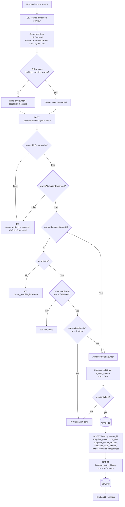
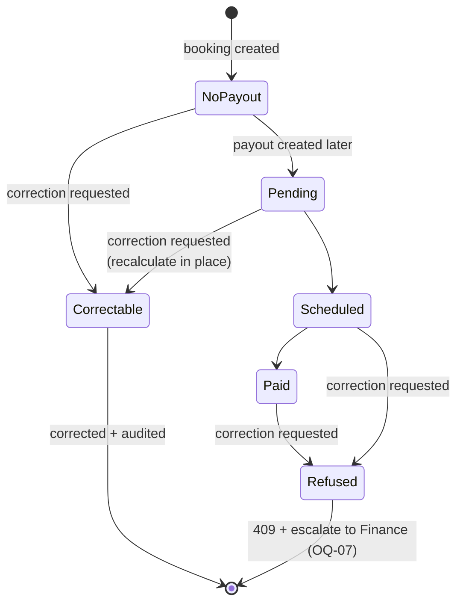

# HB-05 — Owner Accounting, Commission Snapshot & Settlement Adjustments

> [README](README.md) · [Master Plan](00_MASTER_PLAN.md) · Prev: [HB-04](04_TICKET_FINANCIAL_SNAPSHOT_AND_HISTORICAL_PAYMENTS.md) ·
> Depends on: [HB-02](02_TICKET_HISTORICAL_BOOKING_DOMAIN_AND_API.md) · Next: [HB-06](06_TICKET_HISTORICAL_BOOKING_WIZARD_UI.md), [HB-08](08_TICKET_REPORTING_AUDIT_OBSERVABILITY_AND_ROLLOUT.md) ·
> [99 Scenarios](99_RELIABILITY_TEST_SCENARIOS.md)

---

## 1. Ticket metadata

| Field | Value |
|---|---|
| Ticket ID | **HB-05** |
| Title | Owner Accounting, Commission Snapshot & Settlement Adjustments |
| Priority | **P0** |
| Type | Backend domain + its own additive migration (objects #18-#28) + accounting control |
| Status | Ready for review — implementation blocked until [HB-02](02_TICKET_HISTORICAL_BOOKING_DOMAIN_AND_API.md) merges |
| Dependencies | HB-02 (command, endpoint, permission scaffolding); transitively HB-01 (ratified ADRs); schema coordination with HB-04 |
| Dependents | HB-06 (wizard step 5), HB-08 (owner reporting + audit surfacing) |
| Risk level | **CRITICAL** — highest-risk ticket in the pack. Wrong owner attribution moves real money to the wrong party. |
| Estimated complexity | **L** |
| Implemented by | Sole Project Owner. Review lenses: Finance · Security · Operations |
| Target branch | `feat/hb05-owner-accounting-historical` |

> This ticket implements **ADR-08** (hybrid owner model) in full. ADR-08 was ratified as a detailed product
> decision; §11 reproduces all seventeen approved points as concrete, checkable scope. Nothing in §11 is
> optional.

---

## 2. Business context

Every KAZA booking creates an entitlement. A share of the stay revenue belongs to the unit owner; the rest is
KAZA's commission. For a booking recorded through the normal flow, the question *who owned this unit* has a
trivial answer: the unit's owner right now, because the booking is being created now.

A historical booking breaks that equivalence. The stay happened on days 2–5; the record is being written on
day 10. Between those points the unit may have been sold, transferred between family members, moved to a
different management agreement, or had its commission renegotiated. Crediting the wrong party is not a
cosmetic defect — it is a misdirected payment, an incorrect owner statement, and a reconciliation dispute
with an external counterparty.

The repository offers no way to answer the question automatically, and this ticket does not pretend
otherwise. It converts an unanswerable technical question into a governed human decision: default sensibly,
force review, gate the override, snapshot the result, and audit everything.

---

## 3. Problem being solved

Four defects, each independently sufficient to corrupt owner accounting for historical records.

| # | Defect | Evidence | Consequence |
|---|---|---|---|
| P-1 | Owner attribution is derived silently from the unit's *current* owner, with no operator visibility | `CONFIRMED` `BookingService.cs:225` | A historical stay recorded after an ownership change credits the wrong owner, silently |
| P-2 | No ownership-history, contract, or effective-date model exists anywhere in the solution | `CONFIRMED` — see §5.1 | *Owner-at-stay* is not derivable by any query; nothing in the schema records who owned a unit on a past date |
| P-3 | The commercial split is not snapshotted on the booking. `Owner.CommissionRate` is mutable, and the payout row's rate is supplied by the caller, not read from the owner | `CONFIRMED` `Owner.cs:13`; `OwnerPayoutService.cs:57-62,114`; `OwnerPayoutsController.cs:53-62` | The economics of a historical booking can be rewritten months later — or entered wrongly at payout time with nothing to check against |
| P-4 | There is no adjustment, credit-note, reversal or settlement-period entity, and a paid payout cannot be recalculated | `CONFIRMED` `db/migrations/0025_create_owner_payouts.sql:20-29`; `OwnerPayoutService.cs:84-86` | If attribution is later found to be wrong *after* payment, the system has no sanctioned correction path |

---

## 4. User value

| Audience | Value |
|---|---|
| **Finance** | Owner entitlement for a historical booking is explicit, reviewed, snapshotted and reconcilable — not inferred from mutable current state |
| **Owners** | An owner is never silently credited with revenue from a period they did not own the unit, and never silently deprived of revenue they earned |
| **Operations** | The wizard states plainly what the system does and does not know, so the operator can escalate rather than guess |
| **Engineering** | One authoritative attribution (`bookings.owner_id`) with a documented immutability contract, instead of an implicit "recompute from the unit" convention |
| **Security & audit** | Owner selection becomes a privileged, reasoned, attributable act with a complete before/after record |

---

## 5. Current repository behavior

All claims verified by direct read at commit `8dafb5a`.

### 5.1 Owner attribution is a one-time snapshot from the unit

`CONFIRMED`. `RentalPlatform.Business/Services/BookingService.cs:225`:

```csharp
OwnerId = unit.OwnerId, // snapshot from unit, not caller input
```

The comment is load-bearing: the caller cannot supply an owner. `CreateAsync`'s parameter list
(`BookingService.cs:130-143`) has no owner parameter, and neither does `CreateBookingRequest`
(`BookingsController.cs:99-112`). This is a good default and the historical flow preserves it (REQ-07).

`CONFIRMED`. No ownership-history model exists: `RentalPlatform.Data/Entities/Owner.cs` (whole file, 20
lines) carries `Id, Name, Phone, EmergencyPhone, Email, DetailedAddress, CommissionRate, Notes, Status,
PasswordHash, CreatedAt, UpdatedAt, DeletedAt` — no effective-from, no contract, no unit linkage. There is no
`unit_owners`, `ownership_periods` or equivalent table in `db/migrations`. Ownership is a single mutable
foreign key on `units`.

### 5.2 Nothing resynchronizes `Booking.OwnerId` from `Unit.OwnerId` — verified exhaustively

`CONFIRMED`, and this is the single most reassuring finding in the ticket. A repository-wide search for
assignments to a booking's `OwnerId` yields exactly one production write site:

| Site | Nature |
|---|---|
| `BookingService.cs:225` | Creation snapshot — the only place a `Booking.OwnerId` is ever assigned |
| `ReviewService.cs:109` | `OwnerId = booking.OwnerId, // snapshot from booking — not caller input` — reads *from* the booking, reinforcing the pattern |
| `OwnerPayoutService.cs:111` | `OwnerId = booking.OwnerId` — the payout inherits the booking's snapshot |

All other `OwnerId` occurrences are read filters (`BookingService.cs:64`, `OwnerPortalBookingService.cs:36`,
`FinanceSummaryService.cs:99`, `ReviewService.cs:46`, `UnitService.cs:108,148`) or writes to unrelated
entities.

Critically, `UnitService.cs:348` (`unit.OwnerId = ownerId;`) reassigns a unit's owner **without any cascade to
bookings** — the surrounding method (`:328-364`) touches only the `units` row. Existing bookings therefore
retain their historical attribution automatically today.

`INFERRED`: the immutability required by INV-14 is currently an emergent property of the code rather than an
enforced contract. It holds, but nothing prevents a future contributor from adding a resync. This ticket must
convert the property into an explicit, tested guarantee.

### 5.3 The generic update path cannot reach a completed booking at all

`CONFIRMED`. The booking edit endpoint is `PUT /api/internal/bookings/{id}` →
`BookingService.UpdatePendingAsync` (`BookingsController.cs:138-154`; `BookingService.cs:370-447`). Two
independent protections already exist:

1. `BookingService.cs:385-387` rejects any booking whose status is not `Prospecting` or `Relevant` with a
   `ConflictException`. A historical booking is created directly in `Completed` (ADR-04), so it is
   **unreachable** through this path.
2. The applied-updates block (`:431-441`) assigns `CheckInDate`, `CheckOutDate`, `GuestCount`, `Unit`,
   `Source`, `AssignedAdminUserId`, `InternalNotes`, `BaseAmount`, `FinalAmount`, `UpdatedAt` — and **not**
   `OwnerId`. The update path never rewrites owner attribution even for pending bookings.

`CONFIRMED`. `UpdatePendingBookingRequest` (consumed at `BookingsController.cs:141-151`) exposes no owner
field, so there is no mass-assignment surface today.

**Consequence:** ADR-08's "generic update protection" requirement (§11.9) is largely already satisfied by
construction. The work is to *prove* it with tests and to prevent regression, not to build a new guard — with
one exception: `UpdatePendingAsync:439-440` unconditionally reassigns `BaseAmount`/`FinalAmount` from
recomputed pricing (F-07), which is HB-04's problem and must not be allowed to leak into the commission
snapshot.

### 5.4 Commission is neither snapshotted nor read from the owner

`CONFIRMED`, and materially worse than the brief assumed.

- `RentalPlatform.Data/Entities/Owner.cs:13` — `public decimal CommissionRate { get; set; }`. Mutable, with
  no versioning. `OwnerService.cs:145` (`owner.CommissionRate = commissionRate;`) rewrites it in place from
  `PUT` on the owners endpoint (`OwnersController.cs:95`).
- `OwnerPayoutService.CreateOrUpdateFromBookingAsync` (`:57-62`) accepts `decimal commissionRate` as a
  **method parameter**. It does not load the owner and does not read `Owner.CommissionRate` anywhere.
- `OwnerPayoutsController.cs:53-62` — `POST /api/internal/owner-payouts`, policy
  `PermissionKeys.FinancePayouts`, passes `request.CommissionRate` straight through. The rate is therefore
  **operator-typed at payout time**, validated only for range (`OwnerPayoutService.cs:72-73`;
  `OwnerPayoutValidators.cs:13-17`).
- The maths, once a rate is supplied (`OwnerPayoutService.cs:75-77`):

  ```csharp
  var gross = booking.FinalAmount;
  var commissionAmount = Math.Round(gross * commissionRate / 100m, 2, MidpointRounding.AwayFromZero);
  var payoutAmount = gross - commissionAmount;
  ```

**Consequence:** for a historical booking there is currently *nothing* for the payout operator to check the
typed rate against, and `gross` is `booking.FinalAmount`, which F-07 shows is recomputed from live pricing.
The snapshot introduced by this ticket is the missing reference value for both.

### 5.5 Payout structure forbids adjustments outright

`CONFIRMED`. `db/migrations/0025_create_owner_payouts.sql`:

| Line | Constraint | Effect on adjustments |
|---|---|---|
| `:20` | `ck_owner_payouts_status CHECK (payout_status IN ('pending','scheduled','paid','cancelled'))` | No `adjusted` / `reversed` state |
| `:21` | `ck_owner_payouts_gross_non_negative CHECK (gross_booking_amount >= 0)` | No negative reversal row |
| `:23` | `ck_owner_payouts_commission_amount_non_negative` | No negative commission |
| `:24` | `ck_owner_payouts_payout_amount_non_negative CHECK (payout_amount >= 0)` | **A credit note is not representable** |
| `:25` | `ck_owner_payouts_payout_formula CHECK (payout_amount = gross_booking_amount - commission_amount)` | The split is DB-enforced |
| `:29` | `CREATE UNIQUE INDEX ux_owner_payouts_booking_id ON owner_payouts(booking_id)` | **One payout per booking — a second, compensating row is impossible** |

There is no `period_start`, no `period_end`, no statement table, no adjustment entity (F-03). Additionally
`OwnerPayoutService.cs:84-86` refuses to recalculate any payout whose status is not `Pending`.

### 5.6 Owner-facing surfaces key directly on `bookings.owner_id`

`CONFIRMED`. `db/migrations/0049_owner_portal_finance_names.sql:9` —
`b.owner_id AS owner_id` in `owner_portal_finance_overview`, with no booking-status filter and no
historical-booking exclusion. `OwnerPortalBookingService.cs:36` filters `b.OwnerId == ownerId`.
`FinanceSummaryService.cs:99` filters payouts by `op.OwnerId`.

**Consequence:** the moment a historical booking commits, the credited owner sees it in the owner portal —
including an overridden owner. Attribution is immediately externally visible; there is no quiet period in
which to fix a mistake.

### 5.7 There is no tenant or portfolio boundary — closing an HB-01 gap

`CONFIRMED`. This closes the gap "Portfolio/tenant scoping rules for units and owners" recorded as `BLOCKED`
in [HB-01 §5.2](01_TICKET_DISCOVERY_AND_ARCHITECTURE_DECISIONS.md#52-known-gaps-in-this-audit) and assigned
to HB-05.

- `units.is_visible_in_portfolio` (`db/migrations/0056_add_unit_portfolio_visibility.sql:10-14`) is documented
  in the migration itself as *"Controls whether an active unit appears in the public storefront
  portfolio/catalog. Operational eligibility remains governed by is_active."* It is a **storefront catalog
  flag**, not a tenancy boundary.
- `BookingService.cs:141,159` — the `requirePortfolioVisibility` parameter maps to that same flag and exists
  to stop public/guest callers booking a hidden unit. It is not authorization scoping.
- `Owner.cs` has no organisation, tenant, portfolio or region field.

**Consequence — important:** the master plan's "cross-portfolio owner injection" control (INV-12,
[Master §18](00_MASTER_PLAN.md#18-security-and-compliance-review)) cannot mean multi-tenant isolation, because
KAZA Booking is single-tenant. It must be re-specified as **owner-reference validation**: the supplied
`ownerId` must resolve to a real, non-soft-deleted, `active` owner row, and the caller must hold the override
permission. That is the achievable and honest form of the control; §17 specifies it exactly. `SC-OWN-06`
must be rewritten by HB-09 to test owner-reference validation rather than tenancy.

### 5.8 No secure attachment mechanism exists

`CONFIRMED`. The only upload implementation in the solution is
`RentalPlatform.API/Services/Images/UnitImageUploadService.cs` (with `IUnitImageUploadService`,
`UploadUnitImageRequest`, `UnitImagesController`), scoped entirely to unit imagery. `owner_payouts` stores a
`proof_of_payment_url TEXT NULL` (`0025_create_owner_payouts.sql:12`) — a free-text URL to something hosted
elsewhere, not an attachment store.

**Consequence:** per ADR-08 point 3, **document upload is not required in v1**. Override evidence is captured
as a structured reason plus a free-text reference note. Building an attachment store is out of scope.

### 5.9 Permission model

`CONFIRMED`. `RentalPlatform.API/Authorization/PermissionKeys.cs:13-33` defines `area:action` constants;
`:35-59` defines a `PermissionDescriptor` for each (key, module, label, description); `:61-62` exposes `All`.
`db/migrations/0053_create_dynamic_rbac.sql:22` — `permission_key VARCHAR(50) NOT NULL`; `:68-70` seeds role
templates by `INSERT…SELECT`. `RbacPermissionKeys.cs:5` shows the precedent for declaring a key in
`RentalPlatform.Shared` when it is needed outside the API project.

**Consequence:** a new permission is not one constant. It is constant + descriptor + `All` membership + RBAC
seed row + role-template assignment.

### 5.10 HB-01 gap closure summary

| Gap from HB-01 §5.2 | Status after this audit |
|---|---|
| Portfolio/tenant scoping rules for units and owners | **CLOSED** — §5.7. No tenancy exists; control re-specified as owner-reference validation |

---

## 6. Target behavior

1. Historical booking creation resolves a **proposed** owner from `unit.OwnerId`, exactly as today, but never
   applies it silently.
2. The operator is shown a complete attribution and split preview, computed **server-side**, together with an
   explicit statement that the platform holds no ownership history and cannot determine the owner-at-stay.
3. The operator must explicitly confirm the attribution. Absence of confirmation is a `400`, not a default.
4. A different owner may be credited only through the historical command, only with `bookings:override_owner`,
   and only with a structured reason (plus a note when the reason is `other`).
5. If the operator declares that historical ownership cannot be confidently determined, creation is
   **blocked**. No silent default, no partial record, no invented draft state.
6. The final reviewed `OwnerId` is persisted on the booking and is authoritative and immutable thereafter.
7. The commercial split — rate, KAZA amount, owner amount — is snapshotted onto the booking at creation and is
   immune to later `Owner.CommissionRate` edits.
8. Every attribution decision, override and later correction produces a complete, PII-light audit record.
9. Later correction of attribution is possible only through a dedicated high-privilege workflow that refuses
   to touch a settlement that is no longer pending.
10. Normal booking creation is entirely unchanged: owner still snapshotted from the unit, still not caller
    input.

**Planning conclusion, stated explicitly.** v1 does **not** attempt to derive owner-at-stay automatically. It
uses the current unit owner as the default, requires mandatory human review, permits a controlled
high-privilege override, makes booking owner attribution immutable, protects the commission and financial
snapshot, and audits the whole decision. Date-ranged ownership history remains a future dedicated project
(§35 subsection).

---

## 7. In scope

- Mandatory owner-and-commission review as a server-enforced precondition of historical creation.
- The `bookings:override_owner` permission: constant, descriptor, `All` membership, RBAC seed, policy wiring.
- Server-side owner-reference validation and override authorization.
- Structured override reason enum + note, persisted and audited.
- The block-on-uncertain-ownership path.
- Commission and split snapshot columns on `bookings`, in **HB-05's own migration, ordered after** HB-04's
  protected pricing columns.
- Server-side split computation and reconciliation invariants; DB CHECK constraints.
- An owner-attribution preview endpoint that HB-06 consumes (so the frontend never computes money).
- Explicit immutability guarantees and regression tests for `bookings.owner_id` and the snapshot.
- The dedicated owner-attribution correction workflow, including its refusal behaviour on non-pending
  payouts.
- Audit events and metrics for attribution, override and correction.
- Documentation of the settlement-impact model and its v1 limits.

## 8. Out of scope

| Excluded | Why |
|---|---|
| Date-ranged ownership / contract history tables | Deferred epic — §35 subsection. Explicitly must not block v1 |
| Any backfill or recomputation of existing bookings' owner or commission | INV-14; existing rows keep their current semantics |
| Adjustment, credit-note, reversal or negative payout entities | Structurally forbidden today (§5.5); `BLOCKED` → [OQ-07](00_MASTER_PLAN.md#32-open-questions) |
| Settlement-period / statement modelling | No such model exists (F-03); introducing one is a separate epic |
| Correcting an already-**paid** payout | `BLOCKED` → OQ-07; manual finance process in v1 |
| Changing how `POST /api/internal/owner-payouts` sources its commission rate | Behaviour change to an existing finance endpoint; out of this feature's blast radius |
| Owner-attribution editing in the normal booking edit screen | ADR-08 point 10 forbids it |
| Multi-currency owner accounting | `BLOCKED` → [OQ-05](00_MASTER_PLAN.md#32-open-questions) |
| Fee/tax decomposition of the split | `BLOCKED` → [OQ-06](00_MASTER_PLAN.md#32-open-questions); v1 splits the agreed total |
| Evidence document upload | No secure attachment mechanism exists (§5.8) |
| The wizard UI itself | Owned by [HB-06](06_TICKET_HISTORICAL_BOOKING_WIZARD_UI.md); this ticket supplies the contract |

---

## 9. Assumptions

| # | Assumption | Label | If false |
|---|---|---|---|
| A-1 | KAZA is single-currency; the split needs no currency column | `INFERRED` (OQ-05) | Snapshot columns need a currency; reconciliation invariants change |
| A-2 | The agreed total is the correct commission base — no fees or taxes are excluded from it | `INFERRED` (OQ-06) | The base becomes a distinct value and the reconciliation invariant is rewritten |
| A-3 | Commission is a straight percentage of the booking total, as `OwnerPayoutService.cs:76` implements | `CONFIRMED` for the payout path | Tiered/flat/per-night models need a `basis` discriminator |
| A-4 | A historical booking's payout will be created later through the existing `POST /api/internal/owner-payouts`, not automatically at booking creation | `CONFIRMED` — no automatic payout creation exists (F-03) | If auto-creation is added, it must consume the snapshot, not a typed rate |
| A-5 | Rounding stays `Math.Round(..., 2, MidpointRounding.AwayFromZero)` to match `OwnerPayoutService.cs:76` | `CONFIRMED` | Snapshot and payout will disagree by cents; reconciliation tests fail |
| A-6 | Owner `Status` values are `active` / `inactive` only | `CONFIRMED` `db/migrations/0006_create_owners.sql:57` | Validation allow-list changes |
| A-7 | HB-04's protected-pricing migration and this ticket's snapshot columns ship as one migration file | `PROPOSED` — requires coordination | Two migrations racing on `bookings`; sequence and verify scripts must be reworked |
| A-8 | Ownership uncertainty is rare enough that blocking creation is operationally acceptable | `INFERRED` | Ops needs an escalation queue; revisit D-HB05-04 |

---

## 10. Decision-required items

Ticket-local identifiers. All must be resolved before the DoR in §31 is met.

Decision authority for every row is the **Sole Project Owner** (2026-07-29). The **Review lens** column
names the perspectives applied — it is not a list of separate approvers.

| ID | Decision | Reason it is open | Impact if unresolved | Recommended default | Review lens | Blocks? |
|---|---|---|---|---|---|---|
| D-HB05-01 | Is `bookings:override_owner` a distinct permission, or is `finance:payouts` sufficient? | F-14 gives naming convention but not policy | Either an over-broad grant or an unnecessary permission | **Distinct permission.** Override is an attribution act, not a payout act; conflating them grants override to every payout operator | Security · Finance | **Yes** |
| D-HB05-02 | Which role templates receive `bookings:override_owner`? | RBAC seeding needs a target (`0053:68-70`) | Migration cannot be written | Grant to no template initially; issue per-user grants via `rbac_admin_user_permission_overrides` | Security | **Yes** |
| D-HB05-03 | Exact override reason allow-list | Values must be CHECK-constrained | Schema cannot be finalised | `ownership_changed_after_stay`, `booking_belonged_to_previous_owner_agreement`, `accounting_reconciliation`, `other` (note mandatory) | Product · Finance | **Yes** |
| D-HB05-04 | What happens operationally when ownership is uncertain and creation is blocked? | No draft/queue mechanism exists and inventing one is forbidden | Operators hit a dead end with no next step | Block with an actionable error naming the escalation path; record a rejection metric; resolve ownership offline, then re-enter | Operations · Product | No |
| D-HB05-05 | Does the correction workflow need its own permission (`bookings:correct_owner_attribution`) or does it reuse `bookings:override_owner` + `finance:payouts`? | ADR-08 point 10 says "dedicated high-privilege permission" without naming it | Correction endpoint cannot be gated | Reuse `bookings:override_owner`, and additionally require `finance:payouts` when a payout row exists | Security · Finance | No |
| D-HB05-06 | Is a `snapshot_calculated_at` column required, given point 7 asks for a calculation timestamp? | Would extend [Master §11](00_MASTER_PLAN.md#11-proposed-data-model) | Schema scope ambiguity | **No new column.** The snapshot is written exactly once, inside the creation transaction, so `bookings.created_at` *is* the calculation timestamp. The calculation source is recorded in the audit event | Engineering · Finance | No |
| D-HB05-07 | May a historical booking credit an owner whose `Status = 'inactive'`? | ADR-12 allows inactive *units*; owners are not addressed | Validation rule undefined | **Allow with a warning.** An owner deactivated after the stay is exactly the case override exists for. Soft-deleted (`DeletedAt != null`) owners are rejected | Finance | No |
| D-HB05-08 | Does correction of `snapshot_commission_rate` alone (without changing owner) go through the same workflow? | ADR-08 point 10 mentions "OwnerId or the split" | Rate-only typos have no path | **Yes, same endpoint,** same permission, same audit, same payout-state refusal | Finance | No |

---

## 11. Architecture and technical design

The seventeen ratified ADR-08 points, each as implementable scope.

### 11.1 Default behaviour — resolve, then force review

`PROPOSED`. `HistoricalBookingService` resolves `proposedOwnerId = unit.OwnerId`, preserving
`BookingService.cs:225`. Unlike normal creation it must not apply this silently. The command therefore carries
an explicit **owner review block** and the service rejects the request if review was not completed.

The review payload the server must produce (and the wizard must display — HB-06 owns the rendering):

| Field | Source |
|---|---|
| Selected unit (id + name) | `units` |
| Proposed owner id | `unit.OwnerId` |
| Owner display name | `Owner.Name` |
| Proposed commission rate | `Owner.CommissionRate` (`Owner.cs:13`) |
| Proposed owner amount | Server-computed, §11.8 |
| Proposed KAZA amount | Server-computed, §11.8 |
| Stay dates | Command input |
| **Ownership-history warning** | Static, always shown — see §11.12 |

Review is expressed on the wire as `ownerAttributionConfirmed: true`. Absent or `false` ⇒ `400`
`owner_attribution_required`. `INFERRED`: a boolean flag is normally weak evidence of consent, but here the
server has no alternative signal, and the flag is not an *authorization* decision — it is an
acknowledgement recorded in the audit trail alongside the authenticated actor.

### 11.2 Authorized owner override — command-scoped and permission-gated

`PROPOSED`.

| Rule | Enforcement |
|---|---|
| Override exists only on `POST /api/internal/bookings/historical` | Dedicated command DTO; no other DTO gains an owner field |
| Override requires `bookings:override_owner` | Policy check inside the service, not only on the controller, so no future controller can forget it |
| `OwnerId` is **never** added to `CreateBookingRequest` or `UpdatePendingBookingRequest` | Preserves `BookingService.cs:225` for every other path |
| `BookingService.CreateAsync` gains **no** owner parameter | The historical service sets `booking.OwnerId` on the returned entity inside the same transaction, or `CreateAsync` gains an *internal* overload not exposed via any DTO — see §13 |
| No frontend flag, no mass assignment, no client-controlled owner object | The request carries at most a bare `ownerId` GUID plus reason fields; everything else is server-resolved |

`DECISION REQUIRED` D-HB05-01 governs the permission name; the design does not otherwise change.

### 11.3 Required override information

`PROPOSED`. When `requestedOwnerId != unit.OwnerId`, all of the following are mandatory:

| Item | Persisted where |
|---|---|
| Override reason (enum, D-HB05-03) | `bookings.owner_override_reason` |
| Evidence / reference note | `bookings.owner_override_note` — **required when reason is `other`**, optional but encouraged otherwise |
| Authenticated actor | Audit event + `booking_status_history.ChangedByAdminUserId` |
| Current unit owner at recording time | Audit event (before-value) |
| Selected historical owner | `bookings.owner_id` + audit event (after-value) |
| Stay dates | Booking columns + audit event |
| Before/after attribution | Audit event |
| Explicit confirmation | `ownerAttributionConfirmed` + audit event |

Reason allow-list (recommended default, D-HB05-03):
`ownership_changed_after_stay` · `booking_belonged_to_previous_owner_agreement` ·
`accounting_reconciliation` · `other`.

**No document upload in v1.** `CONFIRMED` §5.8: the audit found no secure attachment or document-management
mechanism in the solution — only unit-image upload. Requiring evidence documents would mean building one.

### 11.4 Server-side validation of the selected owner

`PROPOSED`. Executed in this order, before the transaction commits:

1. `ownerId` resolves to a row in `owners` with `DeletedAt IS NULL` — else `404 not_found`.
2. Owner `Status` is `active`, or `inactive` with the D-HB05-07 warning surfaced — soft-deleted always
   rejected.
3. **Accessibility check**: per §5.7 there is no tenant boundary, so this reduces to "the owner is a real,
   resolvable owner record". Documented as such rather than pretending a scope exists.
4. Owner is permitted to receive revenue for this unit context: `PROPOSED` — v1 requires either
   `ownerId == unit.OwnerId`, or a valid override with permission and reason. There is no other legitimate
   way for an owner to be attached to a unit, because ownership is a single FK.
5. Caller holds `bookings:override_owner` when `ownerId != unit.OwnerId` — else `403 owner_override_forbidden`.
6. Override reason supplied and in the allow-list — else `400 validation_error`.
7. Commission rate and split pass §11.8's invariants — else `400 validation_error`.
8. **An owner is never accepted merely because the caller supplied a GUID.** Every branch above must pass;
   the GUID is an input to validation, never a conclusion.

### 11.5 Uncertain ownership blocks creation

`PROPOSED`, implements INV-17. The command carries `ownershipDeterminable: boolean`. When `false`:

- The current owner is **not** used.
- No booking, payment, status-history or accounting row is written.
- The request is rejected with `400 owner_attribution_required` and a message naming the escalation path
  (D-HB05-04).
- A rejection metric is emitted so the frequency of the situation is measurable.

**No draft workflow is invented.** `CONFIRMED`: the audit found no draft/pending-approval booking mechanism —
the closest analogue, `date_block_approvals` (`db/migrations/0055_date_block_approvals.sql`), is specific to
owner date-block requests and is not a general approval framework. Building one is out of scope.

### 11.6 Owner snapshot — authoritative and immutable

`PROPOSED`, implements INV-14. `bookings.owner_id` remains the single authoritative attribution.

| Rule | Mechanism |
|---|---|
| Default from unit | `unit.OwnerId` (§11.1) |
| Controlled override permitted | §11.2 |
| Final reviewed value persisted | Written once, inside the creation transaction |
| Never recalculated from the unit on later edits | Verified: no such code path exists (§5.2); locked in by regression tests |
| Never changes when the unit's owner later changes | Verified: `UnitService.cs:348` has no cascade (§5.2); locked in by `SC-OWN-09` |

**Audit of every path that might resynchronize** (required by ADR-08 point 6) — completed in §5.2 and
summarised:

| Candidate path | Verdict |
|---|---|
| `BookingService.CreateAsync:225` | Intended snapshot. Unchanged for normal flow |
| `BookingService.UpdatePendingAsync:431-441` | Does not touch `OwnerId`; also unreachable for `Completed` (`:385-387`) |
| `UnitService.UpdateAsync:348` | Reassigns `unit.OwnerId` only; no booking cascade |
| `BookingLifecycleService.TransitionAsync` | Status only; historical bookings never call it (F-04, ADR-04) |
| `OwnerPayoutService:111` | Reads `booking.OwnerId`; never writes it |
| `ReviewService:109` | Reads `booking.OwnerId`; never writes it |
| Any SQL migration | None writes `bookings.owner_id` |

### 11.7 Commission snapshot

`PROPOSED`, implements REQ-08 / INV-14. The repository's current position (§5.4) is that commission is read
from a mutable owner field *by humans*, and frozen only when a payout row is created
(`OwnerPayoutService.cs:114`). That is insufficient for historical truth.

Snapshot written at booking creation:

| Column | Type | Meaning |
|---|---|---|
| `snapshot_commission_rate` | `DECIMAL(5,2)` | The rate applied, matching `owners.commission_rate` precision (`OwnerConfiguration.cs:21`) |
| `snapshot_kaza_amount` | `DECIMAL(12,2)` | KAZA's share — the commission amount |
| `snapshot_owner_amount` | `DECIMAL(12,2)` | The owner's share — the payout basis |
| Currency | — | `BLOCKED` → OQ-05; single currency assumed (A-1) |
| Calculation timestamp | — | `bookings.created_at` (D-HB05-06); no new column |
| Calculation source | — | Audit event field, not a column (D-HB05-06) |

`snapshot_commission_rate` **defaults** from `Owner.CommissionRate` at creation time and is displayed for
review. Whether the operator may edit it in the wizard is governed by D-HB05-08's sibling question and
defaults to **yes, within 0–100, with the value recorded in the audit event** — because a historical booking
may legitimately have been agreed under a different rate.

**Coordination with HB-04 (ADR-08 point 7, mandatory).** `agreed_amount` is HB-04's column and is the single
source of truth for the gross. This ticket must not introduce a competing gross:

- `snapshot_kaza_amount` and `snapshot_owner_amount` are **derived from `agreed_amount`**, never from
  `FinalAmount`, `BaseAmount`, or a separately supplied total.
- Both tickets contribute columns to **one** migration file (A-7). Whichever ticket merges second must
  extend the other's migration rather than adding a second one.
- HB-04's repricing guard must also guard the snapshot: if `agreed_amount` is protected but the split is
  recomputed, the invariant breaks silently.

### 11.8 Financial relationship and server-side invariants

`PROPOSED`. Computation, mirroring `OwnerPayoutService.cs:75-77` exactly so that the later payout row
reconciles to the cent:

```
gross              = bookings.agreed_amount                       -- HB-04
kazaAmount         = Round(gross * snapshotCommissionRate / 100, 2, AwayFromZero)
ownerAmount        = gross - kazaAmount
```

Server-side invariants, all enforced in the service **and** as DB CHECK constraints:

| ID | Invariant | Layer |
|---|---|---|
| OI-1 | `snapshot_owner_amount >= 0` | Service + CHECK |
| OI-2 | `snapshot_kaza_amount >= 0` | Service + CHECK |
| OI-3 | `snapshot_owner_amount + snapshot_kaza_amount = agreed_amount` | Service + CHECK |
| OI-4 | `0 <= snapshot_commission_rate <= 100` | Service + CHECK (mirrors `ck_owners_commission_rate`, `0006_create_owners.sql:56`) |
| OI-5 | When `is_historical = true`, all four of `agreed_amount`, `snapshot_commission_rate`, `snapshot_owner_amount`, `snapshot_kaza_amount` are NOT NULL | CHECK |
| OI-6 | Rounding is `MidpointRounding.AwayFromZero` to 2dp — identical to `OwnerPayoutService.cs:76` | Service + unit test |
| OI-7 | The split is recomputed server-side from `gross` and `rate`; any client-supplied `ownerAmount`/`kazaAmount` is **ignored, not validated** | Service |
| OI-8 | Only a caller with `bookings:override_owner` may alter the rate away from `Owner.CommissionRate` | Service |

Fees and taxes: `BLOCKED` → OQ-06. v1 folds them into `agreed_amount`, which is why OI-3 is an exact equality
rather than an inequality. If OQ-06 resolves to explicit fee/tax columns, OI-3 becomes
`owner + kaza + fees + taxes = agreed_amount` and this ticket's CHECK must be revised.

**Never rely on frontend calculation.** The wizard displays what the preview endpoint (§14) returns.

### 11.9 Generic update protection

`PROPOSED`. Largely satisfied already (§5.3); the work is to prove and lock it.

| Requirement | Status | Action |
|---|---|---|
| Editing notes/client/non-financial metadata preserves `OwnerId` | `CONFIRMED` already true (`:431-441`) | Regression test `SC-OWN-10` |
| Generic update must not replace `OwnerId` with `unit.OwnerId` | `CONFIRMED` no such code | Regression test + a code-review checklist note |
| Generic update must not recalculate commission from the current `Owner` | `CONFIRMED` no such code | Regression test `SC-OWN-11` |
| Historical bookings must not be editable through `UpdatePendingAsync` | `CONFIRMED` blocked by `:385-387` | Explicit test asserting `409` on a historical booking |
| Later attribution change requires a dedicated workflow, permission, reason and audit | `PROPOSED` | §11.10 |

`INFERRED` risk to mitigate: HB-04 will modify `UpdatePendingAsync` to stop recomputing amounts. That edit is
in the exact code block that currently, safely, omits `OwnerId`. HB-04's PR must not add an owner or
commission assignment there. Record this as a cross-ticket review gate.

### 11.10 Historical owner correction workflow

`PROPOSED`. A dedicated command, deliberately **not** part of the booking edit screen.

| Aspect | Design |
|---|---|
| Endpoint | `POST /api/internal/bookings/{id}/owner-attribution` (`PROPOSED`) |
| Permission | `bookings:override_owner`; **plus** `finance:payouts` when a payout row exists (D-HB05-05) |
| Applies to | Historical bookings (`is_historical = true`). Extension to normal bookings is `DECISION REQUIRED`; recommended default is historical-only in v1 |
| Mandatory inputs | New `ownerId` and/or new `snapshot_commission_rate`; correction reason; note; explicit confirmation |
| Before/after | Both persisted in the audit event; the previous values are never overwritten in the audit record |
| Recalculation | The split is recomputed from the unchanged `agreed_amount` and the new rate, under the same OI-1…OI-8 invariants |
| Settlement rules | §11.11 — refuse when the payout is not `Pending` |
| Adjustment vs rewrite | An `owner_payouts` row in `Pending` is recalculated in place (the existing, sanctioned behaviour at `OwnerPayoutService.cs:88-99`); anything else is refused, never silently rewritten |
| Not in the normal edit screen | ADR-08 point 10; HB-06 must not render owner controls in the standard booking editor |

### 11.11 Closed settlement behaviour — the important nuance

`CONFIRMED` structural facts (§5.5) substantially reduce v1 risk, and the distinction must be stated
precisely because it is easy to get wrong.

**Creating a new historical booking cannot affect any existing settlement.** `owner_payouts` has one row per
booking, enforced by `ux_owner_payouts_booking_id` (`0025:29`), and there is no period or statement grouping
(F-03). A new booking therefore gets its **own** payout row, created later and independently through
`POST /api/internal/owner-payouts`. There is no statement to reopen, no period total to restate, and no paid
row to mutate. The "closed settlement" problem **does not arise on the creation path at all**.

**The problem arises only when correcting an existing booking whose payout has already been paid.** In that
case:

| Attempted action | Repository reality | v1 behaviour |
|---|---|---|
| Recalculate a `Pending` payout | Supported — `OwnerPayoutService.cs:88-99` | Allowed; recalculated in place with audit |
| Recalculate a `Scheduled`, `Paid` or `Cancelled` payout | Refused — `OwnerPayoutService.cs:84-86` throws `ConflictException` | Correction endpoint refuses **before** attempting, with a clear message |
| Post a compensating negative payout | Impossible — `ck_owner_payouts_payout_amount_non_negative` (`0025:24`) and `ux_owner_payouts_booking_id` (`0025:29`) | Not attempted |
| Create an adjustment / credit note | No such entity exists (F-03) | `BLOCKED` → OQ-07; escalate to a manual finance process |

**Wizard consequence display (before confirmation).** Because there is no period model, "settlement-period
impact" in v1 means payout state, and the preview endpoint returns it:

| Payout state for this booking | Message shown |
|---|---|
| None (creation) | "A new pending payout will be available for this owner. No existing settlement is affected." |
| `pending` (correction) | "The pending payout for this booking will be recalculated." |
| `scheduled` / `paid` | **Warning + block** — "This booking's payout is already `{status}`. Attribution cannot be corrected here; escalate to Finance." |
| `cancelled` | Warning; correction allowed, payout untouched |

Requiring "the relevant accounting permission" is satisfied by the `finance:payouts` requirement in
D-HB05-05.

### 11.12 UI requirements (contract for HB-06)

`PROPOSED`. A dedicated dynamic wizard step, **"Owner and accounting"** (Arabic: `المالك والحسابات`),
implemented by [HB-06](06_TICKET_HISTORICAL_BOOKING_WIZARD_UI.md) against the preview endpoint in §14.

Required display fields: current unit owner · proposed credited owner · whether an override is applied ·
commission rate/snapshot · KAZA share · owner share · settlement-period impact (per §11.11) · warning when the
original period is closed · a mandatory confirmation control.

Suggested warning text (always shown, not conditional):

> "The system has no historical ownership records. Confirm that this owner was entitled to this booking
> revenue during the selected stay."

Behaviour when the caller lacks `bookings:override_owner`:

| Requirement | Implementation note |
|---|---|
| Show the current owner **read-only** | Preview endpoint returns `canOverrideOwner: false` |
| Allow confirmation | Confirmation is not the override; it is still required |
| Provide a clear escalation message | "Crediting a different owner requires the owner-override permission. Contact Finance." |
| Browser manipulation cannot enable editing | The server re-checks the permission on `POST`; a forged `ownerId` yields `403 owner_override_forbidden`. Client-side disabling is a convenience, never the control |

`CONFIRMED` [Master §17](00_MASTER_PLAN.md#17-uiux-flow): the operator portal is English-only with no i18n
system. The Arabic step name is documented for product parity; shipping Arabic copy into `/admin` is
[OQ-08](00_MASTER_PLAN.md#32-open-questions).

### 11.13 Audit event

`PROPOSED`. Two events, aligned with
[Master §23](00_MASTER_PLAN.md#23-observability).

`booking.historical.recorded` gains the owner block; `booking.historical.owner_override` is emitted
additionally when an override was applied; `booking.historical.owner_corrected` is emitted by §11.10.

| Field | Present | Notes |
|---|---|---|
| Booking id | always | |
| Unit id | always | |
| Current unit owner **at recording time** | always | The before-value, even when no override was used |
| Final booking owner | always | The after-value |
| Override used (yes/no) | always | |
| Override reason | when override used | Enum value, not free text |
| Override note | when override used | `INFERRED` may contain operator free text — treat as low-sensitivity but do not log verbatim to metrics |
| Actor (admin user id) | always | From the authenticated principal only (INV-11) |
| Recorded timestamp | always | `DateTime.UtcNow` (INV-01) |
| Stay dates | always | |
| Commission snapshot (rate) | always | |
| Owner amount | always | |
| KAZA amount | always | |
| Guest name / phone / email | **never** | No unnecessary PII (Master §18) |

`DECISION REQUIRED` folded into HB-02: whether these events are rows in `booking_status_history` (the only
append-only audit surface that exists — `BookingHistoryEvents.cs` has just two constants, `BookingCreated` and
`AutomaticCompletion`) or structured logs. Recommended default: **one** truthful `booking_status_history` row
at creation per ADR-04, carrying the owner summary in `Notes` via a new `BookingHistoryEvents` constant, plus
structured logs for the machine-readable detail. A correction writes an additional history row — a correction
is a real event and deserves one.

### 11.14 Migration planning

`PROPOSED`. See §15 for the full column list.

- `bookings.owner_id` needs **no** new column — it already exists and already carries the snapshot (F-13).
- The commission/financial snapshot columns are the minimum addition, and they belong in the **same
  own additive migration, ordered after** HB-04's protected pricing columns (A-7, §11.7).
- **No ownership-history table is added in this feature.** §35 subsection.
- **Existing bookings must not be recomputed.** New columns are nullable; the OI-5 completeness CHECK is
  scoped to `is_historical = true` so historical rows are complete and legacy rows are untouched.
- Follow `db/migrations` conventions (`CONFIRMED`): sequential `NNNN_name.sql` plus `_verify.sql` and
  `_rollback.sql`; latest observed number is `0057_add_owner_contact_fields.sql`, so the next free number is
  `0058` — to be confirmed at implementation time.

### 11.15 Future architecture epic

Recorded in §35's anchored subsection. **Non-blocking.**

### 11.16 Coverage confirmation

| ADR-08 requirement | Section |
|---|---|
| Mandatory owner review | §11.1 |
| Privileged override | §11.2, §11.3 |
| Attribution validation | §11.4 |
| Commission snapshot | §11.7 |
| Generic-update protection | §11.9 |
| Closed settlement impact | §11.11 |
| Correction workflow | §11.10 |
| Audit | §11.13 |
| Permissions | §11.2, §5.9, §16 |

### 11.17 Reliability scenarios owned by this ticket

`SC-OWN-01` … `SC-OWN-17`, specified in
[99_RELIABILITY_TEST_SCENARIOS.md](99_RELIABILITY_TEST_SCENARIOS.md):

| ID | Scenario |
|---|---|
| SC-OWN-01 | Current owner confirmed without override |
| SC-OWN-02 | Unit owner changed after the stay |
| SC-OWN-03 | Authorized user selects the previous owner |
| SC-OWN-04 | Unauthorized override attempt |
| SC-OWN-05 | Direct API `ownerId` injection |
| SC-OWN-06 | Unresolvable / soft-deleted owner injection (re-specified per §5.7) |
| SC-OWN-07 | Missing override reason |
| SC-OWN-08 | Uncertain ownership blocks creation |
| SC-OWN-09 | Historical booking retains `OwnerId` after the unit owner later changes |
| SC-OWN-10 | Unrelated edit preserves `OwnerId` |
| SC-OWN-11 | Unrelated edit preserves the commission snapshot |
| SC-OWN-12 | `Owner.CommissionRate` changes after creation |
| SC-OWN-13 | Historical owner and KAZA shares unchanged |
| SC-OWN-14 | Closed statement requires adjustment |
| SC-OWN-15 | Owner correction produces full audit |
| SC-OWN-16 | Correction cannot silently mutate a paid settlement |
| SC-OWN-17 | Normal bookings continue snapshotting owner from unit, without caller override |

---

## 12. Expected data flow



Correction path:



---

## 13. Expected files/components likely to change

`PROPOSED` — not asserted as required until the implementer confirms. Paths are indicative; HB-02 creates
several of these first.

| Path | Likely change |
|---|---|
| `RentalPlatform.Business/Services/HistoricalBookingService.cs` *(new, HB-02)* | Owner resolution, review enforcement, override authorization, split computation |
| `RentalPlatform.Business/Services/OwnerAttributionService.cs` *(new)* | Validation + split maths, reused by preview, creation and correction |
| `RentalPlatform.Business/Services/BookingService.cs` | Possibly an internal owner-aware creation overload; **no** public DTO change. `:225` behaviour preserved for all existing callers |
| `RentalPlatform.Business/Services/OwnerPayoutService.cs` | Read-only alignment: consider defaulting the payout's `commissionRate` from the booking snapshot. `DECISION REQUIRED` — out of scope per §8, listed only so the implementer does not "helpfully" change it |
| `RentalPlatform.API/Controllers/HistoricalBookingsController.cs` *(new, HB-02)* | Owner preview endpoint + correction endpoint |
| `RentalPlatform.API/Authorization/PermissionKeys.cs` | `BookingsOverrideOwner` constant, descriptor (`:35-59`), `All` membership (`:61-62`) |
| `RentalPlatform.API/Program.cs` | Policy registration for the new permission, following the existing pattern |
| `RentalPlatform.API/Validators/` | Historical owner-block validator; correction request validator |
| `RentalPlatform.API/DTOs/Requests/` | Owner review block on the historical command; correction request |
| `RentalPlatform.API/DTOs/Responses/` | Owner attribution preview response |
| `RentalPlatform.Data/Entities/Booking.cs` | Snapshot properties |
| `RentalPlatform.Data/Configurations/BookingConfiguration.cs` | Column mappings, precisions `decimal(12,2)` / `decimal(5,2)` |
| `RentalPlatform.Shared/Constants/BookingHistoryEvents.cs` | New audit-note constants |
| `db/migrations/0058_*.sql` + `_verify.sql` + `_rollback.sql` | **Coordinated with HB-04** — one file, not two |
| `RentalPlatform.Tests/` | Owner attribution, override, snapshot immutability, correction, rounding |
| `rental-platform/components/admin/bookings/historical/` *(HB-06)* | Owner & accounting step — consumes, does not compute |

---

## 14. API changes

All routes `PROPOSED`. `CONFIRMED` route-prefix note: `BookingsController.cs:21` is
`[Route("api/internal/bookings")]`, so the concrete path for the historical command is
`POST /api/internal/bookings/historical`, while [Master §12](00_MASTER_PLAN.md#12-api-and-command-design)
registers it as `POST /api/internal/bookings/historical`. HB-02 owns reconciling the two; this ticket uses the
`api/internal` form for the endpoints it introduces.

### 14.1 Owner attribution preview (new)

```
GET /api/internal/bookings/historical/owner-preview
    ?unitId={guid}&checkInDate={date}&checkOutDate={date}
    &agreedAmount={decimal}[&ownerId={guid}][&commissionRate={decimal}]
Policy: bookings:record_historical
```

Response (indicative shape):

```jsonc
{
  "unitId": "…", "unitName": "…",
  "unitCurrentOwnerId": "…", "unitCurrentOwnerName": "…",
  "proposedOwnerId": "…", "proposedOwnerName": "…", "proposedOwnerStatus": "active",
  "overrideApplied": false,
  "canOverrideOwner": false,
  "commissionRate": 15.00,
  "kazaAmount": 1500.00,
  "ownerAmount": 8500.00,
  "agreedAmount": 10000.00,
  "settlementImpact": { "existingPayoutStatus": null, "message": "…", "blocksCorrection": false },
  "ownershipHistoryWarning": "The system has no historical ownership records. …"
}
```

The endpoint is the **only** source of the split. It performs no writes.

### 14.2 Historical creation — owner block (extends HB-02's command)

| Field | Type | Required | Notes |
|---|---|---|---|
| `ownerAttributionConfirmed` | `bool` | yes | `false`/absent ⇒ `400 owner_attribution_required` |
| `ownershipDeterminable` | `bool` | yes | `false` ⇒ `400 owner_attribution_required` (§11.5) |
| `ownerId` | `guid?` | no | Omit to accept the unit owner. Non-matching value requires the override permission |
| `commissionRate` | `decimal?` | no | Defaults to `Owner.CommissionRate`; 0–100 |
| `ownerOverrideReason` | `string?` | conditional | Required when `ownerId != unit.OwnerId` |
| `ownerOverrideNote` | `string?` | conditional | Required when reason is `other` |
| `ownerAmount` / `kazaAmount` | — | **not accepted** | Server-computed; any supplied value is ignored (OI-7) |

### 14.3 Owner attribution correction (new)

```
POST /api/internal/bookings/{id}/owner-attribution
Policy: bookings:override_owner  (+ finance:payouts when a payout row exists — D-HB05-05)
Body: { ownerId?, commissionRate?, correctionReason, correctionNote, confirmed }
```

### 14.4 Error contract additions

| Condition | Status | Code | Origin |
|---|---|---|---|
| Attribution not confirmed, or ownership declared undeterminable | 400 | `owner_attribution_required` | Master §12 |
| Override attempted without permission | 403 | `owner_override_forbidden` | Master §12 |
| Owner id does not resolve / soft-deleted | 404 | `not_found` | Master §12 |
| Reason missing or not in allow-list; split invariant violated | 400 | `validation_error` | Master §12 |
| Correction attempted while the payout is `scheduled`/`paid` | 409 | `owner_correction_settlement_locked` | **New in this ticket** — `DECISION REQUIRED`, must be registered back into Master §12 |

### 14.5 Unchanged

`POST /api/internal/bookings`, `POST /api/internal/bookings/quick` and `PUT /api/internal/bookings/{id}` gain
**no** owner field and no behavioural change (SC-OWN-17).

---

## 15. Data/schema changes

`PROPOSED`, consistent with [Master §11](00_MASTER_PLAN.md#11-proposed-data-model). Ownership is fixed by
the [migration-ownership matrix](00_MASTER_PLAN.md#111-migration-ownership-matrix).

**HB-05 authors its own migration** — objects #18 … #28 in that matrix. It is **not** a coordinated
migration shared with HB-04; that phrasing has been retired from this pack because it produced duplicate
ownership claims. HB-05's migration is simply **ordered after** HB-04's, because two of its constraints read
`agreed_amount`.

| Column | Type | Null | Default | Relationship |
|---|---|---|---|---|
| `bookings.snapshot_commission_rate` | `DECIMAL(5,2)` | yes | — | **Created here** (#18) |
| `bookings.snapshot_owner_amount` | `DECIMAL(12,2)` | yes | — | **Created here** (#19) |
| `bookings.snapshot_kaza_amount` | `DECIMAL(12,2)` | yes | — | **Created here** (#20) |
| `bookings.owner_override_reason` | `VARCHAR(50)` | yes | — | **Created here** (#21) |
| `bookings.owner_override_note` | `TEXT` | yes | — | **Created here** (#22) |
| `bookings.agreed_amount` | `DECIMAL(12,2)` | yes | — | **Dependency** — created by HB-04 (#14). Read only |
| `bookings.is_historical` | `BOOLEAN NOT NULL` | no | `false` | **Dependency** — created by HB-02 (#1). Read only |
| `bookings.owner_id` | — | — | — | **Already exists.** No change |

Constraints (`PROPOSED`, added `NOT VALID` then validated per [Master §21](00_MASTER_PLAN.md#21-migration-strategy)):

| Name | Rule |
|---|---|
| `ck_bookings_snapshot_commission_rate_range` | `snapshot_commission_rate IS NULL OR (snapshot_commission_rate >= 0 AND snapshot_commission_rate <= 100)` |
| `ck_bookings_snapshot_amounts_non_negative` | `snapshot_owner_amount IS NULL OR snapshot_owner_amount >= 0` and likewise for `snapshot_kaza_amount` |
| `ck_bookings_snapshot_split_reconciles` | when all three of `agreed_amount`, `snapshot_owner_amount`, `snapshot_kaza_amount` are present: `snapshot_owner_amount + snapshot_kaza_amount = agreed_amount` (OI-3) |
| `ck_bookings_historical_snapshot_complete` | `NOT is_historical OR (agreed_amount IS NOT NULL AND snapshot_commission_rate IS NOT NULL AND snapshot_owner_amount IS NOT NULL AND snapshot_kaza_amount IS NOT NULL)` (OI-5) |
| `ck_bookings_owner_override_reason` | reason `IS NULL` or in the D-HB05-03 allow-list |
| `ck_bookings_owner_override_note_required` | `owner_override_reason <> 'other' OR owner_override_note IS NOT NULL` |

Indexes: none required. Owner queries already use `ix_bookings_owner_id`.

**No new table.** No ownership history. No adjustment entity. No backfill of existing rows.

`_verify.sql` must assert: columns exist with the stated types; every constraint is `VALID`; no existing row
violates any constraint; and `SELECT count(*) FROM bookings WHERE snapshot_owner_amount IS NOT NULL` is `0`
immediately post-migration.

---

## 16. Authorization and security

| Concern | Control | Evidence / label |
|---|---|---|
| New permission | `bookings:override_owner`, `area:action`, ≤ 50 chars, added to `PermissionKeys` constants, `Descriptors` and `All` | `CONFIRMED` convention `PermissionKeys.cs:13-33,35-59,61-62`; `0053:22` |
| RBAC seeding | New row in the permission catalogue; role-template grants per D-HB05-02; per-user grants supported via `rbac_admin_user_permission_overrides` (`grant`/`deny`) | `CONFIRMED` `0053:68-70`; override modifier types seen at `AutoCompleteBookingsJob.cs:172-179` |
| Server-side enforcement | Policy attribute **and** an in-service check, so a future controller cannot lose the gate | `PROPOSED` (INV-10) |
| Separation of duties | Recording a historical booking (`bookings:record_historical`) and crediting a different owner (`bookings:override_owner`) are distinct grants | D-HB05-01 |
| Mass assignment | No owner field on `CreateBookingRequest` / `UpdatePendingBookingRequest`; dedicated historical DTO only | `CONFIRMED` current state §5.3 |
| Owner-reference validation (replaces "cross-portfolio") | Owner must resolve, must not be soft-deleted; single-tenant system has no other boundary | `CONFIRMED` §5.7 (INV-12, re-specified) |
| Financial tampering | Split is server-computed and DB-constrained; client values ignored | OI-7, OI-3 |
| Actor spoofing | Actor from the authenticated principal only | INV-11 |
| Audit integrity | `booking_status_history` is append-only; the correction writes a new row, never edits one | `CONFIRMED` — no update path exists for history rows |
| Privilege escalation via correction | Correction requires override permission plus `finance:payouts` when money has moved | D-HB05-05 |
| PII | Audit and metrics carry ids and amounts only; no guest identity | Master §18 |
| Owner-portal exposure | An override immediately changes what an external owner sees (`0049:9`) — treat override as an externally visible act | `CONFIRMED` §5.6 |

---

## 17. Validation rules

Extends [Master §13](00_MASTER_PLAN.md#13-validation-matrix) V-10, V-11, V-12.

| ID | Rule | Layer | Failure | Scenario |
|---|---|---|---|---|
| VO-01 | `ownerAttributionConfirmed == true` | Service | 400 `owner_attribution_required` | SC-OWN-08 |
| VO-02 | `ownershipDeterminable == true` | Service | 400 `owner_attribution_required` | SC-OWN-08 |
| VO-03 | Owner row exists and `DeletedAt IS NULL` | Service | 404 `not_found` | SC-OWN-06 |
| VO-04 | Owner `Status` is `active`, or `inactive` with a surfaced warning | Service | warning only (D-HB05-07) | SC-OWN-03 |
| VO-05 | `ownerId != unit.OwnerId` ⇒ caller holds `bookings:override_owner` | Policy + service | 403 `owner_override_forbidden` | SC-OWN-04, SC-OWN-05 |
| VO-06 | Override ⇒ `ownerOverrideReason` present and in the allow-list | Validator + service + CHECK | 400 `validation_error` | SC-OWN-07 |
| VO-07 | Reason `other` ⇒ `ownerOverrideNote` non-empty | Validator + CHECK | 400 `validation_error` | SC-OWN-07 |
| VO-08 | `0 <= commissionRate <= 100` | Validator + service + CHECK | 400 | SC-OWN-13 |
| VO-09 | `snapshot_owner_amount >= 0` and `snapshot_kaza_amount >= 0` | Service + CHECK | 400 | SC-FIN-09 |
| VO-10 | `snapshot_owner_amount + snapshot_kaza_amount == agreed_amount` | Service + CHECK | 400 | SC-OWN-13 |
| VO-11 | Client-supplied `ownerAmount`/`kazaAmount` are ignored, not honoured | Service | silent ignore + audit note | SC-OWN-05 |
| VO-12 | `is_historical` ⇒ full snapshot present | Service + CHECK | 400 / DB error | SC-OWN-13 |
| VO-13 | Correction: booking is historical | Service | 400 `validation_error` | SC-OWN-15 |
| VO-14 | Correction: payout is absent, `pending`, or `cancelled` | Service | 409 `owner_correction_settlement_locked` | SC-OWN-14, SC-OWN-16 |
| VO-15 | Correction: reason and confirmation present | Validator | 400 | SC-OWN-15 |
| VO-16 | Normal create/update carry no owner field | Contract test | n/a — field absent | SC-OWN-17 |

---

## 18. Transaction and failure behavior

`PROPOSED`, implements INV-05 / INV-06.

- All owner validation and split computation occur **before** `BEGIN`, so a rejection performs no writes.
- Booking insert, status-history insert, snapshot columns and any inline payment (HB-04) commit inside the
  single transaction opened by the historical command (HB-02). `CONFIRMED`: `BookingService.CreateAsync` does
  **not** open its own transaction — only `CreateQuickAsync` does (`BookingService.cs:290`) — so the
  historical service must own the transaction boundary explicitly.
- The snapshot is written in the same `INSERT` as the booking. There is no window in which a booking exists
  with `is_historical = true` and a null snapshot; `ck_bookings_historical_snapshot_complete` makes that state
  unrepresentable.
- No owner payout is created by this ticket. A failure therefore cannot leave a dangling settlement.
- Correction runs in its own transaction covering the booking update, the payout recalculation (when
  `pending`) and the audit row.

| Failure point | Result |
|---|---|
| Owner not found | 404, nothing written |
| Permission missing | 403, nothing written |
| Invariant violation | 400, nothing written |
| DB CHECK violation (defence in depth) | 500 mapped to a generic error; treated as a bug, alerted |
| Crash between booking insert and history insert | Impossible — same transaction |
| Correction fails mid-way | Rollback; payout and booking both unchanged |

---

## 19. Idempotency and concurrency

| Concern | Treatment |
|---|---|
| Owner changed between preview and submit | **Real race.** The submitted `ownerId` is validated against `unit.OwnerId` *at submit time*. If the unit owner changed in between and the operator did not intend an override, the request becomes an override and is rejected without the permission. `PROPOSED`: the preview response includes `unitCurrentOwnerId`, and the command echoes it back; a mismatch returns `409` with a re-review prompt |
| Double submission | Covered by HB-03's duplicate protection and HB-02's idempotency key. This ticket adds no separate key |
| Advisory lock | Reuses the existing `booking-unit:{unitId:N}` key format (`CONFIRMED` `BookingLifecycleService`); owner attribution needs no additional lock because it touches no shared row |
| Concurrent correction and payout creation | `PROPOSED`: the correction transaction re-reads the payout row and re-checks its status inside the transaction, so a payout that becomes `scheduled` concurrently cannot be silently overtaken |
| `Owner.CommissionRate` edited during the request | Harmless — the rate is captured into the command and snapshotted; a later edit cannot reach the stored value (SC-OWN-12) |
| Two operators correcting the same booking | Last write wins on the booking row, but both corrections are audited. `DECISION REQUIRED` folded into D-HB05-05; recommended default: optimistic check on `bookings.updated_at` |

---

## 20. Audit and observability

| Signal | Shape |
|---|---|
| `booking.historical.recorded` | Extended with the owner block from §11.13 |
| `booking.historical.owner_override` | Before/after owner, reason, note presence (not content), actor, rate, amounts |
| `booking.historical.owner_corrected` | Booking id, before/after owner and rate, correction reason, payout status at correction time, actor |
| `booking_status_history` row | One at creation (ADR-04); one additional row per correction, using a new `BookingHistoryEvents` constant |
| Metric `historical_owner_override_total` | Counter, labelled by reason |
| Metric `historical_booking_rejected_total{reason="owner_attribution_required"}` | Extends the Master §23 counter; measures how often ownership is uncertain (validates A-8) |
| Metric `historical_booking_rejected_total{reason="owner_override_forbidden"}` | Detects permission gaps or probing |
| Metric `owner_attribution_correction_total{outcome="applied\|settlement_locked"}` | Sizes the OQ-07 gap with real data |
| Reconciliation query | Monthly: `snapshot_owner_amount + snapshot_kaza_amount` vs `agreed_amount` — must be zero-variance; and snapshot vs `owner_payouts.commission_rate` for any payout created later |
| Log | Structured, correlation id, ids and amounts only, **no PII** |

---

## 21. Notification/side-effect behavior

`CONFIRMED` from F-04 and [Master §16](00_MASTER_PLAN.md#16-notification-and-automation-policy):

| Side effect | Verdict | Why |
|---|---|---|
| Owner notification of a new booking | **None fires** | No creation-triggered notification path exists; the only lifecycle notification is `BookingLifecycleService.cs:69` → `:311`, reachable only via `TransitionAsync`, which the historical flow never calls |
| Owner notification of an attribution override | **None in v1** | `NotificationService` supports owner-targeted rows (`NotificationService.cs:266`), but `NotificationDispatchService` has no SMTP/HTTP delivery. `DECISION REQUIRED` — recommended default: no notification; the override is visible in the owner portal (§5.6) and Finance is informed out-of-band |
| Owner payout creation | **Not triggered** | Payouts are created explicitly through `POST /api/internal/owner-payouts` (F-03) |
| `AutoCompleteBookingsJob` | **Never touches these rows** | Filters `BookingStatus == CheckIn` (`AutoCompleteBookingsJob.cs:86-87`) |
| Invoice auto-create | **Not triggered** | Only on Booked→Confirmed (`BookingLifecycleService.cs:194-199`) |
| Owner-portal visibility | **Immediate and unavoidable** | `owner_portal_finance_overview` joins on `b.owner_id` with no status filter (`0049:9`). This is a *desired* effect, not a suppressed one |

---

## 22. Reporting/accounting impact

| Surface | Source | Impact of this ticket | Required action |
|---|---|---|---|
| `owner_portal_finance_overview` | `0049:9,23-27` | An overridden owner immediately sees the booking, its invoice state and its payout | None to the view. Document the behaviour in the operator runbook |
| Owner portal bookings list | `OwnerPortalBookingService.cs:36` | Same | None |
| `FinanceSummaryService` payout aggregates | `:99` | Unaffected until a payout is created | None |
| `owner_payouts` | `0025` | Gains one pending row per historical booking, **when Finance creates it** | Payout operators must be told to use `snapshot_commission_rate`, not a typed guess |
| Finance daily summary views | `0041:49`, `0042:65,87` | Bucket on `created_at` (F-09) — a historical booking's owner economics land in today's bucket | HB-08's stay-period dimension (ADR-11) |
| Reconciliation | new | `snapshot_owner_amount + snapshot_kaza_amount` must equal `agreed_amount` for every historical row | Monthly report, §20 |
| Commission drift detection | new | Compare `snapshot_commission_rate` against `owners.commission_rate` to surface bookings agreed under a superseded rate | Report only; **never** auto-correct |

`DECISION REQUIRED` for Finance: whether a historical booking's owner amount should appear in the owner's
*stay-month* or *recorded-month* statement. Recommended default, consistent with
[OQ-03](00_MASTER_PLAN.md#32-open-questions): stay period drives owner entitlement reporting; recorded date
drives entry audit. Owned by HB-08.

---

## 23. Backward compatibility

| Surface | Impact |
|---|---|
| Existing bookings | **Unchanged.** New columns nullable; no backfill; the completeness CHECK is scoped to `is_historical = true` |
| `POST /api/internal/bookings` | **Unchanged.** Still snapshots owner from unit, still no caller input (SC-OWN-17) |
| `PUT /api/internal/bookings/{id}` | **Unchanged.** Still never writes `OwnerId` |
| `POST /api/internal/owner-payouts` | **Unchanged** in v1. Still accepts a caller-supplied rate. The snapshot becomes an available cross-check, not an enforced one |
| `owner_portal_finance_overview` and other read models | **Unchanged** — no view is modified by this ticket |
| Owner-facing API responses | Additive only: snapshot fields may be exposed to admins. `DECISION REQUIRED` whether the owner portal exposes `snapshot_commission_rate`; recommended default **no** in v1 (commission terms are commercially sensitive) |
| Old frontend + new backend | Safe — the wizard is new; existing screens send no owner fields |
| New frontend + old backend | Wizard must degrade if the preview endpoint 404s: hide the historical entry point entirely |
| `RentalPlatform.Tests` fixtures | Existing fixtures constructing `Booking` objects (`BookingHistoryCreatorTests.cs:265`, `CrmRecommendationLeadTests.cs:323`) continue to compile — new properties are nullable |

---

## 24. Migration and rollout plan

1. **Coordinate with HB-04 first.** Agree one migration number and one file before either implementer writes
   SQL (A-7). If HB-04 has already merged, extend its migration is *not* possible — write `0059` and
   cross-reference both in the header comment.
2. Write `NNNN_add_historical_booking_snapshot.sql` with additive nullable columns only.
3. Add CHECK constraints `NOT VALID`, then `VALIDATE CONSTRAINT` as separate statements.
4. Write `_verify.sql` asserting types, constraint validity, and zero pre-existing violations.
5. Write `_rollback.sql` — see §34 for its hard limitation.
6. Apply forward on dev via `scripts/apply-migrations.sh`; run verify.
7. Deploy backend reading/writing the new columns; the historical endpoint remains permission-gated so no
   traffic reaches it yet.
8. Seed the `bookings:override_owner` permission row; grant to nobody by default (D-HB05-02).
9. Deploy the portal (HB-06). Operators can now record historical bookings **without** override.
10. Grant `bookings:override_owner` to the named pilot user(s) only after re-reading the override
    policy.
11. Run the reconciliation query daily for the first week.
12. Only then consider broader role-template grants.

**Ordering constraint:** step 8 must precede step 10, and step 10 must never be bundled into a role template
in the same change that creates the permission — a permission that grants itself to an existing role on
deployment is an unreviewed privilege escalation.

---

## 25. Feature flag strategy

`PROPOSED`: **no runtime feature flag.** The permission is the flag, at two levels:

| Capability | Gate |
|---|---|
| Record a historical booking at all | `bookings:record_historical` |
| Credit a different owner | `bookings:override_owner` |

This is stronger than a boolean because it is per-user, auditable through the existing RBAC tables, and
revocable instantly via an `rbac_admin_user_permission_overrides` row with modifier `deny`
(`CONFIRMED` pattern at `AutoCompleteBookingsJob.cs:172-179`).

A configuration kill-switch for the whole historical endpoint is HB-02's concern, not this ticket's. Adding a
flag here would create a second, weaker path to owner override — precisely the bypass surface ADR-01 exists to
prevent.

---

## 26. Detailed implementation tasks

Ordered; each independently checkable.

1. Confirm D-HB05-01 … D-HB05-03 are answered in writing. **Stop if not** (§36).
2. Take the next free migration number after HB-04's and confirm the ordering with the HB-04 implementer; record it
   in both PR descriptions.
3. Re-verify §5.2's exhaustive `Booking.OwnerId` write-site audit against the current HEAD; if a new write
   site exists, stop and report.
4. Add `BookingsOverrideOwner = "bookings:override_owner"` to `PermissionKeys`, with a `PermissionDescriptor`
   (module `Bookings`, label "Override booking owner") and `All` membership.
5. Register the authorization policy alongside the existing ones in `Program.cs`.
6. Write the RBAC seed migration statement for the new permission key; grant to **no** role template.
7. Write HB-05's own schema migration — objects #18 … #28: five columns, six constraints, `_verify.sql`,
   `_rollback.sql`. Its `_verify.sql` must first assert that `bookings.agreed_amount` (HB-04, #14) and
   `bookings.is_historical` (HB-02, #1) exist, and fail loudly if not.
8. Extend `Booking` entity and `BookingConfiguration` with the snapshot properties and precisions.
9. Implement `OwnerAttributionService`: resolve, validate (VO-01 … VO-12), compute the split with
   `MidpointRounding.AwayFromZero`, return a typed result. Pure and unit-testable — no DB writes.
10. Unit-test the split maths against `OwnerPayoutService.cs:75-77` for identical outputs across a table of
    rates and amounts, including `0`, `100`, and values that round at the half-cent.
11. Implement the preview endpoint (§14.1) delegating entirely to `OwnerAttributionService`.
12. Extend the historical command DTO and validator with the owner block (§14.2); assert `ownerAmount` /
    `kazaAmount` are not bindable.
13. Wire owner attribution into `HistoricalBookingService` inside the existing transaction; persist snapshot
    and override fields.
14. Add the in-service permission re-check for override (defence in depth against a mis-attributed
    controller).
15. Implement block-on-uncertain-ownership with an actionable error message naming the escalation path.
16. Add the `BookingHistoryEvents` constants and write the truthful history row content.
17. Emit `booking.historical.owner_override` and extend `booking.historical.recorded`.
18. Implement the correction endpoint (§14.3): validation VO-13 … VO-15, payout-state gate, recalculation of a
    `pending` payout, audit row, `409 owner_correction_settlement_locked` otherwise.
19. Add the metrics in §20.
20. Regression tests: `SC-OWN-09`, `SC-OWN-10`, `SC-OWN-11`, `SC-OWN-17` — the immutability guarantees.
21. Test that `UpdatePendingAsync` returns `409` for a historical (`Completed`) booking.
22. Security tests: `SC-OWN-04`, `SC-OWN-05`, `SC-OWN-06` — forged owner id, missing permission, unresolvable
    owner.
23. Integration tests against real Postgres for every CHECK constraint (`BLOCKED` on
    [OQ-09](00_MASTER_PLAN.md#32-open-questions) — coordinate with HB-09; do not claim coverage that the
    harness cannot deliver).
24. Write the reconciliation query and add it to the runbook.
25. Write the operator runbook section: what override means, when to use each reason, what to do when
    ownership is uncertain, and that overrides are visible to the credited owner.
26. Update [99_RELIABILITY_TEST_SCENARIOS.md](99_RELIABILITY_TEST_SCENARIOS.md) `SC-OWN-06` to the
    owner-reference-validation form per §5.7, and register `owner_correction_settlement_locked` into
    [Master §12](00_MASTER_PLAN.md#12-api-and-command-design).

---

## 27. Acceptance criteria

| ID | Criterion |
|---|---|
| AC-HB05-01 | **Given** a historical booking request for a unit, **when** the wizard loads the owner step, **then** the server returns the unit's current owner, owner name, commission rate, computed owner amount, computed KAZA amount, stay dates and the ownership-history warning. |
| AC-HB05-02 | **Given** a historical request without `ownerAttributionConfirmed = true`, **when** submitted, **then** the API returns `400 owner_attribution_required` and no row is written to `bookings`, `booking_status_history` or `payments`. |
| AC-HB05-03 | **Given** `ownershipDeterminable = false`, **when** submitted, **then** creation is blocked with `400 owner_attribution_required` and the current unit owner is **not** used. |
| AC-HB05-04 | **Given** a caller **without** `bookings:override_owner`, **when** an `ownerId` differing from `unit.OwnerId` is submitted, **then** the API returns `403 owner_override_forbidden`. |
| AC-HB05-05 | **Given** a caller **with** `bookings:override_owner` and a valid reason, **when** a different existing owner is submitted, **then** the booking is created with `owner_id` set to the selected owner. |
| AC-HB05-06 | **Given** an override, **when** the reason is omitted or outside the allow-list, **then** `400 validation_error`. |
| AC-HB05-07 | **Given** an override with reason `other`, **when** the note is empty, **then** `400 validation_error`. |
| AC-HB05-08 | **Given** an `ownerId` that does not resolve to a non-soft-deleted owner, **when** submitted, **then** `404 not_found` — regardless of whether the caller holds the override permission. |
| AC-HB05-09 | **Given** a created historical booking, **then** `snapshot_commission_rate`, `snapshot_owner_amount` and `snapshot_kaza_amount` are all non-null and `snapshot_owner_amount + snapshot_kaza_amount = agreed_amount`. |
| AC-HB05-10 | **Given** a created historical booking, **when** `Owner.CommissionRate` is subsequently edited, **then** all three snapshot values are unchanged. |
| AC-HB05-11 | **Given** a created historical booking, **when** the unit's owner is subsequently reassigned via `PUT /api/internal/units/{id}`, **then** `bookings.owner_id` is unchanged. |
| AC-HB05-12 | **Given** a historical booking, **when** any edit path is invoked, **then** `owner_id` and all snapshot values are preserved — and `UpdatePendingAsync` returns `409` because the booking is `Completed`. |
| AC-HB05-13 | **Given** client-supplied `ownerAmount` / `kazaAmount` values, **when** submitted, **then** they are ignored and the persisted split is the server-computed one. |
| AC-HB05-14 | **Given** any rate/amount pair, **when** the split is computed, **then** it is bit-identical to `OwnerPayoutService.cs:75-77`'s result for the same inputs. |
| AC-HB05-15 | **Given** an override, **then** the audit record contains booking id, unit id, unit owner at recording time, final owner, override flag, reason, actor, recorded timestamp, stay dates, rate, owner amount and KAZA amount — and no guest PII. |
| AC-HB05-16 | **Given** a historical booking with **no** payout row, **when** attribution is corrected, **then** the correction succeeds, before/after values are audited, and a new `booking_status_history` row is written. |
| AC-HB05-17 | **Given** a historical booking with a `pending` payout, **when** attribution is corrected, **then** the payout is recalculated in place and both values are audited. |
| AC-HB05-18 | **Given** a historical booking with a `scheduled` or `paid` payout, **when** attribution is corrected, **then** the API returns `409 owner_correction_settlement_locked`, the payout is untouched, and the message names the Finance escalation path. |
| AC-HB05-19 | **Given** a correction request, **when** the caller lacks `bookings:override_owner`, **then** `403`. |
| AC-HB05-20 | **Given** the wizard rendered for a caller without override permission, **then** the owner is read-only, confirmation is still available, an escalation message is shown, and a forged `ownerId` in the network request still returns `403`. |
| AC-HB05-21 | **Given** a normal booking created via `POST /api/internal/bookings`, **then** `owner_id = unit.OwnerId`, no owner field exists on the request contract, and behaviour is byte-identical to pre-ticket. |
| AC-HB05-22 | **Given** the migration applied to a database containing existing bookings, **then** every existing row is unmodified and every new constraint is `VALID`. |
| AC-HB05-23 | **Given** an override is applied, **then** `historical_owner_override_total` increments with the reason label. |
| AC-HB05-24 | **Given** a booking created with an overridden owner, **then** that owner sees it in `owner_portal_finance_overview`, and the original unit owner does not. |

## 28. Negative acceptance criteria

| ID | Must NOT happen |
|---|---|
| NAC-HB05-01 | `OwnerId` must **not** become writable on `CreateBookingRequest`, `UpdatePendingBookingRequest`, or any other non-historical DTO. |
| NAC-HB05-02 | The system must **not** silently fall back to the unit owner when attribution is unconfirmed or undeterminable. |
| NAC-HB05-03 | No code path may recalculate `bookings.owner_id` from `units.owner_id` after creation. |
| NAC-HB05-04 | No code path may recalculate the commission snapshot from the live `Owner.CommissionRate` after creation. |
| NAC-HB05-05 | A `scheduled`, `paid` or otherwise non-pending owner payout must **not** be mutated, recalculated, deleted or superseded by any code in this ticket. |
| NAC-HB05-06 | No negative-amount payout, compensating row, or second payout per booking may be attempted — all three are structurally forbidden (`0025:24,29`). |
| NAC-HB05-07 | No ownership-history, contract, or effective-date table may be created in this ticket. |
| NAC-HB05-08 | No existing booking may be backfilled, recomputed, or have its owner or amounts modified by the migration. |
| NAC-HB05-09 | The split must **not** be computed, adjusted, or rounded on the client. |
| NAC-HB05-10 | A supplied `ownerId` GUID must **not** be trusted without full validation, even from an authorized caller. |
| NAC-HB05-11 | Owner-attribution controls must **not** appear in the normal booking edit screen. |
| NAC-HB05-12 | Client-side disabling of the owner selector must **not** be the only enforcement. |
| NAC-HB05-13 | No guest name, phone, email or address may appear in the new audit events, logs or metrics. |
| NAC-HB05-14 | `bookings:override_owner` must **not** be granted to any existing role template in the same change that creates it. |
| NAC-HB05-15 | No notification may be dispatched to an owner or a guest as a result of this ticket. |
| NAC-HB05-16 | No draft, pending-approval, or provisional booking state may be invented to work around block-on-uncertain-ownership. |

---

## 29. QA plan

| Layer | Coverage |
|---|---|
| **Unit** | Split maths across a rate × amount table incl. `0`, `100`, half-cent rounding, and equality with `OwnerPayoutService.cs:75-77`; reason allow-list; note-required-when-other; invariant checks OI-1 … OI-8 |
| **Unit** | `OwnerAttributionService` decision table: same-owner, override-with-permission, override-without-permission, unresolvable owner, soft-deleted owner, inactive owner, unconfirmed, undeterminable |
| **Integration (real Postgres)** | Every CHECK constraint rejects its violation; `ck_bookings_historical_snapshot_complete` cannot be bypassed; migration forward + verify on a seeded database. `BLOCKED` on OQ-09 — coordinate with [HB-09](09_TICKET_TEST_AUTOMATION_AND_RELEASE_GATES.md) |
| **Integration** | Transaction rollback leaves no partial row; correction rollback leaves both booking and payout unchanged |
| **API** | Status codes and error bodies for all of §14.4; contract test asserting no owner field on normal DTOs |
| **Frontend (Playwright, `tests/crm-ui/`)** | Owner step renders all required fields; confirmation gate; read-only mode without permission; escalation message; settlement-impact banner. Owned by HB-06, asserted here |
| **E2E** | Record a historical booking with the unit owner; record one with an override; attempt one with uncertain ownership |
| **Concurrency** | Unit owner reassigned between preview and submit ⇒ `409` re-review; two concurrent corrections; correction racing a payout status change |
| **Security** | Forged `ownerId` without permission; forged `ownerId` for a non-existent owner; attempt to set the split via the request body; attempt override through `POST /api/internal/bookings`; attempt correction without `finance:payouts` while a payout exists |
| **Accounting reconciliation** | `snapshot_owner_amount + snapshot_kaza_amount = agreed_amount` for every historical row; snapshot vs later payout row; owner-portal totals for both the credited and the non-credited owner. **Signed off by Finance** |
| **Regression** | Normal booking creation (SC-OWN-17); CRM conversion; quick booking; guest booking; owner portal finance and bookings views; existing payout creation and lifecycle; `BookingHistoryCreatorTests`, `CrmRecommendationLeadTests`, `PublicUnitCatalogTests` still pass |
| **Manual UAT** | `SC-OWN-01` … `SC-OWN-17` executed by Ops with Finance observing |

---

## 30. PM checklist

- [ ] Scope confirmed with Product and Finance
- [ ] D-HB05-01 … D-HB05-08 answered in writing
- [ ] ADR-08 re-read and confirmed as fully represented in §11
- [ ] HB-02 merged; its command and permission scaffolding available
- [ ] Migration coordination with HB-04 agreed and recorded
- [ ] Override reason allow-list approved by Finance
- [ ] Role-grant plan approved by Security (D-HB05-02)
- [ ] Escalation process for uncertain ownership defined with Ops (D-HB05-04)
- [ ] Owner-portal visibility consequence (§5.6) accepted by Product
- [ ] OQ-07 limitation communicated to Finance in writing
- [ ] Observability signals defined (§20)
- [ ] Operator runbook drafted
- [ ] Rollout and rollback approved (§24, §34)

---

## 31. Definition of Ready

1. HB-01 ADRs approved; HB-02 merged and deployable.
2. D-HB05-01, D-HB05-02 and D-HB05-03 answered.
3. The Finance lens applied to the commission and split model, reviewing the
   split model.
4. HB-04 implementer identified and migration coordination agreed (A-7).
5. Currency (OQ-05) and fee/tax (OQ-06) either decided or explicitly deferred with A-1/A-2 accepted in
   writing.
6. OQ-07's v1 limitation — no correction of a paid payout — accepted by Finance.
7. A test environment with real Postgres, or an explicit HB-09 plan for the constraint tests.
8. `SC-OWN-01` … `SC-OWN-17` drafted in 99.

## 32. Definition of Done

1. AC-HB05-01 … AC-HB05-24 pass.
2. NAC-HB05-01 … NAC-HB05-16 verified, each by an explicit assertion rather than by inspection.
3. Migration applied forward on staging with `_verify.sql` passing; rollback limitation documented in the
   release checklist.
4. Reconciliation query returns zero variance across all historical bookings on staging.
5. Finance has signed off the split model, the override policy and the OQ-07 limitation.
6. Security has signed off the permission split and the RBAC grant plan.
7. `SC-OWN-01` … `SC-OWN-17` green.
8. Full regression suite green, including the existing 33 tests in `RentalPlatform.Tests`.
9. Observability signals live; `historical_owner_override_total` visible in the monitoring stack.
10. Operator runbook published, including the "the credited owner will see this" warning.
11. `SC-OWN-06` re-specified in 99 and `owner_correction_settlement_locked` registered in Master §12.
12. §35's future epic filed as a backlog item with an owner.

---

## 33. Risks and mitigations

| ID | Risk | Sev | Mitigation | Detection |
|---|---|---|---|---|
| RISK-02 | Wrong owner credited on a historical booking | **Critical** | Mandatory review; gated override; block-on-unknown; immediate owner-portal visibility means errors surface fast | Override audit; monthly owner reconciliation; owner disputes |
| RISK-03 | Commission rewritten by a later `Owner` edit | **Critical** | Snapshot at creation; no recompute path; SC-OWN-12 | Snapshot vs live rate drift report |
| RISK-11 | Unauthorized owner injection | High | In-service permission re-check; full owner resolution; never trust a GUID | Security tests; `owner_override_forbidden` metric |
| RISK-HB05-02 | Split silently disagrees with the later payout row because the payout rate is operator-typed (§5.4) | High | Snapshot is the reference value; reconciliation report compares them; runbook instructs payout operators to use it | Snapshot vs `owner_payouts.commission_rate` report |
| RISK-HB05-03 | HB-04's edit to `UpdatePendingAsync:431-441` accidentally introduces an owner or commission assignment | Med | Cross-ticket review gate (§11.9); regression tests SC-OWN-10/11 land **before** HB-04 merges | CI |
| RISK-HB05-01 | Migration collision on `bookings` between HB-04 and HB-05 | Med | Separate migrations with disjoint object sets, fixed by the [ownership matrix](00_MASTER_PLAN.md#111-migration-ownership-matrix); HB-05 is ordered strictly after HB-04; task 2 in §26 | Migration apply failure on staging |
| RISK-09 | Partial state if the snapshot is written outside the creation transaction | Med | Single `INSERT`; completeness CHECK makes the bad state unrepresentable | Integration test |
| — | Block-on-uncertain-ownership creates an operational dead end | Med | D-HB05-04 escalation path; rejection metric sizes the problem; revisit if frequent | `owner_attribution_required` counter |
| — | Override permission granted too broadly | Med | Grant to no template initially; per-user grants; NAC-HB05-14 | RBAC audit |
| — | OQ-07 gap discovered in production (a paid payout needs correcting) | Med | Correction endpoint refuses loudly rather than corrupting; `settlement_locked` metric sizes the need for a v2 adjustment model | Metric + Finance escalations |

`RISK-HB05-01` … `RISK-HB05-03` are **HB-05-local** refinements, prefixed with the ticket id so they
cannot be confused with the master register `RISK-01 … RISK-18`
([Master §24](00_MASTER_PLAN.md#24-risk-register)).

---

## 34. Rollback strategy

| Component | Rollback |
|---|---|
| Code | Revert the PR. The historical endpoint becomes unavailable; normal booking behaviour is untouched because this ticket changes no existing path |
| Permission | Revoke `bookings:override_owner` via an `rbac_admin_user_permission_overrides` `deny` row — instant, no deploy |
| Schema | `_rollback.sql` drops the five columns and six constraints |

**Hard limitation, must appear in the release checklist.** Dropping `snapshot_commission_rate`,
`snapshot_owner_amount` and `snapshot_kaza_amount` after historical bookings exist **destroys the only record
of the agreed commercial split** — the same exposure `agreed_amount` carries (RISK-13,
[Master §21](00_MASTER_PLAN.md#21-migration-strategy)). Schema rollback is therefore safe **only before the
first historical booking is recorded**. After that point the correct remedy is a forward fix.

Partial rollback is available and preferred: revoke the override permission (removing the risky capability)
while leaving the schema and the non-override historical flow in place.

---

## 35. Evidence required in the PR

- Test output for AC-HB05-01 … AC-HB05-24 and NAC-HB05-01 … NAC-HB05-16.
- The split-equality test output proving parity with `OwnerPayoutService.cs:75-77`.
- `_verify.sql` output from a staging apply, showing every constraint `VALID` and zero pre-existing
  violations.
- The reconciliation query output over the staging historical bookings (aggregate figures only, **no PII**).
- A re-run of the §5.2 `Booking.OwnerId` write-site audit against the PR branch, demonstrating that
  `BookingService.cs:225` remains the only creation-time write and that no resync path was introduced.
- Diff evidence that `CreateBookingRequest` and `UpdatePendingBookingRequest` are unchanged.
- Screenshot of the owner step in both permitted and read-only modes (HB-06 may supply).
- Screenshot or transcript of the `409 owner_correction_settlement_locked` response.
- The RBAC seed statement, showing the permission granted to no role template.
- Written Finance sign-off on the split model and the OQ-07 limitation.

---

> The following subsection is anchored here because [README](README.md#scope-boundaries) and
> [Master Plan §5](00_MASTER_PLAN.md#5-non-goals) link to
> `#35-future-architecture-epic-date-ranged-unit-ownership`. It is a **deferred epic**, not part of HB-05's
> deliverable, and **must not block v1**.

### 35. Future architecture epic: date-ranged unit ownership

**Problem it solves.** v1 cannot answer "who owned this unit on 12 June?" because ownership is a single
mutable foreign key (`units.owner_id`, reassigned in place at `UnitService.cs:348`) with no history. HB-05
converts that gap into a governed human decision. A dedicated epic would remove the need for the decision
entirely.

**Proposed scope** (`PROPOSED` — for backlog grooming, not for this ticket):

| Capability | Detail |
|---|---|
| Effective-from / effective-to | A `unit_ownership_periods` table keyed on `(unit_id, effective_from)` with a nullable `effective_to` for the current period |
| Unit–owner contract history | Contract reference, agreement date, termination date, and the commercial terms attached to each period |
| Historical commission terms | Commission rate (and, if OQ-06 resolves, fee/tax terms) versioned per ownership period rather than per owner |
| Overlap prevention | A Postgres exclusion constraint on `(unit_id, daterange(effective_from, effective_to))` so two owners can never claim the same unit-day |
| Owner-at-stay resolution | A query that resolves the owner and commercial terms for any `(unit_id, stay_date)` pair — replacing HB-05's manual review with a derived default |
| Reporting by owner-at-stay | Owner statements sliced by the owner who actually held the unit during the stay, not the owner recorded on the booking |
| Migration / backfill | Seed one open-ended period per unit from the current `units.owner_id`, with `effective_from` set to a conservative floor; a strategy for reconstructing earlier periods from contracts is a separate discovery |

**Interaction with HB-05, by design.** The epic *reduces* HB-05's surface rather than replacing it:

| HB-05 component | Fate under the epic |
|---|---|
| `bookings.owner_id` snapshot | **Retained.** A snapshot remains correct even if the history is later corrected |
| Commission snapshot columns | **Retained.** Same reasoning |
| Mandatory review step | Downgraded from "confirm because we cannot know" to "confirm a derived, high-confidence default" |
| `bookings:override_owner` | **Retained**, but used rarely — for genuine exceptions rather than routine uncertainty |
| Block-on-uncertain-ownership | Largely obsolete once history exists for the period in question |

**Prerequisites before the epic is worth starting:** currency and fee/tax scope revisited — both are
`DEFERRED` today ([OQ-05](DECISION_RATIFICATION_PACKET.md#oq-05--currency-model),
[OQ-06](DECISION_RATIFICATION_PACKET.md#oq-06--fee-tax-and-discount-model)) — plus enough production data
from the `historical_owner_override_total` and `owner_attribution_required` metrics to show that manual
attribution is a real, recurring cost.

**Status:** `DEFERRED` by the Sole Project Owner, 2026-07-29. Review lenses: Finance · Product · Engineering.

**Risk accepted:** a unit that changed hands between the stay and the recording cannot be resolved
automatically; such cases block at creation ([D-OWN-01](DECISION_RATIFICATION_PACKET.md#d-own-01--owner-attribution))
and are handled by the privileged override
([D-OWN-02](DECISION_RATIFICATION_PACKET.md#d-own-02--owner-override)) with a mandatory reason.

**Revisit trigger:** the override metric shows a sustained rate high enough that manual attribution costs
more than building date-ranged ownership history.

Must be filed as a backlog epic before HB-05 closes (DoD item 12).

---

## 36. Agent stop conditions

Stop and report rather than proceeding if:

- HB-02 has not merged, or its command/permission scaffolding differs materially from what §11 assumes.
- D-HB05-01, D-HB05-02 or D-HB05-03 is unanswered.
- A second write site for `Booking.OwnerId` exists on the current HEAD that is not listed in §5.2.
- `UpdatePendingAsync` has gained an owner or commission assignment since `8dafb5a`.
- HB-04 has already merged a migration touching `bookings` in a way that conflicts with §15.
- The work appears to require an ownership-history table, an adjustment/credit-note entity, a settlement
  period model, or a draft booking state — all four are explicitly out of scope, and needing one means the
  design is wrong or the requirements changed.
- Any change to `owner_payouts` DDL or to `OwnerPayoutService`'s existing behaviour appears necessary.
- Making the tests pass requires modifying an unrelated file.
- The split cannot be made bit-identical to `OwnerPayoutService.cs:75-77` for any input in the test table.
- Finance has not signed off the override policy and the pilot grant is being requested anyway.

---

## 37. Handoff notes

**Read §5 before writing any code.** The audit changed the shape of this ticket twice.

*The first surprise is good news.* Everything ADR-08 asks for under "generic update protection" and "owner
snapshot immutability" is **already true** in the repository. `BookingService.cs:225` is the only place a
booking's owner is ever assigned; `UpdatePendingAsync:431-441` does not touch `OwnerId`; `UnitService.cs:348`
reassigns a unit's owner with no cascade; and `UpdatePendingAsync:385-387` refuses any booking that is not
`Prospecting` or `Relevant`, which makes a `Completed` historical booking unreachable through the edit path
entirely. Your job on points 6 and 9 is therefore to *lock in* an emergent property with tests and a
documented contract — not to build a guard. Resist the temptation to add defensive code that would only
duplicate a protection that already holds; add the tests that make its removal fail CI.

*The second surprise is bad news, and it is the reason this ticket exists.* The commission rate on a payout is
**typed by the operator** at payout time (`OwnerPayoutsController.cs:53-62` → `OwnerPayoutService.cs:57-62`),
not read from `Owner.CommissionRate`. Nothing today cross-checks it, and `gross` is `booking.FinalAmount`,
which F-07 shows is recomputed from live pricing. For a booking recorded weeks after the stay, both inputs to
the owner's payment are therefore unanchored. The snapshot you are adding is the anchor — which is why
§11.8's requirement that the maths be *bit-identical* to `OwnerPayoutService.cs:75-77` matters more than it
looks. If the two disagree by a cent, the reconciliation report will fire on every historical booking and
Finance will stop trusting it.

**On the closed-settlement question**, be precise, because the brief and the reality differ. Creating a
historical booking cannot disturb any existing settlement: payouts are one row per booking
(`ux_owner_payouts_booking_id`, `0025:29`) and there is no period model, so a new booking gets a new row.
The closed-settlement problem exists **only** when correcting a booking whose payout has already been
scheduled or paid — and there the correct behaviour is to refuse loudly. A compensating negative row is not
merely undesirable, it is impossible: `ck_owner_payouts_payout_amount_non_negative` (`0025:24`) and the unique
index forbid it. That is OQ-07, and it is out of v1.

**Two things will bite you if you forget them.** First, an override is immediately visible to the credited
owner, because `owner_portal_finance_overview` joins on `b.owner_id` with no status filter (`0049:9`) — there
is no quiet period. Put that in the runbook and in the wizard's confirmation copy. Second, this ticket and
HB-04 both add columns to `bookings`; agree one migration before either of you writes SQL (§26 task 2), or
you will spend a day untangling two `0058` files.

Downstream, [HB-06](06_TICKET_HISTORICAL_BOOKING_WIZARD_UI.md) consumes §14.1's preview endpoint verbatim and
must never compute money, and [HB-08](08_TICKET_REPORTING_AUDIT_OBSERVABILITY_AND_ROLLOUT.md) consumes the
snapshot columns for the stay-period owner reporting dimension.
