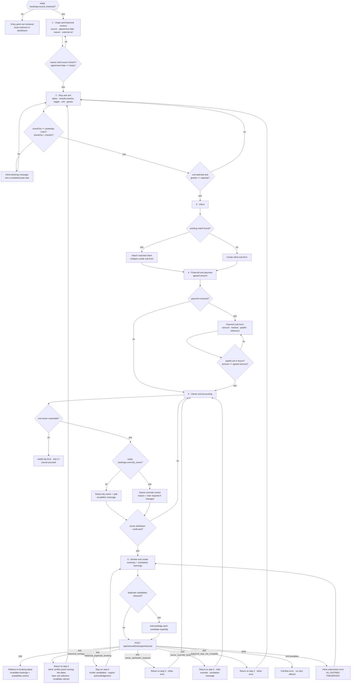
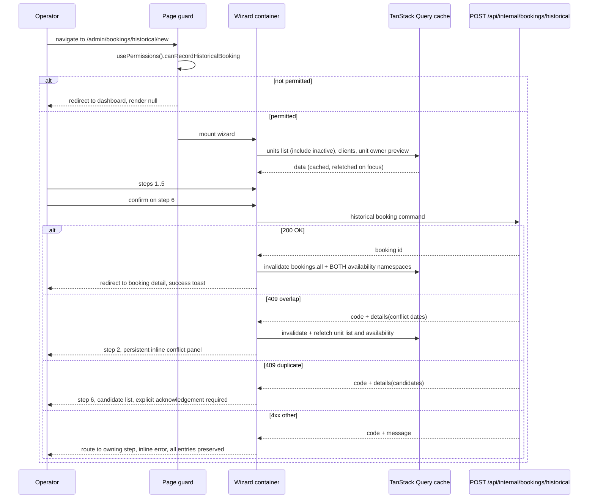

# HB-06 — Historical Booking Wizard UI

> [README](README.md) · [Master Plan](00_MASTER_PLAN.md) · Prev: [HB-05](05_TICKET_OWNER_ACCOUNTING_AND_SETTLEMENT_ADJUSTMENTS.md) ·
> Next: [HB-07](07_TICKET_NOTIFICATIONS_AUTOMATIONS_AND_INTEGRATIONS.md) ·
> Depends on: [HB-03](03_TICKET_AVAILABILITY_CONFLICTS_AND_DUPLICATE_PROTECTION.md) ·
> [HB-04](04_TICKET_FINANCIAL_SNAPSHOT_AND_HISTORICAL_PAYMENTS.md) ·
> [HB-05](05_TICKET_OWNER_ACCOUNTING_AND_SETTLEMENT_ADJUSTMENTS.md)

---

## 1. Ticket metadata

| Field | Value |
|---|---|
| Ticket ID | **HB-06** |
| Title | Historical Booking Wizard UI (operator portal) |
| Priority | **P1** |
| Type | Frontend feature — new permission-gated flow |
| Status | Ready for review |
| Dependencies | [HB-03](03_TICKET_AVAILABILITY_CONFLICTS_AND_DUPLICATE_PROTECTION.md), [HB-04](04_TICKET_FINANCIAL_SNAPSHOT_AND_HISTORICAL_PAYMENTS.md), [HB-05](05_TICKET_OWNER_ACCOUNTING_AND_SETTLEMENT_ADJUSTMENTS.md) |
| Dependents | [HB-09](09_TICKET_TEST_AUTOMATION_AND_RELEASE_GATES.md) |
| Risk level | **Medium** — no server authority, but it is the sole operator-facing surface for a financially significant action |
| Estimated complexity | **L** |
| Recommended owner | Senior frontend engineer, paired with UX for the Owner & Accounting step and with Finance for the review-step warnings |
| Target branch | `feat/hb06-historical-booking-wizard` |

> This ticket ships **no** authority. Every rule the wizard renders is enforced again server-side. The
> wizard's job is to make a correct entry easy, an incorrect entry hard, and a rejected entry recoverable
> without data loss.

---

## 2. Business context

The offline booking in [Master §3](00_MASTER_PLAN.md#3-problem-statement) — agreed day 1, deposit taken in
cash day 1, stay days 2–5, recorded day 10 — reaches the system through an operator sitting in the portal on
day 10. Everything the backend tickets build (protected agreed amount, commission snapshot, owner review,
historical conflict detection, truthful audit) is only as good as the data that operator supplies. The wizard
is where the reason, the agreement date, the actual money and the credited owner are captured, and where the
operator is told, unambiguously, what recording this record will and will not do.

---

## 3. Problem being solved

| # | Problem |
|---|---|
| P-1 | There is no operator surface for a historical booking at all. Today an operator either does not record it, or uses the normal flow — which, once [HB-08](08_TICKET_REPORTING_AUDIT_OBSERVABILITY_AND_ROLLOUT.md) activates the REQ-16 hardening, will return `400 stay_dates_in_past` and leave them stranded. This wizard is what makes that activation safe. |
| P-2 | Bolting "historical" fields onto the normal booking form would put a high-privilege, irreversible, financially significant action one mis-click away from the everyday flow. ADR-01 rejects that. |
| P-3 | Historical entry needs data the normal form has no concept of: agreement date, late-entry reason, original source, external reference, an operator-entered agreed amount, a payment with a real past `PaidAt`, and an explicitly reviewed owner. |
| P-4 | The riskiest failures (wrong owner, duplicate entry, overlapping stay) are all *recoverable at entry time* and *expensive afterwards*. The UI is the cheapest place to catch them. |
| P-5 | Rejections must not destroy work. A 409 after five steps of data entry that clears the form is a guaranteed source of duplicate records, because the operator will retype and resubmit. |

---

## 4. User value

| Audience | Value |
|---|---|
| Operations | A sanctioned, guided route to record what actually happened, instead of improvising in the normal form or leaving revenue unrecorded. |
| Finance | Confidence that the agreed amount, the payment date and the credited owner were each deliberately entered and reviewed, not inherited from live pricing. |
| Unit owners | Correct attribution, because the wizard forces an explicit owner confirmation rather than silently defaulting (INV-17). |
| Security | The high-privilege action is visibly separated, permission-gated, and impossible to reach accidentally. |
| Support | A predictable flow to walk an operator through, and a review screen that states the consequences in plain language. |

---

## 5. Current repository behavior

All claims verified by direct read at commit `8dafb5a`. The identifiers `UI-nn` below are **local to this
ticket** — they are portal observations, not additions to the global `F-nn` register in
[Master §7](00_MASTER_PLAN.md#7-confirmed-repository-findings).

### 5.1 The existing multi-step wizard — the model to follow

`CONFIRMED`. `rental-platform/components/admin/crm/booking-wizard/` holds a five-file wizard, orchestrated by
`rental-platform/components/admin/crm/ConvertToBookingPanel.tsx` (771 lines).

| ID | Observation | Evidence |
|---|---|---|
| UI-01 | The wizard is split into **pure step model**, **reducer hook**, **stepper**, **step bodies**, **summary**, **container** — five modules plus a container, none of which owns more than one concern | `crm-booking-wizard.ts` (353), `useCrmBookingWizard.ts` (221), `CrmBookingWizardStepper.tsx` (118), `CrmBookingWizardSteps.tsx` (695), `CrmBookingWizardSummary.tsx` (168), `ConvertToBookingPanel.tsx` (771) |
| UI-02 | A step is a declarative record: `id`, `label`, `isRequired`, `isVisible`, `isComplete`, `isBlocked`, `validate(state)` | `crm-booking-wizard.ts:26-35` |
| UI-03 | `buildCrmBookingWizardSteps` filters on `isVisible`, then derives `status` from `validate(state)` plus "any prior visible step incomplete" | `crm-booking-wizard.ts:272-352`, blocking rule at `:333-335` |
| UI-04 | **Dynamic steps already exist**: `requiresStayStep` / `requiresUnitStep` / `requiresClientStep` are computed from the lead, and the entry step is chosen accordingly | `ConvertToBookingPanel.tsx:84-87`; `crm-booking-wizard.ts:263-270` |
| UI-05 | State lives in a `useReducer` with a **route-scoped** reset boundary, explicitly commented so that a background query refresh cannot discard in-progress input | `useCrmBookingWizard.ts:183-194`, comment at `:187-190` |
| UI-06 | Focus is moved to the step heading on every step change; the heading carries `tabIndex={-1}` and a stable id | `ConvertToBookingPanel.tsx:192-194`; `CrmBookingWizardSteps.tsx:37-43` |
| UI-07 | Inputs already carry `aria-invalid` + `aria-describedby`, and errors are announced with `role="alert"` | dates `CrmBookingWizardSteps.tsx:96-97,118-119`; client `:403-404`; guests `:465-466`; alerts `:131,190,347,611` |
| UI-08 | The stepper is a `<nav>` + `<ol>`, with `aria-current="step"`, a per-step `aria-label` combining label and status, and a mobile "Step N of M" progress bar instead of the desktop rail | `CrmBookingWizardStepper.tsx:29,30-48,50,69-70` |
| UI-09 | The container is `lg:grid-cols-[minmax(0,1fr)_17rem]` with a sticky summary rail on desktop and a compact summary above the step on mobile; the action bar is `sticky bottom-0` | `ConvertToBookingPanel.tsx:557-568,570,707-718,722` |
| UI-10 | The design system is token-based: `var(--portal-radius-card)`, `var(--portal-radius-control)`, `var(--portal-control-height)`, `var(--z-sticky)`, `primary-*` / `error*` / `warning*` / `success*` scales | `ConvertToBookingPanel.tsx:529,722`; `CrmBookingWizardSteps.tsx:101,192` |

### 5.2 Date inputs — the constraint is currently one-sided

`CONFIRMED`. The stay step uses native `type="date"` inputs. Check-out is bounded below by check-in
(`CrmBookingWizardSteps.tsx:116` — `min={state.checkInDate || undefined}`); **check-in has no `min` and no
`max`** (`:91-102`). This matches [F-01](01_TICKET_DISCOVERY_AND_ARCHITECTURE_DECISIONS.md#f-01--there-is-no-server-side-past-date-rule):
the portal never constrained dates against "today" in either direction.

For the historical wizard the constraint is **inverted**: an upper bound of *yesterday, Cairo* applies to
check-out (ADR-03), and check-in inherits it transitively. `CONFIRMED` that the shared
`components/ui/DatePicker.tsx:8-17` already exposes `minDate`, `maxDate` and `disabledDates`, and
`components/ui/DateRangePicker.tsx` is already used by `QuickBookingModal.tsx:187-192`, so no new date
primitive is required.

### 5.3 Conflict handling and the stale-cache lesson

`CONFIRMED`. The CRM wizard already encodes the lesson that a 409 must not be a disappearing toast:

- `handleConvert` intercepts `ApiError.status === 409`, and on an availability conflict dispatches
  `availabilityConflict` — which forces `currentStep = "unit"`, clears `selectedUnitId`, and sets an inline
  message (`ConvertToBookingPanel.tsx:371-416`; reducer `useCrmBookingWizard.ts:172-179`).
- The message renders as a persistent inline `role="alert"` panel above the picker, not a toast
  (`CrmBookingWizardSteps.tsx:188-197`).
- It then calls `void refetchUnits()` (`ConvertToBookingPanel.tsx:405`) — **because the cached list still
  contains the unit the server has just rejected**.
- Two guard effects re-raise the conflict if the selected unit vanishes from the refreshed list, or if the
  availability probe reports unavailable (`:196-220`, `:222-241`).

`CONFIRMED` that conflict *identification* is currently a string sniff: `isUnitAvailabilityConflict`
(`lib/constants/crm-recommendation.ts:9-17`) lower-cases the error message and tests whether it contains the
unit id. This is a direct consequence of UI-11 below.

| ID | Observation | Evidence |
|---|---|---|
| UI-11 | `ApiError` carries **only** `status`, `message`, `errors: string[]`. The axios interceptor builds it from `envelope.message` and `envelope.errors` and **discards every other field of the response body** | `lib/api/api-error.ts:1-16`; `lib/api/axios.ts:51-59,69-87` |
| UI-12 | There are **two divergent query-key modules**, `lib/hooks/query-keys.ts` and `lib/utils/query-keys.ts`. `useBookings.ts:10` imports the `utils` one; `invalidateUnitAvailability` (`useBookings.ts:32-41`) therefore invalidates **raw prefixes** `["units", unitId, "availability"]` and `["ownerPortal","unitAvailability",unitId]`, with a comment stating the keys "match both query-key namespaces used in the app" | as cited |

UI-11 is a hard blocker for the inline surfaces this ticket requires: the wizard cannot read a machine
readable `code`, the conflicting date range, or duplicate candidates out of an error today.

### 5.4 Permission gating patterns already in use

`CONFIRMED`.

| Layer | Pattern | Evidence |
|---|---|---|
| Capability map | `usePermissions()` maps server grants 1:1 onto named UI capabilities, with the comment "what the UI shows and what the API allows cannot drift" | `lib/hooks/usePermissions.ts:32-75`, `has()` at `:45`, comment at `:41-43` |
| Navigation | `NavItem.requiredPermission` keyed to a `Permissions` field; items are filtered out entirely | `components/admin/layout/AdminNav.tsx:24-29,66-72` |
| Route guard | Page redirects to the dashboard in an effect and renders `null` while unauthorised | `app/(admin)/bookings/page.tsx:21-25,51` |
| Entry point | The "Quick Booking" button is rendered only when `canManageBookings` | `app/(admin)/bookings/page.tsx:69-77` |
| Action bar | The whole wizard footer is hidden when the capability is absent — the flow becomes read-only rather than error-prone | `ConvertToBookingPanel.tsx:721` |
| Route shim | `app/admin/<x>/page.tsx` is a one-line re-export of `app/(admin)/<x>/page` | `app/admin/bookings/page.tsx` (whole file) |
| RBAC admin UI | The role editor renders permission groups **from the API**, so a new backend descriptor appears without a portal change | `components/admin/settings/rbac/RoleAccessSection.tsx:204-210`; `lib/types/rbac.types.ts:1-10` |

### 5.5 Language reality

| ID | Observation | Label | Evidence |
|---|---|---|---|
| UI-13 | The portal root hard-codes `<html lang="en">` | `CONFIRMED` | `app/layout.tsx:21` |
| UI-14 | There is **no i18n system** — no message catalogue, no locale routing, no i18n library. The CRM wizard instead carries a hand-rolled, component-local bilingual copy constant with `en` and `ar` branches and a `direction: "ltr" \| "rtl"` field | `CONFIRMED` | `crm-booking-wizard.ts:46-245`, `en` at `:47-145`, `ar` at `:146-244` |
| UI-15 | Locale is sniffed at runtime from `document.documentElement.lang` / `dir` via a `MutationObserver`; the container applies `dir={copy.direction}` and rotates the nav chevrons with `rtl:rotate-180` | `CONFIRMED` | `useCrmBookingWizard.ts:196-221`; `ConvertToBookingPanel.tsx:527,739,761` |
| UI-16 | Because the root layout hard-codes `lang="en"` and nothing in `/admin` ever switches it, the `ar` branch and every RTL affordance are **unreachable at runtime** — they are latent, untested code | `INFERRED` (from UI-13 + UI-15; a grep for `lang=` across `rental-platform/**/*.tsx` returns only `app/layout.tsx:21`) | as cited |

This is the honest position, and it is the position [Master §17](00_MASTER_PLAN.md#17-uiux-flow) already
records: **an Arabic historical wizard is not achievable in v1 without building i18n scaffolding**, and
building it is not in this ticket. See §9 A-5 and [OQ-08](00_MASTER_PLAN.md#32-open-questions).

### 5.6 Payment method constants diverge from the API

`CONFIRMED`, and material to step 4. The portal offers four payment methods
(`lib/constants/payment-methods.ts` — `InstaPay`, `VodafoneCash`, `Cash`, `BankTransfer`). The API allow-list
is `cash`, `bank_transfer`, `card`, `wallet`, compared after `.Trim().ToLower()`
(`RentalPlatform.API/Validators/PaymentValidators.cs:8,17`;
`RentalPlatform.Business/Services/PaymentService.cs:20,110-113`). Normalised, the portal sends `instapay`,
`vodafonecash`, `cash`, `banktransfer` — so **three of the four options are rejected with a 400**. Only
`Cash` survives.

This is a pre-existing defect outside this ticket's scope to fix, but the historical wizard **must not reuse
`PAYMENT_METHOD_OPTIONS`** (see D-05 and NAC-HB06-11).

### 5.7 Test tooling

`CONFIRMED`. `rental-platform` uses Playwright only — five configs (`playwright.admin.config.ts`,
`playwright.booking-history.config.ts`, `playwright.client.config.ts`, `playwright.crm.config.ts`,
`playwright.owner.config.ts`) over `tests/{admin-smoke,booking-history,client-smoke,crm-ui,owner-smoke}`. The
CRM config runs a dev server on port 3102 against a fixture API host
(`playwright.crm.config.ts:18,32-36`). There is **no** vitest, jest or React Testing Library in
`rental-platform`; `demo` has some vitest-style tests (`demo/src/lib/booking/guest-count.test.ts`).

### 5.8 Component inventory — known gap

`BLOCKED`. [HB-01 §5.2](01_TICKET_DISCOVERY_AND_ARCHITECTURE_DECISIONS.md#52-known-gaps-in-this-audit)
assigns "portal wizard component inventory beyond `CrmBookingWizardSteps.tsx`, `QuickBookingModal.tsx`" to
this ticket. What is confirmed so far: `components/ui/` contains `Badge`, `Button`, `Combobox`,
`ConfirmDialog`, `DataTable`, `DatePicker`, `DateRangePicker`, `Drawer`, `EmptyState`, `Input`, `Label`,
`Modal`, `Pagination`, `PortalSplash`, `Select`, `Skeleton*`, `StatusBadge`, `Switch`, `Textarea`; `Modal`
implements Escape, scroll lock, focus trap and focus restore (`components/ui/Modal.tsx:84-103,131-133`);
`AvailableUnitPicker` is a labelled, filterable, retryable unit list already shared between the CRM wizard
and `QuickBookingModal` (`components/admin/crm/AvailableUnitPicker.tsx:17-58`;
`QuickBookingModal.tsx:207-221`). **Closing this inventory is implementation task 1** (§26).

---

## 6. Target behavior

1. An operator holding `bookings:record_historical` sees a dedicated **Record historical booking** entry
   point and reaches a **separate six-step wizard** at its own route. Operators without the permission never
   see it, and cannot reach it by typing the URL.
2. The wizard collects, in order: origin and historical context; stay and unit; client; financial and
   payment; owner and accounting; review and create.
3. Client-side constraints mirror the server rules (fully-past stay, agreed amount, payment not in the
   future, owner confirmed) but are never treated as authoritative.
4. A 409 overlap or a probable duplicate is surfaced **inline, persistently, and actionably**, with caches
   invalidated so the operator is not re-offered rejected data.
5. Nothing entered is lost on any rejection.
6. The review step states the consequences before the operator commits.
7. The normal booking flow — `QuickBookingModal`, the CRM conversion wizard, the bookings list — is
   byte-for-byte unchanged except for additive shared-code changes that carry regression tests.

---

## 7. In scope

- New route, entry point and navigation affordance, all permission-gated.
- The six-step wizard: step model, reducer, stepper, step bodies, summary rail, container.
- Owner & Accounting step including the permission-gated override control and read-only fallback.
- Inline conflict and duplicate surfaces, with the acknowledgement interaction.
- Cache invalidation after any conflict, covering **both** query-key namespaces (UI-12).
- Extending `ApiError` and the axios interceptor to carry a machine-readable error `code` and a structured
  `details` payload (UI-11), plus the `usePermissions` additions.
- Accessibility, mobile and tablet behaviour, loading and error states, unsaved-changes handling.
- Playwright coverage of the flow and of permission gating.
- Regression evidence for the normal flow.

## 8. Out of scope

| Item | Reason |
|---|---|
| Any server-side rule, endpoint, migration or permission definition | HB-02 … HB-05 |
| An i18n system, message catalogue, locale routing, or Arabic portal copy | UI-13…UI-16; [OQ-08](00_MASTER_PLAN.md#32-open-questions) |
| RTL layout work for `/admin` | Not applicable while the portal is `lang="en"` (UI-16). Claiming RTL delivery here would be false. |
| Fixing the `PAYMENT_METHODS` divergence across the existing payment UI | Pre-existing defect (§5.6); referred out, not silently repaired inside this branch |
| Unifying the two query-key modules | Pre-existing debt (UI-12); this ticket works correctly *with* both, it does not merge them |
| Bulk/CSV historical import | [Master §5](00_MASTER_PLAN.md#5-non-goals) |
| Editing an existing historical booking, or the owner-correction workflow UI | HB-05 owns the correction workflow; v1 UI is create-only |
| Any change to the storefront (`demo`) | Historical records are not storefront inventory; [OQ-10](00_MASTER_PLAN.md#32-open-questions) |

---

## 9. Assumptions

| # | Assumption | Label | If false |
|---|---|---|---|
| A-1 | `POST /api/internal/bookings/historical` exists and is stable before this ticket starts | `PROPOSED` (HB-02) | The wizard cannot be integration-tested; build against a fixture and treat as BLOCKED |
| A-2 | The 409 responses carry enough structure to name the conflicting dates and the duplicate candidates | `DECISION REQUIRED` — D-03 | The wizard degrades to a generic inline message; AC-HB06-12/13 cannot be met |
| A-3 | The historical endpoint accepts an inactive unit and rejects a soft-deleted one (ADR-12) | `PROPOSED` (HB-03) | The include-inactive affordance in step 2 must be removed |
| A-4 | Owner data needed by step 5 (current unit owner, commission rate, computed split) is returned by an existing or new read endpoint | `DECISION REQUIRED` — D-04 | Step 5 cannot show the split and must fall back to server-computed values on the review screen only |
| A-5 | English UI copy is acceptable for v1 | `CONFIRMED` for the current portal (UI-13/UI-14); ratification pending [OQ-08](00_MASTER_PLAN.md#32-open-questions) | An i18n epic must precede this ticket |
| A-6 | The permission descriptors added by HB-02 surface automatically in the RBAC role editor | `CONFIRMED` pattern (UI, §5.4) — verify at integration | A portal change is needed to assign the new permissions |
| A-7 | Playwright against a fixture API is an acceptable frontend test bed | `CONFIRMED` (§5.7) | Coverage moves entirely into HB-09's E2E tier |

---

## 10. Decision-required items

Decision authority for every row is the **Sole Project Owner** (2026-07-29). The **Review lens** column
names the perspectives applied — it is not a list of separate approvers.

| ID | Decision | Reason it is open | Impact if unresolved | Recommended default | Review lens | Blocks? |
|---|---|---|---|---|---|---|
| D-01 | Route path and entry-point placement | No historical route exists; the bookings list is the natural home but Finance may want it under `/admin/finance` | Navigation and deep links cannot be built | `/admin/bookings/historical/new`, entry point = a secondary button beside "Quick Booking" on the bookings list, plus a nav item only if Ops asks | Product | **Yes** |
| D-02 | Does the wizard live on a full page or in a modal/drawer? | Six steps with a summary rail exceed comfortable modal size; `QuickBookingModal` sets a modal precedent | Layout, focus management and unsaved-changes handling all differ | **Full page**, following `ConvertToBookingPanel`'s panel layout. A modal cannot carry six steps, a summary rail and a persistent conflict panel on mobile | Product | **Yes** |
| D-03 | Error body shape for `historical_overlap_conflict` and `historical_duplicate_booking` | UI-11 — `ApiError` discards everything but `message` and `errors[]`; today conflicts are identified by substring-matching the unit id | Inline, actionable conflict/duplicate surfaces are impossible; the wizard regresses to string sniffing | Envelope gains `code: string` and `details: object`; overlap `details` carries `conflictingBookingId`, `checkInDate`, `checkOutDate`, `bookingStatus`; duplicate `details` carries an array of candidate summaries | Engineering | **Yes** |
| D-04 | How does step 5 obtain the owner, commission rate and split? | No confirmed read endpoint returns commission rate to the portal | Step 5 cannot show what the operator is being asked to confirm | A read-only preview field on the unit detail response, or a dedicated `GET` owned by HB-05; the split is **displayed** from the server, never computed in the browser | Engineering · Finance | **Yes** |
| D-05 | Which payment methods does step 4 offer? | §5.6 — the portal constant and the API allow-list disagree; three of four options 400 | Operators hit unexplained 400s while recording a real cash deposit | Offer exactly the API allow-list (`cash`, `bank_transfer`, `wallet`; exclude `card` for manual offline entry unless Finance objects) from a **new** historical-scoped constant | Finance · Engineering | **Yes** |
| D-06 | Duplicate acknowledgement contract | Master V-09 says "409 until confirmed" but names no field | The operator can never get past a probable duplicate | Resubmit with `acknowledgedDuplicateBookingIds: string[]` — an id list, not a blanket boolean, so acknowledgement cannot be pre-set and cannot cover a candidate the operator never saw | Engineering · Product | **Yes** |
| D-07 | Is a "no payment received" historical booking valid? | Real offline bookings sometimes settle entirely in cash later | Step 4 either forces a fabricated payment or allows an unbalanced record | Yes — payment is optional; the record then carries an outstanding balance, which is truthful | Finance | No |
| D-08 | Unsaved-changes guard scope | Next.js App Router has no supported API to block a soft (client-side) navigation | Either an over-promise or an unguarded data-loss path | Guard `beforeunload` (hard navigation/close) and intercept the explicit Cancel/Back-to-list controls with `ConfirmDialog`. Do **not** claim soft-navigation interception | Engineering · Product | No |

---

## 11. Architecture and technical design

### 11.1 Reuse posture

`PROPOSED`. **Copy the shape, not the file.** The CRM wizard's six-module split (UI-01) is the right
architecture and is already proven in production; the historical wizard should be a sibling directory with
the same seams, not a fork of the CRM files and not a set of new props threaded through them.

| CRM asset | Reuse verdict | Rationale |
|---|---|---|
| Module split (model / reducer / stepper / steps / summary / container) | **Adopt the pattern** | UI-01; keeps step logic unit-testable and pure |
| `CrmBookingWizardStepper.tsx` | **Extract and share**, or duplicate if extraction risks the CRM flow | It is already generic over `CrmBookingWizardStep[]`; only the copy type is CRM-specific. Sharing is preferable but must not regress CRM — see NAC-HB06-01 |
| `AvailableUnitPicker` | **Reuse as-is**, with new `labels` | Already parameterised (`AvailableUnitPickerProps` `labels`, `components/admin/crm/AvailableUnitPicker.tsx:17-31`) and already shared with `QuickBookingModal.tsx:207-221` |
| `components/ui/*` (`Input`, `Select`, `Textarea`, `Combobox`, `DatePicker`, `Button`, `ConfirmDialog`, `Badge`) | **Reuse** | Existing design-system primitives; `DatePicker` already supports `maxDate` (§5.2) |
| `ConvertToBookingPanel`'s client match-or-create logic (`:253-369`) | **Reuse the approach**, not the code | It is lead-specific (`clearClient` needs a `lead`). Extract the phone/email normalise-and-match helper if it can be done without touching CRM behaviour |
| `crm-booking-wizard.ts` copy constant | **Do not extend** | Adding historical copy to the CRM constant couples two flows and drags the unreachable `ar` branch along (UI-16) |
| `QuickBookingModal` | **Do not extend** | ADR-01; the modal is the normal flow's surface |
| `PAYMENT_METHOD_OPTIONS` | **Do not reuse** | §5.6 — three of four values are rejected by the API |

### 11.2 Proposed module layout

`PROPOSED`.

```
components/admin/bookings/historical/
  historical-booking-wizard.ts          step model + English copy + pure validators
  useHistoricalBookingWizard.ts         useReducer state, actions, reset boundary
  HistoricalBookingWizardStepper.tsx    (or a shared extraction of the CRM stepper)
  HistoricalBookingWizardSteps.tsx      six step bodies
  HistoricalBookingWizardSummary.tsx    sticky summary rail
  HistoricalBookingWizardPanel.tsx      container: queries, mutation, error routing, focus
  conflict/HistoricalConflictPanel.tsx  inline 409 overlap surface
  conflict/DuplicateCandidatePanel.tsx  inline duplicate surface + acknowledgement
app/(admin)/bookings/historical/new/page.tsx   route + guard
app/admin/bookings/historical/new/page.tsx     one-line re-export shim (pattern: app/admin/bookings/page.tsx)
```

### 11.3 The six steps

| # | Step | Key fields | Always visible? | Dynamic content |
|---|---|---|---|---|
| 1 | **Origin and historical context** | `originalSource` (allow-list), `actualBookedAt` (agreement date), `historicalEntryReason` (allow-list), `externalReference` (optional), free-text note | Yes | Reason/source allow-lists come from HB-02 (`PROPOSED`, per [Master §25](00_MASTER_PLAN.md#25-decision-log)); the free-text note appends to `internal_notes` |
| 2 | **Stay and unit** | `checkInDate`, `checkOutDate`, unit, `guestCount` | Yes | Include-inactive-units toggle (ADR-12). Unit list disabled until the stay range is valid **and fully past**. Inline overlap panel appears here after a 409 |
| 3 | **Client** | Existing client, or name/phone/email for match-or-create | Yes | The create sub-form collapses once a client is matched or created |
| 4 | **Financial and payment** | `agreedAmount`; optional payment: amount, method, `paidAt`, reference, note | Yes | The payment sub-form is revealed by a "payment was received" control (D-07). Live pricing, if shown at all, is a labelled **reference only** ([Master §14](00_MASTER_PLAN.md#14-financial-model)). **The sub-form does not submit inside the creation request** — [D-PAY-01](DECISION_RATIFICATION_PACKET.md#d-pay-01--historical-payment-policy) is `OWNER APPROVED` for a separate privileged command. The wizard collects the payment here and posts it as a follow-up call once the booking returns `200`, with an explicit retry affordance if that second call fails. The intermediate no-payment state is legal, so a failed second call is recoverable, not corrupt |
| 5 | **Owner and accounting** (`المالك والحسابات`) | Credited owner, commission rate, owner/KAZA split, **mandatory confirmation**, override reason + note | Yes | Override control rendered **only** with `bookings:override_owner`; otherwise a read-only owner display plus an escalation message. Hard block when ownership is unknown (INV-17) |
| 6 | **Review and create** | Full summary, mandatory warnings, duplicate acknowledgement (conditional) | Yes | The acknowledgement block appears only when the server has returned duplicate candidates |

`CONFIRMED` that the Arabic step title `المالك والحسابات` from
[Master §17](00_MASTER_PLAN.md#17-uiux-flow) is documented for product parity only; the rendered label is
English (UI-13…UI-16).

### 11.4 Step-flow diagram



### 11.5 State model

`PROPOSED`. A single `useReducer`, mirroring UI-05.

| Concern | Rule |
|---|---|
| Reset boundary | Mount only. No query refetch, focus refetch or poll may reset the reducer. The CRM precedent keys reset on `lead.id` (`useCrmBookingWizard.ts:186-191`); the historical wizard has no such key, so reset happens on mount and on a successful create |
| Back / Next | Pure `goTo` action; **no field is cleared** by navigation |
| Server rejection | Only the targeted step's error slot is written. No field is cleared, with one exception: an overlap conflict clears `selectedUnitId` because the server has ruled it out (CRM precedent, `useCrmBookingWizard.ts:172-179`) |
| Derived values | Step completeness derives from `validate(state)`; never stored |
| Money | Held as strings while typing, parsed on blur, rendered with `formatCurrency`. The owner/KAZA split is **display-only, from the server** (D-04) |
| Acknowledgements | `acknowledgedDuplicateBookingIds` is cleared whenever any field feeding the duplicate probe changes (dates, unit, client, amount) |

---

## 12. Expected data flow



---

## 13. Expected files/components likely to change

`PROPOSED` — not asserted as required until the implementer confirms against the closed inventory (task 1).

| Path | Likely change | New? |
|---|---|---|
| `rental-platform/components/admin/bookings/historical/*` | The wizard (§11.2) | New |
| `rental-platform/app/(admin)/bookings/historical/new/page.tsx` | Route + guard | New |
| `rental-platform/app/admin/bookings/historical/new/page.tsx` | Re-export shim | New |
| `rental-platform/lib/hooks/usePermissions.ts` | `canRecordHistoricalBooking`, `canOverrideBookingOwner` | Edit (`:12-29` interface, `:55-72` mapping) |
| `rental-platform/lib/constants/routes.ts` | `ROUTES.admin.bookings.recordHistorical` | Edit (`:33-36`) |
| `rental-platform/app/(admin)/bookings/page.tsx` | Permission-gated entry-point button | Edit (`:69-77`) |
| `rental-platform/components/admin/layout/AdminNav.tsx` | Optional nav item, subject to D-01 | Edit |
| `rental-platform/lib/api/api-error.ts` | Add `code` and `details` (UI-11) | Edit |
| `rental-platform/lib/api/axios.ts` | Propagate `code`/`details` from the envelope (`:51-59`, `:69-87`) | Edit |
| `rental-platform/lib/api/services/bookings.service.ts` | `createHistorical()` | Edit |
| `rental-platform/lib/hooks/useBookings.ts` | `useCreateHistoricalBooking()` reusing `invalidateUnitAvailability` (`:32-41`) | Edit |
| `rental-platform/lib/types/booking.types.ts` | Historical request/response types | Edit |
| `rental-platform/lib/constants/*` | Historical reason / source / payment-method constants | New |
| `rental-platform/components/admin/crm/booking-wizard/CrmBookingWizardStepper.tsx` | Only if the stepper is extracted for sharing | Edit — highest regression risk in this ticket |
| `rental-platform/tests/historical-booking/*` + `playwright.historical.config.ts` | Playwright suite | New |

---

## 14. API changes

**This ticket defines no endpoint.** It consumes `POST /api/internal/bookings/historical`
([Master §12](00_MASTER_PLAN.md#12-api-and-command-design)) and states the client-side contract it needs.

| Requirement | Owner | Label |
|---|---|---|
| Machine-readable `code` on every error response, matching the Master §12 table | HB-02 | `DECISION REQUIRED` — D-03 |
| `details` payload on `historical_overlap_conflict`: conflicting booking id, its check-in/check-out, its status | HB-03 | D-03 |
| `details` payload on `historical_duplicate_booking`: candidate list (id, client name, unit, stay dates, amount, recorded date) | HB-03 | D-03 |
| Request field `acknowledgedDuplicateBookingIds: string[]` | HB-03 | D-06 |
| Unit list must return inactive units when explicitly requested (ADR-12); `useInternalUnitsList` currently pins `isActive: true` at the call sites (`ConvertToBookingPanel.tsx:102`, `QuickBookingModal.tsx:98`) | HB-03 + this ticket | `PROPOSED` |
| Owner preview: credited owner, commission rate, computed split | HB-05 | D-04 |
| `ApiError` must carry `code` and `details` end-to-end | This ticket | `PROPOSED` |

No existing endpoint's contract changes. No existing consumer of `ApiError` breaks: `code` and `details` are
additive and optional, and the existing `status` / `message` / `errors` fields keep their meaning
(`lib/api/api-error.ts:1-16`).

---

## 15. Data/schema changes

**None.** This ticket creates no migration and touches no SQL. It renders columns introduced by
[HB-04](04_TICKET_FINANCIAL_SNAPSHOT_AND_HISTORICAL_PAYMENTS.md) and
[HB-05](05_TICKET_OWNER_ACCOUNTING_AND_SETTLEMENT_ADJUSTMENTS.md) per
[Master §11](00_MASTER_PLAN.md#11-proposed-data-model).

---

## 16. Authorization and security

| Control | Behaviour | Invariant |
|---|---|---|
| Entry point | Rendered only when `canRecordHistoricalBooking` — the `canManageBookings` pattern at `app/(admin)/bookings/page.tsx:69-77` | INV-10 |
| Navigation | If a nav item is added, it uses `requiredPermission` (`AdminNav.tsx:24-29`) so it disappears entirely | INV-10 |
| Route guard | Effect-based redirect to the dashboard plus `return null`, matching `app/(admin)/bookings/page.tsx:21-25,51` | INV-10 |
| Override control | Step 5's override is rendered only when `canOverrideBookingOwner`. Without it: read-only owner, plus an escalation message naming the required permission | INV-10, INV-14 |
| Browser manipulation | Editing the auth store, toggling a devtools boolean or forcing the route yields **403 `forbidden`** / **403 `owner_override_forbidden`** from the server. The wizard renders that outcome; it never treats a client-side capability as authority | INV-10 |
| Actor | Never sent from the client. The recorded-by actor is the authenticated principal, server-side | INV-11 |
| Owner / unit / client ids | Submitted as opaque ids; portfolio scoping is enforced server-side. The wizard must not assume a returned id is in scope | INV-12 |
| Mass assignment | The request DTO is built explicitly field-by-field. No object spread of wizard state into the request body | — |
| PII | No guest name, phone or email in console logs, analytics events, or Playwright artefacts committed to the repo | — |
| `RISK-10` | The wizard is *not* the mitigation. Server hardening (HB-01) is. Hiding the button is a usability measure only | — |

---

## 17. Validation rules

Client-side rules mirror [Master §13](00_MASTER_PLAN.md#13-validation-matrix). Every one is re-enforced
server-side; the client copy is convenience, never authority.

| # | Rule | Step | Client behaviour | Server code on breach |
|---|---|---|---|---|
| CV-01 | `checkOut > checkIn` | 2 | Inline error; Continue disabled | `validation_error` |
| CV-02 | `checkOut <= yesterday (Cairo)` | 2 | `maxDate` on the picker + inline blocking message naming the normal flow as the route for present/future stays | `historical_stay_not_complete` |
| CV-03 | Agreement date `<= today` and `<= checkInDate` (recommended) | 1 | Inline warning; `DECISION REQUIRED` whether "agreed after check-in" is an error or a warning — recommended default: **warning**, since late paperwork is real | `validation_error` if the server makes it an error |
| CV-04 | Reason chosen from the allow-list | 1 | Required `Select`; Continue disabled | `validation_error` |
| CV-05 | Original source chosen from the allow-list | 1 | Required `Select` | `validation_error` |
| CV-06 | External reference optional; trimmed; length-capped to the column width | 1 | Inline counter | `historical_duplicate_booking` if it collides |
| CV-07 | Unit selected; inactive allowed and **visibly badged**; soft-deleted never listed | 2 | Badge on inactive units; picker disabled until the range is valid | `unit_deleted_unsupported` |
| CV-08 | `1 <= guestCount <= unit.maxGuests` | 2 | Existing pattern (`ConvertToBookingPanel.tsx:130-138`) | `validation_error` |
| CV-09 | Client resolved or creatable | 3 | Existing match-or-create pattern | `validation_error` |
| CV-10 | `agreedAmount > 0`, max 2 decimals | 4 | Inline error; no rounding performed in the browser | `validation_error` |
| CV-11 | Payment amount `> 0` and `<= agreedAmount` | 4 | Inline error | `validation_error` |
| CV-12 | `paidAt` not in the future; recommend not before the agreement date | 4 | `maxDate` = today; a warning, not a block, for "before agreement" | `validation_error` |
| CV-13 | Payment method from the API allow-list (D-05) | 4 | `Select` populated from the historical constant, **not** `PAYMENT_METHOD_OPTIONS` | `validation_error` |
| CV-14 | Owner attribution explicitly confirmed | 5 | Create button disabled until confirmed | `owner_attribution_required` |
| CV-15 | Override requires a reason **and** a note | 5 | Both required once the owner differs from the unit owner | `validation_error` / `owner_override_forbidden` |
| CV-16 | Ownership unresolvable ⇒ hard block | 5 | Blocking panel; Continue and Create both disabled (INV-17) | `owner_attribution_required` |
| CV-17 | Duplicate candidates each acknowledged | 6 | Per-candidate control; blanket acknowledgement not offered (D-06) | `historical_duplicate_booking` |

---

## 18. Transaction and failure behavior

The wizard performs **exactly one** state-changing call: the final `POST`. Everything before it is read-only.
Atomicity is the server's (INV-05).

| Failure | Wizard behaviour |
|---|---|
| Network unreachable (`ApiError(0, …)`, `lib/api/axios.ts:75-78`) | Inline error on step 6, Create re-enabled, **all entries preserved**. No automatic retry — a blind retry after an unknown outcome is a duplicate-creation risk |
| Timeout / ambiguous outcome | Same, plus explicit copy: *"The booking may or may not have been created. Check the bookings list before retrying."* |
| 401 during the flow | Handled by the existing refresh interceptor (`lib/api/axios.ts:90-99`). If refresh fails the user is signed out and wizard state is lost — accepted, `INFERRED` from the existing interceptor behaviour |
| 5xx | Inline error, entries preserved, retry allowed |
| Success | Invalidate, redirect to the booking detail, success toast. The wizard is unmounted, so state resets naturally |

---

## 19. Idempotency and concurrency

| Concern | Handling |
|---|---|
| Double submit | Create button disabled while the mutation is pending (`isLoading` + `disabled`, the `ConvertToBookingPanel.tsx:747-766` pattern). This is a UX guard; the server's duplicate rules are the real control (`BookingService.cs:19` 30-second window plus HB-03's business rules) |
| Two operators, same unit and dates | The loser receives `409 historical_overlap_conflict` and lands on step 2 with the inline panel. Caches are invalidated so the second operator does not see stale availability |
| Stale unit list | After **any** conflict, invalidate `queryKeys.bookings.all`, `["units", unitId, "availability"]` and `["ownerPortal","unitAvailability",unitId]` — the `invalidateUnitAvailability` helper (`useBookings.ts:32-41`) already covers both namespaces (UI-12) — then refetch the unit list before re-enabling selection |
| Cairo midnight crossing mid-session | The client-side `maxDate` is computed once at mount and is therefore advisory. A stay that becomes eligible or ineligible mid-session is adjudicated by the server. Recompute `maxDate` on window focus so long-lived tabs do not drift |
| Acknowledgement replay | `acknowledgedDuplicateBookingIds` is cleared on any change to dates, unit, client or amount, so an acknowledgement cannot silently carry over to a different record |

---

## 20. Audit and observability

The audit record is written server-side (HB-02). Client-side signals only:

| Signal | Shape | Note |
|---|---|---|
| `historical_wizard_started` | actor role, entry point | No PII |
| `historical_wizard_step_reached` | step id | Identifies where operators stall |
| `historical_wizard_abandoned` | last step reached | Feeds UX iteration |
| `historical_wizard_rejected` | `{ code }` from the error envelope | Mirrors `historical_booking_rejected_total` in [Master §23](00_MASTER_PLAN.md#23-observability) |
| `historical_wizard_override_shown` / `_used` | boolean | Corroborates the server-side override audit |
| `historical_wizard_duplicate_ack` | candidate count | Detects operators acknowledging everything reflexively |

`DECISION REQUIRED` — no frontend analytics transport was confirmed in this audit. Recommended default: emit
via the existing structured logging path if one exists, otherwise defer all six signals to HB-08 rather than
inventing a transport in this ticket. Non-blocking.

---

## 21. Notification/side-effect behavior

| Effect | Verdict |
|---|---|
| Customer-facing notification | **None.** Suppression is structural — creation triggers no dispatch path ([F-04](01_TICKET_DISCOVERY_AND_ARCHITECTURE_DECISIONS.md#f-04--minimal-side-effect-surface)). The wizard adds nothing |
| Wizard-initiated email/SMS/WhatsApp | **Must not exist.** No delivery mechanism exists anywhere in the solution (F-04) and this ticket must not create one |
| Success toast | Operator-facing only, English, no PII |
| Warning that no notification is sent | **Mandatory** on step 6 (§11.3, [Master §17](00_MASTER_PLAN.md#17-uiux-flow)) |
| Cache invalidation | The only side effect this ticket owns (§19) |

**The five mandatory review-step warnings**, rendered as a single grouped, non-dismissible block above the
Create button:

1. A **completed historical booking** is being recorded — it did not go through the normal lifecycle.
2. **Reports will be affected** — the stay lands in a past period while the entry lands today.
3. **Owner accounting may be affected** — this record makes the credited owner eligible for a payout.
4. **No notifications will be sent** — the guest and the owner are not contacted.
5. **System audit timestamps remain current** — the record shows it was entered today, by the signed-in user.

---

## 22. Reporting/accounting impact

None directly — the wizard writes no report. Two obligations follow from
[Master §19](00_MASTER_PLAN.md#19-reporting-impact-matrix):

| Obligation | Detail |
|---|---|
| Set expectations at entry | Warning 2 (§21) states plainly that the stay period and the recorded period differ. Operators must not be surprised by [F-09](01_TICKET_DISCOVERY_AND_ARCHITECTURE_DECISIONS.md#f-09--reporting-buckets-on-created_at) |
| Do not compute money in the browser | The owner/KAZA split shown on step 5 and the review screen is **displayed from the server** (D-04). A browser-computed split that disagrees with the server's snapshot would be a reconciliation defect wearing a UI costume |

---

## 23. Backward compatibility

| Surface | Impact |
|---|---|
| Normal booking flow (`QuickBookingModal`, bookings list, booking detail) | **None.** Additive only |
| CRM conversion wizard | **None**, unless the stepper is extracted for sharing (§11.1) — then it is behaviour-preserving refactor plus regression tests |
| `ApiError` consumers | Safe: `code`/`details` are additive and optional |
| Operators without the new permission | See nothing new |
| New portal against an old API (endpoint absent) | The entry point must be hidden when the permission is absent, which it will be — no role can grant a permission the backend has not seeded. If the endpoint 404s despite the permission, the wizard shows a plain "feature unavailable" state and does not retry ([Master §20](00_MASTER_PLAN.md#20-backward-compatibility)) |
| Old portal against a new API | Endpoint simply unused |

---

## 24. Migration and rollout plan

No schema migration. Deployment sequence, consistent with
[Master §21–22](00_MASTER_PLAN.md#21-migration-strategy):

1. HB-02 … HB-05 deployed; migration applied and verified.
2. Permission descriptors seeded; verify they appear in the RBAC role editor (UI, §5.4) — no portal change expected (A-6).
3. Portal deployed with the wizard. It is invisible to everyone until step 4.
4. Grant `bookings:record_historical` to the pilot role (2–3 named users, [Master §22](00_MASTER_PLAN.md#22-rollout-strategy)).
5. Grant `bookings:override_owner` to a **strictly smaller** set — Finance only.
6. Pilot for one week with daily reconciliation.
7. Operator documentation published **before** the first grant, not after.
8. Normal-flow hardening (HB-01) enabled **last**.

---

## 25. Feature flag strategy

`PROPOSED`: **no runtime feature flag.** The permission is the flag
([Master §22](00_MASTER_PLAN.md#22-rollout-strategy)) — it is server-enforced, per-user, auditable and
already has an administration UI. A client-side flag would add a second, weaker gate that could disagree with
the server, which is exactly the failure mode ADR-01 exists to prevent. Revoking the grant is the kill
switch and takes effect on the next permission load.

---

## 26. Detailed implementation tasks

Ordered; each independently checkable.

1. **Close the component inventory (§5.8).** Enumerate every reusable primitive, wizard part, form pattern, error surface and hook. Record which are reused, extended or duplicated, and why. Attach to the PR. This closes the `BLOCKED` gap assigned by [HB-01 §5.2](01_TICKET_DISCOVERY_AND_ARCHITECTURE_DECISIONS.md#52-known-gaps-in-this-audit).
2. Confirm D-01 … D-06 are answered in writing. Stop if any is open (§36).
3. Extend `ApiError` with optional `code` and `details`; propagate both through the axios interceptor (`lib/api/axios.ts:51-59,69-87`). Prove no existing consumer changes behaviour.
4. Add `canRecordHistoricalBooking` and `canOverrideBookingOwner` to `usePermissions` (`:12-29`, `:55-72`).
5. Add `ROUTES.admin.bookings.recordHistorical` (`lib/constants/routes.ts:33-36`).
6. Add historical request/response types and `bookingsService.createHistorical()`.
7. Add `useCreateHistoricalBooking()`, reusing `invalidateUnitAvailability` (`useBookings.ts:32-41`) so both query-key namespaces are covered (UI-12).
8. Create the route page plus the `app/admin/...` re-export shim; implement the guard using the `app/(admin)/bookings/page.tsx:21-25,51` pattern.
9. Add the permission-gated entry point on the bookings list (`:69-77` pattern) and, if D-01 says so, the nav item.
10. Write `historical-booking-wizard.ts`: step definitions, English copy object, and pure validators. Keep it dependency-free so it is unit-testable without a DOM.
11. Write `useHistoricalBookingWizard.ts`: reducer, actions, reset boundary (§11.5).
12. Resolve the stepper: extract the CRM stepper for sharing, or duplicate. If extracting, land it as a separate behaviour-preserving commit with CRM regression evidence.
13. Build step 1 — origin and historical context. Reason/source `Select`s from the HB-02 allow-lists.
14. Build step 2 — stay and unit. Native date inputs or `DatePicker` with `maxDate` = yesterday (Cairo); include-inactive toggle; inactive badge; `AvailableUnitPicker` with historical labels.
15. Build step 3 — client, reusing the match-or-create approach (§11.1).
16. Build step 4 — agreed amount plus the optional payment sub-form; payment methods from the new historical constant (D-05). Its submission is a **second call** after the booking returns `200`, per [D-PAY-01](DECISION_RATIFICATION_PACKET.md#d-pay-01--historical-payment-policy), with an explicit retry affordance if that call fails.
17. Build step 5 — owner and accounting: owner display, server-provided split, mandatory confirmation, permission-gated override with reason + note, read-only fallback with escalation message, hard block on unknown ownership.
18. Build step 6 — review, the five mandatory warnings, per-candidate duplicate acknowledgement.
19. Build the summary rail (desktop sticky, mobile compact) following `ConvertToBookingPanel.tsx:557-568,707-718`.
20. Build `HistoricalConflictPanel`: persistent, inline, `role="alert"`, naming the conflicting stay dates and offering "choose another unit" / "change dates".
21. Build `DuplicateCandidatePanel`: candidate list with enough detail to judge, per-candidate acknowledgement, and a link to open each candidate in a new tab.
22. Wire error routing (§11.4): map each error code to its owning step; never clear unrelated state.
23. Wire cache invalidation on every conflict path, then refetch before re-enabling unit selection.
24. Implement unsaved-changes handling per D-08: `beforeunload` plus `ConfirmDialog` on explicit Cancel.
25. Implement focus management: move focus to the step heading on change (`ConvertToBookingPanel.tsx:192-194`), and to the conflict/duplicate panel when one appears.
26. Implement loading and empty states: skeletons for the unit list, `role="status"` for in-flight regions (`ConvertToBookingPanel.tsx:665-675` pattern), retry affordances for failed reads.
27. Responsive pass: 360 px, 768 px, 1280 px. Verify the sticky footer does not obscure the last field and that all targets meet 44 px (`min-h-11`, `CrmBookingWizardStepper.tsx:72`).
28. Accessibility pass (§29).
29. Add the Playwright suite plus its config, following `playwright.crm.config.ts`.
30. Run and attach normal-flow regression evidence (§35).
31. Write operator documentation: when to use the historical flow, what each reason means, what the warnings mean, what to do on a conflict or duplicate.

---

## 27. Acceptance criteria

| ID | Criterion |
|---|---|
| AC-HB06-01 | **Given** an operator with `bookings:record_historical`, **when** they open the bookings list, **then** a "Record historical booking" entry point is visible and opens the wizard route. |
| AC-HB06-02 | **Given** an operator **without** that permission, **when** they open the bookings list, **then** no entry point is rendered; **and when** they navigate directly to the route, **then** they are redirected and no wizard content is rendered. |
| AC-HB06-03 | The wizard renders six steps in the documented order, with a stepper showing position, and it is a separate route — not a variant of `QuickBookingModal` or the CRM wizard. |
| AC-HB06-04 | **Given** a check-out on or after today (Cairo), **when** entered on step 2, **then** the picker prevents it and, if forced, an inline message explains that only completed stays are recordable and names the normal flow. |
| AC-HB06-05 | **Given** valid input on every step, **when** Create is pressed, **then** exactly one `POST /api/internal/bookings/historical` is issued and the operator lands on the new booking's detail page. |
| AC-HB06-06 | **Given** any step, **when** the operator moves Back and forward again, **then** every entered value is intact. |
| AC-HB06-07 | **Given** a submission that fails for any reason, **when** the error is rendered, **then** no entered value is lost (except the unit selection on an overlap conflict, which the server has ruled out). |
| AC-HB06-08 | Step 1 requires both a reason and an original source before Continue is enabled. |
| AC-HB06-09 | Step 2 lists inactive-but-not-deleted units, visibly badged; soft-deleted units never appear. |
| AC-HB06-10 | Step 4 accepts an operator-entered agreed amount; any live pricing shown is labelled as reference only and never populates the submitted amount. |
| AC-HB06-11 | Step 5 shows the credited owner, commission rate and split, and Create stays disabled until owner attribution is explicitly confirmed. |
| AC-HB06-12 | **Given** a `409 historical_overlap_conflict`, **when** it is returned, **then** the operator is placed on step 2 with a **persistent inline** panel naming the conflicting stay dates — not a toast — and the unit and availability caches are invalidated and refetched. |
| AC-HB06-13 | **Given** a `409 historical_duplicate_booking`, **when** it is returned, **then** each candidate is displayed with enough detail to judge it, and Create is re-enabled only after each is explicitly acknowledged. |
| AC-HB06-14 | **Given** an operator **without** `bookings:override_owner`, **when** they reach step 5, **then** the owner is read-only, no override control exists, and an escalation message names what is required. |
| AC-HB06-15 | **Given** an operator who forces an override client-side without the permission, **when** they submit, **then** the server returns `403 owner_override_forbidden` and the wizard renders it on step 5 without creating anything. |
| AC-HB06-16 | Step 6 displays all five mandatory warnings (§21) above the Create button, non-dismissible. |
| AC-HB06-17 | Keyboard-only completion is possible end to end; focus moves to the step heading on every step change and to the conflict panel when one appears. |
| AC-HB06-18 | Every input has a programmatically associated label; invalid inputs carry `aria-invalid` and `aria-describedby` pointing at their error; errors are announced (`role="alert"`). |
| AC-HB06-19 | The stepper announces the current step and each step's status to assistive technology (`aria-current="step"` plus a status-bearing accessible name). |
| AC-HB06-20 | At 360 px width the wizard is fully usable: one step at a time, a compact summary, a reachable action bar, no horizontal scroll, targets ≥ 44 px. |
| AC-HB06-21 | Every asynchronous region has a loading state and every failed read has a retry affordance. |
| AC-HB06-22 | Attempting to close the tab or leave via the wizard's own Cancel control with unsaved input triggers a confirmation (D-08). |
| AC-HB06-23 | UI copy is English; the Arabic step title is documented in this plan for parity only and no i18n scaffolding is introduced. |
| AC-HB06-24 | The completed component inventory (task 1) is attached to the PR and the corresponding HB-01 §5.2 gap is marked closed. |

## 28. Negative acceptance criteria

| ID | Must NOT happen |
|---|---|
| NAC-HB06-01 | The normal booking flow must not change behaviour. `QuickBookingModal`, the bookings list and the CRM conversion wizard behave identically; if the stepper is shared, CRM regression evidence is attached. |
| NAC-HB06-02 | Historical fields must not be added to the normal booking form or to `QuickBookingModal` (ADR-01). |
| NAC-HB06-03 | The wizard must not send a "historical" or "bypass" boolean to `POST /api/internal/bookings`. It calls only the dedicated endpoint (ADR-01). |
| NAC-HB06-04 | A conflict or duplicate must not be surfaced only as a toast, and must not be auto-dismissed. |
| NAC-HB06-05 | After a conflict the wizard must not continue to offer, from cache, the unit or dates the server has just rejected. |
| NAC-HB06-06 | A validation failure or server rejection must not clear the form or reset the wizard to step 1. |
| NAC-HB06-07 | The wizard must not treat any client-side permission check as authority, nor hide a server error behind an optimistic success. |
| NAC-HB06-08 | The override control must not be rendered, focusable or reachable by keyboard for an operator lacking `bookings:override_owner`. |
| NAC-HB06-09 | The owner/KAZA split must not be computed in the browser and submitted as fact. |
| NAC-HB06-10 | The wizard must not fabricate a payment when none was taken, nor default a payment amount to the agreed amount. |
| NAC-HB06-11 | `PAYMENT_METHOD_OPTIONS` must not be reused (§5.6) — three of its four values are rejected by the API. |
| NAC-HB06-12 | No i18n library, message catalogue or locale-routing scaffolding may be introduced, and no claim of RTL support may be made (UI-16). |
| NAC-HB06-13 | No client-side date rule may be presented to the operator as final; every blocking message must be re-derivable from a server response. |
| NAC-HB06-14 | No guest PII may appear in analytics events, console output, or committed Playwright artefacts. |
| NAC-HB06-15 | The wizard must not auto-retry a submission whose outcome is unknown. |

---

## 29. QA plan

| Layer | Coverage | Tooling |
|---|---|---|
| Unit (pure) | `historical-booking-wizard.ts` step model: visibility, completeness, blocking, the Cairo `maxDate` derivation, reason/source validation, amount parsing and 2-dp handling, `paidAt` bounds | `BLOCKED` — `rental-platform` has no unit-test runner (§5.7). Recommended default: add vitest for the pure modules only, or move this tier into HB-09. Must be resolved, not assumed |
| Reducer | Back/Next preserves state; rejection writes only the targeted error slot; overlap clears only the unit; acknowledgement cleared on relevant field change | Same as above |
| Component | Permission gating of the entry point, route and override control; conflict and duplicate panels; warning block presence | Playwright component-free DOM assertions, or vitest+RTL if adopted |
| API integration | Mutation issues exactly one POST with the exact payload; error codes route to the right step; caches invalidated on conflict | Playwright with a fixture API (`playwright.crm.config.ts:32-36` pattern) |
| Frontend E2E | Full six-step happy path; 409 overlap; 409 duplicate then acknowledge then success; missing-permission redirect; override-forbidden | Playwright, new `playwright.historical.config.ts` |
| Concurrency | Two sessions submitting the same unit and dates; the loser sees the inline conflict and a refreshed unit list | Playwright, two browser contexts |
| Security | Entry point hidden; direct URL redirects; override control absent and not keyboard-reachable; forced override yields 403 and creates nothing; no `OwnerId`/`CreatedAt`/`Status` in the request payload | Playwright + payload assertion |
| Accounting | Displayed split matches the server response byte for byte; the agreed amount submitted equals the amount typed; the payment date submitted equals the date chosen | Playwright with fixture assertions + Finance review of screenshots |
| Accessibility | Keyboard-only traversal; focus lands on the step heading and on the conflict panel; label association; `aria-invalid`/`aria-describedby`; `role="alert"`; stepper semantics; visible focus rings; contrast; `prefers-reduced-motion` honoured (the CRM stepper already does — `CrmBookingWizardStepper.tsx:42`) | Playwright + axe, plus one manual screen-reader pass |
| Responsive | 360 / 768 / 1280 px; no horizontal scroll; sticky footer never obscures the final field; targets ≥ 44 px | Playwright viewports + screenshots |
| Regression | `QuickBookingModal` create; CRM lead → booking conversion including its own 409 path; bookings list filters; booking detail | Existing `tests/crm-ui` and `tests/admin-smoke` suites, re-run and attached |
| Manual UAT | Two operators record the day-1/days-2–5/day-10 case end to end, one with override permission and one without | Scenario pack |
| Scenarios | Existing: `SC-DATE-01/03/04`, `SC-AVAIL-02/08`, `SC-DUP-01/05`, `SC-OWN-04/07/08`, `SC-PAY-06`, `SC-SEC-02`, `SC-REG-02`. `PROPOSED` new group `SC-UI-01 … SC-UI-10` covering gating, step preservation, conflict surface, duplicate acknowledgement, warnings, a11y and mobile — to be registered in [99](99_RELIABILITY_TEST_SCENARIOS.md) by HB-09 | — |

---

## 30. PM checklist

- [ ] D-01 … D-06 answered in writing (D-07, D-08 may default)
- [ ] UX approval of the six-step flow, the warning block and the Owner & Accounting step
- [ ] Finance approval of the review-step warning wording
- [ ] English-only v1 accepted against [OQ-08](00_MASTER_PLAN.md#32-open-questions)
- [ ] HB-03, HB-04, HB-05 merged and deployed to the integration environment
- [ ] Error-body contract (D-03) agreed with the backend owner
- [ ] Permission grants decided: who gets `bookings:record_historical`, who gets `bookings:override_owner`
- [ ] Operator documentation drafted before the first grant
- [ ] Analytics decision made or explicitly deferred (§20)
- [ ] Accessibility reviewer identified
- [ ] Rollout and rollback approved (§24, §34)

---

## 31. Definition of Ready

1. HB-03, HB-04 and HB-05 are merged, and the historical endpoint is callable in a shared environment.
2. D-01 … D-06 are answered.
3. The error-body shape (D-03) is documented and implemented, or a fixture reproducing it is agreed.
4. Reason and original-source allow-lists are ratified ([Master §25](00_MASTER_PLAN.md#25-decision-log)).
5. The owner preview source (D-04) exists or is scheduled ahead of step 5.
6. The payment-method allow-list for historical entry (D-05) is agreed.
7. UX has approved the step sequence and the warning block.
8. A test environment with real data volumes for the unit and client pickers.

## 32. Definition of Done

1. AC-HB06-01 … 24 pass.
2. NAC-HB06-01 … 15 verified, each with evidence.
3. The component inventory is closed and the HB-01 §5.2 gap is marked closed.
4. Playwright suite green in CI; normal-flow regression suites green and attached.
5. Accessibility pass complete, including one manual screen-reader traversal.
6. Responsive verification at 360 / 768 / 1280 px with screenshots.
7. UX and Finance have signed off the review-step warnings.
8. Operator documentation published.
9. No change to the normal booking flow's behaviour, demonstrated by diff review and regression output.
10. Analytics signals emitted, or their deferral recorded against HB-08.

---

## 33. Risks and mitigations

| Risk | Relevance here | Mitigation |
|---|---|---|
| `RISK-05` duplicate late entry | The wizard is the last place a human can notice it | Candidate panel with real detail, per-candidate acknowledgement (D-06), links to open candidates |
| `RISK-01` duplicate historical stay | Surfaced to the operator as a 409 | Persistent inline conflict panel plus mandatory cache invalidation (AC-HB06-12) |
| `RISK-02` wrong owner credited | Step 5 is the human control | Mandatory confirmation, gated override, hard block on unknown ownership, server-provided split |
| `RISK-11` cross-portfolio injection | Ids submitted from the browser | Server-side scoping; the wizard never assumes an id is in scope |
| Stale cache re-offers a rejected unit | Proven pattern in this repository (§5.3) | Invalidate both namespaces (UI-12) and refetch before re-enabling selection |
| Shared-stepper extraction regresses the CRM wizard | Highest-probability regression in this ticket | Land the extraction as a separate behaviour-preserving commit with CRM Playwright evidence; if in doubt, duplicate instead of sharing |
| Operators click through the warnings | Warning fatigue is real | Keep the block to five lines, non-dismissible, immediately above Create; do not add a fake "I confirm" checkbox that trains reflexive clicking |
| `ApiError` change ripples across the portal | It is a widely-imported class | Additive optional fields only; no existing consumer's behaviour changes; verify by grep and by regression suite |
| Payment-method mismatch resurfaces | §5.6 defect still live elsewhere | Historical-scoped constant plus NAC-HB06-11; refer the wider defect out as its own issue |
| No unit-test runner in `rental-platform` | Pure step logic would go untested | Resolve in §29 tier 1 explicitly — adopt vitest for pure modules or push the tier to HB-09; do not silently skip it |

---

## 34. Rollback strategy

| Level | Action | Cost |
|---|---|---|
| Fastest | **Revoke `bookings:record_historical`** from all roles. The entry point vanishes and the server rejects any direct call. No deploy | Seconds. Preferred |
| Narrower | Revoke only `bookings:override_owner`; the wizard continues with a read-only owner | Seconds |
| Code | Revert the PR. Frontend-only, no schema, no data | One deploy |
| Data | **None required.** Bookings already recorded remain valid — they were created by the server, which the wizard merely drove. Note the [Master §21](00_MASTER_PLAN.md#21-migration-strategy) limitation: reverting the *backend* migration after a historical booking exists destroys `agreed_amount`. Rolling back this ticket does not touch that | — |

---

## 35. Evidence required in the PR

1. The completed component inventory (task 1) closing the HB-01 §5.2 gap.
2. Screenshots of all six steps at 1280 px and at 360 px.
3. Screenshot of the review step with all five warnings visible.
4. Screenshot of the inline overlap conflict panel showing the conflicting dates.
5. Screenshot of the duplicate candidate panel before and after acknowledgement.
6. Screenshot of step 5 in both variants: with the override control, and read-only with the escalation message.
7. Network trace proving exactly one POST on submit, and proving cache invalidation and refetch after a 409.
8. Payload capture proving no `ownerId` override, `createdAt`, or `bookingStatus` is sent when the operator lacks override permission.
9. Playwright run output for the new suite.
10. Playwright run output for `tests/crm-ui` and `tests/admin-smoke` proving no normal-flow regression.
11. axe output, plus a short written account of the manual screen-reader traversal.
12. Confirmation that the diff contains no migration, no backend file, and no i18n scaffolding.

---

## 36. Agent stop conditions

Stop and report rather than proceeding if:

- Any of D-01 … D-06 is unanswered.
- `POST /api/internal/bookings/historical` is unavailable, or its error bodies do not carry a machine-readable code (UI-11 / D-03) — the inline conflict and duplicate surfaces cannot be built honestly without it.
- Step 5 cannot obtain the owner, commission rate and split from the server (D-04) — do not compute them in the browser.
- Delivering the wizard would require editing `QuickBookingModal.tsx` or the CRM wizard's behaviour rather than its packaging.
- Delivering the wizard appears to require an i18n system, Arabic copy in `/admin`, or RTL layout work.
- The historical endpoint cannot accept an inactive unit (contradicting ADR-12).
- A repository fact contradicts §5 as documented here.
- Making tests pass would require changing unrelated files.
- The only way to get past a probable duplicate is a blanket boolean.

---

## 37. Handoff notes

Three things matter more than the rest.

**First: the pattern already exists — copy its seams, not its files.** `ConvertToBookingPanel.tsx` plus its
five `booking-wizard/` modules is a working, accessible, dynamic-step wizard with focus management, a
reducer-based state model with a deliberate reset boundary, an inline 409 surface, and a mobile layout. The
step model in `crm-booking-wizard.ts:26-35,272-352` is pure and testable, which is exactly why the CRM wizard
is maintainable. Reproduce that separation. Resist the temptation to add `isHistorical` props to the CRM
components; that would couple two flows with different authorisation, different validation direction and
different consequences, and is the concrete form of what ADR-01 forbids.

**Second: the date constraint is inverted, and the browser is not the authority.** The CRM wizard bounds
check-out from **below** (`CrmBookingWizardSteps.tsx:116`); this wizard bounds it from **above** at yesterday,
Cairo. `components/ui/DatePicker.tsx:8-17` already has `maxDate`, so the affordance is cheap. But the Cairo
boundary is a server concept (`AutoCompleteBookingsJob.cs:70`) and the browser's clock is not Cairo's.
Compute `maxDate` for guidance, recompute it on focus, and let `historical_stay_not_complete` be the truth.

**Third: the 409 is the interesting path, not the edge case.** This repository has already learned that a
stale cache can re-offer a unit the server has rejected — that is why `ConvertToBookingPanel.tsx:405` calls
`refetchUnits()` inside the 409 handler and why two guard effects re-raise the conflict. Historical entry
makes this worse, because two operators reconciling a backlog of offline bookings will collide far more often
than two operators booking future stays. Treat the conflict panel, the duplicate panel and their cache
invalidation as first-class features with their own tests, not as error handling bolted on at the end.

One trap to note early: `ApiError` currently discards everything but `message` and `errors[]`
(`lib/api/axios.ts:51-59,69-87`), which is why the existing code identifies a conflict by substring-matching
a unit id (`lib/constants/crm-recommendation.ts:9-17`). Fix that in a small, early, isolated commit. Every
inline surface in this ticket depends on it.
