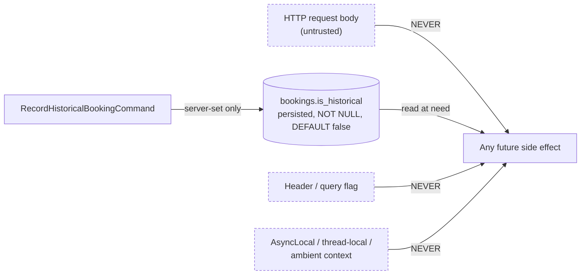
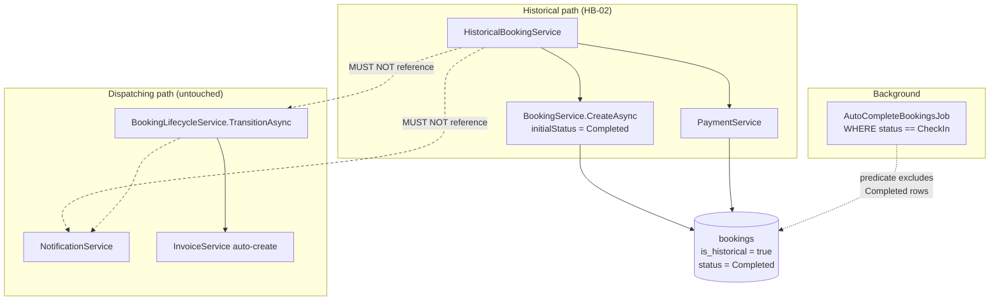
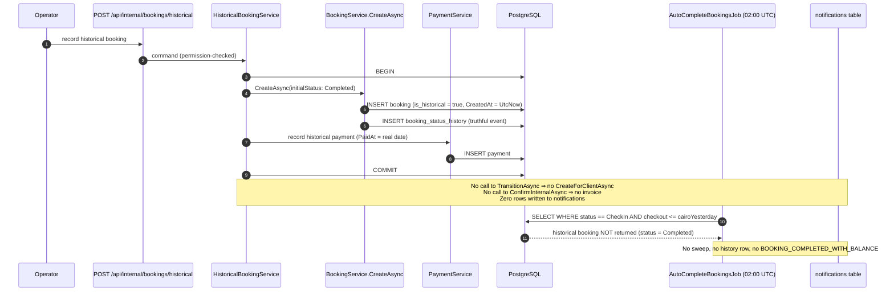

# HB-07 — Notifications, Automations and Integrations

> [README](README.md) · [Master Plan](00_MASTER_PLAN.md) · Depends on: [HB-02](02_TICKET_HISTORICAL_BOOKING_DOMAIN_AND_API.md) ·
> Related: [HB-01](01_TICKET_DISCOVERY_AND_ARCHITECTURE_DECISIONS.md), [HB-04](04_TICKET_FINANCIAL_SNAPSHOT_AND_HISTORICAL_PAYMENTS.md),
> [HB-08](08_TICKET_REPORTING_AUDIT_OBSERVABILITY_AND_ROLLOUT.md) · Consumed by: [HB-09](09_TICKET_TEST_AUTOMATION_AND_RELEASE_GATES.md)

---

## 1. Ticket metadata

| Field | Value |
|---|---|
| Ticket ID | **HB-07** |
| Title | Notifications, Automations and Integrations — side-effect matrix and suppression by construction |
| Priority | **P1** |
| Type | Backend guard rails + automated assertions + architecture documentation |
| Status | Ready for review |
| Dependencies | [HB-02](02_TICKET_HISTORICAL_BOOKING_DOMAIN_AND_API.md) (the historical command and the `is_historical` column must exist before their side-effect behaviour can be asserted) |
| Dependents | [HB-09](09_TICKET_TEST_AUTOMATION_AND_RELEASE_GATES.md) |
| Risk level | **Medium** — low implementation risk, high *reputational* risk if wrong (a notification sent to a guest about a stay that ended weeks ago) |
| Estimated complexity | **S** — the code delta is small; the value is in the enumeration, the guard rails and the tests |
| Recommended owner | Backend engineer, paired with QA for the assertion harness |
| Target branch | `feat/hb07-historical-side-effects` |
| Requirements served | REQ-12, **REQ-13**, REQ-14, REQ-02 |
| Invariants enforced | **INV-07**, INV-01, INV-05, INV-11 |
| Risks addressed | **RISK-06** |
| Scenario group | `SC-NOTIF-01` … `SC-NOTIF-12` (defined in [99_RELIABILITY_TEST_SCENARIOS.md](99_RELIABILITY_TEST_SCENARIOS.md)) |

---

## 2. Business context

A historical booking describes something that already finished. The guest checked out days or weeks before
the record exists. Every message the platform would normally send about a booking — "your booking is
confirmed", "your stay is complete", "there is an outstanding balance" — is, for a historical record, either
meaningless or actively damaging: it tells a guest about a stay they have already taken, or it raises a
finance alert about a balance that was settled in cash before the record was even created.

At the same time, the *non*-communication side effects must keep working. Revenue must post. The payout must
become eligible. The audit trail must exist. REQ-13 and REQ-14 pull in opposite directions and the boundary
between them has to be drawn precisely, in code, and proven by test rather than asserted in a comment.

---

## 3. Problem being solved

Three problems, in descending order of how much engineering attention they usually get and ascending order of
how much they actually matter here:

1. **Nobody has enumerated the side effects.** Feature briefs for this kind of work routinely assume a large
   automation surface — email templates, WhatsApp confirmations, Telegram operations alerts, payment links,
   reminder schedulers, housekeeping tasks, calendar pushes, webhooks. Without an enumeration, an
   implementation agent either suppresses too much (breaking REQ-14) or too little (breaking REQ-13).
2. **The obvious solution is the wrong solution.** The reflex design is a `suppressNotifications` flag
   threaded through the creation path. That design is weaker than what the repository already permits, and
   §11 argues the case in full.
3. **There is exactly one real trap, and it is easy to walk into.** `AutoCompleteBookingsJob` sweeps bookings
   in `CheckIn` whose checkout date has passed, flips them to `Completed`, and notifies finance admins of any
   outstanding balance. A historical booking created directly in `Completed` is outside that filter. A
   historical booking created in `CheckIn` — which a careless implementation might do, reasoning "the guest
   did check in" — would be swept the next night and **would** notify. This ticket exists mainly to make that
   mistake impossible to ship.

---

## 4. User value

| Audience | Value |
|---|---|
| Past guests | Never receive a message about a stay that already ended. |
| Finance | No spurious `BOOKING_COMPLETED_WITH_BALANCE` alert for a balance already settled offline; genuine accounting effects still occur (REQ-14). |
| Operations | A written, verified answer to "what will happen when I record this?" — surfaced in the wizard's review step ([HB-06](06_TICKET_HISTORICAL_BOOKING_WIZARD_UI.md)). |
| Engineering | A maintained matrix that any future integration must be added to, and a test suite that fails when someone forgets. |
| Security / Compliance | Assurance that no external message can be emitted for a backdated record without an explicit, authenticated, human action. |

---

## 5. Current repository behavior

All claims verified by direct read at commit `8dafb5a`.

### 5.1 The complete automation surface

`CONFIRMED`. The entire background-execution surface of the solution is one class:

- `RentalPlatform.API/Program.cs:311` — `builder.Services.AddHostedService<AutoCompleteBookingsJob>();`
- `RentalPlatform.API/Services/AutoCompleteBookingsJob.cs:11` — `public class AutoCompleteBookingsJob : BackgroundService`

A repository-wide search over `RentalPlatform.API`, `.Business`, `.Data` and `.Shared` for
`AddHostedService`, `BackgroundService` and `IHostedService` returns those two lines and nothing else.

### 5.2 No event or integration infrastructure exists

`CONFIRMED`. Searches over the same four projects for `Outbox`, `DomainEvent`, `MediatR`,
`INotificationHandler`, `IPublisher`, `Hangfire`, `Quartz`, `SmtpClient`, `MailKit`, `SendGrid`, `Twilio`,
`Telegram`, `Webhook`, `IHttpClientFactory` and `HttpClient(` return **no matches**. The three files
containing the substring `webhook` are documentation comments that explicitly disclaim the capability, e.g.
`RentalPlatform.Business/Services/ReportingNotificationsAnalyticsService.cs:18` —
*"Current-status distribution only — no provider/webhook/campaign/recipient analytics."*

This is F-04 in the [Master Plan](00_MASTER_PLAN.md#7-confirmed-repository-findings), re-verified here at a
finer grain.

### 5.3 Complete enumeration of notification-creation call sites

`CONFIRMED`. Every call to `INotificationService.CreateFor{Admin,Client,Owner}Async` in the solution:

| # | Call site | Trigger | Channel(s) | Recipient |
|---|---|---|---|---|
| 1 | `RentalPlatform.API/Controllers/InternalNotificationsController.cs:58` | Manual `POST /api/internal/notifications/admins/{id}` (`:34`) | caller-chosen | admin |
| 2 | `InternalNotificationsController.cs:77` | Manual `POST .../clients/{id}` (`:71`) | caller-chosen | client |
| 3 | `InternalNotificationsController.cs:96` | Manual `POST .../owners/{id}` (`:90`) | caller-chosen | owner |
| 4 | `RentalPlatform.API/Services/AutoCompleteBookingsJob.cs:205` | Nightly sweep, outstanding balance | `in_app` (`:13`) | finance admins |
| 5 | `RentalPlatform.Business/Services/BookingLifecycleService.cs:323` | Any status transition (`:69` → `:311`) | `in_app` (`:26`) | client |
| 6 | `RentalPlatform.Business/Services/DateBlockApprovalService.cs:579` | Owner date-block approval request | `in_app` (`:16`) | admin |
| 7 | `DateBlockApprovalService.cs:605` | Owner date-block decision (`:568-569` sends both channels) | `in_app` + `email` (`:16-17`) | owner |

**Crucially, `BookingService`, `PaymentService`, `InvoiceService` and `OwnerPayoutService` do not depend on
`INotificationService` at all.** A search for `INotificationService` / `_notificationService` across those
four files returns nothing. Booking creation, payment recording, invoice creation and payout creation are
notification-free by construction — not by configuration.

### 5.4 The only lifecycle notification is transition-gated

`CONFIRMED`. `BookingLifecycleService.cs:69`:

```csharp
await NotifyClientOfStatusChangeAsync(transitionedBooking, targetStatus, cancellationToken);
```

This line sits inside `TransitionAsync` and is the sole caller of `NotifyClientOfStatusChangeAsync`
(defined `:311`, which calls `CreateForClientAsync` at `:323`). The template is chosen at `:316-318`:
`booking_confirmed` (`:27`) when the target is `Confirmed`, otherwise `booking_status_changed` (`:28`).
`ConfirmAsync`, `CancelAsync`, `CompleteAsync`, `CheckInAsync` and `LeftEarlyAsync` are all thin wrappers
over `TransitionAsync`. **There is no path to a client notification that does not pass through
`TransitionAsync`.**

### 5.5 The invoice side effect is transition-gated too

`CONFIRMED`. `BookingLifecycleService.cs:186-200`, inside `ConfirmInternalAsync` and therefore inside
`TransitionAsync`:

- `:186-190` looks for an existing non-cancelled, non-superseded invoice
- `:194` `var draftInvoice = await _invoiceService.CreateDraftFromBookingAsync(...)` with
  `notes: "Auto-generated on confirmation"` (`:197`)
- `:199` `await _invoiceService.IssueAsync(draftInvoice.Id, cancellationToken);`

This is a side effect in every sense — it mints an invoice number that encodes the *record* date
(`InvoiceService.cs:502`, `$"INV-{DateTime.UtcNow:yyyyMMdd}"`) and sets `issued_at = UtcNow`. It belongs in
the matrix (F-10).

### 5.6 The trap: `AutoCompleteBookingsJob`

`CONFIRMED`. `RentalPlatform.API/Services/AutoCompleteBookingsJob.cs`:

| Line | Behaviour |
|---|---|
| `:17` | `RunAtUtcTime = TimeSpan.FromHours(2)` — runs daily at 02:00 UTC |
| `:18`, `:133-143` | `CairoTimeZone`, resolving `Africa/Cairo` with an `Egypt Standard Time` fallback |
| `:70` | `var completedAfterCheckoutCutoff = DateOnly.FromDateTime(cairoNow).AddDays(-1);` |
| `:73` | `TryAcquireTransactionAdvisoryLockAsync(SweepLockKey)` — single-replica guard, key `job:auto-complete-bookings` (`:15`) |
| **`:86-87`** | **`.Where(b => b.BookingStatus == BookingStatus.CheckIn).Where(b => b.CheckOutDate <= completedAfterCheckoutCutoff)`** |
| `:92-94` | Flips status to `Completed`, sets `UpdatedAt = now` |
| `:96-107` | Writes a `BookingStatusHistory` row with `ChangedByAdminUserId = null` and `Notes = BookingHistoryEvents.AutomaticCompletion` |
| `:116-117` | `SaveChangesAsync` then `CommitAsync` — the notification loop runs **after** commit |
| `:119-126`, `:145-221` | For each swept booking, `NotifyAdminsIfOutstandingBalanceAsync` |
| `:151-158` | `balanceBasis = activeInvoice?.TotalAmount ?? booking.FinalAmount` minus the sum of payments with `PaymentStatus == "paid"` (`:156-158`, `:160`) |
| `:163-164` | Returns early when `outstandingAmount <= 0` |
| `:166-179` | Recipients: active admins who are either the booking's `AssignedAdminUserId` or hold `finance:manage` via role template or a `grant` override, minus anyone with a `deny` override |
| `:205` | `CreateForAdminAsync(OutstandingBalanceTemplateCode, InAppChannel, ...)` — template `BOOKING_COMPLETED_WITH_BALANCE` (`:14`), channel `in_app` (`:13`) |

**The `:86` predicate is the whole story.** A booking created directly in `Completed` never matches it. A
booking created in `CheckIn` with a past checkout date matches it on the very next sweep — and a historical
booking whose offline cash deposit was recorded as less than the agreed amount would then produce a finance
alert about a balance that does not exist. This is why ADR-04 (create directly in `Completed`) is not merely
an audit-purity decision; it is also the notification-suppression mechanism.

### 5.7 Channels exist; delivery does not

`CONFIRMED`.

- `RentalPlatform.Business/Services/NotificationService.cs:20-23` — `AllowedChannels = { "in_app", "email", "sms", "whatsapp" }`; rejection message at `:298`.
- `db/migrations/0037_create_notifications.sql:99-100` — `ck_notifications_channel CHECK (channel IN ('in_app','email','sms','whatsapp'))`.
- `db/migrations/0037_create_notifications.sql:102-105` — `ck_notifications_status CHECK (notification_status IN ('pending','queued','sent','delivered','failed','read','cancelled'))`.
- `NotificationService.cs:394` `DetermineStatusAndTimestamps` — `in_app` rows are created already `delivered` with `sent_at = UtcNow` (`:412`); every external channel is created `pending` (`:418`) and simply sits there.
- `NotificationService.cs:388` `EnforceNoSchedulingForInApp` — `in_app` cannot carry a `scheduled_at`; external channels can, but **nothing drains scheduled rows** (§5.1: one hosted service, and it does not look at notifications).
- `RentalPlatform.Business/Services/NotificationDispatchService.cs:210-215` `AssertExternalChannel` throws for `in_app`, confirming the dispatch service governs *only* the external state machine.
- The external state machine is advanced exclusively by manual admin calls:
  `RentalPlatform.API/Controllers/NotificationDispatchController.cs:18` `[Authorize(Policy = "AdminAuthenticated")]`,
  routes at `:29` (queue), `:48` (sent), `:65` (delivered), `:82` (failed), `:100` (cancel).

**Honest conclusion:** the platform can *model* an email, SMS or WhatsApp notification, and
`DateBlockApprovalService.cs:569` actually creates one `email` row today — but no code anywhere converts a
`pending` external row into an outbound message. There is no SMTP client, no HTTP provider call, no Telegram
bot. **There is therefore nothing to suppress for email, WhatsApp, SMS or Telegram today.** That is a
statement about the present, not a guarantee about the future; see §21.4 and `RISK-06`.

### 5.8 Analytics events

`BLOCKED`. No analytics instrumentation was found. Searches across `rental-platform/` and `demo/`
(excluding `node_modules` and `.next`) for `posthog`, `mixpanel`, `segment.com`, `gtag(`, `dataLayer`,
`google-analytics`, `googletagmanager`, `amplitude`, `datadog` and `sentry` return **no matches**, and no
server-side analytics emitter exists. The claim "no analytics events fire for a historical booking" is
therefore *probably* true but is recorded as `BLOCKED` rather than `CONFIRMED`, because absence-of-grep-hit
across two Next.js applications is weaker evidence than a positive read. §10 carries the decision item.

### 5.9 Absent capabilities, stated explicitly

`CONFIRMED` by absence of any entity, table, service or migration:

| Capability the brief anticipated | Repository reality |
|---|---|
| Payment gateway / payment links | None (F-12) — `payments` records manual methods only: `cash`, `bank_transfer`, `card`, `wallet` (`db/migrations/0022_create_payments.sql:18`) |
| Housekeeping / cleaning / turnover tasks | No entity, table, service or migration |
| Calendar / iCal export or channel-manager sync | None |
| Reminder scheduler | `notifications.scheduled_at` exists as a column; no consumer exists |
| Webhooks (inbound or outbound) | None |
| Outbox / domain events / message bus | None (§5.2) |
| Email/SMS/WhatsApp/Telegram delivery | None (§5.7) |

### 5.10 Existing test-harness precedent

`CONFIRMED`. `RentalPlatform.Tests/BookingHistoryCreatorTests.cs:418` defines
`private sealed class NoOpNotificationService : INotificationService`, injected into the real
`BookingLifecycleService` at `:283-288`. The fixture builds an `AppDbContext` over
`UseInMemoryDatabase(...)` (`:225-226`). This is the exact seam HB-07 needs — but a *no-op* fake must be
upgraded to a *recording* fake, because a no-op fake cannot fail a test.

---

## 6. Target behavior

1. A complete, reviewed **side-effect matrix** (§21.1) exists in the repository and is referenced by the
   contribution guidance, so that adding a new integration forces a matrix row.
2. Recording a historical booking produces **zero** rows in `notifications`, **zero** invoices, and **zero**
   `booking_status_history` rows other than the single truthful creation event.
3. `AutoCompleteBookingsJob` provably never selects, mutates or notifies about a historical booking.
4. The accounting, payout-eligibility and reporting consequences of a historical booking are unchanged from a
   normal completed booking (REQ-14).
5. Suppression is enforced **structurally** — there is no runtime flag whose mis-setting could enable a
   notification — and there is an automated test for each matrix row whose verdict is `MUST NOT RUN`.
6. If a future side effect genuinely needs to know that a booking is historical, it reads the persisted
   `bookings.is_historical` column. It never reads a request field, a DTO property, or a thread-local.

---

## 7. In scope

- The side-effect matrix (§21.1) as a maintained repository artefact.
- Guard rails in the historical command that make the `CheckIn` mistake impossible (§17).
- A recording notification fake and the assertion harness built on it (§29).
- Tests proving `AutoCompleteBookingsJob` excludes historical bookings, including the negative case where the
  same booking in `CheckIn` *is* swept — the test must prove the filter is what protects us, not luck.
- Tests proving the accounting/audit side effects that **must** run, do run.
- The server-side derivation contract for "is this booking historical" (§11.4).
- Structured logging and a metric for the suppression assertion (§20).
- Documentation of the operator-initiated notification endpoints as a human-governed surface (§21.3).

## 8. Out of scope

- Building any notification delivery mechanism (SMTP, WhatsApp, SMS, Telegram, webhooks). Explicitly not this
  ticket, and not this feature.
- Adding a suppression flag, a `SuppressNotifications` parameter, or a notification-policy service. §11.2
  argues against all three.
- Changing `AutoCompleteBookingsJob`'s selection predicate. It is already correct; touching it adds risk.
- Changing `BookingLifecycleService`'s transition notifications for normal bookings.
- Retrofitting notification suppression onto historical bookings created before this feature exists — there
  are none, by definition.
- Replaying, backfilling or "catching up" any notification (Master Plan §5, non-goals).
- Reporting behaviour (that is [HB-08](08_TICKET_REPORTING_AUDIT_OBSERVABILITY_AND_ROLLOUT.md)).

---

## 9. Assumptions

| # | Assumption | Label | If false |
|---|---|---|---|
| A-1 | HB-02 lands the historical command creating directly in `Completed` per ADR-04 | `CONFIRMED` (ratified ADR) | This entire ticket's enforcement mechanism collapses; escalate immediately (§36) |
| A-2 | HB-02 lands `bookings.is_historical` as a persisted, server-set column | `PROPOSED` ([Master §11](00_MASTER_PLAN.md#11-proposed-data-model)) | §11.4's derivation contract needs a different anchor |
| A-3 | No notification delivery mechanism is introduced during this feature's delivery window | `INFERRED` from §5.7 | The matrix's `n/a` rows become live and must be re-verdicted before release |
| A-4 | The historical command never calls `IBookingLifecycleService` | `PROPOSED` — enforced by test `T-01` | A client notification becomes reachable |
| A-5 | Operators will not manually fire a guest notification for a historical booking via `POST /api/internal/notifications/clients/{id}` | `INFERRED` — human process, not enforceable in code | Runbook and training gap; not a code defect (§21.3) |
| A-6 | In-memory EF fixtures are sufficient for the notification assertions | `INFERRED` — these assertions need no transaction or advisory lock | Move to the relational harness that [HB-09](09_TICKET_TEST_AUTOMATION_AND_RELEASE_GATES.md) provisions ([OQ-09](00_MASTER_PLAN.md#32-open-questions)) |

---

## 10. Decision-required items

Ticket-local IDs, prefixed to avoid collision with other tickets' `D-nn` sets.

Decision authority for every row is the **Sole Project Owner** (2026-07-29). The **Review lens** column
names the perspectives applied — it is not a list of separate approvers.

| ID | Item | Reason it is open | Impact if unresolved | Recommended default | Review lens | Blocking? |
|---|---|---|---|---|---|---|
| D-HB07-01 | Should recording a historical booking notify **internal** staff (e.g. an `in_app` alert to finance that a historical booking was recorded)? | REQ-13 forbids *time-sensitive* automation; an internal record-keeping alert is neither time-sensitive nor guest-facing | Finance may be unaware of retroactive revenue until reconciliation | **No notification in v1.** The audit event (§20) and the reporting dimension (HB-08) already surface it; adding an alert adds a dispatch path we would then have to defend | Product · Finance | No |
| D-HB07-02 | Should a historical booking be excluded from *future* notification features by default, or opted in? | No policy exists because no such features exist | A future developer guesses | **Exclude by default.** Any future dispatcher must check `is_historical` and skip unless the feature is explicitly declared historical-safe | Engineering | No |
| D-HB07-03 | Is the §5.8 analytics conclusion accepted as `BLOCKED`, or must a positive audit be performed? | Grep-absence over two Next.js apps is weak evidence | A tracking call could exist in an unscanned build-time config | **Accept as BLOCKED**; add a 30-minute positive audit task (§26 task 2) rather than blocking the ticket | Engineering | No |
| D-HB07-04 | Where does the matrix live so it cannot rot — this document only, or also a checklist in the PR template / `CONTRIBUTING`? | Documents that live only in a plan folder are not consulted at review time | The matrix decays the first time someone adds an integration | **Both.** Keep §21.1 canonical; add a one-line PR-template checkbox pointing at it | Engineering | No |
| D-HB07-05 | Should the "no notification" fact be shown to the operator in the wizard review step? | It is a user-visible consequence of the feature | Operator surprise; support tickets | **Yes** — already specified as a mandatory review-step warning in [Master §17](00_MASTER_PLAN.md#17-uiux-flow); HB-07 supplies the wording, [HB-06](06_TICKET_HISTORICAL_BOOKING_WIZARD_UI.md) renders it | Product | No |

---

## 11. Architecture and technical design

### 11.1 The headline finding

`CONFIRMED`. The side-effect surface of KAZA Booking is remarkably small, and every automated side effect is
reachable only through code paths the historical flow does not use:

```
Client notification   ⟵ NotifyClientOfStatusChangeAsync (:311) ⟵ TransitionAsync (:69)
Invoice auto-create   ⟵ ConfirmInternalAsync (:186-200)        ⟵ TransitionAsync
Finance balance alert ⟵ NotifyAdminsIfOutstandingBalance (:145) ⟵ sweep loop (:119-126)
Automatic completion  ⟵ sweep query (:86-87) filtered on BookingStatus == CheckIn
```

The historical command calls `BookingService.CreateAsync` with `initialStatus: Completed` (F-06,
`BookingService.cs:140`, `:217`). It does not call `TransitionAsync`. Its booking never holds `CheckIn`.
Therefore none of the four arrows above can be traversed.

### 11.2 Why suppression by construction beats a suppression flag

This is the central architectural argument of the ticket.

| Property | Flag (`suppressNotifications: true`) | Construction (no dispatch on the path) |
|---|---|---|
| Can be forgotten on a new call site | **Yes** — every new caller must remember to pass it | No — a new caller of `CreateAsync` inherits the absence of dispatch |
| Can be mis-set (inverted, defaulted wrong) | **Yes** — `false` is a plausible default and silently wrong | No — there is no value to set |
| Can be bypassed by an untrusted caller | **Yes** if it ever reaches the DTO; a boolean in a request body is not an authorization decision (ADR-01) | No — there is no parameter to send |
| Survives a refactor that reorders parameters | Weakly — positional/optional booleans are refactor-hostile | Yes — nothing to preserve |
| Testable | Requires asserting the flag *and* the behaviour, two things that can drift | Assert the behaviour only |
| Failure mode | **Silent and outbound** — a message reaches a real guest | Compile error or an obviously missing feature |
| Review cost | Every PR touching creation must be checked for flag correctness | Zero |

A flag is a *runtime* control over a *structural* property. It converts "this code cannot send a message"
into "this code will not send a message if a boolean is right", which is strictly weaker. The repository
already gives us the stronger form for free, and ADR-01 already rejects the client-facing variant of the same
idea (`allowPastDates`). HB-07 adopts the same reasoning for suppression:

> **Design rule (HB-07).** Historical suppression is achieved by *not composing* the services that dispatch.
> No parameter, DTO field, header, configuration key or thread-local expresses "suppress notifications".

The cost of this choice is that suppression is invisible in the code — there is no line to point at. That is
precisely why the deliverable is a *matrix plus tests* rather than a mechanism: the tests are the visible
artefact that proves the invisible property, and the matrix is the artefact that keeps it true.

### 11.3 What HB-07 actually ships

Because suppression needs no mechanism, the shipped code is small and defensive:

| Item | Nature | Purpose |
|---|---|---|
| Status guard in the historical command | 3-line assertion | Reject any attempt to create a historical booking in a status other than `Completed`; makes the §5.6 trap unreachable |
| Composition guard | Constructor/DI assertion or an architecture test | `HistoricalBookingService` must not depend on `IBookingLifecycleService` or `INotificationService` |
| `RecordingNotificationService` test double | Test infrastructure | Upgrades `NoOpNotificationService` (`BookingHistoryCreatorTests.cs:418`) to one that records and can be asserted empty |
| Sweep-exclusion tests | Tests | Prove the `:86-87` filter is what protects historical records |
| Positive side-effect tests | Tests | Prove audit, payout eligibility and reporting inputs still happen (REQ-14) |
| The matrix | Documentation + PR checklist | Keeps the property true over time |
| One metric + one structured log line | Observability | Detects a violation in production, not just in CI |

### 11.4 How historical mode travels server-side

`PROPOSED`. If a future side effect legitimately needs to behave differently for a historical booking, it
obtains that fact from exactly one place:



Rules:

1. `is_historical` is set by the server inside `HistoricalBookingService`, derived from *which command was
   invoked*, never from a caller-supplied value. The normal `CreateBookingRequest` DTO must not gain the
   field (mass-assignment control, [Master §18](00_MASTER_PLAN.md#18-security-and-compliance-review)).
2. Any consumer reads it from the persisted row, after commit. Reading a request object would reintroduce
   the flag problem through the back door.
3. An ambient/thread-local "historical context" is explicitly rejected: it leaks across async boundaries, is
   invisible at the call site, and cannot be reconstructed when a background job processes the row later.
4. A consumer that cannot see the persisted row (because it runs before commit) must not exist — see §18.

### 11.5 Component boundary



The two dotted "MUST NOT reference" edges are the whole design. They are enforced by an architecture test
(§29, `T-09`), not by a code comment.

---

## 12. Expected data flow



---

## 13. Expected files/components likely to change

`PROPOSED` — listed as likely, not asserted as required. The implementer confirms before editing.

| Path | Likely change | Why |
|---|---|---|
| `RentalPlatform.Business/Services/HistoricalBookingService.cs` *(new in HB-02)* | Add the `Completed`-only status guard (§17 V-H1) and keep its constructor free of `IBookingLifecycleService` / `INotificationService` | §11.3 |
| `RentalPlatform.Tests/HistoricalBookingSideEffectTests.cs` *(new)* | The `T-01` … `T-09` suite | §29 |
| `RentalPlatform.Tests/` shared test infrastructure | Promote `NoOpNotificationService` (`BookingHistoryCreatorTests.cs:418`) into a shared `RecordingNotificationService` | §5.10 |
| `RentalPlatform.API/Services/AutoCompleteBookingsJob.cs` | **Prefer no change.** If HB-01's shared Cairo resolver refactor lands here, HB-07 only adds tests around it | §8 |
| `docs/plans/historical-bookings/07_…` (this file) | The canonical matrix | D-HB07-04 |
| `.github/pull_request_template.md` *(if one exists)* | One checkbox: "new side effect? update the HB-07 matrix" | D-HB07-04 |
| `rental-platform/components/admin/bookings/…` historical wizard review step | The "no notifications will be sent" warning copy | D-HB07-05, rendered by HB-06 |

**No change expected** to `BookingService.cs`, `BookingLifecycleService.cs`, `NotificationService.cs`,
`NotificationDispatchService.cs`, `InvoiceService.cs`, `PaymentService.cs`, `OwnerPayoutService.cs`, any
migration, or any notification template.

---

## 14. API changes

**None.** HB-07 adds no endpoint, no field, no header and no status code.

| Surface | Change |
|---|---|
| `POST /api/internal/bookings/historical` (HB-02) | No new request or response field. Specifically, **no** `suppressNotifications`, `sendNotifications`, `silent` or `notifyGuest` field is added — §11.2 |
| `POST /api/internal/bookings` | Unchanged |
| `POST /api/internal/notifications/*` | Unchanged; documented in §21.3 as a human-governed surface |
| `POST /api/internal/notifications/{id}/queue|sent|delivered|failed|cancel` | Unchanged |
| Response contracts | Unchanged. `is_historical` is exposed by HB-02, not here |

---

## 15. Data/schema changes

**None in this ticket.** No migration is authored, and none is required.

| Concept | Home | Status |
|---|---|---|
| Notification-suppression marker | — | **NOT REQUIRED** — [Master §11](00_MASTER_PLAN.md#11-proposed-data-model) already records this verdict; suppression is structural |
| `bookings.is_historical` | HB-02's migration | Consumed read-only by any future historical-aware side effect (§11.4) |
| `notifications` table | `db/migrations/0037_create_notifications.sql` | Untouched; no new channel, status or template |
| Notification templates | `db/migrations/0036_create_notification_templates.sql` | No new template seeded (D-HB07-01 default is "no internal alert") |

---

## 16. Authorization and security

| Concern | Position |
|---|---|
| Can a caller force a notification? | No. There is no parameter to set (§11.2), and `BookingService`/`PaymentService` hold no `INotificationService` reference (§5.3). |
| Can a caller *suppress* a notification that should fire? | Not via this feature. The normal flow is untouched; `TransitionAsync` still notifies. |
| Manual notification endpoints | `InternalNotificationsController.cs:19` and `NotificationDispatchController.cs:18` are both `[Authorize(Policy = "AdminAuthenticated")]`. An authenticated admin can create and dispatch an arbitrary notification for any recipient. This is pre-existing behaviour, **not** widened by HB-07, but it is the one way a guest could be messaged about a historical stay — hence A-5 and §21.3. |
| Should those endpoints be permission-gated more tightly? | `INFERRED` gap — they are gated on *authentication*, not on a `PermissionKeys` policy, unlike `BookingsController.cs:98,119,140`. HB-07 **records** this observation and does not change it: tightening an existing endpoint's authorization is out of scope and would be a separate security ticket. Flagged for [HB-08](08_TICKET_REPORTING_AUDIT_OBSERVABILITY_AND_ROLLOUT.md) rollout review. |
| PII in logs | The suppression log line (§20) carries booking id, unit id and actor id only. No guest name, phone or email — `NotifyAdminsIfOutstandingBalanceAsync` puts `client_name` into notification variables (`:195`), which is exactly the kind of value that must never reach a log. |
| Actor integrity | Unchanged: the truthful creation history row takes `ChangedByAdminUserId` from the authenticated principal (`BookingService.cs:248`), never from the request (INV-11). |

---

## 17. Validation rules

Ticket-local validation IDs, feeding the [Master §13](00_MASTER_PLAN.md#13-validation-matrix) set.

| ID | Rule | Layer | Failure | Rationale |
|---|---|---|---|---|
| V-H1 | The historical command may create a booking **only** in `BookingStatus.Completed` | `HistoricalBookingService`, before `CreateAsync` | `500`/internal invariant violation — this is a programming error, not user input, so it must never be reachable from a request | Closes the §5.6 trap at the source (ADR-04) |
| V-H2 | The historical command must not resolve `IBookingLifecycleService` or `INotificationService` | Architecture test + DI graph | Build/test failure | §11.5 |
| V-H3 | A historical booking must never be persisted with `BookingStatus == CheckIn` | Test assertion; optionally a `CHECK` deferred to HB-02's migration | Test failure | Defence in depth for V-H1 |
| V-H4 | `is_historical` must not appear on any request DTO | Contract test / code review | Test failure | §11.4 rule 1, mass-assignment control |
| V-H5 | No `notifications` row may reference a historical booking created by the command | Integration assertion | Test failure | INV-07 |

V-H1's failure mode deserves a note: it is deliberately **not** a `400`. A `400` implies the caller could
legitimately have asked for another status. No caller can — the status is chosen by the server. A guard that
returns `400` invites someone to eventually make it configurable.

---

## 18. Transaction and failure behavior

| Aspect | Behaviour |
|---|---|
| Historical creation | One transaction (INV-05, HB-02): booking + status history + optional payment commit together. HB-07 adds nothing to this boundary. |
| Notification creation inside a transaction | Does not occur, because no notification is created. Worth stating because the existing precedent is deliberate: `AutoCompleteBookingsJob` commits at `:117` and only then loops the notification calls at `:119-126`, so a notification failure cannot roll back the status change. |
| Notification failure handling elsewhere | Both existing dispatch sites swallow domain exceptions and log a warning — `BookingLifecycleService.cs:330-338` and `AutoCompleteBookingsJob.cs:213-220` catch `NotFoundException`/`BusinessValidationException`/`ConflictException`. A future historical-aware side effect must follow the same rule: **never let a side-effect failure fail the business operation.** |
| Rollback | If the historical transaction rolls back, there is nothing to compensate — no message was queued, no invoice minted, no external system called. This is a direct benefit of the absent integration surface. |
| Partial failure | Not possible for side effects, because there are none on the path. |
| Job failure | `AutoCompleteBookingsJob` wraps the whole sweep in try/catch at `:46-49` and logs; a failure leaves historical bookings equally untouched. |

---

## 19. Idempotency and concurrency

| Aspect | Behaviour |
|---|---|
| Sweep re-run | `AutoCompleteBookingsJob` is naturally idempotent for historical bookings: they are never selected, so re-running the sweep any number of times produces zero effect on them (`:86-87`). |
| Multi-replica | `:73` `TryAcquireTransactionAdvisoryLockAsync("job:auto-complete-bookings")` ensures one replica sweeps; irrelevant to historical bookings but relevant to the test that asserts *normal* sweep behaviour is unchanged. |
| Duplicate historical creation | Handled by [HB-03](03_TICKET_AVAILABILITY_CONFLICTS_AND_DUPLICATE_PROTECTION.md). Its side-effect consequence is trivially benign: a blocked duplicate creates no booking and therefore no notification. |
| Retry of a failed historical creation | Safe from a side-effect standpoint — no partially-emitted message can exist, because no message is emitted. |
| Concurrent manual notification | An admin could manually notify a client at the same moment a historical booking is recorded. Unrelated code paths; no interaction. |
| Ordering | No ordering guarantees are needed because there is no queue. |

---

## 20. Audit and observability

### 20.1 The truthful-audit precedent

`CONFIRMED`. `AutoCompleteBookingsJob.cs:96-107` writes a `BookingStatusHistory` row with
`ChangedByAdminUserId = null` and `Notes = BookingHistoryEvents.AutomaticCompletion` — the constant text at
`RentalPlatform.Shared/Constants/BookingHistoryEvents.cs:7-8`:

> *"Automatically completed on the first scheduled sweep after the checkout day ended in Cairo."*

This is the platform's existing pattern for a **system-generated, truthful, self-describing audit entry**: a
null actor where no human acted, and a note that explains the cause rather than pretending a transition
happened. [HB-02](02_TICKET_HISTORICAL_BOOKING_DOMAIN_AND_API.md) mirrors it for the historical case — one
row, `OldStatus = null`, `NewStatus = completed`, a real `ChangedByAdminUserId`, and a note such as
`"Historical booking recorded"` added to `BookingHistoryEvents` alongside `BookingCreated` (`:5`). HB-07 does
not own that constant; it owns the assertion that **exactly one** such row exists and no others.

### 20.2 Signals owned by HB-07

| Signal | Shape | Purpose |
|---|---|---|
| Metric | `historical_booking_side_effects_suppressed_total` | Increments once per historical creation. A counter that stays at zero while `historical_booking_created_total` climbs indicates the instrumentation itself is broken |
| Metric | `historical_booking_notification_violation_total` | **Must always be zero.** Incremented by the post-commit assertion below. Any non-zero value pages |
| Post-commit assertion (`PROPOSED`, cheap) | After the historical transaction commits, count `notifications` rows created in the request scope for the booking's recipients. Non-zero ⇒ log `error` + increment the violation metric | Detects in production what §29 detects in CI |
| Structured log | `historical_booking.recorded` — booking id, unit id, actor id, `is_historical=true`, `status=completed`, `side_effects_suppressed=[client_notification, invoice_autocreate, autocomplete_sweep, balance_alert]` | Makes the matrix verdict observable per record. **No PII** |
| Dashboard panel | `notifications` created per day, split by template, annotated with historical-booking creations | A visual correlation check during the pilot week ([Master §22](00_MASTER_PLAN.md#22-rollout-strategy)) |

`DECISION REQUIRED` — whether the post-commit assertion is worth its cost is genuinely arguable: it is a
query that exists only to prove a negative. Recommended default: **include it during the pilot, behind the
existing logging configuration, and keep it** — it is one indexed count against `notifications` per
historical creation, and historical creations are rare by nature.

---

## 21. Notification/side-effect behavior

### 21.1 THE SIDE-EFFECT MATRIX

Canonical. Any new side effect added to KAZA Booking must gain a row here (D-HB07-04).
"Sync or queued" describes how the effect is emitted today; "n/a" means the capability does not exist.

| # | Side effect | Trigger (path:line) | Channel | Recipient | Sync or queued | Verdict | Enforcement mechanism | Test that proves it |
|---|---|---|---|---|---|---|---|---|
| S-01 | Client status-change notification (`booking_status_changed`) | `BookingLifecycleService.cs:69` → `:311` → `:323`; template `:28` | `in_app` (`:26`) — created already `delivered` (`NotificationService.cs:412`) | Client | Sync, inline | **MUST NOT RUN** | By construction: historical never calls `TransitionAsync`; `HistoricalBookingService` holds no `IBookingLifecycleService` reference | `T-01`, `T-09` |
| S-02 | Client booking-confirmed notification (`booking_confirmed`) | `BookingLifecycleService.cs:69`; template selected `:316-318`, constant `:27` | `in_app` | Client | Sync, inline | **MUST NOT RUN** | Same as S-01 — `Confirmed` is never a historical status | `T-01`, `T-09` |
| S-03 | Invoice draft auto-create + issue | `BookingLifecycleService.cs:186-200` (`:194` create, `:199` issue) | n/a (DB write; number encodes record date, `InvoiceService.cs:502`) | Finance / client | Sync, in transaction | **MUST NOT RUN implicitly** | Reachable only from `ConfirmInternalAsync` inside `TransitionAsync`, which the historical flow never calls. The historical command does not create one deliberately either — [D-INV-01](DECISION_RATIFICATION_PACKET.md#d-inv-01--invoice-policy) is `OWNER APPROVED` for no invoice in v1. Explicit invoice creation for a completed booking remains available to Finance at any time via `POST /api/internal/invoices/drafts` (F-10) | `T-02` |
| S-04 | Automatic completion sweep (status mutation) | `Program.cs:311` registration; `AutoCompleteBookingsJob.cs:86-87` predicate; `:92-94` mutation | n/a | n/a | Queued — daily 02:00 UTC (`:17`) | **MUST NOT RUN** | Predicate requires `BookingStatus == CheckIn`; ADR-04 creates historical bookings in `Completed`, permanently outside the filter | **`T-03`** (both directions) |
| S-05 | Automatic-completion audit row (`AutomaticCompletion`) | `AutoCompleteBookingsJob.cs:96-107` | n/a | Audit trail | Queued | **MUST NOT RUN** | Consequence of S-04. Historical records carry their own truthful event instead (§20.1) | `T-03`, `T-05` |
| S-06 | Outstanding-balance finance alert (`BOOKING_COMPLETED_WITH_BALANCE`) | `AutoCompleteBookingsJob.cs:145-221`, creation at `:205`, template `:14` | `in_app` (`:13`) | Active admins holding `finance:manage` (`:166-179`) plus the assigned admin | Sync within the job, **after** commit (`:117` → `:119-126`) | **MUST NOT RUN** | Only invoked for bookings the S-04 sweep selected. A historical booking with an unpaid remainder would otherwise generate a false finance alert | **`T-04`** |
| S-07 | Truthful creation audit row | `BookingService.cs:242-253`; note constant from `BookingHistoryEvents.cs` | n/a | Audit trail | Sync, in transaction | **MUST RUN** | Written unconditionally by `CreateAsync`; HB-02 supplies the historical note text | `T-05` |
| S-08 | Owner date-block approval / decision notifications | `DateBlockApprovalService.cs:568-569`, `:579` (admin), `:605` (owner) | `in_app` (`:16`) + `email` (`:17`) | Owner, admins | Sync, inline | **MUST NOT RUN** | Unreachable: not on any booking-creation path; `DateBlockApprovalService` is not a dependency of `BookingService`, `PaymentService` or the historical command | `T-06` (asserts *zero* notification rows of *any* template) |
| S-09 | Manual notification creation | `InternalNotificationsController.cs:34`/`:58`, `:71`/`:77`, `:90`/`:96` | Caller-chosen: `in_app`, `email`, `sms`, `whatsapp` | Any | Sync, human-initiated | **DECISION REQUIRED** → resolved as *human-governed*, see §21.3 | Not code-enforceable — an authenticated admin can always send a message. Governed by the operator runbook and the wizard warning (D-HB07-05) | `T-07` (documentation assertion only; no automated test is possible or appropriate) |
| S-10 | External-channel dispatch state machine (queue → sent → delivered / failed / cancelled) | `NotificationDispatchController.cs:29,48,65,82,100` → `NotificationDispatchService.cs:32,61,104,148` | `email`, `sms`, `whatsapp` (`AssertExternalChannel` `:210-215` rejects `in_app`) | Any | Manual, admin-driven | **MUST NOT RUN** | Vacuous: historical creation produces no notification row, so there is nothing for the state machine to advance | `T-01`, `T-06` |
| S-11 | Actual outbound delivery — email, WhatsApp, SMS, Telegram | **Does not exist** (§5.7) | — | — | — | **MUST NOT RUN** (vacuously) | No SMTP client, no provider SDK, no HTTP call anywhere in the solution | `T-08` (architecture test asserting continued absence) |
| S-12 | Payment receipt / payment-recorded notification | **Does not exist** — `PaymentService` has no `INotificationService` dependency (§5.3) | — | — | — | **MUST NOT RUN** (vacuously) | By construction | `T-08` |
| S-13 | Payment gateway call / payment link generation | **Does not exist** (F-12) | — | — | — | **MUST NOT RUN** (vacuously) | No integration in the codebase; `payments` supports manual methods only (`0022_create_payments.sql:18`) | `T-08` |
| S-14 | Owner payout notification | **Does not exist** — `OwnerPayoutService` has no `INotificationService` dependency (§5.3) | — | — | — | **MUST NOT RUN** (vacuously) | By construction. Payout *eligibility* still changes — see S-17 | `T-08` |
| S-15 | Outbox drain / domain-event publication / message bus | **Does not exist** (F-04, §5.2) | — | — | — | **MUST NOT RUN** (vacuously) | No such infrastructure | `T-08` |
| S-16 | Outbound webhooks | **Does not exist** (§5.2) | — | — | — | **MUST NOT RUN** (vacuously) | No such infrastructure | `T-08` |
| S-17 | Housekeeping / cleaning / turnover task creation | **Does not exist** (§5.9) | — | — | — | **MUST NOT RUN** (vacuously) | No entity, table, service or migration | `T-08` |
| S-18 | Calendar / iCal export / channel-manager push | **Does not exist** (§5.9) | — | — | — | **MUST NOT RUN** (vacuously) | No such capability | `T-08` |
| S-19 | Scheduled reminders | `notifications.scheduled_at` exists; `NotificationService.cs:388` forbids it for `in_app`; **no consumer drains scheduled rows** | `email`/`sms`/`whatsapp` in principle | Any | Queued in principle, never executed | **MUST NOT RUN** | Vacuous today (§5.1: one hosted service, and it never queries `notifications`); becomes live the day a scheduler is added — see §21.4 | `T-08` |
| S-20 | Product analytics events | Not found (§5.8) | — | — | — | **BLOCKED** — cannot be `CONFIRMED` from grep-absence alone | None required if the absence holds | `T-10` (positive audit, one-off, D-HB07-03) |
| S-21 | Owner payout eligibility | `FinanceEligibleStatuses` includes `Completed` and `LeftEarly` (`BookingStatusTransitions.cs:61-70`); payout rows created explicitly by `OwnerPayoutService.cs:107-123` | n/a | Owner accounting | Sync, on explicit request | **MUST RUN** | Automatic consequence of the `Completed` status; nothing to add. Owned by [HB-05](05_TICKET_OWNER_ACCOUNTING_AND_SETTLEMENT_ADJUSTMENTS.md) | `T-11` |
| S-22 | Reporting view refresh / revenue attribution | Views over `bookings` (`0041_…:49`, `0042_…:65,87`) | n/a | Reports | Automatic (SQL views) | **MUST RUN** | Automatic; the *bucketing* problem is F-09 and belongs to [HB-08](08_TICKET_REPORTING_AUDIT_OBSERVABILITY_AND_ROLLOUT.md) | `T-12` |
| S-23 | Availability / occupancy visibility | `UnitAvailabilityService.cs:48-74` queries only holding + soft-hold statuses (F-02) | n/a | Availability | Sync, on query | **HISTORICAL-AWARE** | A `Completed` historical booking is invisible to *future* availability (correct) but must be visible to *historical* conflict detection (ADR-10). Owned by [HB-03](03_TICKET_AVAILABILITY_CONFLICTS_AND_DUPLICATE_PROTECTION.md); storefront visibility is [OQ-10](00_MASTER_PLAN.md#32-open-questions) | HB-03's suite |

### 21.2 Verdict counts

The matrix in §21.1 has **23 rows**, `S-01` … `S-23`. Every row carries exactly one verdict and the counts
below sum to 23. Any row added to §21.1 must be added here in the same commit.

| Verdict | Count | Rows | Notes |
|---|---|---|---|
| MUST NOT RUN | **17** | S-01…S-06, S-08, S-10…S-19 | Includes the `MUST NOT RUN implicitly` variant (S-03) and the `(vacuously)` variants. Breakdown below |
| MUST RUN | 3 | S-07, S-21, S-22 | The REQ-14 side of the boundary |
| HISTORICAL-AWARE | 1 | S-23 | Delegated to HB-03 / HB-08 |
| DECISION REQUIRED | 1 | S-09 | Resolved as human-governed, §21.3 |
| BLOCKED | 1 | S-20 | §5.8 |
| **Total** | **23** | S-01…S-23 | Matches the row count of §21.1 exactly |

Breakdown of the 17 `MUST NOT RUN` rows, so the number is not mistaken for 17 live hazards:

| Class | Count | Rows | Meaning |
|---|---|---|---|
| Vacuous — the capability does not exist at all | 8 | S-11…S-18 | Nothing to suppress; `T-08` asserts continued absence |
| Vacuous by consequence — the code exists but has no input | 2 | S-10, S-19 | The dispatch state machine and the scheduled-reminder column exist, but historical creation produces no notification row for either to act on |
| Unreachable from any booking-creation path | 1 | S-08 | `DateBlockApprovalService` is not a dependency of `BookingService`, `PaymentService` or the historical command |
| **Live hazard — existing code that could fire** | **6** | S-01…S-06 | The real risk surface |
| **Total** | **17** | | |

**The live hazard is six rows forming three concerns**, all gated on either `TransitionAsync` or
`BookingStatus == CheckIn`: the two client lifecycle notifications (S-01, S-02), the implicit invoice
auto-create (S-03), and the automatic-completion job cluster (S-04, S-05, S-06). That is the entire risk
surface, and each of the three concerns is closed by construction rather than by a suppression flag.

### 21.3 The human-governed surface (S-09)

`CONFIRMED` and honestly stated: an authenticated admin can, at any time, `POST` to
`/api/internal/notifications/clients/{clientId}` and send a `booking_status_changed` notification to a guest
about a historical booking. No code change can prevent this without removing a legitimate operator
capability. HB-07 therefore treats it as a **process control**, not a technical control:

1. The wizard's review step states plainly that no notifications will be sent (D-HB07-05).
2. The operator runbook ([Master §22](00_MASTER_PLAN.md#22-rollout-strategy), support checklist) adds:
   *"Do not manually send guest notifications for a historical booking. The stay has already ended."*
3. §20's dashboard panel makes an anomalous manual send visible during the pilot.

Stating this openly is better than implying the matrix is airtight. It is airtight for *automation*; it is
not, and cannot be, airtight for *deliberate human action*.

### 21.4 Forward-looking risk: the day delivery is implemented

`PROPOSED`, and the most important thing in this ticket after §11.2.

Today, S-11's verdict is vacuous. The moment someone implements email or WhatsApp delivery — most plausibly
a background worker draining `notifications` where `notification_status = 'pending'` and
`channel != 'in_app'` — several rows in this matrix change meaning:

| Row | Today | After a delivery worker exists |
|---|---|---|
| S-10 | Nothing to dispatch | Rows would be dispatched automatically rather than by manual admin action |
| S-11 | No mechanism | Live outbound messages |
| S-19 | `scheduled_at` inert | Scheduled sends become real |
| S-08 | Creates an inert `email` row (`DateBlockApprovalService.cs:569`) | That row becomes a real email — proof that inert rows already exist in production data |

Historical bookings remain safe even then, because they create **no notification rows at all** — a delivery
worker that drains rows finds nothing to drain. That is suppression by construction paying off a second
time. But the guarantee is contingent on nobody adding a notification to the historical creation path, which
is exactly what the matrix and `T-09` exist to prevent.

**Mandatory follow-up condition:** any PR that introduces a delivery mechanism must re-verdict rows S-10,
S-11, S-19 and S-08 in this matrix and add a `is_historical` check to the dispatcher per D-HB07-02. This
condition is recorded in §37 and belongs in the engineering handbook, not only here.

---

## 22. Reporting/accounting impact

HB-07 changes no reporting or accounting behaviour. It **asserts** that the REQ-14 effects survive:

| Effect | Must it happen for a historical booking? | Why it does | Owner |
|---|---|---|---|
| Booking row visible to reporting views | Yes | Views select from `bookings` unconditionally (`0041_…:49`) | HB-08 |
| Revenue attributed | Yes — with the F-09 bucketing caveat | `DATE(b.created_at)` places it in the recorded-date bucket; the stay-period dimension is ADR-11 | HB-08 |
| Payment counted as paid money | Yes | `payments` with `PaymentStatus == "paid"`; owner-portal read models join via `invoice_id`, so an unlinked payment may be excluded (F-09) | HB-04 |
| Payout eligibility | Yes | `FinanceEligibleStatuses` includes `Completed` (`BookingStatusTransitions.cs:61-70`) | HB-05 |
| Outstanding-balance computation | Yes, as data | The formula `(invoice.TotalAmount ?? FinalAmount) − Σ paid` still evaluates correctly. What must **not** happen is the *alert* about it (S-06) | HB-04 / HB-07 |
| Invoice | Not automatically | S-03; explicit creation only | HB-04 |

The distinction the matrix draws is between **computing a financial fact** (must happen) and **telling
someone about it** (must not). S-06 is the only place those two are coupled in the current codebase, and the
coupling is broken by the `CheckIn` filter rather than by anything HB-07 writes.

---

## 23. Backward compatibility

| Surface | Impact |
|---|---|
| Existing bookings | None. No data is read, written or migrated |
| Normal booking flow | None. `TransitionAsync` still notifies exactly as before |
| `AutoCompleteBookingsJob` | None — preferably not touched at all (§13). If HB-01's Cairo-resolver refactor lands, HB-07's `T-03` becomes an additional behaviour-equivalence guard |
| Notification templates / channels | None. No template seeded, no channel added |
| Existing notification rows | None |
| API consumers | None — §14 |
| Old frontend + new backend | Safe |
| New frontend + old backend | Safe — the wizard warning is static copy |
| Future delivery mechanism | §21.4 imposes a re-verdict obligation, not a breaking change |

---

## 24. Migration and rollout plan

No schema migration. No data migration. No seed.

| Step | Action | Gate |
|---|---|---|
| 1 | Merge after HB-02 so the historical command exists to assert against | HB-02 merged |
| 2 | Run the `T-01`…`T-12` suite in CI | All green |
| 3 | Deploy with the backend that carries HB-02 — no independent deployment artefact | — |
| 4 | During the pilot week ([Master §22](00_MASTER_PLAN.md#22-rollout-strategy)), run the §20 dashboard check daily: notification rows created vs historical bookings recorded | Zero correlation |
| 5 | Verify on staging that the 02:00 UTC sweep runs and leaves historical bookings untouched — check `booking_status_history` for any `AutomaticCompletion` row against a historical booking id | Zero rows |
| 6 | Publish the operator runbook line from §21.3 | Ops sign-off |

Step 5 is the only rollout step that cannot be fully simulated in CI, because it depends on a real scheduled
execution crossing a real Cairo date boundary. It must be performed on staging with a seeded historical
booking whose checkout date is in the past.

---

## 25. Feature flag strategy

`PROPOSED`: **no feature flag, and deliberately so.**

A flag controlling notification behaviour would be the same mistake as a suppression parameter, one layer
further out: it would create a configuration in which historical bookings *do* notify, and that configuration
would eventually be enabled by accident in some environment. §11.2's argument applies verbatim.

| Control | Used? | Reason |
|---|---|---|
| Runtime feature flag | No | Would create a "notifications on for historical bookings" state that must never exist |
| Permission gate | Inherited | `bookings:record_historical` already gates the whole flow ([Master §22](00_MASTER_PLAN.md#22-rollout-strategy): "the permission *is* the flag") |
| Release ordering | Yes | HB-07 merges after HB-02 |
| Config kill switch | No | There is nothing to switch off; the effects are absent, not disabled |

The only configurable element is the §20 post-commit assertion, which is observability and can be governed by
the existing logging configuration.

---

## 26. Detailed implementation tasks

Ordered. Each is independently checkable.

1. **Re-verify §5 against `HEAD`.** Re-run the enumeration of `CreateFor*Async` call sites and
   `AddHostedService` registrations. If either set differs from §5.1/§5.3, stop and escalate (§36).
2. **Positive analytics audit** (D-HB07-03). Read `rental-platform/app/layout.tsx`, `demo/src/app/layout.tsx`,
   `next.config.*` and any `_document`/instrumentation file for injected third-party scripts. Record the
   outcome as `CONFIRMED` or leave S-20 `BLOCKED` with the evidence attached.
3. **Promote the test double.** Extract `NoOpNotificationService`
   (`RentalPlatform.Tests/BookingHistoryCreatorTests.cs:418`) into a shared
   `RecordingNotificationService` that appends every `CreateFor{Admin,Client,Owner}Async` call to a public
   list. Re-point `BookingHistoryCreatorTests` at it and confirm the existing 33 tests still pass.
4. **Add the V-H1 status guard** to `HistoricalBookingService`: assert the resolved initial status is
   `BookingStatus.Completed` before calling `CreateAsync`, throwing an invariant-violation exception (not a
   `BusinessValidationException` — see §17).
5. **Write `T-01`** — record a historical booking with the recording fake injected; assert the recorded call
   list is empty and the `notifications` set in the fixture context is empty.
6. **Write `T-02`** — assert no `Invoice` row exists for the historical booking after creation.
7. **Write `T-03`** — the trap test, in two halves:
   (a) seed a historical booking (`Completed`, past checkout), run the sweep, assert it is untouched and no
   `AutomaticCompletion` history row exists;
   (b) seed an *otherwise identical* booking in `CheckIn`, run the sweep, assert it **is** completed and
   **does** produce the history row. Half (b) is what proves the filter — not luck — protects us.
8. **Write `T-04`** — seed a historical booking with `FinalAmount` greater than the sum of paid payments
   (i.e. a genuine outstanding balance), run the sweep, assert **zero** `BOOKING_COMPLETED_WITH_BALANCE`
   notifications. Include an active admin holding `finance:manage` in the fixture, so the test would fail if
   the booking were swept.
9. **Write `T-05`** — assert exactly one `BookingStatusHistory` row exists, with `OldStatus == null`,
   `NewStatus == "completed"`, a non-null `ChangedByAdminUserId`, and the historical note constant.
10. **Write `T-06`** — assert the total `notifications` row count in the fixture is zero after the whole
    historical flow including payment recording, regardless of template.
11. **Write `T-08`** — an architecture/guard test asserting the continued absence of delivery
    infrastructure: no type in the loaded assemblies implements or references `SmtpClient`, `HttpClient`,
    `IHostedService` other than `AutoCompleteBookingsJob`. Keep the assertion narrow enough not to be
    brittle; its job is to fail loudly when the assumption in A-3 stops holding.
12. **Write `T-09`** — assert `HistoricalBookingService`'s constructor parameters include neither
    `IBookingLifecycleService` nor `INotificationService` (reflection over the constructor signature).
13. **Write `T-11` and `T-12`** — the REQ-14 positives: payout eligibility (`Completed` is in
    `FinanceEligibleStatuses`) and the booking's presence in the reporting source set.
14. **Add the §20 metrics** and the structured log line; verify no PII is included.
15. **Add the optional post-commit assertion** behind existing logging configuration.
16. **Write the matrix into this document's final form** and add the PR-template checkbox (D-HB07-04).
17. **Supply the wizard warning copy** to HB-06 (D-HB07-05): *"No notifications will be sent. This booking is
    being recorded after the stay has ended."*
18. **Add the runbook line** from §21.3.
19. **Run the full existing suite** and confirm no regression in `BookingHistoryCreatorTests`,
    `CrmRecommendationLeadTests`, `PublicUnitCatalogTests`.

---

## 27. Acceptance criteria

| ID | Criterion |
|---|---|
| AC-HB07-01 | **Given** an operator records a historical booking, **when** the transaction commits, **then** zero rows exist in `notifications` for that booking's client, owner or any admin as a result of the operation. |
| AC-HB07-02 | **Given** a historical booking exists in `Completed` with a past checkout date, **when** `AutoCompleteBookingsJob` runs, **then** the booking is not selected, its status and `UpdatedAt` are unchanged, and no `AutomaticCompletion` history row is written. |
| AC-HB07-03 | **Given** the same booking data seeded in `CheckIn` instead, **when** the sweep runs, **then** it **is** completed — proving AC-HB07-02 is caused by the `:86-87` filter and not by an unrelated accident. |
| AC-HB07-04 | **Given** a historical booking with a genuine outstanding balance and an active `finance:manage` admin, **when** the sweep runs, **then** no `BOOKING_COMPLETED_WITH_BALANCE` notification is created. |
| AC-HB07-05 | **Given** a historical booking is recorded, **when** the booking is inspected, **then** no invoice has been auto-created. |
| AC-HB07-06 | **Given** a historical booking is recorded, **when** `booking_status_history` is queried, **then** exactly one row exists: `OldStatus = null`, `NewStatus = completed`, real `ChangedByAdminUserId`, historical note. |
| AC-HB07-07 | **Given** a historical booking in `Completed`, **when** payout eligibility is evaluated, **then** it is eligible (REQ-14). |
| AC-HB07-08 | **Given** a historical booking, **when** the reporting source set is queried, **then** the booking is present (REQ-14). |
| AC-HB07-09 | The side-effect matrix (§21.1) exists, lists every enumerated side effect with a verdict, and every `MUST NOT RUN` row that describes existing code names a passing test. |
| AC-HB07-10 | `HistoricalBookingService` depends on neither `IBookingLifecycleService` nor `INotificationService`, asserted by test. |
| AC-HB07-11 | The historical command rejects any initial status other than `Completed` (V-H1), asserted by test. |
| AC-HB07-12 | `historical_booking_side_effects_suppressed_total` and `historical_booking_notification_violation_total` are emitted, and the violation counter is zero across the full test suite. |
| AC-HB07-13 | The wizard review step displays the "no notifications will be sent" warning (verified in [HB-06](06_TICKET_HISTORICAL_BOOKING_WIZARD_UI.md)'s scope, cross-checked here). |
| AC-HB07-14 | The operator runbook contains the §21.3 instruction about manual notifications. |
| AC-HB07-15 | S-20's analytics verdict is resolved to `CONFIRMED` or documented as remaining `BLOCKED` with the audit evidence attached to the PR. |

## 28. Negative acceptance criteria

| ID | Must NOT happen |
|---|---|
| NAC-HB07-01 | No notification of any channel or template is created as an automatic consequence of recording a historical booking. |
| NAC-HB07-02 | A historical booking is **never** persisted with `BookingStatus == CheckIn`, at any point, even transiently within the transaction. |
| NAC-HB07-03 | No `suppressNotifications`, `sendNotifications`, `silent`, `notifyGuest` or equivalent parameter is added to any DTO, service method, command, header or configuration key. |
| NAC-HB07-04 | No ambient/thread-local/`AsyncLocal` "historical context" is introduced. |
| NAC-HB07-05 | `AutoCompleteBookingsJob`'s selection predicate (`:86-87`) is not modified, weakened, or made conditional on `is_historical`. |
| NAC-HB07-06 | `BookingLifecycleService.TransitionAsync`'s notification behaviour for normal bookings is not altered, weakened or made conditional. |
| NAC-HB07-07 | No invoice is auto-created for a historical booking. |
| NAC-HB07-08 | No notification delivery mechanism (SMTP, HTTP provider, WhatsApp, SMS, Telegram, webhook) is introduced by this ticket. |
| NAC-HB07-09 | No existing notification row is modified, cancelled or deleted. |
| NAC-HB07-10 | No PII (guest name, phone, email) appears in the new logs or metrics — note that `AutoCompleteBookingsJob.cs:195` places `client_name` into notification variables, and that pattern must not be copied into logging. |
| NAC-HB07-11 | No `notification_templates` row is seeded by this ticket (D-HB07-01 default). |
| NAC-HB07-12 | The historical flow does not acquire a reference to `INotificationService` "for future use". |
| NAC-HB07-13 | No test asserts suppression by checking a flag's value instead of checking the absence of the effect. |
| NAC-HB07-14 | Existing tests are not weakened or skipped to make the new suite pass. |

---

## 29. QA plan

### 29.1 Test inventory

| ID | Layer | Test | Asserts |
|---|---|---|---|
| `T-01` | Service (in-memory) | Record a historical booking with `RecordingNotificationService` injected | Recorded call list empty; `notifications` set empty (AC-HB07-01) |
| `T-02` | Service | Same flow | No `Invoice` row for the booking (AC-HB07-05) |
| `T-03a` | Integration | Seed `Completed` + past checkout, run sweep | Untouched; no `AutomaticCompletion` row (AC-HB07-02) |
| `T-03b` | Integration | Seed identical booking in `CheckIn`, run sweep | **Is** completed; history row written (AC-HB07-03) |
| `T-04` | Integration | Historical booking, outstanding balance, `finance:manage` admin present, run sweep | Zero `BOOKING_COMPLETED_WITH_BALANCE` (AC-HB07-04) |
| `T-05` | Service | Inspect `booking_status_history` | Exactly one truthful row (AC-HB07-06) |
| `T-06` | Service | Full flow incl. historical payment | Zero notification rows of any template (NAC-HB07-01) |
| `T-07` | Documentation | Runbook + wizard copy present | AC-HB07-13, AC-HB07-14 — reviewed, not automated |
| `T-08` | Architecture | Absence of delivery infrastructure and of a second hosted service | A-3 still holds (AC-HB07-09) |
| `T-09` | Architecture | `HistoricalBookingService` constructor signature | No lifecycle/notification dependency (AC-HB07-10) |
| `T-10` | Manual audit | Frontend third-party script audit | S-20 resolution (AC-HB07-15) |
| `T-11` | Service | Payout eligibility of a historical booking | REQ-14 (AC-HB07-07) |
| `T-12` | Service | Reporting source set contains the booking | REQ-14 (AC-HB07-08) |
| `T-13` | Regression | Normal `Booked → Confirmed` transition | Client notification **is** created and invoice **is** issued — proves the suppression is scoped to historical, not global (NAC-HB07-06) |
| `T-14` | Concurrency | Two historical bookings recorded simultaneously on different units | Zero notifications from either; no interaction |
| `T-15` | Security | Manual notification endpoints unchanged | `InternalNotificationsController` behaviour is not altered by this ticket |

### 29.2 Coverage by layer

| Layer | Coverage |
|---|---|
| Unit | V-H1 status guard; template-selection logic untouched |
| Service (EF in-memory) | `T-01`, `T-02`, `T-05`, `T-06`, `T-11`, `T-12` — none require transactions or advisory locks, so the existing in-memory fixtures suffice (A-6) |
| Integration (real Postgres) | `T-03a/b`, `T-04` — the sweep uses `BeginTransactionAsync` (`:72`) and `TryAcquireTransactionAdvisoryLockAsync` (`:73`), which EF InMemory cannot execute. **`BLOCKED` on [OQ-09](00_MASTER_PLAN.md#32-open-questions)** — if a relational harness is unavailable, the sweep tests must be restructured to exercise the *query predicate* in isolation, and that limitation must be stated in the PR |
| API | None needed — §14 adds no endpoint |
| Frontend | The review-step warning is HB-06's Playwright scope (`rental-platform/tests/crm-ui/` pattern) |
| E2E | Covered by HB-09's journey test, which asserts an empty notification inbox afterwards |
| Concurrency | `T-14` |
| Security | `T-15`; plus manual confirmation that no new endpoint or parameter was added |
| Accounting | `T-11`, `T-12`; under the Finance lens, confirm that no alert suppression hides a real outstanding balance |
| Regression | `T-13`, plus the existing 33 tests must remain green after the `NoOpNotificationService` promotion (task 3) |
| Manual | `SC-NOTIF-01` … `SC-NOTIF-12`, and the staging sweep observation (§24 step 5) |

### 29.3 The single most important test

`T-03b`. Without it, `T-03a` proves only that *something* left the booking alone. With it, the pair proves
the `:86-87` predicate is the mechanism. A reviewer should treat a PR containing `T-03a` but not `T-03b` as
incomplete.

---

## 30. PM checklist

- [ ] Scope confirmed with Product — this ticket adds no user-visible feature, only guarantees
- [ ] D-HB07-01 answered (internal alert on historical recording: yes/no)
- [ ] D-HB07-02 answered (default exclusion policy for future notification features)
- [ ] D-HB07-03 answered (analytics audit accepted as `BLOCKED` or scheduled)
- [ ] D-HB07-04 answered (where the matrix lives)
- [ ] D-HB07-05 answered and the warning copy approved by UX
- [ ] Dependency ready: HB-02 merged
- [ ] Finance has reviewed §22 and accepts that S-06 suppression hides no real obligation
- [ ] Ops has the §21.3 runbook line
- [ ] Observability signals (§20) accepted by whoever owns the dashboards
- [ ] Rollout step 5 (staging sweep observation) scheduled

---

## 31. Definition of Ready

1. [HB-02](02_TICKET_HISTORICAL_BOOKING_DOMAIN_AND_API.md) merged, with the historical command creating
   directly in `Completed` (ADR-04) and `bookings.is_historical` persisted.
2. D-HB07-01 and D-HB07-02 answered — they determine whether any notification code is written at all.
3. A test environment decision for `T-03`/`T-04`: real Postgres available, or the documented fallback in
   §29.2 accepted ([OQ-09](00_MASTER_PLAN.md#32-open-questions)).
4. Confirmation that no notification delivery mechanism is in flight elsewhere in the codebase (A-3).
5. The §5 enumeration re-verified against `HEAD` (task 1).

## 32. Definition of Done

1. AC-HB07-01 … AC-HB07-15 pass.
2. NAC-HB07-01 … NAC-HB07-14 verified — the parameter-absence ones by diff review, the behavioural ones by
   test.
3. The side-effect matrix is merged and referenced from the PR template.
4. `T-01` … `T-15` are green in CI, or any exclusion is explicitly justified in the PR (`T-03`/`T-04` under
   OQ-09; `T-07`/`T-10` are manual by design).
5. The existing test suite is green, including after the `NoOpNotificationService` promotion.
6. Metrics visible in the monitoring stack; violation counter at zero.
7. Staging sweep observation completed with zero historical bookings touched.
8. Runbook line published; wizard warning copy handed to HB-06.
9. INV-07 has an automated assertion ([Master §31](00_MASTER_PLAN.md#31-definition-of-done) item 2).
10. §21.4's re-verdict obligation recorded wherever the team keeps engineering conventions.

---

## 33. Risks and mitigations

| ID | Risk | Prob | Impact | Mitigation | Detection |
|---|---|---|---|---|---|
| `RISK-06` | Notification replay to a past guest | Low | High | Suppression by construction (§11.2); `T-01`, `T-06` | Violation metric (§20); notification-table assertion |
| `RISK-06a` | Historical booking created in `CheckIn` by a well-meaning implementer, then swept and alerted | **Medium** — it is a genuinely tempting modelling choice | High | V-H1 guard; `T-03b`; explicit call-out in §3 and §37 | `T-03`, `T-04`; `AutomaticCompletion` rows against historical booking ids |
| `RISK-06b` | A future delivery mechanism activates the inert external-channel rows and nobody re-verdicts the matrix | Medium | High | §21.4 obligation; `T-08` fails when the assumption breaks; D-HB07-02 default-exclude policy | `T-08` failure; code review |
| `RISK-06c` | A future developer adds a notification to `BookingService.CreateAsync`, silently covering the historical path too | Low | High | `T-01`/`T-06` fail immediately; `BookingService` currently has no notification dependency at all, so adding one is a visible change | CI |
| `RISK-06d` | An operator manually notifies a guest about a historical stay (S-09) | Low | Medium | Process control only (§21.3): wizard warning, runbook, pilot dashboard | Dashboard anomaly |
| `RISK-06e` | Suppression is over-applied and a legitimate accounting effect is lost | Low | High | `T-11`, `T-12`, `T-13`; §22's explicit compute-vs-tell distinction | Finance reconciliation |
| `RISK-06f` | S-20 analytics remains unverified and an event fires | Low | Low | D-HB07-03 audit task; documented as `BLOCKED` rather than assumed | Task 2 outcome |
| `RISK-06g` | `T-03`/`T-04` cannot run without real Postgres and are quietly dropped | Medium | Medium | §29.2 fallback is explicit; DoD item 4 requires justification in the PR | PR review |

---

## 34. Rollback strategy

The safest ticket in the pack to roll back.

| Aspect | Position |
|---|---|
| Schema | None — nothing to reverse |
| Data | None written, none migrated |
| Code | The V-H1 guard, the metrics and the tests. Reverting the PR restores the previous state exactly |
| Consequence of rollback | The *behaviour* (no notifications) is unchanged, because it was never implemented by code — it is structural. Rollback removes the **proof**, not the property |
| Partial rollback | Acceptable: the metrics can be removed independently of the tests |
| Rollback trigger | A test in this suite is found to be wrong (asserting something that should be allowed), or the metric fires false positives in production |
| What rollback does **not** protect against | If HB-02 were also rolled back, historical bookings could no longer be created at all — a different, larger decision |

---

## 35. Evidence required in the PR

1. Test output for `T-01` … `T-15`, with `T-03a`/`T-03b` shown adjacently so the reviewer can see the paired
   assertion.
2. A `SELECT count(*) FROM notifications` before/after transcript from a staging historical recording
   (aggregate count only, **no PII**).
3. The staging sweep observation from §24 step 5: the sweep log line
   (`AutoCompleteBookingsJob.cs:128-130`, *"Automatically completed {BookingCount} past-due booking(s)"*) plus
   a query showing zero `AutomaticCompletion` history rows against historical booking ids.
4. A diff-level confirmation that no `suppress*`/`notify*` parameter was added anywhere (NAC-HB07-03).
5. The re-verified §5 enumeration (task 1) — the grep output for `CreateFor*Async` and `AddHostedService`.
6. The analytics audit outcome (task 2), resolving or re-affirming S-20.
7. Confirmation that `AutoCompleteBookingsJob.cs`, `BookingLifecycleService.cs` and `NotificationService.cs`
   are **absent from the diff** (or, if present, a written justification).
8. Screenshot of the wizard review-step warning as handed to HB-06.
9. The matrix as merged, plus the PR-template change.

---

## 36. Agent stop conditions

Stop and report rather than proceeding if:

- HB-02 creates historical bookings in any status other than `Completed` — this ticket's entire enforcement
  model depends on ADR-04 and must be re-planned if it changed.
- A second `AddHostedService` registration, an outbox, a message bus, MediatR, or any delivery mechanism is
  found in the codebase — §5.1/§5.2 would be stale and the matrix must be rebuilt before any test is written.
- Any notification-creation call site exists that is not one of the seven in §5.3.
- `AutoCompleteBookingsJob`'s predicate at `:86-87` no longer filters on `BookingStatus == CheckIn`.
- Making the tests pass would require modifying `BookingLifecycleService`, `NotificationService`,
  `NotificationDispatchService` or `AutoCompleteBookingsJob` — that is a signal the design has drifted, not a
  licence to edit them.
- The implementation appears to need a suppression flag, parameter or configuration key. It does not; if it
  seems to, something upstream is wrong.
- `bookings.is_historical` does not exist as a persisted column after HB-02.
- A relational test harness is unavailable **and** the §29.2 fallback is judged insufficient by QA.

---

## 37. Handoff notes

Three things to carry into implementation.

**First, the finding that shapes everything: the side-effect surface is tiny.** One hosted service
(`Program.cs:311`). Seven notification call sites, of which three are manual endpoints and two belong to an
unrelated date-block feature. No outbox, no events, no bus, no delivery. `BookingService` — the service that
actually creates bookings — does not even hold a reference to `INotificationService`. Resist the urge to
build a notification-policy abstraction for this. There is nothing to abstract over.

**Second, the argument you will have to defend in review: no flag.** Someone will ask why there is no
`suppressNotifications` parameter, because that is the shape this problem usually takes. The answer is
§11.2: a flag turns a structural impossibility into a conditional promise. The code path the historical
command uses has no dispatch in it; that cannot be forgotten, mis-set, or bypassed by a caller. A boolean
can be all three. What the flag *would* have given us — visibility — we get instead from the matrix and the
tests, which is why those are the deliverables rather than a mechanism.

**Third, the one trap: `AutoCompleteBookingsJob`.** It is entirely reasonable to think a historical booking
should be created in `CheckIn` — the guest really did check in, after all — and then transitioned. Do not.
`:86-87` selects `BookingStatus == CheckIn` with a past checkout date, which is *precisely* what a historical
booking looks like. The next 02:00 UTC sweep would complete it, write an `AutomaticCompletion` history row
attributing the change to no one, and — if the offline cash deposit was less than the agreed amount — raise a
`BOOKING_COMPLETED_WITH_BALANCE` alert to every finance admin about money that was collected weeks ago.
ADR-04's direct-to-`Completed` creation is what prevents all of it. `T-03b` exists to prove that, and it is
the test to write first.

Two smaller notes. `AutoCompleteBookingsJob.cs:96-107` is the platform's existing template for a truthful
system-generated audit row — null actor, self-describing note (`BookingHistoryEvents.cs:7-8`); HB-02 mirrors
that shape, and §20.1 explains why it is the right precedent to copy rather than invent around. And
`RentalPlatform.Tests/BookingHistoryCreatorTests.cs:418` already has the seam you need — a hand-rolled
`INotificationService` fake wired into the real `BookingLifecycleService` at `:283-288`. Promote it to a
recording fake; a no-op fake can never fail a test, and this ticket's entire value is in tests that can.
