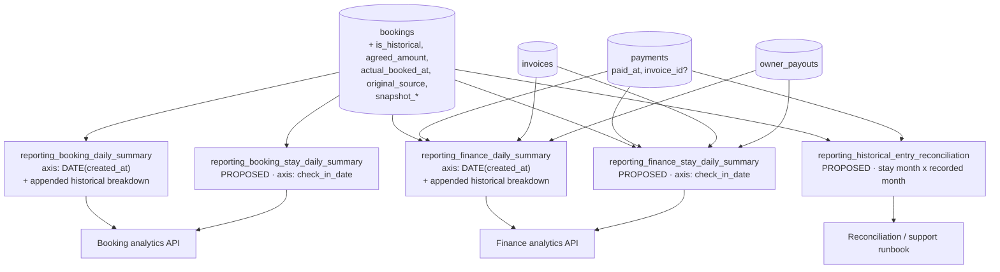
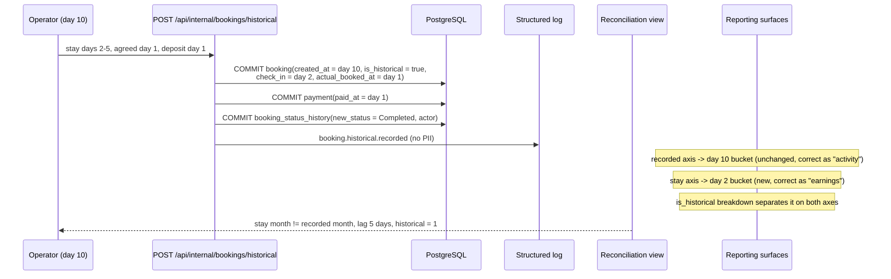
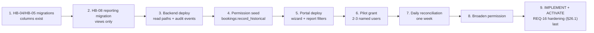

# HB-08 — Reporting, Audit, Observability, Rollout and Normal-Flow Hardening

> [README](README.md) · [Master Plan](00_MASTER_PLAN.md) · Prev: [HB-07](07_TICKET_NOTIFICATIONS_AUTOMATIONS_AND_INTEGRATIONS.md) · Next: [HB-09](09_TICKET_TEST_AUTOMATION_AND_RELEASE_GATES.md)
> Upstream: [HB-04](04_TICKET_FINANCIAL_SNAPSHOT_AND_HISTORICAL_PAYMENTS.md) · [HB-05](05_TICKET_OWNER_ACCOUNTING_AND_SETTLEMENT_ADJUSTMENTS.md) · Specification: [HB-01 §11.2](01_TICKET_DISCOVERY_AND_ARCHITECTURE_DECISIONS.md#112-normal-flow-hardening--specification)

---

## 1. Ticket metadata

| Field | Value |
|---|---|
| Ticket ID | **HB-08** |
| Title | Reporting, Audit, Observability, Rollout, and REQ-16 Normal-Flow Hardening |
| Priority | **P1** (the hardening component is **P0** within it) |
| Type | Data/reporting + observability + release engineering + security hardening |
| Status | Ready for review |
| Dependencies | [HB-04](04_TICKET_FINANCIAL_SNAPSHOT_AND_HISTORICAL_PAYMENTS.md) (protected `agreed_amount`, historical payments), [HB-05](05_TICKET_OWNER_ACCOUNTING_AND_SETTLEMENT_ADJUSTMENTS.md) (commission snapshot, owner override audit), [HB-02](02_TICKET_HISTORICAL_BOOKING_DOMAIN_AND_API.md) for `bookings.is_historical`, which the hardening exemption reads, and [HB-01 §11.2](01_TICKET_DISCOVERY_AND_ARCHITECTURE_DECISIONS.md#112-normal-flow-hardening--specification) for the ratified hardening specification |
| Dependents | [HB-09](09_TICKET_TEST_AUTOMATION_AND_RELEASE_GATES.md) |
| Risk level | **High** — this ticket is the last line of defence for financial truth, it carries the only behaviour change to the existing booking flow, and it is the ticket that authorises production exposure |
| Estimated complexity | **L** |
| Implemented by | Sole Project Owner. Review lenses: Finance · Security · Operations · Engineering — Finance for the two reporting axes, Security for the REQ-16 hardening component |
| Target branch | `feat/hb08-historical-reporting-rollout` |
| Gates | **Production go/no-go.** No historical booking may be recorded in production before this ticket's reconciliation queries and rollout checklist exist. |

### 1.1 Why REQ-16 hardening lives here

HB-01 ratifies the past-date rule; **HB-08 implements and activates it.** The reason is stated in full at
[HB-01 §1.1](01_TICKET_DISCOVERY_AND_ARCHITECTURE_DECISIONS.md#11-why-this-ticket-ships-no-code--the-dependency-cycle-it-removes),
and reduces to two facts that a wave-0 ticket cannot satisfy:

1. The update-path guard must **exempt** `is_historical` bookings, and that column is created by HB-02.
2. The rule must be **activated last**, after operators have a working historical flow — which is rollout
   step 9, and rollout is this ticket's responsibility.

Placing it here makes the dependency graph acyclic without weakening REQ-16: the specification is binding,
the acceptance criteria are runtime assertions (`AC-HB08-23` … `AC-HB08-26`), and `SC-REG-02` remains a P0
release gate. **The hardening commit must be the last commit on this branch**, so it can be reverted alone.

---

## 2. Business context

The whole point of *Record Historical Booking* is that the numbers become true. A stay that happened is
revenue that was earned, cash that was collected, occupancy that occurred and an owner entitlement that
accrued. If the record exists but every report attributes it to the wrong period, the feature has moved the
lie rather than removed it.

KAZA Booking's reporting layer was frozen deliberately narrow (`docs/decisions/0013_reports_analytics_db_scope.md`
is referenced from `db/migrations/0041_create_reporting_booking_daily_summary_view.sql:8`) around a
read-model-first design: SQL views expose daily aggregates, thin C# services read them, the portal charts
them. That design is fine, and this ticket does not reopen it. It has one property that this feature
collides with head-on: **the only time axis in the reporting layer is `bookings.created_at`.**

---

## 3. Problem being solved

`CONFIRMED` [F-09](01_TICKET_DISCOVERY_AND_ARCHITECTURE_DECISIONS.md#f-09--reporting-buckets-on-created_at).
Every financial and booking report in the platform buckets on `DATE(bookings.created_at)`. Apply that to the
worked example from [Master Plan §3](00_MASTER_PLAN.md#3-problem-statement):

| Fact | Real date | Where today's reporting puts it |
|---|---|---|
| Booking agreed | Day 1 | Nowhere — no column exists yet (HB-02 adds `actual_booked_at`) |
| Deposit received in cash | Day 1 | `payments.paid_at` is truthful, **but** the daily finance view never reads `paid_at` |
| Stay occurred | Days 2–5 | Nowhere — no reporting surface reads `check_in_date`/`check_out_date` |
| Booking recorded | Day 10 | **Everything.** Revenue, booking count, invoiced/paid/remaining, payout buckets and the dashboard revenue line all land on Day 10 |

So a stay from last month, recorded today, inflates **today's** revenue and deflates last month's — silently,
with no marker distinguishing it from a genuine same-day sale. Month-end closes stop reconciling the moment
the first historical booking is recorded. `REQ-18` cannot be satisfied without changing this, which is why
[ADR-11](00_MASTER_PLAN.md#25-decision-log) exists.

Three secondary problems ride along:

1. **Two different definitions of "paid money" already coexist in production** (§5.3). A historical payment
   is precisely the kind of payment that falls in the gap between them.
2. **There is no observability substrate** — no metrics library, no audit table, no log aggregation (§5.7).
   The metrics named in [Master Plan §23](00_MASTER_PLAN.md#23-observability) have nowhere to be emitted yet.
3. **Rollout ordering is load-bearing.** [HB-01](01_TICKET_DISCOVERY_AND_ARCHITECTURE_DECISIONS.md)'s
   hardening must not land before this feature is live, or operators lose a capability they currently have.

---

## 4. User value

| Audience | Value |
|---|---|
| Finance | Month-end closes still reconcile. A historical booking is visible, attributable to its stay period, and separable from organic same-day revenue. |
| Owners | Entitlements reflect the month the stay occurred, and the owner-portal figure agrees with the admin figure. |
| Operations | A daily reconciliation view answers "what was recorded late, for when, and by whom" without a database query. |
| Business reporting | Growth metrics are not distorted by backfill activity; "bookings created today" stops meaning two different things. |
| Support | A named audit event and a documented runbook make "why does this booking show in July?" answerable in one lookup. |
| Engineering | An explicit decision on the metrics substrate instead of metric names with no emitter. |
| Security | Structured, PII-free audit of a privileged, financially significant action. |

---

## 5. Current repository behavior

All claims verified by direct read at commit `8dafb5a`. Search scopes are stated where a negative claim is made.

### 5.1 The `created_at` bucket is the only time axis

`CONFIRMED`.

| Surface | Evidence | Expression |
|---|---|---|
| `reporting_booking_daily_summary` | `db/migrations/0041_create_reporting_booking_daily_summary_view.sql:49`, `:59` | `DATE(b.created_at) AS metric_date` … `GROUP BY DATE(b.created_at), b.source` |
| `reporting_finance_daily_summary` | `db/migrations/0042_create_reporting_finance_daily_summary_view.sql:65`, `:87`, `:94` | `DATE(b.created_at) AS metric_date` in both CTEs, `GROUP BY b.id, DATE(b.created_at)` |
| Both, after realignment | `db/migrations/0052_align_reporting_views_with_pipeline.sql:17`, `:27`, `:59`, `:66` | `CREATE OR REPLACE VIEW` re-issues the identical `DATE(b.created_at)` grouping |
| Finance analytics service | `RentalPlatform.Business/Services/ReportingFinanceAnalyticsService.cs:75`, `:81` | `bookingsQuery.Where(b => b.CreatedAt >= dateFromDateTime)` / `<= dateToDateTime` |
| Booking analytics service | `RentalPlatform.Business/Services/ReportingBookingAnalyticsService.cs:93`, `:96` | filters `r.MetricDate`, which *is* `DATE(b.created_at)` |

`0052` is the current definition of both views and it preserves the `created_at` axis. Note also
`0052:12-13` — `ALTER VIEW reporting_booking_daily_summary RENAME COLUMN pending_bookings_count TO
prospecting_bookings_count`. `CONFIRMED` precedent that the reporting view contract is treated as
changeable by migration; this ticket relies on the weaker, safer form of that precedent (appending columns).

### 5.2 Reporting surface inventory

`CONFIRMED`. Complete list of surfaces that a historical booking can reach.

| # | Surface | Entry point | Backing source |
|---|---|---|---|
| S-1 | Booking daily summary | `GET /api/internal/reports/bookings/daily` (`ReportingBookingAnalyticsController.cs:28`) | `reporting_booking_daily_summary` |
| S-2 | Booking summary | `GET /api/internal/reports/bookings/summary` (`ReportingBookingAnalyticsController.cs:54`) | same view, aggregated |
| S-3 | Finance daily summary | `GET /api/internal/reports/finance/daily` (`ReportingFinanceAnalyticsController.cs:28`) | `reporting_finance_daily_summary` |
| S-4 | Finance summary (reports) | `GET /api/internal/reports/finance/summary` (`ReportingFinanceAnalyticsController.cs:53`) | `ReportingFinanceAnalyticsService.GetSummaryAsync` |
| S-5 | Finance overview (dashboard) | `GET /api/internal/finance/overview` (`FinanceSummaryController.cs:28-29`, policy `finance:overview`) | delegates to the **same** `GetSummaryAsync` (`FinanceSummaryController.cs:34`) |
| S-6 | Booking finance snapshot | `GET /api/internal/bookings/{id}/finance-snapshot` (`FinanceSummaryController.cs:72`) | `FinanceSummaryService.cs:71` |
| S-7 | Invoice balance | `GET /api/internal/invoices/{id}/balance` (`FinanceSummaryController.cs:55`) | `FinanceSummaryService.cs:34` |
| S-8 | Owner payout summary | `GET /api/internal/owners/{id}/payout-summary` (`FinanceSummaryController.cs:91`) | `FinanceSummaryService.cs:105-107` |
| S-9 | Owner portal finance | `OwnerPortalFinanceService.cs:69-71`, `:76-78` | `owner_portal_finance_overview` view |
| S-10 | Owner portal dashboard | `GET /api/owner/dashboard` (`OwnerPortalDashboardController.cs:26`) | `OwnerPortalDashboardService.cs:54-58` |
| S-11 | Admin dashboard stat cards | `rental-platform/app/(admin)/dashboard/page.tsx:56-57`, `:60-63`, `:75-76` | S-2 and S-5 |
| S-12 | Revenue line chart | `dashboard/page.tsx:66-69` (last 30 days, `:49-50`) | S-3 |
| S-13 | Bookings bar chart | `dashboard/page.tsx:70-73` | S-1 |
| S-14 | Occupancy widget | `components/admin/dashboard/OccupancyWidget.tsx:22-27`, `:54-67` | S-2 — **not** stay dates (§5.4) |
| S-15 | Bookings list | `BookingsController.cs:21` (`api/internal/bookings`), filters at `:39-40` | `bookings` table directly |

All reporting endpoints are gated by `analytics:read`
(`ReportingBookingAnalyticsController.cs:17`, `ReportingFinanceAnalyticsController.cs:17`); the finance
overview is gated by `finance:overview` (`FinanceSummaryController.cs:29`). `CONFIRMED`.

### 5.3 Two live definitions of "paid money" — reconciliation hazard

`CONFIRMED`, and this predates the feature. The SQL read models count a payment only if it is attached to a
non-cancelled invoice; the C# services count every `paid` payment on the booking.

| Definition | Where | Predicate |
|---|---|---|
| **Invoice-linked** | `0052_align_reporting_views_with_pipeline.sql:49-54` (`daily_paid`) | `WHERE p.payment_status = 'paid' AND p.invoice_id IS NOT NULL`, joined `dp.invoice_id = di.invoice_id` where the invoice is not `cancelled`/`superseded` (`:45`) |
| **Invoice-linked** | `0049_owner_portal_finance_names.sql:17-22` (`owner_portal_finance_overview`) | correlated `SUM(p.amount) WHERE p.invoice_id = i.id AND p.payment_status = 'paid'`, invoice filtered at `:35` |
| **Booking-scoped** | `ReportingFinanceAnalyticsService.cs:61-62`, `:88`, `:109` | `p.PaymentStatus == "paid"`, filtered by `bookingIds.Contains(p.BookingId)` — `invoice_id` never consulted. The in-code comment at `:53-54` records this as a deliberate fix |
| **Booking-scoped** | `FinanceSummaryService.cs:34`, `:71` | `p.BookingId == … && p.PaymentStatus == "paid"` |

Consequence for this feature: a historical booking created directly in `Completed` **has no invoice** —
`CONFIRMED` [F-10](01_TICKET_DISCOVERY_AND_ARCHITECTURE_DECISIONS.md#f-10--invoice-behaviour), the only
auto-create site is the Booked→Confirmed transition (`BookingLifecycleService.cs:194-199`), which the
historical flow never executes. Unless HB-04 explicitly creates and issues an invoice, a historical payment
is **invisible** to S-3, S-9, S-12 and the owner portal, while being **visible** in S-4, S-5, S-6 and S-11 —
two figures on the same admin dashboard page disagreeing about the same money
(`dashboard/page.tsx:60-63` renders S-5; `:66-69` renders S-3).

This is the single most likely source of a "the numbers don't match" support ticket after launch.

### 5.4 Occupancy — principle correct, implementation not

The general principle holds: **any surface that derives occupancy from `check_in_date`/`check_out_date` is
correct automatically for historical bookings and needs no change**, because a historical booking stores its
true stay dates in the same columns as any other booking (`Booking.cs:15-16`, `DateOnly`/`DATE`). This is the
one class of reporting that the feature repairs for free.

`CONFIRMED` — but the only occupancy surface actually shipped does not belong to that class.
`rental-platform/components/admin/dashboard/OccupancyWidget.tsx`:

- `:19-20` builds a **current-month** range with `startOfMonth`/`endOfMonth`
- `:22-27` calls `reportsService.getBookingsSummary({dateFrom, dateTo})` → S-2 → `DATE(b.created_at)`
- `:60-62` `activeBookings = totalConfirmedBookingsCount + totalCompletedBookingsCount`
- `:54-57`, `:64-67` divides that **count of bookings** by `daysInRange × activeUnitCount`

So the widget is a created-date-bucketed booking count over unit-days, not an occupied-nights ratio. Its own
subtitle says "Current month (approximate)" (`:81-83`). A historical booking recorded today therefore raises
*this month's* occupancy percentage regardless of when the stay happened, and contributes one unit rather
than its number of nights.

This **refines** the "Occupancy — correct automatically" row of
[Master Plan §19](00_MASTER_PLAN.md#19-reporting-impact-matrix): the row is right about the concept and
optimistic about the code. §22 carries the corrected row.

Related, and out of this ticket's hands: `Completed` is excluded from the availability conflict set
(`BookingStatusTransitions.cs:46-53`, `UnitAvailabilityService.cs:48-74` —
[F-02](01_TICKET_DISCOVERY_AND_ARCHITECTURE_DECISIONS.md#f-02--completed-and-leftearly-are-invisible-to-availability)),
so a historical stay never appears as a blocked date on any calendar. That is
[HB-03](03_TICKET_AVAILABILITY_CONFLICTS_AND_DUPLICATE_PROTECTION.md)'s conflict set and
[OQ-10](00_MASTER_PLAN.md#32-open-questions)'s product question, not a reporting change.

### 5.5 Source and channel reporting

`CONFIRMED`. `reporting_booking_daily_summary` groups by `b.source` (`0041:50`, `0052:18`), and `source` is
constrained to five values by
`db/migrations/0016_create_bookings.sql:24` — `ck_bookings_source CHECK (source IN ('direct','admin','phone','whatsapp','website'))`
([F-08](01_TICKET_DISCOVERY_AND_ARCHITECTURE_DECISIONS.md#f-08--ck_bookings_source-restricts-source-values)),
mirrored at `BookingValidators.cs:10`. A historical booking must therefore carry one of those five legal
values in `source` while its *real* origin (walk-in, external platform, legacy spreadsheet) lives in the new
`original_source` column ([Master Plan §11](00_MASTER_PLAN.md#11-proposed-data-model)). Channel reporting that
reads `source` will silently mis-attribute every historical booking to whichever generic value HB-02 picks.

### 5.6 Audit substrate

`CONFIRMED`. There is no general audit-log table. Search over `db/migrations` for `audit`/`log` returns only
`0038_create_notification_delivery_logs.sql`. The only booking audit trail is
`db/migrations/0017_create_booking_status_history.sql`:

| Column | Type | Note |
|---|---|---|
| `old_status` | `VARCHAR(50) NULL` | `:4`, CHECK at `:13` restricts to the ten booking statuses |
| `new_status` | `VARCHAR(50) NOT NULL` | `:5`, CHECK at `:14` |
| `changed_by_admin_user_id` | `UUID NULL` | `:6`, FK `ON DELETE SET NULL` (`:11`) |
| `notes` | `TEXT NULL` | `:7` — unbounded, the only free-form field |
| `changed_at` | `TIMESTAMP NOT NULL` | `:8`, indexed `:18` |

The single truthful history row that [HB-02](02_TICKET_HISTORICAL_BOOKING_DOMAIN_AND_API.md) writes
(`OldStatus = null`, `NewStatus = Completed`, actor = authenticated admin, per
`BookingService.cs:242-253`) is therefore the **only durable in-database audit artefact** of the historical
recording. Everything else this ticket specifies as an "audit event" is a log line unless a decision is taken
to add a table — see `D-08-05`.

### 5.7 Observability substrate — none exists

`CONFIRMED`, negative claim, scope stated. Searching `RentalPlatform.API`, `.Business` and `.Shared` for
`prometheus`, `OpenTelemetry`, `Serilog`, `AppMetrics`, `System.Diagnostics.Metrics` and `Meter(` returns **no
matches**, in code or in `.csproj` files. `RentalPlatform.API/RentalPlatform.API.csproj` declares exactly five
packages: FluentValidation DI extensions, JwtBearer, Npgsql EF Core, `System.IdentityModel.Tokens.Jwt`,
Swashbuckle. `RentalPlatform.API/Program.cs` (362 lines) contains no logging configuration and exposes one
liveness endpoint at `:355` — `app.MapGet("/health", …)`. Neither `docker-compose.yml` nor
`docker-compose.prod.yml` declares a `logging:` driver, size cap, or aggregation target.

Therefore: **the metric names in [Master Plan §23](00_MASTER_PLAN.md#23-observability) have no emitter and the
default container log has no retention guarantee.** This is not a reason to drop them; it is a decision this
ticket must take explicitly (`D-08-04`).

### 5.8 Exports — none exist

`CONFIRMED`, negative claim, scope stated. This closes the gap
"Existence of any CSV/PDF export path — `BLOCKED` — assigned HB-08" recorded at
[HB-01 §5.2](01_TICKET_DISCOVERY_AND_ARCHITECTURE_DECISIONS.md#52-known-gaps-in-this-audit).

| Search | Scope | Result |
|---|---|---|
| `Export`, `File(`, `FileResult`, `Download` | `RentalPlatform.API/Controllers/**/*.cs` | no matches |
| `csv`, `ExportTo`, `application/pdf`, `text/csv` | all `*.cs` outside `.tmp/` | no matches |
| `csv`, `xlsx`, `exceljs`, `jspdf`, `papaparse`, `download=` | `rental-platform/**`, `demo/**` excluding `node_modules` and lockfiles | no matches |
| `window.print`, `createObjectURL`, `text/csv`, `saveAs` | `rental-platform/**`, `demo/**` excluding `node_modules` | no matches |

**Verdict: no CSV, XLSX, PDF or print export path exists anywhere in the product.** No export therefore needs
a historical-booking column, and no export can leak a misattributed figure. A residual `BLOCKED` remains only
for out-of-repository extraction — direct SQL access, BI tooling, or a finance analyst's manual queries —
which the repository cannot evidence either way (`D-08-06`).

### 5.9 CI gate substrate

`CONFIRMED`. `.github/workflows/pr-checks.yml` (90 lines) runs five jobs: .NET restore + Release build
(`:13-24`), API production image build (`:27-32`), demo build (`:35-54`), portal type-check + build
(`:57-79`), and production compose validation (`:82-`). **There is no `dotnet test` step and no frontend test
step.** Deployment is `.github/workflows/deploy-production.yml` with `scripts/deploy-production.sh`, and
migrations are applied by `scripts/apply-migrations.sh`. Consequence for rollout: the reporting regression
tests this ticket writes will not run automatically until
[HB-09](09_TICKET_TEST_AUTOMATION_AND_RELEASE_GATES.md) adds a test job.

---

## 6. Target behavior

1. Financial and booking reporting gains an explicit **stay-period** dimension alongside the existing
   recorded-date dimension. Both are derivable; neither replaces the other (`REQ-18`, `INV-13`, ADR-11).
2. Every reporting surface can **identify, filter and exclude** historical bookings, and can show them
   separately in a single-glance breakdown.
3. Channel reporting attributes a historical booking to its `original_source`, not to the generic legal
   `source` value it is forced to carry.
4. The two definitions of "paid money" are documented, deliberately reconciled for historical bookings, and
   covered by a reconciliation query that will detect divergence.
5. Recording a historical booking emits a structured, PII-free audit event with a stable name and a fixed
   field list; an owner override emits a second one.
6. Four counters exist with a real emitter, or a written decision explains what replaces them.
7. Rollout is permission-driven, pilot-scoped, ordered so that hardening lands last, reversible, and
   accompanied by read-only production smoke checks and a daily reconciliation report.
8. Existing reporting consumers continue to work unchanged with no code change on their side.

---

## 7. In scope

- Reporting impact matrix, verified surface by surface (§22).
- Stay-period reporting dimension: new read model(s) plus additive breakdown columns on the two existing views.
- `is_historical` filtering/exclusion across the reporting API surface.
- `original_source` channel reporting.
- Reconciliation query set: stay month vs recorded month, count and value; invoice-linkage divergence detector.
- Structured audit events `booking.historical.recorded` and `booking.historical.owner_override`.
- Metric definitions and the decision on their emission substrate.
- Rollout plan, permission-as-flag strategy, pilot definition, sequencing.
- Read-only production smoke checks and the post-release reconciliation routine.
- Rollback strategy including the `agreed_amount` destruction limitation.
- Support runbook content for "explain this historical booking".
- **REQ-16 normal-flow past-date hardening — implementation and activation**, built exactly to the ratified
  specification at
  [HB-01 §11.2](01_TICKET_DISCOVERY_AND_ARCHITECTURE_DECISIONS.md#112-normal-flow-hardening--specification):
  the shared Cairo business-date resolver; the `ValidateStayDates` extension; the `UpdatePendingAsync` guard
  with its `is_historical` exemption; the typed error mapped to `400 stay_dates_in_past`; the
  `booking_create_rejected_total{reason="stay_dates_in_past"}` metric and PII-free structured log;
  per-creation-path regression tests; Cairo-midnight and DST boundary tests; and publication of the
  operator documentation at activation.

## 8. Out of scope

- Creating the historical booking itself (HB-02), its financial snapshot (HB-04) or its owner accounting (HB-05).
- Building an export capability. None exists (§5.8) and inventing one here is unjustified scope.
- Rewriting the reporting architecture, introducing materialized views, a warehouse, or fact/dimension tables —
  the read-model-first freeze referenced at `0041:8` stands.
- Adding a general-purpose audit-log table (`D-08-05` recommends against it for v1).
- Repairing the pre-existing paid-money divergence (§5.3) for *non-historical* bookings. This ticket documents,
  detects and contains it; fixing it platform-wide is a separate ticket.
- Rebuilding `OccupancyWidget` into a true nights-based occupancy metric beyond the minimum correction in §22.
- Changing notifications, or any historical write path.
- **Re-deciding** the hardening rule. HB-08 implements
  [HB-01 §11.2](01_TICKET_DISCOVERY_AND_ARCHITECTURE_DECISIONS.md#112-normal-flow-hardening--specification)
  as ratified; it does not reopen D-02 or D-03. If the specification proves unbuildable, stop and return it
  to HB-01 rather than improvising a variant.
- CI test jobs — [HB-09](09_TICKET_TEST_AUTOMATION_AND_RELEASE_GATES.md).

**Scope note on `AutoCompleteBookingsJob`:** previously listed as untouched. The hardening component makes
one narrowly-bounded, behaviour-preserving change to it — replacing the inline cutoff expression at
`AutoCompleteBookingsJob.cs:70` with a call to the shared Cairo resolver, so the platform has a single
definition of "the business day ended". `AC-HB08-26` requires proof that the selected booking set is
identical before and after. No other change to that job is in scope.

---

## 9. Assumptions

| # | Assumption | Label | If false |
|---|---|---|---|
| A-1 | HB-04 has shipped `bookings.is_historical`, `agreed_amount`, `actual_booked_at`, `original_source` and HB-05 has shipped the commission snapshot columns before this ticket's migration runs | `INFERRED` | The views cannot be written; this ticket blocks |
| A-2 | Single currency — no currency column exists anywhere | `CONFIRMED` (absence), [OQ-05](00_MASTER_PLAN.md#32-open-questions) | Every aggregate in every view becomes wrong; stop and escalate |
| A-3 | A historical booking's revenue is attributed to a single stay bucket, not spread per night | `PROPOSED`, `D-08-02` | Nightly allocation needs a per-night amount that `agreed_amount` does not provide |
| A-4 | Reporting consumers tolerate **appended** view columns (PostgreSQL `CREATE OR REPLACE VIEW` permits adding columns at the end only) | `INFERRED` from `0052:15-28` precedent | Use new views exclusively and leave existing views untouched |
| A-5 | Historical volume is low (single-record operator entry, no bulk import per [Master Plan §5](00_MASTER_PLAN.md#5-non-goals)) | `INFERRED` | View performance needs indexes on `check_in_date` — the index already exists (`ix_bookings_check_in_date`) |
| A-6 | A documented caveat is acceptable for the transition window between deploy and the first reconciliation run | `DECISION REQUIRED`, [OQ-02](00_MASTER_PLAN.md#32-open-questions) | Delay the permission grant until reporting ships |
| A-7 | `analytics:read` is the correct gate for new reporting reads, matching `ReportingBookingAnalyticsController.cs:17` | `CONFIRMED` | Re-gate per security review |

---

## 10. Decision-required items

Local IDs are prefixed `D-08-` to avoid collision with
[HB-01's D-01…D-06](01_TICKET_DISCOVERY_AND_ARCHITECTURE_DECISIONS.md#10-decisions).

Decision authority for every row is the **Sole Project Owner** (2026-07-29). The **Review lens** column
names the perspectives applied — it is not a list of separate approvers.

| ID | Decision | Reason it is open | Impact if unresolved | Recommended default | Review lens | Blocking? |
|---|---|---|---|---|---|---|
| D-08-01 | Which reporting option: (a) stay-period dimension, (b) `is_historical` filter only, (c) documented caveat only | ADR-11 ratifies the direction but not the shape | `REQ-18` unmet; month-end never reconciles | **(a) + (b) together** — see §11.1 | Finance · Engineering | **Yes** |
| D-08-02 | Stay-period bucket key: `check_in_date`, `check_out_date`, or per-night spread | No per-night amount exists once `agreed_amount` is authoritative | Two teams build two different "stay month" | **`check_in_date`**, one row per booking, documented as "stay start month" | Finance | **Yes** |
| D-08-03 | Must HB-04 create and issue an invoice for every historical booking? | §5.3 — without one, the payment is invisible to S-3/S-9/S-12 | Owner portal and admin dashboard disagree about the same money | **Yes, create and issue** — it is the only way both definitions agree; otherwise report the divergence as a known caveat | Finance · Engineering | **Yes** |
| D-08-04 | Metrics substrate: `System.Diagnostics.Metrics` + exporter, structured-log-derived counters, or DB-derived counts | No metrics library exists (§5.7) | Metric names ship with no emitter | **DB-derived counts via the reconciliation view for v1**, plus structured log events; defer a metrics stack to a platform ticket | Engineering | No |
| D-08-05 | Add a dedicated audit table, or rely on `booking_status_history` + structured logs | No audit table exists (§5.6); logs have no retention guarantee | Audit event may be unretrievable after container restart | **No new table in v1.** `booking_status_history` is the durable record; logs are supplementary. Revisit if Finance requires retained event history | Engineering · Finance | No |
| D-08-06 | Is any out-of-repository reporting consumer (BI tool, direct SQL, analyst spreadsheet) in use? | Repository cannot evidence it (§5.8) | An unknown consumer silently double-counts | **Ask Ops/Finance in writing before the pilot**; assume none until answered | Operations | No |
| D-08-07 | Should historical bookings be **excluded by default** from growth/booking-count reporting, or included with a breakdown? | Product judgement, not a technical constraint | Growth numbers distorted by backfill | **Included by default with a visible breakdown column**; exclusion is opt-in via query parameter | Product · Finance | No |
| D-08-08 | Which `source` value does a historical booking carry, given the five-value CHECK (`0016:24`)? | HB-02 must pick one; channel reporting inherits it | Channel mix distorted | **`admin`**, with `original_source` carrying the truth and channel reports switching to `original_source` | Product | No |
| D-08-09 | Correct `OccupancyWidget` now, or record the defect and defer? | It is pre-existing and not caused by this feature (§5.4) | The dashboard occupancy figure moves when a historical booking is recorded | **Minimum correction in this ticket**: point the widget at the stay-period read model; a full nights-based rewrite is deferred | Product · Engineering | No |

Related registered questions, referenced not renumbered — all now resolved in
[Master §32](00_MASTER_PLAN.md#32-open-questions):
[OQ-03](00_MASTER_PLAN.md#32-open-questions) (which period a historical deposit belongs to — `paid_at` drives
payment reporting, the recorded date drives entry audit; HB-04 stores both so this ticket can report either),
[OQ-09](00_MASTER_PLAN.md#32-open-questions) (real-PostgreSQL CI — mandatory, and tracked as `PRE-02`; the
view tests in §29 are worthless on EF InMemory and must not be claimed as coverage until it lands),
[OQ-10](00_MASTER_PLAN.md#32-open-questions) (storefront occupancy visibility — include in occupancy history,
exclude from future availability).

---

## 11. Architecture and technical design

### 11.1 The three options, honestly compared

| | (a) Stay-period dimension | (b) `is_historical` filter only | (c) Leave reports, document the caveat |
|---|---|---|---|
| What it is | New stay-keyed read model + appended breakdown columns on the two existing views | Add `is_historical` breakdown/filter to existing views; keep the single `created_at` axis | No schema or code change; a note in the finance runbook |
| Satisfies `REQ-18` | **Yes** | No — "reconcilable by stay period" is not achievable by filtering a `created_at` axis | No |
| Satisfies ADR-11 | Yes | No | No |
| Answers "what did July's stays earn?" | Yes | No | No |
| Answers "what did we record today that wasn't organic?" | Yes | Yes | No |
| Effort | Two new views + service/DTO plumbing + tests | One appended column per view | Zero |
| Risk to existing consumers | Low — appended columns only, new views are additive | Low | None |
| Failure mode | Two axes must be explained to users; a chart that mixes them is misleading | Finance discovers the gap at the first month-end after launch | Finance discovers it silently, in a closed period, possibly months later |
| Reversible | Yes — drop the new views, revert appended columns | Yes | n/a |

**Recommendation: (a) and (b) together, and explicitly not (c).**

Justification. (b) alone is cheap and genuinely useful — it makes the distortion *visible* — but it cannot
answer the question the business actually asks at month-end, which is "what did the stays that occurred in
July earn?" That question requires a stay axis, full stop. (c) is not a strategy; it converts a data problem
into a memory problem, and the memory fails at exactly the moment the numbers matter. (a) without (b) leaves
the recorded-date reports quietly wrong with no marker, which is worse than either. Together they cost one
migration and give a complete answer: the recorded axis stays authoritative for "activity", the stay axis
becomes authoritative for "earnings", and the `is_historical` breakdown reconciles the two.

### 11.2 Target reporting model



Naming is `PROPOSED`; the implementer must match the established `reporting_*_daily_summary` convention seen
at `0041`–`0044` and pick the next free migration number (latest observed `0057`).

### 11.3 Stay-period view design

`PROPOSED`, subject to `D-08-02`.

| Aspect | Design |
|---|---|
| Grain | One row per `(check_in_date, is_historical)` for the booking view; one row per `check_in_date` for the finance view |
| Bucket key | `b.check_in_date` — already `DATE` and already indexed (`ix_bookings_check_in_date`), so no timezone conversion and no new index |
| Why not `check_out_date` | A stay spanning a month boundary would be credited to the month it ended, which reads as later revenue than the guest experienced |
| Why not per-night spread | `agreed_amount` is a protected operator-entered total (ADR-07). Dividing it by nights invents a per-night figure the operator never agreed. Revisit only if Finance asks (`D-08-02`) |
| Amount column | `final_amount` for parity with `0052:24`; a second column exposing `agreed_amount` where present, so the protected figure is directly auditable |
| Status scope | All statuses, with the same `FILTER (WHERE …)` breakdown style as `0052:20-23`, so cancelled stays do not silently inflate the stay axis |
| Historical breakdown | `COUNT(*) FILTER (WHERE b.is_historical)` and `SUM(...) FILTER (WHERE b.is_historical)` on **both** axes |
| Channel | Group the booking stay view by `COALESCE(b.original_source, b.source)` so the channel is truthful (§5.5, `D-08-08`) |

### 11.4 Appended columns on the existing views

`PROPOSED`. `CREATE OR REPLACE VIEW` in PostgreSQL permits appending columns but not renaming, reordering or
dropping them — the precedent for a rename is the separate `ALTER VIEW … RENAME COLUMN` at `0052:12-13`. So:

| View | Appended columns |
|---|---|
| `reporting_booking_daily_summary` | `historical_bookings_count INT`, `historical_final_amount DECIMAL(14,2)` |
| `reporting_finance_daily_summary` | `historical_bookings_count INT`, `historical_invoiced_amount DECIMAL(14,2)`, `historical_paid_amount DECIMAL(14,2)` |

Existing EF read models (`RentalPlatform.Data/ReadModels/ReportingBookingDailySummary.cs`,
`ReportingFinanceDailySummary.cs`) continue to bind the columns they already declare; new columns are picked
up only when the read model and its configuration are extended. `INFERRED` from the existing
ReadModel/Configuration pairing convention — the implementer must verify no configuration uses a strict
column-count assertion.

### 11.5 Reconciliation model

`PROPOSED`. One view answering the post-release question directly:

| Column | Meaning |
|---|---|
| `stay_month` | `date_trunc('month', b.check_in_date)` |
| `recorded_month` | `date_trunc('month', b.created_at)` |
| `bookings_count` | count in that cell |
| `total_final_amount` | value in that cell |
| `total_agreed_amount` | protected value, `NULL`-safe |
| `historical_count` | count where `is_historical` |
| `lag_days_p50` / `lag_days_max` | `b.created_at::date − b.check_out_date`, entry-lateness distribution |
| `payments_unlinked_count` | payments on those bookings with `invoice_id IS NULL` — the §5.3 divergence detector |
| `payments_unlinked_amount` | value of the above; **this figure is the exact gap between S-4 and S-3** |

The diagonal (`stay_month = recorded_month`) is normal business. Everything off-diagonal is either a
historical booking or a data-quality signal, and the two are distinguished by `historical_count`. An
off-diagonal row with `historical_count = 0` means someone created a past-dated booking through the normal
flow — precisely what the REQ-16 hardening in §26.1 exists to stop,
so this view also measures whether hardening can safely be enabled.

### 11.6 Audit event design

`PROPOSED`. Emitted from the historical command (HB-02) at the point of successful commit, consumed here.

**`booking.historical.recorded`**

| Field | Source | Notes |
|---|---|---|
| `event` | constant | `booking.historical.recorded` |
| `booking_id`, `unit_id`, `client_id`, `owner_id` | command result | identifiers only |
| `actor_admin_user_id` | authenticated principal | never client-supplied (`INV-11`) |
| `recorded_at` | `DateTime.UtcNow` | equals `bookings.created_at` (`INV-01`) |
| `stay_check_in`, `stay_check_out` | request | `DateOnly` |
| `actual_booked_at` | request | agreement date |
| `entry_lag_days` | derived | `recorded_at::date − stay_check_out` |
| `historical_entry_reason`, `original_source` | request | allow-listed values only |
| `external_reference_present` | derived boolean | **the value itself is not logged** — it can contain third-party identifiers |
| `agreed_amount`, `base_amount` | snapshot | numbers only |
| `snapshot_commission_rate`, `snapshot_owner_amount`, `snapshot_kaza_amount` | snapshot | |
| `owner_override_used` | boolean | |
| `payment_recorded`, `payment_amount`, `payment_method`, `payment_paid_at` | optional payment | method is an allow-listed enum |
| `correlation_id` | request context | |

**`booking.historical.owner_override`** — `event`, `booking_id`, `unit_id`, `default_owner_id`,
`credited_owner_id`, `owner_override_reason`, `actor_admin_user_id`, `recorded_at`, `correlation_id`.

**No PII.** No guest name, phone, email, address, national identifier or free-text note ever enters a log
line or a metric label. Free-text (`owner_override_note`, `internal_notes`) stays in the database.

### 11.7 Metrics

`PROPOSED`, substrate per `D-08-04`.

| Metric | Type | Labels | Meaning |
|---|---|---|---|
| `historical_booking_created_total` | counter | none | successful historical recordings |
| `historical_booking_rejected_total` | counter | `reason` ∈ {`overlap`, `duplicate`, `not_complete`, `forbidden`, `owner_attribution`, `unit_deleted`, `validation`} | one label value per error code in [Master Plan §12](00_MASTER_PLAN.md#12-api-and-command-design) |
| `historical_owner_override_total` | counter | none | privileged override usage; a rising trend means the default attribution is wrong |
| `booking_create_rejected_total` | counter | `reason="stay_dates_in_past"` | specified by [HB-01 §20](01_TICKET_DISCOVERY_AND_ARCHITECTURE_DECISIONS.md#20-audit-and-observability) and **emitted by this ticket** (§26.1 task 35); consumed here as the post-activation signal |

Given §5.7, the v1 default is: emit each as a structured log event with the stable names above **and** expose
the equivalent counts through the reconciliation view, so the numbers exist even with no metrics stack.
Label cardinality is bounded and contains no identifiers.

---

## 12. Expected data flow



Fan-out of one historical booking across the surfaces of §5.2:

| Surface | Before this ticket | After this ticket |
|---|---|---|
| S-1/S-13 booking daily + bar chart | +1 booking on day 10, indistinguishable | +1 on day 10, **plus** `historical_bookings_count = 1` |
| S-3/S-12 finance daily + revenue line | Money appears on day 10 **only if invoice-linked** | Same, plus historical breakdown, plus a stay-axis row on day 2 |
| S-4/S-5/S-11 finance summary + stat cards | Payment counted regardless of invoice | Unchanged; divergence with S-3 now measured |
| S-9/S-10 owner portal | Payment invisible without an invoice | Resolved by `D-08-03`, or reported as a known caveat |
| S-14 occupancy | Current-month percentage rises regardless of stay dates | Points at the stay axis (`D-08-09`) |
| S-15 bookings list | Already filterable by `checkInFrom`/`checkInTo` (`BookingsController.cs:39-40`) | Unchanged — the existing stay-date filter is the operational reconciliation tool |

---

## 13. Expected files/components likely to change

`PROPOSED` — not asserted as required. The implementer confirms each before touching it.

| Path | Likely change |
|---|---|
| `db/migrations/00NN_add_historical_reporting_dimension.sql` (+ `_verify`, `_rollback`) | New stay-axis views, reconciliation view, appended columns on the two existing views |
| `RentalPlatform.Data/ReadModels/` | New read models for the stay-axis and reconciliation views |
| `RentalPlatform.Data/Configurations/` | `ToView` configurations mirroring the existing reporting configuration pattern |
| `RentalPlatform.Data/` `IUnitOfWork` / DbContext | `DbSet`/`IQueryable` exposure for the new read models |
| `RentalPlatform.Business/Services/ReportingBookingAnalyticsService.cs` | Stay-axis query path; `includeHistorical`/`historicalOnly` filter |
| `RentalPlatform.Business/Services/ReportingFinanceAnalyticsService.cs` | Same; **do not** change the existing `created_at` filter semantics at `:75-81` |
| `RentalPlatform.Business/Models/` | Result models for the new dimensions |
| `RentalPlatform.API/Controllers/ReportingBookingAnalyticsController.cs` | New route(s) or query parameters under the existing `analytics:read` policy |
| `RentalPlatform.API/Controllers/ReportingFinanceAnalyticsController.cs` | Same |
| `RentalPlatform.API/DTOs/Responses/` | Additive response fields |
| `rental-platform/lib/api/endpoints.ts`, `lib/api/services/reports.service.ts`, `lib/types/report.types.ts` | New endpoints and types |
| `rental-platform/components/admin/dashboard/OccupancyWidget.tsx` | `D-08-09` minimum correction |
| `rental-platform/components/admin/dashboard/RevenueLineChart.tsx`, `BookingsBarChart.tsx` | Optional historical breakdown series |
| `RentalPlatform.Tests/` | View-shape and service-filter tests (real Postgres required — [OQ-09](00_MASTER_PLAN.md#32-open-questions)) |
| `docs/` | Support runbook, reconciliation procedure, rollout checklist |

---

## 14. API changes

All additive. `PROPOSED`.

| Change | Shape | Policy | Compatibility |
|---|---|---|---|
| Stay-axis booking daily | `GET /api/internal/reports/bookings/stay-daily?dateFrom&dateTo&includeHistorical` | `analytics:read` | New route |
| Stay-axis finance daily | `GET /api/internal/reports/finance/stay-daily?dateFrom&dateTo&includeHistorical` | `analytics:read` | New route |
| Historical reconciliation | `GET /api/internal/reports/bookings/historical-reconciliation?stayMonthFrom&stayMonthTo` | `analytics:read` | New route |
| Filter on existing routes | `?includeHistorical=true|false` and `?historicalOnly=true` on the four existing report routes | unchanged | Absent parameter = current behaviour exactly |
| Additive response fields | `historicalBookingsCount`, `historicalFinalAmount`, `historicalPaidAmount` on existing daily/summary responses | unchanged | Additive JSON; existing clients ignore |

Route-prefix note, `CONFIRMED`: the internal controllers are mounted under `api/internal/*` —
`BookingsController.cs:21` is `[Route("api/internal/bookings")]`, and the reporting controllers declare
absolute routes such as `api/internal/reports/finance/daily`
(`ReportingFinanceAnalyticsController.cs:28`). The historical command is referred to throughout this pack as
`POST /api/internal/bookings/historical`; its concrete route will therefore be
`POST /api/internal/bookings/historical` unless [HB-02](02_TICKET_HISTORICAL_BOOKING_DOMAIN_AND_API.md)
deliberately mounts it elsewhere. Flagged here because this ticket's reconciliation documentation must cite
the real path.

No breaking change. No endpoint is removed, renamed, re-gated, or given a new required parameter.

---

## 15. Data/schema changes

| Object | Type | Change | Risk |
|---|---|---|---|
| `reporting_booking_stay_daily_summary` | view | **NEW** | Low — additive, read-only |
| `reporting_finance_stay_daily_summary` | view | **NEW** | Low |
| `reporting_historical_entry_reconciliation` | view | **NEW** | Low |
| `reporting_booking_daily_summary` | view | `CREATE OR REPLACE`, **append only** | Low — no rename, no reorder, no drop |
| `reporting_finance_daily_summary` | view | `CREATE OR REPLACE`, **append only** | Low |
| Tables | — | **None.** No table created, altered or backfilled | — |
| Indexes | — | **None expected.** `ix_bookings_check_in_date` already exists; confirm with `EXPLAIN` before adding | Low |

Conventions to follow, `CONFIRMED` from `db/migrations`: sequential `NNNN_name.sql` with paired
`_verify.sql` and `_rollback.sql`; wrap in `BEGIN; … COMMIT;` as `0052` does (`:10`, `:93`); raw SQL is the
source of truth (no EF Core migrations directory); applied by `scripts/apply-migrations.sh`. Next free number
to be confirmed at implementation time (latest observed `0057`).

**Hard dependency:** this migration references `bookings.is_historical`, `agreed_amount` and
`original_source`. It **must** be numbered after HB-04's migration and must fail loudly, not silently, if
those columns are absent. The `_verify.sql` script must assert column presence before asserting view shape.

---

## 16. Authorization and security

| Concern | Control | Evidence / label |
|---|---|---|
| Report read authorization | New routes reuse `analytics:read`, matching `ReportingBookingAnalyticsController.cs:17` | `CONFIRMED` convention |
| Finance overview authorization | Unchanged `finance:overview` (`FinanceSummaryController.cs:29`) | `CONFIRMED` |
| Owner portal isolation | Owner-facing surfaces stay scoped by `owner_id` inside the view (`0049:9`, `:40`); no new owner-facing route is added | `CONFIRMED` |
| Cross-portfolio leakage | New views expose aggregates only — no client name, no guest contact, no note text. Any per-booking drilldown is out of scope | `PROPOSED` |
| PII in logs and metrics | Field allow-list in §11.6; `external_reference` logged as a boolean only; metric labels are bounded enums | `PROPOSED`, `NAC-HB08-05` |
| Actor integrity | Audit actor is the authenticated principal, never request-supplied | `INV-11` |
| Audit tamper resistance | `booking_status_history` is append-only in practice; this ticket adds no update path to it | `INV-01`, `CONFIRMED` (§5.6) |
| Permission-as-flag | `bookings:record_historical` gates the write path; reporting reads stay on existing policies so a pilot grant does not widen read access | `PROPOSED` |
| Smoke-check safety | Production verification is `SELECT`/`GET` only (§24.4) | `NAC-HB08-08` |

---

## 17. Validation rules

| # | Rule | Layer | Failure |
|---|---|---|---|
| RV-01 | `dateFrom <= dateTo` on every new report route | Service | `400 validation_error` — reuse `ValidateDateRange` (`ReportingFinanceAnalyticsService.cs:148-153`) |
| RV-02 | `includeHistorical` and `historicalOnly` are not both restrictive-contradictory | Service | `400 validation_error` |
| RV-03 | Stay-axis range capped (recommend 24 months) | Service | `400 validation_error` |
| RV-04 | `stayMonthFrom`/`stayMonthTo` parse as month starts | Validator | `400 validation_error` |
| RV-05 | Absent filter parameters reproduce current behaviour byte-for-byte | Contract test | test failure |
| RV-06 | View `_verify.sql` asserts every declared column name, type and ordinal | Migration verify | migration fails |
| RV-07 | `_verify.sql` asserts `bookings.is_historical`, `agreed_amount`, `original_source` exist before creating views | Migration verify | migration fails |
| RV-08 | Reconciliation view returns zero rows on an empty database rather than erroring | Integration test | test failure |
| RV-09 | Appended columns never change the ordinal position of an existing column | Migration verify | migration fails |
| RV-10 | Audit event field set matches §11.6 exactly, no extras | Unit test on the log payload | test failure |

---

## 18. Transaction and failure behavior

| Aspect | Behaviour |
|---|---|
| Runtime writes | **None.** This ticket adds no write path. All new code is read-only |
| Migration atomicity | Single `BEGIN … COMMIT` per `0052:10,93` precedent. Either all views exist in the new shape or none do |
| Partial failure | If `CREATE OR REPLACE` on the second view fails, the transaction rolls back and the first view reverts to its prior definition |
| Missing upstream columns | `_verify.sql` fails the migration before any view is replaced (RV-07) |
| Read failure at runtime | A missing view surfaces as an EF/Npgsql error → `ExceptionHandlingMiddleware` (`Program.cs:316`) → `500`. Reports degrade; no booking path is affected |
| Reconciliation failure | Report-only. A failed reconciliation run blocks the go/no-go, never a booking |
| Log emission failure | Must never fail the booking transaction. Audit logging is fire-and-forget **after** commit; the durable record is the `booking_status_history` row (§5.6) |

---

## 19. Idempotency and concurrency

| Aspect | Behaviour |
|---|---|
| Migration re-run | `CREATE OR REPLACE VIEW` is idempotent for identical definitions. `ALTER VIEW … RENAME COLUMN` is **not** — this ticket uses none |
| Report reads | Pure functions of committed state; safe to run concurrently and repeatedly |
| Reconciliation | Idempotent; running it twice produces identical output for the same window |
| Read-vs-write race | A historical booking committing during a report query is either fully visible or not at all (single transaction, `INV-05`) |
| Metric double counting | Counters increment once per successful commit; a retried client request that the duplicate guard rejects increments `historical_booking_rejected_total{reason="duplicate"}`, never the created counter |
| Correlation | One `correlation_id` per request shared by both audit events, so an override and its recording join cleanly |
| Snapshot drift | Views read `snapshot_commission_rate`/`snapshot_owner_amount`, never live `Owner.CommissionRate` (`Owner.cs:13`, mutable) — `INV-14` |

---

## 20. Audit and observability

### 20.1 Durable audit

| Artefact | Location | Retention |
|---|---|---|
| Status-history row | `booking_status_history`, one row, `new_status = completed`, `changed_by_admin_user_id` = actor, `notes` = the historical-recording constant | Permanent, in database |
| Historical columns | `bookings.is_historical`, `actual_booked_at`, `historical_entry_reason`, `original_source`, `external_reference` | Permanent |
| Financial snapshot | `agreed_amount`, `snapshot_commission_rate`, `snapshot_owner_amount`, `snapshot_kaza_amount` | Permanent |
| Owner override | `owner_override_reason`, `owner_override_note` | Permanent |
| Payment actor | `payments.created_by_admin_user_id` (HB-04) | Permanent |

Everything above is queryable, so **the audit story survives even if no log line is ever retained** — the
mitigation for §5.7's absence of aggregation.

### 20.2 Structured events

Field lists in §11.6. Both events are emitted post-commit, at `Information` level, with the stable
dot-delimited names `booking.historical.recorded` and `booking.historical.owner_override`.

### 20.3 Metrics

Definitions in §11.7. Emission substrate per `D-08-04`.

### 20.4 Dashboards and alerts

`PROPOSED`, dependent on `D-08-04`.

| Signal | Threshold | Action |
|---|---|---|
| `historical_booking_created_total` daily | > 3× pilot baseline | Investigate — possible bulk backfill attempt or duplicate storm |
| `historical_booking_rejected_total{reason="overlap"}` | any occurrence | Expected and healthy; review weekly for a pattern on one unit |
| `historical_booking_rejected_total{reason="duplicate"}` | any occurrence | Confirms `RISK-05` protection is engaging |
| `historical_owner_override_total` / created | > 20% | The default owner attribution is wrong; escalate to Finance (`RISK-02`) |
| `booking_create_rejected_total{reason="stay_dates_in_past"}` | trend | Hardening-readiness gate for HB-01 |
| `payments_unlinked_amount` (reconciliation) | > 0 | The §5.3 divergence is live; quantify before month-end |
| Off-diagonal rows with `historical_count = 0` | any | Someone backdated through the normal flow |

---

## 21. Notification/side-effect behavior

| Side effect | Verdict | Basis |
|---|---|---|
| Customer notification | **None.** This ticket adds no write path and no transition | `CONFIRMED` [F-04](01_TICKET_DISCOVERY_AND_ARCHITECTURE_DECISIONS.md#f-04--minimal-side-effect-surface) |
| Admin notification | **None.** The only notifying job is `AutoCompleteBookingsJob.cs:145-221`, which filters `BookingStatus == CheckIn` (`:86-87`) and can never see a historical `Completed` booking | `CONFIRMED` |
| Background job | **None added.** `Program.cs:311` registers exactly one hosted service; this ticket registers none | `CONFIRMED` |
| Reconciliation report delivery | Pull-only via the API route in §14 in v1. Scheduled push would need a hosted service, which contradicts the containment principle in [HB-07](07_TICKET_NOTIFICATIONS_AUTOMATIONS_AND_INTEGRATIONS.md) | `PROPOSED` |
| Log writes | The only new runtime side effect. Post-commit, non-blocking, PII-free | `PROPOSED` |

---

## 22. Reporting/accounting impact

**The full matrix.** Every row verified at `8dafb5a`. Scenario IDs extend the `SC-REP-*` group used in
[99_RELIABILITY_TEST_SCENARIOS.md](99_RELIABILITY_TEST_SCENARIOS.md).

| # | Report / surface | Source (path:line) | Buckets by | Historical behaviour | Required change | Regression scenario |
|---|---|---|---|---|---|---|
| 1 | Booking daily summary view | `db/migrations/0052_align_reporting_views_with_pipeline.sql:17,27` (supersedes `0041:49,59`) | `DATE(b.created_at)`, `b.source` | Day-10 bucket; `completed_bookings_count` +1 immediately (`0052:23`); attributed to the generic legal `source` | Append `historical_bookings_count`, `historical_final_amount`; add stay-axis twin keyed on `check_in_date` and grouped by `COALESCE(original_source, source)` | `SC-REP-01` |
| 2 | Finance daily summary view | `0052:59,66` (supersedes `0042:65,87,94`) | `DATE(b.created_at)` | Revenue lands on day 10 — **and only if an invoice exists**, because `daily_paid` requires `p.invoice_id IS NOT NULL` (`0052:49-54`) | Append historical breakdown; add stay-axis twin; resolve invoice linkage via `D-08-03` | `SC-REP-02` |
| 3 | Finance analytics service (summary) | `ReportingFinanceAnalyticsService.cs:75-81` filter; `:61-62,88,109` payment sum | `b.CreatedAt` window over booking ids | Historical revenue appears as new revenue in the recorded window; payment counted **with or without** an invoice | Add stay-period filter path; leave existing `created_at` semantics untouched | `SC-REP-03` |
| 4 | Booking analytics service | `ReportingBookingAnalyticsService.cs:93,96` | `r.MetricDate` = `DATE(b.created_at)` | Same distortion, inherited from the view | Stay-axis query path + `includeHistorical` filter | `SC-REP-09` |
| 5 | Finance overview (dashboard "Paid revenue") | `FinanceSummaryController.cs:28-29,34` → same `GetSummaryAsync`; rendered `dashboard/page.tsx:60-63,76` | booking `CreatedAt` window | Rises on day 10; **includes** an unlinked historical payment | Documented; historical breakdown field added | `SC-REP-10` |
| 6 | Revenue line chart (last 30 days) | `dashboard/page.tsx:49-50,66-69` → S-3 | `DATE(b.created_at)` | Spike on the recording day; **excludes** an unlinked historical payment — visibly contradicting card 5 on the same page | Optional historical series; the contradiction is closed by `D-08-03` | `SC-REP-11` |
| 7 | Bookings bar chart | `dashboard/page.tsx:70-73` → S-1 | `DATE(b.created_at)` | +1 on the recording day | Optional historical series | `SC-REP-12` |
| 8 | Occupancy widget | `OccupancyWidget.tsx:19-20,22-27,54-57,60-62,64-67` | `DATE(b.created_at)` via S-2, current month | **Not stay-derived.** Recording today raises *this month's* occupancy irrespective of stay dates, and counts one booking rather than its nights | Point at the stay-axis read model (`D-08-09`); full nights-based rewrite deferred | `SC-REP-05` |
| 9 | Occupancy computed from stay dates (principle) | `Booking.cs:15-16`; `db/migrations/0016_create_bookings.sql` `DATE` columns | stay dates | **Correct automatically** — the one class of surface needing no change | **None** | `SC-REP-05` |
| 10 | Availability / calendar | `UnitAvailabilityService.cs:48-74`; `BookingStatusTransitions.cs:46-53` | stay dates, but only `ActiveAvailabilityHoldStatuses` | A historical `Completed` stay is invisible as a blocked date | **None here** — HB-03 conflict set; product question [OQ-10](00_MASTER_PLAN.md#32-open-questions) | `SC-AVAIL-08` |
| 11 | Owner portal finance overview | `0049_owner_portal_finance_names.sql:17-22,35`; `OwnerPortalFinanceService.cs:69-71,76-78` | per booking, no date axis | Payment invisible unless linked to a non-cancelled, non-superseded invoice | Resolve via `D-08-03`; add the unlinked-payment detector to reconciliation | `SC-REP-06` |
| 12 | Owner portal dashboard | `OwnerPortalDashboardService.cs:54-58` | no date axis; status counts | `CompletedBookings` +1 immediately; owner sees a stay they may not recognise | Documentation + support runbook; no code change | `SC-REP-13` |
| 13 | Owner payout summary | `FinanceSummaryService.cs:105-107` | payout status | Correct — one payout row per booking (`ux_owner_payouts_booking_id`), commission frozen at `OwnerPayoutService.cs:114` | **None**; verify the snapshot matches (`INV-14`) | `SC-OWN-09` |
| 14 | Outstanding balance / invoice balance | `FinanceSummaryService.cs:34,71` | none | Correct **if** HB-04 protects the amounts; counts payments booking-wide, so an unlinked payment is included | **None**; covered by HB-04 | `SC-REP-04` |
| 15 | Source / channel reporting | `0052:18` grouping on `b.source`; CHECK at `0016:24` | `b.source` | Every historical booking shows the generic legal value (`D-08-08`) | Report on `COALESCE(original_source, source)` in the stay-axis view | `SC-REP-07` |
| 16 | Bookings list (operational) | `BookingsController.cs:21,39-40` | filterable by `checkInFrom`/`checkInTo` | **Already stay-filterable** — the day-one reconciliation tool for Ops | Optional `isHistorical` filter | `SC-REP-14` |
| 17 | Reviews / notifications daily summaries | `0043_*`, `0044_*` | own domains | Unaffected — a historical booking generates no review and no notification | **None** | — |
| 18 | Exports (CSV / PDF / print) | **No path exists** — §5.8 search table | n/a | n/a | **None.** Residual `BLOCKED` for out-of-repository consumers (`D-08-06`) | `SC-REP-08` |

**Accounting reconciliation contract.** For any window `W`:

```
Σ recorded-axis(W) − Σ recorded-axis(W) where is_historical
    = organic activity in W
Σ stay-axis(M) = earnings attributable to stays starting in month M,
    regardless of when recorded
payments_unlinked_amount(W) = S-4/S-5 total − S-3/S-9 total   (the §5.3 gap, exactly)
snapshot_owner_amount + snapshot_kaza_amount = agreed_amount  (INV-14, subject to OQ-06)
```

---

## 23. Backward compatibility

| Consumer | Impact | Label |
|---|---|---|
| `reporting_booking_daily_summary` readers | Columns appended at the end; existing ordinals unchanged; existing EF read model binds unchanged | `PROPOSED`, guarded by RV-09 |
| `reporting_finance_daily_summary` readers | Same | `PROPOSED` |
| `owner_portal_finance_overview` | **Untouched** by this ticket | `CONFIRMED` |
| Existing report API routes | Unchanged. New parameters are optional; absent = current behaviour (RV-05) | `PROPOSED` |
| Existing report responses | Additive fields only; TypeScript consumers ignore unknown keys | `PROPOSED` |
| Old portal + new backend | Safe — new fields ignored, new routes unused | `INFERRED` |
| New portal + old backend | New routes `404`; the portal must degrade to the recorded axis rather than error | `PROPOSED`, `AC-HB08-19` |
| Historical bookings recorded **before** this ticket ships | Retroactively correct — the views are computed, not materialised, so they classify existing rows on first query. No backfill | `CONFIRMED` (views are non-materialised per `0041:38`, `0042:52`) |
| Pre-existing past-dated bookings created through the normal flow | Appear off-diagonal with `historical_count = 0` — deliberately, as a data-quality signal | `PROPOSED` |
| Finance's existing month-end procedure | **Changes.** Finance must learn which axis answers which question. Documentation is a DoD item, not an optional extra | `DECISION REQUIRED`, [OQ-02](00_MASTER_PLAN.md#32-open-questions) |

---

## 24. Migration and rollout plan

### 24.1 Ordering



**Step 9 must be last.** `CONFIRMED` reasoning: today the normal flow accepts past dates
([F-01](01_TICKET_DISCOVERY_AND_ARCHITECTURE_DECISIONS.md#f-01--there-is-no-server-side-past-date-rule) —
`BookingService.cs:463-467` checks only `checkOut > checkIn`), so operators currently record past stays by
that route, whether or not anyone intended it. Enabling hardening before the historical flow is live and
permissioned removes that capability with nothing in its place. Reversing steps 6 and 9 strands operations.
Restated from [HB-01 §24](01_TICKET_DISCOVERY_AND_ARCHITECTURE_DECISIONS.md#24-migration-and-rollout-plan) and
[Master Plan §22](00_MASTER_PLAN.md#22-rollout-strategy) because it is the single most consequential
sequencing decision in this pack.

### 24.2 Environments

| Stage | Gate |
|---|---|
| Dev | Migration forward + `_verify.sql` green on local Postgres; view shape asserted |
| Staging | Migration forward, verify, rollback, verify, forward again. Reconciliation returns sane numbers on seeded data |
| Sanitized UAT | Three historical bookings recorded; both axes reconciled and the figures reviewed under the Finance lens |
| Limited production | 2–3 named users for one week; daily reconciliation; override rate watched |
| General availability | Only after a clean week and Finance sign-off |

### 24.3 Pilot definition

| Aspect | Value |
|---|---|
| Permission | `bookings:record_historical` granted to **one** finance/ops role template (`D-05` in [HB-01 §10](01_TICKET_DISCOVERY_AND_ARCHITECTURE_DECISIONS.md#10-decisions)) |
| Override permission | `bookings:override_owner` granted to **fewer** people than the record permission — ideally Finance only |
| Mechanism | `rbac_role_template_permissions`, or a per-user grant via `rbac_admin_user_permission_overrides` (`ModifierType = grant`), per `db/migrations/0053_create_dynamic_rbac.sql:22,68-70` — `CONFIRMED` |
| Volume expectation | Single-digit per day. Anything higher triggers the §20.4 alert |
| Exit criteria | Seven consecutive days with zero owner misattributions, zero duplicates reaching the database, zero notifications observed, and reconciliation matching Finance's manual figures |

### 24.4 Production smoke checks — READ-ONLY

**Every check below is a `SELECT` or a `GET`. No `INSERT`, `UPDATE`, `DELETE`, `ALTER` or test booking is
permitted in production.** Creating a throwaway historical booking to "check it works" would inject false
revenue into a live financial period and is explicitly forbidden (`NAC-HB08-08`).

| # | Check | Method | Pass condition |
|---|---|---|---|
| SM-1 | API alive | `GET /health` (`Program.cs:355`) | `200 {"status":"healthy"}` |
| SM-2 | New views exist | `SELECT ... FROM information_schema.views` | All three present |
| SM-3 | Appended columns present, ordinals unchanged | `information_schema.columns` ordinal comparison | Existing ordinals identical to pre-deploy snapshot |
| SM-4 | Existing report routes unchanged | `GET /api/internal/reports/finance/daily` with no new parameters | Response identical in shape to pre-deploy capture |
| SM-5 | Stay-axis route responds | `GET .../finance/stay-daily?dateFrom&dateTo` | `200`, plausible totals |
| SM-6 | Reconciliation route responds | `GET .../historical-reconciliation` | `200`, expected to be all-diagonal before the first historical booking |
| SM-7 | Axis parity | Sum recorded-axis over all time vs sum stay-axis over all time | Equal to the rounding tolerance |
| SM-8 | Unlinked-payment gap | `payments_unlinked_amount` | Record the pre-launch baseline; it will be non-zero for pre-existing data |
| SM-9 | Permission not yet broadly granted | RBAC query for holders of `bookings:record_historical` | Only pilot users |
| SM-10 | No new background service | Container log inspection at startup | Only `AutoCompleteBookingsJob` |
| SM-11 | Portal renders | Load the dashboard as a pilot user | Charts render; no console error |
| SM-12 | Log events well-formed | Inspect container logs after the pilot's first real recording | Event name correct, **no PII**, all fields present |

### 24.5 Post-release reconciliation

Daily for the pilot week, then monthly at close.

| Output | Query | Owner |
|---|---|---|
| Count and value of historical bookings by **stay month** vs **recorded month** | `reporting_historical_entry_reconciliation` | Finance |
| Entry-lag distribution (p50, max) | same view | Ops |
| Off-diagonal rows with `historical_count = 0` | same view | Eng — indicates a normal-flow backdating |
| Owner override count and rate | audit events / `owner_override_reason IS NOT NULL` | Finance |
| Unlinked-payment gap | `payments_unlinked_count/amount` | Finance |
| Snapshot integrity | `snapshot_owner_amount + snapshot_kaza_amount = agreed_amount` | Finance |
| Payout coverage | historical bookings with no `owner_payouts` row | Finance |

---

## 25. Feature flag strategy

`PROPOSED`. **The permission is the flag.** No runtime feature flag is introduced.

| Aspect | Position |
|---|---|
| Write path | `bookings:record_historical` controls who can record. Revoking the role grant is an instant, audited, server-side kill switch with no deploy |
| Why not a runtime flag | A flag is a second bypass surface. [ADR-01](00_MASTER_PLAN.md#25-decision-log) and [HB-01 §25](01_TICKET_DISCOVERY_AND_ARCHITECTURE_DECISIONS.md#25-feature-flag-strategy) already reject client-asserted capability. Adding a server flag on top of an existing RBAC system duplicates the control and creates a state where the two disagree |
| Read path | The new views and routes are additive and harmless with zero historical bookings — every historical column reads `0`. No gate needed |
| Portal | The wizard entry point is hidden without the permission (HB-06) and the endpoint enforces it regardless (`INV-10`) |
| REQ-16 hardening | Controlled by **deployment order**, not a flag — it is implemented in §26.1 as the last commit on this branch and activated at §24.1 step 9. If it must be withdrawn, revert that commit (§34.1a). See [HB-01 §25](01_TICKET_DISCOVERY_AND_ARCHITECTURE_DECISIONS.md#25-feature-flag-strategy) |
| Emergency stop | Revoke the permission. Existing historical bookings remain valid and correctly reported; only new recordings stop |

---

## 26. Detailed implementation tasks

Ordered. Each is independently checkable.

1. Confirm HB-04 and HB-05 have merged and that `is_historical`, `agreed_amount`, `actual_booked_at`,
   `original_source` and the `snapshot_*` columns exist with the ratified names. Stop if not.
2. Capture a pre-change baseline: `information_schema.columns` ordinals for both reporting views, plus a
   captured JSON response from each of the four existing report routes. Attach to the PR.
3. Obtain written answers to `D-08-01`, `D-08-02` and `D-08-03`. Stop if any is unanswered.
4. Determine the next free migration number (latest observed `0057`).
5. Write `_verify.sql` **first**: assert the upstream columns exist (RV-07), then assert the target view shape
   (RV-06, RV-09).
6. Write the migration: `BEGIN;` → three new views → `CREATE OR REPLACE` the two existing views with appended
   columns only → `COMMIT;`.
7. Write `_rollback.sql`: drop the three new views, restore both existing views to their `0052` definitions
   verbatim.
8. Apply forward, verify, roll back, verify, apply forward again on a scratch database.
9. Add EF read models and `ToView` configurations mirroring the existing reporting pattern; expose them on the
   unit of work.
10. Extend `ReportingBookingAnalyticsService` with the stay-axis query and the `includeHistorical` /
    `historicalOnly` filters. Do not alter the existing `MetricDate` path.
11. Extend `ReportingFinanceAnalyticsService` likewise. **Do not touch** the `CreatedAt` filter at `:75-81`.
12. Add the reconciliation service method and result model.
13. Add controller routes under `analytics:read`, following the absolute-route convention at
    `ReportingBookingAnalyticsController.cs:28`.
14. Add optional query parameters to the four existing routes; assert absent-parameter parity (RV-05).
15. Implement the two structured audit events with the exact field lists in §11.6, emitted post-commit from the
    historical command. Add a unit test asserting the payload contains no PII field names.
16. Implement the four counters per `D-08-04`.
17. Frontend: add endpoints, service methods and types for the new routes.
18. Frontend: add the historical breakdown to the revenue and bookings charts (optional per `D-08-07`).
19. Frontend: apply the `D-08-09` `OccupancyWidget` correction.
20. Frontend: verify graceful degradation when the new routes return `404` (old backend).
21. Write the reconciliation runbook: the queries, who runs them, when, and what each anomaly means.
22. Write the support runbook: how to identify a historical booking, which report to trust for which
    question, and the exact wording for an owner asking why a July stay appeared in August's list.
23. Write the rollout checklist including the §24.4 read-only smoke checks and the §34 rollback limitation.
24. Ask Ops/Finance in writing about out-of-repository reporting consumers (`D-08-06`); record the answer.
25. Add the reporting regression tests; note in the PR that CI does not yet run tests (§5.9) and that
    [HB-09](09_TICKET_TEST_AUTOMATION_AND_RELEASE_GATES.md) closes that gap.
26. Obtain Finance sign-off on both axes against a seeded UAT dataset.

### 26.1 REQ-16 hardening tasks — the last commits on this branch

These implement
[HB-01 §11.2](01_TICKET_DISCOVERY_AND_ARCHITECTURE_DECISIONS.md#112-normal-flow-hardening--specification)
verbatim. **Do not start them until tasks 1–26 are complete and the pilot exit criteria in §24.3 are met.**
Keep them in a single, separable commit so §34's independent revert is possible.

27. Confirm in writing that the pilot week finished clean and that operators have a working historical path.
    Stop if not — activating before that point is `NAC-HB08-09`.
28. Implement the shared Cairo business-date resolver in `RentalPlatform.Shared`, extracting the expression
    at `AutoCompleteBookingsJob.cs:70` rather than reinventing it. No `DateTime.Now` / `DateTime.Today`.
29. Refactor `AutoCompleteBookingsJob` to consume the resolver; prove by test that it selects an identical
    booking set before and after (`AC-HB08-26`).
30. Extend `BookingService.ValidateStayDates` (`:463-467`) with the past-date rule per `D-02`. Placing it
    there — the single choke point every creation path reaches via `:146` — is what gives full path
    coverage in one change.
31. Apply the same rule to `UpdatePendingAsync` per `D-03`, exempting rows where `is_historical` is true.
32. Add the typed exception and map it to `400 stay_dates_in_past`, with a message naming the historical
    flow as the correct route, in the wording agreed under `AC-HB01-09`.
33. Add regression tests proving every creation path in
    [HB-01 §5.1](01_TICKET_DISCOVERY_AND_ARCHITECTURE_DECISIONS.md#51-booking-creation-paths-complete-enumeration)
    rejects past stays: `CreateAsync`, `CreateQuickAsync`, client booking, guest booking, owner-portal
    creation, CRM conversion.
34. Add Cairo-midnight and DST-transition boundary tests, asserting the boundary is evaluated once,
    server-side, per request.
35. Emit `booking_create_rejected_total{reason="stay_dates_in_past"}` and the PII-free structured log.
36. Verify the portal and the storefront render the new `400` acceptably; capture a screenshot.
37. Publish the operator documentation drafted under HB-01, then activate — rollout step 9.
38. Monitor `booking_create_rejected_total` for one week and compare against the HB-01 census to confirm or
    refute assumption A-4.

---

## 27. Acceptance criteria

| ID | Criterion |
|---|---|
| AC-HB08-01 | **Given** a historical booking with a stay in the previous month recorded today, **when** the stay-axis finance report is queried for the previous month, **then** its value appears in the previous month. |
| AC-HB08-02 | **Given** the same booking, **when** the recorded-axis report is queried for today, **then** it still appears there, and `historical_bookings_count` for today is at least 1. |
| AC-HB08-03 | **Given** the same booking, **when** the recorded-axis report is queried with `includeHistorical=false`, **then** it is excluded and the organic total is unchanged. |
| AC-HB08-04 | **Given** a database with no historical bookings, **when** every existing report route is called without new parameters, **then** the responses are byte-identical to the pre-change baseline captured in task 2. |
| AC-HB08-05 | **Given** the migration, **when** `_verify.sql` runs, **then** it asserts upstream column presence, all view columns, and that no existing column ordinal has moved. |
| AC-HB08-06 | **Given** the migration applied then rolled back, **when** `_verify.sql` for `0052` is re-run, **then** both original views are exactly restored. |
| AC-HB08-07 | **Given** a historical booking with `original_source = 'walk_in'` and `source = 'admin'`, **when** channel reporting is queried, **then** it is attributed to `walk_in`. |
| AC-HB08-08 | **Given** occupancy computed from stay dates, **when** a historical booking is recorded, **then** the occupied nights fall in the stay period and nowhere else. |
| AC-HB08-09 | **Given** the reconciliation view, **when** queried after recording the worked example (stay days 2–5, recorded day 10), **then** one row shows `stay_month` = the stay's month, `recorded_month` = the recording month, `historical_count = 1` and an entry lag of 5 days. |
| AC-HB08-10 | **Given** a historical payment with no invoice link, **when** the reconciliation view is queried, **then** `payments_unlinked_count` includes it and `payments_unlinked_amount` equals exactly the difference between the booking-scoped and invoice-linked totals. |
| AC-HB08-11 | **Given** a successful historical recording, **when** logs are inspected, **then** exactly one `booking.historical.recorded` event exists with every field in §11.6 and no additional field. |
| AC-HB08-12 | **Given** an owner override, **when** logs are inspected, **then** a `booking.historical.owner_override` event exists carrying both the default and credited owner ids and sharing the recording's `correlation_id`. |
| AC-HB08-13 | **Given** any audit event or metric, **when** inspected, **then** no guest name, phone, email, address or free-text note appears, and `external_reference` is represented only as a boolean. |
| AC-HB08-14 | **Given** each rejection reason in [Master Plan §12](00_MASTER_PLAN.md#12-api-and-command-design), **when** it occurs, **then** `historical_booking_rejected_total{reason=…}` increments with the matching label. |
| AC-HB08-15 | **Given** a duplicate submission blocked by the duplicate guard, **when** counters are read, **then** `historical_booking_created_total` did **not** increment. |
| AC-HB08-16 | **Given** the production deploy, **when** the §24.4 smoke checks run, **then** all twelve pass and none performed a write. |
| AC-HB08-17 | **Given** `bookings:record_historical` is revoked from the pilot role, **when** a pilot user calls the historical endpoint, **then** it returns `403 forbidden` with no deploy having occurred. |
| AC-HB08-18 | **Given** the rollout checklist, **when** reviewed, **then** it states that REQ-16 hardening is implemented and activated last, as step 9, and explains why. |
| AC-HB08-19 | **Given** the new portal build against a backend without this migration, **when** a report page loads, **then** it degrades to the recorded axis without an unhandled error. |
| AC-HB08-20 | **Given** the reconciliation runbook, **when** it is followed against a seeded UAT dataset, **then** both axes reconcile and the resulting figures are attached to the PR as the Finance-lens evidence. |
| AC-HB08-21 | **Given** the export question, **when** the PR is reviewed, **then** it records that no export path exists in the repository (with the §5.8 search scope) and states the residual out-of-repository risk. |
| AC-HB08-22 | **Given** a month with zero historical bookings, **when** both axes are summed over that month, **then** they agree to the rounding tolerance. |

### 27.1 REQ-16 hardening acceptance criteria

These are the runtime counterparts of `AC-HB01-01` … `AC-HB01-05`, which are satisfiable only by a
document. Together the two sets give REQ-16 unbroken specification-to-proof traceability.

| ID | Criterion | Scenario |
|---|---|---|
| AC-HB08-23 | **Given** an admin creating a booking with check-in before today (Cairo), **when** submitted through any path in [HB-01 §5.1](01_TICKET_DISCOVERY_AND_ARCHITECTURE_DECISIONS.md#51-booking-creation-paths-complete-enumeration), **then** the API returns `400 stay_dates_in_past` and nothing is written. | `SC-REG-02` |
| AC-HB08-24 | **Given** a booking with today's or a future check-in, **when** created through any path, **then** behaviour is identical to the pre-hardening baseline. | `SC-REG-01`, `SC-REG-04`, `SC-REG-05` |
| AC-HB08-25 | **Given** an existing `Prospecting` booking, **when** an update moves check-in into the past, **then** it is rejected with `400 stay_dates_in_past`; and **given** a booking where `is_historical` is true, **then** the past-date rule does not fire against its stay dates. | `SC-REG-03` |
| AC-HB08-26 | **Given** the shared Cairo business-date resolver, **when** `AutoCompleteBookingsJob` runs against a fixed dataset, **then** it selects a booking set identical to the pre-refactor set, and exactly one helper in the solution produces the Cairo business date. | `SC-REG-06` |

## 28. Negative acceptance criteria

| ID | Must NOT happen |
|---|---|
| NAC-HB08-01 | No existing view column is renamed, reordered, retyped or dropped. |
| NAC-HB08-02 | No table is created, altered, backfilled or dropped by this ticket. |
| NAC-HB08-03 | No existing report route changes its default behaviour when called without the new parameters. |
| NAC-HB08-04 | No new required parameter is added to any existing endpoint. |
| NAC-HB08-05 | No PII — name, phone, email, address, note text, or raw `external_reference` — appears in any log line, metric label, or new view column. |
| NAC-HB08-06 | No write path, hosted service, scheduled job, or notification is introduced. The hardening component adds only *rejections*; it writes nothing. |
| NAC-HB08-07 | No materialized view, warehouse table, or fact/dimension table is introduced. |
| NAC-HB08-08 | **No production write of any kind** during verification — no test booking, no test payment, no `UPDATE`, no `DELETE`. |
| NAC-HB08-09 | REQ-16 hardening is **not** implemented or activated before the historical flow is live, permissioned and pilot-verified in production; and the hardening change is **not** mixed into an earlier commit on this branch. |
| NAC-HB08-10 | The `bookings:record_historical` permission is **not** granted broadly before the pilot week completes. |
| NAC-HB08-11 | Live `Owner.CommissionRate` (`Owner.cs:13`) is **not** used in any reporting calculation — only `snapshot_commission_rate`. |
| NAC-HB08-12 | Historical bookings are **not** silently deleted from, or silently merged into, organic reporting totals without a visible breakdown. |
| NAC-HB08-13 | The migration does **not** proceed if HB-04/HB-05 columns are absent — it fails loudly. |
| NAC-HB08-14 | No runtime feature flag is introduced as a second bypass surface alongside the permission. |
| NAC-HB08-15 | `booking_status_history` gains no update or delete path. |
| NAC-HB08-16 | The past-date rule is **not** duplicated into the FluentValidation validators or any other layer that could drift from `ValidateStayDates`. |
| NAC-HB08-17 | No client-supplied parameter, header or flag can disable the past-date rule. |
| NAC-HB08-18 | The `AutoCompleteBookingsJob` refactor changes **only** where the cutoff date comes from — no change to its predicate, its schedule, its lock, its notification behaviour or its transaction. |

---

## 29. QA plan

| Layer | Coverage |
|---|---|
| Unit | Stay-bucket key selection; entry-lag arithmetic; `includeHistorical`/`historicalOnly` filter composition; date-range validation reusing `ValidateDateRange` (`ReportingFinanceAnalyticsService.cs:148-153`); audit payload field-set assertion; PII-absence assertion by field-name allow-list |
| Integration (**real Postgres required**) | View creation, view shape, ordinal stability, forward/rollback/forward, reconciliation output on a seeded dataset. EF InMemory cannot execute a SQL view at all — [OQ-09](00_MASTER_PLAN.md#32-open-questions) is a hard prerequisite for this row |
| API | New routes: `200` shapes, `analytics:read` enforcement, `403` without the policy, `400` on inverted ranges; existing routes: byte-parity without new parameters |
| Frontend | Chart rendering with a historical series; occupancy widget after `D-08-09`; graceful `404` degradation; permission-gated visibility. Portal testing is Playwright (`playwright.crm.config.ts`, `tests/crm-ui/`) — there is no vitest/jest/RTL in `rental-platform` |
| E2E | Record a historical booking, then assert it appears on the stay axis, on the recorded axis with a breakdown, and in reconciliation |
| Concurrency | Report query concurrent with a historical commit sees either the full booking or none of it |
| Security | Policy enforcement on new routes; no PII in any response, log or metric; owner-portal isolation unchanged; no aggregate exposes another portfolio |
| Accounting | Both axes reconcile; `snapshot_owner_amount + snapshot_kaza_amount = agreed_amount`; unlinked-payment gap matches the S-4/S-3 difference exactly; payout coverage complete |
| Regression | Existing four report routes; dashboard stat cards, both charts, occupancy and top-units widgets; owner portal finance and dashboard; `AutoCompleteBookingsJob` unaffected; bookings list `checkInFrom`/`checkInTo` filters unaffected |
| Performance | `EXPLAIN` the stay-axis and reconciliation views; confirm `ix_bookings_check_in_date` is used and no sequential scan appears on a realistically sized `bookings` table |
| **Hardening — unit** | Cairo resolver: before/at/after midnight; DST transition; UTC-vs-Cairo divergence window. `ValidateStayDates`: past, today, future, inverted, equal dates. No `DateTime.Now`/`DateTime.Today` anywhere in the new code |
| **Hardening — service** | Every creation path in HB-01 §5.1 rejects past stays; `UpdatePendingAsync` rejects past moves and exempts `is_historical` |
| **Hardening — integration** | `AutoCompleteBookingsJob` selects an identical booking set after the resolver refactor |
| **Hardening — API and frontend** | `400 stay_dates_in_past` body shape and code; portal and storefront render it acceptably |
| **Hardening — security** | No parameter, header or flag disables the rule; the rule exists in exactly one layer |
| Manual / UAT | `SC-REP-01` … `SC-REP-14`, `SC-OWN-09`, `SC-AVAIL-08`; **`SC-REG-01` … `SC-REG-06`, `SC-DATE-01` … `SC-DATE-10`** for the hardening component; Finance reconciliation walkthrough; the §24.4 read-only smoke sequence executed on staging first |

`BLOCKED` — CI runs no tests today (§5.9, `.github/workflows/pr-checks.yml` has build jobs only). Until
[HB-09](09_TICKET_TEST_AUTOMATION_AND_RELEASE_GATES.md) adds a test job, every test written here is
developer-run. The PR must state this rather than imply automated coverage.

---

## 30. PM checklist

- [ ] `D-08-01`, `D-08-02`, `D-08-03` decided in writing
- [ ] *Finance lens:* both reporting axes reconciled on seeded data, figures attached
- [ ] [OQ-03](00_MASTER_PLAN.md#32-open-questions) answered — which period a historical deposit reports in
- [ ] Finance has agreed which axis answers which question, and it is written down
- [ ] `D-08-06` answered — out-of-repository reporting consumers identified or ruled out
- [ ] `D-08-07` decided — historical bookings included-with-breakdown or excluded by default
- [ ] Pilot users named and their role template identified
- [ ] Rollout sequencing (hardening implemented and activated last, step 9) accepted by Ops in writing
- [ ] Security named as reviewer for the REQ-16 hardening component
- [ ] HB-01 §11.2 specification received, ratified, and confirmed buildable
- [ ] Support runbook reviewed by whoever answers owner queries
- [ ] Rollback limitation (§34) understood and accepted by Finance
- [ ] Reconciliation cadence agreed (daily during pilot, monthly at close)
- [ ] Go/no-go owner identified for the production gate

---

## 31. Definition of Ready

1. HB-04 and HB-05 merged, with final column names.
2. `D-08-01`, `D-08-02`, `D-08-03` answered.
3. The Finance lens applied to the two-axis reporting model.
4. A test environment with real Postgres ([OQ-09](00_MASTER_PLAN.md#32-open-questions)) — otherwise the view
   tests cannot exist at all.
5. Pre-change baseline captured (task 2).
6. Pilot role and users identified.
7. Written acceptance that hardening is implemented and activated last, as step 9.
8. HB-02 merged, so `bookings.is_historical` exists for the update-path exemption (task 31).
9. [HB-01 §11.2](01_TICKET_DISCOVERY_AND_ARCHITECTURE_DECISIONS.md#112-normal-flow-hardening--specification)
   ratified, with `D-02` and `D-03` answered in writing.

## 32. Definition of Done

1. `AC-HB08-01` … `AC-HB08-26` pass, including the four REQ-16 criteria in §27.1.
2. `NAC-HB08-01` … `NAC-HB08-18` verified.
3. Migration applied forward on staging with `_verify.sql` green; rollback rehearsed and re-applied.
4. Both axes reconcile on a seeded dataset; Finance signed off in writing.
5. Reconciliation runbook, support runbook and rollout checklist published.
6. Audit events observed in a real environment with the exact §11.6 field set and no PII.
7. Counters emitting per `D-08-04`, or the substitute documented and demonstrated.
8. §24.4 smoke checks executed on staging and captured in the PR; production run scheduled with an owner.
9. Rollback limitation documented in the release checklist and acknowledged by Finance.
10. Pilot week completed with zero misattributions, zero duplicates and zero notifications.
11. `D-08-06` answered.
12. The [HB-01 §5.2](01_TICKET_DISCOVERY_AND_ARCHITECTURE_DECISIONS.md#52-known-gaps-in-this-audit) export gap
    formally closed with the §5.8 evidence.
13. **REQ-16 hardening implemented, tested and activated as step 9**, with `SC-REG-02` passing on every
    creation path and the hardening change isolated in the final commit on this branch.
14. `booking_create_rejected_total{reason="stay_dates_in_past"}` visible in the monitoring stack and
    compared against the HB-01 census for one week.
15. Operator documentation published at activation.

---

## 33. Risks and mitigations

| ID | Risk | Prob | Impact | Mitigation | Detection |
|---|---|---|---|---|---|
| `RISK-07` | Reporting mismatch between stay and recorded period | High | Med | Stay-period dimension + breakdown columns (§11.1 option a+b) | Monthly reconciliation; `SC-REP-01/02/03` |
| `RISK-HB08-01` | The two live "paid money" definitions (§5.3) diverge on historical payments — same dashboard, two figures | **High** | High | Under the recommended `PI-1` ([D-INV-01](DECISION_RATIFICATION_PACKET.md#d-inv-01--invoice-policy)) the divergence is **expected**, so the mitigation is measurement, not prevention: the `payments_unlinked_amount` detector, published and reconciled daily. `PI-2`/`PI-3` would close it by linkage instead | SM-8; reconciliation daily during pilot |
| `RISK-03` | Commission rewritten by a later `Owner` edit | High | High | Views read `snapshot_*` only, never live `Owner.CommissionRate` | `NAC-HB08-11`; snapshot-vs-live comparison |
| `RISK-02` | Wrong owner credited | Med | High | Override rate alert at 20% (§20.4); reconciliation surfaces override count | Override metric |
| `RISK-13` | Migration rollback destroys agreed amounts | Low | High | §34 — rollback of the **HB-04** migration is safe only before the first historical booking. This ticket's own rollback is view-only and always safe | Release checklist; `is_historical` count check |
| `RISK-14` | Invoice number implies the wrong date — `InvoiceService.cs:502` builds `INV-{UtcNow:yyyyMMdd}` | Med | Med | Document that a historical invoice number encodes the **record** date, not the stay date. Do not attempt to backdate it (`INV-01`) | Invoice audit |
| `RISK-16` | Hardening breaks a legitimate workflow | Med | Med | Off-diagonal rows with `historical_count = 0` measure real normal-flow backdating before hardening is enabled | Reconciliation + `booking_create_rejected_total` |
| `RISK-HB08-02` | Stay-axis and recorded-axis charted together and misread as double revenue | Med | Med | Never render both axes in one chart; label each axis explicitly in the UI and the runbook | UX review; UAT |
| `RISK-01` | Duplicate historical stay inflates both axes | High | High | HB-03 conflict set; reconciliation shows an implausible stay-month total | `SC-DUP-01`; reconciliation |
| `RISK-06` | Notification replay | Low | High | Structural — no write path here; `AutoCompleteBookingsJob` filters `CheckIn` (`:86-87`) | Notification-table assertion (HB-07) |
| `RISK-HB08-03` | Appended view columns break an unknown external consumer | Low | Med | `D-08-06`; ordinal-stability assertion (RV-09); append-only discipline | SM-3 |
| `RISK-HB08-04` | Audit events lost because container logs have no retention (§5.7) | Med | Med | The durable audit is in-database (§20.1); logs are supplementary, never the sole record | `D-08-05` review |

`RISK-HB08-01` … `RISK-HB08-04` are **HB-08-local** refinements of the master register, not master-register
entries. They are prefixed with the ticket id so they can never be confused with a master `RISK-nn`. The
master range is `RISK-01 … RISK-18` ([Master §24](00_MASTER_PLAN.md#24-risk-register)); `RISK-17` and
`RISK-18` were added when the CI-has-no-tests and `db/init.sql`-omits-`0057` facts were confirmed.

---

## 34. Rollback strategy

### 34.1 This ticket's own rollback — always safe

View-only. `_rollback.sql` drops the three new views and restores the two existing views to their verbatim
`0052` definitions. **No data is lost, because no data is stored** — non-materialised views hold nothing.
Backend and portal changes are additive and revert by reverting the PR. Rollback can be performed at any time,
before or after historical bookings exist.

### 34.1a The REQ-16 hardening rollback — independently revertible

The hardening component is a **pure code change with no schema component**, and it is the **last commit on
this branch** (§26.1). Reverting that single commit restores the pre-hardening behaviour — past-dated
bookings are accepted again on the normal paths — while leaving the historical flow, every migration, every
report and every recorded historical booking untouched.

| Property | Value |
|---|---|
| Mechanism | `git revert` of the hardening commit, then deploy. No migration, no data change |
| Blast radius | The past-date rule stops firing. `is_historical` bookings, reports and permissions are unaffected |
| Data-loss exposure | **None.** The change only rejects requests; it writes nothing |
| Interaction with §34.2 | None. The `agreed_amount` limitation belongs to the HB-04 migration and is entirely separate |
| When to use it | `booking_create_rejected_total` shows the rule blocking a legitimate workflow that the HB-01 census did not predict (`RISK-16`) |
| What **not** to do | Do not disable the rule by adding a flag or a config toggle. `NAC-HB08-14` and `NAC-HB08-17` forbid a bypass surface; revert the commit instead |

This separability is the whole reason the hardening commit must not be squashed into the reporting work.

### 34.2 The upstream rollback limitation — NOT safe after first use

`CONFIRMED` consequence of
[F-07](01_TICKET_DISCOVERY_AND_ARCHITECTURE_DECISIONS.md#f-07--financial-values-are-recomputed-not-preserved):
`BookingService.cs:213,231-232` computes amounts on create and `:428,439-440` **recomputes and reassigns them
on every update** from live pricing (`UnitAvailabilityService.CalculatePricingAsync:125-169`). `agreed_amount`
is the only place the operator-entered historical price will ever exist.

> **Dropping `bookings.agreed_amount` after the first historical booking has been recorded permanently
> destroys the only record of the agreed price.** There is no backup within the schema: `final_amount` is
> derived and will be silently overwritten by the next unrelated edit to that booking.

| Timing | HB-04 migration rollback |
|---|---|
| Before the first historical booking | **Safe.** `SELECT COUNT(*) FROM bookings WHERE is_historical` returns 0 |
| After the first historical booking | **Unsafe and effectively irreversible.** Forward-fix instead: revoke the permission, keep the schema, correct data through the HB-05 correction workflow |

The release checklist must carry this verbatim, with the count query as a mandatory pre-rollback gate.
Restated here because HB-08 owns the rollout checklist even though HB-04 owns the column (`RISK-13`).

### 34.3 Emergency stop, in escalating order

| Order | Action | Blast radius | Reversible |
|---|---|---|---|
| 1 | Revoke `bookings:override_owner` | Overrides stop; recording continues | Yes, instantly |
| 2 | Revoke `bookings:record_historical` | All new recording stops; existing records and reports unaffected | Yes, instantly |
| 3 | Revert the portal deploy | Wizard and new report views disappear; API intact | Yes |
| 4 | Revert this ticket's backend deploy | Reports return to the recorded axis only | Yes |
| 2a | Revert the REQ-16 hardening commit | Past-dated bookings accepted again on the normal paths; nothing else changes | Yes — see §34.1a |
| 5 | Roll back this ticket's migration | New views gone; existing views restored | Yes |
| 6 | Roll back the HB-04/HB-05 migration | **Destroys agreed amounts** if any historical booking exists | **No** — see §34.2 |
| — | Do **not** delete recorded historical bookings as a rollback step | Destroys financial records | **No** |

---

## 35. Evidence required in the PR

- Pre-change and post-change `information_schema.columns` output for both existing views, proving no ordinal
  moved (`AC-HB08-05`, SM-3).
- Captured JSON responses from all four existing report routes, before and after, proving byte-parity without
  the new parameters (`AC-HB08-04`).
- `_verify.sql` output green on a forward apply, and again after rollback-then-forward (`AC-HB08-06`).
- Reconciliation output for the worked example (stay days 2–5, recorded day 10) showing the off-diagonal cell
  and a 5-day lag (`AC-HB08-09`).
- A redacted sample of both audit events, demonstrating the exact field set and the absence of PII
  (`AC-HB08-11`, `AC-HB08-13`).
- A worked demonstration that `payments_unlinked_amount` equals the S-4-minus-S-3 difference exactly
  (`AC-HB08-10`).
- `EXPLAIN` output for the stay-axis and reconciliation views showing index usage.
- The §24.4 smoke-check results from staging, with an explicit statement that every check was read-only.
- Written Finance sign-off on the two-axis model, or a link to it.
- The reconciliation runbook, support runbook and rollout checklist (including §34.2 verbatim).
- A statement that CI runs no tests today (§5.9) and which tests were run locally instead.
- **For the REQ-16 hardening component:** test output showing every creation path in HB-01 §5.1 rejecting a
  past stay; before/after evidence that `AutoCompleteBookingsJob` selects an identical booking set; a
  screenshot of the `400 stay_dates_in_past` error as rendered in the portal; confirmation that the
  hardening is isolated in the final commit; and the one-week `booking_create_rejected_total` comparison
  against the HB-01 census.
- The `D-08-06` answer on out-of-repository consumers.
- Confirmation that the diff contains no table DDL, no write path, no hosted service and no production data
  change.

---

## 36. Agent stop conditions

Stop and report rather than proceeding if:

- HB-04 or HB-05 has not merged, or the shipped column names differ from
  [Master Plan §11](00_MASTER_PLAN.md#11-proposed-data-model).
- `D-08-01`, `D-08-02` or `D-08-03` is unanswered.
- The two reporting axes cannot be reconciled on seeded data, so the Finance-lens evidence cannot be produced.
- No real Postgres is available for testing ([OQ-09](00_MASTER_PLAN.md#32-open-questions)) — view work cannot be
  validated on EF InMemory, and claiming otherwise would be false assurance.
- The current definition of either reporting view differs from
  `0052_align_reporting_views_with_pipeline.sql` — something changed after `8dafb5a` and the matrix in §22
  must be re-verified first.
- Satisfying a requirement appears to need renaming, reordering or dropping an existing view column.
- Satisfying a requirement appears to need a table, a materialized view, or a write path.
- An export path is discovered that §5.8's searches missed — the matrix and scope change materially.
- Anyone proposes creating a test historical booking in production.
- Anyone proposes enabling HB-01 hardening before the historical flow is live and permissioned.
- Rollback of the HB-04 migration is proposed after historical bookings exist (§34.2).
- Unrelated files would need to change to make tests pass.

---

## 37. Handoff notes

Three things matter more than the rest.

**First: the axis is the whole ticket.** Everything else here is supporting apparatus around one sentence —
`DATE(bookings.created_at)` is the only time axis the reporting layer has
(`0052:17,27,59,66`; `ReportingFinanceAnalyticsService.cs:75-81`). Add a stay axis and keep the recorded axis
authoritative for what it is genuinely good at, which is measuring *activity*. Do not "fix" the recorded axis
by moving it to stay dates; that would silently rewrite every historical chart in the product and break the
one question the existing reports currently answer correctly.

**Second: the paid-money divergence is a live bug you will be blamed for.** It already exists at `8dafb5a` —
the SQL views require `payments.invoice_id` (`0052:49-54`, `0049:17-22`) and the C# services do not
(`ReportingFinanceAnalyticsService.cs:61-62,88`; `FinanceSummaryService.cs:34,71`). Both figures render on the
same admin dashboard page (`dashboard/page.tsx:60-63` and `:66-69`). Historical bookings create no invoice
unless HB-04 makes one, so they land exactly in the gap and will make an old, quiet inconsistency loud and
new-looking. Get `D-08-03` answered before writing a line of SQL, and build the
`payments_unlinked_amount` detector early — it is the cheapest instrument in this ticket and the one most
likely to save a month-end.

**Third: the occupancy claim in the master plan is right in principle and wrong about the code.** Any surface
derived from `check_in_date`/`check_out_date` is automatically correct and needs no change — that genuinely is
the one free win. But the only occupancy surface shipped, `OccupancyWidget.tsx:22-27,60-62`, divides a
`created_at`-bucketed booking *count* by unit-days. Read §5.4 before you tell anyone occupancy is fine.

Two smaller points worth carrying forward. The bookings list already accepts `checkInFrom`/`checkInTo`
(`BookingsController.cs:39-40`), so Ops has a usable stay-period tool from day one while the views are being
built — mention it in the runbook. And there is no metrics library, no audit table and no log retention
anywhere in this repository (§5.6, §5.7); the durable audit is the `booking_status_history` row plus the
booking columns themselves, so design the observability story around the database and treat logs as a
convenience, not as evidence.

Finally, the sequencing sentence that must survive every re-plan: **ship the historical flow, verify it in
production with real pilot users, and only then enable HB-01's past-date hardening.** Reverse those and
operators are left with a stay that happened and no lawful way to record it.
