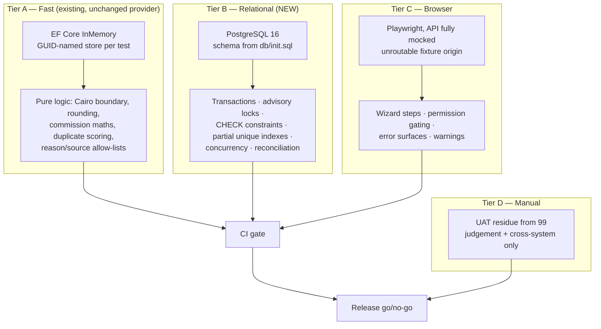
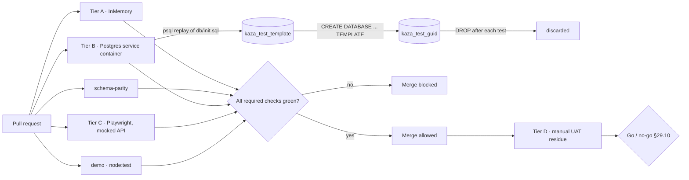

# HB-09 — Test Automation & Release Gates

> [README](README.md) · [Master Plan](00_MASTER_PLAN.md) · Prev: [HB-08](08_TICKET_REPORTING_AUDIT_OBSERVABILITY_AND_ROLLOUT.md) ·
> Scenarios: [99](99_RELIABILITY_TEST_SCENARIOS.md)

---

## 1. Ticket metadata

| Field | Value |
|---|---|
| Ticket ID | **HB-09** |
| Title | Feature Test Automation, Release Gates & Rollout Verification for Record Historical Booking |
| Priority | **P1 — release-gating** |
| Type | Feature test automation + release gates + rollout verification. **Extends the `PRE-02` baseline infrastructure; does not own it** |
| Status | Ready for review |
| Dependencies | [HB-06](06_TICKET_HISTORICAL_BOOKING_WIZARD_UI.md), [HB-07](07_TICKET_NOTIFICATIONS_AUTOMATIONS_AND_INTEGRATIONS.md), [HB-08](08_TICKET_REPORTING_AUDIT_OBSERVABILITY_AND_ROLLOUT.md) — transitively HB-01…HB-05 |
| Consumes | [`PRE-02`](DECISION_RATIFICATION_PACKET.md#pre-02--baseline-test-execution-and-postgresql-integration-infrastructure) — the CI test step, real-PostgreSQL provisioning, reusable fixture and transaction-capable setup, all delivered before HB-03 |
| Dependents | None. This is the terminal ticket. |
| Risk level | **Medium** — no production behaviour change, but it is the last gate before release; a weak gate ships a `Critical`-severity financial defect |
| Estimated complexity | **M** |
| Implemented by | Sole Project Owner. Review lenses: Engineering · Operations |
| Target branch | `feat/hb09-historical-test-automation` |

> **This ticket tests the feature. It does not build the capability to test it.** That capability is
> [`PRE-02`](DECISION_RATIFICATION_PACKET.md#pre-02--baseline-test-execution-and-postgresql-integration-infrastructure), an independent
> prerequisite PR delivered **before HB-03**. Section 5's findings — no automated test gate in CI, no test
> path capable of exercising transactions, advisory locks, `CHECK` constraints or partial unique indexes —
> are what `PRE-02` exists to fix. HB-09 inherits the result and builds the feature suites on top.

### 1.1 The boundary with `PRE-02`

An earlier revision of this pack said HB-09 *delivered* `PRE-02`. That was circular: `PRE-02` gates HB-03's
merge, and HB-09 runs after HB-03. The split is now explicit.

| Concern | Owner |
|---|---|
| CI test step that can fail the build | **`PRE-02`** — HB-09 extends it with feature jobs and required-check configuration |
| Real-PostgreSQL provisioning: CI service container and local path | **`PRE-02`** — HB-09 **consumes** |
| Reusable PostgreSQL integration-test fixture | **`PRE-02`** — HB-09 **consumes** |
| Transaction-capable test setup (transactions, advisory locks, commit/rollback) | **`PRE-02`** — HB-09 consumes |
| Clear failure when PostgreSQL is unavailable; **no silent fallback** | **`PRE-02`** — HB-09 asserts it still holds |
| Baseline documentation for writing relational tests | **`PRE-02`** — HB-09 extends with feature guidance |
| Historical Bookings regression suites | **HB-09** |
| Reliability-scenario release coverage | **HB-09** |
| Feature release gates | **HB-09** |
| Rollout verification | **HB-09** |
| Final traceability and sign-off evidence | **HB-09** |

**HB-09 must not own, delay, or reimplement the baseline PostgreSQL infrastructure.** If the `PRE-02`
fixture proves inadequate, extend it in place and record why — do not rebuild it, and never defer a
`PRE-02` guarantee into HB-09's timeline. Anything in the sections below that reads like building the
harness is describing what HB-09 **inherits**, and is scoped to feature-specific extension only.

---

## 2. Business context

The Record Historical Booking feature writes directly into revenue, payment balances, owner entitlements and
occupancy history, in a single privileged operation, on data that nobody can visually cross-check because
the stay already happened. There is no guest who will phone to complain that their completed booking was
recorded against the wrong owner at the wrong commission rate. Defects in this feature are **silent and
financial**.

The ordinary compensating control — "operations will notice" — is unavailable. Automated verification is
therefore the primary control, not a secondary one. [Master Plan §31](00_MASTER_PLAN.md#31-definition-of-done)
requires that "all 17 invariants have an automated assertion" before the feature is production-ready; this
ticket is the only place that requirement is discharged.

---

## 3. Problem being solved

Four distinct problems, in dependency order:

1. **There is no automated test gate.** `CONFIRMED` — `.github/workflows/pr-checks.yml` runs five jobs, all
   of which are *builds*. A grep for `dotnet test`, `playwright`, `npm test` and `npm run test` across
   `.github/workflows/` returns nothing. The 33 existing backend tests and the five existing Playwright
   suites never run in CI. A pull request that deletes every test still passes every check.
2. **The existing test path cannot express this feature's semantics.** All three backend test fixtures use
   the EF Core InMemory provider, which cannot exercise transactions, `pg_advisory_xact_lock`, raw-SQL CHECK
   constraints, or partial unique indexes — the exact four mechanisms this feature relies on
   (INV-05, HB-03 concurrency, HB-02/HB-04 constraints, HB-03 `external_reference` uniqueness).
3. **The reliability scenario pack has no execution contract.** [99](99_RELIABILITY_TEST_SCENARIOS.md)
   enumerates scenarios; without a mapping from scenario to automation tier, "P0 + P1 green" is an opinion.
4. **There is no defined release gate.** [Master Plan §22](00_MASTER_PLAN.md#22-rollout-strategy) names
   rollback triggers but nothing decides go/no-go, and nothing prevents a merge that breaks the guarantees.

---

## 4. User value

| Stakeholder | Value |
|---|---|
| Finance | Machine-proven arithmetic: `snapshot_owner_amount + snapshot_kaza_amount = agreed_amount`, re-asserted on every commit rather than reviewed once |
| Operations | Confidence that a second operator recording the same offline booking is rejected, not silently duplicated |
| Engineering | A relational test path the whole platform can reuse — the single highest-leverage output of this ticket, worth more than the feature it was built for |
| Security | Permission bypass, IDOR and tampering encoded as executable regression, not a one-off review |
| Release management | An unambiguous, evidence-backed go/no-go |
| Everyone | The existing 33 tests start actually running |

---

## 5. Current repository behavior

All claims verified by direct read at commit `8dafb5a`. Identifiers `TI-nn` are **ticket-local** test-
infrastructure observations; they deliberately do not extend the global `F-01…F-14` register.

### TI-01 — The test project declares no data-access packages of its own

`CONFIRMED`. `RentalPlatform.Tests/RentalPlatform.Tests.csproj` declares exactly three packages —
`Microsoft.NET.Test.Sdk` 17.14.1, `xunit` 2.9.3, `xunit.runner.visualstudio` 3.1.5 — plus `ProjectReference`
entries to `RentalPlatform.API`, `RentalPlatform.Business` and `RentalPlatform.Data`.

### TI-02 — Both relational providers are already reachable, transitively

`CONFIRMED`, and this **resolves the central worry in [OQ-09](00_MASTER_PLAN.md#32-open-questions)**:

| Package | Version | Declared in | Reaches tests via |
|---|---|---|---|
| `Microsoft.EntityFrameworkCore` | 10.0.6 | `RentalPlatform.Data/RentalPlatform.Data.csproj:11` | `ProjectReference` |
| `Microsoft.EntityFrameworkCore.InMemory` | 10.0.6 | `RentalPlatform.Data/RentalPlatform.Data.csproj:12` | `ProjectReference` |
| `Microsoft.EntityFrameworkCore.Relational` | 10.0.6 | `RentalPlatform.Data/RentalPlatform.Data.csproj:13` | `ProjectReference` |
| `Microsoft.EntityFrameworkCore.Sqlite` | 10.0.6 | `RentalPlatform.Data/RentalPlatform.Data.csproj:14` | `ProjectReference` (brings `SQLitePCLRaw`) |
| `Npgsql.EntityFrameworkCore.PostgreSQL` | 10.0.1 | `RentalPlatform.API/RentalPlatform.API.csproj:15` | `ProjectReference` |

**Consequence:** `UseNpgsql(...)` and `UseSqlite(...)` both compile inside `RentalPlatform.Tests` **today,
with no package change**. OQ-09 is therefore not a packaging question. What is genuinely missing is (a) a
fixture that uses a relational provider, (b) a connection-string source, and (c) a database in CI. That is a
materially smaller problem than the Master Plan assumed, and it is the reason this ticket is sized **M**
rather than **L**.

### TI-03 — Every existing fixture is InMemory

`CONFIRMED`. Three call sites, one per test file:

| File | Line | Call |
|---|---|---|
| `RentalPlatform.Tests/BookingHistoryCreatorTests.cs` | `:226` | `.UseInMemoryDatabase($"booking-history-{Guid.NewGuid():N}")` |
| `RentalPlatform.Tests/CrmRecommendationLeadTests.cs` | `:301` | `.UseInMemoryDatabase($"crm-recommendation-{Guid.NewGuid():N}")` |
| `RentalPlatform.Tests/PublicUnitCatalogTests.cs` | `:134` | `.UseInMemoryDatabase($"public-catalog-{Guid.NewGuid():N}")` |

Each fixture generates a fresh GUID-named store per test, so isolation is already correct in the fast tier —
that pattern should be preserved, not replaced.

### TI-04 — Exactly 33 backend tests, and the arithmetic is checkable

`CONFIRMED`. Across the three files: 19 `[Fact]` attributes, 3 `[Theory]` attributes and 14 `[InlineData]`
rows. Expanded: 19 + 14 = **33 test cases**, which matches the reported baseline exactly. Per file:
`BookingHistoryCreatorTests.cs` 5 attributes / 0 `InlineData`; `CrmRecommendationLeadTests.cs` 13 / 14;
`PublicUnitCatalogTests.cs` 4 / 0.

### TI-05 — The advisory lock is Postgres-only, not merely relational

`CONFIRMED`. `RentalPlatform.Data/UnitOfWork.cs:127`:

```csharp
await _context.Database.ExecuteSqlInterpolatedAsync(
    $"SELECT pg_advisory_xact_lock(hashtextextended({resourceKey}, 0))", cancellationToken);
```

and the `TryAcquire` variant using `pg_try_advisory_xact_lock(hashtextextended(...))`. Both call
`hashtextextended`, a PostgreSQL-internal function with **no SQLite equivalent and no shim**. Both are
preceded by `EnsureActiveTransaction()`, so they additionally require a real transaction.

**This single citation decides the harness question.** SQLite cannot partially help with concurrency
testing; it cannot help at all. See §11.2.

### TI-06 — Nothing suppresses `TransactionIgnoredWarning`

`CONFIRMED` by absent evidence: a grep for `TransactionIgnoredWarning` and `ConfigureWarnings` across all
`.cs` files returns no matches. `INFERRED`: the existing suite has never exercised
`BookingService.CreateQuickAsync` (which opens a transaction at `BookingService.cs:290`), because on the
InMemory provider that would raise the warning as an error. Any attempt to test the historical command's
atomic path on InMemory will fail immediately rather than pass misleadingly — an honest failure mode, but a
blocking one.

### TI-07 — CI runs builds only; no test executes anywhere

`CONFIRMED`. `.github/workflows/pr-checks.yml`, triggered `on: pull_request: branches: [dev, main]`:

| Job | Line | What it actually does |
|---|---|---|
| `backend` | `:12-24` | `dotnet restore` + `dotnet build RentalPlatform.slnx -c Release` |
| `api-container` | `:26-32` | `docker build -f RentalPlatform.API/Dockerfile` |
| `frontend-demo` | `:34-54` | `npm ci` + `npm run build` |
| `frontend-portal` | `:56-79` | `npm ci` + `npm run type-check` + `npm run build` |
| `compose-validate` | `:81-91` | `docker compose ... config` against `.env.example` |

There is no `dotnet test` step, no Playwright step, no lint step, and no database service container.
`.github/workflows/deploy-production.yml` is an SSH deploy gated by the `production` GitHub Environment
manual approval (`:20`), and explicitly notes `DB migrations are NOT run here` (`:5`).
`.github/workflows/production-login-smoke-maintenance.yml` is `workflow_dispatch`-only and runs against
production over SSH — it is **not** a CI gate and must never be repurposed as one.

### TI-08 — A complete from-scratch Postgres schema builder already exists

`CONFIRMED`. `docker-compose.yml:6` uses `postgres:16-alpine`; `:16-17` mounts `./db/migrations` read-only
into `/docker-entrypoint-initdb.d/migrations`. `db/init.sql` is a hand-maintained, ordered list of `\i`
includes — 55 include statements — that replays the migration history onto an empty database, with `\echo`
progress markers and a terminating `=== All migrations completed successfully ===`.

This is the CI schema-provisioning mechanism. It already exists, is already exercised by every developer's
first `docker compose up`, and needs no new tooling.

### TI-09 — `db/init.sql` has already drifted from `db/migrations`

`CONFIRMED`, and it is a live defect, not a hypothetical. `db/migrations/0057_add_owner_contact_fields.sql`
exists on disk; `db/init.sql` ends at `0056_add_unit_portfolio_visibility.sql`. A database built from
`init.sql` today is **one migration behind** a database built by applying `db/migrations` in order.

Two consequences: (a) any relational test harness built on `init.sql` inherits the drift, and (b) drift is
unbounded because nothing checks it. §11.5 makes parity a CI gate — this is a genuine bug fix that this
ticket delivers as a side effect.

### TI-10 — `scripts/apply-migrations.sh` is a production runner and is unusable in CI

`CONFIRMED`. Its header declares it a "gated, tracked production migration runner"; it defaults
`ENV_FILE=/opt/kaza/env/.env.production` and `COMPOSE_FILE=/opt/apps/kaza-booking/docker-compose.prod.yml`,
takes a database backup first, executes via `docker compose ... exec -T db psql`, refuses destructive SQL
unless `APPROVE_DESTRUCTIVE=1`, and **refuses to run if the `schema_migrations` ledger is empty** — which is
exactly the state of a fresh CI database. CI must use `db/init.sql`, never this script.

### TI-11 — Frontend test infrastructure: five Playwright suites, no unit-test runner in the portal

`CONFIRMED`. `rental-platform` has five Playwright configurations, each with its own port, `testDir` and
mocked API origin:

| Config | `testDir` | Port | Mocked API origin |
|---|---|---|---|
| `playwright.admin.config.ts` | `tests/admin-smoke` | — | — |
| `playwright.booking-history.config.ts` | `tests/booking-history` (`:6`) | 3103 (`:22`) | `http://booking-history-fixture.local` (`:42`) |
| `playwright.client.config.ts` | `tests/client-smoke` | — | — |
| `playwright.crm.config.ts` | `tests/crm-ui` (`:6`) | 3102 (`:22`) | `http://crm-fixture.local` (`:36`) |
| `playwright.owner.config.ts` | `tests/owner-smoke` | — | — |

The API origin is a deliberately **unroutable** hostname; specs intercept everything with
`page.route(\`${API_ORIGIN}/**\`, ...)` and fulfil envelopes locally
(`tests/crm-ui/crm-workspace.spec.ts:197`, helper `fulfillEnvelope` at `:133-147`). The CRM suite is 1,605
lines, the booking-history suite 645. `fullyParallel: false`, `workers: 1`, `retries: 0`, `forbidOnly` under
CI, trace/screenshot/video retained on failure.

**This is the pattern to extend, not redesign.** It is hermetic, needs no backend, and is already
deterministic.

`rental-platform/package.json` exposes `test:e2e`, `test:e2e:ui`, `test:client-smoke`, `test:crm-ui`,
`test:booking-history` — and **no plain `test` script**. There is no vitest, jest or React Testing Library.

### TI-12 — `demo` uses `node:test` via `tsx`, not vitest

`CONFIRMED`, and this **corrects the assumption carried into this ticket**.
`demo/package.json` → `"test": "tsx --test src/lib/search/*.test.ts src/lib/booking/*.test.ts"`.
`demo/src/lib/booking/guest-count.test.ts:1-2`:

```ts
import test from "node:test";
import assert from "node:assert/strict";
```

Three test files exist: `src/lib/booking/guest-count.test.ts`, `src/lib/search/filters.test.ts`,
`src/lib/search/project-locations.test.ts`. The house style for pure-logic frontend tests is therefore the
Node built-in runner, with a glob that must be extended when new directories are added.

### TI-13 — Sanitized fixture data is already the convention

`CONFIRMED`. `RentalPlatform.Tests/BookingHistoryCreatorTests.cs:47` asserts the actor display name
`"Sanitized Admin A"`; `:52` uses the note `"Sanitized follow-up completed."`. Fixture builders already
prefix synthetic identities with `Sanitized`. New fixtures must follow it, which makes accidental PII
visually obvious in review.

---

## 6. Target behavior

1. The **relational test tier delivered by `PRE-02`** carries Historical Bookings suites, with the fast
   InMemory tier preserved unchanged. HB-09 adds tests to that tier; it does not create it.
2. Every invariant `INV-01 … INV-17` has at least one automated assertion, and the mapping is tabulated.
3. Every scenario group in [99](99_RELIABILITY_TEST_SCENARIOS.md) is assigned an automation tier, with a
   written justification for anything left manual.
4. `pr-checks.yml` gains **feature** test jobs that block merge, on top of the `PRE-02` test step.
5. `db/init.sql` ↔ `db/migrations` parity is machine-checked — on the `PRE-01` baseline.
6. A single documented command per project reproduces CI locally.
7. Release go/no-go is decided by a checklist with measurable thresholds, not judgement.
8. Rollout verification and the final traceability and sign-off evidence are produced.

---

## 7. In scope

- **Historical Bookings regression suites** — automated tests for HB-02 … HB-08 behaviour: domain, API
  contract, conflicts, duplicates, financial snapshot, owner attribution, side-effect absence, reporting
  dimensions.
- **Reliability-scenario release coverage** — every scenario group in
  [99](99_RELIABILITY_TEST_SCENARIOS.md) assigned a tier, automated where the tier says so.
- **Feature release gates** — merge-blocking status checks for the feature suites, thresholds, flake and
  quarantine policy, release checklist, UAT execution contract.
- **Rollout verification** — executing the post-deploy checks HB-08 defines and recording their results.
- **Final traceability and sign-off evidence** — the closing REQ → AC/NAC → SC evidence pack.
- Sanitized fixture **builders** for the Historical Bookings entity set in §11.6, built on the `PRE-02`
  fixture.
- Concurrency, security, financial-reconciliation and non-regression suites.
- Playwright coverage for the HB-06 wizard, following the existing mocked-API pattern.
- Making the existing 33 tests and existing Playwright suites run in CI, once the `PRE-02` test step exists.
- Extending the `PRE-02` documentation with feature-specific guidance.

## 8. Out of scope

- **The baseline testing infrastructure.** The CI test step, real-PostgreSQL provisioning, the reusable
  integration fixture, transaction-capable setup, the no-silent-fallback guarantee and the baseline
  documentation are all [`PRE-02`](DECISION_RATIFICATION_PACKET.md#pre-02--baseline-test-execution-and-postgresql-integration-infrastructure).
  HB-09 consumes and extends them and must not rebuild, fork or delay them.
- Any change to application source, migrations, or feature behaviour. If a test fails, the fix belongs to
  the owning ticket (HB-02 … HB-08), not here.
- Rewriting the three existing InMemory fixtures onto the relational provider. They pass; leave them.
- Introducing vitest, jest or React Testing Library to `rental-platform` (see §10, D-04).
- Load, soak, or performance testing. No performance requirement has been stated for this feature.
- Contract testing against external systems — none exist (`F-04`).
- Testing production. `production-login-smoke-maintenance.yml` remains untouched and manual.
- Mutation testing. Valuable, but a separate initiative.

---

## 9. Assumptions

| # | Assumption | Label | If false |
|---|---|---|---|
| A-1 | GitHub-hosted runners may start a `postgres:16-alpine` service container | `INFERRED` — standard Actions capability, unverified for this org's runner policy | Fall back to Testcontainers (D-02); if Docker is also unavailable, Tier B becomes local-and-nightly only, and §33 RISK-H2 applies |
| A-2 | `db/init.sql` builds a complete, queryable schema on an empty database | `CONFIRMED` for 0001–0056; `TI-09` drift must be fixed first | Provision by iterating `db/migrations/*.sql` in filename order instead |
| A-3 | Tests may run `CREATE DATABASE` on the CI Postgres instance | `INFERRED` — the service container's superuser can | Use one database with per-test transaction rollback (slower, weaker) |
| A-4 | HB-02 … HB-08 land before HB-09 completes | Stated dependency | HB-09 writes failing tests first and holds them red behind the gate |
| A-5 | No test ever needs production data | `PROPOSED` — enforced by §11.7 | The feature is untestable within policy; escalate rather than copy data |
| A-6 | Playwright browser download is permitted in CI | `INFERRED` | Pin a browser-preinstalled container image |

---

## 10. Decision-required items

Decision authority for every row is the **Sole Project Owner** (2026-07-29). The **Review lens** column
names the perspectives applied — it is not a list of separate approvers.

| ID | Decision | Reason it is open | Impact if unresolved | Recommended default | Review lens | Blocks? |
|---|---|---|---|---|---|---|
| D-01 | Adopt real PostgreSQL as the Tier B provider | [OQ-09](00_MASTER_PLAN.md#32-open-questions) is registered as open; `TI-02` shows the packaging is already solved | Without it, INV-05, HB-03 concurrency and all CHECK/partial-index coverage are unachievable — the feature cannot meet its Definition of Done | **Adopt.** Postgres 16 service container in CI + `docker compose up db` locally. `TI-05` makes SQLite non-viable | Engineering | **Yes** |
| D-02 | Testcontainers as well, or service container only? | Testcontainers gives identical local/CI behaviour at the cost of a new dependency and Docker-in-Docker | Divergent local vs CI setup causes "works on my machine" | Service container in CI, `docker compose up db` locally, behind **one** fixture abstraction so Testcontainers can be swapped in later without touching a single test | Engineering | No |
| D-03 | Do test jobs block merge, or report only? | Adding a required check changes branch protection for every contributor | Non-blocking tests are decoration; `TI-07` shows what that leads to | **Blocking** for Tier A, Tier B and portal type-check. Tier C blocking only on PRs touching `rental-platform/` | Engineering | **Yes** |
| D-04 | Frontend unit-test runner for `rental-platform` | The portal has none (`TI-11`); `demo` uses `node:test` + `tsx` (`TI-12`) | Pure wizard logic (step gating, split arithmetic display) gets tested through a browser, slowly, or not at all | Mirror `demo`: add `tsx` as a devDependency and a `"test": "tsx --test ..."` script. One dependency, house-consistent. Do **not** introduce vitest/jest/RTL in this ticket | Engineering | No |
| D-05 | Coverage threshold, if any | No coverage tooling exists today | A number chosen badly becomes a target to game | **No global percentage.** Gate on the invariant-assertion matrix (§27 AC-HB09-06) — 17 of 17 covered — which is meaningful where a percentage is not | Engineering · Operations | No |
| D-06 | Who executes the manual UAT residue | Previously assumed a multi-party signature circuit | Without an executor the residue is skipped and the release gate is hollow | **The Sole Project Owner executes it**, applying the Operations lens to operational scenarios and the Finance lens to reconciliation scenarios. Evidence artefacts replace signatures | Operations · Finance | No — resolved |
| D-07 | Who fixes the `TI-09` `db/init.sql` drift? | It is a pre-existing defect, unrelated to this feature, discovered here | A CI parity gate added over a broken baseline fails on day one; and a feature ticket that also edits bootstrap SQL is hard to review and hard to revert | **A separate prerequisite implementation PR, `PRE-01`** — not this ticket and not a feature ticket. It adds the missing `\i` for `0057` and the `_rollback.sql` that `0057` lacks. HB-09 **depends** on `PRE-01` and adds the parity gate only once it has merged. See [Master §21.1](00_MASTER_PLAN.md#211-prerequisites-before-any-historical-migration-lands) | Engineering | **Yes — `PRE-01` must merge first** |

---

## 11. Architecture and technical design

### 11.1 Test topology



Tier A stays exactly as it is. Tier B is additive. Nothing in this design requires editing the three
existing test files.

### 11.2 Why real PostgreSQL, and why not the alternatives

| Capability this feature needs | InMemory | SQLite relational | Real Postgres |
|---|---|---|---|
| Atomic multi-write commit (INV-05, INV-06) | **No** — `TransactionIgnoredWarning` (`TI-06`) | Yes | Yes |
| `pg_advisory_xact_lock(hashtextextended(...))` (HB-03, `TI-05`) | **No** — relational-only API | **No** — function does not exist, no shim | Yes |
| Raw-SQL CHECK constraints (`ck_bookings_source`, `ck_payments_amount_positive`, new historical CHECKs) | **No** | **No** — the DDL is PostgreSQL SQL and will not parse; EF `EnsureCreated` would not reproduce raw-SQL constraints | Yes |
| Partial unique index on `external_reference WHERE NOT NULL` (HB-03, V-18) | **No** | Partial indexes exist but EF translation and conflict semantics differ | Yes |
| Reporting views (`0041`, `0042`) used by HB-08 assertions | **No** | **No** — views are Postgres SQL | Yes |
| `DATE` / `DECIMAL(12,2)` / `DECIMAL(5,2)` fidelity for reconciliation | Approximate | Approximate | Exact |

SQLite scores zero on the four decisive rows. It is not a partial solution; it is a distraction, and this
ticket rejects it explicitly so nobody re-proposes it mid-implementation.

**Recommendation (D-01):** PostgreSQL 16 as a GitHub Actions service container, schema built from
`db/init.sql`, with the same image (`postgres:16-alpine`, `docker-compose.yml:6`) locally. Testcontainers is
a supported future swap, isolated behind one fixture class (D-02).

### 11.3 Relational fixture design (`PROPOSED`)

A single `RelationalFixture` type, sibling to the existing InMemory fixtures, responsible for:

```
resolve connection string  ->  KAZA_TEST_DB env var, else localhost default
safety guard               ->  refuse unless host is local AND db name matches ^kaza_test
template provisioning      ->  once per test run: create kaza_test_template, replay db/init.sql
per-test database          ->  CREATE DATABASE kaza_test_<guid> TEMPLATE kaza_test_template
context construction       ->  UseNpgsql(perTestConnectionString)
service graph              ->  real UnitOfWork, real services, NullLogger, fake clock
teardown                   ->  DROP DATABASE kaza_test_<guid> (WITH FORCE)
```

`CREATE DATABASE ... TEMPLATE` is what makes per-test isolation affordable: the 55-file schema replay
happens **once**, and each test gets a byte-identical private copy in milliseconds. Per-test databases also
mean xUnit's default parallelism can stay on for Tier B, except for the concurrency collection (§19).

The fixture must inject a **controllable clock** rather than reading `DateTime.UtcNow`, because the Cairo
boundary (ADR-03) is untestable otherwise. If the shared business-date resolver — specified in HB-01 §11.2.1
and built by [HB-08 §26.1](08_TICKET_REPORTING_AUDIT_OBSERVABILITY_AND_ROLLOUT.md#261-req-16-hardening-tasks--the-last-commits-on-this-branch)
— is not injectable, that is a finding to hand back to HB-08, not to work around here (§36).

### 11.4 Concurrency test design

The scenario: two operators record the same offline booking, same unit, same dates, simultaneously. Exactly
one booking must exist and exactly one request must receive `409 HISTORICAL_OVERLAP_CONFLICT` (or
`HISTORICAL_DUPLICATE_BOOKING`).

```mermaid
sequenceDiagram
    participant T as Test
    participant R1 as Request A
    participant R2 as Request B
    participant PG as PostgreSQL

    T->>PG: seed unit U, client C, admin with bookings:record_historical
    T->>R1: start (own DbContext, own connection)
    T->>R2: start (own DbContext, own connection)
    par both in flight
        R1->>PG: BEGIN; pg_advisory_xact_lock(booking-unit:U)
        R2->>PG: BEGIN; pg_advisory_xact_lock(booking-unit:U) — BLOCKS
    end
    R1->>PG: conflict scan (incl. Completed, LeftEarly) -> clear
    R1->>PG: INSERT booking; COMMIT (lock released)
    PG-->>R2: lock acquired
    R2->>PG: conflict scan -> finds A's booking
    R2-->>T: 409
    T->>PG: assert COUNT(bookings WHERE unit=U AND dates overlap) = 1
    T->>T: assert exactly one 200 and one 409
```

Non-negotiable properties of this test:

- Each request uses its **own `DbContext` and its own physical connection**. Sharing a context serialises the
  work and the test passes vacuously.
- Both tasks are started before either is awaited (`Task.WhenAll` over already-started tasks).
- The assertion is on the **database row count**, not on the service return values alone.
- Run it `N = 20` times in a loop, or as a `[Theory]` with 20 rows, and require 20/20. A single green run of
  a race test proves nothing.
- It lives in a serial xUnit collection so parallel unrelated tests cannot perturb timing.
- **It cannot run on Tier A.** Attempting it there is the clearest possible demonstration of why D-01 exists.

### 11.5 CI design (`PROPOSED`)

Additions to `.github/workflows/pr-checks.yml`, preserving the five existing jobs:

| New job | Runs | Blocking (D-03) | Target wall clock |
|---|---|---|---|
| `backend-tests-fast` | `dotnet test --filter Category=Fast` | Yes | < 2 min |
| `backend-tests-relational` | `dotnet test --filter Category=Relational` with a `postgres:16-alpine` service container | Yes | < 8 min |
| `schema-parity` | Assert every non-`_verify`/`_rollback`/`_test` file in `db/migrations` appears exactly once in `db/init.sql`, in ascending order | Yes | < 30 s |
| `portal-e2e` | `npm run test:crm-ui`, `test:booking-history`, and the new historical suite | Yes, on `rental-platform/**` changes | < 15 min |
| `demo-unit` | `npm test` in `demo/` | Yes | < 1 min |

The service container is declared with a health check so the job does not race the database:

```yaml
services:
  postgres:
    image: postgres:16-alpine
    env: { POSTGRES_DB: kaza_test, POSTGRES_USER: postgres, POSTGRES_PASSWORD: postgres }
    ports: ["5432:5432"]
    options: >-
      --health-cmd pg_isready --health-interval 10s
      --health-timeout 5s --health-retries 5
```

Schema is loaded by replaying `db/migrations` in `db/init.sql` order via `psql` before the test step —
**not** via `scripts/apply-migrations.sh` (`TI-10`).

The `schema-parity` job is the direct remedy for `TI-09` and is the cheapest high-value gate in this ticket.

### 11.6 Fixture catalogue (`PROPOSED`)

Sanitized only, following the `Sanitized *` naming convention (`TI-13`). Every builder is deterministic given
a seed.

| Entity | Required fixtures | Why this feature needs it |
|---|---|---|
| Admin users | (a) `bookings:write` only, (b) `+ bookings:record_historical`, (c) `+ bookings:override_owner`, (d) no booking permissions, (e) a deny-override user | Permission matrix (§16); `rbac_admin_user_permission_overrides` grant/deny both exercised |
| Owners | Two, with different `CommissionRate` values, plus one mutated mid-test | Commission snapshot immutability (REQ-08, INV-14) |
| Units | Active; **inactive but not deleted**; soft-deleted (`DeletedAt` set); one belonging to a second portfolio | ADR-12, REQ-17, `UNIT_DELETED_UNSUPPORTED`, cross-portfolio IDOR |
| Clients | Existing matchable; near-match (differing phone format); absent (match-or-create path) | RISK-12, V-20 |
| Bookings | One per `BookingStatus` value — all ten: Prospecting, Relevant, NoAnswer, NotRelevant, Booked, Confirmed, CheckIn, Completed, Cancelled, LeftEarly | F-02: proves `Completed`/`LeftEarly` now conflict and the soft-hold statuses still behave |
| Historical bookings | `is_historical = true`, various stay months, with and without `external_reference` | Historical-vs-historical overlap; partial unique index |
| Payments | `paid` with historic `PaidAt`; `pending`; each allowed method | REQ-06, balance formula |
| Owner payouts | One `pending`, one `paid` | INV-09 — proves a paid payout is not mutated |
| Date blocks | Overlapping and adjacent to the target stay | V-07, `SC-AVAIL-07` |
| Invoices | One issued, one draft, one superseded | F-10, balance basis |
| Seasonal pricing | Rows covering the historical stay window | Proves the agreed amount ignores live pricing (INV-15) |

**Boundary fixtures are mandatory, not optional:** stays ending yesterday, today and tomorrow in Cairo terms;
adjacent bookings sharing a checkout/check-in date (the `endDate = last night` semantics of
`UnitAvailabilityService.cs:52` are exactly where off-by-one defects hide).

### 11.7 Test-data safety

Three independent controls, because one is not enough for a suite that can `DROP DATABASE`:

1. **Connection guard in the fixture.** Refuse to run if the host is not `localhost` / `127.0.0.1` / the CI
   service alias, or if the database name does not match `^kaza_test`. Throw, do not warn.
2. **No production credentials in CI.** The test jobs receive no repository secrets. The service container's
   credentials are literals in the workflow, valid only for that job.
3. **No shared mutable database.** Per-test databases created from a template; nothing persists between
   tests, so nothing can leak between them.

Tests never read `.env.production`, never target `/opt/apps/kaza-booking`, and never invoke
`scripts/apply-migrations.sh`, `scripts/deploy-production.sh` or `scripts/backup-postgres.sh`.

---

## 12. Expected data flow



---

## 13. Expected files/components likely to change

`PROPOSED` — the implementer confirms; nothing here is asserted as mandatory.

| Path | Likely change |
|---|---|
| `RentalPlatform.Tests/RentalPlatform.Tests.csproj` | Possibly a test-collection or assertion helper package; **no EF/Npgsql package is needed** (`TI-02`) |
| `RentalPlatform.Tests/Infrastructure/RelationalFixture.cs` | **New** — provider, template DB, per-test DB, safety guard, teardown |
| `RentalPlatform.Tests/Infrastructure/FixtureBuilders.cs` | **New** — the §11.6 catalogue |
| `RentalPlatform.Tests/Infrastructure/TestClock.cs` | **New** — controllable Cairo business date |
| `RentalPlatform.Tests/Historical/*.cs` | **New** — domain, API, conflict, duplicate, financial, owner, side-effect, reporting suites |
| `RentalPlatform.Tests/Historical/ConcurrencyTests.cs` | **New** — §11.4, serial collection |
| `RentalPlatform.Tests/Security/*.cs` | **New** — permission, IDOR, tampering |
| `.github/workflows/pr-checks.yml` | Five new jobs (§11.5) |
| `db/init.sql` | **Changed by `PRE-01`, not by HB-09** (D-07). Listed only so the dependency is visible |
| `scripts/` | Possibly a `check-init-sql-parity.sh` used by CI and locally |
| `rental-platform/playwright.historical.config.ts` | **New** — own port, own `testDir`, own fixture origin, mirroring `playwright.crm.config.ts` |
| `rental-platform/tests/historical-booking/*.spec.ts` | **New** — wizard suite |
| `rental-platform/package.json` | New `test:historical` script; possibly `tsx` + `test` (D-04) |
| `demo/package.json` | Glob extension only if new `demo` logic modules are added |
| `docs/` | Test-running instructions for contributors |

---

## 14. API changes

**None.** HB-09 adds no endpoint, changes no contract, and alters no status code. It *asserts* the contract
defined in [Master Plan §12](00_MASTER_PLAN.md#12-api-and-command-design):

| Assertion target | Expected |
|---|---|
| `POST /api/internal/bookings/historical` | `200 OK` on the happy path, for a caller holding `bookings:record_historical` (repository-native envelope, `BookingsController.cs:114`) |
| Error codes asserted verbatim | `VALIDATION_ERROR`, `CLIENT_REFERENCE_INVALID`, `CLIENT_NOT_FOUND`, `CLIENT_PHONE_ALREADY_EXISTS`, `CLIENT_PHONE_REQUIRES_REVIEW`, `UNIT_NOT_FOUND`, `ADMIN_USER_NOT_FOUND`, `HISTORICAL_CHECKOUT_NOT_COMPLETED`, `ORIGINAL_SOURCE_INVALID`, `IDEMPOTENCY_KEY_REQUIRED`, `IDEMPOTENCY_KEY_REUSED`, `IDEMPOTENCY_REQUEST_IN_PROGRESS`, `OWNER_ATTRIBUTION_REQUIRES_REVIEW`, `EXTERNAL_REFERENCE_ALREADY_EXISTS`, `HISTORICAL_OVERLAP_CONFLICT`, `HISTORICAL_DUPLICATE_BOOKING`, `HISTORICAL_FINANCIAL_SNAPSHOT_IMMUTABLE`, `UNIT_DELETED_UNSUPPORTED`, `OWNER_ATTRIBUTION_REQUIRED`, `OWNER_OVERRIDE_FORBIDDEN`, `STAY_DATES_IN_PAST`. Codes are read from the `code` property of the response envelope, **never** from `errors[0]` ([D-HB02-03](DECISION_RATIFICATION_PACKET.md#d-hb02-03--machine-readable-error-transport)). A `403` from the authorization policy carries an empty body and no code |
| `POST /api/internal/bookings` | Returns `400 STAY_DATES_IN_PAST` for past stays once HB-08 activates the REQ-16 hardening |

Error-code assertions compare the **machine-readable code**, never the human message, so copy edits do not
break the suite.

---

## 15. Data/schema changes

**No application schema change.** Two test-infrastructure schema concerns:

| Item | Change |
|---|---|
| `db/init.sql` | **Not HB-09's to change.** The missing `\i` for `0057_add_owner_contact_fields.sql` (`CONFIRMED` — the file stops at `0056` on `db/init.sql:172`) is a pre-existing bootstrap defect, assigned to prerequisite PR **`PRE-01`** ([Master §21.1](00_MASTER_PLAN.md#211-prerequisites-before-any-historical-migration-lands)). HB-09 **depends** on it: a CI schema replayed from `init.sql` is wrong until `PRE-01` merges. `PRE-01` should also add the `_rollback.sql` that `0057` is missing |
| CI test schema | Built by replaying `db/migrations` in `db/init.sql` order into a throwaway database. No migration is authored, modified or renumbered by this ticket |
| `schema_migrations` ledger | Not used in CI. The ledger is a production-deployment concept (`TI-10`) |

---

## 16. Authorization and security

### 16.1 Security test matrix

| # | Attack | Setup | Required outcome | Invariant |
|---|---|---|---|---|
| S-01 | Permission bypass — no `bookings:record_historical` | Admin with `bookings:write` only | `403 forbidden`; **zero** rows written | INV-10 |
| S-02 | Bypass via the normal endpoint | Past-dated `POST /api/internal/bookings` | `400 STAY_DATES_IN_PAST`; no booking | INV-03, RISK-10 |
| S-03 | Explicit deny override beats a role grant | `rbac_admin_user_permission_overrides` with `deny` | `403 forbidden` | INV-10 |
| S-04 | Owner override without `bookings:override_owner` | Holder of record permission only | `403 OWNER_OVERRIDE_FORBIDDEN`; owner unchanged | INV-14 |
| S-05 | IDOR — unit outside the caller's portfolio | Valid GUID, foreign portfolio | `404 not_found` (not 403 — no existence disclosure) | INV-12 |
| S-06 | IDOR — client outside scope | Valid foreign client GUID | `404 not_found` | INV-12 |
| S-07 | Owner injection | `ownerId` for an owner unrelated to the unit | Rejected unless override-permitted **and** reasoned | INV-12, INV-17 |
| S-08 | Actor spoofing | Body carries `createdByAdminUserId` / `changedByAdminUserId` | Ignored; history actor equals the authenticated principal | INV-11 |
| S-09 | Mass assignment | Body carries `createdAt`, `updatedAt`, `isHistorical`, `bookingStatus`, `snapshotKazaAmount` | Ignored or rejected; server values win | INV-01 |
| S-10 | Financial tampering | Client-supplied split that does not reconcile | Server recomputes; `snapshot_owner_amount + snapshot_kaza_amount = agreed_amount` holds | INV-15 |
| S-11 | Negative / zero amounts | `agreed_amount <= 0`, payment `<= 0` | `400`; DB CHECK holds as a second line | V-15 |
| S-12 | Soft-deleted unit | Unit with `DeletedAt` set | `400 UNIT_DELETED_UNSUPPORTED` | ADR-12 |
| S-13 | PII leakage | Trigger every rejection branch | No guest name, phone or email in any log, metric label or error body | Master §18 |

S-08 and S-09 must assert on **persisted state**, not on the response body. A response that echoes the
correct value while the row is wrong is the exact defect these tests exist to catch.

### 16.2 Security of the harness itself

The test suite is a privileged artefact: it constructs admin principals and can drop databases. Controls in
§11.7 apply. No CI secret is exposed to test jobs; a test that requires one is misdesigned.

---

## 17. Validation rules

Rules for the test suite, enforced by review and where possible by an analyzer or CI grep:

| # | Rule | Enforcement |
|---|---|---|
| T-01 | Every test carries exactly one tier trait (`Fast`, `Relational`, `Concurrency`, `Security`) | Filter-based CI jobs fail on untraited tests |
| T-02 | No test uses `DateTime.Now`, `DateTime.Today`, `DateTime.UtcNow` directly — the injected clock only | CI grep over `RentalPlatform.Tests/`; mirrors NAC-HB01-08 |
| T-03 | No `Thread.Sleep` / `Task.Delay` for synchronisation | CI grep; races must synchronise on real signals |
| T-04 | No test asserts on a human-readable error message | Review; assert error codes |
| T-05 | No hardcoded GUIDs shared across tests | Review; fixtures generate per-test identities |
| T-06 | No fixture contains real personal data | `Sanitized ` prefix convention (`TI-13`) + review |
| T-07 | Every Tier B test tears its database down even on failure | `IAsyncDisposable`, mirroring the existing fixtures |
| T-08 | No test depends on execution order | Per-test databases; no shared static state |
| T-09 | Every negative test asserts persisted state, not just the status code | Review |
| T-10 | Playwright specs intercept **all** API traffic; an unmocked request fails the test | Unroutable fixture origin (`TI-11`) makes this automatic |

---

## 18. Transaction and failure behavior

Failure semantics **of the harness**:

| Failure | Behaviour |
|---|---|
| Postgres service container unhealthy | Job fails fast with a clear message; **never** silently falls back to InMemory. A silent downgrade would produce a green build that proves nothing |
| Template provisioning fails | Whole Tier B run aborts; per-test databases are not attempted |
| A test throws mid-run | Fixture disposal drops the per-test database; the run continues |
| `DROP DATABASE` fails (open connection) | Retry `WITH FORCE`; on second failure log the orphan name and continue — a leaked throwaway database must not mask the real assertion failure |
| Test process is killed | Orphan databases remain; a startup sweep drops anything matching `^kaza_test_` older than one hour |
| Timeout | Per-test timeout so a deadlocked advisory-lock test fails in seconds rather than hanging the job for 6 hours |

Failure semantics **under test** (the behaviour Tier B verifies): a failure at any point in the historical
command leaves **no** booking, **no** status-history row, **no** payment and **no** payout. Asserted by
injecting a failure after the booking insert and before the payment insert, then counting rows in all four
tables. This is the only credible test of INV-05/INV-06, and it is impossible without D-01.

---

## 19. Idempotency and concurrency

### 19.1 Suite idempotency

The suite is re-runnable without cleanup: per-test databases, no shared fixtures, no reliance on wall-clock
date (injected clock, T-02). Running it twice in a row must produce identical results — verified by
AC-HB09-16.

### 19.2 Parallelism policy

| Collection | Parallel? | Rationale |
|---|---|---|
| Tier A | Yes (xUnit default) | GUID-named InMemory stores are already isolated (`TI-03`) |
| Tier B general | Yes | Per-test databases isolate fully |
| Tier B concurrency | **No** — serial collection | Timing-sensitive; parallel CPU pressure causes flakes |
| Tier C Playwright | No — `workers: 1` | Existing configs already set this; keep it |

### 19.3 Feature concurrency coverage

| Case | Expected | Tier |
|---|---|---|
| Two identical historical creations, same unit + dates | One 2xx, one 409; exactly one row | B, serial, 20 iterations |
| Historical vs normal booking, overlapping | One succeeds, one 409 | B, serial |
| Two historical creations, same `external_reference` | One 2xx, one 409; partial unique index holds even if the app check races | B, serial |
| Two creations on **different** units, concurrently | Both succeed — the lock key is per unit (`booking-unit:{unitId:N}`), so this proves the lock is not global | B, serial |
| The 30-second `RecentDuplicateWindow` (`BookingService.cs:19`) is not mistaken for the business duplicate guard | Distinct rejections, distinct codes | B |

The fourth row matters: a lock that is accidentally global would pass every other concurrency test while
serialising all booking creation platform-wide.

---

## 20. Audit and observability

### 20.1 Assertions on the feature's audit trail

| Assertion | Source of truth |
|---|---|
| Exactly **one** `booking_status_history` row after historical creation | ADR-04, F-06 |
| That row has `OldStatus = null`, `NewStatus = Completed`, and the historical note constant | `BookingService.cs:242-253` pattern |
| `ChangedByAdminUserId` equals the authenticated admin, never a body value | INV-11; mirrors `BookingHistoryCreatorTests.cs:36-38` |
| `ChangedAt`, `CreatedAt`, `UpdatedAt` are all within seconds of real now, never the agreement date | INV-01, REQ-02 |
| No history row exists for Booked, Confirmed or CheckIn | REQ-12 — the fabricated-transition test |
| `booking.historical.recorded` audit event emitted once, with the Master §23 field set | Master §23 |
| `booking.historical.owner_override` emitted only when an override occurred | Master §23 |
| Metrics increment: `historical_booking_created_total`, `historical_booking_rejected_total{reason=...}`, `historical_owner_override_total` | Master §23 |
| No log line or metric label contains guest name, phone or email | S-13 |

### 20.2 Observability of the test suite

| Signal | Purpose |
|---|---|
| Per-tier duration published to the job summary | Detects the harness silently getting slower |
| Flake ledger: test name, date, run URL, resolution | Feeds the §29.9 threshold |
| Quarantine list committed in-repo with an owner and expiry per entry | Makes skipping visible instead of quiet |
| Playwright trace/screenshot/video on failure | Already configured in the existing configs; keep |
| `schema-parity` diff printed on failure | Names the missing migration outright |

---

## 21. Notification/side-effect behavior

The suite must both **assert the absence of side effects** and **cause none itself**.

| Assertion (HB-07 verification) | Method |
|---|---|
| Zero notification rows created by historical creation | Count the notifications table before and after — equality, not "no error" |
| `NotifyClientOfStatusChangeAsync` never invoked | Reachable only via `TransitionAsync` (F-04); assert `TransitionAsync` is never called, with a spy or by history-row absence |
| No invoice auto-created | Count invoices; the only auto-create site is Booked→Confirmed (F-10) |
| `AutoCompleteBookingsJob` selects nothing | Seed a historical `Completed` booking with a past checkout, run one sweep, assert zero mutations. The job filters `BookingStatus == CheckIn` (`AutoCompleteBookingsJob.cs:86-87`), so the row must be untouched |
| No `BOOKING_COMPLETED_WITH_BALANCE` admin notification | Seed an outstanding balance and re-run the sweep; still zero |
| No outbound delivery | None exists (F-04); assert by absence of any HTTP/SMTP client in the historical path |

Harness-side: no email, no webhook, no external HTTP. The Playwright origin is unroutable by design
(`TI-11`), so an un-mocked call fails loudly rather than escaping.

---

## 22. Reporting/accounting impact

### 22.1 Financial reconciliation suite (Tier B — Finance-owned assertions)

| # | Test | Expected |
|---|---|---|
| R-01 | Agreed amount survives an unrelated edit | Change guest count via `UpdateAsync`; `agreed_amount` and `FinalAmount` unchanged despite `BookingService.cs:428,439-440` recompute (INV-15, RISK-04) |
| R-02 | Agreed amount survives a seasonal-pricing change | Insert a seasonal row covering the stay; re-read; unchanged |
| R-03 | Commission snapshot survives an `Owner.CommissionRate` change | Mutate `Owner.CommissionRate` after creation; `snapshot_commission_rate` unchanged (REQ-08, RISK-03) |
| R-04 | Split reconciles | `snapshot_owner_amount + snapshot_kaza_amount = agreed_amount`, exactly, at `DECIMAL(12,2)` |
| R-05 | Rounding | Half-away-from-zero to 2dp; assert on rates that produce a `.005` remainder |
| R-06 | Outstanding balance | `(invoice.TotalAmount ?? FinalAmount) − Σ payments where status = 'paid'`, over protected values |
| R-07 | Payout eligibility | `Completed` is in `FinanceEligibleStatuses` (`BookingStatusTransitions.cs:61-70`), so a payout can be created for a historical booking |
| R-08 | A **paid** payout is never mutated | Seed a paid payout; run every historical path; assert byte-identical row (INV-09) |
| R-09 | Stay-period vs recorded-period | A stay in month M recorded in month M+1 appears in the stay-period dimension under M and the recorded dimension under M+1 (REQ-18, ADR-11) |
| R-10 | Legacy reporting unchanged | Non-historical bookings bucket on `DATE(created_at)` exactly as before (F-09) |
| R-11 | Historical deposit period | `PaidAt` drives payment reporting per the [OQ-03](00_MASTER_PLAN.md#32-open-questions) default; the test encodes the default and is re-pointed if Finance decides otherwise |
| R-12 | `original_source` in channel reporting | Historical bookings report their `original_source`, not the generic `source` (F-08) |

R-01, R-03 and R-08 are the three tests that, if absent, permit a silent financial defect to ship. They are
individually release-gating (§29.10).

### 22.2 Reporting-view assertions

Views `0041` and `0042` are PostgreSQL objects — Tier B only. Assertions run SQL against the views directly
and compare to values computed independently in the test, never to values produced by the same service under
test.

---

## 23. Backward compatibility

| Surface | Impact |
|---|---|
| Application runtime | **None.** No source, migration or config change |
| Existing 33 backend tests | Must remain green, unmodified. They start running in CI for the first time (`TI-07`) |
| Existing 5 Playwright suites | Must remain green, unmodified. `test:crm-ui` and `test:booking-history` become CI-gated |
| `demo` `node:test` suite | Unchanged; becomes CI-gated |
| Contributor workflow | **Changed** — PRs can now fail on tests. Requires an announcement and D-03 approval |
| `db/init.sql` | Additive one-line fix; a fresh dev database becomes correct rather than one migration short |
| Branch protection | New required status checks (D-03) |
| Local dev | New prerequisite for Tier B: `docker compose up -d db`. Tier A still needs nothing |

---

## 24. Migration and rollout plan

No data migration. Rollout is about **turning gates on without stopping the team**.

| Stage | Action | Exit condition |
|---|---|---|
| 0 | **`PRE-01` prerequisite PR merges** — fixes the `TI-09` `db/init.sql` drift (D-07). Not authored by HB-09 | `db/init.sql` includes 0001–0057 in order, and `0057` has a `_rollback.sql` |
| 1 | Add `scripts/check-init-sql-parity.sh` and confirm it passes on the `PRE-01` baseline | Parity script green |
| 2 | Land the relational fixture with one trivial Tier B test | It passes locally and in a CI dry run |
| 3 | Add CI jobs as **non-blocking** | Ten consecutive green runs on unrelated PRs — proves the harness before it can block anyone |
| 4 | Write the feature suites against HB-02…HB-08 | All AC in §27 satisfied |
| 5 | Flip the required checks on (D-03) | Branch protection updated; team notified |
| 6 | Add `schema-parity` as blocking | Green on `main` |
| 7 | Execute the Tier D manual residue | Signed per D-06 |
| 8 | Release go/no-go | §29.10 |

Stage 3 is deliberate: a gate that is unreliable on its first day teaches the team to ignore or bypass gates,
and that damage outlasts the feature.

---

## 25. Feature flag strategy

`PROPOSED`: **no runtime feature flag.** Consistent with [HB-01 §25](01_TICKET_DISCOVERY_AND_ARCHITECTURE_DECISIONS.md#25-feature-flag-strategy)
and [Master §22](00_MASTER_PLAN.md#22-rollout-strategy) — the permission is the flag.

Test-infrastructure switches, which are not product flags:

| Switch | Values | Default | Purpose |
|---|---|---|---|
| `KAZA_TEST_DB` | connection string | `Host=localhost;Port=5432;Database=kaza_test;Username=postgres;Password=postgres` | Point Tier B at a local or CI database |
| xUnit trait filters | `Fast`, `Relational`, `Concurrency`, `Security` | — | Tier selection |
| `CRM_TEST_PRODUCTION=1` | existing | unset | Existing Playwright dev-vs-prod server mode (`playwright.crm.config.ts:3`) |

**Absence of `KAZA_TEST_DB` must not silently skip Tier B.** In CI, a missing value fails the job. Locally, it
falls back to the documented localhost default and fails with an actionable message if nothing is listening.
Silently-skipped tests are indistinguishable from passing tests in a summary, which is how coverage quietly
evaporates.

---

## 26. Detailed implementation tasks

Ordered; each independently checkable.

**Phase 1 — resolve the infrastructure question (blocks everything)**

1. Confirm `TI-02` locally: add a throwaway `UseNpgsql` test and verify it compiles without any csproj edit. Record the result against [OQ-09](00_MASTER_PLAN.md#32-open-questions).
2. Verify a `postgres:16-alpine` service container can start on this org's runners (A-1). If not, escalate to D-02 before writing any fixture.
3. Confirm the `PRE-01` prerequisite PR has merged and that a from-scratch database built from `db/init.sql`
   matches a migration-by-migration build. **HB-09 does not edit `db/init.sql`** (D-07).
4. Write `scripts/check-init-sql-parity.sh`; confirm it fails against the pre-`PRE-01` baseline and passes
   after.
5. Obtain D-01 and D-03 decisions in writing.

**Phase 2 — the harness**

6. Implement `RelationalFixture`: connection resolution, safety guard (§11.7), template provisioning, per-test `CREATE DATABASE ... TEMPLATE`, teardown.
7. Implement the orphan sweep for `^kaza_test_` databases older than one hour.
8. Implement `TestClock`; confirm the shared Cairo resolver built by HB-08 §26.1 is injectable — if it is not, stop and report (§36).
9. Add xUnit traits and the serial concurrency collection.
10. Prove the harness with one Tier B test that opens a transaction, takes an advisory lock, and violates a CHECK constraint — the three things InMemory cannot do, in one test.

**Phase 3 — fixtures**

11. Build the §11.6 catalogue with deterministic seeding and the `Sanitized ` convention.
12. Add boundary fixtures: checkout yesterday/today/tomorrow (Cairo); adjacent bookings sharing a date.
13. Add the permission-variant admin users, including a `deny` override.

**Phase 4 — feature coverage**

14. Domain/service tests for the historical command: happy path plus every rejection branch in [Master §13](00_MASTER_PLAN.md#13-validation-matrix).
15. API contract tests for all 21 stable error codes (§14).
16. Conflict tests including `Completed` and `LeftEarly` (ADR-10, F-02), with adjacency boundaries.
17. Duplicate tests: exact block, probable warn, `external_reference` partial unique index.
18. Atomicity test: injected mid-command failure; assert zero rows across all four tables (INV-05/06).
19. Concurrency suite per §11.4, 20 iterations, four cases per §19.3.
20. Financial reconciliation suite R-01 … R-12 (§22.1).
21. Owner attribution suite: default, mandatory review, gated override, block-on-unknown (INV-17), snapshot immutability.
22. Side-effect absence suite per §21, including a real `AutoCompleteBookingsJob` sweep.
23. Security suite S-01 … S-13 (§16.1).
24. Reporting suite R-09/R-10 against the real views.

**Phase 5 — frontend**

25. Create `playwright.historical.config.ts` on a free port with its own fixture origin, mirroring `playwright.crm.config.ts`.
26. Write the wizard spec: six steps, permission gating, override controls hidden without permission, conflict/duplicate surfaces, mandatory review warnings, error rendering for all ten codes.
27. Add the `test:historical` npm script.
28. If D-04 is accepted, add `tsx` and a `test` script mirroring `demo`, and move pure wizard logic into testable modules.

**Phase 6 — non-regression**

29. Wire the existing 33 backend tests into CI unchanged.
30. Wire the existing Playwright suites into CI unchanged.
31. Regression suite: normal create, quick booking, CRM conversion, guest booking, storefront, availability, notifications, existing reports.
32. Confirm `AutoCompleteBookingsJob` behaviour is unchanged after HB-08's resolver refactor (`AC-HB08-26`, the runtime counterpart of `AC-HB01-05`).

**Phase 7 — gates and release**

33. Add the five CI jobs non-blocking; collect ten green runs.
34. Publish the traceability table (§29.11) and the invariant-assertion matrix.
35. Flip required checks on (D-03); update branch protection.
36. Execute the Tier D manual residue and attach its evidence artefacts (D-06). One executor, no signature circuit.
37. Complete the release checklist (§29.10) and record go/no-go.

---

## 27. Acceptance criteria

| ID | Criterion |
|---|---|
| AC-HB09-01 | **Given** a clean checkout and a running Postgres 16, **when** `dotnet test --filter Category=Relational` is run, **then** the relational suite executes against a real database and passes. |
| AC-HB09-02 | [OQ-09](00_MASTER_PLAN.md#32-open-questions) is closed in writing, citing whether the service container works on this org's runners. |
| AC-HB09-03 | **Given** two simultaneous historical creations on the same unit and dates, **when** both are issued on separate connections, **then** exactly one booking row exists and exactly one 409 is returned — reproduced 20 consecutive times. |
| AC-HB09-04 | **Given** a historical booking, **when** an unrelated field is updated, **then** `agreed_amount`, `snapshot_commission_rate`, `snapshot_owner_amount` and `snapshot_kaza_amount` are unchanged. |
| AC-HB09-05 | **Given** a historical booking, **when** `Owner.CommissionRate` is subsequently changed, **then** the snapshot is unchanged and the owner/KAZA split still sums to `agreed_amount`. |
| AC-HB09-06 | Every invariant `INV-01 … INV-17` maps to at least one named automated test; the 17-row matrix is published in the PR. |
| AC-HB09-07 | All 21 stable error codes in §14 are asserted by code, not by message text. |
| AC-HB09-08 | Security tests S-01 … S-13 pass, each asserting persisted state as well as status code. |
| AC-HB09-09 | **Given** a historical booking with a past checkout, **when** `AutoCompleteBookingsJob` runs a full sweep, **then** no row is mutated and no notification is created. |
| AC-HB09-10 | **Given** any historical creation, **when** it completes, **then** the notification-row count is unchanged and exactly one `booking_status_history` row exists. |
| AC-HB09-11 | **Given** an injected failure mid-command, **when** the request completes, **then** zero rows exist across bookings, status history, payments and payouts. |
| AC-HB09-12 | `pr-checks.yml` runs Tier A, Tier B, schema-parity, portal E2E and `demo` unit tests, and these are required checks. |
| AC-HB09-13 | `schema-parity` fails on a deliberately removed `\i` line and passes on `main`. |
| AC-HB09-14 | The existing 33 backend tests and all existing Playwright suites run in CI, green, unmodified. |
| AC-HB09-15 | The Playwright historical suite covers all six wizard steps, permission gating and every error surface, with the API fully mocked. |
| AC-HB09-16 | The full suite run twice consecutively produces identical results; no orphan `kaza_test_*` database survives. |
| AC-HB09-17 | The traceability table (§29.11) maps every `SC-GROUP` to a tier, with justification for every manual entry. |
| AC-HB09-18 | Reliability thresholds in §29.9 are met over ten consecutive `main` runs. |
| AC-HB09-19 | Tier B wall-clock time is under 8 minutes and total PR check time under 20 minutes. |
| AC-HB09-20 | One documented command per project reproduces CI locally; a new contributor follows it successfully, unaided. |
| AC-HB09-21 | The Tier D manual residue is executed and signed per D-06. |
| AC-HB09-22 | The release checklist (§29.10) is complete and go/no-go recorded. |

## 28. Negative acceptance criteria

| ID | Must NOT happen |
|---|---|
| NAC-HB09-01 | No application source, migration, bootstrap SQL, or runtime config is changed. The only non-test edit permitted is `.github/workflows/pr-checks.yml`. `db/init.sql` is fixed by the separate `PRE-01` PR, **not** here (D-07). |
| NAC-HB09-02 | No test connects to production, staging, or any shared database. The §11.7 guard must make this impossible, not merely discouraged. |
| NAC-HB09-03 | No test reads `.env.production`, or invokes `scripts/apply-migrations.sh`, `deploy-production.sh`, `backup-postgres.sh` or `restore-postgres.sh`. |
| NAC-HB09-04 | No fixture contains real personal data — no real name, phone, email, national ID or payment reference. |
| NAC-HB09-05 | Tier B must not silently fall back to InMemory when Postgres is unavailable. It fails the job. |
| NAC-HB09-06 | No test is skipped, `[Fact(Skip=...)]`, or commented out to make CI green. Quarantine is explicit, listed, owned and expiring. |
| NAC-HB09-07 | No existing test is modified or deleted to accommodate new infrastructure. |
| NAC-HB09-08 | No `Thread.Sleep` or `Task.Delay` is used to make a concurrency test pass. |
| NAC-HB09-09 | No test uses `DateTime.Now`, `DateTime.Today` or `DateTime.UtcNow` directly (mirrors NAC-HB01-08). |
| NAC-HB09-10 | Playwright specs must not call a real backend; an un-mocked request fails the test. |
| NAC-HB09-11 | No CI secret is exposed to any test job. |
| NAC-HB09-12 | Test failures are not resolved by weakening assertions. A red test is a defect in the owning ticket. |
| NAC-HB09-13 | No coverage percentage is used as the release gate (D-05). |
| NAC-HB09-14 | The manual-only tier is not used as a dumping ground: anything left manual carries a written justification (AC-HB09-17). |

---

## 29. QA plan

### 29.1 Unit (Tier A, InMemory / pure)

Cairo boundary at, before and after midnight; DST transition; `checkOut = today` rejected; duplicate scoring
thresholds; commission arithmetic and rounding; reason and `original_source` allow-lists; error-code mapping;
`agreed_amount` guard logic in isolation.

### 29.2 Integration (Tier B, real Postgres)

Transaction atomicity; advisory-lock acquisition and release; every CHECK constraint (`ck_bookings_source`,
`ck_payments_amount_positive`, `ck_payments_method`, new historical CHECKs); the `external_reference` partial
unique index; `ux_owner_payouts_booking_id`; conflict queries over all ten statuses; reporting views.

### 29.3 API

All 21 stable error codes; permission policies; response shape; `is_historical` present and defaulting false on
legacy bookings; no field leaks a value the client supplied but must not control.

### 29.4 Frontend (Tier C)

Six wizard steps; step gating and back-navigation; override controls hidden without `bookings:override_owner`;
inactive units selectable and soft-deleted units not; all six mandatory review warnings rendered; conflict and
duplicate surfaces; graceful degradation when the endpoint 404s (Master §20).

### 29.5 E2E

Full journey: open wizard → complete six steps → create → verify the booking appears with a historical marker
→ verify no notification surface appears. API-mocked per `TI-11`.

### 29.6 Concurrency

§11.4 and §19.3. Tier B only, serial, 20 iterations.

### 29.7 Security

S-01 … S-13 (§16.1).

### 29.8 Accounting

R-01 … R-12 (§22.1). The expected values are worked out **under the Finance lens before the tests are
written**, not derived from a run afterwards — otherwise the tests encode the implementation's opinion
instead of the accounting requirement. With a single owner there is no second reader to catch a test that
simply agrees with the code, so the ordering is the control: write the expected number first, from the
requirement, then make the test assert it.

### 29.9 Regression and reliability thresholds

Regression scope: normal booking create; CRM conversion; quick booking; guest booking; storefront browse and
book; availability calculation; notification dispatch; existing reports; the existing 33 tests; the existing
five Playwright suites.

| Threshold | Value | Consequence if missed |
|---|---|---|
| Flake rate, all tiers | < 1% over 20 consecutive `main` runs | Investigate before the gate is made blocking |
| Concurrency test | 20/20 green | **Release blocker** |
| Quarantined tests | 0 for anything covering a P0 scenario | **Release blocker** |
| Tier A wall clock | < 2 min | Optimise |
| Tier B wall clock | < 8 min | Optimise; consider a shared template across the job |
| Total PR checks | < 20 min | Optimise |
| Invariant coverage | 17 of 17 | **Release blocker** |
| Existing tests | 33 of 33 green | **Release blocker** |

### 29.10 Release checklist and go/no-go

| # | Gate | Evidence | Blocking |
|---|---|---|---|
| G-01 | All required CI checks green on the release commit | Run URL | **Yes** |
| G-02 | Invariant matrix complete, 17/17 | Published table | **Yes** |
| G-03 | Concurrency 20/20 | Run output | **Yes** |
| G-04 | R-01, R-03, R-08 green | Run output | **Yes** |
| G-05 | Security S-01 … S-13 green | Run output | **Yes** |
| G-06 | Zero notifications asserted for historical bookings | Run output | **Yes** |
| G-07 | Reports reconcile by stay period and recorded period | R-09 + Finance review | **Yes** |
| G-08 | Migration applied forward on staging with `_verify` passing | Staging log | **Yes** |
| G-09 | Rollback limitation acknowledged in writing (dropping `agreed_amount` destroys the only record of the agreed price — [Master §21](00_MASTER_PLAN.md#21-migration-strategy)) | Signed note | **Yes** |
| G-10 | Tier D manual residue executed and signed | Signed pack | **Yes** |
| G-11 | Reconciliation reviewed under the Finance lens | Reconciliation output attached and tying out | **Yes** |
| G-12 | Permission granted to pilot users only | RBAC screenshot | **Yes** |
| G-13 | Observability signals live | Dashboard | No — but blocks the wider rollout |
| G-14 | Operator documentation and support runbook published | Links | No |
| G-15 | Rollback trigger and owner named for the pilot week | Runbook | **Yes** |

**No-go if any blocking gate is unmet.** No partial release, no "ship and fix" — the failure mode is silent
financial corruption of historical records that nobody will notice in time to correct.

### 29.11 Scenario-to-automation traceability

Groups below are those referenced in [Master Plan](00_MASTER_PLAN.md) §10, §13 and §19. HB-09 adopts
[99](99_RELIABILITY_TEST_SCENARIOS.md)'s final naming if it differs; the tier assignment is the contract.

| Group | Subject | Primary tier | Also | Manual residue and why |
|---|---|---|---|---|
| `SC-DATE-01…09` | Cairo boundary, DST, inverted and future dates | **A** (pure, injected clock) | B for end-to-end rejection | None. Fully automatable — a manual midnight test is neither repeatable nor humane |
| `SC-AVAIL-01…10` | Overlap incl. `Completed`/`LeftEarly`, adjacency, date blocks, inactive/deleted units, guest count | **B** | A for predicate logic | None |
| `SC-DUP-01…05` | Exact duplicate, `external_reference`, probable-duplicate warn | **B** | A for scoring | Operator judgement on a *probable* duplicate: the warning is asserted automatically; whether an operator interprets it correctly is a **UAT** question |
| `SC-OWN-01…08` | Default owner, review, gated override, block-on-unknown, snapshot | **B** | C for the wizard step | Real-world owner determination for a genuinely ambiguous unit — a business judgement, not a code path |
| `SC-FIN-01…12` | Agreed amount, repricing immunity, split, rounding, balance | **B** | A for arithmetic | Acceptance of the *policy* rather than the arithmetic — a Finance-lens judgement, recorded in the [decision record](DECISION_RATIFICATION_PACKET.md), not something a test can settle |
| `SC-PAY-01…06` | Historical `PaidAt`, manual methods, future-date rejection, actor capture | **B** | A for validators | None |
| `SC-SEC-01…10` | Permission bypass, IDOR, tampering, actor spoofing, mass assignment | **B** | A for policy mapping | Penetration-style exploration beyond the enumerated vectors — a scheduled security review, not a CI job |
| `SC-REP-01…08` | Stay vs recorded period, source reporting, owner overview, exports | **B** against real views | — | Export paths: `BLOCKED` — no export path was found (F-09 area, HB-08). Manual until HB-08 confirms one exists |
| `SC-REG-01…nn` | Normal flow, CRM conversion, quick/guest booking, storefront, availability, notifications | **B** + **C** | A where pure | Storefront visual/Arabic-rendering checks — `demo` is Arabic and has no visual-regression tooling ([OQ-08](00_MASTER_PLAN.md#32-open-questions), [OQ-10](00_MASTER_PLAN.md#32-open-questions)) |
| `SC-NOTIF-nn` `PROPOSED` | Side-effect absence (HB-07) | **B** | — | None. The strongest possible assertion is a row count, and it is free |
| `SC-CONC-nn` `PROPOSED` | Simultaneous creation races | **B** serial | — | None — and manual execution is impossible, which is itself the argument for D-01 |
| `SC-AUDIT-nn` `PROPOSED` | Truthful history, actor integrity, no fabricated transitions | **B** | A for note constants | None |

Three groups are marked `PROPOSED` because [Master Plan](00_MASTER_PLAN.md) does not yet cite them by name;
if 99 names them differently, adopt 99's naming and keep the tier assignments.

**Rule for anything manual:** a written justification naming *why* a machine cannot decide it. "Hard to
automate" is not a justification; "requires a human commercial judgement" is.

---

## 30. PM checklist

- [ ] D-01 (real Postgres) and D-03 (blocking checks) approved
- [ ] D-06 settled: the owner executes the manual residue and attaches its evidence
- [ ] Contributor announcement drafted: PRs can now fail on tests
- [ ] Expected accounting values derived under the Finance lens *before* §29.8 is written
- [ ] Time set aside for the Tier D residue, executed under the Operations lens
- [ ] Branch-protection change scheduled with the repository admin
- [ ] Release checklist owner named
- [ ] Rollback trigger and on-call owner named for the pilot week
- [ ] Agreement that a red test blocks the release rather than being waived

---

## 31. Definition of Ready

1. **[`PRE-02`](DECISION_RATIFICATION_PACKET.md#pre-02--baseline-test-execution-and-postgresql-integration-infrastructure) merged.** The CI test
   step, real-PostgreSQL provisioning, reusable fixture and transaction-capable setup already exist and are
   green. HB-09 does not start by building them.
2. HB-06, HB-07 and HB-08 are merged, or their interfaces are frozen enough to test against.
3. D-01 and D-03 decided.
4. `PRE-01` merged, so the `TI-09` `db/init.sql` drift is already fixed (D-07).
5. Expected accounting values derived under the Finance lens for the reconciliation suite.
6. Repository admin access available to change branch protection.
7. [OQ-09](00_MASTER_PLAN.md#32-open-questions) closable — `PRE-02` provides the evidence that closes it.

## 32. Definition of Done

1. AC-HB09-01 … 22 pass.
2. NAC-HB09-01 … 14 verified.
3. Historical Bookings feature suites run on the **`PRE-02`** relational tier in CI and block merge. The
   `PRE-02` guarantees are re-asserted, not replaced: no silent fallback, and a missing database fails the
   job loudly.
4. Invariant matrix 17/17, published.
5. Traceability table complete, every manual entry justified.
6. Existing 33 tests and all existing Playwright suites green in CI.
7. `schema-parity` green and blocking, on the `PRE-01` baseline.
8. Reliability thresholds met over ten consecutive `main` runs.
9. Tier D manual residue executed and its evidence artefacts attached.
10. **Rollout verification executed** and its results recorded.
11. **Final traceability and sign-off evidence** produced: REQ → AC/NAC → SC, with the release go/no-go
    recorded.
12. Local reproduction instructions verified against a clean checkout.

---

## 33. Risks and mitigations

| ID | Risk | Prob | Impact | Mitigation |
|---|---|---|---|---|
| RISK-H1 | The relational harness becomes flaky and the team learns to re-run rather than read failures | Med | High | Ten green runs before blocking (§24 stage 3); flake ledger; per-test databases remove the main flake source |
| RISK-H2 | Service containers are unavailable on this org's runners (A-1) | Low | **High** — Tier B is the ticket | Verified in task 2 *before* fixture work; fallback to Testcontainers (D-02); worst case, Tier B is local + nightly and the release gate moves to the nightly run |
| RISK-H3 | Tier B is too slow and gets bypassed | Med | Med | Template-database cloning; parallel non-concurrency tests; 8-minute budget as an explicit AC |
| RISK-H4 | Tests are written against the implementation rather than the requirement | Med | **High** — green tests, broken feature | Derive assertions from `REQ`/`INV`/`AC` IDs; Finance countersigns expected values first (§29.8) |
| RISK-H5 | Concurrency test passes vacuously (shared context serialises the work) | Med | **High** | Explicit design constraints in §11.4; reviewer must confirm separate connections; the "different units" case proves the lock is not global |
| RISK-H6 | Blocking checks stall unrelated work on day one | Med | Med | Staged rollout; announcement; a named admin who can temporarily unblock, with the reason recorded |
| RISK-H7 | Test databases leak and exhaust CI disk | Low | Low | Teardown on dispose plus the startup orphan sweep |
| RISK-H8 | `init.sql` drifts again after this ticket | Med | Med | That is precisely what `schema-parity` prevents; it must be blocking, not advisory |
| RISK-H9 | Manual residue grows to absorb anything inconvenient | Med | Med | AC-HB09-17 requires written justification per manual entry |
| RISK-H10 | A production database is targeted by a misconfigured local run | Low | **Critical** | Three independent controls (§11.7); the name/host guard throws rather than warns |
| RISK-H11 | HB-06/07/08 land late and HB-09 is compressed | Med | High | Phases 1–3 depend only on HB-01…HB-03 and can start early; the harness is the long pole, not the assertions |

Feature-level risks `RISK-01 … RISK-18` are owned by their originating tickets; HB-09 is where each acquires
an executable detection mechanism.

---

## 34. Rollback strategy

| Component | Rollback |
|---|---|
| Test code | Revert the PR. No runtime impact whatsoever |
| CI job additions | Remove the jobs, or set them non-blocking — a one-line branch-protection change, reversible in seconds |
| `db/init.sql` fix | Revert restores the drift; **not recommended**, it is a correctness fix |
| Branch protection | Restore the previous required-checks list |
| Test databases | Ephemeral by construction; nothing to roll back |

Because this ticket changes no application behaviour, its rollback risk is the lowest in the pack. The real
risk is the opposite: rolling it back removes the only automated defence for a feature whose defects are
silent and financial. Any decision to disable these gates should be recorded with a named owner and an
expiry date.

---

## 35. Evidence required in the PR

1. CI run URL showing all new jobs green, with Tier B's Postgres service container in the log.
2. `dotnet test` output showing 33 pre-existing tests plus the new tiers, with counts per tier.
3. The concurrency test output for 20 consecutive iterations, showing one success and one 409 each time.
4. The **invariant-assertion matrix**: INV-01 … INV-17 → test name → tier.
5. The **traceability table** (§29.11) with justification for every manual entry.
6. Evidence that Tier B fails loudly when Postgres is absent (a deliberate failure run) — proves NAC-HB09-05.
7. `schema-parity` failing on a deliberately removed `\i` line, then passing.
8. Playwright HTML report for the historical wizard suite.
9. Timing table: per-tier wall clock against the §29.9 budgets.
10. Confirmation that no application source file appears in the diff (`git diff --stat`, annotated).
11. The fixture catalogue, with a statement that no real personal data is present.
12. The completed release checklist (§29.10) with go/no-go recorded.

---

## 36. Agent stop conditions

Stop and report rather than proceeding if:

- A Postgres service container cannot be started on this org's runners **and** Testcontainers is also
  unavailable (A-1, RISK-H2) — the ticket's central premise fails and D-01 must be re-decided.
- `db/init.sql` does not produce a working schema after the `TI-09` fix, indicating deeper drift than one
  missing include.
- The shared Cairo business-date resolver (HB-08 §26.1) is not injectable, making boundary tests untestable without changing
  application code — that change belongs to HB-01, not here.
- A test fails because the **feature** is wrong rather than the test. Report it to the owning ticket. Do not
  fix application code in this branch, and do not weaken the assertion.
- Making a test pass would require changing an application source file (NAC-HB09-01).
- Any fixture would need real production data (A-5). Escalate; never copy.
- HB-06, HB-07 or HB-08 has not landed and its interface is still moving — write the tests, leave them red
  behind the gate, and report.
- A required assertion cannot be expressed because the underlying feature provides no observable signal
  (for example, no metric or audit event is actually emitted). Report the observability gap to HB-08.
- Branch protection cannot be changed by anyone available (D-03 unexecutable).

---

## 37. Handoff notes

**The single most useful thing discovered while planning this ticket:** the packaging half of
[OQ-09](00_MASTER_PLAN.md#32-open-questions) is already solved. `RentalPlatform.Tests` references
`RentalPlatform.API`, which references `Npgsql.EntityFrameworkCore.PostgreSQL` 10.0.1
(`RentalPlatform.API/RentalPlatform.API.csproj:15`), and `RentalPlatform.Data`, which references the Sqlite,
Relational and InMemory providers (`RentalPlatform.Data/RentalPlatform.Data.csproj:11-14`). `UseNpgsql`
compiles in the test project **today**. Do not spend a day on package archaeology — write the fixture.

**The second:** `db/init.sql` is a complete, ordered, from-scratch schema builder that already exists and is
already used by every developer's first `docker compose up`. It is the CI schema mechanism. Do **not** use
`scripts/apply-migrations.sh` — it is a production runner that refuses to operate on an empty ledger
(`TI-10`).

**The third:** `RentalPlatform.Data/UnitOfWork.cs:127` calls `hashtextextended`, which is PostgreSQL-only.
This is the fact that ends the SQLite discussion. If someone proposes SQLite as a cheaper Tier B, point at
that line.

**The fourth, and the one most likely to be missed:** `db/init.sql` stops at `0056` while
`db/migrations/0057_add_owner_contact_fields.sql` exists. Fix that before adding the parity gate, or the gate
fails on its first run and gets disabled — which would be a worse outcome than never adding it.

**On the Playwright suites:** do not redesign them. The existing pattern — an unroutable
`NEXT_PUBLIC_API_URL`, `page.route` interception, `workers: 1`, traces on failure — is hermetic and already
works across five suites. Copy `playwright.crm.config.ts` to a new port and follow it.

**On sequencing:** phases 1–3 (harness and fixtures) depend only on HB-01…HB-03 and should start as early as
possible. The harness is the long pole; the assertions are comparatively quick once it exists. Waiting for
HB-08 before starting phase 1 will make this ticket the critical path for no good reason.

**On the standard of proof:** the whole point of this ticket is that nobody will notice a defect in this
feature by using the product. A test that asserts a status code but not the persisted row is not a test of
this feature. Assert the database.
