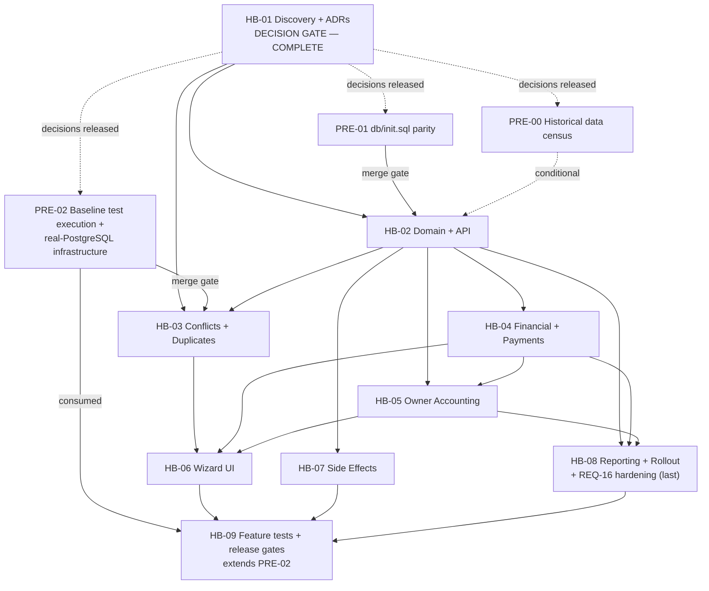

# Record Historical Booking — Planning Pack

**Status:** PLANNING COMPLETE — decisions made, no implementation performed.
**Decisions:** Every architecture decision and every cross-ticket decision has a final status —
`OWNER APPROVED`, `DEFERRED`, or `BLOCKED BY TECHNICAL PREREQUISITE`. See the
[decision record](DECISION_RATIFICATION_PACKET.md).
**Sole Project Owner and Decision Authority:** **Hozaifa Almelli** · decisions recorded 2026-07-29
**Branch:** `plan/historical-booking-feature`
**Base commit:** `8dafb5a` (Merge pull request #38 from HozaifaAlmelli/chore/sync-main-into-dev)
**Generated:** 2026-07-28

This directory contains the complete architecture and delivery plan for the **Record Historical Booking**
(`تسجيل حجز سابق`) capability: recording a booking that was agreed and completed *outside* KAZA Booking, so
that revenue, payments, owner accounting, occupancy and audit history reflect what actually happened —
without falsifying system timestamps.

> **Nothing in this directory changes application behaviour.** These are Markdown documents only. No source
> file, migration, workflow, or database record was modified in producing them.

### Three things to know before reading further

1. **One person owns this project.** Design, review and implementation are the same person. Product,
   Engineering, Finance, Security and Operations are **review lenses the owner applies**, not separate
   approvers — they never require a separate name or signature. Every decision is settled: nine
   cross-ticket decisions and twelve ADRs all carry a final status, and **nothing is waiting on a person**.
   See the [governance model](DECISION_RATIFICATION_PACKET.md#governance-model). The honest limitation is
   stated there too: there is no independent review, so the compensating controls are explicit risk
   acceptance, explicit revisit triggers, and reliability scenarios written to fail loudly.
2. **Two of the three technical prerequisites are done.**
   [`PRE-01`](DECISION_RATIFICATION_PACKET.md#pre-01--database-bootstrap-parity-for-migration-0057) — **merged**;
   `db/init.sql` now includes migration `0057`, and rollback is documented as unsafe rather than scripted.
   [`PRE-02`](DECISION_RATIFICATION_PACKET.md#pre-02--baseline-test-execution-and-postgresql-integration-infrastructure) — **merged**;
   CI provisions `postgres:16-alpine` and executes tests, and a reusable real-PostgreSQL fixture exists, so
   transaction, lock, uniqueness and `CHECK` guarantees are now verifiable. `PRE-02` was **not** delivered by
   HB-09 — HB-09 consumes and extends it.
   [`PRE-00`](DECISION_RATIFICATION_PACKET.md#pre-00--historical-data-census) — **outstanding**; a
   read-only, non-production census of existing past-dated bookings, gating pilot and migration rollout
   approval rather than any ticket's implementation. See
   [Master §21.1](00_MASTER_PLAN.md#211-prerequisites-before-any-historical-migration-lands).
3. **One canonical write contract.** `POST /api/internal/bookings/historical`, success `200 OK`. Earlier
   drafts also carried `/api/bookings/historical` and `201 Created`; both are retired
   ([Master §12.1](00_MASTER_PLAN.md#121-the-canonical-historical-contract)).

---

## Read this first

The repository audit **contradicted the original brief's central premise**. The brief assumed KAZA Booking
prevents past-dated bookings. It does not — there is no server-side past-date rule anywhere. See
[Finding F-01](01_TICKET_DISCOVERY_AND_ARCHITECTURE_DECISIONS.md#f-01--there-is-no-server-side-past-date-rule).
This reframes the feature from *unlocking a closed door* to *governing an already-open one*, and it is why
**normal-flow hardening (REQ-16) is in scope** alongside the historical flow. It is **specified** in
[HB-01 §11.2](01_TICKET_DISCOVERY_AND_ARCHITECTURE_DECISIONS.md#112-normal-flow-hardening--specification)
and **implemented and activated last** in
[HB-08 §26.1](08_TICKET_REPORTING_AUDIT_OBSERVABILITY_AND_ROLLOUT.md#261-req-16-hardening-tasks--the-last-commits-on-this-branch).

Four other findings materially shaped the plan:

| Finding | Consequence |
|---|---|
| [F-02](01_TICKET_DISCOVERY_AND_ARCHITECTURE_DECISIONS.md#f-02--completed-and-leftearly-are-invisible-to-availability) `Completed`/`LeftEarly` are excluded from availability conflict sets | The existing overlap guard is **not reusable as-is**; historical conflict detection needs its own status set |
| [F-03](01_TICKET_DISCOVERY_AND_ARCHITECTURE_DECISIONS.md#f-03--owner-payouts-are-one-row-per-booking-with-no-period-model) Owner payouts are one row per booking; no settlement-period tables | The "closed settlement" risk largely evaporates — a historical booking cannot mutate a paid statement |
| [F-05](01_TICKET_DISCOVERY_AND_ARCHITECTURE_DECISIONS.md#f-05--autocompletebookingsjob-defines-the-completed-stay-boundary) `AutoCompleteBookingsJob` defines the completed-stay boundary in `Africa/Cairo` | Gives an authoritative, repository-native date boundary instead of an invented one |
| [F-07](01_TICKET_DISCOVERY_AND_ARCHITECTURE_DECISIONS.md#f-07--financial-values-are-recomputed-not-preserved) Booking amounts are recomputed from current pricing on every edit | A historical agreed price would be silently destroyed; a **migration is required** |

---

## Documents

| # | File | Purpose |
|---|---|---|
| — | [README.md](README.md) | This index |
| — | [DECISION_RATIFICATION_PACKET.md](DECISION_RATIFICATION_PACKET.md) | **The decision record.** Governance model, the nine cross-ticket decisions, the [eight HB-02 decisions](DECISION_RATIFICATION_PACKET.md#hb-02-decisions), the three deferrals, ADR-01…ADR-12, and the three technical prerequisites `PRE-00`/`PRE-01`/`PRE-02`. Every entry has a final status |
| 00 | [00_MASTER_PLAN.md](00_MASTER_PLAN.md) | Full architecture: current & target state, invariants, date model, data model, API, validation matrix, financial/owner/payment/invoice models, reporting impact, migration, rollout, observability, risk register, decision log, ticket graph, QA strategy, DoR/DoD, open questions |
| 01 | [01_TICKET_DISCOVERY_AND_ARCHITECTURE_DECISIONS.md](01_TICKET_DISCOVERY_AND_ARCHITECTURE_DECISIONS.md) | **HB-01 — COMPLETE.** Verified current-state maps, ADRs, and the **normal-flow hardening specification**. A pure decision gate: ships no code and holds no unfinished execution task |
| 02 | [02_TICKET_HISTORICAL_BOOKING_DOMAIN_AND_API.md](02_TICKET_HISTORICAL_BOOKING_DOMAIN_AND_API.md) | **HB-02 — IMPLEMENTATION-READY.** Historical booking command, endpoint, permission, reason/source, truthful audit, direct-to-`Completed` creation, the idempotency contract, and truthful capture of `agreedAmount` |
| 03 | [03_TICKET_AVAILABILITY_CONFLICTS_AND_DUPLICATE_PROTECTION.md](03_TICKET_AVAILABILITY_CONFLICTS_AND_DUPLICATE_PROTECTION.md) | **HB-03** Historical conflict set, boundary semantics, inactive units, concurrency, duplicate protection |
| 04 | [04_TICKET_FINANCIAL_SNAPSHOT_AND_HISTORICAL_PAYMENTS.md](04_TICKET_FINANCIAL_SNAPSHOT_AND_HISTORICAL_PAYMENTS.md) | **HB-04** Protected agreed amount, repricing guard, historical payments, invoice consequences |
| 05 | [05_TICKET_OWNER_ACCOUNTING_AND_SETTLEMENT_ADJUSTMENTS.md](05_TICKET_OWNER_ACCOUNTING_AND_SETTLEMENT_ADJUSTMENTS.md) | **HB-05** Owner review, privileged override, commission snapshot, correction workflow |
| 06 | [06_TICKET_HISTORICAL_BOOKING_WIZARD_UI.md](06_TICKET_HISTORICAL_BOOKING_WIZARD_UI.md) | **HB-06** Permission-gated portal wizard including the Owner & Accounting step |
| 07 | [07_TICKET_NOTIFICATIONS_AUTOMATIONS_AND_INTEGRATIONS.md](07_TICKET_NOTIFICATIONS_AUTOMATIONS_AND_INTEGRATIONS.md) | **HB-07** Side-effect matrix, suppression-by-construction, background-job exclusion |
| 08 | [08_TICKET_REPORTING_AUDIT_OBSERVABILITY_AND_ROLLOUT.md](08_TICKET_REPORTING_AUDIT_OBSERVABILITY_AND_ROLLOUT.md) | **HB-08** Reporting impact, stay-date vs recorded-date, audit events, metrics, rollout, **and the REQ-16 hardening implementation, activated last** |
| 09 | [09_TICKET_TEST_AUTOMATION_AND_RELEASE_GATES.md](09_TICKET_TEST_AUTOMATION_AND_RELEASE_GATES.md) | **HB-09** Historical Bookings regression suites, reliability-scenario release coverage, feature release gates, rollout verification, final traceability and sign-off. **Extends the `PRE-02` baseline; does not own it** |
| 99 | [99_RELIABILITY_TEST_SCENARIOS.md](99_RELIABILITY_TEST_SCENARIOS.md) | Complete reliability/UAT scenario pack + traceability matrices + sign-off |

---

## Execution order

Tickets are dependency-ordered and the graph is **acyclic**. **HB-01 is complete** — every decision it
gates has a final status and no execution task remains inside it, so downstream work may start. It does not
execute after the prerequisites; it closed before them. It ships no code, so it cannot depend on anything
downstream.



| Step | Work | Can run in parallel? | Gate |
|---|---|---|---|
| 0 | **Planning package baseline commit** | — | Documentation only; this pack |
| — | HB-01 | Already **COMPLETE** | Decision gate. Does **not** execute after the prerequisites |
| 1 | ~~PRE-01~~ **done** · ~~PRE-02~~ **done** · PRE-00 outstanding | — | `PRE-01` and `PRE-02` are merged. `PRE-00` remains, gating pilot and migration rollout approval |
| 2 | HB-02 — **implementation-ready, no outstanding gate** | No — owns `is_historical` and the first migration | Every HB-02 decision is `OWNER APPROVED`; `PRE-01` and `PRE-02` are merged. `PRE-00` is needed only if the migration or backfill strategy depends on existing-row evidence |
| 3 | HB-04, HB-07 | Yes | Follow the stable HB-02 domain contract |
| 3 | HB-03 | Yes, alongside wave 3 | **Cannot merge until `PRE-02` is complete** ([D-TEST-01](DECISION_RATIFICATION_PACKET.md#d-test-01--postgresql-test-requirement)) |
| 4 | HB-05 | No — its migration is ordered after HB-04's | After HB-04 |
| 5 | HB-06, HB-08 | Yes | After the required backend and financial waves. HB-08's REQ-16 hardening is its **last commit**, activated after successful pilot verification |
| 6 | HB-09 | No — consumes all prior | Final feature test automation and release gates. **Extends `PRE-02`; does not own it** |

**One branch and one PR per ticket.** Suggested branch naming is given in each ticket's metadata section.

**Two cycles were removed from earlier drafts, and both fixes are load-bearing:**

1. HB-01 gated HB-02 while also needing HB-02's `is_historical` column and requiring its own change to
   deploy last. HB-01 now decides the rule; HB-08 implements and activates it. REQ-16, its acceptance
   criteria and its reliability coverage are unchanged — see
   [HB-01 §1.1](01_TICKET_DISCOVERY_AND_ARCHITECTURE_DECISIONS.md#11-why-this-ticket-ships-no-code--the-dependency-cycle-it-removes).
2. `PRE-02` gated HB-03's merge while being described as delivered through HB-09, which runs after HB-03.
   `PRE-02` is now an independent prerequisite PR; HB-09 consumes and extends it — see
   [Master §21.1a](00_MASTER_PLAN.md#211a-pre-02-is-not-delivered-by-hb-09).

**HB-01 does not appear in the execution steps above as work to be done.** It is already complete, and a
completed decision gate carries no unfinished task: the historical data census that used to sit inside it
is now [`PRE-00`](DECISION_RATIFICATION_PACKET.md#pre-00--historical-data-census).

---

## Conventions used across these documents

**Evidence labels** — every substantive claim carries exactly one:

| Label | Meaning |
|---|---|
| `CONFIRMED` | Direct repository evidence, cited with `path:line` |
| `INFERRED` | Strongly implied by multiple code paths, not directly proven |
| `PROPOSED` | Recommended target design, not current behaviour |
| `DECISION REQUIRED` | Needs a product, accounting, legal or operational decision |
| `BLOCKED` | Cannot be determined safely from the repository |

**Identifier schemes**

| Prefix | Meaning | Range |
|---|---|---|
| `REQ-nn` | Business requirement | REQ-01 … REQ-20 |
| `F-nn` | Confirmed repository finding | F-01 … F-14 |
| `ADR-nn` | Architecture decision record | ADR-01 … ADR-12 |
| `HB-nn` | Implementation ticket | HB-01 … HB-09 |
| `AC-<ticket>-nn` | Acceptance criterion | e.g. `AC-HB02-03` |
| `NAC-<ticket>-nn` | **Negative** acceptance criterion | e.g. `NAC-HB02-01` |
| `RISK-nn` | Risk register entry (master) | RISK-01 … RISK-18 |
| `RISK-HB08-nn` | Ticket-local risk refinement | RISK-HB08-01 … RISK-HB08-04 |
| `PRE-nn` | Prerequisite PR, outside the feature | PRE-00, PRE-01, PRE-02 |
| `D-INV-01` / `D-PAY-01` / `D-MIG-01` / … | Cross-ticket decision awaiting ratification | see [DECISION_RATIFICATION_PACKET.md](DECISION_RATIFICATION_PACKET.md) |
| `SC-<group>-nn` | Reliability scenario | e.g. `SC-AVAIL-04` |
| `OQ-nn` | Open question | OQ-01 … OQ-10 |

**Traceability contract** — every requirement resolves through the full chain:

```
REQ-nn → ADR-nn → HB-nn → AC-HBnn-nn / NAC-HBnn-nn → SC-GROUP-nn
```

Both directions are tabulated in
[99_RELIABILITY_TEST_SCENARIOS.md § Traceability](99_RELIABILITY_TEST_SCENARIOS.md#traceability-matrices),
which also states how each link is enumerated. Requirements, tickets and scenarios are listed individually;
acceptance criteria are covered by **contiguous range** mappings, which is unambiguous because every
`AC-HBnn-nn` and `NAC-HBnn-nn` series numbers from `01` with no gaps.

| Item | Defined | Mapped | Unmapped | Duplicates | Dangling |
|---|---|---|---|---|---|
| `REQ-nn` | 20 | 20 | 0 | 0 | 0 |
| `ADR-nn` | 12 | 12 | 0 | 0 | 0 |
| `HB-nn` | 9 | 9 | 0 | 0 | 0 |
| `AC-HBnn-nn` | 189 | 189 | 0 | 0 | 0 |
| `NAC-HBnn-nn` | 135 | 135 | 0 | 0 | 0 |
| `SC-GROUP-nn` | 159 | 159 | 0 | 0 | 0 |

---

## Scope boundaries

**In scope (v1):** completed historical stays; server-side hardening of the normal flow (specified in HB-01,
shipped and activated last by HB-08); a dedicated permission-gated command and wizard; historical conflict
detection; protected financial snapshot; historical manual payments; owner review with privileged override;
truthful audit; controlled side effects; reporting treatment.

**Conditional on ratification:** whether the historical flow creates an invoice
([D-INV-01](DECISION_RATIFICATION_PACKET.md#d-inv-01--invoice-policy), recommended:
no), and whether a payment is recorded inline, by a separate privileged command, or as evidence only
([D-PAY-01](DECISION_RATIFICATION_PACKET.md#d-pay-01--historical-payment-policy), recommended:
separate privileged command). Both need named Finance approval; `D-PAY-01` also needs Security.

**Explicitly out of scope (v1):** ongoing stays that started in the past but have not ended; bulk/CSV
historical import; date-ranged ownership history (deferred to a separate epic — see
[05 § Future epic](05_TICKET_OWNER_ACCOUNTING_AND_SETTLEMENT_ADJUSTMENTS.md#35-future-architecture-epic-date-ranged-unit-ownership));
temporary inventory holds of any kind; backdating `CreatedAt`; payment-gateway simulation; replaying past
notifications; overlapping-booking override.

---

## Audit completeness disclosure

The current-state audit behind these documents was performed by direct read-only inspection of the
repository at `8dafb5a`. An automated 36-agent parallel audit was attempted first and **largely failed** (25
of 26 agents aborted on an account session limit or connection errors); only the invoices area completed.
Every `CONFIRMED` claim in this pack was therefore verified by direct file read and carries a `path:line`
citation checked against `8dafb5a`.

Areas that remain **insufficiently audited** are recorded honestly rather than guessed. They are listed in
[01 § Known gaps](01_TICKET_DISCOVERY_AND_ARCHITECTURE_DECISIONS.md#52-known-gaps-in-this-audit) and each is
assigned to a ticket that must close it before implementation proceeds. Where a gap cannot be closed from
the repository, it is tied to a **named technical prerequisite**, never to an unassigned person.

### What a later correction pass changed

A documentation-only correction pass reconciled internal contradictions that survived the first draft. No
source file, migration, workflow or database record was touched.

| Area | What was wrong | Resolution |
|---|---|---|
| API contract | Both `/api/bookings/historical` and `/api/internal/bookings/historical` appeared as live specifications, and scenarios asserted `201 Created` | One canonical contract: `POST /api/internal/bookings/historical`, `200 OK` ([Master §12.1](00_MASTER_PLAN.md#121-the-canonical-historical-contract)) |
| Invoice and payment policy | HB-02 asserted "no invoice"; HB-04 recommended creating and issuing one. The payment field was simultaneously inline and separate | Both consolidated into [D-INV-01](DECISION_RATIFICATION_PACKET.md#d-inv-01--invoice-policy) and [D-PAY-01](DECISION_RATIFICATION_PACKET.md#d-pay-01--historical-payment-policy) with options, consequences, accepted risk and revisit triggers. Neither policy was silently chosen |
| Migration ownership | The `snapshot_*` columns were claimed by HB-04 **and** HB-05; HB-02's index and idempotency table were assigned to "HB-04's migration" | One [ownership matrix](00_MASTER_PLAN.md#111-migration-ownership-matrix): every object has exactly one owner, cross-ticket needs are dependencies |
| HB-02 decision gates | Four gates were open (`D-HB02-03` … `D-HB02-06`), and three boundaries were contradictory: idempotency was HB-02's in the matrix but deferred-and-advisory in HB-03's text; `agreedAmount` was described as HB-04's while sitting in HB-02's request; the HB-02 request carried an owner-override object that HB-05 owns | All fourteen HB-02 decisions ratified. The eight cross-cutting ones are in the [decision record](DECISION_RATIFICATION_PACKET.md#hb-02-decisions); idempotency, the financial boundary and the owner boundary each have one owner and one statement |
| Error codes | Codes were lowercase prose labels with no transport — the response envelope has no code field at all | An optional `Code` on the shared `ApiResponse` contract ([D-HB02-03](DECISION_RATIFICATION_PACKET.md#d-hb02-03--machine-readable-error-transport)), never inside `errors[0]`, with the `UPPER_SNAKE_CASE` set in [Master §12.3](00_MASTER_PLAN.md#123-error-contract--transport-and-codes) |
| Rollout | HB-01 gated HB-02 while needing HB-02's column and requiring its own change to deploy last — a cycle | HB-01 is a pure decision gate; REQ-16 implementation and activation moved to HB-08 |
| `SC-FIN-03` | Claimed to fail against current code | Reclassified as a **prospective invariant**. The update path already rejects completed bookings with `409` (`BookingService.cs:385-387`), so the claimed overwrite is not reproducible. Exactly one scenario, `SC-REG-02`, is expected to fail today |
| Counts and references | 12 broken anchors, a duplicated `SC-FIN-04` row, an HB-07 verdict count of 15 against 17 listed rows, a scenario count of "128 across 16 groups" | All corrected and re-verified: 0 broken links, 0 duplicate ids, 0 dangling references, 159 scenarios across 17 groups |
| Governance | The pack assumed a multi-party approval model: separate Product, Engineering, Finance and Security approvers, with those roles listed as missing people and decisions parked as `PENDING RATIFICATION` | Replaced with the real model — **one owner, five review lenses**. Every decision now carries `OWNER APPROVED`, `DEFERRED` or `BLOCKED BY TECHNICAL PREREQUISITE`, with risk acceptance and revisit triggers where they apply. The four unassigned-role blockers are gone; the only open items are the two technical prerequisites |
