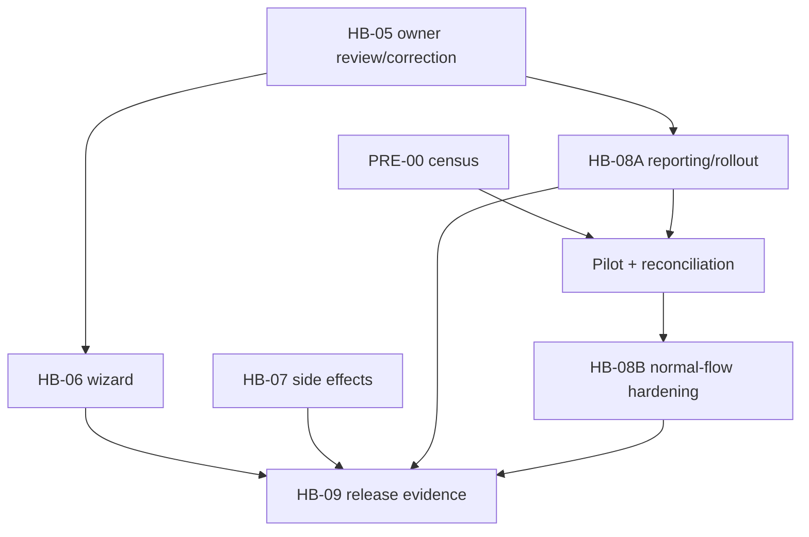

# Record Historical Booking — Planning Pack

**Status:** Remaining contracts owner-approved and closed on 2026-08-01.
**Decision authority:** Sole Project Owner, Hozaifa Almelli.
**Contract-closure base:** `3e2090ecda2a0a70197521390f2c8d2c34905eff`.
**Planning-only notice:** this closure changes Markdown only; it performs no application, schema, CI,
database, deployment or production action.

This directory is the source of truth for recording completed historical bookings, standalone historical
payment evidence, owner-attribution correction, the operator wizard, side-effect suppression, reporting and
release verification.

## Current foundation

- PRE-01 is complete. Fresh development bootstrap includes migration `0057`; automated destructive rollback
  is intentionally unavailable under Strategy D.
- PRE-02 is complete. Tests require explicit `KAZA_TEST_DB`, use PostgreSQL 16, and have `Fast`,
  `PostgreSQL` and `Concurrency` categories. CI executes backend tests and `backend-postgres`.
- PRE-00 remains a read-only operational gate before pilot or production migration rollout.
- HB-02, HB-03, HB-04A and HB-04B are the merged domain foundation.
- No migration number is reserved by planning.

## Canonical contracts

- Booking: `POST /api/internal/bookings/historical`, `200 OK`, `bookings:record_historical`.
- Payment evidence: `POST /api/internal/bookings/{bookingId:guid}/historical-payments`, `200 OK`,
  `payments:record_historical`; never live collection or invoice-linked.
- Owner review: `GET /api/internal/bookings/{bookingId:guid}/owner-attribution-review`.
- Owner correction: `POST /api/internal/bookings/{bookingId:guid}/owner-attribution-corrections`, `200 OK`,
  `bookings:correct_owner_attribution`.
- Wizard: `/admin/bookings/historical/new`, full-page, booking first and optional payment second.
- Reporting: recorded axis plus a check-in-date stay-start axis; historical evidence is separate from
  invoice-linked totals.

Manual invoice draft creation and normal issuance remain allowed. Historical commands do not create or issue
an invoice automatically. Historical payment evidence stays `invoice_id = NULL` and is never linked by issue,
reissue or orphan processing.

## Documents

| File | Purpose |
|---|---|
| [00_MASTER_PLAN.md](00_MASTER_PLAN.md) | Canonical architecture, ownership matrix, errors, dependencies and readiness |
| [01_TICKET_DISCOVERY_AND_ARCHITECTURE_DECISIONS.md](01_TICKET_DISCOVERY_AND_ARCHITECTURE_DECISIONS.md) | Completed repository discovery and hardening specification |
| [02_TICKET_HISTORICAL_BOOKING_DOMAIN_AND_API.md](02_TICKET_HISTORICAL_BOOKING_DOMAIN_AND_API.md) | HB-02 booking domain/API |
| [03_TICKET_AVAILABILITY_CONFLICTS_AND_DUPLICATE_PROTECTION.md](03_TICKET_AVAILABILITY_CONFLICTS_AND_DUPLICATE_PROTECTION.md) | HB-03 conflict and duplicate protection |
| [04_TICKET_FINANCIAL_SNAPSHOT_AND_HISTORICAL_PAYMENTS.md](04_TICKET_FINANCIAL_SNAPSHOT_AND_HISTORICAL_PAYMENTS.md) | HB-04A snapshot and HB-04B payment evidence |
| [05_TICKET_OWNER_ACCOUNTING_AND_SETTLEMENT_ADJUSTMENTS.md](05_TICKET_OWNER_ACCOUNTING_AND_SETTLEMENT_ADJUSTMENTS.md) | HB-05 review/correction, immutable chain and payout safety |
| [06_TICKET_HISTORICAL_BOOKING_WIZARD_UI.md](06_TICKET_HISTORICAL_BOOKING_WIZARD_UI.md) | HB-06 full-page, two-phase wizard |
| [07_TICKET_NOTIFICATIONS_AUTOMATIONS_AND_INTEGRATIONS.md](07_TICKET_NOTIFICATIONS_AUTOMATIONS_AND_INTEGRATIONS.md) | HB-07 no-automatic-notification policy |
| [08_TICKET_REPORTING_AUDIT_OBSERVABILITY_AND_ROLLOUT.md](08_TICKET_REPORTING_AUDIT_OBSERVABILITY_AND_ROLLOUT.md) | HB-08A reporting/rollout and separate HB-08B hardening |
| [09_TICKET_TEST_AUTOMATION_AND_RELEASE_GATES.md](09_TICKET_TEST_AUTOMATION_AND_RELEASE_GATES.md) | HB-09 dynamic contract/test gates |
| [99_RELIABILITY_TEST_SCENARIOS.md](99_RELIABILITY_TEST_SCENARIOS.md) | 159 uniquely identified reliability scenarios and traceability |
| [DECISION_RATIFICATION_PACKET.md](DECISION_RATIFICATION_PACKET.md) | Owner-approved decision record |

## Execution graph

The graph is acyclic. HB-08A and HB-08B are separate implementation PRs. HB-09 PR completion is not staging,
pilot or production approval.

## Implementation readiness

| Ticket | Endpoint | Permission | Request/response | Errors | Idempotency/concurrency | Migration/legacy | AC/NAC | Status |
|---|---|---|---|---|---|---|---|---|
| HB-05 | Final | Final | Final | Final | Dedicated store + booking lock | Explicit ownership; guarded legacy preflight | Complete | **READY** |
| HB-06 | Consumes final APIs | Final | Two-phase final | Consumes canonical registry | Separate booking/payment keys | None | Complete | **BLOCKED BY DEPENDENCY** — HB-05 implementation |
| HB-07 | No new endpoint | No new permission | No automatic dispatch | No new code | Not applicable | None | Complete | **READY** |
| HB-08 | Three reports + separate hardening | Existing analytics | Final | Final | Read-only/pilot sequencing | Views only; PRE-00 gates rollout | Complete | **BLOCKED BY DEPENDENCY** |
| HB-09 | No feature endpoint | No feature permission | Evidence contract final | Dynamic inventory | PRE-02 foundation final | None; verifies owners | Complete | **BLOCKED BY DEPENDENCY** |

## Traceability and counting

The traceability chain is `REQ → ADR → ticket → AC/NAC → scenario`. Scenario IDs remain unique and are not
renumbered by this closure. Stable-code, scenario, AC/NAC and test totals must be generated from the canonical
documents/runners; HB-09 never treats a copied number as a release invariant.

## Scope boundaries

In v1: completed historical stays, exact financial truth, standalone historical payment evidence, explicit
owner correction, no automatic notifications, two-axis reporting and later normal-flow hardening.

Out of scope: live payment collection, automatic invoice issuance, historical evidence reconciliation to an
invoice, payout correction, owner-relationship administration, bulk import, notification delivery, full
per-night revenue/occupancy redesign, production deployment and schema/data census execution in feature PRs.
